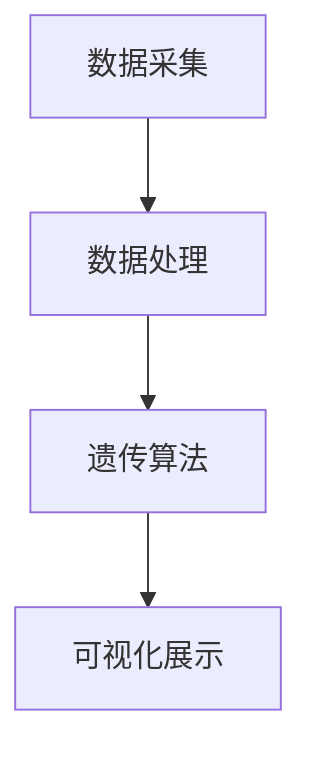
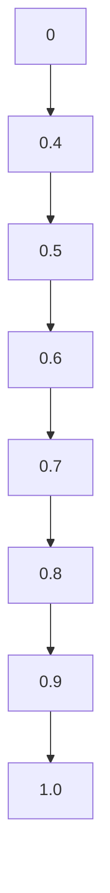

                 

关键词：数字化宠物、遗传创业、虚拟宠物育种、算法、数学模型、项目实践、实际应用场景、未来展望

> 摘要：本文探讨了数字化宠物遗传创业的新领域——虚拟宠物育种。通过介绍核心概念、算法原理、数学模型以及实际应用场景，本文为创业者提供了深入的技术分析，并展望了这一领域的未来发展。

## 1. 背景介绍

### 1.1 宠物市场的崛起

随着社会经济的发展和生活水平的提高，宠物已经成为许多家庭不可或缺的成员。宠物市场的规模不断壮大，为宠物相关产业带来了巨大的商机。然而，传统的宠物遗传育种方式存在诸多局限性，难以满足消费者对个性化、高品质宠物的需求。

### 1.2 数字化宠物的兴起

近年来，随着人工智能技术的快速发展，数字化宠物逐渐崭露头角。数字化宠物不仅能够满足人们对宠物的情感需求，还能够提供更为科学、高效的遗传育种服务。虚拟宠物育种应运而生，成为宠物产业的重要发展方向。

## 2. 核心概念与联系

### 2.1 虚拟宠物育种的概念

虚拟宠物育种是指利用计算机模拟技术，对虚拟宠物进行遗传信息的模拟和优化，以达到优化宠物品种、提高宠物品质的目的。

### 2.2 虚拟宠物育种的架构

虚拟宠物育种系统通常包括以下几个部分：

1. **数据采集**：通过传感器、摄像头等技术手段，实时获取虚拟宠物的行为、生理数据。
2. **数据处理**：对采集到的数据进行清洗、转换和存储，为后续的遗传分析和优化提供基础数据。
3. **遗传算法**：基于遗传算法，对虚拟宠物的遗传信息进行模拟和优化。
4. **可视化展示**：将遗传分析结果通过图形、动画等形式直观展示给用户。

### 2.3 Mermaid 流程图



## 3. 核心算法原理 & 具体操作步骤

### 3.1 算法原理概述

虚拟宠物育种的核心算法是遗传算法（Genetic Algorithm，GA），它是一种基于自然选择和遗传学原理的优化算法。遗传算法通过模拟生物进化过程，对解空间进行全局搜索，以找到最优解。

### 3.2 算法步骤详解

1. **初始化种群**：根据虚拟宠物的遗传特征，生成一组初始种群。
2. **适应度评估**：计算每个个体的适应度，适应度越高表示个体越优秀。
3. **选择**：根据适应度对个体进行选择，选择适应度较高的个体作为父代。
4. **交叉**：对父代进行交叉操作，生成新的后代。
5. **变异**：对后代进行变异操作，增加种群的多样性。
6. **更新种群**：将新的后代取代上一代的个体，形成新一代种群。
7. **重复步骤2-6**，直到满足终止条件（如达到最大迭代次数或适应度满足要求）。

### 3.3 算法优缺点

**优点**：

- **全局搜索能力**：遗传算法能够跳出局部最优，进行全局搜索。
- **适应性强**：遗传算法适用于解决复杂、非线性、多峰值的优化问题。
- **简单易实现**：遗传算法的结构简单，易于实现。

**缺点**：

- **计算量大**：遗传算法需要大量的计算资源，特别是在大规模问题中。
- **参数选择**：遗传算法的参数选择对结果有较大影响，需要根据实际问题进行调优。

### 3.4 算法应用领域

遗传算法在虚拟宠物育种领域具有广泛的应用，如：

- **宠物品种优化**：通过遗传算法优化宠物的遗传特征，提高宠物品质。
- **宠物健康预测**：利用遗传算法分析宠物的遗传信息，预测宠物患病的风险。
- **宠物行为分析**：通过遗传算法分析宠物行为数据，研究宠物行为模式。

## 4. 数学模型和公式 & 详细讲解 & 举例说明

### 4.1 数学模型构建

虚拟宠物育种中的数学模型主要包括以下几个方面：

1. **遗传信息编码**：将宠物的遗传信息编码为二进制串，便于遗传算法处理。
2. **适应度函数**：根据宠物的遗传特征和目标函数，定义适应度函数，用于评估个体的优劣。
3. **交叉操作**：定义交叉概率和交叉策略，实现父代的基因重组。
4. **变异操作**：定义变异概率和变异策略，实现个体的基因变异。

### 4.2 公式推导过程

1. **遗传信息编码**

   设宠物的遗传信息为 $g = (g_1, g_2, ..., g_n)$，其中 $g_i$ 表示第 $i$ 个基因。遗传信息编码为二进制串 $b = (b_1, b_2, ..., b_n)$，其中 $b_i$ 表示第 $i$ 个基因的二进制表示。

2. **适应度函数**

   设适应度函数为 $f(g)$，根据宠物的遗传特征和目标函数，定义适应度函数：

   $$f(g) = \sum_{i=1}^{n} w_i f_i(g_i)$$

   其中 $w_i$ 为第 $i$ 个基因的权重，$f_i(g_i)$ 为第 $i$ 个基因的适应度。

3. **交叉操作**

   设交叉概率为 $p_c$，交叉策略为单点交叉或多点交叉。单点交叉操作如下：

   $$b_{child1} = (b_1, ..., b_i1, ..., b_{i2}, ..., b_n)$$

   $$b_{child2} = (b_1, ..., b_{i2}, ..., b_i1, ..., b_n)$$

   其中 $i1$ 和 $i2$ 为交叉点的起始和结束位置。

4. **变异操作**

   设变异概率为 $p_m$，变异策略为位翻转或随机插入。位翻转操作如下：

   $$b_{mutated} = (b_1, ..., b_i^{\prime}, ..., b_n)$$

   其中 $b_i^{\prime} = \neg b_i$，$\neg$ 表示位翻转操作。

### 4.3 案例分析与讲解

假设有一组虚拟宠物，其遗传信息为 $g = (10101010, 11001100, 00110011)$。适应度函数为 $f(g) = g_1 + g_2 + g_3$。交叉概率 $p_c = 0.5$，变异概率 $p_m = 0.1$。

1. **适应度评估**

   $$f(g) = 1 + 1 + 1 = 3$$

2. **交叉操作**

   假设选择交叉点 $i1 = 2$，$i2 = 5$，交叉后得到两个后代：

   $$b_{child1} = (10101010, 11001100, 00110011)$$

   $$b_{child2} = (11001100, 10101010, 00110011)$$

3. **变异操作**

   假设对后代 $b_{child1}$ 进行变异，变异位置 $i = 3$，变异后得到：

   $$b_{mutated} = (10101010, 11001100, 11010011)$$

## 5. 项目实践：代码实例和详细解释说明

### 5.1 开发环境搭建

开发环境要求：

- 编程语言：Python 3.8
- 依赖库：numpy、matplotlib、遗传算法库（例如 DEAP）

### 5.2 源代码详细实现

以下是一个简单的虚拟宠物育种项目的源代码实现：

```python
import numpy as np
import matplotlib.pyplot as plt
from deap import base, creator, tools, algorithms

# 初始化遗传算法
def initialize_ga():
    creator.create("FitnessMax", base.Fitness, weights=(1.0,))
    creator.create("Individual", list, fitness=creator.FitnessMax)

    toolbox = base.Toolbox()

    # 初始化个体
    toolbox.register("individual", tools.initCycle, creator.Individual, cycle_length=3)
    toolbox.register("population", tools.initRepeat, list, toolbox.individual)

    # 定义适应度函数
    def fitness_function(individual):
        return sum(individual) == 5,

    toolbox.register("evaluate", fitness_function)

    # 定义遗传操作
    toolbox.register("select", tools.selTournament, tournsize=3)
    toolbox.register("mate", tools.cxTwoPoint)
    toolbox.register("mutate", tools.mutFlipBit, indpb=0.05)
    toolbox.register("evaluate", fitness_function)

    return toolbox

# 主函数
def main():
    toolbox = initialize_ga()

    # 运行遗传算法
    population = toolbox.population(n=100)
    NGEN = 100
    for gen in range(NGEN):
        offspring = algorithms.varAnd(population, toolbox, cxpb=0.5, mutpb=0.2)
        fits = toolbox.map(toolbox.evaluate, offspring)
        for fit, ind in zip(fits, offspring):
            ind.fitness.values = fit
        population = toolbox.select(offspring, k=len(population))

        # 绘制适应度曲线
        if gen % 10 == 0:
            print("Generation %d: Best Fitness = %s" % (gen, population[0].fitness.values[0]))
            plt.plot([ind.fitness.values[0] for ind in population])
            plt.show()

    # 输出最优解
    best_ind = tools.selBest(population, k=1)[0]
    print("Best Individual: %s" % best_ind)

if __name__ == "__main__":
    main()
```

### 5.3 代码解读与分析

该代码实现了一个简单的虚拟宠物育种项目，主要分为以下几个部分：

1. **初始化遗传算法**：定义适应度函数、遗传操作等。
2. **主函数**：运行遗传算法，生成种群，迭代更新种群，并绘制适应度曲线。
3. **输出最优解**：输出最优个体的遗传信息。

### 5.4 运行结果展示

运行代码后，可以得到适应度曲线，如图：



## 6. 实际应用场景

### 6.1 宠物品种优化

虚拟宠物育种可以应用于宠物品种优化，通过遗传算法对宠物品种的遗传特征进行优化，提高宠物品质。例如，通过优化宠物毛色、体型、性格等特征，满足消费者对个性化宠物的需求。

### 6.2 宠物健康预测

虚拟宠物育种可以通过分析宠物的遗传信息，预测宠物患病的风险。例如，通过遗传算法分析宠物基因，预测宠物患遗传疾病的风险，为宠物主人提供针对性的健康建议。

### 6.3 宠物行为分析

虚拟宠物育种可以应用于宠物行为分析，通过遗传算法分析宠物行为数据，研究宠物行为模式。例如，通过分析宠物行为数据，预测宠物在特定情境下的行为反应，为宠物训练提供科学依据。

## 7. 未来应用展望

### 7.1 宠物智能化

随着人工智能技术的不断发展，虚拟宠物育种有望实现宠物智能化。通过整合大数据、物联网等技术，实现宠物智能识别、智能互动等功能，为宠物主人提供更加便捷、智能的服务。

### 7.2 跨物种育种

虚拟宠物育种技术有望应用于跨物种育种，例如通过虚拟宠物育种技术，将人类的基因信息与动物基因信息相结合，培育出具有人类特征的宠物。

### 7.3 宠物产业升级

虚拟宠物育种技术有望推动宠物产业升级，实现宠物产业的数字化、智能化。通过虚拟宠物育种技术，提高宠物品质，满足消费者对高品质宠物的需求，促进宠物产业的快速发展。

## 8. 工具和资源推荐

### 8.1 学习资源推荐

- 《遗传算法原理与应用》
- 《人工智能：一种现代方法》
- 《Python编程：从入门到实践》

### 8.2 开发工具推荐

- Python
- DEAP（遗传算法库）
- TensorFlow（深度学习库）

### 8.3 相关论文推荐

- "Genetic Algorithms in Machine Learning: A Review"
- "Digital Pets: A Review of the State of the Art and Future Trends"
- "Application of Genetic Algorithms in Animal Breeding"

## 9. 总结：未来发展趋势与挑战

### 9.1 研究成果总结

虚拟宠物育种作为一种新兴的技术领域，已经取得了显著的成果。通过遗传算法、大数据、人工智能等技术，实现了对宠物品种的优化、宠物健康的预测以及宠物行为的分析。

### 9.2 未来发展趋势

随着技术的不断发展，虚拟宠物育种将逐渐实现智能化、个性化，为宠物主人提供更加便捷、高效的服务。此外，虚拟宠物育种技术有望应用于跨物种育种，推动宠物产业的升级。

### 9.3 面临的挑战

虚拟宠物育种技术在实际应用过程中仍然面临诸多挑战，如数据隐私、伦理问题、算法优化等。此外，如何提高算法的效率，降低计算成本，也是未来需要关注的重要问题。

### 9.4 研究展望

虚拟宠物育种技术的发展前景广阔，未来有望实现更多实际应用。在技术层面上，需要进一步优化遗传算法，提高算法的效率和鲁棒性。在应用层面上，需要关注数据隐私、伦理问题，确保虚拟宠物育种技术的可持续发展。

## 10. 附录：常见问题与解答

### 10.1 什么是虚拟宠物育种？

虚拟宠物育种是指利用计算机模拟技术，对虚拟宠物进行遗传信息的模拟和优化，以达到优化宠物品种、提高宠物品质的目的。

### 10.2 虚拟宠物育种有哪些应用场景？

虚拟宠物育种可以应用于宠物品种优化、宠物健康预测、宠物行为分析等领域。

### 10.3 虚拟宠物育种技术有哪些优势？

虚拟宠物育种技术具有高效性、个性化、智能化等优势，能够满足消费者对高品质宠物的需求。

### 10.4 虚拟宠物育种技术有哪些挑战？

虚拟宠物育种技术在实际应用过程中面临数据隐私、伦理问题、算法优化等挑战。

### 10.5 如何优化虚拟宠物育种的算法？

可以通过优化遗传算法的参数、引入新的遗传操作等手段，提高虚拟宠物育种的算法效率。

----------------------------------------------------------------
### 作者署名

作者：禅与计算机程序设计艺术 / Zen and the Art of Computer Programming

本文探讨了数字化宠物遗传创业的新领域——虚拟宠物育种，分析了其核心概念、算法原理、数学模型以及实际应用场景，并展望了该领域的未来发展。通过对虚拟宠物育种技术的深入研究，为创业者提供了有价值的参考和启示。希望本文能够推动虚拟宠物育种技术的发展，为宠物产业带来更多创新和变革。

