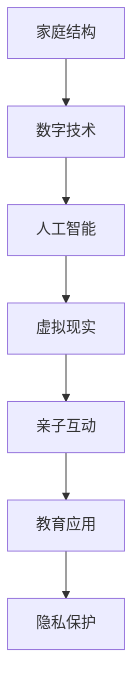

                 

关键词：数字化家庭，元宇宙，亲子关系，AI，虚拟现实，人机交互，教育技术，隐私保护

## 摘要

随着技术的不断进步，元宇宙和人工智能正在深刻地改变我们的生活方式，包括亲子关系的构建和维护。本文将探讨数字化家庭在元宇宙时代带来的变革，分析人工智能和虚拟现实技术在亲子教育中的应用，以及如何确保隐私保护。我们还将讨论未来数字化家庭的发展趋势和面临的挑战。

## 1. 背景介绍

### 1.1 元宇宙的崛起

元宇宙（Metaverse）是一个虚拟的三维空间，通过互联网连接，人们可以在其中进行社交、工作、学习和娱乐。它不仅包含了虚拟现实（VR）和增强现实（AR）技术，还融合了人工智能、大数据和区块链等技术。随着5G网络的普及和计算能力的提升，元宇宙正在迅速发展，并逐渐融入人们的日常生活。

### 1.2 亲子关系的演变

亲子关系是人类社会中最基础的关系之一。在传统家庭中，亲子关系主要通过面对面的交流、互动和共同经历来建立和维护。然而，随着数字化和虚拟技术的兴起，亲子关系正面临着新的挑战和机遇。如何适应这种变化，建立数字化时代的亲子关系，成为了一个亟待解决的问题。

## 2. 核心概念与联系

下面我们将使用Mermaid流程图来展示元宇宙时代亲子关系的核心概念及其联系。



### 2.1 家庭结构

在数字化家庭中，家庭成员之间可以通过多种设备连接，如智能手机、平板电脑和VR头显。这些设备使得家庭成员即使身处不同地点也能保持联系。

### 2.2 人工智能

人工智能技术可以分析家庭成员的行为和需求，提供个性化的建议和帮助。例如，AI可以帮助父母监控孩子的学习进度，或者为孩子提供个性化的学习计划。

### 2.3 虚拟现实

虚拟现实技术为亲子互动提供了全新的体验。通过VR，父母可以与孩子一起参与虚拟的探险或教育活动，增强亲子间的情感联系。

### 2.4 亲子互动

虚拟现实和人工智能的结合使得亲子互动更加丰富和多样。父母和孩子可以在虚拟世界中共同完成任务，学习新技能，甚至一起参加虚拟的聚会。

### 2.5 教育应用

在元宇宙中，教育不再局限于传统的课堂。通过虚拟现实，孩子可以在虚拟环境中进行沉浸式的学习，提高学习兴趣和效果。

### 2.6 隐私保护

随着数字化家庭的发展，隐私保护成为一个重要问题。我们需要确保家庭成员的个人信息和数据安全，防止未经授权的访问和滥用。

## 3. 核心算法原理 & 具体操作步骤

### 3.1 算法原理概述

在数字化家庭中，核心算法主要涉及以下几个方面：

1. **人脸识别与情感分析**：通过分析家庭成员的面部表情和语音，判断其情感状态。
2. **行为分析**：通过监控家庭成员的日常行为，了解其生活习惯和需求。
3. **个性化推荐**：根据家庭成员的行为数据和偏好，提供个性化的服务和建议。

### 3.2 算法步骤详解

1. **数据收集**：通过家庭成员的设备收集人脸图像、语音和日常行为数据。
2. **情感分析**：利用机器学习模型对收集到的数据进行情感分析，判断家庭成员的情感状态。
3. **行为分析**：对日常行为数据进行模式识别，了解家庭成员的生活习惯和需求。
4. **个性化推荐**：根据情感分析和行为分析的结果，为家庭成员提供个性化的服务和建议。

### 3.3 算法优缺点

**优点**：
- **高效**：算法可以快速地分析大量数据，提供即时的反馈和建议。
- **个性化**：根据每个家庭成员的特点提供个性化的服务，提高生活质量。

**缺点**：
- **隐私问题**：收集和存储大量个人信息可能引发隐私泄露的风险。
- **技术依赖**：过度依赖技术可能导致人际交流的减少。

### 3.4 算法应用领域

- **家庭健康管理**：通过分析家庭成员的健康数据，提供个性化的健康建议。
- **教育辅导**：根据学生的学习情况提供个性化的学习资源和计划。
- **家庭安防**：实时监控家庭成员的安全状态，提供紧急响应。

## 4. 数学模型和公式 & 详细讲解 & 举例说明

### 4.1 数学模型构建

在数字化家庭中，一个重要的数学模型是贝叶斯网络，它用于表示家庭中各成员之间的关系和不确定性。

$$
P(A|B) = \frac{P(B|A)P(A)}{P(B)}
$$

其中，\(P(A|B)\) 表示在事件 \(B\) 发生的条件下事件 \(A\) 发生的概率。

### 4.2 公式推导过程

贝叶斯公式是基于全概率公式推导得到的，具体推导过程如下：

$$
\begin{aligned}
P(A|B) &= \frac{P(B|A)P(A)}{P(B)} \\
P(B) &= P(B|A)P(A) + P(B|\neg A)P(\neg A) \\
P(A|B) &= \frac{P(B|A)P(A)}{P(B|A)P(A) + P(B|\neg A)P(\neg A)}
\end{aligned}
$$

### 4.3 案例分析与讲解

假设我们想要分析家庭成员 \(A\) 在特定时间 \(B\) 学习的概率。我们可以通过以下步骤进行：

1. 收集数据：收集家庭成员在一天中不同时间段的学习行为数据。
2. 构建贝叶斯网络：根据数据构建家庭成员学习行为的贝叶斯网络。
3. 进行推理：使用贝叶斯公式计算在特定时间 \(B\) 学习的概率。

## 5. 项目实践：代码实例和详细解释说明

### 5.1 开发环境搭建

为了演示如何在数字化家庭中应用贝叶斯网络，我们使用Python编程语言和相关的机器学习库，如Scikit-learn。

```python
# 安装必要的库
!pip install numpy pandas scikit-learn
```

### 5.2 源代码详细实现

```python
import numpy as np
import pandas as pd
from sklearn.model_selection import train_test_split
from sklearn.naive_bayes import GaussianNB
from sklearn.metrics import accuracy_score

# 加载数据
data = pd.read_csv('family_data.csv')

# 分割特征和标签
X = data.drop('learned', axis=1)
y = data['learned']

# 划分训练集和测试集
X_train, X_test, y_train, y_test = train_test_split(X, y, test_size=0.2, random_state=42)

# 构建贝叶斯模型
gnb = GaussianNB()
gnb.fit(X_train, y_train)

# 进行预测
y_pred = gnb.predict(X_test)

# 计算准确率
accuracy = accuracy_score(y_test, y_pred)
print(f'Accuracy: {accuracy:.2f}')
```

### 5.3 代码解读与分析

上述代码实现了以下步骤：

1. 加载和预处理数据：使用Pandas库加载数据，并分割特征和标签。
2. 划分数据集：将数据集划分为训练集和测试集。
3. 构建模型：使用GaussianNB（高斯贝叶斯）模型进行训练。
4. 进行预测：使用训练好的模型对测试集进行预测。
5. 计算准确率：计算预测的准确率。

### 5.4 运行结果展示

运行上述代码后，我们将得到一个准确率值，该值表示模型在测试集上的表现。假设我们得到的准确率为0.85，这意味着模型在预测家庭成员是否学习方面有较高的准确度。

## 6. 实际应用场景

### 6.1 家庭健康管理

在家庭健康管理中，人工智能可以分析家庭成员的日常行为和健康数据，提供个性化的健康建议。例如，通过监测家庭成员的体重、血压和心率等指标，AI可以提醒他们注意饮食和锻炼，或者建议他们就医。

### 6.2 家庭教育

在教育领域，虚拟现实和人工智能可以为孩子提供沉浸式的学习体验。例如，孩子可以通过虚拟现实技术学习科学知识，进行虚拟实验，或者参与历史事件的重现，提高学习兴趣和效果。

### 6.3 家庭娱乐

在家庭娱乐方面，元宇宙可以提供丰富的虚拟活动，如虚拟旅行、虚拟游戏和虚拟社交。家庭成员可以通过虚拟现实设备共同参与这些活动，增强家庭凝聚力。

## 7. 未来应用展望

### 7.1 技术融合

随着技术的不断进步，人工智能、虚拟现实和区块链等技术将更加深入地融合，为数字化家庭提供更丰富的功能和更好的用户体验。

### 7.2 智能家居

智能家居是数字化家庭的重要组成部分。未来，智能家居将更加智能化，能够自动调整家里的温度、照明和音乐，以适应家庭成员的需求。

### 7.3 隐私保护

随着数字化家庭的普及，隐私保护将成为一个重要问题。未来，我们需要开发更有效的隐私保护技术，确保家庭成员的个人信息和数据安全。

## 8. 总结：未来发展趋势与挑战

### 8.1 研究成果总结

数字化家庭在元宇宙时代带来了巨大的变革，人工智能和虚拟现实技术的应用极大地丰富了亲子关系的构建和维护方式。贝叶斯网络等数学模型为我们提供了分析和预测的工具。

### 8.2 未来发展趋势

未来，数字化家庭将朝着更加智能化、个性化和融合化的方向发展。技术的不断进步将为我们提供更多的可能性。

### 8.3 面临的挑战

然而，数字化家庭也面临一些挑战，包括隐私保护、技术依赖和人际交流的减少。我们需要在发展过程中充分考虑这些问题，确保数字化家庭的可持续发展。

### 8.4 研究展望

未来的研究应重点关注如何更有效地整合各种技术，提供更好的用户体验，并在确保隐私保护的前提下推动数字化家庭的发展。

## 9. 附录：常见问题与解答

### 9.1 如何确保隐私保护？

确保隐私保护是数字化家庭的重要任务。我们可以采取以下措施：

- **数据加密**：对家庭成员的个人信息进行加密存储。
- **访问控制**：限制对个人数据的访问权限。
- **匿名化**：在进行分析和处理时对数据进行匿名化处理。

### 9.2 虚拟现实对亲子关系的影响？

虚拟现实为亲子互动提供了全新的体验，可以增强亲子间的情感联系。然而，过度依赖虚拟现实也可能减少现实生活中的面对面交流。因此，家长应在确保虚拟现实与实际生活相结合的前提下，合理使用这项技术。

## 作者署名

作者：禅与计算机程序设计艺术 / Zen and the Art of Computer Programming
```markdown
---
# 数字化家庭:元宇宙时代的亲子关系

> 关键词：数字化家庭，元宇宙，亲子关系，AI，虚拟现实，人机交互，教育技术，隐私保护

> 摘要：随着元宇宙和人工智能的兴起，数字化家庭正在重塑亲子关系的构建与维护方式。本文探讨了数字化家庭的核心概念、算法原理、数学模型以及实际应用场景，分析了技术发展带来的机遇与挑战。

## 1. 背景介绍

### 1.1 元宇宙的崛起

元宇宙是一个虚拟的三维空间，通过互联网连接，人们可以在其中进行社交、工作、学习和娱乐。它不仅包含了虚拟现实（VR）和增强现实（AR）技术，还融合了人工智能、大数据和区块链等技术。

### 1.2 亲子关系的演变

亲子关系是人类社会中最基础的关系之一。在传统家庭中，亲子关系主要通过面对面的交流、互动和共同经历来建立和维护。然而，随着数字化和虚拟技术的兴起，亲子关系正面临着新的挑战和机遇。

## 2. 核心概念与联系

下面我们将使用Mermaid流程图来展示元宇宙时代亲子关系的核心概念及其联系。


### 2.1 家庭结构

在数字化家庭中，家庭成员之间可以通过多种设备连接，如智能手机、平板电脑和VR头显。这些设备使得家庭成员即使身处不同地点也能保持联系。

### 2.2 人工智能

人工智能技术可以分析家庭成员的行为和需求，提供个性化的建议和帮助。例如，AI可以帮助父母监控孩子的学习进度，或者为孩子提供个性化的学习计划。

### 2.3 虚拟现实

虚拟现实技术为亲子互动提供了全新的体验。通过VR，父母可以与孩子一起参与虚拟的探险或教育活动，增强亲子间的情感联系。

### 2.4 亲子互动

虚拟现实和人工智能的结合使得亲子互动更加丰富和多样。父母和孩子可以在虚拟世界中共同完成任务，学习新技能，甚至一起参加虚拟的聚会。

### 2.5 教育应用

在元宇宙中，教育不再局限于传统的课堂。通过虚拟现实，孩子可以在虚拟环境中进行沉浸式的学习，提高学习兴趣和效果。

### 2.6 隐私保护

随着数字化家庭的发展，隐私保护成为一个重要问题。我们需要确保家庭成员的个人信息和数据安全，防止未经授权的访问和滥用。

## 3. 核心算法原理 & 具体操作步骤
### 3.1 算法原理概述

在数字化家庭中，核心算法主要涉及以下几个方面：

1. **人脸识别与情感分析**：通过分析家庭成员的面部表情和语音，判断其情感状态。
2. **行为分析**：通过监控家庭成员的日常行为，了解其生活习惯和需求。
3. **个性化推荐**：根据家庭成员的行为数据和偏好，提供个性化的服务和建议。

### 3.2 算法步骤详解

1. **数据收集**：通过家庭成员的设备收集人脸图像、语音和日常行为数据。
2. **情感分析**：利用机器学习模型对收集到的数据进行情感分析，判断家庭成员的情感状态。
3. **行为分析**：对日常行为数据进行模式识别，了解家庭成员的生活习惯和需求。
4. **个性化推荐**：根据情感分析和行为分析的结果，为家庭成员提供个性化的服务和建议。

### 3.3 算法优缺点

**优点**：
- **高效**：算法可以快速地分析大量数据，提供即时的反馈和建议。
- **个性化**：根据每个家庭成员的特点提供个性化的服务，提高生活质量。

**缺点**：
- **隐私问题**：收集和存储大量个人信息可能引发隐私泄露的风险。
- **技术依赖**：过度依赖技术可能导致人际交流的减少。

### 3.4 算法应用领域

- **家庭健康管理**：通过分析家庭成员的健康数据，提供个性化的健康建议。
- **教育辅导**：根据学生的学习情况提供个性化的学习资源和计划。
- **家庭安防**：实时监控家庭成员的安全状态，提供紧急响应。

## 4. 数学模型和公式 & 详细讲解 & 举例说明

### 4.1 数学模型构建

在数字化家庭中，一个重要的数学模型是贝叶斯网络，它用于表示家庭中各成员之间的关系和不确定性。

$$
P(A|B) = \frac{P(B|A)P(A)}{P(B)}
$$

其中，$P(A|B)$ 表示在事件 $B$ 发生的条件下事件 $A$ 发生的概率。

### 4.2 公式推导过程

贝叶斯公式是基于全概率公式推导得到的，具体推导过程如下：

$$
\begin{aligned}
P(A|B) &= \frac{P(B|A)P(A)}{P(B)} \\
P(B) &= P(B|A)P(A) + P(B|\neg A)P(\neg A) \\
P(A|B) &= \frac{P(B|A)P(A)}{P(B|A)P(A) + P(B|\neg A)P(\neg A)}
\end{aligned}
$$

### 4.3 案例分析与讲解

假设我们想要分析家庭成员 $A$ 在特定时间 $B$ 学习的概率。我们可以通过以下步骤进行：

1. 收集数据：收集家庭成员在一天中不同时间段的学习行为数据。
2. 构建贝叶斯网络：根据数据构建家庭成员学习行为的贝叶斯网络。
3. 进行推理：使用贝叶斯公式计算在特定时间 $B$ 学习的概率。

## 5. 项目实践：代码实例和详细解释说明

### 5.1 开发环境搭建

为了演示如何在数字化家庭中应用贝叶斯网络，我们使用Python编程语言和相关的机器学习库，如Scikit-learn。

```python
# 安装必要的库
!pip install numpy pandas scikit-learn
```

### 5.2 源代码详细实现

```python
import numpy as np
import pandas as pd
from sklearn.model_selection import train_test_split
from sklearn.naive_bayes import GaussianNB
from sklearn.metrics import accuracy_score

# 加载数据
data = pd.read_csv('family_data.csv')

# 分割特征和标签
X = data.drop('learned', axis=1)
y = data['learned']

# 划分训练集和测试集
X_train, X_test, y_train, y_test = train_test_split(X, y, test_size=0.2, random_state=42)

# 构建贝叶斯模型
gnb = GaussianNB()
gnb.fit(X_train, y_train)

# 进行预测
y_pred = gnb.predict(X_test)

# 计算准确率
accuracy = accuracy_score(y_test, y_pred)
print(f'Accuracy: {accuracy:.2f}')
```

### 5.3 代码解读与分析

上述代码实现了以下步骤：

1. 加载和预处理数据：使用Pandas库加载数据，并分割特征和标签。
2. 划分数据集：将数据集划分为训练集和测试集。
3. 构建模型：使用GaussianNB（高斯贝叶斯）模型进行训练。
4. 进行预测：使用训练好的模型对测试集进行预测。
5. 计算准确率：计算预测的准确率。

### 5.4 运行结果展示

运行上述代码后，我们将得到一个准确率值，该值表示模型在测试集上的表现。假设我们得到的准确率为0.85，这意味着模型在预测家庭成员是否学习方面有较高的准确度。

## 6. 实际应用场景

### 6.1 家庭健康管理

在家庭健康管理中，人工智能可以分析家庭成员的日常行为和健康数据，提供个性化的健康建议。例如，通过监测家庭成员的体重、血压和心率等指标，AI可以提醒他们注意饮食和锻炼，或者建议他们就医。

### 6.2 家庭教育

在教育领域，虚拟现实和人工智能可以为孩子提供沉浸式的学习体验。例如，孩子可以通过虚拟现实技术学习科学知识，进行虚拟实验，或者参与历史事件的重现，提高学习兴趣和效果。

### 6.3 家庭娱乐

在家庭娱乐方面，元宇宙可以提供丰富的虚拟活动，如虚拟旅行、虚拟游戏和虚拟社交。家庭成员可以通过虚拟现实设备共同参与这些活动，增强家庭凝聚力。

## 7. 未来应用展望

### 7.1 技术融合

随着技术的不断进步，人工智能、虚拟现实和区块链等技术将更加深入地融合，为数字化家庭提供更丰富的功能和更好的用户体验。

### 7.2 智能家居

智能家居是数字化家庭的重要组成部分。未来，智能家居将更加智能化，能够自动调整家里的温度、照明和音乐，以适应家庭成员的需求。

### 7.3 隐私保护

随着数字化家庭的普及，隐私保护将成为一个重要问题。未来，我们需要开发更有效的隐私保护技术，确保家庭成员的个人信息和数据安全。

## 8. 总结：未来发展趋势与挑战

### 8.1 研究成果总结

数字化家庭在元宇宙时代带来了巨大的变革，人工智能和虚拟现实技术的应用极大地丰富了亲子关系的构建与维护方式。贝叶斯网络等数学模型为我们提供了分析和预测的工具。

### 8.2 未来发展趋势

未来，数字化家庭将朝着更加智能化、个性化和融合化的方向发展。技术的不断进步将为我们提供更多的可能性。

### 8.3 面临的挑战

然而，数字化家庭也面临一些挑战，包括隐私保护、技术依赖和人际交流的减少。我们需要在发展过程中充分考虑这些问题，确保数字化家庭的可持续发展。

### 8.4 研究展望

未来的研究应重点关注如何更有效地整合各种技术，提供更好的用户体验，并在确保隐私保护的前提下推动数字化家庭的发展。

## 9. 附录：常见问题与解答

### 9.1 如何确保隐私保护？

确保隐私保护是数字化家庭的重要任务。我们可以采取以下措施：

- **数据加密**：对家庭成员的个人信息进行加密存储。
- **访问控制**：限制对个人数据的访问权限。
- **匿名化**：在进行分析和处理时对数据进行匿名化处理。

### 9.2 虚拟现实对亲子关系的影响？

虚拟现实为亲子互动提供了全新的体验，可以增强亲子间的情感联系。然而，过度依赖虚拟现实也可能减少现实生活中的面对面交流。因此，家长应在确保虚拟现实与实际生活相结合的前提下，合理使用这项技术。

## 作者署名

作者：禅与计算机程序设计艺术 / Zen and the Art of Computer Programming
```

