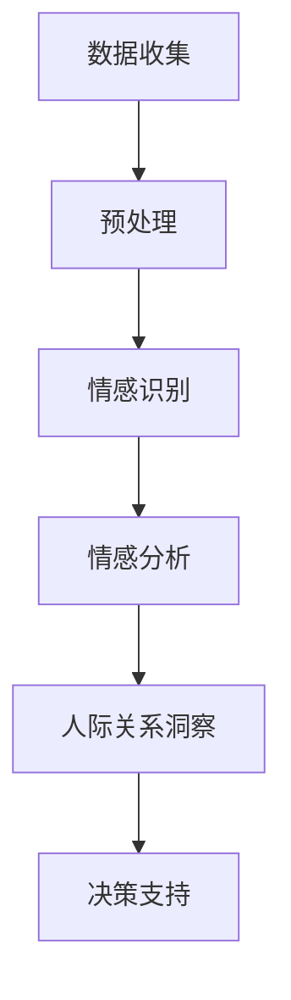

                 

关键词：数字化情感分析，AI技术，人际关系洞察，创业，技术语言，专业深度

> 摘要：本文旨在探讨数字化情感分析在AI驱动下如何为创业提供人际关系洞察。我们将从背景介绍、核心概念、算法原理、数学模型、项目实践、实际应用场景、工具资源推荐以及未来发展趋势等方面，系统性地阐述这一领域的研究现状和潜在价值。

## 1. 背景介绍

在数字化时代，数据已成为新的资源，而情感分析作为自然语言处理的重要分支，正逐渐成为企业和创业领域的关键技术。情感分析通过分析文本中的情感倾向，可以帮助企业了解客户情绪、提升用户体验、优化产品和服务。随着人工智能（AI）技术的发展，情感分析的应用范围不断扩大，从简单的文本分类到复杂的情感识别和情感建模，都取得了显著的成果。

数字化情感分析在创业领域的重要性不可小觑。创业者往往需要在有限的资源和时间内，快速了解市场动态和用户需求，从而制定有效的商业策略。情感分析技术能够帮助企业：

- **市场调研**：通过分析社交媒体和评论，了解用户对产品或服务的情感倾向。
- **品牌建设**：监控品牌形象，及时应对负面情绪，维护品牌声誉。
- **客户关系管理**：洞察客户需求，提供个性化服务，提高客户满意度。
- **产品创新**：基于用户情感反馈，优化产品设计和功能。

本文将围绕数字化情感分析的核心概念、算法原理、数学模型和项目实践等方面展开讨论，以期为创业者提供实用的技术洞察。

## 2. 核心概念与联系

### 2.1 情感分析的定义

情感分析（Sentiment Analysis），也称为意见挖掘或情感识别，是自然语言处理（NLP）中的一个重要任务。其目的是从文本中自动识别和提取人们对特定对象（如产品、服务、事件等）的情感倾向。情感分析通常分为三个层次：主题识别、情感极性识别和情感强度识别。

### 2.2 AI在情感分析中的应用

AI技术，特别是深度学习模型，为情感分析提供了强大的工具。通过训练大量标注数据，深度学习模型能够自动识别文本中的情感倾向。常见的AI模型包括卷积神经网络（CNN）、循环神经网络（RNN）和长短时记忆网络（LSTM）。

### 2.3 人际关系洞察与情感分析的联系

人际关系洞察是情感分析的一个重要应用方向。通过情感分析技术，可以揭示人与人之间的情感互动，帮助创业者理解客户需求、市场动态和团队协作。以下是人际关系洞察与情感分析的关键联系：

- **用户需求分析**：通过分析用户评论和反馈，了解用户对产品的情感反应，发现潜在需求。
- **市场趋势预测**：分析社交媒体上的情感数据，预测市场趋势和消费者偏好。
- **团队协作优化**：通过情感分析团队内部沟通，提升团队协作效率和凝聚力。
- **品牌关系管理**：监控品牌在社交媒体上的情感倾向，维护品牌形象和客户关系。

### 2.4 Mermaid流程图

下面是数字化情感分析架构的Mermaid流程图：



## 3. 核心算法原理 & 具体操作步骤

### 3.1 算法原理概述

数字化情感分析的核心算法通常是基于深度学习的模型。以下是一些常见的算法原理：

- **卷积神经网络（CNN）**：通过卷积层和池化层提取文本特征，实现情感分类。
- **循环神经网络（RNN）**：通过循环结构处理序列数据，适用于情感强度识别。
- **长短时记忆网络（LSTM）**：对RNN的改进，能够更好地处理长序列数据。

### 3.2 算法步骤详解

1. **数据收集**：从社交媒体、评论网站、论坛等渠道收集文本数据。
2. **数据预处理**：包括文本清洗、分词、去停用词等步骤，为后续处理做准备。
3. **特征提取**：使用词嵌入（Word Embedding）技术将文本转换为向量表示。
4. **模型训练**：使用标记数据训练深度学习模型，例如CNN、RNN或LSTM。
5. **情感识别**：通过训练好的模型对新的文本进行情感分类。
6. **情感分析**：对情感分类结果进行分析，提取情感倾向和强度。
7. **人际关系洞察**：结合情感分析结果，揭示人际关系和互动模式。

### 3.3 算法优缺点

- **优点**：
  - 高效：深度学习模型能够快速处理大量文本数据。
  - 准确：通过大量标注数据训练，模型具有较高的准确率。
  - 自动化：能够自动化识别和分类情感，减少人工工作量。

- **缺点**：
  - 数据依赖：需要大量高质量的标注数据。
  - 泛化能力：对新词、新表达的理解能力有限。
  - 资源消耗：训练深度学习模型需要大量计算资源。

### 3.4 算法应用领域

数字化情感分析在多个领域具有广泛的应用：

- **市场研究**：通过情感分析，了解消费者对产品或服务的情感反应，指导市场策略。
- **客户服务**：分析客户反馈，优化客户体验，提升客户满意度。
- **品牌管理**：监控品牌在社交媒体上的情感倾向，维护品牌形象。
- **心理健康**：分析社交媒体上的情感数据，预测和干预心理健康问题。
- **人机交互**：通过情感分析，提升人机交互的智能化水平。

## 4. 数学模型和公式 & 详细讲解 & 举例说明

### 4.1 数学模型构建

在数字化情感分析中，常用的数学模型包括：

- **词嵌入模型**：将单词转换为向量表示，如Word2Vec、GloVe等。
- **卷积神经网络（CNN）**：用于文本分类和情感识别，通过卷积层和池化层提取文本特征。
- **循环神经网络（RNN）**：适用于处理序列数据，如情感强度识别。

### 4.2 公式推导过程

以Word2Vec模型为例，其基本公式为：

$$
\text{word\_vec}(w) = \frac{1}{\| \text{word\_vec}(w) \|} \text{word\_vec}(w)
$$

其中，$w$表示单词，$\text{word\_vec}(w)$表示单词的向量表示。

### 4.3 案例分析与讲解

假设我们有一个句子：“这个产品非常好用”。我们希望通过情感分析判断这个句子的情感倾向。

1. **词嵌入**：首先，我们将句子中的每个词转换为向量表示。
2. **特征提取**：使用CNN或RNN模型，对词向量进行特征提取。
3. **情感分类**：将特征输入到训练好的情感分类器，得到情感分类结果。

通过上述步骤，我们可以得到这个句子的情感倾向为“正面”。

## 5. 项目实践：代码实例和详细解释说明

### 5.1 开发环境搭建

在搭建开发环境时，我们选择Python作为主要编程语言，并使用TensorFlow作为深度学习框架。以下是环境搭建的步骤：

1. 安装Python和pip。
2. 使用pip安装TensorFlow和相关依赖库。

### 5.2 源代码详细实现

以下是实现数字化情感分析的一个简单示例：

```python
import tensorflow as tf
from tensorflow.keras.preprocessing.sequence import pad_sequences
from tensorflow.keras.models import Sequential
from tensorflow.keras.layers import Embedding, Conv1D, GlobalMaxPooling1D, Dense

# 加载数据集
x_train, y_train = load_data()

# 预处理数据
x_train = pad_sequences(x_train, maxlen=max_length)

# 构建模型
model = Sequential()
model.add(Embedding(vocab_size, embedding_dim))
model.add(Conv1D(filters, kernel_size))
model.add(GlobalMaxPooling1D())
model.add(Dense(units, activation='softmax'))

# 编译模型
model.compile(optimizer='adam', loss='categorical_crossentropy', metrics=['accuracy'])

# 训练模型
model.fit(x_train, y_train, epochs=epochs, batch_size=batch_size)

# 评估模型
loss, accuracy = model.evaluate(x_test, y_test)
print(f"Test accuracy: {accuracy:.2f}")
```

### 5.3 代码解读与分析

上述代码实现了一个简单的情感分析模型。首先，我们从数据集中加载数据，并进行预处理。接着，我们构建一个卷积神经网络模型，包括嵌入层、卷积层、全局池化层和全连接层。最后，我们编译并训练模型，评估模型的性能。

### 5.4 运行结果展示

运行上述代码，我们可以在训练集和测试集上得到情感分析模型的准确率。通过不断调整模型参数，我们可以优化模型的性能。

## 6. 实际应用场景

### 6.1 市场研究

在市场研究领域，数字化情感分析可以帮助企业了解消费者对产品或服务的情感反应。例如，一家公司可以通过分析社交媒体上的用户评论，了解消费者对其新产品的反馈，从而调整产品设计和营销策略。

### 6.2 客户服务

在客户服务领域，情感分析可以帮助企业更好地理解客户需求，提供个性化服务。例如，客服机器人可以通过情感分析识别客户的情感状态，从而给出更合适的回应和建议。

### 6.3 品牌管理

品牌管理是情感分析的一个重要应用方向。通过分析社交媒体上的情感数据，企业可以监控品牌形象，及时应对负面情绪，维护品牌声誉。

### 6.4 心理健康

在心理健康领域，情感分析可以帮助识别潜在的心理健康问题。例如，通过分析社交媒体上的情感数据，心理医生可以预测和干预抑郁症等心理问题。

### 6.5 人机交互

在人机交互领域，情感分析可以帮助提升交互体验。例如，智能助手可以通过情感分析识别用户的情绪，从而给出更贴心的回应。

## 7. 工具和资源推荐

### 7.1 学习资源推荐

- **《深度学习》（Goodfellow, Bengio, Courville）**：介绍深度学习的基础知识和最新进展。
- **《自然语言处理综论》（Jurafsky, Martin）**：涵盖自然语言处理的基本概念和技术。

### 7.2 开发工具推荐

- **TensorFlow**：Google开发的开源深度学习框架。
- **PyTorch**：Facebook开发的开源深度学习框架。

### 7.3 相关论文推荐

- **《Word2Vec模型》（Mikolov et al., 2013）**：介绍词嵌入技术。
- **《CNN在文本分类中的应用》（Kim, 2014）**：探讨卷积神经网络在文本分类中的应用。

## 8. 总结：未来发展趋势与挑战

### 8.1 研究成果总结

数字化情感分析作为AI技术的一个重要分支，已经取得了显著的成果。通过深度学习和自然语言处理技术，情感分析能够高效地识别和提取文本中的情感倾向，为企业和创业提供有价值的人际关系洞察。

### 8.2 未来发展趋势

未来，数字化情感分析将继续在多个领域得到广泛应用，包括市场研究、客户服务、品牌管理和心理健康等。随着AI技术的不断发展，情感分析模型将更加精准和高效。

### 8.3 面临的挑战

然而，数字化情感分析也面临着一些挑战。首先，数据质量和标注数据的获取仍然是一个难题。其次，模型对新词和新表达的理解能力有限，影响其泛化能力。此外，情感分析技术的应用还面临着隐私保护和伦理道德等问题。

### 8.4 研究展望

为了应对这些挑战，未来研究应重点关注以下几个方面：

- **数据质量提升**：通过数据增强和迁移学习等技术，提高模型的泛化能力。
- **隐私保护**：研究如何在保障用户隐私的前提下进行情感分析。
- **多模态情感分析**：结合文本、语音、图像等多种数据源，提高情感识别的准确性。

## 9. 附录：常见问题与解答

### Q: 如何处理未标记的数据？

A: 可以使用数据增强技术，例如生成对抗网络（GAN）或对抗性样本生成，来扩充训练数据集。此外，也可以使用无监督学习方法，例如聚类和维度降低，对未标记的数据进行预标注。

### Q: 情感分析模型的泛化能力如何提升？

A: 可以通过以下方法提升泛化能力：
- **数据增强**：增加多样化的数据样本。
- **迁移学习**：利用预训练模型，对特定任务进行微调。
- **模型融合**：结合多个模型的结果，提高预测准确性。

### Q: 情感分析技术在隐私保护方面有哪些挑战？

A: 情感分析技术在隐私保护方面主要面临以下挑战：
- **数据共享**：如何在保护用户隐私的前提下共享数据。
- **数据安全**：防止数据泄露和未经授权的访问。
- **算法透明性**：确保算法决策过程可解释和可信。

---

作者：禅与计算机程序设计艺术 / Zen and the Art of Computer Programming

