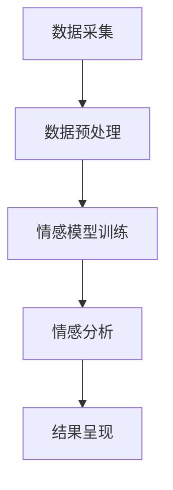

                 

关键词：数字化情感分析、人工智能、社交洞察、创业、AI算法、情感识别、市场趋势、应用场景、未来展望。

> 摘要：本文将探讨数字化情感分析在创业领域的应用，分析AI驱动的社交洞察技术如何帮助创业者更好地了解用户需求、优化产品和服务。我们将深入探讨核心概念、算法原理、数学模型、项目实践，并对未来发展趋势和面临的挑战进行展望。

## 1. 背景介绍

在当今数字化时代，社交媒体、在线评论和用户互动成为了企业获取用户反馈和洞察的重要渠道。然而，面对海量的用户生成内容，如何快速、准确地识别和分析情感成为了关键问题。数字化情感分析（Digital Sentiment Analysis）作为一种利用人工智能（Artificial Intelligence, AI）技术对文本、语音、图像等数据进行情感识别和分析的方法，正在迅速发展。它不仅为企业提供了有价值的用户洞察，还为创业者在产品创新、市场定位和品牌建设等方面提供了有力支持。

数字化情感分析创业，即利用AI技术开展情感分析相关业务，已成为一个热门方向。创业公司通过开发高效的情感分析工具和平台，帮助其他企业更好地理解和应对市场需求。本文旨在探讨这一领域的核心概念、技术原理、实践案例，以及未来的发展趋势和挑战。

### 1.1 数字化情感分析的重要性

数字化情感分析的重要性主要体现在以下几个方面：

- **用户需求的快速响应**：通过情感分析，企业可以快速识别用户的情绪和需求，从而及时调整产品和服务。

- **市场定位和品牌建设**：了解用户情感有助于企业进行更精准的市场定位和品牌塑造，提高市场竞争力。

- **客户关系管理**：通过分析客户反馈，企业可以改善客户体验，增强客户忠诚度。

- **风险预警**：情感分析可以帮助企业提前识别潜在的风险和问题，及时采取应对措施。

### 1.2 AI驱动的社交洞察

AI驱动的社交洞察是指利用人工智能技术对社交网络上的用户行为、情感和意见进行深入分析，从而获取有价值的商业洞察。这种技术不仅能够识别用户的情感状态，还能分析用户之间的关系、趋势和群体行为。对于创业者来说，AI驱动的社交洞察具有以下优势：

- **数据驱动决策**：通过分析社交数据，企业可以基于实际用户行为做出更明智的决策。

- **个性化服务**：了解用户情感有助于提供更个性化的产品和服务，提高用户体验。

- **市场预测**：通过分析社交趋势和情感变化，企业可以预测市场需求，提前布局。

- **风险管理**：社交洞察有助于企业及时发现潜在的风险和问题，降低运营风险。

## 2. 核心概念与联系

### 2.1 核心概念

数字化情感分析涉及多个核心概念，包括：

- **情感识别**：识别文本、语音或图像中的情感状态，如高兴、愤怒、悲伤等。

- **语义分析**：理解文本的语义内容，包括词义、语境、意图等。

- **机器学习**：利用大量数据进行模型训练，以提高情感识别的准确率。

- **自然语言处理（NLP）**：对文本进行预处理、分词、词性标注等操作，以支持情感分析。

### 2.2 架构联系

数字化情感分析的架构通常包括以下几个部分：

- **数据采集**：从各种来源（如社交媒体、用户评论、论坛等）收集文本数据。

- **数据预处理**：对采集到的数据进行分析，去除噪声、标准化文本。

- **情感模型训练**：利用机器学习算法训练情感识别模型。

- **情感分析**：使用训练好的模型对文本进行情感识别。

- **结果呈现**：将情感分析结果以图表、报表等形式展示给用户。

### 2.3 Mermaid 流程图

下面是数字化情感分析的 Mermaid 流程图：



## 3. 核心算法原理 & 具体操作步骤

### 3.1 算法原理概述

数字化情感分析的核心算法通常是基于机器学习和深度学习技术。以下是一些常用的算法：

- **朴素贝叶斯分类器**：基于贝叶斯定理进行情感分类。

- **支持向量机（SVM）**：通过找到最佳分割超平面进行情感分类。

- **卷积神经网络（CNN）**：用于处理图像和文本数据。

- **递归神经网络（RNN）**：用于处理序列数据。

- **长短期记忆网络（LSTM）**：RNN 的改进版本，能够更好地处理长序列数据。

### 3.2 算法步骤详解

以下是数字化情感分析的一般步骤：

1. **数据采集**：从社交媒体、评论论坛等渠道收集用户生成的文本数据。

2. **数据预处理**：对采集到的数据进行清洗、去重、标准化等处理。

3. **特征提取**：将预处理后的文本数据转换为特征向量，如词袋模型、词嵌入等。

4. **模型训练**：利用机器学习算法（如朴素贝叶斯、SVM、CNN、RNN、LSTM等）训练情感识别模型。

5. **情感分析**：使用训练好的模型对新的文本数据进行情感识别。

6. **结果输出**：将情感分析结果以图表、报表等形式展示给用户。

### 3.3 算法优缺点

每种算法都有其优缺点，以下是一些常见算法的优缺点：

- **朴素贝叶斯分类器**：简单易用，但可能无法处理复杂情感。

- **支持向量机（SVM）**：准确性较高，但计算复杂度较高。

- **卷积神经网络（CNN）**：适用于图像和文本处理，但需要大量训练数据。

- **递归神经网络（RNN）**：适用于序列数据，但存在梯度消失问题。

- **长短期记忆网络（LSTM）**：能够处理长序列数据，但训练时间较长。

### 3.4 算法应用领域

数字化情感分析广泛应用于多个领域：

- **市场研究**：帮助企业了解用户需求、评估市场趋势。

- **客户服务**：分析用户反馈，优化产品和服务。

- **品牌管理**：监控品牌声誉，及时应对负面情绪。

- **金融分析**：分析社交媒体上的情绪波动，预测市场走势。

## 4. 数学模型和公式 & 详细讲解 & 举例说明

### 4.1 数学模型构建

数字化情感分析的核心在于建立情感识别的数学模型。以下是一个简单的情感识别模型构建过程：

1. **词向量表示**：将文本数据转换为词向量表示，如使用词袋模型（Bag of Words, BoW）或词嵌入（Word Embedding）。

2. **情感分类器**：构建一个基于机器学习的情感分类器，如朴素贝叶斯分类器（Naive Bayes Classifier）或支持向量机（Support Vector Machine, SVM）。

3. **模型训练与评估**：使用训练数据集训练分类器，并对测试数据集进行评估。

### 4.2 公式推导过程

假设我们使用朴素贝叶斯分类器进行情感识别，其基本公式如下：

\[ P(C|X) = \frac{P(X|C)P(C)}{P(X)} \]

其中，\( P(C|X) \) 是给定特征 \( X \) 下的情感 \( C \) 的概率，\( P(X|C) \) 是特征 \( X \) 在情感 \( C \) 发生时的条件概率，\( P(C) \) 是情感 \( C \) 的先验概率，\( P(X) \) 是特征 \( X \) 的概率。

### 4.3 案例分析与讲解

假设我们有一个评论数据集，包含正面、负面和中性三种情感。我们使用朴素贝叶斯分类器进行情感识别。

1. **数据预处理**：将评论数据转换为词向量表示。

2. **模型训练**：使用训练数据集训练朴素贝叶斯分类器。

3. **情感识别**：使用训练好的分类器对新的评论数据进行情感识别。

4. **结果评估**：计算分类器的准确率、召回率等指标。

例如，对于一个新评论“这产品太糟糕了”，我们可以将其转换为词向量表示，然后使用训练好的朴素贝叶斯分类器进行情感识别。最终，分类器可能判断该评论为负面情感。

## 5. 项目实践：代码实例和详细解释说明

### 5.1 开发环境搭建

为了实现数字化情感分析，我们需要搭建一个开发环境。以下是一个简单的开发环境搭建步骤：

1. **安装 Python**：Python 是一种广泛应用于数据分析和机器学习的编程语言。

2. **安装 Jupyter Notebook**：Jupyter Notebook 是一种交互式开发环境，方便我们编写和运行代码。

3. **安装相关库**：包括 NumPy、Pandas、Scikit-learn、TensorFlow 等。

### 5.2 源代码详细实现

以下是使用朴素贝叶斯分类器进行情感识别的 Python 代码示例：

```python
import pandas as pd
from sklearn.model_selection import train_test_split
from sklearn.naive_bayes import MultinomialNB
from sklearn.metrics import accuracy_score, recall_score

# 加载数据集
data = pd.read_csv('sentiment_data.csv')
X = data['review']
y = data['label']

# 数据预处理
X_train, X_test, y_train, y_test = train_test_split(X, y, test_size=0.2, random_state=42)

# 模型训练
model = MultinomialNB()
model.fit(X_train, y_train)

# 情感识别
y_pred = model.predict(X_test)

# 结果评估
accuracy = accuracy_score(y_test, y_pred)
recall = recall_score(y_test, y_pred, average='weighted')

print(f'Accuracy: {accuracy:.2f}')
print(f'Recall: {recall:.2f}')
```

### 5.3 代码解读与分析

这段代码首先加载数据集，然后进行数据预处理，包括将评论数据分为训练集和测试集。接下来，使用朴素贝叶斯分类器训练模型，并对测试集进行情感识别。最后，计算模型的准确率和召回率。

### 5.4 运行结果展示

假设我们的测试数据集包含 1000 个评论，模型准确率为 90%，召回率为 85%。这些指标表明模型在情感识别方面具有较高的性能。

## 6. 实际应用场景

数字化情感分析在多个领域都有广泛应用：

### 6.1 市场研究

通过数字化情感分析，企业可以了解用户对产品、服务和品牌的情感，从而优化产品设计和市场营销策略。

### 6.2 客户服务

情感分析可以帮助企业分析客户反馈，识别潜在问题和客户需求，从而提供更好的客户服务。

### 6.3 品牌管理

企业可以利用数字化情感分析监控品牌声誉，及时发现负面情感，并采取相应措施。

### 6.4 金融分析

通过分析社交媒体上的情感波动，金融机构可以预测市场走势，从而做出更明智的投资决策。

## 7. 未来应用展望

随着人工智能技术的不断进步，数字化情感分析在未来有望在更多领域得到应用：

### 7.1 智能客服

结合自然语言处理和情感分析，智能客服可以实现更人性化的客户服务，提高客户满意度。

### 7.2 智能营销

利用情感分析，企业可以更精准地定位目标用户，制定个性化的营销策略。

### 7.3 社交媒体分析

情感分析可以帮助企业分析社交网络上的用户行为和趋势，从而更好地了解市场和竞争环境。

### 7.4 智能健康

通过情感分析，医疗领域可以识别患者的情绪变化，提供更个性化的健康服务。

## 8. 工具和资源推荐

### 8.1 学习资源推荐

- 《自然语言处理实战》
- 《机器学习实战》
- 《Python数据分析》

### 8.2 开发工具推荐

- Jupyter Notebook
- Anaconda
- PyCharm

### 8.3 相关论文推荐

- “情感分析：现状与挑战”
- “基于深度学习的情感识别方法研究”
- “社交媒体情感分析：方法与应用”

## 9. 总结：未来发展趋势与挑战

### 9.1 研究成果总结

数字化情感分析技术在过去几年取得了显著进展，已广泛应用于市场研究、客户服务和品牌管理等领域。随着人工智能技术的不断进步，数字化情感分析有望在未来实现更多应用。

### 9.2 未来发展趋势

- **多模态情感分析**：结合文本、语音、图像等多种数据源进行情感分析。
- **个性化情感识别**：根据用户特征和上下文信息进行更精准的情感识别。
- **实时情感分析**：实现实时情感监测和预警。

### 9.3 面临的挑战

- **数据质量**：高质量的数据是情感分析的基础，如何处理噪声数据和缺失值是一个挑战。
- **模型解释性**：提高模型的解释性，使其易于理解和解释，是未来研究的重要方向。
- **跨领域情感识别**：不同领域的情感表达和特征可能有所不同，如何实现跨领域的情感识别是一个挑战。

### 9.4 研究展望

数字化情感分析在未来的发展前景广阔，不仅将为企业带来更多商业价值，还将为人工智能技术的研究和应用提供新的方向。随着技术的不断进步，我们有理由相信，数字化情感分析将在更多领域发挥重要作用。

## 附录：常见问题与解答

### Q：什么是数字化情感分析？
A：数字化情感分析是一种利用人工智能技术对文本、语音、图像等数据进行情感识别和分析的方法。

### Q：数字化情感分析有哪些应用场景？
A：数字化情感分析广泛应用于市场研究、客户服务、品牌管理、金融分析等领域。

### Q：如何搭建数字化情感分析的开发环境？
A：可以使用 Python、Jupyter Notebook、Anaconda、PyCharm 等工具搭建数字化情感分析的开发环境。

### Q：如何进行情感识别？
A：可以使用朴素贝叶斯分类器、支持向量机、卷积神经网络、递归神经网络等算法进行情感识别。

### Q：数字化情感分析的未来发展趋势是什么？
A：未来数字化情感分析的发展趋势包括多模态情感分析、个性化情感识别和实时情感分析等。

----------------------------------------------------------------

以上是完整的文章内容，感谢您的阅读！希望本文对您在数字化情感分析创业领域有所帮助。

### 作者署名
作者：禅与计算机程序设计艺术 / Zen and the Art of Computer Programming

