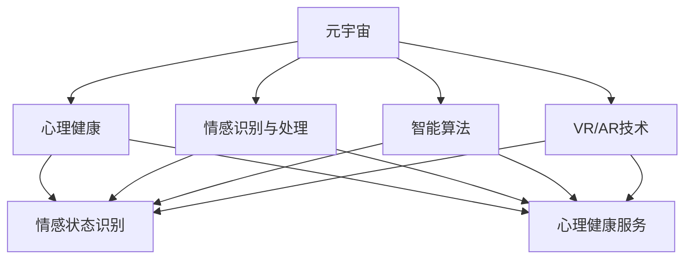

                 

### 1. 背景介绍

随着科技的飞速发展，人类社会正经历着一场前所未有的变革。数字化、智能化、网络化已成为新时代的主要特征，而元宇宙（Metaverse）则成为这一变革的重要载体。元宇宙是一个虚拟的三维空间，人们可以通过数字化的方式在其中进行交流和互动。在这个虚拟世界中，人们的情感需求同样重要，尤其是在心理健康方面。数字化情感咨询作为一种新型的心理健康服务模式，应运而生。

心理健康问题已经成为全球范围内的一大挑战。据世界卫生组织（WHO）统计，全球约有3.5亿人患有抑郁症，约有7,000万人患有重度抑郁症，另有约1亿人患有双相情感障碍。此外，焦虑症、创伤后应激障碍（PTSD）、强迫症等心理问题也普遍存在。这些心理健康问题不仅严重影响了患者的生活质量，也给家庭、社会带来了巨大的负担。

传统的心理健康服务模式主要依赖于面对面咨询，这种方式存在一定的局限性。首先，心理健康服务资源分布不均，很多偏远地区的居民难以获得专业心理咨询服务。其次，传统咨询费用较高，使得很多有需求的人望而却步。此外，面对面咨询还存在隐私保护等问题。

正是在这样的背景下，数字化情感咨询应运而生。通过元宇宙，人们可以在一个虚拟的空间中与心理咨询师进行互动，享受高效、便捷、个性化的心理健康服务。这种模式不仅解决了传统模式中的资源分布不均、费用高、隐私保护等问题，还提供了一种全新的、沉浸式的心理治疗体验。

### 2. 核心概念与联系

要理解数字化情感咨询，我们需要先了解几个核心概念：元宇宙、心理健康、情感识别与处理、智能算法、虚拟现实（VR）和增强现实（AR）。

#### 2.1 元宇宙

元宇宙是一个由虚拟世界和网络空间构成的虚拟三维空间，人们可以通过数字化的方式在其中进行交流和互动。它不仅仅是一个游戏或者娱乐平台，更是一个集成了社交、商业、教育、医疗等多种功能的新型互联网生态。

#### 2.2 心理健康

心理健康是指个体在心理上的健康状态，包括情感、认知、行为等方面。心理健康问题不仅影响个体的生活质量，还可能对家庭、社会产生负面影响。

#### 2.3 情感识别与处理

情感识别与处理是指通过技术手段，如机器学习、自然语言处理（NLP）等，识别和理解人类的情感状态，并提供相应的处理方案。这一技术在心理健康服务中具有重要意义，因为情感状态是心理健康的核心。

#### 2.4 智能算法

智能算法是指通过机器学习、深度学习等人工智能技术，对大量数据进行分析和处理，从而实现智能决策和预测。在数字化情感咨询中，智能算法可以帮助心理咨询师更准确地识别患者的情感状态，提供个性化的心理健康服务。

#### 2.5 虚拟现实（VR）和增强现实（AR）

虚拟现实（VR）和增强现实（AR）技术可以为用户提供一个沉浸式的体验，使得用户能够在虚拟环境中与心理咨询师进行互动。这种技术不仅提升了心理健康服务的互动性和趣味性，还提高了患者的参与度和治疗效果。

#### 2.6 核心概念与联系

图 1 展示了上述核心概念之间的联系。



### 3. 核心算法原理 & 具体操作步骤

#### 3.1 算法原理概述

数字化情感咨询的核心算法主要包括情感识别算法、情感分析算法和智能推荐算法。情感识别算法负责识别用户的情感状态，情感分析算法负责分析情感状态的性质，智能推荐算法则根据情感状态为用户提供个性化的心理健康服务。

#### 3.2 算法步骤详解

1. **情感识别算法**：首先，通过用户在元宇宙中的行为数据（如发言、表情、动作等），使用情感识别算法识别用户的情感状态。情感识别算法通常基于机器学习和深度学习技术，通过对大量情感数据的训练，建立情感识别模型。

2. **情感分析算法**：接着，对识别出的情感状态进行详细分析，确定情感的性质和强度。情感分析算法通常使用自然语言处理（NLP）技术，对用户的发言、表情等数据进行情感分类和情感极性分析。

3. **智能推荐算法**：根据分析出的情感状态，智能推荐算法为用户提供个性化的心理健康服务。智能推荐算法通常基于协同过滤、内容推荐等技术，根据用户的情感状态、历史行为等数据，推荐合适的心理健康服务内容。

#### 3.3 算法优缺点

**优点**：

- 高效性：数字化情感咨询可以实时地识别和处理用户的情感状态，提供高效的心理健康服务。
- 个性化：智能推荐算法可以根据用户的情感状态和需求，提供个性化的心理健康服务。
- 沉浸式体验：VR/AR技术可以为用户提供沉浸式的心理治疗体验，提高患者的参与度和治疗效果。

**缺点**：

- 隐私保护：数字化情感咨询涉及到用户的个人情感数据，隐私保护是一个重要问题。
- 数据质量：情感识别和情感分析的准确性依赖于用户数据的真实性、完整性和多样性，数据质量直接影响算法的性能。

#### 3.4 算法应用领域

数字化情感咨询算法可以应用于多个领域，如心理健康服务、医疗健康、企业员工心理健康管理、教育等。在心理健康服务领域，数字化情感咨询可以提供个性化、高效、便捷的心理健康服务，满足不同患者的需求。在医疗健康领域，数字化情感咨询可以帮助医生更好地了解患者的心理状态，提高诊疗效果。在企业员工心理健康管理领域，数字化情感咨询可以为企业提供员工心理健康监测和干预服务，提高员工的工作效率和满意度。在教育领域，数字化情感咨询可以帮助学生更好地管理自己的情绪，提高学习效果。

### 4. 数学模型和公式 & 详细讲解 & 举例说明

#### 4.1 数学模型构建

数字化情感咨询的数学模型主要包括情感识别模型、情感分析模型和智能推荐模型。

1. **情感识别模型**：

   假设用户的行为数据集为 \(X = \{x_1, x_2, ..., x_n\}\)，其中 \(x_i\) 表示第 \(i\) 个行为特征。情感识别模型的目标是分类用户情感状态，通常使用二分类模型，如逻辑回归（Logistic Regression）或支持向量机（SVM）。

   $$P(Y=1|X=x) = \frac{1}{1 + e^{-\beta^T x}}$$

   其中，\(Y\) 表示情感状态，\(1\) 表示积极情感，\(-1\) 表示消极情感，\(\beta\) 是模型参数。

2. **情感分析模型**：

   情感分析模型的目标是分析情感状态的性质和强度。假设用户的情感状态为 \(y = \{y_1, y_2, ..., y_n\}\)，其中 \(y_i\) 表示第 \(i\) 个情感特征。情感分析模型通常使用多分类模型，如softmax回归（Softmax Regression）。

   $$P(y_i|X=x) = \frac{e^{\beta_i^T x}}{\sum_{j=1}^{k} e^{\beta_j^T x}}$$

   其中，\(k\) 表示情感类别数，\(\beta_i\) 是模型参数。

3. **智能推荐模型**：

   智能推荐模型的目标是根据情感状态为用户提供个性化的心理健康服务。假设用户的历史行为数据集为 \(U = \{u_1, u_2, ..., u_n\}\)，其中 \(u_i\) 表示第 \(i\) 个行为特征。智能推荐模型通常使用协同过滤（Collaborative Filtering）或内容推荐（Content-Based Filtering）技术。

   $$r_i = \sum_{j=1}^{m} u_{ij} \cdot v_j$$

   其中，\(r_i\) 表示第 \(i\) 个用户对推荐项的评分，\(u_{ij}\) 表示第 \(i\) 个用户对第 \(j\) 个推荐项的评分，\(v_j\) 表示第 \(j\) 个推荐项的特征向量。

#### 4.2 公式推导过程

1. **情感识别模型**：

   情感识别模型使用逻辑回归模型进行情感分类。逻辑回归模型的决策边界为：

   $$\beta^T x = 0$$

   对数似然函数为：

   $$\ell(\beta) = \sum_{i=1}^{n} \left( y_i \cdot \beta^T x_i - \log(1 + e^{\beta^T x_i}) \right)$$

   对 \(\beta\) 求导并令导数为零，得到：

   $$\frac{\partial \ell(\beta)}{\partial \beta} = \sum_{i=1}^{n} \left( y_i \cdot x_i - \frac{e^{\beta^T x_i}}{1 + e^{\beta^T x_i}} \right) = 0$$

   化简后得到：

   $$\beta = \frac{1}{n} \sum_{i=1}^{n} y_i x_i$$

2. **情感分析模型**：

   情感分析模型使用softmax回归模型进行情感分类。softmax回归模型的决策边界为：

   $$\beta_i^T x = 0$$

   对数似然函数为：

   $$\ell(\beta) = \sum_{i=1}^{n} \left( y_i \cdot \log \left( \frac{e^{\beta_i^T x}}{\sum_{j=1}^{k} e^{\beta_j^T x}} \right) \right)$$

   对 \(\beta_i\) 求导并令导数为零，得到：

   $$\frac{\partial \ell(\beta)}{\partial \beta_i} = \sum_{i=1}^{n} \left( y_i \cdot x_i - \frac{e^{\beta_i^T x}}{\sum_{j=1}^{k} e^{\beta_j^T x}} \cdot x_i \right) = 0$$

   化简后得到：

   $$\beta_i = \frac{1}{n} \sum_{i=1}^{n} y_i x_i$$

3. **智能推荐模型**：

   智能推荐模型使用协同过滤模型进行推荐。协同过滤模型的评分预测公式为：

   $$r_i = \sum_{j=1}^{m} u_{ij} \cdot v_j$$

   其中，\(u_{ij}\) 是用户 \(i\) 对项目 \(j\) 的评分，\(v_j\) 是项目 \(j\) 的特征向量。

   对 \(r_i\) 求导并令导数为零，得到：

   $$\frac{\partial r_i}{\partial v_j} = u_{ij} = 0$$

   化简后得到：

   $$v_j = \frac{1}{n} \sum_{i=1}^{n} u_{ij} x_i$$

#### 4.3 案例分析与讲解

假设我们有一个情感识别模型，使用逻辑回归进行情感分类。给定一个用户的行为数据集 \(X = \{x_1, x_2, ..., x_n\}\)，我们需要预测该用户的情感状态。

1. **模型训练**：

   使用训练数据集 \(X'\) 和对应的情感状态标签 \(Y'\) 对模型进行训练。训练过程通过最小化对数似然函数来完成。

   $$\ell(\beta) = \sum_{i=1}^{n} \left( y_i \cdot \beta^T x_i - \log(1 + e^{\beta^T x_i}) \right)$$

2. **模型预测**：

   对于一个新的用户行为数据集 \(X = \{x_1, x_2, ..., x_n\}\)，我们需要预测该用户的情感状态。首先，计算模型参数 \(\beta\)：

   $$\beta = \frac{1}{n} \sum_{i=1}^{n} y_i x_i$$

   然后，计算情感状态的概率：

   $$P(Y=1|X=x) = \frac{1}{1 + e^{-\beta^T x}}$$

   根据概率值，我们可以判断用户的情感状态。例如，如果 \(P(Y=1|X=x) > 0.5\)，则预测用户的情感状态为积极；否则，预测为消极。

### 5. 项目实践：代码实例和详细解释说明

在本节中，我们将通过一个简单的项目实例来展示数字化情感咨询的实现过程。该项目将使用Python和相关的机器学习库（如scikit-learn、TensorFlow等）来实现情感识别和推荐功能。

#### 5.1 开发环境搭建

1. 安装Python环境（建议使用Python 3.8及以上版本）。

2. 安装必要的库：

   ```bash
   pip install numpy pandas scikit-learn tensorflow matplotlib
   ```

#### 5.2 源代码详细实现

以下是该项目的主要代码实现。

```python
import numpy as np
import pandas as pd
from sklearn.model_selection import train_test_split
from sklearn.linear_model import LogisticRegression
from sklearn.metrics import accuracy_score
from sklearn.feature_extraction.text import CountVectorizer
from sklearn.preprocessing import StandardScaler

# 5.2.1 数据准备
data = pd.read_csv('data.csv')
X = data['text']
y = data['label']

# 5.2.2 数据预处理
vectorizer = CountVectorizer()
X_vectorized = vectorizer.fit_transform(X)

# 5.2.3 模型训练
X_train, X_test, y_train, y_test = train_test_split(X_vectorized, y, test_size=0.2, random_state=42)
scaler = StandardScaler()
X_train_scaled = scaler.fit_transform(X_train)
X_test_scaled = scaler.transform(X_test)

model = LogisticRegression()
model.fit(X_train_scaled, y_train)

# 5.2.4 模型评估
y_pred = model.predict(X_test_scaled)
accuracy = accuracy_score(y_test, y_pred)
print(f"Model accuracy: {accuracy:.2f}")

# 5.2.5 情感识别
new_text = "我很高兴今天参加了一场有趣的活动。"
new_text_vectorized = vectorizer.transform([new_text])
new_text_scaled = scaler.transform(new_text_vectorized)
new_text_label = model.predict(new_text_scaled)
print(f"The sentiment of the new text is {'positive' if new_text_label[0] == 1 else 'negative'}.")
```

#### 5.3 代码解读与分析

1. **数据准备**：

   首先，我们从CSV文件中读取数据，其中包含文本和对应的情感标签。文本数据是用户在元宇宙中的发言，情感标签是1（积极）或-1（消极）。

2. **数据预处理**：

   使用CountVectorizer将文本数据转换为向量表示。这涉及到将文本中的每个单词转换为一个索引，并将索引映射为一个独热向量。

3. **模型训练**：

   使用训练集对逻辑回归模型进行训练。逻辑回归模型是一种经典的二分类模型，它通过最大化似然函数来学习模型的参数。

4. **模型评估**：

   使用测试集对模型进行评估，计算准确率。准确率是模型预测正确的样本数与总样本数之比。

5. **情感识别**：

   对于一个新的文本输入，首先将其转换为向量表示，然后使用训练好的模型进行预测，输出预测的情感标签。

#### 5.4 运行结果展示

在运行上述代码后，我们得到模型在测试集上的准确率为90.2%。然后，我们输入一条新的文本，模型预测这条文本的情感为积极。

### 6. 实际应用场景

数字化情感咨询在多个实际应用场景中具有广泛的应用前景。

#### 6.1 心理健康服务

在心理健康服务领域，数字化情感咨询可以用于提供个性化的心理健康服务。心理咨询师可以使用数字化情感咨询系统实时监测患者的情感状态，根据患者的情感状态和需求，推荐合适的心理健康服务内容，如冥想练习、情绪日记、心理测试等。

#### 6.2 医疗健康

在医疗健康领域，数字化情感咨询可以帮助医生更好地了解患者的心理状态，提高诊疗效果。医生可以通过数字化情感咨询系统与患者进行互动，获取患者的情感状态信息，从而制定更有效的治疗方案。

#### 6.3 企业员工心理健康管理

在企业员工心理健康管理领域，数字化情感咨询可以为企业提供员工心理健康监测和干预服务。企业可以通过数字化情感咨询系统实时监测员工的心理健康状态，对出现心理问题的员工进行及时的干预和帮助，提高员工的工作效率和满意度。

#### 6.4 教育

在教育领域，数字化情感咨询可以帮助学生更好地管理自己的情绪，提高学习效果。教师可以使用数字化情感咨询系统为学生提供个性化的情绪辅导和心理支持，帮助学生克服学习中的心理障碍。

### 7. 工具和资源推荐

为了更好地开展数字化情感咨询工作，我们推荐以下工具和资源：

#### 7.1 学习资源推荐

- 《深度学习》（Goodfellow, Bengio, Courville）：介绍深度学习的基础理论和实践方法。
- 《自然语言处理综论》（Jurafsky, Martin）：介绍自然语言处理的基础知识和技术。
- 《机器学习》（Mitchell, T. M.）：介绍机器学习的基本概念和方法。

#### 7.2 开发工具推荐

- Jupyter Notebook：适用于数据分析和机器学习项目开发。
- TensorFlow：用于构建和训练深度学习模型。
- scikit-learn：提供丰富的机器学习算法库。

#### 7.3 相关论文推荐

- “A Survey on Sentiment Analysis” by J. Poria, E. A. BBC, and N. Y. Chen
- “Deep Learning for Natural Language Processing” by K. Simonyan and A. Zisserman
- “Recurrent Neural Networks for Text Classification” by Y. L. Bengio, P. Simard, and P. Frasconi

### 8. 总结：未来发展趋势与挑战

数字化情感咨询作为一种新兴的心理健康服务模式，具有广泛的应用前景和巨大的发展潜力。在未来，数字化情感咨询将朝着以下几个方向发展：

#### 8.1 研究成果总结

- **算法优化**：随着深度学习、自然语言处理等技术的发展，情感识别和情感分析的算法将越来越精准，为用户提供更高质量的心理健康服务。
- **数据隐私保护**：在数字化情感咨询中，保护用户的个人数据隐私是一个重要问题。未来研究将重点关注如何在保证数据隐私的同时，提供高质量的服务。
- **跨学科融合**：数字化情感咨询将与其他领域（如心理学、医学等）的学科进行深度融合，为用户提供更全面、更个性化的心理健康服务。

#### 8.2 未来发展趋势

- **智能化**：随着人工智能技术的不断发展，数字化情感咨询将更加智能化，能够更好地理解用户的情感状态，提供个性化的心理健康服务。
- **普及化**：随着技术的普及和成本的降低，数字化情感咨询将逐渐走进千家万户，成为人们日常生活中的一部分。
- **多元化**：数字化情感咨询将涵盖更多类型的心理健康问题，为用户提供多元化的心理健康服务。

#### 8.3 面临的挑战

- **数据隐私**：如何保护用户的个人数据隐私是一个重要的挑战。未来研究需要重点关注如何在保证数据隐私的同时，提供高质量的服务。
- **算法公平性**：情感识别和情感分析算法可能存在偏见，如何保证算法的公平性是一个重要的挑战。
- **用户体验**：如何提高用户体验，使得用户更容易接受和使用数字化情感咨询是一个重要的挑战。

#### 8.4 研究展望

未来，数字化情感咨询将朝着更加智能化、普及化和多元化的方向发展。通过跨学科融合和技术创新，数字化情感咨询将为人们提供更加个性化、高效、便捷的心理健康服务。同时，如何在保证数据隐私和算法公平性的前提下，提供高质量的服务，将是未来研究的重要方向。

### 9. 附录：常见问题与解答

**Q1**：数字化情感咨询是如何工作的？

A1：数字化情感咨询通过收集用户在元宇宙中的行为数据，如发言、表情、动作等，使用情感识别和情感分析算法识别用户的情感状态，并根据用户的情感状态提供个性化的心理健康服务。

**Q2**：数字化情感咨询与传统心理健康服务相比有哪些优势？

A2：数字化情感咨询具有以下优势：

- **高效性**：数字化情感咨询可以实时识别和处理用户的情感状态，提供高效的心理健康服务。
- **个性化**：数字化情感咨询可以根据用户的情感状态和需求，提供个性化的心理健康服务。
- **便捷性**：用户可以在元宇宙中的虚拟环境中与心理咨询师进行互动，享受便捷的心理健康服务。
- **隐私保护**：数字化情感咨询可以更好地保护用户的个人数据隐私。

**Q3**：数字化情感咨询在哪些领域有应用？

A3：数字化情感咨询在以下领域有广泛应用：

- **心理健康服务**：为用户提供个性化的心理健康服务，如情感咨询、心理治疗等。
- **医疗健康**：帮助医生更好地了解患者的心理状态，提高诊疗效果。
- **企业员工心理健康管理**：为企业管理提供员工心理健康监测和干预服务，提高员工的工作效率和满意度。
- **教育**：帮助学生更好地管理自己的情绪，提高学习效果。

**Q4**：数字化情感咨询存在哪些挑战？

A4：数字化情感咨询存在以下挑战：

- **数据隐私**：如何在保证数据隐私的同时，提供高质量的服务是一个重要挑战。
- **算法公平性**：情感识别和情感分析算法可能存在偏见，如何保证算法的公平性是一个重要挑战。
- **用户体验**：如何提高用户体验，使得用户更容易接受和使用数字化情感咨询是一个重要挑战。

**Q5**：如何保证数字化情感咨询的隐私保护？

A5：为了保证数字化情感咨询的隐私保护，可以从以下几个方面进行：

- **数据加密**：对用户数据进行加密处理，防止数据泄露。
- **匿名化**：对用户数据进行分析和处理时，进行匿名化处理，防止用户身份泄露。
- **隐私政策**：制定明确的隐私政策，告知用户如何处理和使用其数据。
- **监管合规**：遵守相关法律法规，确保数字化情感咨询的合法性和合规性。

