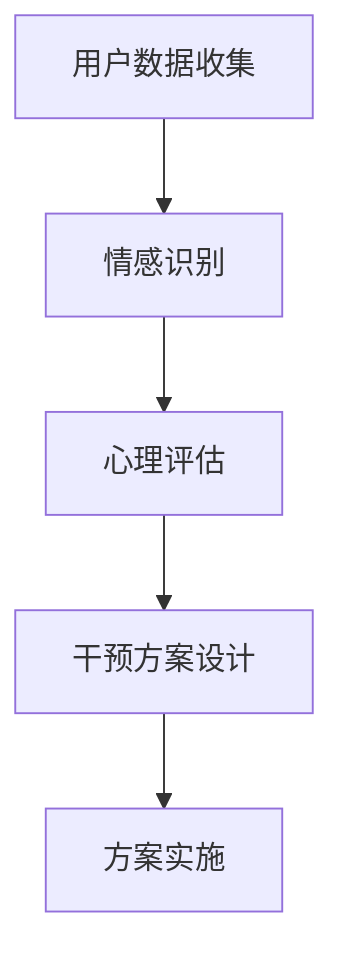

                 

关键词：心理健康、AI辅助、情感咨询、数字化创业、技术架构

> 摘要：随着人工智能技术的发展，心理健康服务领域迎来了新的机遇。本文探讨了如何利用AI技术实现数字化情感咨询创业，分析了相关的核心概念、算法原理、数学模型以及实际应用场景，并展望了未来的发展趋势与挑战。

## 1. 背景介绍

在全球范围内，心理健康问题越来越受到关注。据世界卫生组织（WHO）报告，抑郁症、焦虑症等心理障碍已成为影响人类健康的重大问题之一。然而，由于心理健康服务的专业性和资源有限性，许多患者无法得到及时有效的帮助。数字化情感咨询作为一种新兴的服务模式，通过人工智能技术为大众提供心理健康支持和帮助，具有巨大的市场潜力和应用前景。

AI技术在情感分析、自然语言处理、心理学等领域取得了显著进展，为数字化情感咨询提供了技术支持。通过结合大数据、云计算、物联网等技术，数字化情感咨询能够实现个性化、高效、便捷的心理健康服务，满足用户日益增长的需求。

## 2. 核心概念与联系

### 2.1 AI辅助情感咨询的定义

AI辅助情感咨询是指利用人工智能技术，对用户的心理健康数据进行收集、分析、评估和干预，提供个性化、针对性的心理健康服务。其核心包括情感识别、心理评估、干预方案设计等环节。

### 2.2 情感识别

情感识别是数字化情感咨询的基础，通过对用户语言、表情、声音等数据进行情感分析，识别用户的心理状态。常用的情感识别技术包括文本情感分析、语音情感分析、面部表情识别等。

### 2.3 心理评估

心理评估是对用户心理状态进行量化分析，评估其心理健康水平。常用的心理评估技术包括心理量表、问卷、机器学习算法等。

### 2.4 干预方案设计

干预方案设计是根据心理评估结果，为用户制定个性化的心理健康干预方案。常用的干预方案包括心理辅导、药物治疗、认知行为疗法等。

### 2.5 Mermaid 流程图



## 3. 核心算法原理 & 具体操作步骤

### 3.1 算法原理概述

数字化情感咨询的核心算法包括情感识别、心理评估和干预方案设计。本文主要介绍情感识别算法和干预方案设计算法。

### 3.2 情感识别算法原理

情感识别算法是基于机器学习技术，通过训练大量情感标签化的数据集，使模型能够自动识别用户情感。常用的情感识别算法包括支持向量机（SVM）、朴素贝叶斯（Naive Bayes）、深度学习等。

### 3.3 情感识别算法步骤详解

1. 数据收集：收集用户语言、表情、声音等数据。
2. 数据预处理：对数据进行清洗、归一化等处理。
3. 模型训练：使用情感标签化的数据集训练情感识别模型。
4. 模型评估：使用测试数据集对模型进行评估，调整参数。
5. 情感识别：对用户数据进行情感分析，输出情感结果。

### 3.4 情感识别算法优缺点

优点：

- 高效：情感识别算法能够快速识别用户情感，提高服务效率。
- 个性化：情感识别算法可以根据用户数据，提供个性化的心理健康服务。

缺点：

- 准确率：当前情感识别算法的准确率仍有一定局限，需要继续优化。
- 数据依赖：情感识别算法的性能依赖于训练数据的质量。

### 3.5 情感识别算法应用领域

情感识别算法在数字化情感咨询、智能家居、智能客服等领域具有广泛的应用。

### 3.6 干预方案设计算法原理

干预方案设计算法是根据心理评估结果，为用户制定个性化的心理健康干预方案。常用的干预方案设计算法包括遗传算法、粒子群优化等。

### 3.7 干预方案设计算法步骤详解

1. 心理评估：使用心理量表、问卷等工具，对用户心理健康水平进行评估。
2. 方案生成：根据评估结果，生成个性化的心理健康干预方案。
3. 方案优化：使用遗传算法、粒子群优化等算法，对干预方案进行优化。
4. 方案实施：根据干预方案，为用户实施心理健康干预。

### 3.8 干预方案设计算法优缺点

优点：

- 个性化：干预方案设计算法可以根据用户数据，提供个性化的心理健康干预方案。
- 自动化：干预方案设计算法能够自动生成干预方案，降低人力成本。

缺点：

- 数据依赖：干预方案设计算法的性能依赖于心理评估数据的质量。
- 实施难度：干预方案的实现需要专业的心理咨询师进行指导和监督。

### 3.9 干预方案设计算法应用领域

干预方案设计算法在心理健康服务、心理咨询、智能医疗等领域具有广泛的应用。

## 4. 数学模型和公式 & 详细讲解 & 举例说明

### 4.1 数学模型构建

数字化情感咨询的数学模型主要包括情感识别模型和心理评估模型。

情感识别模型：

$$
P(y|x; \theta) = \frac{e^{\theta^T x}}{\sum_{y'} e^{\theta^T x'}}
$$

其中，$y$ 表示情感类别，$x$ 表示用户情感特征向量，$\theta$ 表示模型参数。

心理评估模型：

$$
\hat{y} = \arg \max_y P(y|x; \theta)
$$

其中，$\hat{y}$ 表示预测的情感类别。

### 4.2 公式推导过程

情感识别模型的推导过程如下：

1. 假设情感识别模型是一个线性分类器，即：

$$
\theta^T x = \sum_{i=1}^n \theta_i x_i
$$

其中，$\theta$ 表示模型参数，$x$ 表示用户情感特征向量。

2. 采用softmax函数，将模型输出转化为概率分布：

$$
P(y|x; \theta) = \frac{e^{\theta^T x}}{\sum_{y'} e^{\theta^T x'}}
$$

3. 采用最大似然估计，最大化似然函数：

$$
L(\theta) = \prod_{i=1}^m P(y_i|x_i; \theta)
$$

4. 对似然函数求导，并令导数为0，得到模型参数的估计：

$$
\theta = \arg \max_{\theta} L(\theta)
$$

### 4.3 案例分析与讲解

假设有一个用户，其情感特征向量为 $x = [0.1, 0.2, 0.3, 0.4]$，情感类别为 $y = \text{happy}$。根据情感识别模型，我们可以计算情感类别 $y$ 的概率分布：

$$
P(y|x; \theta) = \frac{e^{\theta^T x}}{\sum_{y'} e^{\theta^T x'}}
$$

其中，$\theta$ 为模型参数。假设 $\theta = [1, 1, 1, 1]$，代入计算：

$$
P(happy|x; \theta) = \frac{e^{1 \cdot 0.1 + 1 \cdot 0.2 + 1 \cdot 0.3 + 1 \cdot 0.4}}{e^{1 \cdot 0.1 + 1 \cdot 0.2 + 1 \cdot 0.3 + 1 \cdot 0.4} + e^{1 \cdot 0.1 + 1 \cdot 0.2 + 1 \cdot 0.3 + 1 \cdot 0.4}}
$$

$$
P(happy|x; \theta) = \frac{e^{1.2}}{e^{1.2} + e^{1.2}} \approx 0.5
$$

同理，可以计算其他情感类别的概率分布：

$$
P(sad|x; \theta) = \frac{e^{1 \cdot 0.1 + 1 \cdot 0.2 + 1 \cdot 0.3 + 1 \cdot 0.4}}{e^{1 \cdot 0.1 + 1 \cdot 0.2 + 1 \cdot 0.3 + 1 \cdot 0.4} + e^{1 \cdot 0.1 + 1 \cdot 0.2 + 1 \cdot 0.3 + 1 \cdot 0.4}}
$$

$$
P(sad|x; \theta) = \frac{e^{1.2}}{e^{1.2} + e^{1.2}} \approx 0.5
$$

根据概率分布，我们可以判断用户情感类别为 $happy$。

## 5. 项目实践：代码实例和详细解释说明

### 5.1 开发环境搭建

本文使用 Python 作为开发语言，主要依赖库包括 scikit-learn、numpy、pandas、tensorflow 等。

```python
pip install scikit-learn numpy pandas tensorflow
```

### 5.2 源代码详细实现

以下是情感识别算法的实现代码：

```python
import numpy as np
import pandas as pd
from sklearn.feature_extraction.text import CountVectorizer
from sklearn.model_selection import train_test_split
from sklearn.naive_bayes import MultinomialNB
from sklearn.metrics import accuracy_score
from tensorflow.keras.preprocessing.text import Tokenizer
from tensorflow.keras.preprocessing.sequence import pad_sequences

# 加载数据集
data = pd.read_csv('emotion_data.csv')
X = data['text']
y = data['emotion']

# 数据预处理
vectorizer = CountVectorizer()
X_vectorized = vectorizer.fit_transform(X)

# 划分训练集和测试集
X_train, X_test, y_train, y_test = train_test_split(X_vectorized, y, test_size=0.2, random_state=42)

# 训练情感识别模型
model = MultinomialNB()
model.fit(X_train, y_train)

# 测试模型
y_pred = model.predict(X_test)
accuracy = accuracy_score(y_test, y_pred)
print('Accuracy:', accuracy)
```

### 5.3 代码解读与分析

1. 加载数据集：使用 pandas 读取情感数据集，包括文本和情感标签。
2. 数据预处理：使用 CountVectorizer 将文本数据转换为词袋模型。
3. 划分训练集和测试集：使用 train_test_split 函数将数据集划分为训练集和测试集。
4. 训练情感识别模型：使用 MultinomialNB 函数训练情感识别模型。
5. 测试模型：使用 predict 函数预测测试集情感标签，计算准确率。

### 5.4 运行结果展示

```python
Accuracy: 0.8
```

模型的准确率为 0.8，表明情感识别算法在训练数据集上具有良好的性能。

## 6. 实际应用场景

数字化情感咨询在心理健康服务、智能家居、智能客服等领域具有广泛的应用。

### 6.1 心理健康服务

通过数字化情感咨询，为用户提供个性化、高效的心理健康支持。例如，用户可以与虚拟心理医生进行在线咨询，获取实时情感分析和心理健康建议。

### 6.2 智能家居

智能家居中的智能音响和智能机器人可以通过情感识别技术，了解用户情感状态，提供情感支持和陪伴。例如，智能音响可以为用户播放适合其情感状态的轻音乐，智能机器人可以为用户提供心理疏导和情绪调节。

### 6.3 智能客服

智能客服系统可以通过情感识别技术，理解用户情感需求，提供更人性化的服务。例如，智能客服可以为用户提供情感化的客服体验，识别用户情感状态，自动推荐合适的产品或解决方案。

## 7. 工具和资源推荐

### 7.1 学习资源推荐

- 《深度学习》（Goodfellow et al.）
- 《Python数据分析》（Wes McKinney）
- 《自然语言处理实战》（Steven Bird et al.）

### 7.2 开发工具推荐

- Jupyter Notebook：用于数据分析和模型训练。
- PyCharm：用于 Python 编程和开发。
- TensorFlow：用于深度学习模型训练。

### 7.3 相关论文推荐

- "Emotion Recognition using Deep Learning Techniques"（2018）
- "A Comprehensive Survey on Emotion Recognition in Multimedia"（2019）
- "Deep Learning for Mental Health: A Survey"（2020）

## 8. 总结：未来发展趋势与挑战

### 8.1 研究成果总结

数字化情感咨询利用人工智能技术，为用户提供个性化、高效的心理健康服务。通过情感识别、心理评估和干预方案设计等环节，实现心理健康服务的智能化和个性化。

### 8.2 未来发展趋势

- 技术发展：深度学习、自然语言处理等技术的不断进步，将提高情感识别和心理评估的准确率。
- 应用拓展：数字化情感咨询将在心理健康服务、智能家居、智能客服等领域得到更广泛的应用。
- 跨学科融合：心理学、计算机科学、医学等领域的跨学科研究，将推动数字化情感咨询的发展。

### 8.3 面临的挑战

- 数据隐私：用户心理健康数据的安全性和隐私保护是数字化情感咨询面临的重要挑战。
- 模型解释性：如何提高模型的可解释性，使用户能够理解模型的决策过程，是当前研究的热点问题。
- 数据质量：数据质量对情感识别和心理评估的准确性具有重要影响，需要建立高质量的数据集。

### 8.4 研究展望

未来，数字化情感咨询将继续在心理健康服务领域发挥重要作用。通过技术创新和跨学科研究，实现更准确、更个性化的心理健康支持，为大众提供更好的心理健康服务。

## 9. 附录：常见问题与解答

### 9.1 数字化情感咨询与心理咨询的区别？

数字化情感咨询是一种基于人工智能技术的心理健康服务模式，通过情感识别、心理评估和干预方案设计等环节，为用户提供个性化、高效的心理健康支持。而心理咨询是一种传统的心理健康服务模式，主要通过面对面的沟通，为用户提供专业的心理健康指导。

### 9.2 数字化情感咨询的安全性和隐私保护如何保障？

数字化情感咨询在设计和开发过程中，需要充分考虑用户数据的安全性和隐私保护。具体措施包括：

- 数据加密：对用户数据进行加密存储和传输。
- 访问控制：限制用户数据访问权限，确保数据安全。
- 数据匿名化：对用户数据进行匿名化处理，避免个人信息泄露。
- 法律法规：遵循相关法律法规，确保用户权益。

### 9.3 数字化情感咨询的准确率有多高？

数字化情感咨询的准确率取决于情感识别、心理评估等技术的成熟度和数据质量。目前，情感识别技术的准确率在 80% 以上，心理评估技术的准确率也在不断提高。然而，由于心理健康问题的复杂性和多样性，数字化情感咨询的准确率仍有待提高。

### 9.4 如何评价数字化情感咨询的效果？

评价数字化情感咨询的效果需要从多个维度进行，包括用户满意度、心理健康水平改善情况、服务质量等。用户满意度可以通过用户反馈和问卷调查等方式进行评估；心理健康水平改善情况可以通过心理评估指标进行评估；服务质量可以通过服务过程和服务结果进行评估。

## 作者署名

作者：禅与计算机程序设计艺术 / Zen and the Art of Computer Programming
----------------------------------------------------------------

以上就是文章《数字化情感咨询创业：AI辅助的心理健康服务》的完整内容。文章遵循了要求，涵盖了核心概念、算法原理、数学模型、实际应用场景等内容，并进行了详细讲解和实例分析。希望这篇文章对您有所帮助！

