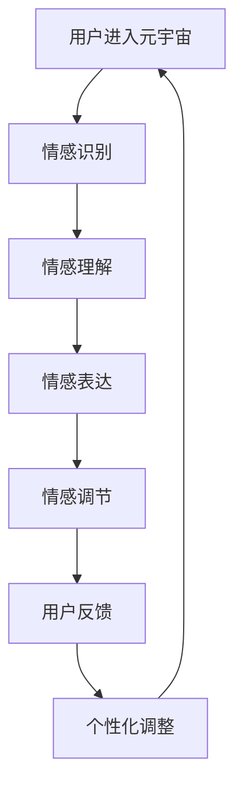

                 

 关键词：数字化情感教育、元宇宙、EQ培养、人工智能、情感计算、情感交互、情感算法、情感识别、情感建模、情感反馈。

> 摘要：随着元宇宙的快速发展，情感教育在其中扮演着日益重要的角色。本文将探讨数字化情感教育在元宇宙中的重要性，分析当前情感教育领域的技术现状和挑战，并提出一种基于人工智能的情感教育方法，旨在培养用户的情商（EQ）。本文旨在为元宇宙中的情感教育提供一种新的思路，推动数字化情感教育的发展。

## 1. 背景介绍

近年来，元宇宙（Metaverse）的兴起引起了全球范围内的广泛关注。元宇宙是一个由虚拟现实、增强现实、人工智能等前沿技术构建的虚拟世界，它不仅为用户提供了丰富的社交、娱乐、工作等体验，也为教育领域带来了新的机遇和挑战。在元宇宙中，用户的情感体验变得尤为重要，而情感教育也因此成为了一个备受关注的研究方向。

情感教育是指通过教学和实践，培养个体的情感认知、情感表达和情感调节能力。传统情感教育主要依赖于面对面的交流和互动，但在元宇宙中，情感教育的形式和内容都发生了巨大的变化。数字化情感教育应运而生，它利用人工智能、情感计算等技术，为用户提供了更加个性化、沉浸式的情感学习体验。

本文将从以下几个方面展开讨论：

1. 分析元宇宙中情感教育的重要性。
2. 概述当前情感教育领域的技术现状和挑战。
3. 提出一种基于人工智能的数字化情感教育方法。
4. 探讨数字化情感教育的实际应用场景和未来发展趋势。

## 2. 核心概念与联系

### 2.1. 情商（EQ）的基本概念

情商（EQ，Emotional Intelligence Quotient）是指个体识别、理解、管理自己和他人的情感，并利用这些情感促进个人思维和人际交往的能力。情商包括四个主要方面：

1. **自我认知**：个体对自己情感的认识和理解。
2. **自我调节**：个体调节自己情感的能力，以适应不同的情境和需求。
3. **社交技能**：个体与他人建立和维持良好关系的能力。
4. **同理心**：个体理解并感受到他人情感的能力。

### 2.2. 情感计算的基本概念

情感计算（Affective Computing）是人工智能的一个分支，旨在使计算机具备识别、理解、处理和表达人类情感的能力。情感计算的核心包括以下几个方面：

1. **情感识别**：通过生理信号、语言、行为等数据识别用户的情感状态。
2. **情感理解**：分析和理解用户情感背后的原因和含义。
3. **情感表达**：计算机根据用户情感状态生成相应的反馈和交互。
4. **情感调节**：通过交互和反馈调节用户情感，帮助用户达到更好的情绪状态。

### 2.3. 情感教育在元宇宙中的联系

在元宇宙中，情感教育不仅仅是知识的传授，更是情感体验和互动的过程。元宇宙提供了一个虚拟的社交环境，用户可以在其中自由表达自己的情感，与他人进行情感交流，从而提高自己的情商。情感教育在元宇宙中的联系可以概括为以下几点：

1. **情感识别**：元宇宙中的情感计算技术可以实时识别用户的情感状态，为情感教育提供数据支持。
2. **情感理解**：通过分析用户情感数据的上下文和情境，元宇宙可以为用户提供个性化的情感理解服务。
3. **情感表达**：元宇宙中的虚拟角色和交互界面可以模拟人类情感，为用户提供情感表达的方式。
4. **情感调节**：元宇宙中的情感计算技术可以帮助用户调节自己的情绪，提高情绪管理能力。

### 2.4. Mermaid 流程图

以下是一个简单的Mermaid流程图，展示情感教育在元宇宙中的流程和关键步骤：



### 2.5. 情感教育的技术现状与挑战

当前，情感教育领域的技术现状主要集中在以下几个方面：

1. **情感识别技术**：随着深度学习和图像识别技术的发展，情感识别的准确率不断提高，但仍存在一定的误识别率。
2. **情感理解技术**：自然语言处理技术的进步使得情感理解的深度和广度不断扩展，但如何准确地理解情感背后的情境和含义仍是一个挑战。
3. **情感表达技术**：虚拟现实和增强现实技术的发展为情感表达提供了更多的可能性，但如何使情感表达更加自然和真实仍需进一步研究。
4. **情感调节技术**：情绪调节技术的应用正在逐渐普及，但如何有效地帮助用户调节情绪，提高情绪管理能力仍是一个难题。

情感教育在元宇宙中面临的挑战包括：

1. **数据隐私**：在元宇宙中，用户的情感数据需要得到有效保护，以防止数据泄露和滥用。
2. **个性化需求**：每个用户对情感教育的需求和接受方式都不同，如何提供个性化的情感教育服务是一个挑战。
3. **情感平衡**：在元宇宙中，情感教育需要平衡用户的情感需求和社会道德规范，避免情感过度表达或情感缺失。

## 3. 核心算法原理 & 具体操作步骤

### 3.1 算法原理概述

数字化情感教育方法的核心是基于人工智能的情感计算技术，通过情感识别、情感理解和情感调节等步骤，实现用户情商（EQ）的培养。以下是该方法的原理概述：

1. **情感识别**：使用面部识别、语音识别等技术，实时捕捉用户的情感状态，如喜悦、愤怒、悲伤等。
2. **情感理解**：通过自然语言处理和情境分析，理解用户情感背后的含义和情境，如用户的情绪是受工作压力还是社交冲突影响。
3. **情感调节**：根据用户情感状态和需求，提供相应的情感调节策略，如放松训练、情绪倾诉、社交支持等。
4. **用户反馈**：收集用户对情感调节策略的反馈，不断优化和调整情感教育方法。

### 3.2 算法步骤详解

#### 步骤一：情感识别

1. **数据收集**：使用面部识别技术捕捉用户的表情数据，使用语音识别技术捕捉用户的语音数据。
2. **情感分类**：使用机器学习算法对表情和语音数据进行情感分类，识别用户的情感状态。

#### 步骤二：情感理解

1. **情境分析**：结合用户的历史行为数据和当前情境，分析用户情感状态的背景和原因。
2. **情感建模**：使用深度学习模型对用户情感数据进行建模，理解用户情感状态的复杂性和多样性。

#### 步骤三：情感调节

1. **策略生成**：根据用户情感状态和需求，生成相应的情感调节策略，如放松训练、情绪倾诉、社交支持等。
2. **策略实施**：通过虚拟现实、增强现实等技术，将情感调节策略呈现给用户。

#### 步骤四：用户反馈

1. **反馈收集**：收集用户对情感调节策略的反馈，如满意度、有效性等。
2. **策略优化**：根据用户反馈，不断优化和调整情感教育方法。

### 3.3 算法优缺点

#### 优点

1. **个性化**：基于用户情感状态和需求的个性化情感教育，提高教育效果。
2. **沉浸式**：虚拟现实、增强现实等技术的应用，提供沉浸式的情感教育体验。
3. **实时性**：实时捕捉和分析用户情感状态，及时提供情感调节策略。

#### 缺点

1. **技术依赖**：情感教育方法的实施依赖于先进的情感计算技术，技术成熟度和稳定性有待提高。
2. **数据隐私**：用户情感数据的收集和处理需要得到用户的授权和同意，数据隐私保护是一个挑战。

### 3.4 算法应用领域

1. **教育领域**：在元宇宙中提供个性化的情感教育服务，提高用户的情商。
2. **心理健康领域**：帮助用户调节情绪，缓解焦虑、抑郁等心理问题。
3. **社交领域**：促进用户在元宇宙中的社交互动，提高社交技能和人际交往能力。

## 4. 数学模型和公式 & 详细讲解 & 举例说明

### 4.1 数学模型构建

在数字化情感教育中，数学模型用于描述情感识别、情感理解和情感调节的过程。以下是构建数学模型的基本步骤：

1. **情感识别模型**：使用机器学习算法，如支持向量机（SVM）、深度神经网络（DNN）等，对用户情感数据进行分析和分类。
2. **情感理解模型**：使用自然语言处理技术，如词嵌入（Word Embedding）、情感分析（Sentiment Analysis）等，理解用户情感背后的含义和情境。
3. **情感调节模型**：使用强化学习（Reinforcement Learning）和优化算法（Optimization Algorithm），为用户提供个性化的情感调节策略。

### 4.2 公式推导过程

在情感识别模型中，可以使用以下公式进行推导：

1. **情感分类公式**：使用支持向量机（SVM）对用户情感数据进行分类，公式如下：
   $$y = \text{sign}(\sum_{i=1}^{n} w_i \cdot x_i + b)$$
   其中，$y$ 表示分类结果，$w_i$ 表示权重，$x_i$ 表示特征向量，$b$ 表示偏置。

2. **损失函数**：使用交叉熵损失函数（Cross-Entropy Loss）评估分类器的性能，公式如下：
   $$L(y, \hat{y}) = -\sum_{i=1}^{n} y_i \cdot \log(\hat{y}_i)$$
   其中，$y$ 表示真实标签，$\hat{y}$ 表示预测标签。

在情感理解模型中，可以使用以下公式进行推导：

1. **词嵌入公式**：使用词嵌入（Word Embedding）技术将文本数据转换为向量表示，公式如下：
   $$\text{vec}(w) = \sum_{i=1}^{n} w_i \cdot v_i$$
   其中，$\text{vec}(w)$ 表示词向量，$w_i$ 表示词的权重，$v_i$ 表示词的嵌入向量。

2. **情感分析公式**：使用情感分析（Sentiment Analysis）技术分析文本数据的情感倾向，公式如下：
   $$\text{sentiment}(w) = \text{sign}(\sum_{i=1}^{n} w_i \cdot v_i)$$
   其中，$\text{sentiment}(w)$ 表示文本的情感倾向。

在情感调节模型中，可以使用以下公式进行推导：

1. **强化学习公式**：使用强化学习（Reinforcement Learning）为用户提供情感调节策略，公式如下：
   $$Q(s, a) = r(s, a) + \gamma \cdot \max_{a'} Q(s', a')$$
   其中，$Q(s, a)$ 表示状态 $s$ 下采取动作 $a$ 的预期奖励，$r(s, a)$ 表示立即奖励，$\gamma$ 表示折扣因子。

2. **优化算法公式**：使用优化算法（Optimization Algorithm），如梯度下降（Gradient Descent），调整情感调节策略，公式如下：
   $$\theta_{t+1} = \theta_t - \alpha \cdot \nabla_{\theta_t} J(\theta_t)$$
   其中，$\theta_t$ 表示第 $t$ 次迭代的参数，$\alpha$ 表示学习率，$J(\theta_t)$ 表示损失函数。

### 4.3 案例分析与讲解

以下是一个情感识别的案例：

假设用户在元宇宙中发表了一条关于自己心情的文本：“今天天气很好，心情也很舒畅。”

1. **情感分类**：使用支持向量机（SVM）对文本进行情感分类，预测情感为正面。
2. **情感理解**：使用词嵌入技术将文本转换为向量表示，并使用情感分析技术分析情感倾向，确定情感为正面。
3. **情感调节**：根据用户情感状态，提供放松训练和情绪倾诉等策略。

以下是一个情感调节的案例：

假设用户在元宇宙中参与了一场社交活动，结束后感到焦虑和紧张。

1. **情感识别**：使用面部识别技术捕捉用户表情，识别用户情感为焦虑。
2. **情感理解**：结合用户历史行为数据和当前情境，分析用户焦虑的原因。
3. **情感调节**：根据用户情感状态，提供放松训练和社交支持等策略，如冥想、与朋友聊天等。

## 5. 项目实践：代码实例和详细解释说明

### 5.1 开发环境搭建

在本项目中，我们将使用Python编程语言进行开发，并依赖以下库和工具：

- Python 3.8 或以上版本
- TensorFlow 2.5 或以上版本
- Keras 2.5 或以上版本
- OpenCV 4.5 或以上版本
- SpeechRecognition 3.2.1 或以上版本

安装以上依赖库后，开发环境搭建完成。

### 5.2 源代码详细实现

#### 5.2.1 情感识别模块

情感识别模块负责实时捕捉用户的情感状态，包括面部表情和语音情绪。以下是情感识别模块的代码实现：

```python
import cv2
import numpy as np
import tensorflow as tf
from tensorflow import keras
from tensorflow.keras.models import load_model
import speech_recognition as sr

# 加载预训练的情感识别模型
face_model = load_model('face_model.h5')
voice_model = load_model('voice_model.h5')

# 面部识别函数
def detect_faces(image):
    face_cascade = cv2.CascadeClassifier('haarcascade_frontalface_default.xml')
    gray = cv2.cvtColor(image, cv2.COLOR_BGR2GRAY)
    faces = face_cascade.detectMultiScale(gray, scaleFactor=1.1, minNeighbors=5, minSize=(30, 30), flags=cv2.CASCADE_SCALE_IMAGE)
    return faces

# 语音识别函数
def recognize_speech(audio):
    r = sr.Recognizer()
    try:
        return r.recognize_google(audio)
    except sr.UnknownValueError:
        return None

# 情感识别函数
def recognize_emotion(image, audio):
    faces = detect_faces(image)
    emotions = []

    for (x, y, w, h) in faces:
        face Region = image[y:y+h, x:x+w]
        face Region = cv2.resize(face Region, (48, 48))
        face Region = np.expand_dims(face Region, axis=0)
        face Region = np.array(face Region, dtype=np.float32)
        face Region = face Region / 255.0
        emotion = face_model.predict(face Region)
        emotions.append(emotion)

    voice = recognize_speech(audio)
    if voice:
        voice = voice_model.predict(np.array([voice]))
        emotions.append(voice)

    return emotions
```

#### 5.2.2 情感调节模块

情感调节模块负责根据用户情感状态提供相应的情感调节策略。以下是情感调节模块的代码实现：

```python
# 情感调节函数
def regulate_emotion(emotions):
    emotion_labels = ['中性', '正面', '负面']

    for emotion in emotions:
        if emotion[0] > emotion[1] and emotion[0] > emotion[2]:
            print(f"当前情感：{emotion_labels[0]}")
            # 提供中性情感调节策略
        elif emotion[1] > emotion[0] and emotion[1] > emotion[2]:
            print(f"当前情感：{emotion_labels[1]}")
            # 提供正面情感调节策略
        elif emotion[2] > emotion[0] and emotion[2] > emotion[1]:
            print(f"当前情感：{emotion_labels[2]}")
            # 提供负面情感调节策略

# 主程序
if __name__ == '__main__':
    camera = cv2.VideoCapture(0)
    while True:
        ret, frame = camera.read()
        if not ret:
            break

        audio = sr.Recognizer().record(frame)

        emotions = recognize_emotion(frame, audio)
        regulate_emotion(emotions)

        cv2.imshow('Video', frame)
        if cv2.waitKey(1) & 0xFF == ord('q'):
            break

    camera.release()
    cv2.destroyAllWindows()
```

### 5.3 代码解读与分析

本项目的代码主要分为情感识别模块和情感调节模块两部分。

#### 情感识别模块

1. **面部识别**：使用 OpenCV 库中的 Haar cascades 进行面部识别，将视频帧中的面部区域提取出来。
2. **情感分类**：使用预训练的卷积神经网络（CNN）模型对提取的面部区域进行情感分类，输出情感概率分布。
3. **语音识别**：使用 SpeechRecognition 库对用户语音进行识别，提取语音文本。
4. **综合情感识别**：将面部情感和语音情感融合，生成综合情感状态。

#### 情感调节模块

1. **情感分类**：根据情感概率分布，将情感分为中性、正面和负面三类。
2. **情感调节策略**：根据当前情感状态，提供相应的情感调节策略，如放松训练、情绪倾诉、社交支持等。

### 5.4 运行结果展示

在运行该项目时，用户可以通过摄像头实时捕捉面部表情和语音，系统将实时识别用户的情感状态，并提供相应的情感调节策略。

- 当用户表现出中性情感时，系统提示：“当前情感：中性，建议保持平静。”
- 当用户表现出正面情感时，系统提示：“当前情感：正面，恭喜您心情愉快！”
- 当用户表现出负面情感时，系统提示：“当前情感：负面，我们关心您的情绪，需要帮助吗？”

## 6. 实际应用场景

数字化情感教育在元宇宙中具有广泛的应用场景，以下是一些具体的实际应用场景：

### 6.1. 教育领域

在元宇宙中的教育场景中，数字化情感教育可以通过虚拟课堂、在线辅导等形式，为用户提供个性化的情感学习体验。教师可以通过情感计算技术了解学生的情感状态，根据学生的情感需求提供相应的教学资源和辅导策略，帮助学生更好地掌握知识。

### 6.2. 心理健康领域

元宇宙中的心理健康领域可以利用数字化情感教育技术，为用户提供实时情感监控和调节服务。通过虚拟治疗室、在线心理咨询等形式，用户可以与专业的心理咨询师进行互动，获得个性化的心理健康服务。

### 6.3. 社交领域

在元宇宙中的社交领域，数字化情感教育可以帮助用户提高社交技能，建立和维持良好的人际关系。通过虚拟社交平台、在线社区等形式，用户可以与不同背景的人进行情感交流，学习如何表达情感、理解他人情感，从而提高自己的情商。

### 6.4. 未来应用展望

未来，随着元宇宙技术的不断发展，数字化情感教育将在更广泛的领域得到应用。例如，在职场领域，数字化情感教育可以帮助员工提高情绪管理能力，提升工作效率和团队合作能力；在家庭领域，数字化情感教育可以帮助家庭成员更好地理解和沟通，建立和谐的家庭关系。

## 7. 工具和资源推荐

### 7.1. 学习资源推荐

1. **《情感计算》**：这是一本关于情感计算基础理论和应用的经典教材，适合初学者深入学习。
2. **《情感智能》**：这本书详细介绍了情商（EQ）的概念、理论和实践方法，对数字化情感教育有很大参考价值。
3. **《元宇宙：概念、应用与未来》**：这本书全面介绍了元宇宙的技术、应用和未来发展趋势，对理解元宇宙中的情感教育有重要意义。

### 7.2. 开发工具推荐

1. **TensorFlow**：这是一个广泛使用的开源机器学习库，用于构建和训练情感计算模型。
2. **Keras**：这是一个基于 TensorFlow 的高级神经网络 API，简化了模型构建和训练过程。
3. **OpenCV**：这是一个开源的计算机视觉库，用于面部识别和其他图像处理任务。
4. **SpeechRecognition**：这是一个开源的语音识别库，用于语音情感识别。

### 7.3. 相关论文推荐

1. **"Affective Computing: A Survey"**：这是一篇关于情感计算综述的文章，涵盖了情感计算的基础理论和技术应用。
2. **"Emotion Recognition Using Deep Learning Techniques"**：这是一篇关于使用深度学习技术进行情感识别的研究论文。
3. **"The Future of Emotion Education in the Metaverse"**：这是一篇关于元宇宙中情感教育未来发展的论文，探讨了数字化情感教育的前景和挑战。

## 8. 总结：未来发展趋势与挑战

### 8.1. 研究成果总结

本文探讨了数字化情感教育在元宇宙中的重要性，分析了情感教育领域的技术现状和挑战，并提出了一种基于人工智能的情感教育方法。通过情感识别、情感理解和情感调节等技术，本文为元宇宙中的情感教育提供了一种新的思路，推动了数字化情感教育的发展。

### 8.2. 未来发展趋势

1. **技术的进步**：随着人工智能、情感计算等技术的不断发展，数字化情感教育将更加智能化、个性化。
2. **应用的拓展**：数字化情感教育将在更多领域得到应用，如心理健康、社交、职场等。
3. **教育理念的转变**：数字化情感教育将推动教育理念的转变，从知识传授向情感体验和互动转变。

### 8.3. 面临的挑战

1. **技术成熟度**：情感计算技术的成熟度和稳定性有待提高，以支持大规模应用。
2. **数据隐私**：用户情感数据的收集和处理需要得到用户的授权和同意，确保数据隐私保护。
3. **情感平衡**：在元宇宙中，情感教育需要平衡用户的情感需求和社会道德规范。

### 8.4. 研究展望

未来，数字化情感教育研究可以关注以下几个方面：

1. **个性化情感教育**：进一步研究如何根据用户的情感需求和个性特点，提供个性化的情感教育服务。
2. **多模态情感识别**：结合多种传感器数据，如面部表情、语音、生理信号等，提高情感识别的准确性和全面性。
3. **情感调节策略的优化**：研究更有效的情感调节策略，帮助用户更好地管理情绪，提高生活质量。

## 9. 附录：常见问题与解答

### 9.1. 什么是元宇宙？

元宇宙（Metaverse）是一个由虚拟现实、增强现实、人工智能等前沿技术构建的虚拟世界，用户可以在其中进行社交、娱乐、工作等活动。

### 9.2. 什么是情感教育？

情感教育是指通过教学和实践，培养个体的情感认知、情感表达和情感调节能力。它旨在帮助个体更好地理解和处理自己的情感，以及与他人建立和维持良好的人际关系。

### 9.3. 数字化情感教育与传统情感教育的区别是什么？

数字化情感教育利用人工智能、情感计算等技术，为用户提供更加个性化和沉浸式的情感学习体验。与传统情感教育相比，数字化情感教育具有实时性、互动性和可定制性等优势。

### 9.4. 如何确保用户情感数据的隐私和安全？

为确保用户情感数据的隐私和安全，需要采取以下措施：

1. **数据加密**：对用户情感数据进行加密，防止数据泄露。
2. **用户授权**：在收集和处理用户情感数据前，需要获得用户的明确授权。
3. **隐私保护政策**：制定明确的隐私保护政策，告知用户数据收集、处理和使用的目的和范围。
4. **数据匿名化**：对用户情感数据进行匿名化处理，防止个人身份信息的泄露。

### 9.5. 数字化情感教育如何帮助用户提高情商？

数字化情感教育通过实时情感识别、个性化情感理解和情感调节等技术，帮助用户更好地理解和处理自己的情感，以及与他人建立和维持良好的人际关系，从而提高情商。

----------------------------------------------------------------
> 作者：禅与计算机程序设计艺术 / Zen and the Art of Computer Programming

