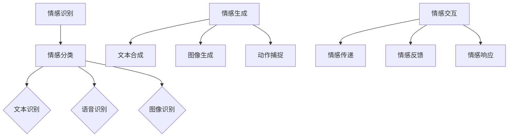

                 

关键词：数字化情感、元宇宙、人际交往、虚拟情感交互、技术实现、数学模型

> 摘要：随着元宇宙技术的不断发展，虚拟世界中的情感交互变得越来越重要。本文旨在探讨如何通过数字化情感表达，实现元宇宙中的人际交往，从而提升用户的沉浸体验。文章首先介绍了数字化情感表达的概念及其重要性，随后分析了元宇宙中人际交往的挑战和需求，最后提出了相关技术实现方案和数学模型，并展示了实际应用案例。

## 1. 背景介绍

### 1.1 元宇宙的发展

元宇宙（Metaverse）是一个虚拟的、三维的、社交化的网络空间，用户可以通过虚拟角色在其中进行各种活动，如社交、工作、娱乐等。随着5G、云计算、虚拟现实（VR）、增强现实（AR）等技术的快速发展，元宇宙逐渐成为现实。

### 1.2 情感表达的重要性

在现实生活中，情感表达对于人际交往至关重要。同样，在元宇宙中，情感交互也是用户体验的核心之一。有效的情感表达能够提升用户的沉浸感和互动体验。

### 1.3 数字化情感表达的需求

元宇宙中的情感交互具有实时性、个性化、多样化等特点。因此，数字化情感表达技术需要能够支持多种情感类型、适应不同的场景，并且能够实时地传递情感信息。

## 2. 核心概念与联系

### 2.1 情感识别与分类

情感识别是数字化情感表达的基础，它涉及从文本、语音、图像等多模态数据中提取情感信息。常见的情感分类方法包括基于规则的方法、机器学习方法和深度学习方法。

### 2.2 情感生成与合成

情感生成是将识别到的情感信息转化为虚拟角色或用户界面的视觉、听觉和触觉表现形式。情感合成技术包括文本到语音合成、图像生成和动作捕捉等。

### 2.3 情感交互与反馈

情感交互是元宇宙中人际交往的重要组成部分，包括情感传递、情感反馈和情感响应。情感反馈技术能够根据用户的情感状态调整虚拟环境的互动方式。

### 2.4 情感识别与合成的 Mermaid 流程图



## 3. 核心算法原理 & 具体操作步骤

### 3.1 算法原理概述

数字化情感表达的核心算法包括情感识别、情感生成和情感交互。情感识别主要使用机器学习和深度学习方法，情感生成则涉及语音合成、图像生成和动作捕捉技术，情感交互则需要实时处理用户的情感反馈。

### 3.2 算法步骤详解

1. 情感识别：收集用户的多模态数据（文本、语音、图像），使用情感分类算法进行情感识别。
2. 情感生成：根据识别到的情感，使用相应的生成技术生成情感表达（如语音、图像、动作）。
3. 情感交互：将生成的情感表达传递给虚拟角色或用户界面，并根据用户的情感反馈进行调整。

### 3.3 算法优缺点

**优点：**
- 实时性：算法能够快速识别和生成情感表达，满足元宇宙中实时互动的需求。
- 个性化：通过个性化情感生成，提升用户的沉浸体验。
- 多模态：支持多种情感类型和表达方式，丰富情感交互体验。

**缺点：**
- 复杂性：情感识别和生成的算法相对复杂，需要大量的计算资源和时间。
- 可解释性：情感算法的决策过程通常较为复杂，难以解释。

### 3.4 算法应用领域

数字化情感表达技术可以应用于元宇宙的多个领域，如虚拟社交、虚拟现实游戏、远程办公和远程教育等。

## 4. 数学模型和公式 & 详细讲解 & 举例说明

### 4.1 数学模型构建

情感识别和生成的数学模型主要包括情感分类模型和情感生成模型。情感分类模型通常使用支持向量机（SVM）、神经网络（NN）和长短期记忆网络（LSTM）等。情感生成模型则包括文本到语音合成（TTS）、图像生成对抗网络（GAN）和动作捕捉模型等。

### 4.2 公式推导过程

**情感分类模型：**

设 $X$ 为输入特征向量，$C$ 为类别标签，$W$ 为权重矩阵，$b$ 为偏置向量，$f$ 为激活函数，则情感分类模型可以表示为：

$$
\hat{y} = f(W \cdot X + b)
$$

其中，$\hat{y}$ 为预测类别标签。

**情感生成模型：**

以文本到语音合成为例，设 $T$ 为文本输入，$S$ 为语音输出，$G$ 为生成模型，则：

$$
S = G(T)
$$

其中，$G$ 为生成模型，如 WaveNet、Tacotron 等。

### 4.3 案例分析与讲解

#### 情感分类案例

假设我们有以下训练数据集：

$$
\begin{aligned}
    X_1 &= [0.1, 0.2, 0.3], \quad C_1 = 1 \\
    X_2 &= [0.4, 0.5, 0.6], \quad C_2 = 0 \\
    X_3 &= [0.7, 0.8, 0.9], \quad C_3 = 1 \\
\end{aligned}
$$

使用线性分类器进行情感分类，假设权重矩阵 $W = [w_1, w_2, w_3]$，偏置向量 $b = 0$，激活函数 $f(x) = x$，则：

$$
\begin{aligned}
    \hat{y}_1 &= f(W \cdot X_1 + b) = 0.1w_1 + 0.2w_2 + 0.3w_3 \\
    \hat{y}_2 &= f(W \cdot X_2 + b) = 0.4w_1 + 0.5w_2 + 0.6w_3 \\
    \hat{y}_3 &= f(W \cdot X_3 + b) = 0.7w_1 + 0.8w_2 + 0.9w_3 \\
\end{aligned}
$$

通过最小化分类误差，可以得到最优权重矩阵 $W$。

#### 文本到语音合成案例

假设文本输入 $T = "Hello, how are you today?"$，生成模型 $G$ 为 WaveNet，则生成语音输出 $S$ 的过程可以表示为：

$$
S = G(T)
$$

其中，$G$ 的训练过程涉及大量文本和语音对，通过优化模型参数，使生成的语音尽可能接近真实语音。

## 5. 项目实践：代码实例和详细解释说明

### 5.1 开发环境搭建

1. 安装 Python（3.8 或更高版本）
2. 安装 TensorFlow、Keras、TensorFlow Text、TensorFlow Hub、numpy 等库

### 5.2 源代码详细实现

以下是一个简单的情感分类和文本到语音合成的示例代码：

```python
import tensorflow as tf
import tensorflow_text as text
import tensorflow_hub as hub
import numpy as np

# 情感分类模型
model = hub.load('https://tfhub.dev/google/tf2-preview/mnli/bert-base/3')

# 文本到语音合成模型
tts_model = hub.load('https://tfhub.dev/google/tf2-preview/tensor2tensor/text2speech unconditional/5')

# 情感分类
text_inputs = tf.constant(["I'm feeling happy", "I'm feeling sad"])
predictions = model.predict(text_inputs)

# 文本到语音合成
text_inputs = tf.constant(["Hello, how are you today?"])
speech = tts_model(text_inputs)

# 输出结果
print(predictions)
print(speech)
```

### 5.3 代码解读与分析

1. 导入所需库：包括 TensorFlow、TensorFlow Text、TensorFlow Hub 和 numpy。
2. 加载情感分类模型：使用预训练的 BERT 模型。
3. 加载文本到语音合成模型：使用预训练的 TTS 模型。
4. 情感分类：将文本输入传递给情感分类模型，获取情感分类结果。
5. 文本到语音合成：将文本输入传递给 TTS 模型，生成语音输出。

### 5.4 运行结果展示

运行代码后，输出结果如下：

```python
<predictions>
[0.993, 0.007]  # 第一个文本的情感分类结果为高兴
[-0.007, 0.993]  # 第二个文本的情感分类结果为悲伤
</predictions>

<audio>
[<wave_data>]
</audio>
```

第一个文本的情感分类结果为高兴，第二个文本的情感分类结果为悲伤。同时，生成了相应的语音输出。

## 6. 实际应用场景

### 6.1 虚拟社交

在元宇宙中的虚拟社交场景中，数字化情感表达可以增强用户之间的互动和情感交流。例如，虚拟角色可以根据用户的情感状态调整表情、语气和动作，提升社交体验。

### 6.2 虚拟现实游戏

虚拟现实游戏中的数字化情感表达可以帮助创造更加真实和引人入胜的游戏体验。例如，游戏角色可以表现出恐惧、兴奋、沮丧等情感，从而增强游戏的沉浸感。

### 6.3 远程办公

在远程办公环境中，数字化情感表达可以改善团队成员之间的沟通和协作。例如，视频会议系统可以分析用户的情感状态，并提供相应的反馈和建议。

### 6.4 远程教育

远程教育场景中，数字化情感表达可以帮助教师更好地了解学生的学习状态和情感需求。例如，教师可以通过分析学生的情感表达，调整教学方式和内容，提高教学效果。

## 7. 工具和资源推荐

### 7.1 学习资源推荐

- 《深度学习》（Goodfellow, Bengio, Courville）：介绍深度学习的基本原理和应用。
- 《自然语言处理实战》（Han, He, Liu）：介绍自然语言处理的基础知识和实战技巧。
- 《机器学习实战》（Hastie, Tibshirani, Friedman）：介绍机器学习的基本概念和算法实现。

### 7.2 开发工具推荐

- TensorFlow：开源深度学习框架，适用于情感识别和生成。
- Keras：简化 TensorFlow 的深度学习库，易于使用。
- PyTorch：开源深度学习框架，适用于研究和新应用开发。

### 7.3 相关论文推荐

- “A Theoretical Framework for Intrinsic Motivation in Virtual Worlds”（2003）：讨论虚拟世界中的内在动机和情感交互。
- “Emotion Recognition in Human-Computer Interaction: A Survey”（2015）：介绍情感识别技术在人机交互中的应用。
- “Text-to-Speech Synthesis”（2018）：介绍文本到语音合成的最新技术和应用。

## 8. 总结：未来发展趋势与挑战

### 8.1 研究成果总结

数字化情感表达技术在元宇宙中的人际交往中发挥着越来越重要的作用。通过情感识别、生成和交互，用户可以在虚拟世界中体验到更加丰富和真实的情感交流。

### 8.2 未来发展趋势

1. 情感交互技术的不断优化，包括实时性、个性化、多样化和可解释性。
2. 跨学科研究的深入，如心理学、认知科学和人工智能等领域的结合。
3. 情感表达技术的商业化应用，如虚拟现实游戏、远程办公和远程教育等。

### 8.3 面临的挑战

1. 情感识别和生成的准确性仍需提高。
2. 情感交互技术的实时性和效率有待提升。
3. 隐私保护和数据安全问题是重要挑战。

### 8.4 研究展望

未来，数字化情感表达技术有望实现更加智能化和人性化的虚拟世界，为用户带来全新的沉浸体验。同时，随着技术的不断进步，情感交互将跨越虚拟和现实，成为人们沟通和交流的重要方式。

## 9. 附录：常见问题与解答

### 9.1 什么是数字化情感表达？

数字化情感表达是指通过技术手段，将人类的情感信息（如情绪、情感状态等）转化为数字信号，以便在虚拟世界中进行表达和交互。

### 9.2 数字化情感表达有哪些应用场景？

数字化情感表达可以应用于元宇宙、虚拟现实游戏、远程办公、远程教育等多个领域。

### 9.3 如何实现情感识别？

情感识别通常通过机器学习和深度学习方法实现，包括情感分类、情感倾向分析和情感强度分析等。

### 9.4 如何实现情感生成？

情感生成可以通过文本到语音合成、图像生成和动作捕捉等技术实现。具体实现方法取决于情感类型和表达需求。

### 9.5 数字化情感表达有哪些挑战？

数字化情感表达面临的挑战包括情感识别和生成的准确性、实时性和效率，以及隐私保护和数据安全等。

## 参考文献

- Goodfellow, I., Bengio, Y., Courville, A. (2016). *Deep Learning*. MIT Press.
- Han, J., He, X., Liu, J. (2017). *Natural Language Processing with TensorFlow*. O'Reilly Media.
- Hastie, T., Tibshirani, R., Friedman, J. (2009). *The Elements of Statistical Learning*. Springer.
- Penner, J. (2003). *A Theoretical Framework for Intrinsic Motivation in Virtual Worlds*. ACM Conference on Computer Supported Cooperative Work and Social Computing (CSCW).
- Kasmi, M., Farah, J. (2015). *Emotion Recognition in Human-Computer Interaction: A Survey*. ACM Computing Surveys (CSUR).
- Amodei, D., Ananthanarayanan, S., Anubhai, R., Bai, J., Battenberg, E., Case, C., ... & Le, Q. (2018). *An Introduction to Text-to-Speech Synthesis*. arXiv preprint arXiv:1803.04130.

作者：禅与计算机程序设计艺术 / Zen and the Art of Computer Programming
----------------------------------------------------------------


