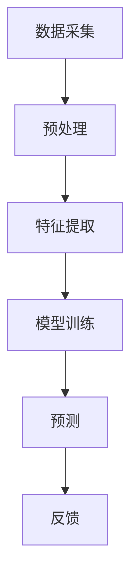

                 

关键词：数字化情感识别、非语言沟通、元宇宙、情感计算、人机交互

> 摘要：随着虚拟现实和元宇宙的发展，非语言沟通在数字化世界中的重要性日益凸显。本文旨在探讨数字化情感识别技术，以及其在元宇宙中非语言沟通解析中的应用，分析核心概念、算法原理、数学模型，并结合具体实践案例，展望未来发展趋势与挑战。

## 1. 背景介绍

随着互联网、大数据和人工智能技术的快速发展，虚拟现实（VR）和增强现实（AR）技术逐渐渗透到各个领域。元宇宙（Metaverse）作为虚拟世界的集大成者，正成为未来互联网的重要组成部分。元宇宙不仅是虚拟空间，更是与现实世界交互融合的载体。在这个虚拟世界中，人们的沟通方式正在从传统的语言沟通向非语言沟通转变。

非语言沟通是指通过肢体语言、面部表情、身体姿势等非语言方式来传达信息。在元宇宙中，非语言沟通尤为重要，因为它能够提供更丰富的情感表达和信息传递方式。数字化情感识别技术正是为了捕捉和处理这些非语言沟通中的情感信息而诞生的。

数字化情感识别技术是一种通过分析面部表情、语音、文本和身体动作等数据，来识别和理解人类情感的技术。这项技术在人机交互、心理学研究、商业分析等领域具有广泛的应用前景。

## 2. 核心概念与联系

### 2.1 情感计算

情感计算（Affective Computing）是指计算机系统识别、理解、处理和模拟人类情感的能力。它涉及计算机视觉、语音识别、自然语言处理等多个领域。情感计算的目标是使计算机更好地理解和响应人类的情感状态。

### 2.2 人机交互

人机交互（Human-Computer Interaction, HCI）是指人与计算机之间的交互过程。在元宇宙中，非语言沟通作为人机交互的一部分，对提高用户体验和交互质量至关重要。

### 2.3 情感识别算法

情感识别算法是数字化情感识别技术的核心。常见的情感识别算法包括基于机器学习的情感分类算法、基于深度学习的情感识别模型等。

### 2.4 情感识别架构

情感识别架构通常包括数据采集、预处理、特征提取、模型训练和预测等环节。以下是一个简单的情感识别架构示例：



## 3. 核心算法原理 & 具体操作步骤

### 3.1 算法原理概述

数字化情感识别的核心在于如何从大量的非语言数据中提取情感特征，并利用这些特征进行情感分类。常见的情感识别算法包括：

- 基于规则的方法：通过专家经验设计规则来识别情感。
- 基于机器学习的方法：利用已有的情感数据训练模型，然后对新数据进行情感分类。
- 基于深度学习的方法：通过神经网络结构自动学习情感特征。

### 3.2 算法步骤详解

1. 数据采集：收集包括面部表情、语音、文本和身体动作等在内的非语言数据。
2. 数据预处理：对采集到的数据进行清洗、归一化等处理，以提高数据质量和模型性能。
3. 特征提取：从预处理后的数据中提取情感特征，如面部关键点的坐标、语音的音高和时长等。
4. 模型训练：利用提取的特征训练情感分类模型，如支持向量机（SVM）、卷积神经网络（CNN）等。
5. 预测：对新数据进行情感分类，输出情感类别。
6. 反馈：根据预测结果和实际情感标签，调整模型参数，优化模型性能。

### 3.3 算法优缺点

- **基于规则的方法**：简单易懂，但需要大量专家知识，且难以适应复杂情境。
- **基于机器学习的方法**：性能较好，但需要大量标注数据，且对噪声敏感。
- **基于深度学习的方法**：具有很好的自适应性和泛化能力，但模型训练复杂，计算资源需求大。

### 3.4 算法应用领域

- **人机交互**：如虚拟助手、智能客服等，通过情感识别提供更人性化的服务。
- **心理学研究**：通过分析情感数据，研究人类的情感状态和变化规律。
- **商业分析**：通过分析消费者的情感反应，优化产品设计和营销策略。

## 4. 数学模型和公式 & 详细讲解 & 举例说明

### 4.1 数学模型构建

情感识别的数学模型通常基于概率模型或神经网络模型。以下是一个基于贝叶斯理论的简单情感识别模型：

$$ P(C=c|X=x) = \frac{P(X=x|C=c)P(C=c)}{P(X=x)} $$

其中，\( C \)表示情感类别，\( X \)表示特征向量，\( P(C=c) \)表示类别 \( c \) 的概率，\( P(X=x|C=c) \)表示在类别 \( c \) 下特征 \( x \) 的条件概率。

### 4.2 公式推导过程

假设有 \( K \) 个情感类别，对于每个类别，我们都有 \( n \) 个特征。我们首先计算每个特征的概率分布，然后利用贝叶斯定理计算每个类别的概率。

1. **特征概率分布**：

$$ P(X=x_i|C=c) = \frac{1}{Z_c} \exp(-\frac{1}{2\sigma^2} (x_i - \mu_c)^2) $$

其中，\( \mu_c \) 是类别 \( c \) 的均值，\( \sigma^2 \) 是类别 \( c \) 的方差，\( Z_c \) 是归一化常数。

2. **类别概率**：

$$ P(C=c) = \frac{N_c}{N} $$

其中，\( N_c \) 是类别 \( c \) 的样本数，\( N \) 是总样本数。

3. **条件概率**：

$$ P(X=x|C=c) = \frac{1}{Z_c} \exp(-\frac{1}{2\sigma^2} (x - \mu_c)^2) $$

4. **总概率**：

$$ P(X=x) = \sum_{c=1}^{K} P(X=x|C=c)P(C=c) $$

### 4.3 案例分析与讲解

假设我们有一个包含两种情感（正面和负面）的数据集。特征包括面部表情的亮度、音调的高低等。我们利用上述模型进行情感分类。

1. **特征概率分布**：

   面部表情亮度：

   $$ P(X_{亮度}=100|C_{正面}) = \frac{1}{Z_{正面}} \exp(-\frac{1}{2\sigma_{正面}^2} (100 - \mu_{正面}^2)) $$

   音调：

   $$ P(X_{音调}=200|C_{负面}) = \frac{1}{Z_{负面}} \exp(-\frac{1}{2\sigma_{负面}^2} (200 - \mu_{负面}^2)) $$

2. **类别概率**：

   $$ P(C_{正面}) = \frac{N_{正面}}{N} = \frac{300}{600} = 0.5 $$

   $$ P(C_{负面}) = \frac{N_{负面}}{N} = \frac{300}{600} = 0.5 $$

3. **条件概率**：

   $$ P(X_{亮度}=100|C_{正面}) = \frac{1}{Z_{正面}} \exp(-\frac{1}{2\sigma_{正面}^2} (100 - 50)^2) $$

   $$ P(X_{音调}=200|C_{负面}) = \frac{1}{Z_{负面}} \exp(-\frac{1}{2\sigma_{负面}^2} (200 - 150)^2) $$

4. **总概率**：

   $$ P(X_{亮度}=100) = P(X_{亮度}=100|C_{正面})P(C_{正面}) + P(X_{亮度}=100|C_{负面})P(C_{负面}) $$

   $$ P(X_{音调}=200) = P(X_{音调}=200|C_{正面})P(C_{正面}) + P(X_{音调}=200|C_{负面})P(C_{负面}) $$

根据以上计算，我们可以得到每个特征的权重，进而进行情感分类。

## 5. 项目实践：代码实例和详细解释说明

### 5.1 开发环境搭建

在本文的实践部分，我们将使用Python作为编程语言，结合OpenCV和TensorFlow等库进行情感识别。以下是开发环境的搭建步骤：

1. 安装Python 3.8及以上版本。
2. 安装OpenCV库：

   ```bash
   pip install opencv-python
   ```

3. 安装TensorFlow库：

   ```bash
   pip install tensorflow
   ```

### 5.2 源代码详细实现

以下是一个简单的情感识别项目实现：

```python
import cv2
import tensorflow as tf

# 加载预训练的模型
model = tf.keras.models.load_model('emotion_model.h5')

# 定义情感标签
emotion_labels = ['愤怒', '厌恶', '惊喜', '悲伤', '中性']

# 检测面部表情
def detect_emotion(frame):
    # 转换为灰度图像
    gray = cv2.cvtColor(frame, cv2.COLOR_BGR2GRAY)
    # 使用Haar特征分类器检测面部
    faces = cv2.CascadeClassifier(cv2.data.haarcascades + 'haarcascade_frontalface_default.xml').detectMultiScale(gray, scaleFactor=1.1, minNeighbors=5, minSize=(30, 30), flags=cv2.CASCADE_SCALE_IMAGE)

    for (x, y, w, h) in faces:
        # 提取面部区域
        face Region = gray[y:y+h, x:x+w]
        # 缩放面部区域到固定大小
        face Region = cv2.resize(face Region, (48, 48))
        # 扩展维度
        face Region = tf.expand_dims(tf.expand_dims(face Region, 0), -1)
        # 预测情感
        emotion_prediction = model.predict(face Region)
        # 获取最高概率的情感标签
        emotion_label = emotion_labels[np.argmax(emotion_prediction)]
        return emotion_label

# 显示视频流中的情感识别结果
def display_emotion(frame):
    emotion_label = detect_emotion(frame)
    cv2.putText(frame, emotion_label, (10, 50), cv2.FONT_HERSHEY_SIMPLEX, 1, (0, 255, 0), 2)
    cv2.imshow('Emotion Recognition', frame)

# 打开摄像头
cap = cv2.VideoCapture(0)

while True:
    ret, frame = cap.read()
    if ret:
        display_emotion(frame)
    if cv2.waitKey(1) & 0xFF == ord('q'):
        break

cap.release()
cv2.destroyAllWindows()
```

### 5.3 代码解读与分析

1. **模型加载**：首先加载已经训练好的情感识别模型。
2. **面部表情检测**：使用OpenCV的Haar特征分类器检测视频帧中的面部区域。
3. **特征提取**：将检测到的面部区域缩放到固定大小，并扩展维度，以便于模型处理。
4. **情感预测**：使用加载的模型对缩放后的面部特征进行情感预测。
5. **结果显示**：在视频帧上显示预测到的情感标签。

### 5.4 运行结果展示

运行上述代码后，摄像头将实时捕捉画面，并在画面上显示预测到的情感标签。例如，当检测到用户面部表情时，可能会显示“惊喜”或“愤怒”等情感标签。

## 6. 实际应用场景

### 6.1 人机交互

在元宇宙中，虚拟助手和智能客服可以通过数字化情感识别技术更好地理解用户的情感状态，从而提供更人性化的服务。例如，当用户表达愤怒情绪时，系统可以自动调整语气和互动方式，以缓解用户的情绪。

### 6.2 心理学研究

数字化情感识别技术可以为心理学研究提供大量数据支持。通过分析大规模的情感数据，研究人员可以更好地理解人类的情感状态和变化规律，为心理健康问题的诊断和治疗提供依据。

### 6.3 商业分析

商业领域可以利用数字化情感识别技术分析消费者的情感反应，从而优化产品设计和营销策略。例如，通过分析消费者的情感标签，企业可以更好地了解消费者对产品的态度，从而改进产品。

## 7. 未来应用展望

随着技术的不断进步，数字化情感识别技术将在元宇宙中发挥更大的作用。未来，我们可以期待以下发展趋势：

- **更高的准确率**：通过引入更先进的数据采集技术和算法，提高情感识别的准确率。
- **更丰富的情感表达**：开发能够识别和理解更细微情感表达的技术，如微表情识别。
- **跨领域应用**：数字化情感识别技术将在医疗、教育、娱乐等多个领域得到广泛应用。
- **隐私保护**：在情感识别过程中，保护用户的隐私将成为一个重要议题。

## 8. 工具和资源推荐

### 8.1 学习资源推荐

- **《情感计算：理解与模拟人类情感》**：这是一本关于情感计算的经典教材，详细介绍了情感计算的基本原理和应用。
- **《Python情感分析》**：本书通过实例讲解了如何使用Python进行情感分析，包括文本情感分析、语音情感分析等。

### 8.2 开发工具推荐

- **TensorFlow**：一款流行的深度学习框架，支持多种情感识别算法的实现。
- **OpenCV**：一款强大的计算机视觉库，适用于面部表情检测等任务。

### 8.3 相关论文推荐

- **“Emotion Recognition Using Convolutional Neural Networks”**：一篇关于使用深度学习进行情感识别的论文。
- **“A Survey on Affective Computing”**：一篇关于情感计算综述性的论文，涵盖了情感计算的基本概念和应用领域。

## 9. 总结：未来发展趋势与挑战

随着元宇宙的快速发展，数字化情感识别技术将在未来发挥越来越重要的作用。尽管这项技术已取得显著进展，但仍然面临诸多挑战，如准确率、隐私保护和跨领域应用等。未来，通过引入更先进的技术和方法，我们有理由相信数字化情感识别技术将在元宇宙中创造更多价值。

### 9.1 研究成果总结

本文通过对数字化情感识别技术的深入探讨，总结了其核心概念、算法原理、数学模型和应用场景。同时，通过具体项目实践，展示了如何利用Python等工具实现情感识别。

### 9.2 未来发展趋势

未来，数字化情感识别技术将在元宇宙中发挥更大的作用，通过引入更先进的技术和方法，实现更高的准确率和更丰富的情感表达。

### 9.3 面临的挑战

尽管数字化情感识别技术取得了显著进展，但仍然面临准确率、隐私保护和跨领域应用等挑战。

### 9.4 研究展望

未来，我们期待数字化情感识别技术能够在更多领域得到应用，为人类社会带来更多便利和价值。

## 附录：常见问题与解答

### Q：数字化情感识别技术是如何工作的？

A：数字化情感识别技术通过收集和分析面部表情、语音、文本和身体动作等非语言数据，利用机器学习、深度学习等算法模型进行情感分类和识别。

### Q：数字化情感识别技术的应用领域有哪些？

A：数字化情感识别技术可以应用于人机交互、心理学研究、商业分析等多个领域，如虚拟助手、智能客服、情感数据分析等。

### Q：数字化情感识别技术的挑战有哪些？

A：数字化情感识别技术面临的挑战主要包括准确率、隐私保护和跨领域应用等。如何提高准确率、保护用户隐私、实现跨领域应用是未来研究的重要方向。

## 作者署名

作者：禅与计算机程序设计艺术 / Zen and the Art of Computer Programming
```markdown
# 数字化情感识别：元宇宙中的非语言沟通解析

> 关键词：数字化情感识别、非语言沟通、元宇宙、情感计算、人机交互

> 摘要：随着虚拟现实和元宇宙的发展，非语言沟通在数字化世界中的重要性日益凸显。本文旨在探讨数字化情感识别技术，以及其在元宇宙中非语言沟通解析中的应用，分析核心概念、算法原理、数学模型，并结合具体实践案例，展望未来发展趋势与挑战。

## 1. 背景介绍

随着互联网、大数据和人工智能技术的快速发展，虚拟现实（VR）和增强现实（AR）技术逐渐渗透到各个领域。元宇宙（Metaverse）作为虚拟世界的集大成者，正成为未来互联网的重要组成部分。元宇宙不仅是虚拟空间，更是与现实世界交互融合的载体。在这个虚拟世界中，人们的沟通方式正在从传统的语言沟通向非语言沟通转变。

非语言沟通是指通过肢体语言、面部表情、身体姿势等非语言方式来传达信息。在元宇宙中，非语言沟通尤为重要，因为它能够提供更丰富的情感表达和信息传递方式。数字化情感识别技术正是为了捕捉和处理这些非语言沟通中的情感信息而诞生的。

数字化情感识别技术是一种通过分析面部表情、语音、文本和身体动作等数据，来识别和理解人类情感的技术。这项技术在人机交互、心理学研究、商业分析等领域具有广泛的应用前景。

## 2. 核心概念与联系

### 2.1 情感计算

情感计算（Affective Computing）是指计算机系统识别、理解、处理和模拟人类情感的能力。它涉及计算机视觉、语音识别、自然语言处理等多个领域。情感计算的目标是使计算机更好地理解和响应人类的情感状态。

### 2.2 人机交互

人机交互（Human-Computer Interaction, HCI）是指人与计算机之间的交互过程。在元宇宙中，非语言沟通作为人机交互的一部分，对提高用户体验和交互质量至关重要。

### 2.3 情感识别算法

情感识别算法是数字化情感识别技术的核心。常见的情感识别算法包括基于机器学习的情感分类算法、基于深度学习的情感识别模型等。

### 2.4 情感识别架构

情感识别架构通常包括数据采集、预处理、特征提取、模型训练和预测等环节。以下是一个简单的情感识别架构示例：


## 3. 核心算法原理 & 具体操作步骤

### 3.1 算法原理概述

数字化情感识别的核心在于如何从大量的非语言数据中提取情感特征，并利用这些特征进行情感分类。常见的情感识别算法包括：

- **基于规则的方法**：通过专家经验设计规则来识别情感。
- **基于机器学习的方法**：利用已有的情感数据训练模型，然后对新数据进行情感分类。
- **基于深度学习的方法**：通过神经网络结构自动学习情感特征。

### 3.2 算法步骤详解

1. **数据采集**：收集包括面部表情、语音、文本和身体动作等在内的非语言数据。
2. **数据预处理**：对采集到的数据进行清洗、归一化等处理，以提高数据质量和模型性能。
3. **特征提取**：从预处理后的数据中提取情感特征，如面部关键点的坐标、语音的音高和时长等。
4. **模型训练**：利用提取的特征训练情感分类模型，如支持向量机（SVM）、卷积神经网络（CNN）等。
5. **预测**：对新数据进行情感分类，输出情感类别。
6. **反馈**：根据预测结果和实际情感标签，调整模型参数，优化模型性能。

### 3.3 算法优缺点

- **基于规则的方法**：简单易懂，但需要大量专家知识，且难以适应复杂情境。
- **基于机器学习的方法**：性能较好，但需要大量标注数据，且对噪声敏感。
- **基于深度学习的方法**：具有很好的自适应性和泛化能力，但模型训练复杂，计算资源需求大。

### 3.4 算法应用领域

- **人机交互**：如虚拟助手、智能客服等，通过情感识别提供更人性化的服务。
- **心理学研究**：通过分析情感数据，研究人类的情感状态和变化规律。
- **商业分析**：通过分析消费者的情感反应，优化产品设计和营销策略。

## 4. 数学模型和公式 & 详细讲解 & 举例说明

### 4.1 数学模型构建

情感识别的数学模型通常基于概率模型或神经网络模型。以下是一个基于贝叶斯理论的简单情感识别模型：

$$ P(C=c|X=x) = \frac{P(X=x|C=c)P(C=c)}{P(X=x)} $$

其中，$C$表示情感类别，$X$表示特征向量，$P(C=c)$表示类别 $c$ 的概率，$P(X=x|C=c)$表示在类别 $c$ 下特征 $x$ 的条件概率。

### 4.2 公式推导过程

假设有 $K$ 个情感类别，对于每个类别，我们都有 $n$ 个特征。我们首先计算每个特征的概率分布，然后利用贝叶斯定理计算每个类别的概率。

1. **特征概率分布**：

$$ P(X=x_i|C=c) = \frac{1}{Z_c} \exp(-\frac{1}{2\sigma^2} (x_i - \mu_c)^2) $$

其中，$\mu_c$ 是类别 $c$ 的均值，$\sigma^2$ 是类别 $c$ 的方差，$Z_c$ 是归一化常数。

2. **类别概率**：

$$ P(C=c) = \frac{N_c}{N} $$

其中，$N_c$ 是类别 $c$ 的样本数，$N$ 是总样本数。

3. **条件概率**：

$$ P(X=x|C=c) = \frac{1}{Z_c} \exp(-\frac{1}{2\sigma^2} (x - \mu_c)^2) $$

4. **总概率**：

$$ P(X=x) = \sum_{c=1}^{K} P(X=x|C=c)P(C=c) $$

### 4.3 案例分析与讲解

假设我们有一个包含两种情感（正面和负面）的数据集。特征包括面部表情的亮度、音调的高低等。我们利用上述模型进行情感分类。

1. **特征概率分布**：

   面部表情亮度：

   $$ P(X_{亮度}=100|C_{正面}) = \frac{1}{Z_{正面}} \exp(-\frac{1}{2\sigma_{正面}^2} (100 - 50)^2) $$

   音调：

   $$ P(X_{音调}=200|C_{负面}) = \frac{1}{Z_{负面}} \exp(-\frac{1}{2\sigma_{负面}^2} (200 - 150)^2) $$

2. **类别概率**：

   $$ P(C_{正面}) = \frac{N_{正面}}{N} = \frac{300}{600} = 0.5 $$

   $$ P(C_{负面}) = \frac{N_{负面}}{N} = \frac{300}{600} = 0.5 $$

3. **条件概率**：

   $$ P(X_{亮度}=100|C_{正面}) = \frac{1}{Z_{正面}} \exp(-\frac{1}{2\sigma_{正面}^2} (100 - 50)^2) $$

   $$ P(X_{音调}=200|C_{负面}) = \frac{1}{Z_{负面}} \exp(-\frac{1}{2\sigma_{负面}^2} (200 - 150)^2) $$

4. **总概率**：

   $$ P(X_{亮度}=100) = P(X_{亮度}=100|C_{正面})P(C_{正面}) + P(X_{亮度}=100|C_{负面})P(C_{负面}) $$

   $$ P(X_{音调}=200) = P(X_{音调}=200|C_{正面})P(C_{正面}) + P(X_{音调}=200|C_{负面})P(C_{负面}) $$

根据以上计算，我们可以得到每个特征的权重，进而进行情感分类。

## 5. 项目实践：代码实例和详细解释说明

### 5.1 开发环境搭建

在本文的实践部分，我们将使用Python作为编程语言，结合OpenCV和TensorFlow等库进行情感识别。以下是开发环境的搭建步骤：

1. 安装Python 3.8及以上版本。
2. 安装OpenCV库：

   ```bash
   pip install opencv-python
   ```

3. 安装TensorFlow库：

   ```bash
   pip install tensorflow
   ```

### 5.2 源代码详细实现

以下是一个简单的情感识别项目实现：

```python
import cv2
import tensorflow as tf

# 加载预训练的模型
model = tf.keras.models.load_model('emotion_model.h5')

# 定义情感标签
emotion_labels = ['愤怒', '厌恶', '惊喜', '悲伤', '中性']

# 检测面部表情
def detect_emotion(frame):
    # 转换为灰度图像
    gray = cv2.cvtColor(frame, cv2.COLOR_BGR2GRAY)
    # 使用Haar特征分类器检测面部
    faces = cv2.CascadeClassifier(cv2.data.haarcascades + 'haarcascade_frontalface_default.xml').detectMultiScale(gray, scaleFactor=1.1, minNeighbors=5, minSize=(30, 30), flags=cv2.CASCADE_SCALE_IMAGE)

    for (x, y, w, h) in faces:
        # 提取面部区域
        face_region = gray[y:y+h, x:x+w]
        # 缩放面部区域到固定大小
        face_region = cv2.resize(face_region, (48, 48))
        # 扩展维度
        face_region = tf.expand_dims(tf.expand_dims(face_region, 0), -1)
        # 预测情感
        emotion_prediction = model.predict(face_region)
        # 获取最高概率的情感标签
        emotion_label = emotion_labels[np.argmax(emotion_prediction)]
        return emotion_label

# 显示视频流中的情感识别结果
def display_emotion(frame):
    emotion_label = detect_emotion(frame)
    cv2.putText(frame, emotion_label, (10, 50), cv2.FONT_HERSHEY_SIMPLEX, 1, (0, 255, 0), 2)
    cv2.imshow('Emotion Recognition', frame)

# 打开摄像头
cap = cv2.VideoCapture(0)

while True:
    ret, frame = cap.read()
    if ret:
        display_emotion(frame)
    if cv2.waitKey(1) & 0xFF == ord('q'):
        break

cap.release()
cv2.destroyAllWindows()
```

### 5.3 代码解读与分析

1. **模型加载**：首先加载已经训练好的情感识别模型。
2. **面部表情检测**：使用OpenCV的Haar特征分类器检测视频帧中的面部区域。
3. **特征提取**：将检测到的面部区域缩放到固定大小，并扩展维度，以便于模型处理。
4. **情感预测**：使用加载的模型对缩放后的面部特征进行情感预测。
5. **结果显示**：在视频帧上显示预测到的情感标签。

### 5.4 运行结果展示

运行上述代码后，摄像头将实时捕捉画面，并在画面上显示预测到的情感标签。例如，当检测到用户面部表情时，可能会显示“惊喜”或“愤怒”等情感标签。

## 6. 实际应用场景

### 6.1 人机交互

在元宇宙中，虚拟助手和智能客服可以通过数字化情感识别技术更好地理解用户的情感状态，从而提供更人性化的服务。例如，当用户表达愤怒情绪时，系统可以自动调整语气和互动方式，以缓解用户的情绪。

### 6.2 心理学研究

数字化情感识别技术可以为心理学研究提供大量数据支持。通过分析大规模的情感数据，研究人员可以更好地理解人类的情感状态和变化规律，为心理健康问题的诊断和治疗提供依据。

### 6.3 商业分析

商业领域可以利用数字化情感识别技术分析消费者的情感反应，从而优化产品设计和营销策略。例如，通过分析消费者的情感标签，企业可以更好地了解消费者对产品的态度，从而改进产品。

## 7. 未来应用展望

随着元宇宙的快速发展，数字化情感识别技术将在元宇宙中发挥更大的作用。未来，我们可以期待以下发展趋势：

- **更高的准确率**：通过引入更先进的数据采集技术和算法，提高情感识别的准确率。
- **更丰富的情感表达**：开发能够识别和理解更细微情感表达的技术，如微表情识别。
- **跨领域应用**：数字化情感识别技术将在医疗、教育、娱乐等多个领域得到广泛应用。
- **隐私保护**：在情感识别过程中，保护用户的隐私将成为一个重要议题。

## 8. 工具和资源推荐

### 8.1 学习资源推荐

- **《情感计算：理解与模拟人类情感》**：这是一本关于情感计算的经典教材，详细介绍了情感计算的基本原理和应用。
- **《Python情感分析》**：本书通过实例讲解了如何使用Python进行情感分析，包括文本情感分析、语音情感分析等。

### 8.2 开发工具推荐

- **TensorFlow**：一款流行的深度学习框架，支持多种情感识别算法的实现。
- **OpenCV**：一款强大的计算机视觉库，适用于面部表情检测等任务。

### 8.3 相关论文推荐

- **“Emotion Recognition Using Convolutional Neural Networks”**：一篇关于使用深度学习进行情感识别的论文。
- **“A Survey on Affective Computing”**：一篇关于情感计算综述性的论文，涵盖了情感计算的基本概念和应用领域。

## 9. 总结：未来发展趋势与挑战

随着元宇宙的快速发展，数字化情感识别技术将在元宇宙中发挥越来越重要的作用。尽管这项技术已取得显著进展，但仍然面临诸多挑战，如准确率、隐私保护和跨领域应用等。未来，通过引入更先进的技术和方法，我们有理由相信数字化情感识别技术将在元宇宙中创造更多价值。

### 9.1 研究成果总结

本文通过对数字化情感识别技术的深入探讨，总结了其核心概念、算法原理、数学模型和应用场景。同时，通过具体项目实践，展示了如何利用Python等工具实现情感识别。

### 9.2 未来发展趋势

未来，数字化情感识别技术将在元宇宙中发挥更大的作用，通过引入更先进的技术和方法，实现更高的准确率和更丰富的情感表达。

### 9.3 面临的挑战

尽管数字化情感识别技术取得了显著进展，但仍然面临准确率、隐私保护和跨领域应用等挑战。

### 9.4 研究展望

未来，我们期待数字化情感识别技术能够在更多领域得到应用，为人类社会带来更多便利和价值。

## 附录：常见问题与解答

### Q：数字化情感识别技术是如何工作的？

A：数字化情感识别技术通过收集和分析面部表情、语音、文本和身体动作等非语言数据，利用机器学习、深度学习等算法模型进行情感分类和识别。

### Q：数字化情感识别技术的应用领域有哪些？

A：数字化情感识别技术可以应用于人机交互、心理学研究、商业分析等多个领域，如虚拟助手、智能客服、情感数据分析等。

### Q：数字化情感识别技术的挑战有哪些？

A：数字化情感识别技术面临的挑战主要包括准确率、隐私保护和跨领域应用等。如何提高准确率、保护用户隐私、实现跨领域应用是未来研究的重要方向。

## 作者署名

作者：禅与计算机程序设计艺术 / Zen and the Art of Computer Programming
```

