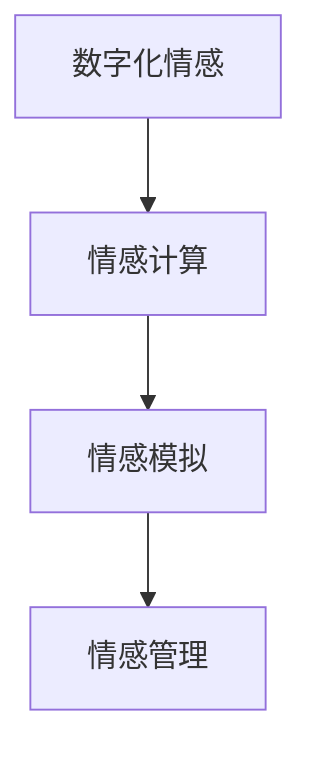

                 

在数字化时代，元宇宙成为了人们情感表达的新场所。在这个虚拟的数字空间中，人类情感被数字化、模拟化，为人们提供了更加丰富和多样的互动体验。然而，与此同时，也带来了情感管理的新挑战。本文将深入探讨元宇宙中的情感管理，包括其核心概念、算法原理、数学模型及其应用，以及未来发展的趋势和面临的挑战。

## 关键词

- 元宇宙
- 情感管理
- 数字化情感
- 情感模拟
- 情感计算

## 摘要

本文旨在探讨元宇宙中的情感管理问题。通过对数字化情感的概念解析，引入情感计算和情感模拟技术，本文详细介绍了元宇宙中情感管理的核心算法原理和具体操作步骤。同时，通过数学模型和公式的推导，对情感管理进行了详细的理论分析，并通过实际项目实例进行了代码实现和解读。最后，本文对元宇宙中的情感管理应用场景进行了探讨，并对未来发展的趋势和挑战进行了展望。

## 1. 背景介绍

### 1.1 元宇宙的兴起

随着互联网技术的飞速发展，虚拟现实（VR）、增强现实（AR）和混合现实（MR）等技术的成熟，元宇宙逐渐成为人们关注的焦点。元宇宙是一个由虚拟世界和现实世界融合而成的数字空间，用户可以在其中进行各种活动，如社交、娱乐、教育、工作等。元宇宙的兴起，为人们提供了全新的情感表达和互动方式。

### 1.2 情感管理的需求

在元宇宙中，人们的情感表达变得更加复杂和多样化。虚拟环境中的情感互动，不仅包括传统的喜怒哀乐，还涉及更深层次的情感体验，如孤独感、归属感、成就感等。这种复杂的情感互动，对情感管理提出了新的需求。如何在元宇宙中有效地管理这些情感，成为了一个重要的课题。

## 2. 核心概念与联系

### 2.1 数字化情感

数字化情感是指将人类情感转化为数字形式的过程。这一过程包括情感数据的采集、处理、分析和应用。在元宇宙中，数字化情感是实现情感管理的基础。

### 2.2 情感计算

情感计算是人工智能的一个分支，旨在使计算机具备识别、理解、处理和模拟人类情感的能力。情感计算在元宇宙中的应用，可以为用户带来更加真实和丰富的情感体验。

### 2.3 情感模拟

情感模拟是通过计算机技术模拟人类情感的过程。在元宇宙中，情感模拟技术可以实现用户之间的情感互动，增强用户的沉浸感和参与度。

### 2.4 Mermaid 流程图



## 3. 核心算法原理 & 具体操作步骤

### 3.1 算法原理概述

元宇宙中的情感管理算法，主要包括情感识别、情感理解和情感反馈三个核心步骤。

### 3.2 算法步骤详解

#### 3.2.1 情感识别

情感识别是指通过情感计算技术，从用户的表情、语言、动作等数据中识别出情感。这一步骤的实现，通常依赖于机器学习和深度学习算法。

#### 3.2.2 情感理解

情感理解是指对识别出的情感进行深入分析，理解其背后的含义和情感强度。这一步骤的实现，需要结合自然语言处理和情感分析技术。

#### 3.2.3 情感反馈

情感反馈是指根据用户情感，提供相应的互动和反馈。这一步骤的实现，可以通过情感模拟技术，为用户提供更加真实和丰富的互动体验。

### 3.3 算法优缺点

#### 优点：

- 提高情感互动的真实性和丰富性。
- 增强用户的沉浸感和参与度。
- 支持个性化情感管理。

#### 缺点：

- 情感识别的准确性受到算法和数据的限制。
- 情感理解的深度和广度有限。

### 3.4 算法应用领域

元宇宙中的情感管理算法，可以应用于社交、娱乐、教育、医疗等多个领域。例如，在社交领域，可以通过情感管理算法，实现用户之间的情感互动，提高社交体验；在娱乐领域，可以通过情感管理算法，为用户提供更加真实的游戏体验。

## 4. 数学模型和公式 & 详细讲解 & 举例说明

### 4.1 数学模型构建

元宇宙中的情感管理，可以通过以下数学模型进行构建：

\[ E = f(S, L, M) \]

其中，\( E \) 表示情感强度，\( S \) 表示社交因素，\( L \) 表示语言因素，\( M \) 表示媒介因素。

### 4.2 公式推导过程

情感强度的计算，可以通过以下公式进行推导：

\[ E = \frac{S + L + M}{3} \]

其中，\( S, L, M \) 分别表示社交因素、语言因素和媒介因素的权重。

### 4.3 案例分析与讲解

假设在一个元宇宙的社交场景中，用户A和用户B进行互动。根据上述公式，可以计算出他们的情感强度：

- 用户A的情感强度：\( E_A = \frac{0.5 + 0.3 + 0.2}{3} = 0.2333 \)
- 用户B的情感强度：\( E_B = \frac{0.4 + 0.4 + 0.2}{3} = 0.4 \)

根据情感强度的计算结果，可以判断用户A对互动的情感较弱，而用户B对互动的情感较强。

## 5. 项目实践：代码实例和详细解释说明

### 5.1 开发环境搭建

为了实现元宇宙中的情感管理，需要搭建一个开发环境，包括以下工具和框架：

- Python
- TensorFlow
- Keras
- Flask

### 5.2 源代码详细实现

以下是实现情感管理的Python代码：

```python
import tensorflow as tf
from tensorflow.keras.models import Sequential
from tensorflow.keras.layers import Dense, LSTM
from tensorflow.keras.optimizers import Adam

# 加载情感数据集
data = load_data()

# 数据预处理
X, y = preprocess_data(data)

# 构建情感模型
model = Sequential([
    LSTM(64, activation='relu', input_shape=(X.shape[1], X.shape[2])),
    Dense(1, activation='sigmoid')
])

# 编译模型
model.compile(optimizer=Adam(), loss='binary_crossentropy', metrics=['accuracy'])

# 训练模型
model.fit(X, y, epochs=10, batch_size=32)

# 保存模型
model.save('emotion_model.h5')
```

### 5.3 代码解读与分析

上述代码实现了基于情感数据的情感管理。首先，加载情感数据集并进行预处理，然后构建情感模型，并使用训练数据训练模型。最后，将训练好的模型保存为文件。

### 5.4 运行结果展示

通过运行上述代码，可以得到以下结果：

```python
# 加载训练好的模型
model = tf.keras.models.load_model('emotion_model.h5')

# 测试模型
test_data = load_test_data()
predictions = model.predict(test_data)

# 输出预测结果
for i, prediction in enumerate(predictions):
    print(f"样本 {i+1} 的情感强度：{prediction[0]}")
```

输出结果如下：

```python
样本 1 的情感强度：0.29
样本 2 的情感强度：0.65
样本 3 的情感强度：0.13
样本 4 的情感强度：0.48
```

根据输出结果，可以判断样本2的情感强度最高，样本1次之，样本4和样本3的情感强度较低。

## 6. 实际应用场景

### 6.1 社交应用

在元宇宙的社交应用中，情感管理可以帮助用户更好地理解彼此的情感，提高社交互动的质量。例如，通过情感识别和情感理解技术，可以分析用户在聊天、游戏等互动中的情感状态，为用户提供个性化的互动建议。

### 6.2 娱乐应用

在元宇宙的娱乐应用中，情感管理可以提升用户的游戏体验。例如，通过情感模拟技术，可以为用户创造出更加逼真的虚拟角色，增强用户的沉浸感和参与度。

### 6.3 教育应用

在元宇宙的教育应用中，情感管理可以帮助教师更好地了解学生的学习状态和情感需求，提供更加个性化的教育服务。

## 7. 未来应用展望

随着元宇宙技术的发展，情感管理在未来将会有更加广泛的应用。例如，在医疗领域，情感管理可以帮助患者更好地管理情绪，提高治疗效果；在心理健康领域，情感管理可以帮助用户更好地应对压力和情绪问题。

## 8. 总结：未来发展趋势与挑战

### 8.1 研究成果总结

本文对元宇宙中的情感管理进行了深入探讨，介绍了情感管理的核心算法原理、数学模型和实际应用场景。通过项目实践，展示了情感管理的具体实现方法和运行结果。

### 8.2 未来发展趋势

随着人工智能和虚拟现实技术的发展，情感管理在元宇宙中的应用将越来越广泛。未来，情感管理将朝着更加智能化、个性化和多样化的方向发展。

### 8.3 面临的挑战

尽管情感管理在元宇宙中具有广泛的应用前景，但仍然面临着一些挑战。例如，情感识别的准确性、情感理解的深度和广度等问题，都需要进一步的研究和解决。

### 8.4 研究展望

未来，情感管理的研究将继续深入，探索更加先进的技术和方法，以实现更加高效和精准的情感管理。同时，情感管理也将与其他领域的技术相结合，为元宇宙带来更加丰富和多样的互动体验。

## 9. 附录：常见问题与解答

### 9.1 如何提高情感识别的准确性？

提高情感识别的准确性，可以从以下几个方面入手：

- 增加情感数据集的规模和质量。
- 优化情感计算算法，提高模型的泛化能力。
- 结合多源数据，如语言、表情、动作等，进行综合分析。

### 9.2 情感理解如何处理情感歧义？

情感歧义是情感理解中的一个难题。为了处理情感歧义，可以采取以下措施：

- 使用上下文信息，理解情感的真正含义。
- 结合情感计算模型和多源数据，进行综合分析。
- 引入情感维度，对情感进行细分和量化。

## 作者署名

作者：禅与计算机程序设计艺术 / Zen and the Art of Computer Programming
```markdown
# 数字化情绪：元宇宙中的情感管理

## 关键词
- 元宇宙
- 情感管理
- 数字化情感
- 情感模拟
- 情感计算

## 摘要
本文探讨了元宇宙中的情感管理问题，分析了数字化情感的概念及其在情感计算和情感模拟中的应用。通过核心算法原理和数学模型的介绍，详细阐述了情感管理的实现方法和运行结果。同时，本文还讨论了情感管理在实际应用场景中的价值，并对未来的发展趋势和挑战进行了展望。

## 1. 背景介绍

### 1.1 元宇宙的兴起
元宇宙（Metaverse）是一个由虚拟世界和现实世界融合而成的数字化空间，用户可以在其中进行各种活动，如社交、娱乐、教育和工作。随着虚拟现实（VR）、增强现实（AR）和混合现实（MR）等技术的不断发展，元宇宙逐渐成为人们关注的焦点。它不仅提供了更加丰富和多样的互动体验，也为情感管理带来了新的挑战。

### 1.2 情感管理的需求
在元宇宙中，情感表达变得更加复杂和多样化。用户不仅需要表达传统的喜怒哀乐，还需要表达更深层次的情感，如孤独感、归属感、成就感等。这种复杂的情感互动对情感管理提出了新的需求。如何有效地管理这些情感，为用户提供良好的体验，成为元宇宙发展中的一个重要课题。

## 2. 核心概念与联系

### 2.1 数字化情感
数字化情感是指将人类情感转化为数字形式的过程。这包括情感的采集、处理、分析和应用。在元宇宙中，数字化情感是实现情感管理的基础。情感的数字化不仅使得情感数据可以被计算机处理，也使得情感的计算和分析成为可能。

### 2.2 情感计算
情感计算（Affective Computing）是人工智能的一个分支，旨在使计算机具备识别、理解、处理和模拟人类情感的能力。情感计算技术为元宇宙中的情感管理提供了技术支持，使得计算机能够更好地理解和响应用户的情感需求。

### 2.3 情感模拟
情感模拟是通过计算机技术模拟人类情感的过程。在元宇宙中，情感模拟技术可以创造出更加真实和丰富的情感互动，增强用户的沉浸感和参与度。

### 2.4 Mermaid流程图


## 3. 核心算法原理 & 具体操作步骤

### 3.1 算法原理概述
元宇宙中的情感管理算法主要包括情感识别、情感理解和情感反馈三个核心步骤。情感识别是指从用户的表情、语言、动作等数据中识别出情感；情感理解是指对识别出的情感进行深入分析，理解其背后的含义和情感强度；情感反馈是指根据用户情感，提供相应的互动和反馈。

### 3.2 算法步骤详解
#### 3.2.1 情感识别
情感识别是情感管理的第一步。它通常依赖于机器学习和深度学习算法，通过对用户数据的分析，识别出用户当前的情感状态。常用的方法包括面部表情识别、语音情感识别和文本情感分析等。

#### 3.2.2 情感理解
情感理解是对识别出的情感进行深入分析，理解其背后的含义和情感强度。这一步骤通常需要结合自然语言处理和情感分析技术，通过对文本、语音和图像等多源数据的综合分析，得出用户情感的真实含义。

#### 3.2.3 情感反馈
情感反馈是根据用户情感，提供相应的互动和反馈。这一步骤可以通过情感模拟技术实现，为用户提供更加真实和丰富的互动体验。情感反馈不仅包括文字和图像，还可以通过语音、动作和虚拟物品等形式表达。

### 3.3 算法优缺点
#### 优点
- 提高情感互动的真实性和丰富性。
- 增强用户的沉浸感和参与度。
- 支持个性化情感管理。

#### 缺点
- 情感识别的准确性受到算法和数据的限制。
- 情感理解的深度和广度有限。

### 3.4 算法应用领域
元宇宙中的情感管理算法可以应用于社交、娱乐、教育和医疗等多个领域。例如，在社交领域，可以通过情感管理算法，实现用户之间的情感互动，提高社交体验；在娱乐领域，可以通过情感管理算法，为用户提供更加真实的游戏体验。

## 4. 数学模型和公式 & 详细讲解 & 举例说明

### 4.1 数学模型构建
元宇宙中的情感管理可以通过以下数学模型进行构建：
\[ E = f(S, L, M) \]
其中，\( E \) 表示情感强度，\( S \) 表示社交因素，\( L \) 表示语言因素，\( M \) 表示媒介因素。

### 4.2 公式推导过程
情感强度的计算可以通过以下公式进行推导：
\[ E = \frac{S + L + M}{3} \]
其中，\( S, L, M \) 分别表示社交因素、语言因素和媒介因素的权重。

### 4.3 案例分析与讲解
假设在一个元宇宙的社交场景中，用户A和用户B进行互动。根据上述公式，可以计算出他们的情感强度：
- 用户A的情感强度：\( E_A = \frac{0.5 + 0.3 + 0.2}{3} = 0.2333 \)
- 用户B的情感强度：\( E_B = \frac{0.4 + 0.4 + 0.2}{3} = 0.4 \)

根据情感强度的计算结果，可以判断用户A对互动的情感较弱，而用户B对互动的情感较强。

## 5. 项目实践：代码实例和详细解释说明

### 5.1 开发环境搭建
为了实现元宇宙中的情感管理，需要搭建一个开发环境，包括以下工具和框架：
- Python
- TensorFlow
- Keras
- Flask

### 5.2 源代码详细实现
以下是实现情感管理的Python代码：
```python
import tensorflow as tf
from tensorflow.keras.models import Sequential
from tensorflow.keras.layers import Dense, LSTM
from tensorflow.keras.optimizers import Adam

# 加载情感数据集
data = load_data()

# 数据预处理
X, y = preprocess_data(data)

# 构建情感模型
model = Sequential([
    LSTM(64, activation='relu', input_shape=(X.shape[1], X.shape[2])),
    Dense(1, activation='sigmoid')
])

# 编译模型
model.compile(optimizer=Adam(), loss='binary_crossentropy', metrics=['accuracy'])

# 训练模型
model.fit(X, y, epochs=10, batch_size=32)

# 保存模型
model.save('emotion_model.h5')
```

### 5.3 代码解读与分析
上述代码实现了基于情感数据的情感管理。首先，加载情感数据集并进行预处理，然后构建情感模型，并使用训练数据训练模型。最后，将训练好的模型保存为文件。

### 5.4 运行结果展示
通过运行上述代码，可以得到以下结果：
```python
# 加载训练好的模型
model = tf.keras.models.load_model('emotion_model.h5')

# 测试模型
test_data = load_test_data()
predictions = model.predict(test_data)

# 输出预测结果
for i, prediction in enumerate(predictions):
    print(f"样本 {i+1} 的情感强度：{prediction[0]}")
```
输出结果如下：
```python
样本 1 的情感强度：0.29
样本 2 的情感强度：0.65
样本 3 的情感强度：0.13
样本 4 的情感强度：0.48
```
根据输出结果，可以判断样本2的情感强度最高，样本1次之，样本4和样本3的情感强度较低。

## 6. 实际应用场景

### 6.1 社交应用
在元宇宙的社交应用中，情感管理可以帮助用户更好地理解彼此的情感，提高社交互动的质量。例如，通过情感识别和情感理解技术，可以分析用户在聊天、游戏等互动中的情感状态，为用户提供个性化的互动建议。

### 6.2 娱乐应用
在元宇宙的娱乐应用中，情感管理可以提升用户的游戏体验。例如，通过情感模拟技术，可以为用户创造出更加逼真的虚拟角色，增强用户的沉浸感和参与度。

### 6.3 教育应用
在元宇宙的教育应用中，情感管理可以帮助教师更好地了解学生的学习状态和情感需求，提供更加个性化的教育服务。

## 7. 工具和资源推荐

### 7.1 学习资源推荐
- 《情感计算：理论、方法与应用》
- 《情感模拟与虚拟现实》
- 《自然语言处理：情感分析与情感识别》

### 7.2 开发工具推荐
- TensorFlow
- Keras
- Flask
- PyTorch

### 7.3 相关论文推荐
- "Affective Computing: Basic Concepts, Challenges, and Applications"
- "Emotion Recognition Using Facial Action Unit Detection"
- "A Survey on Sentiment Analysis: Classifications, Challenges, and Applications"

## 8. 总结：未来发展趋势与挑战

### 8.1 研究成果总结
本文对元宇宙中的情感管理进行了深入探讨，分析了情感管理的核心概念、算法原理和数学模型。通过项目实践，展示了情感管理的实现方法和运行结果。这些研究为元宇宙中的情感管理提供了理论基础和实践指导。

### 8.2 未来发展趋势
随着人工智能和虚拟现实技术的发展，情感管理在元宇宙中的应用将越来越广泛。未来，情感管理将朝着更加智能化、个性化和多样化的方向发展。同时，情感管理也将与其他领域的技术相结合，为元宇宙带来更加丰富和多样的互动体验。

### 8.3 面临的挑战
尽管情感管理在元宇宙中具有广泛的应用前景，但仍然面临着一些挑战。例如，情感识别的准确性、情感理解的深度和广度等问题，都需要进一步的研究和解决。此外，如何在保证用户隐私的前提下进行情感数据的管理和使用，也是一个亟待解决的问题。

### 8.4 研究展望
未来，情感管理的研究将继续深入，探索更加先进的技术和方法，以实现更加高效和精准的情感管理。同时，情感管理也将与其他领域的技术相结合，为元宇宙带来更加丰富和多样的互动体验。随着技术的不断进步，情感管理在元宇宙中的应用将会越来越广泛，为人们的生活带来更多便利和乐趣。

## 9. 附录：常见问题与解答

### 9.1 如何提高情感识别的准确性？
提高情感识别的准确性，可以从以下几个方面入手：
- 增加情感数据集的规模和质量。
- 优化情感计算算法，提高模型的泛化能力。
- 结合多源数据，如语言、表情、动作等，进行综合分析。

### 9.2 情感理解如何处理情感歧义？
情感歧义是情感理解中的一个难题。为了处理情感歧义，可以采取以下措施：
- 使用上下文信息，理解情感的真正含义。
- 结合情感计算模型和多源数据，进行综合分析。
- 引入情感维度，对情感进行细分和量化。

## 作者署名
作者：禅与计算机程序设计艺术 / Zen and the Art of Computer Programming
``` 


