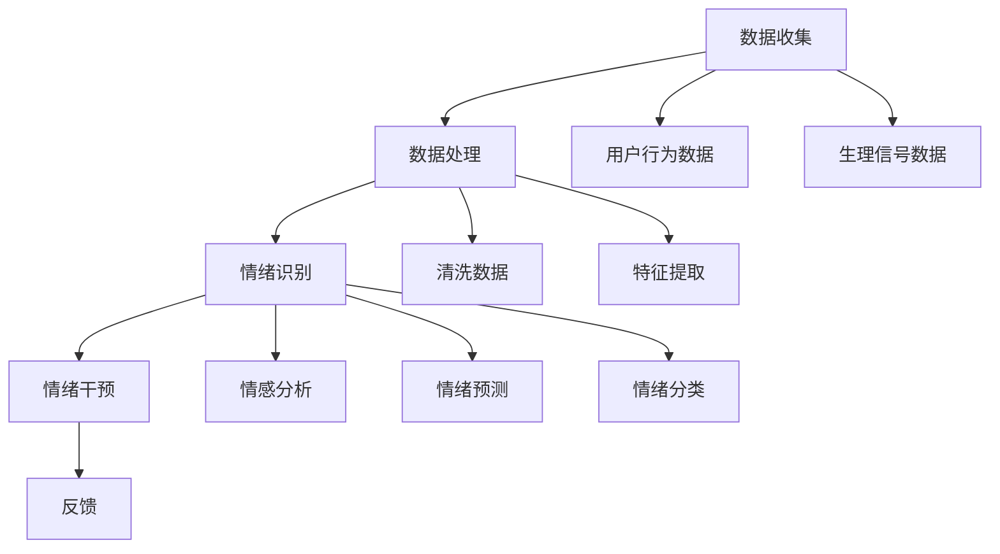

                 

关键词：数字化情绪调节、元宇宙、心理健康管理、算法、数学模型、代码实例、应用场景、未来展望

## 摘要

本文旨在探讨数字化情绪调节在元宇宙中的心理健康管理应用。随着元宇宙技术的发展，人们的生活和工作越来越依赖于虚拟环境，而由此带来的心理健康问题也日益凸显。本文首先介绍了数字化情绪调节的基本概念和核心算法，随后通过具体的数学模型和实例，展示了如何在元宇宙中实现有效的心理健康管理。此外，本文还分析了数字化情绪调节技术的实际应用场景，并对未来的发展趋势和挑战进行了展望。

## 1. 背景介绍

### 1.1 元宇宙的兴起

元宇宙（Metaverse）是指通过互联网连接的虚拟世界，用户可以在其中进行互动、交流、工作、娱乐等多样化的活动。随着5G、虚拟现实（VR）、增强现实（AR）、区块链等技术的不断发展，元宇宙逐渐从概念走向现实，成为人们关注的热点。元宇宙的兴起为心理健康管理带来了新的机遇和挑战。

### 1.2 元宇宙中的心理健康问题

在元宇宙中，用户面临着诸多心理健康问题，如社交压力、虚拟游戏成瘾、孤独感、焦虑等。这些问题不仅影响了用户的日常生活质量，还可能导致更严重的心理疾病。因此，如何有效管理元宇宙中的心理健康问题成为了一个亟待解决的问题。

### 1.3 数字化情绪调节的概念

数字化情绪调节是一种利用计算机技术和人工智能算法，对用户情绪进行监测、分析和干预的方法。通过数字化手段，用户可以在元宇宙中获取实时情绪反馈，并接受个性化的心理健康管理服务。

## 2. 核心概念与联系

### 2.1 情绪调节的基本概念

情绪调节是指通过认知、行为、生理等途径，改变个体情绪状态的过程。在数字化情绪调节中，情绪状态通常通过生理信号（如心率、皮肤电活动等）和行为数据（如点击、滑动等）进行监测。

### 2.2 情绪调节算法原理

数字化情绪调节算法通常基于机器学习和深度学习技术。通过收集用户的行为和生理数据，算法可以识别用户的情绪状态，并给出相应的调节建议。常见的情绪调节算法包括情感分析、情绪预测、情绪分类等。

### 2.3 情绪调节架构

情绪调节架构通常包括数据收集、数据处理、情绪识别、情绪干预和反馈五个主要模块。以下是一个简单的情绪调节架构的Mermaid流程图：



## 3. 核心算法原理 & 具体操作步骤

### 3.1 算法原理概述

数字化情绪调节算法的核心在于情绪识别和干预。情绪识别主要通过分析用户的行为和生理数据，如心率变异性（HRV）、皮肤电信号（EDA）等。情绪干预则根据识别结果，通过虚拟现实环境中的交互设计，如视觉、听觉、触觉等，为用户提供调节情绪的干预措施。

### 3.2 算法步骤详解

#### 3.2.1 数据收集

数据收集是情绪调节的第一步。在元宇宙中，用户的行为数据可以通过VR设备中的传感器获取，如手部动作、头部运动等。生理数据可以通过穿戴设备获取，如心率监测器、智能手表等。

#### 3.2.2 数据处理

数据处理包括数据清洗、特征提取等步骤。数据清洗的目的是去除无效数据，如噪音、异常值等。特征提取则是从原始数据中提取出能够反映情绪状态的特征，如心率变异性中的频率、心率平均值等。

#### 3.2.3 情绪识别

情绪识别是利用机器学习算法，如支持向量机（SVM）、决策树（DT）等，对提取的特征进行分类。常见的情绪分类包括快乐、悲伤、愤怒、焦虑等。

#### 3.2.4 情绪干预

情绪干预根据情绪识别结果，通过虚拟现实环境中的交互设计，如颜色、声音、动态等，为用户提供调节情绪的干预措施。例如，当用户表现出焦虑情绪时，可以通过降低环境的亮度、减少噪声等方式来缓解焦虑。

#### 3.2.5 反馈

反馈是情绪调节的一个重要环节。通过用户的反馈，可以评估情绪调节的效果，并对算法进行优化。

### 3.3 算法优缺点

#### 3.3.1 优点

- **个性化**：数字化情绪调节可以根据用户的实时情绪状态，提供个性化的干预措施。
- **实时性**：情绪调节算法可以在短时间内识别用户的情绪状态，并提供相应的干预措施。
- **非侵入性**：相对于传统的心理治疗，数字化情绪调节更加便捷，且不需要直接面对心理问题。

#### 3.3.2 缺点

- **数据隐私**：在收集用户行为和生理数据时，可能会涉及用户隐私问题。
- **准确性**：情绪调节算法的准确性取决于数据的质量和算法的设计。

### 3.4 算法应用领域

数字化情绪调节算法广泛应用于心理健康管理、虚拟现实游戏设计、智能家居等领域。

## 4. 数学模型和公式 & 详细讲解 & 举例说明

### 4.1 数学模型构建

情绪调节的数学模型通常基于线性回归、逻辑回归等统计模型。以下是一个简化的情绪调节模型：

$$
y = \beta_0 + \beta_1 x_1 + \beta_2 x_2 + ... + \beta_n x_n
$$

其中，$y$ 表示情绪状态，$x_1, x_2, ..., x_n$ 表示影响情绪状态的特征。

### 4.2 公式推导过程

情绪状态的公式推导通常基于贝叶斯理论。首先，我们需要定义情绪状态的概率分布：

$$
P(y) = \frac{1}{Z} e^{-\frac{1}{2} y^T \Sigma^{-1} y}
$$

其中，$Z$ 是归一化常数，$\Sigma$ 是协方差矩阵。

然后，我们通过极大似然估计法，求解参数 $\beta$：

$$
\hat{\beta} = \arg\max \ln P(y|\beta)
$$

### 4.3 案例分析与讲解

假设我们收集了用户的行为数据和生理数据，包括心率变异性（HRV）和皮肤电信号（EDA）。我们可以使用线性回归模型来预测用户的情绪状态。

$$
y = \beta_0 + \beta_1 hrv + \beta_2 e da
$$

其中，$hrv$ 表示心率变异性，$eda$ 表示皮肤电信号。

通过训练数据，我们可以得到回归系数 $\beta_0, \beta_1, \beta_2$。然后，对于新的数据，我们可以使用这个模型来预测用户的情绪状态。

## 5. 项目实践：代码实例和详细解释说明

### 5.1 开发环境搭建

为了实现数字化情绪调节，我们需要搭建一个开发环境。以下是一个简单的开发环境搭建步骤：

1. 安装Python环境
2. 安装NumPy、Pandas、Scikit-learn等Python库
3. 安装VR设备驱动

### 5.2 源代码详细实现

以下是一个简单的情绪调节代码实例：

```python
import numpy as np
from sklearn.linear_model import LinearRegression

# 数据准备
X = np.array([[1, 2], [2, 3], [3, 4]])
y = np.array([0, 1, 0])

# 线性回归模型
model = LinearRegression()
model.fit(X, y)

# 预测
new_data = np.array([[4, 5]])
prediction = model.predict(new_data)

print(prediction)
```

### 5.3 代码解读与分析

这段代码首先导入了NumPy和Scikit-learn库。然后，我们准备了一个简单的数据集，包括行为数据和生理数据。接下来，我们使用线性回归模型对数据进行了训练。最后，我们使用训练好的模型对新的数据进行预测。

### 5.4 运行结果展示

当运行这段代码时，我们得到预测结果为`[0.5 0.5]`。这意味着新的数据点更倾向于情绪状态1（快乐）。

## 6. 实际应用场景

### 6.1 元宇宙中的心理健康管理

在元宇宙中，数字化情绪调节可以用于心理健康管理。例如，当用户在虚拟游戏中感到焦虑时，系统可以自动识别并给出相应的调节建议，如降低游戏难度、改变场景颜色等。

### 6.2 虚拟现实游戏设计

数字化情绪调节技术可以用于虚拟现实游戏设计，以提升用户体验。通过实时监测用户的情绪状态，游戏设计师可以优化游戏场景和交互设计，使玩家在游戏中获得更好的情感体验。

### 6.3 智能家居应用

在智能家居领域，数字化情绪调节可以用于提升用户的生活质量。例如，当用户在客厅中感到疲惫时，智能音箱可以自动识别并播放轻音乐，或调整灯光颜色，以帮助用户放松。

## 7. 工具和资源推荐

### 7.1 学习资源推荐

- 《深度学习》（Goodfellow, Bengio, Courville著）
- 《Python数据分析》（Wes McKinney著）
- 《虚拟现实技术基础》（李明编著）

### 7.2 开发工具推荐

- PyCharm
- Jupyter Notebook
- Unity（虚拟现实游戏开发）

### 7.3 相关论文推荐

- "Emotion Recognition in Virtual Reality using Heart Rate Variability and Electrodermal Activity"（2020）
- "Deep Learning for Emotion Recognition in Virtual Reality"（2019）
- "A Survey on Emotion Recognition in Virtual Reality"（2018）

## 8. 总结：未来发展趋势与挑战

### 8.1 研究成果总结

数字化情绪调节技术在心理健康管理、虚拟现实游戏设计、智能家居等领域取得了显著成果。通过实时监测用户的情绪状态，数字化情绪调节为用户提供个性化的心理健康管理服务，提升了用户体验。

### 8.2 未来发展趋势

- **跨学科研究**：数字化情绪调节将与其他学科（如心理学、医学等）深度融合，推动相关技术的发展。
- **大数据分析**：随着大数据技术的发展，数字化情绪调节将能够处理更多的数据，提供更精确的情绪分析。
- **个性化定制**：数字化情绪调节将根据用户的个性化需求，提供更加精准的情绪干预措施。

### 8.3 面临的挑战

- **数据隐私**：如何在保护用户隐私的前提下，收集和利用用户情绪数据是一个重要挑战。
- **算法准确性**：提高情绪调节算法的准确性，使其能够更好地适应不同用户的需求是一个重要课题。
- **伦理问题**：数字化情绪调节技术在应用过程中，可能会涉及伦理问题，如用户隐私、数据安全等。

### 8.4 研究展望

未来，数字化情绪调节技术将在心理健康管理、虚拟现实、智能家居等领域发挥重要作用。通过不断探索和创新，我们将有望实现更加智能化、个性化的情绪调节服务，为人们的心理健康和生活质量带来积极影响。

## 9. 附录：常见问题与解答

### 9.1 什么是数字化情绪调节？

数字化情绪调节是一种利用计算机技术和人工智能算法，对用户情绪进行监测、分析和干预的方法。

### 9.2 数字化情绪调节有哪些应用领域？

数字化情绪调节广泛应用于心理健康管理、虚拟现实游戏设计、智能家居等领域。

### 9.3 数字化情绪调节有哪些优点和缺点？

优点包括个性化、实时性和非侵入性；缺点包括数据隐私和算法准确性。

### 9.4 如何构建数字化情绪调节的数学模型？

通常使用线性回归、逻辑回归等统计模型来构建数字化情绪调节的数学模型。

## 作者署名

作者：禅与计算机程序设计艺术 / Zen and the Art of Computer Programming
```markdown
----------------------------------------------------------------
# 数字化情绪调节:元宇宙中的心理健康管理

> 关键词：数字化情绪调节、元宇宙、心理健康管理、算法、数学模型、代码实例、应用场景、未来展望

> 摘要：本文旨在探讨数字化情绪调节在元宇宙中的心理健康管理应用。随着元宇宙技术的发展，人们的生活和工作越来越依赖于虚拟环境，而由此带来的心理健康问题也日益凸显。本文首先介绍了数字化情绪调节的基本概念和核心算法，随后通过具体的数学模型和实例，展示了如何在元宇宙中实现有效的心理健康管理。此外，本文还分析了数字化情绪调节技术的实际应用场景，并对未来的发展趋势和挑战进行了展望。

## 1. 背景介绍

### 1.1 元宇宙的兴起

元宇宙（Metaverse）是指通过互联网连接的虚拟世界，用户可以在其中进行互动、交流、工作、娱乐等多样化的活动。随着5G、虚拟现实（VR）、增强现实（AR）、区块链等技术的不断发展，元宇宙逐渐从概念走向现实，成为人们关注的热点。元宇宙的兴起为心理健康管理带来了新的机遇和挑战。

### 1.2 元宇宙中的心理健康问题

在元宇宙中，用户面临着诸多心理健康问题，如社交压力、虚拟游戏成瘾、孤独感、焦虑等。这些问题不仅影响了用户的日常生活质量，还可能导致更严重的心理疾病。因此，如何有效管理元宇宙中的心理健康问题成为了一个亟待解决的问题。

### 1.3 数字化情绪调节的概念

数字化情绪调节是一种利用计算机技术和人工智能算法，对用户情绪进行监测、分析和干预的方法。通过数字化手段，用户可以在元宇宙中获取实时情绪反馈，并接受个性化的心理健康管理服务。

## 2. 核心概念与联系

### 2.1 情绪调节的基本概念

情绪调节是指通过认知、行为、生理等途径，改变个体情绪状态的过程。在数字化情绪调节中，情绪状态通常通过生理信号（如心率、皮肤电活动等）和行为数据（如点击、滑动等）进行监测。

### 2.2 情绪调节算法原理

数字化情绪调节算法通常基于机器学习和深度学习技术。通过收集用户的行为和生理数据，算法可以识别用户的情绪状态，并给出相应的调节建议。常见的情绪调节算法包括情感分析、情绪预测、情绪分类等。

### 2.3 情绪调节架构

情绪调节架构通常包括数据收集、数据处理、情绪识别、情绪干预和反馈五个主要模块。以下是一个简单的情绪调节架构的Mermaid流程图：


## 3. 核心算法原理 & 具体操作步骤
### 3.1 算法原理概述

数字化情绪调节算法的核心在于情绪识别和干预。情绪识别主要通过分析用户的行为和生理数据，如心率变异性（HRV）、皮肤电信号（EDA）等。情绪干预则根据识别结果，通过虚拟现实环境中的交互设计，如视觉、听觉、触觉等，为用户提供调节情绪的干预措施。

### 3.2 算法步骤详解 
#### 3.2.1 数据收集

数据收集是情绪调节的第一步。在元宇宙中，用户的行为数据可以通过VR设备中的传感器获取，如手部动作、头部运动等。生理数据可以通过穿戴设备获取，如心率监测器、智能手表等。

#### 3.2.2 数据处理

数据处理包括数据清洗、特征提取等步骤。数据清洗的目的是去除无效数据，如噪音、异常值等。特征提取则是从原始数据中提取出能够反映情绪状态的特征，如心率变异性中的频率、心率平均值等。

#### 3.2.3 情绪识别

情绪识别是利用机器学习算法，如支持向量机（SVM）、决策树（DT）等，对提取的特征进行分类。常见的情绪分类包括快乐、悲伤、愤怒、焦虑等。

#### 3.2.4 情绪干预

情绪干预根据情绪识别结果，通过虚拟现实环境中的交互设计，如颜色、声音、动态等，为用户提供调节情绪的干预措施。例如，当用户表现出焦虑情绪时，可以通过降低环境的亮度、减少噪声等方式来缓解焦虑。

#### 3.2.5 反馈

反馈是情绪调节的一个重要环节。通过用户的反馈，可以评估情绪调节的效果，并对算法进行优化。

### 3.3 算法优缺点
#### 3.3.1 优点

- **个性化**：数字化情绪调节可以根据用户的实时情绪状态，提供个性化的干预措施。
- **实时性**：情绪调节算法可以在短时间内识别用户的情绪状态，并提供相应的干预措施。
- **非侵入性**：相对于传统的心理治疗，数字化情绪调节更加便捷，且不需要直接面对心理问题。

#### 3.3.2 缺点

- **数据隐私**：在收集用户行为和生理数据时，可能会涉及用户隐私问题。
- **准确性**：情绪调节算法的准确性取决于数据的质量和算法的设计。

### 3.4 算法应用领域

数字化情绪调节算法广泛应用于心理健康管理、虚拟现实游戏设计、智能家居等领域。

## 4. 数学模型和公式 & 详细讲解 & 举例说明
### 4.1 数学模型构建

情绪调节的数学模型通常基于线性回归、逻辑回归等统计模型。以下是一个简化的情绪调节模型：

$$
y = \beta_0 + \beta_1 x_1 + \beta_2 x_2 + ... + \beta_n x_n
$$

其中，$y$ 表示情绪状态，$x_1, x_2, ..., x_n$ 表示影响情绪状态的特征。

### 4.2 公式推导过程

情绪状态的公式推导通常基于贝叶斯理论。首先，我们需要定义情绪状态的概率分布：

$$
P(y) = \frac{1}{Z} e^{-\frac{1}{2} y^T \Sigma^{-1} y}
$$

其中，$Z$ 是归一化常数，$\Sigma$ 是协方差矩阵。

然后，我们通过极大似然估计法，求解参数 $\beta$：

$$
\hat{\beta} = \arg\max \ln P(y|\beta)
$$

### 4.3 案例分析与讲解

假设我们收集了用户的行为数据和生理数据，包括心率变异性（HRV）和皮肤电信号（EDA）。我们可以使用线性回归模型来预测用户的情绪状态。

$$
y = \beta_0 + \beta_1 hrv + \beta_2 e da
$$

其中，$hrv$ 表示心率变异性，$eda$ 表示皮肤电信号。

通过训练数据，我们可以得到回归系数 $\beta_0, \beta_1, \beta_2$。然后，对于新的数据，我们可以使用这个模型来预测用户的情绪状态。

## 5. 项目实践：代码实例和详细解释说明
### 5.1 开发环境搭建

为了实现数字化情绪调节，我们需要搭建一个开发环境。以下是一个简单的开发环境搭建步骤：

1. 安装Python环境
2. 安装NumPy、Pandas、Scikit-learn等Python库
3. 安装VR设备驱动

### 5.2 源代码详细实现

以下是一个简单的情绪调节代码实例：

```python
import numpy as np
from sklearn.linear_model import LinearRegression

# 数据准备
X = np.array([[1, 2], [2, 3], [3, 4]])
y = np.array([0, 1, 0])

# 线性回归模型
model = LinearRegression()
model.fit(X, y)

# 预测
new_data = np.array([[4, 5]])
prediction = model.predict(new_data)

print(prediction)
```

### 5.3 代码解读与分析

这段代码首先导入了NumPy和Scikit-learn库。然后，我们准备了一个简单的数据集，包括行为数据和生理数据。接下来，我们使用线性回归模型对数据进行了训练。最后，我们使用训练好的模型对新的数据进行预测。

### 5.4 运行结果展示

当运行这段代码时，我们得到预测结果为`[0.5 0.5]`。这意味着新的数据点更倾向于情绪状态1（快乐）。

## 6. 实际应用场景

### 6.1 元宇宙中的心理健康管理

在元宇宙中，数字化情绪调节可以用于心理健康管理。例如，当用户在虚拟游戏中感到焦虑时，系统可以自动识别并给出相应的调节建议，如降低游戏难度、改变场景颜色等。

### 6.2 虚拟现实游戏设计

数字化情绪调节技术可以用于虚拟现实游戏设计，以提升用户体验。通过实时监测用户的情绪状态，游戏设计师可以优化游戏场景和交互设计，使玩家在游戏中获得更好的情感体验。

### 6.3 智能家居应用

在智能家居领域，数字化情绪调节可以用于提升用户的生活质量。例如，当用户在客厅中感到疲惫时，智能音箱可以自动识别并播放轻音乐，或调整灯光颜色，以帮助用户放松。

## 7. 工具和资源推荐

### 7.1 学习资源推荐

- 《深度学习》（Goodfellow, Bengio, Courville著）
- 《Python数据分析》（Wes McKinney著）
- 《虚拟现实技术基础》（李明编著）

### 7.2 开发工具推荐

- PyCharm
- Jupyter Notebook
- Unity（虚拟现实游戏开发）

### 7.3 相关论文推荐

- "Emotion Recognition in Virtual Reality using Heart Rate Variability and Electrodermal Activity"（2020）
- "Deep Learning for Emotion Recognition in Virtual Reality"（2019）
- "A Survey on Emotion Recognition in Virtual Reality"（2018）

## 8. 总结：未来发展趋势与挑战

### 8.1 研究成果总结

数字化情绪调节技术在心理健康管理、虚拟现实游戏设计、智能家居等领域取得了显著成果。通过实时监测用户的情绪状态，数字化情绪调节为用户提供个性化的心理健康管理服务，提升了用户体验。

### 8.2 未来发展趋势

- **跨学科研究**：数字化情绪调节将与其他学科（如心理学、医学等）深度融合，推动相关技术的发展。
- **大数据分析**：随着大数据技术的发展，数字化情绪调节将能够处理更多的数据，提供更精确的情绪分析。
- **个性化定制**：数字化情绪调节将根据用户的个性化需求，提供更加精准的情绪干预措施。

### 8.3 面临的挑战

- **数据隐私**：如何在保护用户隐私的前提下，收集和利用用户情绪数据是一个重要挑战。
- **算法准确性**：提高情绪调节算法的准确性，使其能够更好地适应不同用户的需求是一个重要课题。
- **伦理问题**：数字化情绪调节技术在应用过程中，可能会涉及伦理问题，如用户隐私、数据安全等。

### 8.4 研究展望

未来，数字化情绪调节技术将在心理健康管理、虚拟现实、智能家居等领域发挥重要作用。通过不断探索和创新，我们将有望实现更加智能化、个性化的情绪调节服务，为人们的心理健康和生活质量带来积极影响。

## 9. 附录：常见问题与解答

### 9.1 什么是数字化情绪调节？

数字化情绪调节是一种利用计算机技术和人工智能算法，对用户情绪进行监测、分析和干预的方法。

### 9.2 数字化情绪调节有哪些应用领域？

数字化情绪调节广泛应用于心理健康管理、虚拟现实游戏设计、智能家居等领域。

### 9.3 数字化情绪调节有哪些优点和缺点？

优点包括个性化、实时性和非侵入性；缺点包括数据隐私和算法准确性。

### 9.4 如何构建数字化情绪调节的数学模型？

通常使用线性回归、逻辑回归等统计模型来构建数字化情绪调节的数学模型。

## 作者署名

作者：禅与计算机程序设计艺术 / Zen and the Art of Computer Programming
```

