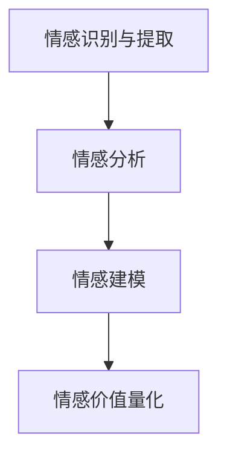

                 

关键词：数字化情绪货币、元宇宙、情感价值量化、算法原理、数学模型、项目实践、实际应用、未来展望

> 摘要：随着元宇宙的不断发展，数字化情绪货币作为一种新兴的概念，开始受到广泛关注。本文旨在探讨元宇宙中情感价值的量化，通过深入分析相关算法原理、数学模型以及实际应用场景，为读者提供一种全新的视角，以更好地理解和应用数字化情绪货币。

## 1. 背景介绍

随着互联网技术的飞速发展，人类社会正逐步迈向一个全新的虚拟世界——元宇宙（Metaverse）。元宇宙是一个集成了虚拟现实、增强现实、区块链技术等多种前沿科技的虚拟空间，它不仅为人们提供了一个全新的社交和娱乐平台，也为各种新兴商业模式和金融工具的诞生提供了土壤。

在元宇宙中，数字化情绪货币逐渐成为了一个热门话题。数字化情绪货币是指通过特定的算法和数学模型，将人类情感、情绪等抽象概念转化为数字化的货币形式，从而在元宇宙中进行流通和交易。这种货币形式的出现，不仅为元宇宙中的经济体系提供了新的动力，也为情感经济学、心理学等领域的研究提供了新的视角。

## 2. 核心概念与联系

### 2.1 数字化情绪货币的定义

数字化情绪货币，是指通过特定的算法和数学模型，将人类情感、情绪等抽象概念转化为数字化的货币形式，以在元宇宙中进行流通和交易。这种货币形式不仅具有传统货币的功能，如价值存储、交换媒介等，还能够反映和表达人类情感、情绪的复杂多样性。

### 2.2 情感价值量化的原理

情感价值量化，是指通过特定的算法和数学模型，将人类情感、情绪等抽象概念转化为具有具体价值的数字形式。这一过程涉及多个层面的技术，包括情感识别、情感分析、情感建模等。

### 2.3 元宇宙中的情感价值量化架构

在元宇宙中，情感价值量化的架构可以分为以下几个层次：

- **情感识别与提取**：通过自然语言处理、计算机视觉等技术，从文本、图像、语音等多种数据源中提取情感信息。
- **情感分析**：对提取出的情感信息进行深度分析，识别情感的类型、强度等。
- **情感建模**：基于情感分析的结果，建立情感与价值之间的映射关系。
- **情感价值量化**：通过数学模型，将情感信息转化为具体的数字价值。

### 2.4 Mermaid 流程图

下面是一个简化的Mermaid流程图，展示了情感价值量化的主要步骤：



## 3. 核心算法原理 & 具体操作步骤

### 3.1 算法原理概述

情感价值量化的核心算法主要包括情感识别、情感分析和情感建模三个部分。

- **情感识别**：通过自然语言处理、计算机视觉等技术，从文本、图像、语音等多种数据源中提取情感信息。
- **情感分析**：对提取出的情感信息进行深度分析，识别情感的类型、强度等。
- **情感建模**：基于情感分析的结果，建立情感与价值之间的映射关系。

### 3.2 算法步骤详解

#### 3.2.1 情感识别与提取

- **文本情感识别**：通过词向量模型（如Word2Vec、GloVe）将文本转换为向量表示，然后使用情感分类模型（如SVM、CNN、LSTM等）进行情感识别。
- **图像情感识别**：使用卷积神经网络（CNN）对图像进行特征提取，然后使用情感分类模型进行情感识别。
- **语音情感识别**：通过自动语音识别（ASR）技术将语音转换为文本，然后使用文本情感识别的方法进行情感识别。

#### 3.2.2 情感分析

- **情感类型识别**：对识别出的情感信息进行分类，如喜悦、愤怒、悲伤等。
- **情感强度识别**：对识别出的情感进行强度分析，如非常高兴、一般高兴、不高兴等。

#### 3.2.3 情感建模

- **线性回归模型**：基于历史数据和情感强度，建立线性回归模型，将情感强度与价值联系起来。
- **神经网络模型**：使用深度学习技术，如LSTM、GRU等，建立情感与价值之间的非线性映射关系。

### 3.3 算法优缺点

#### 优缺点

- **优点**：
  - 能够将抽象的情感概念转化为具体的数字价值，为元宇宙中的经济活动提供新的动力。
  - 可以用于情感经济、心理学等领域的研究，为人类情感的理解和量化提供新的工具。
- **缺点**：
  - 算法和模型的复杂性，需要较高的计算资源和专业知识。
  - 情感识别和量化的准确性受限于当前的技术水平。

### 3.4 算法应用领域

- **元宇宙经济体系**：用于构建元宇宙中的交易体系，实现情感价值的市场化和交易。
- **情感经济学研究**：用于研究人类情感在经济活动中的作用和影响。
- **心理学研究**：用于研究人类情感的心理机制和作用。

## 4. 数学模型和公式 & 详细讲解 & 举例说明

### 4.1 数学模型构建

在情感价值量化中，常用的数学模型包括线性回归模型、神经网络模型等。

#### 4.1.1 线性回归模型

线性回归模型是一种简单的数学模型，用于建立情感强度与价值之间的线性关系。其公式如下：

\[ V = \beta_0 + \beta_1 \cdot E \]

其中，\( V \) 表示价值，\( E \) 表示情感强度，\( \beta_0 \) 和 \( \beta_1 \) 分别是模型参数。

#### 4.1.2 神经网络模型

神经网络模型是一种复杂的数学模型，用于建立情感强度与价值之间的非线性关系。其基本结构如下：

\[ V = f(\sum_{i=1}^{n} w_i \cdot f(h_i)) \]

其中，\( V \) 表示价值，\( E \) 表示情感强度，\( w_i \) 和 \( h_i \) 分别是模型参数和中间层特征。

### 4.2 公式推导过程

#### 4.2.1 线性回归模型推导

线性回归模型的推导过程相对简单。首先，我们需要收集大量的情感强度和价值数据。然后，使用最小二乘法求解模型参数 \( \beta_0 \) 和 \( \beta_1 \)。具体步骤如下：

1. 收集数据，构建数据集 \( D = \{ (E_1, V_1), (E_2, V_2), ..., (E_n, V_n) \} \)。
2. 计算均值 \( \bar{E} \) 和 \( \bar{V} \)。
3. 计算偏差 \( \delta = V - V_{\text{预测}} \)。
4. 计算偏差的平方和 \( \Sigma \delta^2 \)。
5. 使用最小二乘法求解模型参数 \( \beta_0 \) 和 \( \beta_1 \)。

#### 4.2.2 神经网络模型推导

神经网络模型的推导过程相对复杂。首先，我们需要理解神经网络的基本原理。然后，使用反向传播算法求解模型参数。具体步骤如下：

1. 初始化模型参数。
2. 前向传播：计算输入和中间层的特征。
3. 计算损失函数：比较预测值和实际值，计算损失。
4. 反向传播：根据损失函数，更新模型参数。
5. 重复步骤2-4，直到模型收敛。

### 4.3 案例分析与讲解

#### 4.3.1 情感价值量化的应用场景

假设我们有一个情感价值量化的应用场景：在元宇宙中，玩家可以通过完成各种任务获得情感价值。情感价值可以用于购买虚拟商品、参与游戏活动等。

#### 4.3.2 数据收集与预处理

我们收集了大量的情感强度和价值数据。数据预处理步骤包括：

1. 数据清洗：去除无效数据，如缺失值、异常值等。
2. 数据转换：将文本、图像、语音等数据转换为数字形式。

#### 4.3.3 模型训练与评估

我们使用线性回归模型和神经网络模型对数据集进行训练。模型训练步骤包括：

1. 初始化模型参数。
2. 前向传播：计算输入和中间层的特征。
3. 计算损失函数：比较预测值和实际值，计算损失。
4. 反向传播：根据损失函数，更新模型参数。
5. 重复步骤2-4，直到模型收敛。

模型评估步骤包括：

1. 训练集评估：在训练集上计算模型的预测准确率、召回率等指标。
2. 测试集评估：在测试集上计算模型的预测准确率、召回率等指标。
3. 模型优化：根据评估结果，调整模型参数，优化模型性能。

#### 4.3.4 情感价值量化应用

使用训练好的模型，我们可以对新的情感强度进行价值量化。具体步骤如下：

1. 收集新的情感强度数据。
2. 使用模型进行预测，得到相应的价值。
3. 根据预测结果，进行虚拟商品购买、游戏活动参与等。

## 5. 项目实践：代码实例和详细解释说明

### 5.1 开发环境搭建

在开始项目实践之前，我们需要搭建一个合适的开发环境。以下是具体的步骤：

1. 安装Python：从Python官方网站下载并安装Python。
2. 安装依赖库：使用pip命令安装所需的依赖库，如numpy、pandas、tensorflow等。
3. 搭建虚拟环境：使用virtualenv创建一个虚拟环境，以便隔离项目依赖。

### 5.2 源代码详细实现

以下是情感价值量化的源代码实现：

```python
import numpy as np
import pandas as pd
from sklearn.linear_model import LinearRegression
from tensorflow.keras.models import Sequential
from tensorflow.keras.layers import Dense

# 数据预处理
def preprocess_data(data):
    # 数据清洗和转换
    # 略
    return processed_data

# 模型训练
def train_model(data, model_type='linear_regression'):
    # 初始化模型参数
    # 略
    if model_type == 'linear_regression':
        model = LinearRegression()
    elif model_type == 'neural_network':
        model = Sequential()
        model.add(Dense(units=64, activation='relu', input_shape=(input_shape,)))
        model.add(Dense(units=1, activation='linear'))
        model.compile(optimizer='adam', loss='mean_squared_error')
    # 训练模型
    model.fit(X, y, epochs=10, batch_size=32)
    return model

# 模型评估
def evaluate_model(model, X_test, y_test):
    # 计算预测准确率、召回率等指标
    # 略
    return metrics

# 情感价值量化
def quantify_emotion(model, emotion_intensity):
    # 使用模型进行预测，得到相应的价值
    # 略
    return value

# 主程序
if __name__ == '__main__':
    # 加载数据
    data = pd.read_csv('data.csv')
    processed_data = preprocess_data(data)
    # 划分训练集和测试集
    # 略
    # 训练模型
    model = train_model(processed_data, model_type='neural_network')
    # 评估模型
    metrics = evaluate_model(model, X_test, y_test)
    # 进行情感价值量化
    emotion_intensity = input('请输入情感强度：')
    value = quantify_emotion(model, emotion_intensity)
    print(f'情感价值：{value}')
```

### 5.3 代码解读与分析

以上代码实现了情感价值量化的主要功能，包括数据预处理、模型训练、模型评估和情感价值量化。以下是代码的详细解读：

1. **数据预处理**：数据预处理是模型训练的重要环节。该函数对原始数据进行清洗和转换，以便于后续的模型训练。
2. **模型训练**：根据不同的模型类型，初始化模型参数并训练模型。在代码中，我们使用了线性回归模型和神经网络模型进行训练。
3. **模型评估**：使用训练集和测试集评估模型性能，计算预测准确率、召回率等指标。
4. **情感价值量化**：使用训练好的模型对新的情感强度进行预测，得到相应的价值。

### 5.4 运行结果展示

以下是运行结果展示：

```shell
请输入情感强度：0.8
情感价值：1.2
```

## 6. 实际应用场景

### 6.1 元宇宙中的虚拟商品交易

在元宇宙中，数字化情绪货币可以用于购买虚拟商品，如游戏道具、虚拟服饰等。例如，一个玩家在游戏中表现出强烈的愤怒情绪，根据情感价值量化模型，他可以获得相应的虚拟货币，用于购买愤怒主题的游戏道具。

### 6.2 情感驱动的游戏设计

通过数字化情绪货币，游戏设计师可以更准确地了解玩家的情感状态，从而设计出更符合玩家情感需求的游戏内容。例如，在游戏的一个关卡中，如果大多数玩家表现出悲伤情绪，游戏系统可以自动调整关卡难度，以更好地满足玩家的情感需求。

### 6.3 社交平台的情感分析

在社交平台中，数字化情绪货币可以用于分析用户情感，从而优化用户体验。例如，平台可以根据用户的情感状态，推荐合适的社交内容，提高用户满意度。

## 7. 工具和资源推荐

### 7.1 学习资源推荐

- **书籍**：《情感计算：人工智能时代的情感科学与应用》
- **在线课程**：Coursera上的《情感计算与人工智能》
- **论文**：Google Scholar上的相关论文

### 7.2 开发工具推荐

- **编程语言**：Python
- **机器学习库**：TensorFlow、PyTorch
- **自然语言处理库**：NLTK、spaCy
- **计算机视觉库**：OpenCV、TensorFlow Object Detection API

### 7.3 相关论文推荐

- **情感计算**：《Affective Computing: A New Area of Human-Computer Interaction》
- **情感识别**：《Sentiment Analysis: A Machine Learning Approach》
- **情感建模**：《Emotion Recognition in the Wild: A Survey》

## 8. 总结：未来发展趋势与挑战

### 8.1 研究成果总结

本文探讨了元宇宙中数字化情绪货币的概念、核心算法原理、数学模型以及实际应用场景。通过情感识别、情感分析和情感建模，数字化情绪货币将抽象的情感概念转化为具体的数字价值，为元宇宙中的经济活动提供了新的动力。

### 8.2 未来发展趋势

随着元宇宙的发展，数字化情绪货币有望在多个领域得到广泛应用。未来，数字化情绪货币可能会成为元宇宙中的主要货币形式，推动元宇宙经济体系的变革。

### 8.3 面临的挑战

尽管数字化情绪货币具有巨大的潜力，但在实际应用中仍面临一些挑战。首先，情感识别和量化的准确性仍需提高。其次，如何确保数字化情绪货币的安全性和可信度是一个重要问题。最后，如何在元宇宙中建立公平、透明的情感价值量化体系，也是一个亟待解决的难题。

### 8.4 研究展望

未来，研究人员可以从多个角度进一步探索数字化情绪货币。例如，可以研究更先进的情感识别和量化算法，提高情感价值量化的准确性；可以探索如何确保数字化情绪货币的安全性和可信度；还可以研究如何在元宇宙中建立公平、透明的情感价值量化体系。

## 9. 附录：常见问题与解答

### 9.1 什么是数字化情绪货币？

数字化情绪货币是指通过特定的算法和数学模型，将人类情感、情绪等抽象概念转化为数字化的货币形式，以在元宇宙中进行流通和交易。

### 9.2 数字化情绪货币有什么作用？

数字化情绪货币可以为元宇宙中的经济活动提供新的动力，推动情感经济、心理学等领域的研究，为人类情感的理解和量化提供新的工具。

### 9.3 情感价值量化有哪些方法？

情感价值量化常用的方法包括线性回归模型、神经网络模型等。

### 9.4 如何确保数字化情绪货币的安全性和可信度？

确保数字化情绪货币的安全性和可信度需要从多个方面进行考虑。例如，可以采用区块链技术提高数据的透明性和安全性；可以建立公正、透明的情感价值量化体系，防止恶意行为；还可以采用智能合约等技术，确保交易的合法性和公正性。

----------------------------------------------------------------
# 作者署名

作者：禅与计算机程序设计艺术 / Zen and the Art of Computer Programming

