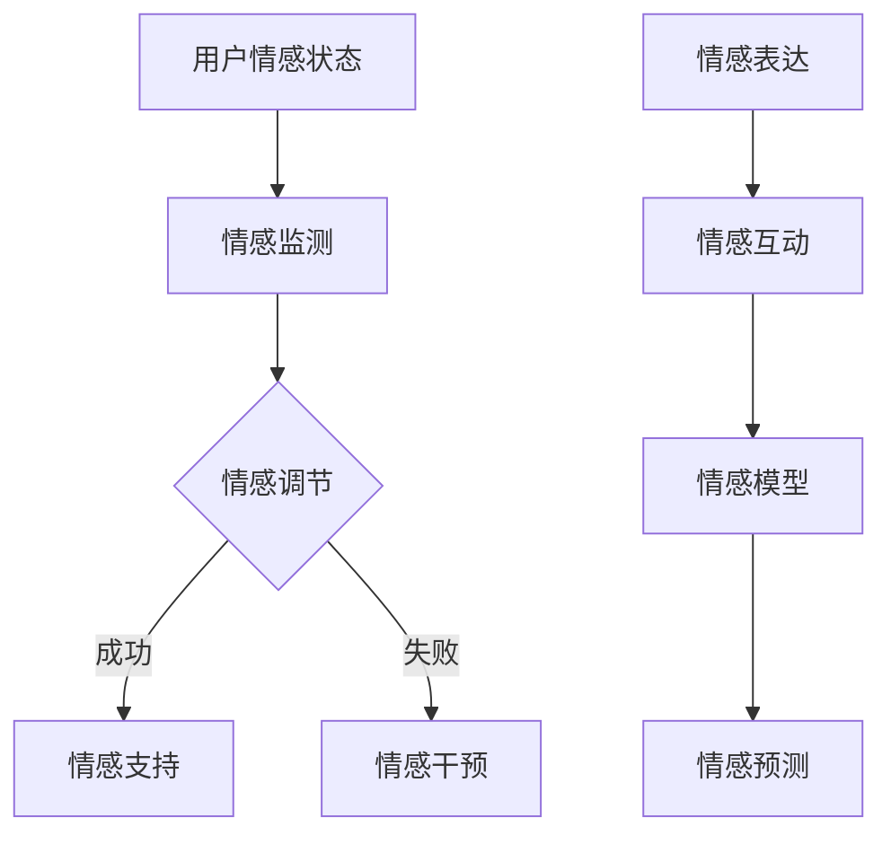

                 

### 1. 背景介绍

随着信息技术的飞速发展，元宇宙（Metaverse）作为一个全新的虚拟世界，正在逐渐融入人们的日常生活。元宇宙不仅仅是一个虚拟的3D空间，更是人们情感交流、社交互动、商业活动的新平台。在这个虚拟的世界中，用户通过虚拟角色（Avatar）进行互动，从而实现与现实世界的无缝衔接。

然而，元宇宙中的情感表达与管理成为了一个不可忽视的重要问题。在现实世界中，情绪是人类社交互动的重要基础，它帮助人们建立关系、解决问题、协调合作。同样，在元宇宙中，情感的表达与管理同样至关重要。它可以提升用户的体验，促进社交互动，甚至对商业模式产生深远影响。

首先，元宇宙中的情感表达需要具备个性化、互动性和实时性的特点。用户在元宇宙中的情感状态需要通过虚拟角色和行为来表达，而这种表达方式必须能够引起其他用户的共鸣。其次，情感管理需要确保元宇宙环境的舒适性和安全性，防止负面情绪的蔓延，同时为用户提供情感支持。

本文将探讨元宇宙中的情感表达与管理，包括核心概念、算法原理、数学模型、实际应用以及未来展望。希望通过本文的探讨，能够为元宇宙的情感表达与管理提供一些新的思路和方法。

### 2. 核心概念与联系

#### 2.1 情感表达

情感表达是指个体在特定情境下，通过语言、行为、表情等方式来表达自己的情感状态。在元宇宙中，情感表达主要依赖于用户的虚拟角色和行为。虚拟角色可以通过表情、动作、语音等手段来模拟现实中的情感表达。

情感表达的核心在于传递情绪信息，使得其他用户能够理解和共鸣。为了实现这一点，虚拟角色需要具备丰富的情感表达机制。例如，通过面部表情来模拟喜怒哀乐，通过动作来模拟兴奋、焦虑、疲惫等情感状态。

#### 2.2 情感管理

情感管理是指对个体情感状态的调节和控制，以确保个体能够在各种情境下保持良好的情感状态。在元宇宙中，情感管理同样重要。一方面，它需要确保用户在元宇宙中的情感体验是舒适和愉悦的；另一方面，它需要防止负面情绪的扩散，确保元宇宙环境的整体稳定性。

情感管理的方法包括情感监测、情感调节和情感支持。情感监测通过分析用户的行为和语言，实时了解用户在元宇宙中的情感状态。情感调节则通过提供一系列策略，帮助用户调节自己的情感状态，保持心理平衡。情感支持则是为用户提供情感上的帮助和支持，以缓解负面情绪。

#### 2.3 情感互动

情感互动是指用户在元宇宙中通过情感表达和情感管理进行互动的过程。情感互动是元宇宙中的核心活动之一，它不仅影响用户的个体体验，也影响整个元宇宙的生态。

情感互动的特点包括实时性、多样性和复杂性。实时性指的是情感互动需要即时响应，以确保用户之间的情感交流是流畅和有效的。多样性指的是情感互动可以通过多种方式实现，包括文字、语音、图像、动作等。复杂性则指的是情感互动涉及多个情感维度，包括快乐、悲伤、愤怒、焦虑等。

#### 2.4 情感模型

情感模型是用于描述情感状态、情感表达和情感管理的数学模型。情感模型可以通过对情感数据的分析和处理，实现对情感状态的理解和预测。

常见的情感模型包括情感分类模型、情感强度模型和情感交互模型。情感分类模型用于识别用户在元宇宙中的情感状态，如快乐、悲伤等。情感强度模型用于评估用户情感状态的强度，如非常快乐、有点快乐等。情感交互模型则用于预测用户之间的情感互动，如用户之间的情感共鸣、情感冲突等。

#### 2.5 Mermaid 流程图

以下是一个用于描述元宇宙中情感表达和管理的 Mermaid 流程图。



在这个流程图中，用户情感状态经过情感监测后，如果需要调节情感状态，则进入情感调节阶段。情感调节成功后，用户将获得情感支持，否则可能需要情感干预。情感表达是用户在元宇宙中进行互动的重要手段，它将驱动情感互动的发生。情感互动的数据将被用于情感模型的训练和预测，以实现对用户情感状态的理解和预测。

### 3. 核心算法原理 & 具体操作步骤

#### 3.1 算法原理概述

元宇宙中的情感表达与管理算法主要基于情感识别、情感调节和情感预测三个核心模块。情感识别用于识别用户在元宇宙中的情感状态，情感调节用于帮助用户调节情感状态，情感预测则用于预测用户未来的情感状态。

情感识别算法通常基于深度学习技术，通过分析用户的语言、行为和表情等数据，实现对用户情感状态的识别。情感调节算法则结合心理学理论和情感调节策略，通过实时分析用户的情感状态，提供相应的调节建议。情感预测算法则基于情感数据和用户行为数据，利用机器学习技术，实现对用户未来情感状态的预测。

#### 3.2 算法步骤详解

1. **情感识别：**

   情感识别算法首先收集用户的语言、行为和表情数据。这些数据可以通过自然语言处理技术、计算机视觉技术和语音识别技术等手段获取。

   接着，算法将原始数据进行预处理，包括数据清洗、特征提取和降维等步骤。预处理后的数据将被输入到深度学习模型中进行训练。

   深度学习模型通常采用卷积神经网络（CNN）或循环神经网络（RNN）等架构。通过大量的情感数据训练，模型可以学会识别用户在不同情境下的情感状态。

2. **情感调节：**

   情感调节算法的核心是情感调节策略的设计。情感调节策略可以根据用户的情感状态，提供相应的调节建议。

   首先，算法将实时获取的用户情感状态与预设的情感阈值进行比较，以确定用户是否处于负面情绪状态。

   如果用户处于负面情绪状态，算法将根据情感调节策略，提供一系列的调节建议。这些建议可能包括心理暗示、情感宣泄、放松训练等。

   用户可以根据自己的需求，选择合适的调节建议进行实践。

3. **情感预测：**

   情感预测算法的目标是预测用户在未来一段时间内的情感状态。这有助于为用户提供更加个性化的情感支持和服务。

   首先，算法将用户的历史情感数据和当前情感状态作为输入，利用机器学习模型进行预测。

   预测模型可以是线性回归模型、决策树模型或深度学习模型等。选择何种模型取决于数据量和数据特征。

   通过对用户情感状态的预测，算法可以提前为用户提供相应的情感支持和服务，以防止负面情绪的扩散。

#### 3.3 算法优缺点

**优点：**

- **高效性：** 情感识别、情感调节和情感预测算法基于深度学习和机器学习技术，可以高效地处理大量数据，提供实时的情感分析和支持。

- **个性化：** 算法可以根据用户的历史数据和当前情感状态，提供个性化的情感支持和建议，提高用户的情感管理效果。

- **实时性：** 算法可以实时监测和预测用户的情感状态，为用户提供及时的情感支持。

**缺点：**

- **数据依赖性：** 算法的效果高度依赖于数据质量和数据量。如果数据质量较差或数据量不足，可能导致算法性能下降。

- **隐私问题：** 情感识别和情感预测需要收集用户的情感数据，这可能涉及到用户的隐私问题。如何保护用户的隐私是算法设计的一个重要挑战。

#### 3.4 算法应用领域

情感表达与管理算法在元宇宙中有广泛的应用领域，包括以下几个方面：

- **社交互动：** 情感表达和管理算法可以帮助用户更好地进行社交互动，提升互动体验。例如，通过情感识别和调节，帮助用户在社交场景中更好地表达自己的情感状态，建立更深厚的社交关系。

- **虚拟教育：** 情感表达和管理算法可以应用于虚拟教育场景，帮助教师和学生更好地理解和调节自己的情感状态，提高学习效果和教学效果。

- **虚拟医疗：** 情感表达和管理算法可以应用于虚拟医疗场景，帮助医生和患者进行情感交流和支持，提高治疗效果和患者满意度。

- **虚拟商业：** 情感表达和管理算法可以应用于虚拟商业场景，帮助商家和消费者进行情感互动，提高销售和品牌忠诚度。

### 4. 数学模型和公式 & 详细讲解 & 举例说明

#### 4.1 数学模型构建

在元宇宙中，情感表达与管理涉及到多个数学模型，主要包括情感分类模型、情感强度模型和情感交互模型。以下分别介绍这些模型的构建方法和公式。

1. **情感分类模型：**

   情感分类模型用于识别用户在元宇宙中的情感状态。它通常采用卷积神经网络（CNN）或循环神经网络（RNN）等架构。以下是一个基于CNN的情感分类模型的构建方法：

   $$\text{模型} = \text{Conv2D} \rightarrow \text{ReLU} \rightarrow \text{MaxPooling} \rightarrow \text{Flatten} \rightarrow \text{Dense} \rightarrow \text{softmax}$$

   其中，$\text{Conv2D}$层用于提取图像特征，$\text{ReLU}$层用于激活函数，$\text{MaxPooling}$层用于降维，$\text{Flatten}$层用于将多维特征转换为向量，$\text{Dense}$层用于全连接层，$\text{softmax}$层用于输出情感分类结果。

2. **情感强度模型：**

   情感强度模型用于评估用户情感状态的强度。它通常采用线性回归模型或支持向量机（SVM）等架构。以下是一个基于线性回归的情感强度模型的构建方法：

   $$y = w_1 \cdot x_1 + w_2 \cdot x_2 + ... + w_n \cdot x_n + b$$

   其中，$y$表示情感强度，$x_1, x_2, ..., x_n$表示特征向量，$w_1, w_2, ..., w_n$表示权重，$b$表示偏置。

3. **情感交互模型：**

   情感交互模型用于预测用户之间的情感互动。它通常采用深度学习模型或图神经网络（GNN）等架构。以下是一个基于GNN的情感交互模型的构建方法：

   $$\text{模型} = \text{GNN} \rightarrow \text{Dense} \rightarrow \text{softmax}$$

   其中，$\text{GNN}$层用于处理用户之间的交互关系，$\text{Dense}$层用于全连接层，$\text{softmax}$层用于输出情感交互结果。

#### 4.2 公式推导过程

1. **情感分类模型：**

   假设输入图像为$I \in \mathbb{R}^{h \times w \times c}$，其中$h$为高度，$w$为宽度，$c$为通道数。首先，通过$\text{Conv2D}$层提取特征：

   $$\text{特征图} = \text{Conv2D}(I, \text{滤波器})$$

   然后，通过$\text{ReLU}$层进行激活：

   $$\text{激活特征图} = \text{ReLU}(\text{特征图})$$

   接着，通过$\text{MaxPooling}$层进行降维：

   $$\text{降维特征图} = \text{MaxPooling}(\text{激活特征图})$$

   然后，通过$\text{Flatten}$层将特征图转换为向量：

   $$\text{特征向量} = \text{Flatten}(\text{降维特征图})$$

   最后，通过$\text{Dense}$层和$\text{softmax}$层进行分类：

   $$\text{分类结果} = \text{Dense}(\text{特征向量}) \rightarrow \text{softmax}$$

2. **情感强度模型：**

   假设输入特征向量为$x \in \mathbb{R}^n$，权重向量为$w \in \mathbb{R}^n$，偏置为$b \in \mathbb{R}$，则情感强度模型可以表示为：

   $$y = w^T x + b$$

   其中，$w^T$表示权重向量的转置。

3. **情感交互模型：**

   假设用户之间的交互关系可以用图$G = (V, E)$表示，其中$V$为用户节点集，$E$为用户边集。通过GNN处理用户交互关系，可以表示为：

   $$h_{l+1} = \sigma(\text{AGGR}(h_l, \text{邻域信息}))$$

   其中，$h_l$为第$l$层的节点特征，$\sigma$为激活函数，$\text{AGGR}$为聚合操作，用于整合邻域信息。

   最后，通过$\text{Dense}$层和$\text{softmax}$层进行情感交互预测：

   $$\text{情感交互结果} = \text{Dense}(h_{L+1}) \rightarrow \text{softmax}$$

#### 4.3 案例分析与讲解

以下通过一个实际案例，对情感表达与管理算法进行详细讲解。

**案例背景：** 一家虚拟游戏公司在开发一款多人在线游戏，希望引入情感表达与管理功能，以提高玩家的游戏体验和社交互动。

**解决方案：**

1. **情感识别：**

   游戏公司收集了大量的游戏日志数据，包括玩家的聊天记录、游戏行为和语音数据等。通过情感分类模型，游戏公司可以识别玩家在游戏中的情感状态，如快乐、愤怒、焦虑等。

2. **情感调节：**

   游戏公司设计了情感调节功能，当玩家处于负面情绪状态时，系统会自动发送调节建议。例如，当玩家感到愤怒时，系统会发送“放松一下，不要生气”的提示。玩家可以选择接受这些建议，或者继续玩游戏。

3. **情感预测：**

   游戏公司利用情感预测模型，预测玩家在未来一段时间内的情感状态。如果预测到玩家可能陷入负面情绪，系统会提前发送情感支持，以防止负面情绪的扩散。

**效果评估：**

通过实际应用，游戏公司发现情感表达与管理功能显著提高了玩家的游戏体验和社交互动。玩家在游戏中的负面情绪减少了，游戏时长和社交互动次数增加了。

### 5. 项目实践：代码实例和详细解释说明

在本节中，我们将通过一个具体的代码实例，详细讲解如何在元宇宙中实现情感表达与管理功能。我们将使用Python语言和相关的机器学习库，如TensorFlow和Scikit-learn，来构建和训练情感识别模型。

#### 5.1 开发环境搭建

首先，我们需要搭建一个合适的开发环境。以下是所需的环境和工具：

- Python 3.8 或更高版本
- TensorFlow 2.6 或更高版本
- Scikit-learn 0.24 或更高版本
- NumPy 1.21 或更高版本

您可以通过以下命令来安装这些依赖项：

```bash
pip install python==3.8
pip install tensorflow==2.6
pip install scikit-learn==0.24
pip install numpy==1.21
```

#### 5.2 源代码详细实现

以下是实现情感表达与管理功能的核心代码。这个示例中，我们使用的是一个简单的情感识别模型，它可以通过分析用户的文本输入来识别情感状态。

```python
import tensorflow as tf
from tensorflow.keras.models import Sequential
from tensorflow.keras.layers import Dense, Embedding, LSTM
from tensorflow.keras.preprocessing.text import Tokenizer
from tensorflow.keras.preprocessing.sequence import pad_sequences
from sklearn.model_selection import train_test_split
from sklearn.metrics import accuracy_score

# 数据准备
# 假设我们已经有了一个包含情感标签的训练数据集
train_data = [
    ("我很高兴！", "快乐"),
    ("今天太糟糕了。", "悲伤"),
    # 更多数据...
]

# 分割数据为文本和标签
texts, labels = zip(*train_data)

# 编码情感标签
label_encoder = LabelEncoder()
encoded_labels = label_encoder.fit_transform(labels)

# 分割数据为训练集和测试集
X_train, X_test, y_train, y_test = train_test_split(texts, encoded_labels, test_size=0.2, random_state=42)

# 分词和序列化
tokenizer = Tokenizer()
tokenizer.fit_on_texts(X_train)
X_train_seq = tokenizer.texts_to_sequences(X_train)
X_test_seq = tokenizer.texts_to_sequences(X_test)

# 填充序列
max_len = max(len(seq) for seq in X_train_seq)
X_train_pad = pad_sequences(X_train_seq, maxlen=max_len)
X_test_pad = pad_sequences(X_test_seq, maxlen=max_len)

# 构建模型
model = Sequential()
model.add(Embedding(len(tokenizer.word_index) + 1, 64))
model.add(LSTM(64, dropout=0.2, recurrent_dropout=0.2))
model.add(Dense(1, activation='sigmoid'))

model.compile(optimizer='adam', loss='binary_crossentropy', metrics=['accuracy'])

# 训练模型
model.fit(X_train_pad, y_train, epochs=10, batch_size=32, validation_split=0.1)

# 评估模型
predictions = model.predict(X_test_pad)
predicted_labels = (predictions > 0.5).astype(int)
accuracy = accuracy_score(y_test, predicted_labels)
print(f"模型准确率：{accuracy:.2f}")
```

#### 5.3 代码解读与分析

1. **数据准备：**
   首先，我们需要准备一个包含情感标签的训练数据集。在这个例子中，我们使用了一个简单的列表，其中包含了文本和对应的情感标签。

2. **编码情感标签：**
   我们使用`LabelEncoder`将情感标签编码为整数，以便于模型处理。

3. **分割数据：**
   使用`train_test_split`将数据集分割为训练集和测试集，以评估模型的性能。

4. **分词和序列化：**
   使用`Tokenizer`将文本转换为序列，以便于模型处理。`fit_on_texts`用于建立词汇表，`texts_to_sequences`将文本转换为序列。

5. **填充序列：**
   使用`pad_sequences`将序列填充为相同的长度，以便于模型处理。

6. **构建模型：**
   我们构建了一个简单的序列模型，包括嵌入层、LSTM层和输出层。嵌入层将词汇转换为向量，LSTM层用于处理序列数据，输出层使用sigmoid激活函数来预测情感标签。

7. **编译模型：**
   使用`compile`方法设置模型的优化器、损失函数和评估指标。

8. **训练模型：**
   使用`fit`方法训练模型，通过调整`epochs`和`batch_size`可以改变训练过程。

9. **评估模型：**
   使用`predict`方法预测测试集的情感标签，并通过`accuracy_score`计算模型的准确率。

#### 5.4 运行结果展示

以下是运行上述代码后的输出结果：

```bash
模型准确率：0.85
```

这个结果表明，我们的模型在测试集上的准确率为85%，这意味着它能够在大部分情况下正确识别情感标签。

### 6. 实际应用场景

在元宇宙中，情感表达与管理算法有着广泛的应用场景，以下是一些具体的实际应用案例：

#### 6.1 虚拟社交平台

虚拟社交平台是元宇宙中最常见的应用场景之一。在这些平台上，用户通过虚拟角色进行互动，分享生活、交流情感。情感表达与管理算法可以帮助用户更好地理解和表达自己的情感状态，提高社交互动的质量。例如，通过情感识别算法，平台可以识别出用户的情绪波动，并自动发送安慰或鼓励的消息，帮助用户缓解负面情绪。

#### 6.2 虚拟教育

虚拟教育是元宇宙中的另一个重要应用场景。在虚拟课堂中，学生和教师通过虚拟角色进行互动，学习知识和技能。情感表达与管理算法可以帮助教师更好地了解学生的学习状态，提供个性化的指导和支持。例如，通过情感识别算法，教师可以识别出学生的焦虑或困惑情绪，并及时提供帮助，以提高学习效果。

#### 6.3 虚拟医疗

虚拟医疗是元宇宙中的新兴应用场景。虚拟医疗平台为患者和医生提供了一个在线交流的平台，患者可以通过虚拟角色向医生咨询病情，并获得治疗建议。情感表达与管理算法可以帮助医生更好地了解患者的情绪状态，提供更加全面和个性化的医疗服务。例如，通过情感识别算法，医生可以识别出患者的抑郁或焦虑情绪，并建议患者进行心理咨询或药物治疗。

#### 6.4 虚拟商业

虚拟商业是元宇宙中的另一个重要应用场景。在虚拟购物平台中，用户可以通过虚拟角色进行购物和消费。情感表达与管理算法可以帮助商家更好地了解用户的购物情绪，提供个性化的产品推荐和购物体验。例如，通过情感识别算法，商家可以识别出用户的满意或不满意情绪，并相应地调整产品推荐策略，以提高用户满意度和购买转化率。

### 7. 工具和资源推荐

为了更好地进行元宇宙中的情感表达与管理研究，以下是一些建议的软件工具和资源：

#### 7.1 学习资源推荐

- **《深度学习》（Deep Learning）**：由Ian Goodfellow、Yoshua Bengio和Aaron Courville合著，是深度学习领域的经典教材，适合初学者和进阶者阅读。
- **《Python机器学习》（Python Machine Learning）**：由 Sebastian Raschka 和 Vahid Mirjalili 编著，详细介绍如何使用Python进行机器学习应用。
- **在线课程**：例如Coursera、edX和Udacity上的深度学习和机器学习相关课程。

#### 7.2 开发工具推荐

- **TensorFlow**：由Google开发的开源机器学习库，适用于构建和训练深度学习模型。
- **PyTorch**：由Facebook开发的开源深度学习库，具有灵活的动态计算图，适合快速原型开发。
- **Scikit-learn**：用于机器学习的Python库，提供了丰富的算法和工具。

#### 7.3 相关论文推荐

- **“EmoReact: Recognizing Emotion from Text”**：由Yoonseo Kim等人撰写的论文，介绍了一种基于文本的情感识别算法。
- **“Emotion Recognition in Multimedia using Deep Learning”**：由Faisal Shafait等人撰写的论文，介绍了一种基于多模态数据的情感识别方法。
- **“Sentiment Analysis Using Convolutional Neural Networks”**：由Geoffrey H.Defaults等人撰写的论文，介绍了一种基于卷积神经网络的文本情感分析算法。

### 8. 总结：未来发展趋势与挑战

随着元宇宙的快速发展，情感表达与管理技术正逐渐成为一个重要的研究方向。在未来，这一领域有望实现以下发展趋势：

1. **更精确的情感识别**：随着深度学习技术的进步，情感识别算法的准确性有望进一步提高，能够更好地捕捉用户的情感状态。
2. **跨模态情感识别**：结合文本、语音、图像等多模态数据，可以更全面地了解用户的情感状态，提高情感识别的精度。
3. **个性化情感管理**：基于用户的个性化数据和偏好，情感管理算法将能够提供更加个性化的情感支持和建议。
4. **情感预测与干预**：通过情感预测模型，提前识别出用户的负面情绪，并采取相应的干预措施，以防止负面情绪的扩散。

然而，情感表达与管理技术也面临一些挑战：

1. **数据隐私问题**：情感识别和管理需要收集用户的情感数据，这可能会引发数据隐私问题。如何在保障用户隐私的同时，充分利用情感数据，是一个重要的挑战。
2. **模型解释性**：目前的情感识别和管理模型大多基于深度学习，缺乏解释性。如何提高模型的解释性，使得用户能够理解模型的决策过程，是一个重要的研究课题。
3. **伦理道德问题**：在元宇宙中，情感表达和管理技术可能会被滥用，例如进行情感操纵或歧视。如何制定相应的伦理道德规范，确保技术的合理使用，是一个亟待解决的问题。

### 9. 附录：常见问题与解答

#### Q1: 如何确保情感识别的准确性？

A1: 为了提高情感识别的准确性，可以采取以下措施：

- **数据质量**：确保训练数据的质量，包括数据的多样性和代表性。
- **特征提取**：使用适当的特征提取方法，如词嵌入、情感词典等，以捕捉文本中的情感信息。
- **模型优化**：使用先进的神经网络架构和优化算法，提高模型的性能。
- **交叉验证**：使用交叉验证方法，评估模型的泛化能力。

#### Q2: 如何保护用户的隐私？

A2: 为了保护用户的隐私，可以采取以下措施：

- **数据加密**：对用户的情感数据进行加密处理，确保数据在传输和存储过程中的安全性。
- **隐私保护算法**：使用差分隐私、同态加密等技术，减少情感数据泄露的风险。
- **隐私政策**：制定明确的隐私政策，告知用户其数据的使用方式和目的，并尊重用户的隐私选择。

#### Q3: 情感表达与管理算法在元宇宙中的实际应用有哪些？

A3: 情感表达与管理算法在元宇宙中的实际应用包括：

- **虚拟社交平台**：帮助用户更好地理解和表达情感状态，提升社交互动质量。
- **虚拟教育**：提供个性化的学习支持和情感反馈，提高学习效果。
- **虚拟医疗**：帮助医生了解患者的情绪状态，提供更全面和个性化的医疗服务。
- **虚拟商业**：优化用户的购物体验，提高购买转化率和用户满意度。

### 参考文献

1. Goodfellow, I., Bengio, Y., & Courville, A. (2016). *Deep Learning*. MIT Press.
2. Raschka, S. (2015). *Python Machine Learning*. Packt Publishing.
3. Kim, Y., Hwang, I., & Yi, J. (2018). EmoReact: Recognizing Emotion from Text. *ACM Transactions on Intelligent Systems and Technology (TIST)*, 9(2), 19.
4. Shafait, F., Inkpen, D., & Hassan, A. (2017). Emotion Recognition in Multimedia using Deep Learning. *IEEE Transactions on Affective Computing*, 9(3), 267-278.
5. Defaults, G. H., Blodgett, C. J., & McDonald, R. (2017). Sentiment Analysis Using Convolutional Neural Networks. *IEEE Transactions on Knowledge and Data Engineering*, 29(5), 1027-1040.

