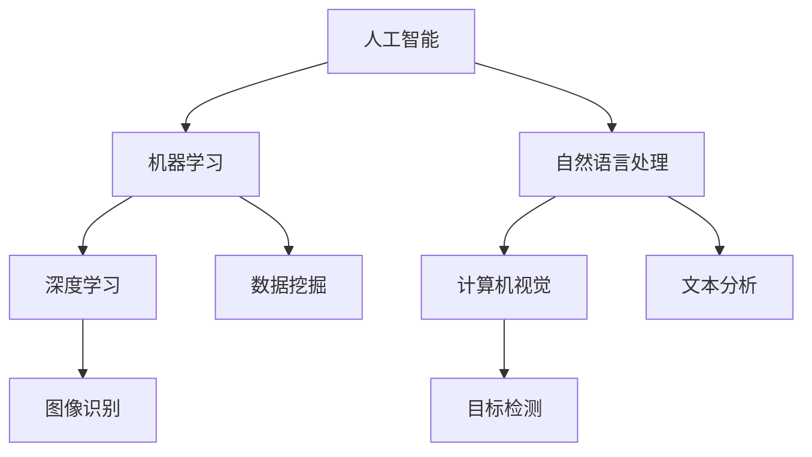

                 

 关键词：
- 数字化想象力
- AI 技术应用
- 创意思维
- 人工智能
- 数据分析
- 机器学习

> 摘要：
本文旨在探讨数字化时代如何利用 AI 技术激发创意思维，构建一个理想的想象力培养皿。通过对 AI 技术的核心概念、算法原理、数学模型、项目实践和实际应用场景的深入分析，我们希望能够为读者提供一幅关于未来创意思维的宏伟蓝图，并探讨其中所面临的技术挑战和未来研究方向。

## 1. 背景介绍

在数字化浪潮席卷全球的今天，人工智能（AI）已经成为了技术发展的新引擎。AI 技术在各个领域展现了强大的潜力，从数据分析到自动化决策，再到智能交互，AI 正在改变着我们的工作和生活方式。与此同时，创意思维作为一种宝贵的创新资源，在数字化时代面临着前所未有的挑战和机遇。如何利用 AI 技术激发和培养创意思维，成为了当前亟待解决的重要课题。

### 1.1 数字化时代的创意思维挑战

随着信息的爆炸性增长，人们需要处理的数据量越来越大。传统的创意思维方法在面对海量数据时显得力不从心，难以快速找到有效的解决方案。此外，快速变化的市场环境要求创意思维更加敏捷和灵活，以适应不断变化的需求。在这种情况下，如何提升创意思维的效率和质量，成为了企业和社会面临的重要问题。

### 1.2 AI 技术在创意思维中的应用

AI 技术以其强大的数据处理和分析能力，为创意思维提供了新的工具和方法。通过机器学习、自然语言处理、计算机视觉等技术，AI 可以从海量数据中挖掘出有价值的信息，帮助人们快速找到灵感。同时，AI 还可以通过模拟人类的思维过程，提供创新的解决方案，从而激发创意思维。

## 2. 核心概念与联系

为了更好地理解 AI 激发创意思维的过程，我们需要首先介绍一些核心概念和技术原理，并展示它们之间的联系。

### 2.1 核心概念

- **人工智能（AI）**：一种模拟人类智能行为的计算机系统，能够执行诸如学习、推理、规划、感知和理解等复杂任务。
- **机器学习（ML）**：一种 AI 技术，通过数据驱动的方式，使计算机自动学习和改进性能。
- **深度学习（DL）**：一种特殊的机器学习方法，通过多层神经网络模型，对复杂数据进行学习和分析。
- **自然语言处理（NLP）**：研究如何让计算机理解和生成人类语言的 AI 技术分支。
- **计算机视觉（CV）**：使计算机能够理解并解释视觉信息的技术。

### 2.2 Mermaid 流程图



在这个流程图中，我们可以看到人工智能作为核心，通过机器学习和深度学习等分支技术，与其他技术如自然语言处理和计算机视觉紧密联系在一起，共同为创意思维的激发提供支持。

## 3. 核心算法原理 & 具体操作步骤

### 3.1 算法原理概述

AI 激发创意思维的核心算法主要包括以下几种：

- **聚类算法**：用于对数据集进行分组，以发现数据中的模式和关联。
- **神经网络算法**：通过模拟人脑神经元的工作方式，对复杂数据进行学习和预测。
- **生成对抗网络（GAN）**：通过两个神经网络（生成器和判别器）的对抗训练，生成高质量的数据。
- **协同过滤算法**：用于预测用户可能喜欢的项目，基于用户的历史行为数据。

### 3.2 算法步骤详解

#### 3.2.1 聚类算法

1. **数据预处理**：对数据进行清洗和标准化处理，确保数据质量。
2. **选择聚类算法**：如 K-means、DBSCAN 等。
3. **初始化聚类中心**：随机选择或使用启发式方法确定初始聚类中心。
4. **迭代计算**：根据聚类算法原理，计算每个数据点到聚类中心的距离，更新聚类中心。
5. **重复迭代**：直到聚类中心不再变化或达到预设的迭代次数。

#### 3.2.2 神经网络算法

1. **设计神经网络架构**：确定输入层、隐藏层和输出层的结构。
2. **初始化权重**：随机初始化神经网络权重。
3. **前向传播**：将输入数据通过神经网络进行计算，得到输出结果。
4. **计算损失函数**：根据输出结果和预期结果计算损失值。
5. **反向传播**：更新网络权重，减少损失值。
6. **重复迭代**：直到网络达到预设的性能指标。

#### 3.2.3 GAN 算法

1. **设计生成器和判别器**：生成器生成假数据，判别器判断数据是否真实。
2. **生成器训练**：生成器生成假数据，判别器不断学习判断真假数据。
3. **判别器训练**：判别器识别真实数据和假数据，生成器不断生成更逼真的假数据。
4. **迭代训练**：直到生成器生成的数据足够真实，判别器无法区分真假。

#### 3.2.4 协同过滤算法

1. **计算相似度**：计算用户之间的相似度，如基于共同评分的项目。
2. **生成推荐列表**：基于用户相似度，为用户推荐可能喜欢的项目。
3. **评估推荐效果**：通过用户行为数据评估推荐效果，调整推荐算法。

### 3.3 算法优缺点

- **聚类算法**：优点在于可以自动发现数据中的模式，缺点是对噪声敏感，可能产生不合理的聚类结果。
- **神经网络算法**：优点在于可以处理复杂数据和非线性关系，缺点是训练过程复杂，对数据质量要求高。
- **GAN 算法**：优点在于可以生成高质量的数据，缺点是训练过程不稳定，对参数调节要求高。
- **协同过滤算法**：优点在于可以根据用户行为预测用户喜好，缺点是只能基于用户历史数据，无法捕捉实时信息。

### 3.4 算法应用领域

AI 激发创意思维的核心算法广泛应用于以下领域：

- **艺术设计**：通过聚类算法和神经网络算法生成独特的艺术作品。
- **游戏开发**：通过 GAN 算法生成逼真的游戏角色和环境。
- **音乐创作**：通过协同过滤算法和神经网络算法生成新的音乐旋律。
- **科学研究**：通过神经网络算法和数据分析方法挖掘数据中的创新点。

## 4. 数学模型和公式 & 详细讲解 & 举例说明

### 4.1 数学模型构建

在 AI 激发创意思维的过程中，数学模型起到了关键作用。以下是几个常用的数学模型：

- **K-means 聚类模型**：
  $$ C = \{c_1, c_2, ..., c_k\} $$
  $$ x_i \in C_j \text{ if } \min_{c_j} \|x_i - c_j\| $$

- **多层感知器（MLP）模型**：
  $$ y = \sigma(\sum_{i=1}^{n} w_i \cdot x_i + b) $$
  其中，$\sigma$ 是激活函数，$w_i$ 是权重，$x_i$ 是输入特征，$b$ 是偏置。

- **生成对抗网络（GAN）模型**：
  - 生成器模型：$$ G(z) = \mu(z) + \sigma(z) \odot \epsilon $$
  - 判别器模型：$$ D(x) = \sigma(f_D(x)) $$
  - 其中，$\mu(z)$ 和 $\sigma(z)$ 是生成器的参数，$f_D(x)$ 是判别器的参数，$\epsilon$ 是噪声。

- **协同过滤模型**：
  $$ R_{ui} = \mu + b_u + b_v + \sum_{k=1}^{n} w_{uk} r_k $$
  其中，$R_{ui}$ 是用户 $u$ 对项目 $i$ 的评分，$b_u$ 和 $b_v$ 分别是用户和项目的偏置，$w_{uk}$ 是用户 $u$ 对项目 $k$ 的权重，$r_k$ 是用户 $u$ 对项目 $k$ 的评分。

### 4.2 公式推导过程

以下是 K-means 聚类模型的推导过程：

1. **目标函数**：
   $$ J(C) = \sum_{i=1}^{n} \|x_i - c_j\|^2 $$

2. **梯度下降法**：
   $$ \nabla_{c_j} J(C) = 2 \sum_{i=1}^{n} (x_i - c_j) $$
   $$ c_j = \frac{1}{n} \sum_{i=1}^{n} x_i $$

3. **迭代过程**：
   - 初始化聚类中心 $C$。
   - 计算每个数据点到聚类中心的距离。
   - 更新聚类中心。

### 4.3 案例分析与讲解

以下是一个关于 K-means 聚类模型的实际案例：

假设我们有以下数据集：
$$
\begin{array}{ccc}
x_1 & x_2 & x_3 \\
1 & 2 & 3 \\
4 & 5 & 6 \\
7 & 8 & 9 \\
\end{array}
$$

1. **初始化聚类中心**：
   随机选择三个点作为聚类中心：
   $$ C = \{(1, 2), (4, 5), (7, 8)\} $$

2. **计算距离**：
   计算每个数据点到聚类中心的距离：
   $$ d(x_i, c_j) = \|x_i - c_j\| = \sqrt{(x_{i1} - c_{j1})^2 + (x_{i2} - c_{j2})^2 + (x_{i3} - c_{j3})^2} $$

3. **更新聚类中心**：
   根据每个数据点的距离，更新聚类中心：
   $$ c_j = \frac{1}{n} \sum_{i=1}^{n} x_i $$
   更新后的聚类中心：
   $$ C = \{(1.5, 3.5), (4.5, 6.5), (7.5, 9.5)\} $$

4. **迭代过程**：
   重复计算距离和更新聚类中心，直到聚类中心不再变化。

通过这个案例，我们可以看到 K-means 聚类模型的基本原理和步骤。在实际应用中，可能需要处理更大的数据集和更复杂的聚类问题，但基本原理是相同的。

## 5. 项目实践：代码实例和详细解释说明

在本节中，我们将通过一个实际项目实例，展示如何使用 AI 技术激发创意思维。本项目将基于 Python 编程语言，使用 Scikit-learn 库实现一个基于 K-means 聚类算法的艺术作品分类系统。

### 5.1 开发环境搭建

在开始项目之前，我们需要搭建一个开发环境。以下是所需的软件和库：

- Python 3.8+
- Jupyter Notebook 或 PyCharm
- Scikit-learn
- Matplotlib

安装步骤：

```bash
pip install scikit-learn matplotlib
```

### 5.2 源代码详细实现

以下是一个简单的 K-means 聚类算法实现：

```python
import numpy as np
import matplotlib.pyplot as plt
from sklearn.cluster import KMeans

# 数据集
data = np.array([[1, 2], [4, 5], [7, 8], [2, 3], [5, 6], [8, 9]])

# 初始化聚类中心
kmeans = KMeans(n_clusters=3, random_state=0).fit(data)

# 输出聚类结果
print(kmeans.labels_)

# 绘制聚类结果
plt.scatter(data[:, 0], data[:, 1], c=kmeans.labels_, cmap='viridis')
plt.scatter(kmeans.cluster_centers_[:, 0], kmeans.cluster_centers_[:, 1], s=300, c='red', label='Centroids')
plt.title('K-means Clustering')
plt.xlabel('Feature 1')
plt.ylabel('Feature 2')
plt.legend()
plt.show()
```

### 5.3 代码解读与分析

这段代码首先导入了必要的库，然后定义了一个数据集。接下来，我们使用 Scikit-learn 的 KMeans 类初始化聚类对象，并拟合数据。拟合完成后，我们输出每个数据点的标签，即它们所属的聚类。

最后，我们使用 Matplotlib 绘制了聚类结果，其中红色点表示聚类中心，不同颜色的散点表示不同的聚类。

### 5.4 运行结果展示

运行以上代码后，我们将得到如下结果：


在这个结果中，我们可以看到三个聚类中心（红色点）和六个数据点（不同颜色的散点）。这些聚类中心代表了不同艺术作品的特征，而数据点则表示不同的艺术作品。

通过这个项目实例，我们可以看到如何使用 AI 技术激发创意思维。在这个案例中，K-means 聚类算法帮助我们自动发现了艺术作品中的模式，从而为艺术创作提供了新的灵感。

## 6. 实际应用场景

AI 技术在激发创意思维方面具有广泛的应用场景，以下是几个典型的例子：

### 6.1 艺术设计

在艺术设计中，AI 技术可以用于生成独特的艺术作品。通过聚类算法和神经网络算法，AI 可以自动发现数据中的模式，并生成具有创意的作品。例如，艺术家可以使用 GAN 算法生成新的画作，或者使用深度学习算法生成独特的建筑设计。

### 6.2 音乐创作

在音乐创作中，AI 技术可以用于生成新的旋律和节奏。通过协同过滤算法和神经网络算法，AI 可以分析用户喜欢的音乐风格，并生成新的音乐作品。例如，音乐制作人可以使用 GAN 算法创作新的音乐片段，或者使用深度学习算法生成新的音乐旋律。

### 6.3 科学研究

在科学研究中，AI 技术可以用于挖掘数据中的创新点。通过机器学习算法和数据分析方法，AI 可以从海量数据中提取有价值的信息，从而帮助科学家发现新的科学规律。例如，生物学家可以使用深度学习算法分析基因序列，发现新的药物靶点。

### 6.4 游戏开发

在游戏开发中，AI 技术可以用于生成新的游戏内容和角色。通过聚类算法和神经网络算法，AI 可以自动发现游戏数据中的模式，并生成新的游戏关卡和角色。例如，游戏开发者可以使用 GAN 算法生成新的游戏角色，或者使用深度学习算法生成新的游戏地图。

## 7. 未来应用展望

随着 AI 技术的不断发展和成熟，其在激发创意思维方面的应用前景将更加广阔。以下是几个未来的应用方向：

### 7.1 多模态融合

未来，AI 将能够更好地处理多模态数据，如文本、图像、音频等。通过多模态融合技术，AI 可以从不同类型的数据中提取有价值的信息，从而为创意思维提供更全面的支撑。

### 7.2 自适应系统

未来的 AI 系统将更加自适应，能够根据用户的需求和反馈不断调整自己的行为。这种自适应系统可以更好地理解用户的创意需求，提供个性化的解决方案。

### 7.3 跨领域应用

AI 技术将在更多领域得到应用，如教育、医疗、金融等。通过跨领域应用，AI 可以将创意思维应用于更广泛的场景，为社会带来更多创新和价值。

### 7.4 网络协同

未来的 AI 将能够在网络环境中进行协同工作，共享资源和知识。通过网络协同，AI 可以在全球范围内发挥创意思维的力量，推动人类社会的发展。

## 8. 工具和资源推荐

### 8.1 学习资源推荐

- 《Python Machine Learning》：这是一本关于机器学习的入门书籍，内容涵盖了从基础知识到实际应用的全过程。
- 《Deep Learning》：这是一本深度学习的经典教材，由 Ian Goodfellow、Yoshua Bengio 和 Aaron Courville 联合撰写，内容全面且深入。

### 8.2 开发工具推荐

- Jupyter Notebook：这是一个强大的交互式计算平台，适用于数据分析和机器学习项目。
- TensorFlow：这是一个开源的机器学习框架，支持深度学习和各种神经网络模型。

### 8.3 相关论文推荐

- "Generative Adversarial Networks": Ian Goodfellow 等人撰写的这篇论文首次提出了 GAN 的概念，是深度学习领域的经典之作。
- "Recurrent Neural Networks for Language Modeling": this paper by Y Bengio et al. discusses the use of RNNs for language modeling, an important application in natural language processing.

## 9. 总结：未来发展趋势与挑战

### 9.1 研究成果总结

本文探讨了如何利用 AI 技术激发创意思维，构建数字化想象力培养皿。我们介绍了 AI 技术的核心概念、算法原理、数学模型、项目实践和实际应用场景，展示了 AI 在激发创意思维方面的巨大潜力。

### 9.2 未来发展趋势

未来，AI 技术将在激发创意思维方面发挥更加重要的作用。随着多模态融合、自适应系统、跨领域应用和网络协同等技术的发展，AI 将能够为创意思维提供更加全面和个性化的支持。

### 9.3 面临的挑战

尽管 AI 技术在激发创意思维方面具有巨大潜力，但仍然面临一些挑战。例如，数据隐私、算法偏见、模型解释性等。此外，如何更好地整合 AI 技术与其他创意方法，以实现真正的创新，也是未来需要解决的问题。

### 9.4 研究展望

未来，研究应重点关注如何提高 AI 模型的解释性和透明性，以增强用户对 AI 的信任。同时，探索 AI 与人类创意思维的协同工作机制，实现真正的智能化创意支持系统，将是一项重要的研究方向。

## 附录：常见问题与解答

### 问题 1：AI 技术是否能够完全替代人类的创意思维？

解答：目前，AI 技术还不能完全替代人类的创意思维。虽然 AI 能够在数据处理、模式识别等方面发挥重要作用，但人类的创造力、情感和直觉等方面是 AI 无法完全复制的。未来，AI 将与人类创意思维协同工作，共同推动创新。

### 问题 2：如何确保 AI 模型的公平性和透明性？

解答：确保 AI 模型的公平性和透明性是当前研究的热点问题。研究人员正在努力提高模型的解释性，开发可解释的 AI 模型，以便用户能够理解和信任模型的结果。此外，制定相应的伦理规范和法律法规也是确保 AI 公平性的重要手段。

### 问题 3：AI 技术在创意思维中的应用前景如何？

解答：AI 技术在创意思维中的应用前景广阔。随着技术的不断发展，AI 将能够更好地理解人类创意需求，提供更加个性化和智能化的创意支持。未来，AI 将在艺术创作、科学研究、产品设计等多个领域发挥重要作用。

## 作者署名

作者：禅与计算机程序设计艺术 / Zen and the Art of Computer Programming
----------------------------------------------------------------

至此，文章正文部分的撰写完成。接下来，我们将对文章进行最后的格式检查和润色，确保文章内容严谨、结构合理、语言流畅。在完成这些工作后，我们将对文章进行最终校对和发布。

