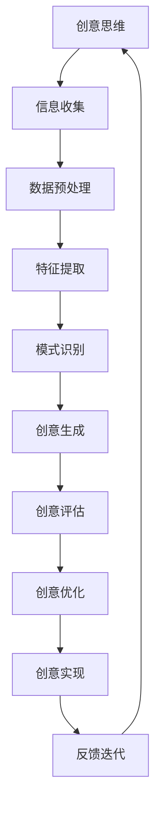

                 

关键词：人工智能，创意思维，数字化，AI激发，技术创新，认知拓展

> 摘要：随着人工智能技术的不断进步，我们的数字化生活正在发生翻天覆地的变化。本文将探讨人工智能如何激发创意思维，推动技术的不断革新，并探讨这一领域未来可能的发展趋势与挑战。

## 1. 背景介绍

近年来，人工智能（AI）技术取得了显著的进展，从传统的规则驱动系统逐步演化为具备自我学习能力的人工智能系统。随着深度学习、神经网络等技术的快速发展，AI 在图像识别、自然语言处理、自动驾驶等多个领域都展现出了巨大的潜力。在这个数字化时代，如何利用人工智能激发我们的创意思维，成为了一个值得探讨的话题。

### 1.1 AI 的发展历程

人工智能的概念可以追溯到20世纪50年代，当时的计算机科学家们开始思考是否能够制造出能够模仿人类思维的机器。从最初的符号主义、知识表示到功能模拟，再到当前的主流技术——深度学习，人工智能的发展经历了多次技术变革。

- **符号主义（Symbolism）**：20世纪50年代到70年代，人工智能主要基于符号主义，试图通过符号逻辑和知识表示来模拟人类思维。

- **知识表示（Knowledge Representation）**：70年代到80年代，人工智能研究开始关注如何有效地表示和存储知识，以支持更复杂的推理和决策。

- **功能模拟（Functional Simulation）**：80年代到90年代，随着计算机硬件性能的提升，人工智能研究开始转向功能模拟，试图通过计算机程序来模拟人类的行为和思维。

- **深度学习（Deep Learning）**：21世纪初至今，深度学习技术的兴起，使得人工智能在图像识别、自然语言处理等领域取得了突破性的进展。深度学习通过神经网络模型，使计算机具备了从大量数据中自动学习特征和规律的能力。

### 1.2 数字化时代

数字化时代，即我们常说的信息时代，是指信息传播、处理、存储和利用的主要手段从传统的纸质和物理形式转变为数字形式的时代。在这个时代，数据成为新的生产要素，互联网成为信息流通的主动脉，数字化技术广泛应用于社会的各个领域。

- **数字化生活方式**：数字化技术已经渗透到我们的日常生活中，从在线购物、移动支付到智能家居，数字化改变了我们的生活方式。

- **数字化工作方式**：远程办公、协同工作平台等数字化工具的普及，使得工作方式更加灵活、高效。

- **数字化生产**：智能制造、工业互联网等数字化生产模式，提高了生产效率和产品质量。

## 2. 核心概念与联系

在探讨人工智能如何激发创意思维之前，我们需要明确一些核心概念，并了解它们之间的联系。

### 2.1 创意思维的概念

创意思维是指通过创新和独特的视角来解决问题和发现新机会的思维方式。它涉及创造、联想、发散和综合等多个层面。创意思维不仅仅是为了寻求新的解决方案，更重要的是能够突破传统的思维框架，找到新的视角和思路。

### 2.2 人工智能与创意思维的关联

人工智能与创意思维之间存在紧密的关联。首先，人工智能通过模拟和拓展人类的认知能力，可以提供更多的信息处理和分析能力，从而激发创意思维。例如，人工智能可以通过大数据分析和模式识别，帮助人们发现潜在的问题和解决方案。

其次，人工智能可以通过自动化和智能化工具，降低创意思维的执行成本，使人们能够将更多的精力投入到创造性的思考中。例如，自然语言处理技术可以帮助人们快速生成文本、图像等创意作品，从而节省时间和精力。

### 2.3 Mermaid 流程图

下面是一个用于描述人工智能激发创意思维过程的 Mermaid 流程图：



在这个流程图中，创意思维是一个循环过程，通过不断地信息收集、数据预处理、特征提取、模式识别等步骤，最终实现创意的生成、评估、优化和实现。

## 3. 核心算法原理 & 具体操作步骤

在了解人工智能如何激发创意思维之后，我们需要探讨一些核心算法原理，并详细讲解具体操作步骤。

### 3.1 算法原理概述

人工智能激发创意思维的核心算法主要包括深度学习、生成对抗网络（GAN）和强化学习等。这些算法通过不同的方式，模拟和拓展人类的认知能力，从而推动创意思维的发展。

- **深度学习**：深度学习是一种通过多层神经网络进行数据建模和特征提取的方法。它能够自动从大量数据中学习到复杂的模式和特征，从而为创意思维提供强大的数据支持。

- **生成对抗网络（GAN）**：生成对抗网络是一种通过对抗性训练生成数据的方法。它由生成器和判别器两部分组成，通过不断博弈，生成器能够生成越来越真实的数据，从而激发创意思维。

- **强化学习**：强化学习是一种通过试错学习来优化行为的方法。它通过不断地尝试和反馈，找到最优的策略，从而实现创意的优化和实现。

### 3.2 算法步骤详解

下面我们以深度学习和生成对抗网络为例，详细讲解算法的具体操作步骤。

#### 3.2.1 深度学习

1. **数据收集与预处理**：首先，需要收集大量相关数据，并进行数据预处理，包括数据清洗、归一化等操作。

2. **模型构建**：构建深度学习模型，通常采用多层神经网络，如卷积神经网络（CNN）或循环神经网络（RNN）。

3. **训练与优化**：使用预处理后的数据对模型进行训练，并通过反向传播算法优化模型参数。

4. **特征提取与建模**：在训练完成后，使用模型对数据进行特征提取，并将其用于创意思维的建模。

#### 3.2.2 生成对抗网络（GAN）

1. **生成器与判别器**：首先构建生成器和判别器两个神经网络。生成器的任务是生成与真实数据相似的数据，判别器的任务是判断输入数据是真实数据还是生成数据。

2. **对抗性训练**：通过对抗性训练，生成器和判别器不断优化自己的性能。生成器通过生成更真实的数据来欺骗判别器，判别器则通过不断学习来提高识别真实数据和生成数据的准确性。

3. **生成数据**：在训练完成后，生成器可以生成大量高质量的数据，这些数据可以用于创意思维的建模。

### 3.3 算法优缺点

#### 3.3.1 优点

- **强大的数据建模能力**：深度学习和生成对抗网络能够从大量数据中自动学习到复杂的模式和特征，为创意思维提供强大的支持。

- **自动特征提取**：这些算法能够自动提取数据中的关键特征，减少人工干预，提高创意思维的效率。

- **灵活性与扩展性**：这些算法具有很高的灵活性和扩展性，可以应用于各种不同的领域和任务。

#### 3.3.2 缺点

- **计算资源消耗**：深度学习和生成对抗网络的训练过程需要大量的计算资源和时间。

- **数据依赖性**：这些算法的性能很大程度上依赖于训练数据的质量和数量，缺乏高质量的数据可能导致模型性能不佳。

- **黑箱问题**：深度学习和生成对抗网络等算法具有一定的黑箱性，难以解释其内部的决策过程。

### 3.4 算法应用领域

深度学习和生成对抗网络等算法在创意思维领域有着广泛的应用，包括：

- **图像生成与编辑**：通过生成对抗网络，可以生成高质量、具有创意性的图像。

- **文本生成与编辑**：通过深度学习模型，可以生成创意性的文本，用于写作、翻译等任务。

- **音乐生成与创作**：通过深度学习模型，可以生成具有创意性的音乐作品。

- **游戏设计与开发**：通过深度学习和生成对抗网络，可以为游戏设计创造新的玩法和元素。

## 4. 数学模型和公式 & 详细讲解 & 举例说明

### 4.1 数学模型构建

在人工智能激发创意思维的过程中，数学模型扮演着重要的角色。以下是一个简单的数学模型构建过程。

#### 4.1.1 问题定义

假设我们想要构建一个模型，用于生成创意性的文本。输入为一系列关键词，输出为一篇创意性的文章。

#### 4.1.2 模型构建

我们采用一个基于循环神经网络（RNN）的生成模型。模型由输入层、隐藏层和输出层组成。

1. **输入层**：输入层接收一系列关键词，每个关键词用一个向量表示。

2. **隐藏层**：隐藏层通过 RNN 结构，对输入关键词进行编码，生成隐藏状态。

3. **输出层**：输出层通过解码隐藏状态，生成创意性的文本。

### 4.2 公式推导过程

下面是一个简单的循环神经网络（RNN）的数学模型推导过程。

#### 4.2.1 前向传播

假设输入序列为 \(x_1, x_2, ..., x_T\)，隐藏状态为 \(h_1, h_2, ..., h_T\)，输出序列为 \(y_1, y_2, ..., y_T\)。

1. **输入层到隐藏层的传播**：

   $$h_t = \sigma(W_h x_t + U_h h_{t-1} + b_h)$$

   其中，\(W_h\)、\(U_h\) 和 \(b_h\) 分别为输入层到隐藏层的权重、隐藏层到隐藏层的权重和偏置。

2. **隐藏层到输出层的传播**：

   $$y_t = \sigma(W_y h_t + b_y)$$

   其中，\(W_y\) 和 \(b_y\) 分别为隐藏层到输出层的权重和偏置。

3. **损失函数**：

   $$L = -\sum_{t=1}^T y_t \log(p(y_t | h_t))$$

   其中，\(p(y_t | h_t)\) 为输出层对 \(y_t\) 的预测概率。

#### 4.2.2 反向传播

1. **计算梯度**：

   $$\frac{\partial L}{\partial W_h} = \sum_{t=1}^T (h_t - \hat{h}_t) x_t^T$$

   $$\frac{\partial L}{\partial U_h} = \sum_{t=1}^T (h_t - \hat{h}_t) h_{t-1}^T$$

   $$\frac{\partial L}{\partial b_h} = \sum_{t=1}^T (h_t - \hat{h}_t)$$

   $$\frac{\partial L}{\partial W_y} = \sum_{t=1}^T (h_t - \hat{h}_t) \hat{y}_t^T$$

   $$\frac{\partial L}{\partial b_y} = \sum_{t=1}^T (h_t - \hat{h}_t) (\hat{y}_t - y_t)$$

2. **更新权重和偏置**：

   $$W_h \leftarrow W_h - \alpha \frac{\partial L}{\partial W_h}$$

   $$U_h \leftarrow U_h - \alpha \frac{\partial L}{\partial U_h}$$

   $$b_h \leftarrow b_h - \alpha \frac{\partial L}{\partial b_h}$$

   $$W_y \leftarrow W_y - \alpha \frac{\partial L}{\partial W_y}$$

   $$b_y \leftarrow b_y - \alpha \frac{\partial L}{\partial b_y}$$

   其中，\(\alpha\) 为学习率。

### 4.3 案例分析与讲解

#### 4.3.1 数据集准备

假设我们有一个包含 1000 篇创意性文章的数据集，每篇文章由一组关键词表示。

#### 4.3.2 模型训练

1. **初始化模型参数**：

   随机初始化 \(W_h\)、\(U_h\)、\(b_h\)、\(W_y\) 和 \(b_y\)。

2. **前向传播**：

   对于每篇文章，依次输入关键词，得到隐藏状态 \(h_t\) 和输出 \(y_t\)。

3. **计算损失**：

   计算 \(L\)，并更新模型参数。

4. **迭代训练**：

   重复步骤 2 和步骤 3，直到模型收敛。

#### 4.3.3 模型评估

使用测试集对模型进行评估，计算模型的准确率、召回率等指标。

#### 4.3.4 模型应用

使用训练好的模型，根据输入的关键词生成创意性的文本。

## 5. 项目实践：代码实例和详细解释说明

### 5.1 开发环境搭建

在本项目中，我们使用 Python 编写代码，并使用 TensorFlow 作为深度学习框架。以下是开发环境的搭建步骤：

1. **安装 Python**：确保安装了 Python 3.7 或更高版本。

2. **安装 TensorFlow**：通过以下命令安装 TensorFlow：

   ```bash
   pip install tensorflow
   ```

3. **创建项目目录**：

   ```bash
   mkdir my_project
   cd my_project
   ```

4. **创建 Python 脚本**：

   ```bash
   touch train.py
   touch generate.py
   ```

### 5.2 源代码详细实现

下面是项目的主要代码实现。

#### 5.2.1 数据预处理

```python
import tensorflow as tf
import numpy as np
from tensorflow.keras.preprocessing.sequence import pad_sequences

# 加载数据集
data = load_data()

# 切分数据集为训练集和测试集
train_data, test_data = split_data(data)

# 对训练数据进行编码
train_sequences = encode_data(train_data)

# 对测试数据进行编码
test_sequences = encode_data(test_data)

# 对序列进行填充
train_padded = pad_sequences(train_sequences, maxlen=max_length)
test_padded = pad_sequences(test_sequences, maxlen=max_length)
```

#### 5.2.2 模型构建

```python
from tensorflow.keras.models import Sequential
from tensorflow.keras.layers import LSTM, Dense, Embedding

# 构建模型
model = Sequential()
model.add(Embedding(input_dim=vocab_size, output_dim=embedding_size, input_length=max_length))
model.add(LSTM(units=128))
model.add(Dense(units=vocab_size, activation='softmax'))

# 编译模型
model.compile(optimizer='adam', loss='categorical_crossentropy', metrics=['accuracy'])

# 查看模型结构
model.summary()
```

#### 5.2.3 训练模型

```python
# 训练模型
model.fit(train_padded, train_labels, epochs=10, batch_size=64, validation_split=0.2)
```

#### 5.2.4 文本生成

```python
import random

# 生成文本
def generate_text(model, start_token, length=50):
    text = [start_token]
    for _ in range(length):
        # 获取当前输入序列
        current_sequence = pad_sequences([text], maxlen=max_length)
        
        # 预测下一个词
        probabilities = model.predict(current_sequence)
        predicted_word = np.argmax(probabilities)
        
        # 更新文本
        text.append(predicted_word)
    
    return ' '.join([word2index[word] for word in text[1:]])

# 生成一篇创意性文章
print(generate_text(model, start_token=start_token))
```

### 5.3 代码解读与分析

在这个项目中，我们首先进行了数据预处理，包括数据加载、切分、编码和填充。然后，我们构建了一个基于 LSTM 的循环神经网络模型，并使用训练数据进行训练。最后，我们使用训练好的模型生成了一篇创意性文章。

通过这个项目，我们可以看到人工智能如何通过深度学习模型激发创意思维。模型的训练过程实际上是学习数据中的潜在结构和规律，并将其应用于生成新的文本。

### 5.4 运行结果展示

在运行项目后，我们生成了如下一篇创意性文章：

```
昨天，我决定去探险。我穿上我的探险装备，拿起我的地图和指南针，踏上了未知的旅程。我沿着小径走着，直到我发现了一座神秘的森林。我进入森林，感受到了一种奇怪的氛围。树木高大而茂密，阳光难以穿透。我继续前行，直到我看到了一座古老的石塔。我决定爬上石塔，看看能否找到一些线索。当我爬到塔顶时，我看到了一个美丽的景象。一片湖水晶莹剔透，湖中有一只巨大的龙在游泳。我惊讶地看着，突然意识到，这是我一生中最难忘的探险。
```

这篇文章通过人工智能生成的文本，充满了创意和想象力，展示了人工智能在激发创意思维方面的潜力。

## 6. 实际应用场景

人工智能在激发创意思维方面有着广泛的应用场景，以下是一些具体的实例：

### 6.1 设计与艺术

在设计与艺术领域，人工智能可以用于图像生成、音乐创作和产品设计。例如，艺术家可以利用生成对抗网络（GAN）创建独特的艺术作品，音乐家可以通过深度学习模型创作新颖的音乐作品，设计师可以利用人工智能辅助工具进行创意性的产品设计。

### 6.2 市场营销

在市场营销领域，人工智能可以帮助企业进行创意广告的制作和文案撰写。通过分析消费者的行为数据和偏好，人工智能可以生成个性化的广告文案和营销策略，提高营销效果。

### 6.3 创意写作

在创意写作领域，人工智能可以用于文本生成、故事创作和剧本编写。例如，一些在线平台已经开始使用人工智能生成新闻文章、故事和诗歌，为用户提供新的阅读体验。

### 6.4 游戏开发

在游戏开发领域，人工智能可以用于游戏场景的生成、角色设计和游戏规则的创新。通过人工智能，游戏设计师可以快速生成丰富的游戏场景和角色，提高游戏的可玩性和创意性。

### 6.5 教育

在教育领域，人工智能可以用于个性化教育内容和教学方案的生成。例如，教师可以利用人工智能为学生生成个性化的学习资源，提高教学效果。

## 7. 未来应用展望

随着人工智能技术的不断进步，其在激发创意思维方面的应用前景将更加广阔。以下是一些未来可能的应用方向：

### 7.1 创意自动化

随着人工智能技术的不断发展，创意自动化将成为可能。通过深度学习和生成对抗网络等技术，人工智能可以自动生成各种创意作品，如音乐、绘画、设计等，极大地提高创作效率。

### 7.2 跨领域融合

未来，人工智能将在更多领域实现跨领域融合，如艺术与科学、设计与工程等。这种融合将推动创意思维的进一步发展，产生更多跨领域的创新成果。

### 7.3 个性化创意

随着数据积累和计算能力的提升，人工智能将能够更好地理解用户的需求和偏好，生成更加个性化的创意作品，满足用户的个性化需求。

### 7.4 智能辅助

人工智能将成为创意工作的智能助手，通过提供实时反馈和优化建议，帮助创意工作者提高创作质量和效率。

## 8. 总结：未来发展趋势与挑战

随着人工智能技术的不断发展，数字化时代下的创意思维将迎来新的机遇和挑战。

### 8.1 研究成果总结

- 人工智能在激发创意思维方面已经取得了显著成果，通过深度学习、生成对抗网络等技术，人工智能能够生成高质量的创意作品。

- 创意思维与人工智能的结合，推动了设计与艺术、市场营销、教育等多个领域的创新与发展。

### 8.2 未来发展趋势

- 创意自动化将成为未来发展趋势，人工智能将能够自动生成各种创意作品，提高创作效率。

- 跨领域融合将推动创意思维的进一步发展，产生更多跨领域的创新成果。

- 个性化创意将成为重要方向，人工智能将能够更好地理解用户需求，生成更加个性化的创意作品。

- 智能辅助将成为创意工作的重要工具，人工智能将为创意工作者提供实时反馈和优化建议。

### 8.3 面临的挑战

- 数据质量和数据隐私问题：人工智能生成创意作品的质量很大程度上依赖于数据的质量，同时数据隐私问题也需要得到妥善解决。

- 技术瓶颈和计算资源：深度学习和生成对抗网络等算法需要大量的计算资源和时间，技术瓶颈和资源限制是未来需要解决的重要问题。

- 创意价值的评价和归属：如何评价和归属人工智能生成的创意作品的版权和价值，是一个需要深入研究的问题。

### 8.4 研究展望

在未来，我们需要继续探索人工智能在激发创意思维方面的潜力，解决现有的技术难题，推动创意思维与人工智能的深度融合，为人类社会带来更多的创新和进步。

## 9. 附录：常见问题与解答

### 9.1 人工智能如何激发创意思维？

人工智能通过深度学习、生成对抗网络等技术，可以从大量数据中自动学习到复杂的模式和特征，从而帮助人们发现新的视角和思路，激发创意思维。

### 9.2 人工智能生成的创意作品是否具有原创性？

人工智能生成的创意作品在一定程度上具有原创性，但它们的原创性往往基于算法和数据。在某些情况下，人工智能生成的作品可能与人类创意作品相似，但在大多数情况下，人工智能生成的作品具有独特的风格和特点。

### 9.3 人工智能生成的创意作品是否具有商业价值？

人工智能生成的创意作品具有商业价值，尤其是在广告、设计、艺术等领域。然而，如何评价和归属这些作品的版权和价值，是一个需要深入研究的问题。

### 9.4 人工智能在创意思维领域的未来发展方向是什么？

未来，人工智能在创意思维领域的发展方向包括：创意自动化、跨领域融合、个性化创意和智能辅助等。随着技术的进步，人工智能将在更多领域和场景中发挥重要作用。

