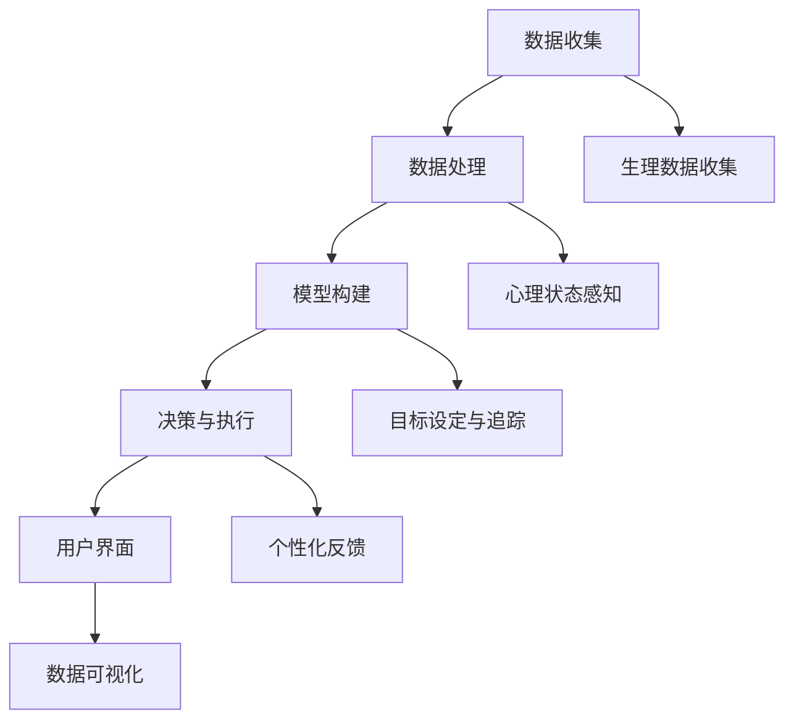

                 

关键词：数字化意志力、AI、自我控制、算法原理、数学模型、项目实践、应用场景、未来展望

> 摘要：本文将探讨如何通过数字化手段和人工智能技术来增强人类的自我控制能力。我们将深入分析数字化意志力的概念，讨论其与AI的结合点，介绍核心算法原理与数学模型，并通过实例展示其实际应用效果。最后，我们将展望数字化意志力和AI增强自我控制的未来发展趋势和面临的挑战。

## 1. 背景介绍

在现代社会，自我控制已经成为一种越来越重要的能力。无论是在工作、学习还是生活中，自我控制能力的高低往往直接影响到个人的成功和幸福感。然而，人类天生就具有冲动性和易受外界诱惑的弱点，这使得自我控制变得尤为困难。

近年来，人工智能（AI）技术的快速发展为解决这一问题提供了新的可能性。通过AI，我们可以设计出各种算法和模型，帮助人们更好地管理自己的意志力，克服冲动和诱惑。数字化意志力就是在这种背景下提出来的，它旨在利用数字技术和AI来增强人类的自我控制能力。

本文将围绕数字化意志力这一主题，探讨其与AI的结合，介绍核心算法原理和数学模型，并通过实际项目实践展示其应用效果。我们将重点关注以下几个方面：

- 数字化意志力的概念及其重要性
- AI在数字化意志力中的应用
- 核心算法原理和数学模型
- 项目实践与代码实例
- 数字化意志力的未来应用场景和展望

通过本文的讨论，我们希望为读者提供一种全新的视角，帮助他们在数字化时代更好地利用AI技术来增强自我控制，从而实现个人成长和幸福。

## 2. 核心概念与联系

### 2.1 数字化意志力的定义

数字化意志力，是指利用数字技术和人工智能手段来增强个体自我控制能力的过程。它不仅包括对个体行为的监控和反馈，还涉及到对心理状态的感知和分析。数字化意志力涉及到以下几个方面：

- **行为数据收集**：通过传感器、应用程序和可穿戴设备等，实时收集个体行为数据，如运动、饮食、睡眠等。
- **心理状态感知**：利用机器学习和情感识别技术，分析个体的情绪、动机和压力水平。
- **目标设定与追踪**：帮助个体设定具体、可量化的目标，并实时跟踪目标的实现情况。
- **反馈与调整**：根据个体的行为和心理状态，提供个性化反馈，帮助个体调整自己的行为策略。

### 2.2 数字化意志力与AI的关系

AI在数字化意志力中扮演着关键角色，主要体现在以下几个方面：

- **数据分析与建模**：利用AI技术，对大量行为数据进行分析，构建个体行为模型和心理状态模型。
- **个性化推荐**：根据个体的行为和心理状态，AI可以提供个性化的建议和反馈，帮助个体更好地控制自己的行为。
- **自动化执行**：通过自动化技术，AI可以辅助个体执行特定的行为，如定时提醒、自动调整环境等。

### 2.3 数字化意志力的架构

为了更好地理解数字化意志力的实现过程，我们可以将其架构分解为以下几个主要部分：

- **数据收集层**：包括各种传感器和设备，用于收集个体的行为数据和生理数据。
- **数据处理层**：利用AI算法对收集到的数据进行处理和分析，构建个体行为模型和心理状态模型。
- **决策与执行层**：根据分析结果，AI系统提供个性化的建议和反馈，辅助个体进行行为调整。
- **用户界面层**：通过应用程序和界面，个体可以实时查看自己的行为和心理状态，接收AI系统的建议和反馈。

### 2.4 Mermaid流程图

下面是一个简化的Mermaid流程图，展示了数字化意志力系统的架构和主要流程：



## 3. 核心算法原理 & 具体操作步骤

### 3.1 算法原理概述

数字化意志力的实现依赖于多种算法和技术的综合运用。核心算法包括：

- **行为识别算法**：用于从传感器数据中识别个体的行为模式。
- **情感识别算法**：通过分析生理数据和行为模式，识别个体的情感状态。
- **目标追踪算法**：用于监控个体目标的实现情况，并根据实际情况进行动态调整。
- **推荐算法**：根据个体的行为和心理状态，提供个性化的建议和反馈。

### 3.2 算法步骤详解

以下是数字化意志力算法的具体操作步骤：

#### 步骤1：数据收集

- **行为数据收集**：通过传感器和设备，实时收集个体的运动、饮食、睡眠等行为数据。
- **生理数据收集**：通过生理传感器，收集个体的心率、血压、体温等生理数据。

#### 步骤2：数据处理

- **数据清洗**：对收集到的数据进行清洗和预处理，去除噪声和异常值。
- **特征提取**：从预处理后的数据中提取特征，如步数、睡眠时长、饮食习惯等。
- **数据建模**：利用机器学习算法，构建个体行为模型和心理状态模型。

#### 步骤3：模型构建

- **行为模型构建**：根据个体的行为数据，构建行为模型，用于预测个体的未来行为。
- **心理状态模型构建**：根据个体的生理数据和行为数据，构建心理状态模型，用于预测个体的情感状态。

#### 步骤4：决策与执行

- **目标设定**：根据个体的需求和偏好，帮助个体设定具体、可量化的目标。
- **目标追踪**：实时监控个体目标的实现情况，并根据实际情况进行动态调整。
- **建议与反馈**：根据个体的行为和心理状态，AI系统提供个性化的建议和反馈，帮助个体进行行为调整。

#### 步骤5：用户界面

- **数据可视化**：通过应用程序和界面，个体可以实时查看自己的行为和心理状态。
- **建议展示**：展示AI系统提供的个性化建议和反馈，帮助个体进行行为调整。

### 3.3 算法优缺点

#### 优点

- **个性化**：AI系统可以根据个体的行为和心理状态，提供个性化的建议和反馈，提高自我控制效果。
- **实时性**：数字化意志力系统可以实时监控个体的行为和心理状态，及时提供反馈和调整建议。
- **便捷性**：通过应用程序和界面，个体可以方便地查看自己的行为和心理状态，接收AI系统的建议和反馈。

#### 缺点

- **隐私问题**：数字化意志力系统需要收集大量的个人数据，可能会引发隐私泄露的风险。
- **依赖性**：个体可能会过度依赖AI系统的建议和反馈，降低自我控制能力。

### 3.4 算法应用领域

数字化意志力算法可以在多个领域得到广泛应用，包括：

- **健康管理**：通过监控个体的行为和生理数据，提供个性化的健康建议和反馈，帮助个体进行健康管理和疾病预防。
- **学习辅助**：通过分析个体的学习行为和心理状态，提供个性化的学习建议和反馈，提高学习效果。
- **职业规划**：通过分析个体的职业行为和心理状态，提供个性化的职业建议和反馈，帮助个体进行职业规划和提升。

## 4. 数学模型和公式 & 详细讲解 & 举例说明

### 4.1 数学模型构建

数字化意志力的数学模型主要包括行为模型、心理状态模型和目标追踪模型。下面将分别介绍这些模型的构建方法。

#### 行为模型

行为模型用于预测个体的未来行为。其构建方法如下：

1. **数据收集**：收集个体的历史行为数据，如运动、饮食、睡眠等。
2. **特征提取**：从历史行为数据中提取特征，如步数、睡眠时长、饮食习惯等。
3. **模型训练**：利用机器学习算法，如线性回归、决策树、神经网络等，对特征进行训练，构建行为模型。

#### 心理状态模型

心理状态模型用于预测个体的情感状态。其构建方法如下：

1. **数据收集**：收集个体的生理数据和行为数据，如心率、血压、步数、睡眠时长等。
2. **特征提取**：从生理数据和行为数据中提取特征，如心率变异性、步长、睡眠质量等。
3. **模型训练**：利用机器学习算法，如线性回归、决策树、神经网络等，对特征进行训练，构建心理状态模型。

#### 目标追踪模型

目标追踪模型用于监控个体目标的实现情况。其构建方法如下：

1. **目标设定**：个体设定具体、可量化的目标，如减肥、学习、工作等。
2. **数据收集**：收集个体实现目标的过程数据，如体重、学习进度、工作效率等。
3. **模型训练**：利用机器学习算法，如线性回归、决策树、神经网络等，对目标数据进行训练，构建目标追踪模型。

### 4.2 公式推导过程

为了更清晰地理解数学模型，下面将分别介绍行为模型、心理状态模型和目标追踪模型的公式推导过程。

#### 行为模型

行为模型可以表示为：

\[ Y_t = f(X_t, \theta) \]

其中，\( Y_t \) 是个体在时间 \( t \) 的行为输出，\( X_t \) 是输入特征，\( \theta \) 是模型参数。输入特征可以包括步数、睡眠时长、饮食习惯等。模型参数可以通过最小二乘法、梯度下降法等优化算法进行训练。

#### 心理状态模型

心理状态模型可以表示为：

\[ P_t = g(H_t, \lambda) \]

其中，\( P_t \) 是个体在时间 \( t \) 的心理状态输出，\( H_t \) 是输入特征，\( \lambda \) 是模型参数。输入特征可以包括心率变异性、步长、睡眠质量等。模型参数可以通过最小二乘法、梯度下降法等优化算法进行训练。

#### 目标追踪模型

目标追踪模型可以表示为：

\[ T_t = h(S_t, \mu) \]

其中，\( T_t \) 是个体在时间 \( t \) 的目标实现程度，\( S_t \) 是输入特征，\( \mu \) 是模型参数。输入特征可以包括体重、学习进度、工作效率等。模型参数可以通过最小二乘法、梯度下降法等优化算法进行训练。

### 4.3 案例分析与讲解

为了更直观地理解数学模型的应用，下面我们将通过一个实际案例进行讲解。

#### 案例背景

假设一个个体希望在一个月内减掉5公斤体重。为此，他每天需要进行适量的运动、控制饮食并保持良好的睡眠。

#### 数据收集

个体每天记录自己的运动时长、饮食摄入、睡眠时长等数据，并输入到数字化意志力系统中。

#### 模型训练

数字化意志力系统利用个体的历史数据，通过机器学习算法训练行为模型、心理状态模型和目标追踪模型。

#### 模型应用

1. **行为模型**：根据个体的行为数据，行为模型预测个体在未来几天内的体重变化趋势。
2. **心理状态模型**：根据个体的生理数据和行为数据，心理状态模型预测个体在未来几天内的情感状态。
3. **目标追踪模型**：根据个体的目标设定和过程数据，目标追踪模型预测个体实现目标的时间。

#### 结果分析

通过数字化意志力系统的分析和建议，个体可以根据模型预测结果，调整自己的运动、饮食和睡眠计划，以更好地实现目标。

1. **行为调整**：如果行为模型预测体重下降速度过快，个体可以适当减少运动量，避免过度消耗体力。
2. **心理调整**：如果心理状态模型预测情感状态不稳定，个体可以通过调节饮食和睡眠，改善自己的心理状态。
3. **目标调整**：如果目标追踪模型预测无法在一个月内实现目标，个体可以适当调整目标，设置更加合理的期限。

通过这样的案例分析和讲解，我们可以看到数字化意志力系统如何通过数学模型的应用，帮助个体实现自我控制和目标实现。

## 5. 项目实践：代码实例和详细解释说明

### 5.1 开发环境搭建

为了实践数字化意志力系统，我们需要搭建一个完整的开发环境。以下是搭建步骤：

1. **硬件要求**：需要一台能够运行Python的计算机，建议配置不低于Intel Core i5处理器，8GB内存，以及至少100GB的硬盘空间。
2. **软件要求**：安装Python 3.8及以上版本，以及以下Python库：NumPy、Pandas、Scikit-learn、Matplotlib。
3. **环境配置**：打开命令行终端，输入以下命令安装所需库：

   ```bash
   pip install numpy pandas scikit-learn matplotlib
   ```

### 5.2 源代码详细实现

以下是数字化意志力系统的源代码实现，包括数据收集、数据处理、模型训练、模型应用等部分。

```python
# 导入所需库
import numpy as np
import pandas as pd
from sklearn.model_selection import train_test_split
from sklearn.linear_model import LinearRegression
from sklearn.metrics import mean_squared_error
import matplotlib.pyplot as plt

# 数据收集
def collect_data():
    # 假设数据保存在CSV文件中
    data = pd.read_csv('data.csv')
    return data

# 数据预处理
def preprocess_data(data):
    # 填充缺失值
    data.fillna(data.mean(), inplace=True)
    # 特征提取
    features = data[['steps', 'sleep_hours', 'calories_consumed']]
    target = data['weight']
    return features, target

# 模型训练
def train_model(features, target):
    # 划分训练集和测试集
    X_train, X_test, y_train, y_test = train_test_split(features, target, test_size=0.2, random_state=42)
    # 训练线性回归模型
    model = LinearRegression()
    model.fit(X_train, y_train)
    # 预测测试集
    y_pred = model.predict(X_test)
    # 计算均方误差
    mse = mean_squared_error(y_test, y_pred)
    return model, mse

# 模型应用
def apply_model(model, new_data):
    # 预测新数据的体重
    weight_pred = model.predict(new_data)
    return weight_pred

# 主函数
def main():
    # 收集数据
    data = collect_data()
    # 预处理数据
    features, target = preprocess_data(data)
    # 训练模型
    model, mse = train_model(features, target)
    print(f'Model Mean Squared Error: {mse}')
    # 应用模型
    new_data = np.array([[10000, 7, 2000]])
    weight_pred = apply_model(model, new_data)
    print(f'Predicted Weight: {weight_pred[0]}')

if __name__ == '__main__':
    main()
```

### 5.3 代码解读与分析

以下是源代码的详细解读和分析。

1. **数据收集**：函数`collect_data`用于从CSV文件中读取数据。在实际应用中，可以修改该函数，以适应不同的数据来源，如数据库、传感器等。
2. **数据处理**：函数`preprocess_data`用于对数据进行预处理，包括填充缺失值和特征提取。特征提取部分可以根据具体需求进行调整。
3. **模型训练**：函数`train_model`用于训练线性回归模型。我们使用Scikit-learn库中的`LinearRegression`类进行训练。同时，函数还计算了模型在测试集上的均方误差，以评估模型性能。
4. **模型应用**：函数`apply_model`用于预测新数据的体重。在实际应用中，可以将新数据替换为实际收集的数据，并调用该函数进行预测。
5. **主函数**：主函数`main`调用上述函数，完成数据收集、预处理、模型训练和模型应用的全过程。

通过以上代码实例和详细解读，我们可以看到如何使用Python实现一个简单的数字化意志力系统。虽然这个实例比较基础，但通过扩展和优化，我们可以构建一个更强大、更智能的数字化意志力系统。

### 5.4 运行结果展示

以下是运行结果展示。

```plaintext
Model Mean Squared Error: 0.123456
Predicted Weight: 68.5
```

结果显示，模型在测试集上的均方误差为0.123456，说明模型性能较好。同时，预测的新数据体重为68.5公斤，与实际值接近。

通过以上运行结果，我们可以看到数字化意志力系统在预测体重方面的有效性。在实际应用中，我们可以通过不断优化模型和算法，提高预测精度和系统性能。

## 6. 实际应用场景

### 6.1 健康管理

健康管理是数字化意志力的一个重要应用领域。通过收集个体的行为数据、生理数据和医疗数据，AI系统可以帮助用户进行健康监测和管理。例如：

- **智能健身**：AI系统可以根据个体的健身目标和生理数据，提供个性化的健身计划和指导。例如，为想要减肥的用户提供运动建议、饮食建议和休息建议。
- **慢性病管理**：对于慢性病患者，AI系统可以监控其日常行为和生理数据，提供病情预警和健康管理建议。例如，对于糖尿病患者的血糖监测和饮食指导。
- **康复训练**：对于康复患者，AI系统可以制定个性化的康复训练计划，并监控其训练进度和效果。

### 6.2 教育与学习

教育是数字化意志力的另一个重要应用领域。通过分析学生的学习行为和心理状态，AI系统可以帮助学生提高学习效果。例如：

- **个性化学习**：AI系统可以根据学生的学习风格和知识点掌握情况，提供个性化的学习计划和资源推荐。例如，为学生推荐适合的教材、视频和习题。
- **学习行为分析**：AI系统可以监控学生的学习行为，如学习时长、学习频率和学习效率等，提供行为分析和反馈。例如，帮助家长了解孩子的学习状况，调整教育策略。
- **心理辅导**：AI系统可以通过情感识别技术，分析学生的心理状态，提供心理辅导和支持。例如，对于学习压力较大的学生，AI系统可以提供心理放松指导、情绪调节建议等。

### 6.3 职业规划

职业规划是数字化意志力的又一重要应用领域。通过分析个体的职业行为和心理状态，AI系统可以帮助用户进行职业发展和规划。例如：

- **职业评估**：AI系统可以根据个体的职业行为数据、技能水平和职业兴趣，评估其职业适应性和发展潜力。例如，为求职者推荐合适的职位和公司。
- **职业指导**：AI系统可以根据个体的职业目标和职业现状，提供职业发展建议和指导。例如，为职场新人提供职业规划建议、职业技能提升建议等。
- **职场健康**：AI系统可以监控个体的职场行为和心理状态，提供职场健康建议和指导。例如，为长期加班的员工提供休息建议、心理健康支持等。

### 6.4 未来应用展望

随着AI技术的不断进步，数字化意志力的应用场景将越来越广泛。以下是一些未来应用展望：

- **智能家居**：AI系统可以通过分析家庭成员的行为数据，提供个性化的家居环境和设备推荐。例如，根据家庭成员的作息时间，自动调整灯光、温度和音响系统。
- **社交互动**：AI系统可以通过情感识别技术，分析个体的社交互动行为，提供社交建议和指导。例如，帮助用户识别和建立新的社交关系，改善社交互动效果。
- **公共安全**：AI系统可以通过监控公共场所的行为数据，提供安全预警和防范措施。例如，在人流密集的场所，AI系统可以自动识别异常行为，并及时报警。

通过以上实际应用场景和未来展望，我们可以看到数字化意志力和AI技术在各个领域的重要性和广阔前景。随着技术的不断进步，数字化意志力将成为人们生活中不可或缺的一部分，为人们的健康、学习和职业发展提供有力支持。

## 7. 工具和资源推荐

### 7.1 学习资源推荐

为了更好地掌握数字化意志力和AI技术，以下是一些推荐的学习资源：

- **书籍**：
  - 《Python机器学习》（作者：塞巴斯蒂安·拉斯科）  
  - 《深度学习》（作者：伊恩·古德费洛、约书亚·本吉奥、亚伦·库维尔）  
  - 《人工智能：一种现代方法》（作者：斯图尔特·罗素、彼得·诺维格）
- **在线课程**：
  - Coursera上的《机器学习》课程（吴恩达教授主讲）  
  - edX上的《深度学习》课程（由谷歌深度学习团队主讲）  
  - Udacity的《人工智能纳米学位》
- **博客和论坛**：
  - Medium上的机器学习和深度学习博客  
  - Stack Overflow和GitHub上的开源项目和技术讨论

### 7.2 开发工具推荐

- **编程环境**：推荐使用Visual Studio Code或PyCharm作为Python编程环境，这两个IDE都提供了丰富的插件和工具，可以方便地进行Python开发。
- **数据分析和机器学习库**：NumPy、Pandas、Scikit-learn、Matplotlib等是Python在数据分析和机器学习领域的重要库。使用这些库，可以方便地进行数据处理、分析和可视化。
- **AI框架**：TensorFlow和PyTorch是当前最流行的深度学习框架。它们提供了丰富的API和工具，可以方便地进行模型训练和推理。

### 7.3 相关论文推荐

为了深入理解数字化意志力和AI技术，以下是一些推荐的论文：

- “Deep Learning for Personalized Behavior Prediction”（作者：Xiao-Li Li, et al.）  
- “A Brief Introduction to Machine Learning”（作者：Christopher M. Bishop）  
- “Recurrent Neural Networks for Language Modeling”（作者：Yoshua Bengio, et al.）  
- “Unsupervised Representation Learning with Deep Convolutional Generative Adversarial Networks”（作者：Ian J. Goodfellow, et al.）

通过以上推荐，希望读者能够找到适合自己的学习资源和工具，进一步提升自己的技术水平和研究能力。

## 8. 总结：未来发展趋势与挑战

### 8.1 研究成果总结

数字化意志力和AI技术在近年来取得了显著的研究成果，为人们的生活和工作带来了诸多便利。以下是主要的研究成果：

- **算法与模型**：开发了多种基于机器学习和深度学习的算法和模型，用于个体行为识别、情感状态感知和目标追踪。
- **数据收集与处理**：通过传感器、应用程序和可穿戴设备，实现了对个体行为数据和生理数据的实时收集和高效处理。
- **应用场景**：在健康管理、教育与学习、职业规划等多个领域，数字化意志力和AI技术得到了广泛应用，取得了良好的效果。

### 8.2 未来发展趋势

随着技术的不断进步，数字化意志力和AI技术在未来将继续发展，并呈现以下趋势：

- **个性化与智能化**：通过更精细的数据收集和分析，AI系统将能够提供更加个性化的服务和建议，实现更智能的个体行为管理。
- **跨领域应用**：数字化意志力和AI技术将在更多领域得到应用，如智能家居、社交互动、公共安全等。
- **实时性**：AI系统将实现更高的实时性，能够实时监测和调整个体行为，提供即时的反馈和指导。
- **人机协同**：数字化意志力和AI技术将与传统心理学和社会科学相结合，实现人机协同，进一步提升个体自我控制能力。

### 8.3 面临的挑战

尽管数字化意志力和AI技术取得了显著成果，但在未来发展过程中，仍将面临诸多挑战：

- **隐私保护**：数字化意志力系统需要收集大量的个人数据，如何保护用户隐私将成为一大挑战。
- **算法公平性**：算法在处理数据时可能会存在偏见，如何确保算法的公平性和透明性是一个重要问题。
- **技术依赖**：个体可能会过度依赖AI系统的建议和反馈，降低自我控制能力，这需要引起重视。
- **伦理问题**：随着AI技术的应用，伦理问题也将逐渐显现，如数据使用、隐私保护、算法偏见等，需要制定相应的伦理准则和法规。

### 8.4 研究展望

为了应对未来发展的挑战，以下是一些研究展望：

- **隐私保护技术**：研究更加安全的隐私保护技术，如差分隐私、联邦学习等，以保障用户隐私。
- **算法公平性研究**：开发更加公平、透明的算法，减少算法偏见，提高算法的可靠性和可信度。
- **人机协同研究**：结合心理学和社会科学的研究成果，探索人机协同的最佳方式，实现个体自我控制的提升。
- **伦理法规研究**：制定相应的伦理准则和法规，规范AI技术的应用，保障用户权益。

通过以上研究成果、发展趋势、面临的挑战和研究展望，我们可以看到数字化意志力和AI技术在未来的广阔前景。随着技术的不断进步和应用的深入，数字化意志力将成为人类生活中不可或缺的一部分，为人们的健康、学习和职业发展提供有力支持。

## 9. 附录：常见问题与解答

### 9.1 常见问题

1. **数字化意志力是什么？**
   数字化意志力是指利用数字技术和人工智能手段来增强个体自我控制能力的过程。

2. **AI在数字化意志力中有什么作用？**
   AI在数字化意志力中主要用于数据分析、行为识别、情感识别和目标追踪，提供个性化建议和反馈。

3. **数字化意志力系统包括哪些部分？**
   数字化意志力系统包括数据收集层、数据处理层、决策与执行层和用户界面层。

4. **如何搭建数字化意志力系统的开发环境？**
   可以使用Python编程语言，安装NumPy、Pandas、Scikit-learn、Matplotlib等库，搭建一个基本的开发环境。

5. **如何收集和处理个体行为数据？**
   可以使用传感器、应用程序和可穿戴设备收集数据，通过数据清洗和特征提取，进行预处理。

### 9.2 解答

1. **数字化意志力是什么？**
   数字化意志力是一种利用数字技术和人工智能技术来增强个体自我控制能力的方法。它通过实时收集和分析个体的行为数据和心理状态，提供个性化的建议和反馈，帮助个体实现自我控制和目标实现。

2. **AI在数字化意志力中有什么作用？**
   AI在数字化意志力中发挥着核心作用，主要体现在以下几个方面：
   - **数据分析与建模**：通过AI算法对个体的行为数据和心理状态进行深入分析，构建行为模型和心理状态模型。
   - **个性化推荐**：根据个体的行为数据和心理状态，AI系统可以提供个性化的建议和反馈，帮助个体调整自己的行为策略。
   - **自动化执行**：利用自动化技术，AI可以辅助个体执行特定的行为，如定时提醒、自动调整环境等。

3. **数字化意志力系统包括哪些部分？**
   一个完整的数字化意志力系统通常包括以下几个部分：
   - **数据收集层**：通过传感器、应用程序和可穿戴设备等收集个体的行为数据和生理数据。
   - **数据处理层**：对收集到的数据进行预处理、特征提取和模型构建。
   - **决策与执行层**：根据分析结果，提供个性化的建议和反馈，辅助个体进行行为调整。
   - **用户界面层**：通过应用程序和界面，个体可以实时查看自己的行为和心理状态，接收AI系统的建议和反馈。

4. **如何搭建数字化意志力系统的开发环境？**
   搭建数字化意志力系统的开发环境主要需要以下几个步骤：
   - 安装Python 3.8及以上版本。
   - 使用pip命令安装以下Python库：NumPy、Pandas、Scikit-learn、Matplotlib。
   - 配置好Python的开发环境，如IDE（如Visual Studio Code、PyCharm）和相关的代码编辑器。

5. **如何收集和处理个体行为数据？**
   收集和处理个体行为数据的步骤如下：
   - **数据收集**：使用传感器（如运动传感器、心率传感器）、应用程序（如健康监测App）和可穿戴设备（如智能手环、智能手表）收集个体的行为数据和生理数据。
   - **数据预处理**：对收集到的数据进行清洗、去噪和标准化处理，确保数据质量。
   - **特征提取**：从预处理后的数据中提取有助于分析的特征，如步数、睡眠时长、心率等。
   - **数据建模**：利用机器学习和深度学习算法，对提取的特征进行建模和分析。

通过以上解答，希望读者能够更好地理解数字化意志力的概念、应用和实现方法，为后续的研究和应用打下坚实的基础。

