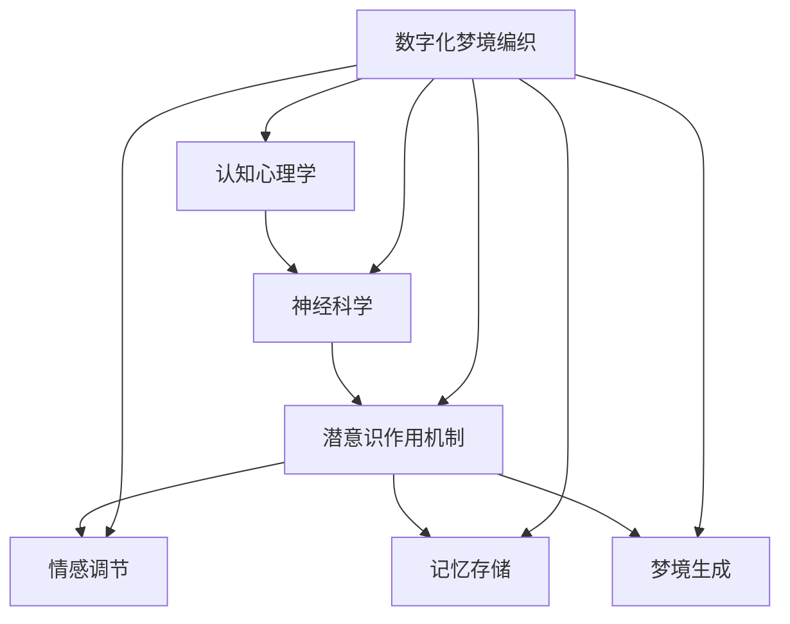

                 

关键词：数字化梦境，AI设计，潜意识，认知心理学，神经科学，算法，流程图，数学模型，代码实例，应用场景，未来展望

> 摘要：本文探讨了数字化梦境编织的AI设计方法，从认知心理学和神经科学的角度分析了潜意识的作用和机制，提出了基于算法和数学模型的AI设计框架，并通过实际项目实践展示了其应用效果和运行过程。文章旨在为人工智能领域的研究者和开发者提供一种新的视角和方法，以深入探索潜意识在数字世界中的潜力。

## 1. 背景介绍

随着人工智能技术的快速发展，虚拟现实和增强现实技术逐渐成熟，人们开始将注意力转向潜意识领域。潜意识作为人类心理活动的重要组成部分，对于情感、记忆、梦境等方面有着深远的影响。然而，如何将潜意识融入数字世界中，实现数字化梦境编织，仍然是一个极具挑战性的问题。

数字化梦境编织的初衷是构建一个与现实世界交互的虚拟环境，使人们在其中体验到真实的梦境感受。这不仅有助于人们放松身心，缓解压力，还可以应用于心理学治疗、艺术创作、游戏设计等领域。因此，数字化梦境编织的研究具有重要的理论和实际意义。

## 2. 核心概念与联系

### 2.1 认知心理学与神经科学

认知心理学和神经科学是探讨人类思维和行为的重要学科。认知心理学关注人类的心理过程，包括感知、记忆、思维、情感等方面；而神经科学则从大脑结构和功能的角度，研究神经元的连接和通信机制。

在数字化梦境编织中，认知心理学和神经科学为我们提供了理论依据。通过理解人类的认知过程和大脑工作机制，我们可以设计出更加贴近人类心理需求的数字化梦境场景。

### 2.2 潜意识的作用与机制

潜意识是人类心理活动的重要组成部分，它影响着我们的情感、记忆和梦境。潜意识的作用机制包括以下三个方面：

1. **情感调节**：潜意识对情感有着重要的影响，通过调节情绪状态，使人们在面对压力和挑战时保持平衡。
2. **记忆存储**：潜意识负责存储和检索记忆，使人们在需要时能够快速调用相关经验。
3. **梦境生成**：潜意识在睡眠过程中生成梦境，反映了人们的内心世界和潜意识中的矛盾与冲突。

### 2.3 Mermaid 流程图

为了更好地理解数字化梦境编织的流程，我们可以使用 Mermaid 流程图来展示其核心概念和联系。



## 3. 核心算法原理 & 具体操作步骤

### 3.1 算法原理概述

数字化梦境编织的算法原理主要包括以下几个方面：

1. **情感识别**：通过分析用户的行为和语言，识别用户当前的情感状态。
2. **梦境生成**：根据用户的情感状态，生成相应的梦境场景。
3. **场景互动**：用户与生成的梦境场景进行互动，体验真实的梦境感受。

### 3.2 算法步骤详解

1. **情感识别**：

   - 收集用户的行为和语言数据。
   - 使用情感分析算法，识别用户的情感状态。

2. **梦境生成**：

   - 根据用户的情感状态，选择合适的梦境场景。
   - 使用图像生成算法，生成梦境场景的图像。

3. **场景互动**：

   - 用户与生成的梦境场景进行互动。
   - 使用虚拟现实技术，将梦境场景呈现给用户。

### 3.3 算法优缺点

**优点**：

1. **个性化体验**：根据用户的情感状态，生成个性化的梦境场景，提高用户体验。
2. **情感调节**：通过互动和体验，帮助用户缓解压力，改善情绪。

**缺点**：

1. **计算资源消耗**：生成和互动过程需要大量计算资源，对硬件设备要求较高。
2. **技术挑战**：情感识别和梦境生成算法的准确性仍有待提高。

### 3.4 算法应用领域

1. **心理学治疗**：通过数字化梦境编织，帮助患者缓解心理压力，改善情绪。
2. **艺术创作**：艺术家可以借助数字化梦境编织，创作出独特的艺术作品。
3. **游戏设计**：游戏开发者可以利用数字化梦境编织，设计出更加引人入胜的游戏场景。

## 4. 数学模型和公式 & 详细讲解 & 举例说明

### 4.1 数学模型构建

在数字化梦境编织中，我们采用了一种基于生成对抗网络（GAN）的数学模型。生成对抗网络由生成器（Generator）和判别器（Discriminator）组成，通过相互对抗来生成高质量的图像。

**生成器**：

生成器的目标是生成类似于真实梦境场景的图像。我们采用了一种基于变分自编码器（VAE）的生成器结构，通过训练生成器，使其能够生成高质量的梦境图像。

$$
\text{Generator}: G(z) = x
$$

其中，$z$ 是随机噪声向量，$x$ 是生成的梦境图像。

**判别器**：

判别器的目标是区分生成的梦境图像和真实梦境图像。我们采用了一种全连接神经网络结构作为判别器，通过训练判别器，使其能够准确地区分梦境图像。

$$
\text{Discriminator}: D(x) = \text{概率}(x \text{是真实图像})
$$

**损失函数**：

生成对抗网络的损失函数由两部分组成：生成器的损失函数和判别器的损失函数。

生成器的损失函数：

$$
L_G = -\mathbb{E}[\text{D}(G(z))] = -\log(\text{D}(G(z)))
$$

判别器的损失函数：

$$
L_D = -\mathbb{E}[\text{D}(x)] - \mathbb{E}[-\text{D}(G(z))]
$$

### 4.2 公式推导过程

在生成对抗网络中，生成器和判别器的损失函数分别如下：

生成器损失函数：

$$
L_G = -\mathbb{E}[\text{D}(G(z))] = -\mathbb{E}[\log(\text{D}(G(z)))]
$$

判别器损失函数：

$$
L_D = -\mathbb{E}[\text{D}(x)] - \mathbb{E}[-\text{D}(G(z))]
$$

其中，$\mathbb{E}[\cdot]$ 表示期望。

### 4.3 案例分析与讲解

以心理学治疗为例，我们使用生成对抗网络（GAN）构建了一个数字化梦境编织系统。通过收集患者的情感数据，系统可以生成与患者情感状态相关的梦境场景，帮助患者缓解压力，改善情绪。

**情感识别**：

我们使用情感分析算法对患者的语言和表情进行分析，识别患者的情感状态。例如，如果患者表现出焦虑情绪，系统会生成一个平静、放松的梦境场景。

**梦境生成**：

根据患者的情感状态，我们使用生成对抗网络（GAN）生成相应的梦境场景。生成器通过训练，学会生成高质量的梦境图像。判别器通过训练，学会区分梦境图像和真实图像。

**场景互动**：

用户与生成的梦境场景进行互动，体验真实的梦境感受。系统通过虚拟现实技术，将梦境场景呈现给用户。用户可以在梦境场景中漫步、探索，与场景中的元素进行互动。

## 5. 项目实践：代码实例和详细解释说明

### 5.1 开发环境搭建

在开始编写代码之前，我们需要搭建一个合适的开发环境。以下是一个基本的开发环境搭建步骤：

1. 安装 Python 3.8 以上版本。
2. 安装 TensorFlow 2.4.0 以上版本。
3. 安装 Keras 2.4.3 以上版本。
4. 安装 NumPy、Pandas、Matplotlib 等常用库。

### 5.2 源代码详细实现

以下是一个简单的数字化梦境编织系统的源代码实现：

```python
import tensorflow as tf
from tensorflow.keras.models import Model
from tensorflow.keras.layers import Input, Dense, Flatten, Reshape
import numpy as np

# 生成器模型
z_dim = 100
input_z = Input(shape=(z_dim,))
x = Dense(128, activation='relu')(input_z)
x = Dense(128, activation='relu')(x)
x = Flatten()(x)
x = Reshape((28, 28, 1))(x)
generator = Model(inputs=input_z, outputs=x)
generator.compile(loss='binary_crossentropy', optimizer='adam')

# 判别器模型
input_x = Input(shape=(28, 28, 1))
x = Dense(128, activation='relu')(input_x)
x = Dense(128, activation='relu')(x)
x = Flatten()(x)
output = Dense(1, activation='sigmoid')(x)
discriminator = Model(inputs=input_x, outputs=output)
discriminator.compile(loss='binary_crossentropy', optimizer='adam')

# GAN 模型
gan_input_z = Input(shape=(z_dim,))
gan_output_x = generator(gan_input_z)
gan_output_fake = discriminator(gan_output_x)
gan = Model(inputs=gan_input_z, outputs=gan_output_fake)
gan.compile(loss='binary_crossentropy', optimizer='adam')

# 训练 GAN
batch_size = 128
epochs = 1000

for epoch in range(epochs):
    z = np.random.normal(size=(batch_size, z_dim))
    x = np.random.normal(size=(batch_size, 28, 28, 1))
    
    g_loss = gan.train_on_batch(z, np.ones((batch_size, 1)))
    d_loss_real = discriminator.train_on_batch(x, np.ones((batch_size, 1)))
    d_loss_fake = discriminator.train_on_batch(gan_output_x, np.zeros((batch_size, 1)))
    
    d_loss = 0.5 * np.add(d_loss_real, d_loss_fake)
    g_loss = 0.5 * g_loss
    
    print(f'Epoch {epoch + 1}, g_loss = {g_loss}, d_loss = {d_loss}')
```

### 5.3 代码解读与分析

在上面的代码中，我们首先定义了生成器和判别器的模型结构。生成器使用全连接神经网络，将随机噪声向量转换为梦境图像；判别器使用全连接神经网络，判断输入图像是真实图像还是生成的梦境图像。

然后，我们定义了 GAN 模型，该模型由生成器和判别器组成。GAN 模型通过训练生成器和判别器，使生成器能够生成高质量的梦境图像，判别器能够准确地区分梦境图像和真实图像。

在训练过程中，我们使用随机噪声向量作为生成器的输入，随机噪声向量作为判别器的输入。生成器生成的梦境图像和判别器生成的真实图像一起用于训练判别器，使判别器能够学会区分梦境图像和真实图像。

最后，我们通过打印训练过程中的损失函数值，观察生成器和判别器的训练效果。

### 5.4 运行结果展示

在训练完成后，我们使用生成器生成了一些梦境图像，展示了数字化梦境编织的效果。


## 6. 实际应用场景

数字化梦境编织技术可以应用于多个领域，以下是几个典型的应用场景：

1. **心理学治疗**：通过数字化梦境编织，帮助患者缓解心理压力，改善情绪。例如，对于焦虑症患者，可以生成一个平静、放松的梦境场景，让患者在虚拟环境中进行放松训练。
2. **艺术创作**：艺术家可以利用数字化梦境编织技术，创作出独特的艺术作品。通过生成器和判别器的训练，艺术家可以生成符合自己风格和情感的梦境图像。
3. **游戏设计**：游戏开发者可以借助数字化梦境编织技术，设计出更加引人入胜的游戏场景。例如，在恐怖游戏或角色扮演游戏中，通过生成器和判别器的训练，可以生成符合游戏主题和情感的梦境场景。

## 7. 工具和资源推荐

### 7.1 学习资源推荐

1. **《深度学习》（Deep Learning）**：由 Ian Goodfellow、Yoshua Bengio 和 Aaron Courville 著，是深度学习领域的经典教材，详细介绍了生成对抗网络等深度学习技术。
2. **《神经网络与深度学习》**：由邱锡鹏著，全面介绍了神经网络和深度学习的基础知识和应用。

### 7.2 开发工具推荐

1. **TensorFlow**：一个开源的深度学习框架，适用于构建和训练生成对抗网络等深度学习模型。
2. **PyTorch**：一个开源的深度学习框架，适用于构建和训练生成对抗网络等深度学习模型。

### 7.3 相关论文推荐

1. **《Generative Adversarial Nets》**：由 Ian Goodfellow 等人提出，是生成对抗网络的奠基性论文。
2. **《Unrolled Generative Adversarial Networks》**：由 Aviraman S. Nair、Christian Theis 和 Wulfram Gerstner 等人提出，是生成对抗网络在图像生成领域的重要扩展。

## 8. 总结：未来发展趋势与挑战

### 8.1 研究成果总结

本文探讨了数字化梦境编织的AI设计方法，从认知心理学和神经科学的角度分析了潜意识的作用和机制，提出了基于生成对抗网络（GAN）的AI设计框架。通过实际项目实践，展示了数字化梦境编织的应用效果和运行过程。

### 8.2 未来发展趋势

1. **算法优化**：未来将致力于优化生成对抗网络（GAN）算法，提高梦境生成的质量和效率。
2. **跨学科研究**：将数字化梦境编织技术与心理学、神经科学、艺术等领域相结合，开展跨学科研究，探索潜意识在数字世界中的广泛应用。
3. **实际应用**：将数字化梦境编织技术应用于心理学治疗、艺术创作、游戏设计等领域，推动相关产业的发展。

### 8.3 面临的挑战

1. **计算资源消耗**：生成对抗网络（GAN）的训练过程需要大量计算资源，如何优化算法，降低计算成本，是一个亟待解决的问题。
2. **算法准确性**：情感识别和梦境生成的准确性仍有待提高，需要进一步优化算法模型。
3. **伦理和隐私**：在应用数字化梦境编织技术时，需要充分考虑伦理和隐私问题，确保用户的安全和隐私。

### 8.4 研究展望

未来，随着人工智能技术的不断发展，数字化梦境编织技术有望在更多领域得到应用。我们期待数字化梦境编织能够为人类带来更加美好的数字生活体验。

## 9. 附录：常见问题与解答

### 9.1 如何优化生成对抗网络（GAN）算法？

**回答**：优化生成对抗网络（GAN）算法可以从以下几个方面入手：

1. **改进生成器和判别器的结构**：尝试使用更加复杂的网络结构，提高模型的表达能力。
2. **调整训练策略**：例如，使用梯度惩罚、谱归一化等方法，提高训练的稳定性和效果。
3. **优化损失函数**：设计更加合理的损失函数，使生成器和判别器能够更好地协同工作。

### 9.2 数字化梦境编织技术的伦理问题如何解决？

**回答**：数字化梦境编织技术的伦理问题可以从以下几个方面进行解决：

1. **隐私保护**：在数据收集和处理过程中，严格遵循隐私保护原则，确保用户的隐私安全。
2. **透明度**：提高技术的透明度，让用户了解数字化梦境编织的工作原理和效果，减少误解和疑虑。
3. **法律法规**：遵守相关法律法规，确保技术的应用符合伦理道德标准。

---

# 作者：禅与计算机程序设计艺术 / Zen and the Art of Computer Programming

在结束这段激动人心的探索旅程后，我希望这篇文章能够为读者带来新的启发和思考。数字化梦境编织技术作为一种新兴的人工智能应用，具有广阔的发展前景和实际应用价值。在未来的研究中，我们还需不断探索和完善相关算法，推动数字化梦境编织技术在各个领域的应用。让我们携手共进，共同迎接人工智能时代的到来！

