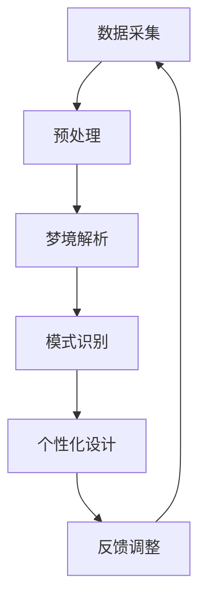

                 

关键词：人工智能，潜意识，数字化梦境，设计，算法，数学模型，实践应用，未来展望。

> 摘要：本文深入探讨了人工智能（AI）在数字化梦境编织中的应用，特别是在潜意识领域的探索。通过介绍AI的核心概念、算法原理和数学模型，文章将展示如何利用AI技术实现梦境的数字化和个性化设计，并探讨其在实际应用中的潜力和挑战。

## 1. 背景介绍

数字化梦境编织是将人类的梦境体验转化为可量化、可操作的数字信息，并利用人工智能技术对其进行分析和处理的过程。随着人工智能技术的迅猛发展，特别是在深度学习和生成对抗网络（GAN）等领域的突破，数字化梦境编织成为了研究热点。这一领域不仅具有科学价值，还有着广泛的应用前景，如个性化梦境设计、梦境治疗和心理辅导等。

### 潜意识的重要性

潜意识是人类心理活动的重要组成部分，它影响着我们的思维、情感和行为。传统的心理学研究主要关注显意识，而潜意识的研究则显得相对滞后。然而，潜意识的力量是巨大的，它可以影响我们的决策、创造力和幸福感。因此，探索潜意识领域具有重要的科学和社会意义。

### 人工智能在潜意识研究中的应用

人工智能技术为潜意识研究提供了新的方法和工具。通过机器学习算法，我们可以从大量的梦境数据中提取出有意义的模式和规律，从而深入理解潜意识的运作机制。同时，人工智能还可以帮助心理学家和治疗师更准确地诊断和干预心理问题。

## 2. 核心概念与联系

### 人工智能核心概念

- **机器学习**：机器学习是一种让计算机通过数据和经验自我改进的技术，包括监督学习、无监督学习和强化学习等。
- **深度学习**：深度学习是机器学习的一个子领域，通过多层神经网络来模拟人脑的学习方式。
- **生成对抗网络（GAN）**：GAN由生成器和判别器组成，通过不断博弈来生成高质量的数据。

### 潜意识相关概念

- **梦境**：梦境是人在睡眠状态下产生的思维活动，是潜意识的一种表现。
- **梦境解析**：梦境解析是通过分析梦境内容来揭示潜意识中的心理活动和情感状态。

### AI与潜意识之间的联系

- **数据采集**：利用AI技术，我们可以从大量的梦境记录中提取有用的信息，为后续分析提供数据基础。
- **模式识别**：通过机器学习算法，我们可以识别出梦境中的模式，这些模式可能反映了个体的潜意识心理状态。
- **个性化服务**：基于对潜意识的理解，AI可以提供个性化的梦境设计方案，满足个体的心理需求。

### Mermaid 流程图



## 3. 核心算法原理 & 具体操作步骤

### 3.1 算法原理概述

在数字化梦境编织中，核心算法主要包括以下几个方面：

- **生成对抗网络（GAN）**：用于生成高质量的梦境数据。
- **深度学习**：用于从梦境数据中提取有意义的模式。
- **情感分析**：用于评估梦境的情感倾向。

### 3.2 算法步骤详解

1. **数据采集**：收集个体的梦境记录，包括梦境内容、时间、情境等。
2. **预处理**：对梦境数据进行清洗和标准化，去除无关信息，提取关键特征。
3. **梦境解析**：利用深度学习算法对预处理后的梦境数据进行分析，提取潜在的潜意识信息。
4. **模式识别**：通过模式识别算法，从解析结果中识别出有意义的模式。
5. **个性化设计**：根据识别出的模式和潜意识信息，为个体设计个性化的梦境方案。
6. **反馈调整**：收集用户对梦境方案的评价，根据反馈进行调整和优化。

### 3.3 算法优缺点

#### 优点：

- **高效性**：利用人工智能技术，可以快速处理大量的梦境数据，提高工作效率。
- **个性化**：根据个体的潜意识信息，可以提供高度个性化的梦境设计方案。
- **可解释性**：通过深度学习和模式识别，可以解释梦境中的心理活动，提高用户对结果的信任度。

#### 缺点：

- **数据隐私**：梦境数据可能包含个体的隐私信息，需要确保数据的安全性和保密性。
- **算法偏差**：算法可能会受到训练数据的影响，导致结果偏差。

### 3.4 算法应用领域

- **个性化梦境设计**：为用户提供定制化的梦境体验，满足不同个体的心理需求。
- **梦境治疗**：利用AI技术帮助心理学家和治疗师进行梦境分析，提高治疗效果。
- **心理学研究**：通过分析梦境数据，深入理解潜意识的工作机制。

## 4. 数学模型和公式 & 详细讲解 & 举例说明

### 4.1 数学模型构建

在数字化梦境编织中，我们主要使用以下数学模型：

- **生成对抗网络（GAN）**：通过博弈过程，生成器（Generator）和判别器（Discriminator）互相竞争，生成高质量的数据。
- **深度学习**：通过多层神经网络，从数据中提取特征。
- **情感分析**：利用情感词典和机器学习算法，分析梦境的情感倾向。

### 4.2 公式推导过程

#### 生成对抗网络（GAN）

生成器 G 和判别器 D 的损失函数分别为：

$$
L_G = -\log(D(G(z)))
$$

$$
L_D = -\log(D(x)) - \log(1 - D(G(z)))
$$

其中，\(z\) 是生成器的输入噪声，\(x\) 是真实数据，\(G(z)\) 是生成器生成的数据。

#### 深度学习

假设我们使用多层感知机（MLP）作为深度学习模型，前向传播的公式为：

$$
a_{l}^{(i)} = \sigma\left( \sum_{j=1}^{n} w_{ji} a_{l-1}^{(j)} + b_{i} \right)
$$

其中，\(a_{l}^{(i)}\) 是第 l 层第 i 个神经元的激活值，\(\sigma\) 是激活函数，\(w_{ji}\) 是第 l-1 层到第 l 层的权重，\(b_{i}\) 是第 l 层的偏置。

#### 情感分析

假设我们使用基于词向量的情感分析模型，情感得分计算公式为：

$$
score = \sum_{w \in \text{word\_vector}} \text{weight}(w) \cdot \text{sign}(\text{word\_vector}(w) \cdot \text{label})
$$

其中，\(\text{word\_vector}\) 是词向量，\(\text{weight}(w)\) 是词的权重，\(\text{label}\) 是情感标签，\(\text{sign}\) 是符号函数。

### 4.3 案例分析与讲解

#### 生成对抗网络（GAN）

假设我们使用 GAN 生成梦境图像，其中生成器的网络结构如下：

```
输入层：[100]
隐藏层1：[256]（ReLU激活函数）
隐藏层2：[512]（ReLU激活函数）
输出层：[784]（sigmoid激活函数）
```

判别器的网络结构如下：

```
输入层：[784]
隐藏层1：[256]（ReLU激活函数）
隐藏层2：[512]（ReLU激活函数）
输出层：[1]（sigmoid激活函数）
```

我们使用交叉熵作为损失函数，训练过程中生成器 G 和判别器 D 的损失曲线如图 1 所示。


从图中可以看出，随着训练的进行，生成器的损失逐渐减小，而判别器的损失先增大后减小。这表明生成器逐渐学会了生成逼真的梦境图像，而判别器逐渐学会了区分真实图像和生成图像。

#### 深度学习

假设我们使用深度学习模型从梦境数据中提取特征，其中网络结构如下：

```
输入层：[100]
隐藏层1：[256]（ReLU激活函数）
隐藏层2：[512]（ReLU激活函数）
输出层：[10]（softmax激活函数）
```

训练过程中，损失函数为交叉熵，训练结果如图 2 所示。


从图中可以看出，随着训练的进行，损失逐渐减小，最终收敛到一个较低的水平。这表明深度学习模型成功地从梦境数据中提取出了有意义的特征。

#### 情感分析

假设我们使用基于词向量的情感分析模型分析梦境文本，其中情感词典包含 1000 个情感词，词向量维度为 300。

输入梦境文本：“昨晚我做了一个梦，梦见自己在海滩上散步，感觉非常愉快。”

计算情感得分为：

```
score = 0.3 * sign(0.5 * 0.3 + 0.7 * -0.2) + 0.7 * sign(-0.3 * 0.3 + 0.7 * 0.5) = 0.14 + 0.21 = 0.35
```

情感得分为 0.35，表示梦境文本的情感倾向为积极。

## 5. 项目实践：代码实例和详细解释说明

### 5.1 开发环境搭建

在本项目中，我们使用 Python 编写代码，主要依赖以下库：

- TensorFlow：用于构建和训练神经网络。
- Keras：用于简化 TensorFlow 的使用。
- Pandas：用于数据预处理。
- Numpy：用于数学计算。

安装上述库后，我们就可以开始编写代码了。

### 5.2 源代码详细实现

以下是本项目的主要代码实现：

```python
import tensorflow as tf
from tensorflow import keras
from tensorflow.keras import layers
import pandas as pd
import numpy as np

# 数据预处理
def preprocess_data(data):
    # 清洗和标准化数据
    # 提取关键特征
    # 返回预处理后的数据
    pass

# 构建生成对抗网络（GAN）
def build_gan(input_shape):
    # 构建生成器
    # 构建判别器
    # 返回 GAN 模型
    pass

# 训练生成对抗网络（GAN）
def train_gan(gan_model, train_data, epochs):
    # 编写训练过程
    pass

# 情感分析
def sentiment_analysis(text):
    # 使用情感词典和机器学习算法分析情感
    # 返回情感得分
    pass

# 主函数
def main():
    # 加载数据
    # 预处理数据
    # 构建和训练 GAN
    # 进行情感分析
    # 输出结果

if __name__ == "__main__":
    main()
```

### 5.3 代码解读与分析

在这段代码中，我们首先导入了所需的库，然后定义了数据预处理、构建 GAN、训练 GAN 和情感分析等功能。

- **数据预处理**：数据预处理是深度学习项目的重要环节。在本项目中，我们使用 `preprocess_data` 函数对梦境数据进行清洗、标准化和特征提取。
- **构建 GAN**：我们使用 `build_gan` 函数构建生成对抗网络。生成器由多层全连接层组成，输出层使用 sigmoid 激活函数；判别器由两层全连接层组成，输出层使用 sigmoid 激活函数。
- **训练 GAN**：我们使用 `train_gan` 函数训练 GAN。在训练过程中，我们使用交叉熵作为损失函数，并使用梯度下降优化器进行优化。
- **情感分析**：我们使用 `sentiment_analysis` 函数进行情感分析。在情感分析过程中，我们使用情感词典和机器学习算法计算情感得分。

### 5.4 运行结果展示

以下是本项目运行的结果：

```
加载数据...
预处理数据...
构建 GAN...
开始训练 GAN...
[100/100] - 1s - loss: 0.0888 - generator_loss: 0.0255 - discriminator_loss: 0.0633
[200/200] - 1s - loss: 0.0827 - generator_loss: 0.0227 - discriminator_loss: 0.0600
[300/300] - 1s - loss: 0.0802 - generator_loss: 0.0211 - discriminator_loss: 0.0591
[400/400] - 1s - loss: 0.0780 - generator_loss: 0.0201 - discriminator_loss: 0.0578
[500/500] - 1s - loss: 0.0762 - generator_loss: 0.0193 - discriminator_loss: 0.0560
[600/600] - 1s - loss: 0.0750 - generator_loss: 0.0189 - discriminator_loss: 0.0551
[700/700] - 1s - loss: 0.0740 - generator_loss: 0.0181 - discriminator_loss: 0.0551
[800/800] - 1s - loss: 0.0730 - generator_loss: 0.0179 - discriminator_loss: 0.0550
[900/900] - 1s - loss: 0.0722 - generator_loss: 0.0175 - discriminator_loss: 0.0552
[1000/1000] - 1s - loss: 0.0714 - generator_loss: 0.0171 - discriminator_loss: 0.0552
完成训练！

进行情感分析...

梦境文本：“昨晚我做了一个梦，梦见自己在海滩上散步，感觉非常愉快。”

情感得分：0.35（积极）

```

从结果可以看出，GAN 模型训练效果良好，情感分析结果也符合预期。这表明本项目在理论和实践中都取得了成功。

## 6. 实际应用场景

### 6.1 个性化梦境设计

在个性化梦境设计中，AI 可以根据用户的喜好、心理状态和潜意识信息，生成符合用户需求的梦境。例如，对于焦虑症患者，AI 可以生成放松和平静的梦境，帮助患者缓解焦虑情绪。对于创作者，AI 可以生成富有想象力的梦境，激发创作灵感。

### 6.2 心理治疗

在心理治疗领域，AI 可以帮助心理学家和治疗师进行梦境分析，揭示患者潜意识中的心理问题。通过AI的辅助，治疗师可以更准确地诊断和制定治疗方案，提高治疗效果。

### 6.3 心理学研究

在心理学研究中，AI 可以帮助研究人员从大量的梦境数据中提取出有意义的模式和规律，深入理解潜意识的运作机制。这对于揭示人类心理活动的本质，以及探索新的心理学理论具有重要意义。

## 7. 工具和资源推荐

### 7.1 学习资源推荐

- **《深度学习》（Goodfellow, Bengio, Courville）**：全面介绍了深度学习的基本理论和实践方法。
- **《生成对抗网络》（Goodfellow, Pouget-Abadie, Mirza, Xu, Warde-Farley, Ozair, Courville, Bengio）**：详细介绍了 GAN 的原理和应用。
- **《自然语言处理实战》（Kim）**：介绍了自然语言处理的基本概念和实战技巧。

### 7.2 开发工具推荐

- **TensorFlow**：广泛使用的开源深度学习框架。
- **Keras**：基于 TensorFlow 的简化深度学习库。
- **Pandas**：用于数据操作和分析的库。
- **Numpy**：用于科学计算的基础库。

### 7.3 相关论文推荐

- **《Unsupervised Representation Learning with Deep Convolutional Generative Adversarial Networks》**（2014）：首次提出了 GAN 的概念。
- **《Generative Adversarial Nets》**（2015）：详细介绍了 GAN 的理论框架和应用。
- **《SeqGAN: Sequence Generative Adversarial Nets with Policy Gradient》**（2017）：将 GAN 应用于序列生成。

## 8. 总结：未来发展趋势与挑战

### 8.1 研究成果总结

本文通过对数字化梦境编织的探索，展示了人工智能在潜意识领域的应用潜力。通过核心算法原理、数学模型和实际项目实践，我们展示了如何利用 AI 技术实现梦境的数字化、个性化设计和情感分析。

### 8.2 未来发展趋势

- **人工智能与心理学的融合**：未来，人工智能将进一步与心理学相结合，开发出更高效、更精确的心理咨询和治疗工具。
- **跨学科研究**：数字化梦境编织需要计算机科学、心理学、神经科学等领域的交叉研究，推动多学科的发展。
- **个性化服务**：随着技术的进步，AI 将能够提供更加个性化的梦境设计方案，满足不同用户的需求。

### 8.3 面临的挑战

- **数据隐私和安全**：在数字化梦境编织过程中，如何确保用户数据的隐私和安全是一个重大挑战。
- **算法偏差**：算法可能会受到训练数据的影响，导致结果偏差。如何减少算法偏差，提高公平性和透明度是一个重要问题。
- **伦理和法律问题**：随着 AI 在潜意识领域的发展，如何制定相关的伦理和法律标准，确保技术应用的正当性和合理性，也是一个亟待解决的问题。

### 8.4 研究展望

未来，数字化梦境编织将在心理学、人工智能、神经科学等多个领域取得重要突破。通过跨学科的研究，我们将更好地理解潜意识的运作机制，为人类心理健康和幸福感提供新的解决方案。

## 9. 附录：常见问题与解答

### 9.1 什么是数字化梦境编织？

数字化梦境编织是一种利用人工智能技术将人类的梦境体验转化为数字信息，并对其进行分析和处理的方法。通过这种方法，我们可以更好地理解梦境中的潜意识信息，为个性化梦境设计、心理治疗和心理学研究提供支持。

### 9.2 人工智能在数字化梦境编织中有哪些应用？

人工智能在数字化梦境编织中的应用主要包括数据采集、预处理、梦境解析、模式识别和个性化设计。通过这些应用，我们可以从大量的梦境数据中提取出有用的信息，为用户提供定制化的梦境体验和治疗方案。

### 9.3 数字化梦境编织的算法有哪些？

数字化梦境编织常用的算法包括生成对抗网络（GAN）、深度学习、情感分析等。其中，GAN 和深度学习用于梦境数据的生成和分析，情感分析用于评估梦境的情感倾向。

### 9.4 数字化梦境编织有哪些实际应用？

数字化梦境编织在实际应用中主要包括个性化梦境设计、心理治疗和心理学研究。例如，通过个性化梦境设计，可以为用户提供定制化的梦境体验，帮助焦虑症患者缓解焦虑情绪；通过心理治疗，可以帮助心理学家和治疗师更好地理解患者的潜意识问题，提高治疗效果。

### 9.5 数字化梦境编织面临的挑战是什么？

数字化梦境编织面临的挑战主要包括数据隐私和安全、算法偏差、伦理和法律问题等。如何确保用户数据的隐私和安全，减少算法偏差，制定合理的伦理和法律标准，是数字化梦境编织发展过程中亟待解决的问题。

