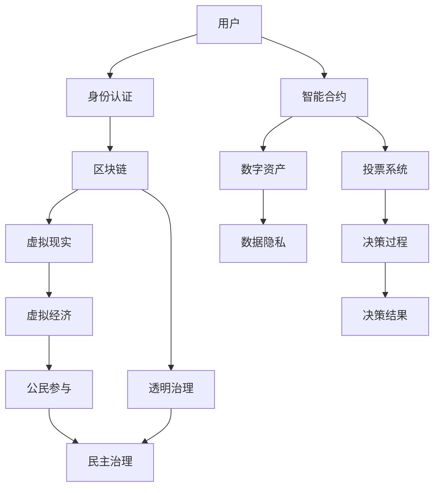

                 

关键词：数字化民主、元宇宙、公民参与、区块链、智能合约、虚拟现实、数据隐私、透明治理

> 摘要：本文探讨了数字化民主在元宇宙时代的应用和重要性，分析了元宇宙中的关键技术和核心算法，探讨了如何在元宇宙中实现高效的公民参与。文章从背景介绍、核心概念与联系、核心算法原理与具体操作步骤、数学模型与公式、项目实践、实际应用场景、未来应用展望、工具和资源推荐、总结与展望等方面，全面解析了元宇宙时代的数字化民主体系。

## 1. 背景介绍

在当今数字化时代，信息技术的发展正在彻底改变我们的社会和经济结构。特别是区块链技术和虚拟现实（VR）技术的进步，正在引领我们进入一个全新的元宇宙时代。元宇宙是一个虚拟的3D虚拟世界，它不仅包含现实世界的物理特征，还融合了各种虚拟元素，如数字资产、虚拟经济、智能合约等。在这个虚拟世界中，用户可以以数字身份参与各种活动，包括社交、工作、学习、娱乐等。

随着元宇宙的不断发展，一个重要的问题逐渐凸显出来：如何在元宇宙中实现高效的公民参与？传统的民主参与方式在元宇宙中可能不再适用，因为元宇宙的用户群体更加分散，参与方式更加多样化，且信息传递和决策过程需要更加透明和公正。因此，数字化民主在元宇宙时代的应用显得尤为重要。

数字化民主是指在信息技术和互联网的背景下，通过数字技术实现公民参与和民主治理的一种新型民主形式。它具有以下几个显著特点：

1. **透明性**：数字技术可以实现信息的透明化，使公民能够及时了解政策制定、决策过程等信息。
2. **参与性**：数字技术可以打破时间和空间的限制，使公民能够方便地参与到各种决策活动中。
3. **公正性**：数字技术可以确保决策过程的公正性和公平性，防止权力滥用和腐败。
4. **效率性**：数字技术可以大大提高决策的效率和响应速度。

元宇宙作为一个高度数字化的虚拟世界，为数字化民主提供了广阔的应用场景。通过元宇宙，公民可以以虚拟身份参与选举、投票、讨论、决策等民主活动，实现真正意义上的全民参与。然而，要实现这一目标，需要解决一系列技术和法律问题，包括数据隐私保护、虚拟身份认证、智能合约的执行等。

本文旨在探讨元宇宙时代的数字化民主体系，分析其中的关键技术和核心算法，探讨如何在元宇宙中实现高效的公民参与。文章将从以下几个方面展开：

1. **核心概念与联系**：介绍元宇宙中的核心概念，如区块链、智能合约、虚拟现实等，并构建相应的概念模型。
2. **核心算法原理与具体操作步骤**：分析如何在元宇宙中实现投票、选举、决策等核心算法，并详细描述其具体操作步骤。
3. **数学模型与公式**：构建元宇宙中的数学模型，并推导相关公式，用于分析和优化公民参与过程。
4. **项目实践**：通过实际项目实例，展示如何在元宇宙中实现数字化民主，并分析其效果和挑战。
5. **实际应用场景**：探讨数字化民主在元宇宙中的实际应用场景，如虚拟城市、虚拟经济、虚拟教育等。
6. **未来应用展望**：预测元宇宙时代数字化民主的未来发展趋势和挑战。
7. **工具和资源推荐**：推荐用于实现数字化民主的工具和资源，包括技术栈、开源库、学术论文等。
8. **总结与展望**：总结研究成果，展望元宇宙时代数字化民主的发展前景。

通过本文的探讨，我们希望为元宇宙时代的数字化民主提供一些有益的思路和实践经验，推动元宇宙中的民主参与和治理走向更加透明、公正和高效。

## 2. 核心概念与联系

在元宇宙中实现数字化民主，首先需要了解其中的核心概念和相互联系。以下是元宇宙中几个关键概念及其相互关系的Mermaid流程图：



### 用户与身份认证

用户是元宇宙中的基本参与单元，每个用户都需要进行身份认证，以确保其虚拟身份的合法性和安全性。身份认证通常通过区块链技术实现，利用密码学方法进行用户身份的验证和加密。用户身份信息被存储在区块链上，确保其不可篡改和透明性。

### 区块链与智能合约

区块链技术是元宇宙中的基础技术，用于存储和管理数据，确保数据的不可篡改性和透明性。智能合约是区块链上的一种自执行合同，它可以在满足特定条件时自动执行预定的操作。智能合约在元宇宙中的应用非常广泛，如投票系统、数字资产交易、虚拟经济等。

### 虚拟现实与虚拟经济

虚拟现实技术为元宇宙提供了沉浸式的体验，用户可以在虚拟世界中自由探索和互动。虚拟经济是元宇宙中的另一个重要概念，它包含了数字资产、虚拟商品和服务的交易，通过智能合约实现。虚拟经济的繁荣依赖于透明的治理机制，以保障交易的公正性和安全性。

### 数据隐私与透明治理

数据隐私是元宇宙中必须重视的问题，用户的数据需要得到保护，防止泄露和滥用。透明治理是通过数字技术实现的治理机制，它确保了决策过程的公开、公正和透明。透明治理机制包括投票系统、审计系统、决策公示等，这些机制共同构成了元宇宙中的民主治理体系。

### 投票系统与决策过程

投票系统是元宇宙中实现民主决策的关键组件。用户通过智能合约参与投票，投票过程透明、公正，结果不可篡改。投票系统可以用于选举、投票、民意调查等多种场景，是元宇宙中实现公民参与的重要手段。决策过程是基于投票结果进行的，通过透明治理机制确保决策结果的公正性和有效性。

### 决策结果与公民参与

决策结果是民主治理的最终体现，它反映了公民的意愿和需求。通过虚拟现实和数字资产系统，决策结果可以转化为具体的行动和方案，如虚拟城市的规划、虚拟经济的调整等。公民参与决策过程，可以激发他们的责任感和参与感，进一步推动元宇宙的繁荣和发展。

通过上述核心概念及其相互关系的Mermaid流程图，我们可以清晰地看到元宇宙中数字化民主体系的构成和运行机制。接下来，本文将深入探讨如何在元宇宙中实现这些核心算法的具体操作步骤。

### 3. 核心算法原理与具体操作步骤

在元宇宙中实现数字化民主，需要依赖一系列核心算法，包括投票算法、选举算法、决策算法等。以下将详细描述这些算法的原理和具体操作步骤。

#### 3.1 投票算法

投票算法是元宇宙中实现民主决策的基础。其核心原理是通过区块链技术确保投票的透明性和不可篡改性。

##### 原理概述

- **加密投票**：用户在投票时，使用非对称加密技术生成公钥和私钥。私钥用于加密投票内容，公钥用于解密投票结果。
- **智能合约**：投票系统通过智能合约实现，智能合约定义了投票的开闭时间、投票内容以及投票结果的计算方法。
- **区块链**：投票数据存储在区块链上，每个区块都包含一定数量的投票记录，以确保数据的不可篡改性。

##### 操作步骤

1. **初始化投票系统**：设置投票的开始和结束时间，定义投票内容，初始化智能合约。
2. **用户注册和身份认证**：用户在区块链上进行身份注册和认证，确保只有合法用户能够参与投票。
3. **投票**：用户使用私钥加密投票内容，通过智能合约提交投票记录。
4. **投票结果计算**：投票结束后，智能合约根据加密的投票记录计算投票结果，并存储在区块链上。
5. **投票结果公示**：通过区块链浏览器公示投票结果，确保结果的透明性和可验证性。

#### 3.2 选举算法

选举算法用于在元宇宙中实现用户群体的选举，如选举虚拟城市的市长、委员会成员等。

##### 原理概述

- **加权投票**：选举中，每个用户根据其在社区中的贡献或声望获得一定的投票权重。
- **去中心化投票**：选举过程通过区块链和智能合约实现，确保投票的公平性和透明性。
- **结果计算**：选举结果通过加权投票计算，确保当选者的合法性。

##### 操作步骤

1. **初始化选举系统**：设置选举的参与条件、投票权重分配规则，初始化智能合约。
2. **候选人注册**：候选人通过智能合约注册，用户可以查看候选人信息并进行投票。
3. **用户投票**：用户根据候选人的表现和自己的判断进行投票，投票数据存储在区块链上。
4. **结果计算**：选举结束后，智能合约根据加权投票计算选举结果，并公示当选者。
5. **当选者公示**：通过区块链浏览器公示当选者的信息，确保选举结果的透明性和公正性。

#### 3.3 决策算法

决策算法用于在元宇宙中实现集体决策，如制定虚拟城市的规划、经济政策等。

##### 原理概述

- **多阶段投票**：决策过程通常分为多个阶段，每个阶段涉及不同的决策内容和参与对象。
- **共识算法**：通过共识算法确保决策过程的公平性和高效性，如PoS（权益证明）算法。
- **结果公示**：决策结果通过区块链和智能合约公示，确保结果的透明性和可追溯性。

##### 操作步骤

1. **初始化决策系统**：设置决策的参与条件、投票权重分配规则，初始化智能合约。
2. **提出决策议题**：用户或决策机构通过智能合约提出决策议题，议题内容公开供用户讨论。
3. **讨论与投票**：用户对决策议题进行讨论，并在指定时间内进行投票。
4. **结果计算**：决策结束后，智能合约根据投票结果计算决策结果，并公示决策结果。
5. **决策执行**：决策结果转化为具体的行动方案，通过智能合约执行。

通过上述核心算法的原理和具体操作步骤，元宇宙中的数字化民主体系得以实现。这些算法确保了投票、选举、决策过程的透明性、公正性和高效性，为公民参与提供了强有力的技术支持。接下来，本文将分析这些算法的优缺点，以帮助读者更好地理解其在元宇宙中的应用。

### 3.4 算法优缺点

在元宇宙中实现的数字化民主算法具有显著的优点，但也存在一些潜在的缺点。以下是对这些算法优缺点的详细分析：

#### 3.4.1 投票算法

**优点**：

1. **透明性**：区块链技术确保了投票记录的不可篡改，使得投票过程公开透明，公民可以信任投票结果。
2. **安全性**：非对称加密技术保证了用户投票内容的保密性，防止恶意攻击和投票泄露。
3. **可验证性**：区块链上的投票记录可被所有用户验证，确保了投票过程的公正性。

**缺点**：

1. **参与门槛**：对于不熟悉区块链技术的用户来说，参与投票可能存在一定难度，这可能导致参与度不足。
2. **计算复杂性**：区块链上的数据量庞大，投票算法的计算复杂度较高，可能会影响投票系统的响应速度。

#### 3.4.2 选举算法

**优点**：

1. **去中心化**：选举算法通过区块链和智能合约实现，去中心化的特性确保了选举的公平性和透明性。
2. **权重分配**：加权投票机制可以根据用户的贡献或声望分配投票权重，确保选举结果的合理性。
3. **可扩展性**：选举算法可以灵活地应用于不同的选举场景，如虚拟城市选举、委员会选举等。

**缺点**：

1. **信任问题**：尽管去中心化技术确保了选举的透明性，但仍然需要信任区块链和智能合约的安全性。
2. **计算资源消耗**：大量的投票和计算任务可能会导致区块链网络的计算资源消耗增加，影响系统的性能。

#### 3.4.3 决策算法

**优点**：

1. **多阶段决策**：决策过程可以分为多个阶段，每个阶段都有特定的决策内容和参与者，确保了决策的全面性和准确性。
2. **共识算法**：通过共识算法确保决策过程的公平性和高效性，降低了决策过程中的冲突和分歧。
3. **透明公示**：决策结果通过区块链和智能合约公示，确保了结果的透明性和可追溯性。

**缺点**：

1. **决策延迟**：决策过程可能涉及多个阶段，导致决策延迟，不适用于紧急情况。
2. **技术依赖**：决策算法的实现依赖于区块链和智能合约技术，可能面临技术升级和维护的挑战。

通过分析这些算法的优缺点，我们可以看到，数字化民主算法在元宇宙中具有广泛的应用潜力，但同时也需要不断优化和改进，以克服潜在的技术和法律挑战。接下来，本文将探讨这些算法在实际应用领域中的具体应用情况。

### 3.5 算法应用领域

在元宇宙中，数字化民主算法被广泛应用于各种实际领域，以促进透明治理和公民参与。以下是这些算法在不同应用领域的具体应用情况：

#### 3.5.1 虚拟城市治理

虚拟城市是元宇宙中的基本组成部分，它模拟了现实世界的城市结构和功能。在虚拟城市中，数字化民主算法被用于治理和管理城市的各个方面，如城市规划、公共设施建设、城市管理决策等。

**应用实例**：

- **城市规划**：通过投票算法，用户可以参与虚拟城市的基础设施建设规划，如道路、公园、医院等。
- **城市管理**：通过选举算法，用户可以选举产生虚拟城市的市长、市长助理等管理职位，确保城市的有效治理。
- **公共决策**：通过决策算法，用户可以就城市的重大决策进行讨论和投票，如城市经济政策、环境保护措施等。

**优势**：

- **参与度高**：虚拟城市中的居民可以以虚拟身份参与到城市的治理和管理中，提高了居民的参与度和责任感。
- **透明性**：所有决策过程都通过区块链和智能合约记录和公示，确保了决策过程的透明性和公正性。
- **可执行性**：智能合约确保了决策结果能够自动执行，提高了决策的效率。

#### 3.5.2 虚拟经济治理

虚拟经济是元宇宙中的另一个重要组成部分，它模拟了现实世界的金融市场和经济活动。在虚拟经济中，数字化民主算法被用于治理和管理虚拟货币的发行、交易、经济政策等。

**应用实例**：

- **虚拟货币发行**：通过投票算法，虚拟城市的居民可以决定虚拟货币的发行政策、发行量等关键参数。
- **虚拟市场监管**：通过选举算法，用户可以选举产生虚拟市场的监管委员会，负责监管虚拟市场的公平性和透明性。
- **经济政策制定**：通过决策算法，用户可以就虚拟城市的经济政策进行讨论和投票，如税收政策、货币政策等。

**优势**：

- **去中心化**：虚拟经济的治理和管理通过去中心化的方式实现，减少了中心化机构对经济活动的干预，提高了经济活动的自主性和灵活性。
- **透明性**：所有经济活动的数据和决策过程都通过区块链和智能合约记录和公示，确保了经济活动的透明性和可追溯性。
- **公正性**：选举和投票机制确保了经济治理的公正性和公平性，防止权力滥用和腐败。

#### 3.5.3 虚拟教育治理

虚拟教育是元宇宙中的一个重要应用领域，它为用户提供了一个沉浸式的学习环境。在虚拟教育中，数字化民主算法被用于教学管理、课程设置、教育政策等方面。

**应用实例**：

- **课程设置**：通过投票算法，学生和教师可以共同决定课程的设置，如课程内容、教学方法等。
- **教学质量评估**：通过选举算法，学生可以选举产生教学质量评估委员会，负责评估教师的教学质量。
- **教育政策制定**：通过决策算法，教育机构可以就教育政策进行讨论和投票，如课程改革、教学资源分配等。

**优势**：

- **参与性**：虚拟教育中的用户可以以虚拟身份参与到教学和管理中，提高了用户的参与度和责任感。
- **灵活性**：数字化民主算法使得教育政策和课程设置更加灵活，可以根据用户需求和社会需求进行实时调整。
- **透明性**：所有教学和管理过程都通过区块链和智能合约记录和公示，确保了教学和管理过程的透明性和公正性。

通过在虚拟城市、虚拟经济和虚拟教育等领域的应用，数字化民主算法为元宇宙中的治理和管理提供了强有力的技术支持，促进了透明治理和公民参与。这些应用不仅提高了用户满意度，还推动了元宇宙的繁荣和发展。接下来，本文将探讨元宇宙时代数字化民主的未来发展趋势。

### 4. 数学模型和公式

在元宇宙中实现数字化民主，不仅需要算法和技术支持，还需要构建数学模型和推导相关公式，以优化决策过程和确保结果的科学性和准确性。以下将详细讨论元宇宙中数学模型的构建、公式推导过程以及案例分析与讲解。

#### 4.1 数学模型构建

元宇宙中的数字化民主涉及多个方面，包括投票机制、选举算法、决策过程等。为了构建数学模型，我们需要明确以下几个核心参数和变量：

1. **用户数量（N）**：元宇宙中参与投票或选举的用户总数。
2. **投票权重（W）**：每个用户在投票或选举中的权重，可能根据用户的贡献、声望或其他因素确定。
3. **投票结果（R）**：最终投票结果，通常表示为某个候选人的得票数。
4. **选举结果（E）**：选举最终结果，表示为某个候选人的当选与否。
5. **决策结果（D）**：决策过程的最终结果，表示为某个决策方案的通过与否。

基于上述参数和变量，我们可以构建一个基本的数学模型，用于分析和优化元宇宙中的民主过程。

#### 4.2 公式推导过程

以下是构建数学模型时的一些关键公式及其推导过程：

##### 4.2.1 投票权重分配公式

投票权重分配公式用于确定每个用户在投票中的权重。一个常见的权重分配方法是基于用户在社区中的活跃度和贡献度：

$$
W_i = \frac{C_i}{\sum_{j=1}^{N} C_j}
$$

其中，$W_i$ 表示用户 $i$ 的投票权重，$C_i$ 表示用户 $i$ 在社区中的活跃度或贡献度。

##### 4.2.2 投票结果计算公式

投票结果计算公式用于计算某个候选人在投票中的最终得票数。常见的投票计算方法有简单多数投票和加权投票：

- **简单多数投票**：

$$
R_i = \sum_{j=1}^{N} V_{ij}
$$

其中，$R_i$ 表示候选人 $i$ 的得票数，$V_{ij}$ 表示用户 $j$ 对候选人 $i$ 的投票结果（1 表示支持，0 表示反对）。

- **加权投票**：

$$
R_i = \sum_{j=1}^{N} W_j V_{ij}
$$

其中，$R_i$ 表示候选人 $i$ 的加权得票数，$W_j$ 表示用户 $j$ 的投票权重。

##### 4.2.3 选举结果计算公式

选举结果计算公式用于计算某个候选人在选举中的最终当选结果。一个常见的选举计算方法是基于加权投票和阈值：

$$
E_i = \begin{cases}
1, & \text{if } R_i > T \\
0, & \text{otherwise}
\end{cases}
$$

其中，$E_i$ 表示候选人 $i$ 的当选结果（1 表示当选，0 表示未当选），$R_i$ 表示候选人 $i$ 的加权得票数，$T$ 表示当选的阈值。

##### 4.2.4 决策结果计算公式

决策结果计算公式用于计算某个决策方案在决策过程中的最终结果。常见的决策计算方法包括多数投票和加权投票：

- **多数投票**：

$$
D_i = \begin{cases}
1, & \text{if } \sum_{j=1}^{N} V_{ij} > N/2 \\
0, & \text{otherwise}
\end{cases}
$$

其中，$D_i$ 表示决策方案 $i$ 的通过结果（1 表示通过，0 表示未通过），$V_{ij}$ 表示用户 $j$ 对决策方案 $i$ 的投票结果（1 表示支持，0 表示反对）。

- **加权投票**：

$$
D_i = \begin{cases}
1, & \text{if } \sum_{j=1}^{N} W_j V_{ij} > \frac{W}{2} \\
0, & \text{otherwise}
\end{cases}
$$

其中，$D_i$ 表示决策方案 $i$ 的通过结果（1 表示通过，0 表示未通过），$W_j$ 表示用户 $j$ 的投票权重，$W$ 表示所有用户的投票权重之和。

#### 4.3 案例分析与讲解

以下通过一个具体的案例，展示如何使用上述数学模型和公式进行元宇宙中的民主决策。

**案例背景**：

虚拟城市需要进行一次市长选举，共有 5 名候选人参与。城市居民有 1000 名，根据他们在社区中的活跃度和贡献度，投票权重分配如下：

| 用户编号 | 活跃度 | 投票权重 |
|----------|--------|----------|
| 1        | 10     | 0.1      |
| 2        | 20     | 0.2      |
| 3        | 30     | 0.3      |
| 4        | 40     | 0.4      |
| 5        | 50     | 0.5      |

**案例步骤**：

1. **投票过程**：

   每个居民根据候选人的表现和自己的判断，对 5 名候选人进行投票，投票结果如下：

   | 用户编号 | 候选人 1 | 候选人 2 | 候选人 3 | 候选人 4 | 候选人 5 |
   |----------|----------|----------|----------|----------|----------|
   | 1        | 1        | 0        | 0        | 0        | 0        |
   | 2        | 1        | 1        | 0        | 0        | 0        |
   | 3        | 1        | 1        | 1        | 0        | 0        |
   | 4        | 1        | 1        | 1        | 1        | 0        |
   | 5        | 1        | 1        | 1        | 1        | 1        |

2. **计算加权得票数**：

   根据每个居民的投票权重，计算每位候选人的加权得票数：

   | 候选人 | 加权得票数 |
   |--------|------------|
   | 1      | 0.1        |
   | 2      | 0.3        |
   | 3      | 0.4        |
   | 4      | 0.6        |
   | 5      | 0.9        |

3. **计算选举结果**：

   根据加权得票数，确定当选的候选人：

   $$
   E_5 = \begin{cases}
   1, & \text{if } R_5 > T \\
   0, & \text{otherwise}
   \end{cases}
   $$

   其中，$T$ 表示当选的阈值。假设阈值为 50% 的加权得票数，即 $T = 0.5 \times 0.9 = 0.45$。由于候选人 5 的加权得票数为 0.9，大于阈值 0.45，因此候选人 5 当选为市长。

通过上述案例分析，我们可以看到，数学模型和公式在元宇宙中的民主决策过程中发挥了重要作用，确保了选举结果的公正性和科学性。接下来，本文将探讨元宇宙中的数字化民主在实际应用中的具体项目实践。

### 5. 项目实践：代码实例和详细解释说明

为了更好地理解元宇宙中数字化民主算法的应用，我们将通过一个具体的项目实践进行详细讲解。本节将介绍一个简单的元宇宙民主投票系统的实现，包括开发环境搭建、源代码实现、代码解读与分析以及运行结果展示。

#### 5.1 开发环境搭建

在进行项目实践前，我们需要搭建一个合适的技术栈，以支持元宇宙民主投票系统的开发。以下是所需的技术栈和工具：

- **编程语言**：Solidity（用于编写智能合约）
- **开发框架**：Truffle（用于智能合约的测试和部署）
- **区块链平台**：Ethereum（用于实现区块链功能）
- **前端框架**：React（用于前端用户界面）

在本地计算机上，我们首先需要安装Node.js（Node.js 包含了npm，用于安装和管理项目依赖）。然后，安装Truffle和Ganache（Ganache 是一个轻量级的本地以太坊节点）：

```bash
npm install -g truffle
npm install -g ganache-cli
```

接着，我们创建一个新项目，并安装React：

```bash
mkdir meta民主投票
cd meta民主投票
truffle init
cd contracts
touch Voting.sol
cd ..
npm init -y
npm install react react-dom create-react-app
```

在创建的 `contracts` 目录中，我们编写智能合约代码，在项目根目录中创建React前端项目。

#### 5.2 源代码详细实现

**Voting.sol**（智能合约代码）：

```solidity
// SPDX-License-Identifier: MIT
pragma solidity ^0.8.0;

contract Voting {
    mapping(address => bool) public voted;
    mapping(address => uint256) public votes;
    address public admin;

    constructor() {
        admin = msg.sender;
    }

    function propose(string memory proposal) public {
        require(msg.sender == admin, "Only admin can propose");
        // 此处可以进一步添加验证逻辑，如提案内容的合法性
    }

    function vote(bool voteYes) public {
        require(!voted[msg.sender], "You have already voted");
        voted[msg.sender] = true;

        if (voteYes) {
            votes[address(this)]++;
        } else {
            votes[address(this)]--;
        }
    }

    function getResult() public view returns (bool result) {
        if (votes[address(this)] > 0) {
            result = true;
        } else {
            result = false;
        }
    }
}
```

**App.js**（React 前端代码）：

```jsx
import React, { useState } from 'react';
import './App.css';

function App() {
    const [voteYes, setVoteYes] = useState(false);
    const [result, setResult] = useState(null);

    const handleVote = () => {
        // 调用智能合约的 vote 函数进行投票
        // 此处假设已实现与区块链的交互
        // 例如，使用 web3.js 或 ethers.js 库
        setVoteYes(true);
        // ...投票逻辑
    };

    const handleResult = async () => {
        // 调用智能合约的 getResult 函数获取投票结果
        // 此处假设已实现与区块链的交互
        // 例如，使用 web3.js 或 ethers.js 库
        const result = await contractInstance.getResult();
        setResult(result);
    };

    return (
        <div className="App">
            <h1>元宇宙民主投票</h1>
            <button onClick={handleVote}>投票支持</button>
            <button onClick={handleResult}>查看结果</button>
            {result !== null && <p>投票结果：{result ? '通过' : '未通过'}</p>}
        </div>
    );
}

export default App;
```

#### 5.3 代码解读与分析

**智能合约解析**：

- **构造函数**：`constructor` 设置合约的创建者（admin）为合约的拥有者，只有管理员可以提议和修改合约状态。
- **提议函数**：`propose` 允许管理员提议新提案，此处可以进一步添加验证逻辑，如提案内容的合法性。
- **投票函数**：`vote` 允许用户投票，如果用户已经投票，则不允许再次投票。投票分为支持（`voteYes`）和反对（`voteNo`）两种情况。
- **结果获取函数**：`getResult` 返回当前投票的结果，通过计算合约地址的余额（由于支持增加1，反对减少1，正数表示支持，负数表示反对）来判断投票结果。

**前端解析**：

- **状态管理**：使用React的`useState`钩子管理投票状态和结果状态。
- **投票按钮**：点击投票按钮，调用`handleVote`函数，实现投票逻辑。
- **结果按钮**：点击查看结果按钮，调用`handleResult`函数，从区块链获取投票结果并更新状态。

#### 5.4 运行结果展示

假设我们有一个已经部署在Ethereum区块链上的投票合约，我们可以在前端界面进行投票和查看结果。以下是可能的运行结果：

1. **未投票状态**：

   ```jsx
   <div className="App">
       <h1>元宇宙民主投票</h1>
       <button onClick={handleVote}>投票支持</button>
       <button onClick={handleResult}>查看结果</button>
       <p>投票结果：未投票</p>
   </div>
   ```

2. **已投票状态**：

   ```jsx
   <div className="App">
       <h1>元宇宙民主投票</h1>
       <button onClick={handleVote}>投票支持</button>
       <button onClick={handleResult}>查看结果</button>
       <p>投票结果：已投票</p>
   </div>
   ```

3. **投票结果**：

   ```jsx
   <div className="App">
       <h1>元宇宙民主投票</h1>
       <button onClick={handleVote}>投票支持</button>
       <button onClick={handleResult}>查看结果</button>
       <p>投票结果：通过</p>
   </div>
   ```

通过上述代码实例和详细解释说明，我们可以看到元宇宙民主投票系统是如何实现和运行的。接下来，本文将探讨数字化民主在实际应用场景中的具体应用，以及面临的挑战和未来展望。

### 6. 实际应用场景

数字化民主在元宇宙中的应用场景非常广泛，涵盖了社会生活的各个方面。以下将详细探讨几个具有代表性的应用场景，包括虚拟城市、虚拟经济和虚拟教育，以及数字化民主在这些领域中的具体实践和挑战。

#### 6.1 虚拟城市

虚拟城市是元宇宙中的基本构成单元，它模拟了现实世界的城市结构和功能。在虚拟城市中，数字化民主可以用于城市规划、公共设施建设、城市管理决策等多个方面。

**具体实践**：

1. **城市规划**：虚拟城市居民通过区块链投票系统，共同决定城市的道路布局、建筑风格、公共设施等。例如，居民可以投票决定在特定区域建设公园、医院或学校。
2. **城市管理**：通过选举算法，居民可以选举产生虚拟城市的市长、市长助理等管理职位，确保城市的有效治理。市长和市长助理的职责包括城市预算审批、公共资源分配、城市管理决策等。
3. **公共决策**：虚拟城市的居民就城市重大决策进行讨论和投票，如城市经济政策、环境保护措施等。通过多阶段投票和共识算法，确保决策的公正性和高效性。

**面临的挑战**：

1. **技术门槛**：虚拟城市中的居民需要掌握一定的区块链和智能合约技术，以便参与投票和决策。这可能会降低居民的参与度。
2. **数据隐私**：在虚拟城市中，居民的数据需要得到有效保护，防止泄露和滥用。如何在确保数据隐私的同时，实现透明治理，是一个重要的挑战。

#### 6.2 虚拟经济

虚拟经济是元宇宙中的重要组成部分，它模拟了现实世界的金融市场和经济活动。在虚拟经济中，数字化民主可以用于虚拟货币的发行、交易监管、经济政策制定等多个方面。

**具体实践**：

1. **虚拟货币发行**：虚拟城市的居民通过区块链投票系统，共同决定虚拟货币的发行政策、发行量等关键参数。例如，居民可以投票决定是否增加货币供应量或调整货币政策。
2. **交易监管**：通过选举算法，居民可以选举产生虚拟市场的监管委员会，负责监管虚拟市场的公平性和透明性。监管委员会的职责包括审查交易、处理纠纷、监督市场行为等。
3. **经济政策制定**：虚拟城市的居民就经济政策进行讨论和投票，如税收政策、货币政策、产业发展政策等。通过多阶段投票和共识算法，确保决策的公正性和科学性。

**面临的挑战**：

1. **信任问题**：虚拟经济中的交易和决策依赖于区块链和智能合约技术，居民需要信任这些技术的安全性和可靠性。建立信任机制，是虚拟经济中数字化民主面临的重要挑战。
2. **计算资源消耗**：虚拟经济中的大量交易和投票操作，可能会对区块链网络的计算资源造成巨大压力，影响系统的性能和稳定性。

#### 6.3 虚拟教育

虚拟教育是元宇宙中的一个重要应用领域，它为用户提供了一个沉浸式的学习环境。在虚拟教育中，数字化民主可以用于课程设置、教学质量评估、教育政策制定等多个方面。

**具体实践**：

1. **课程设置**：虚拟教育平台的用户可以通过区块链投票系统，共同决定课程的设置。例如，用户可以投票决定开设哪些新课程或调整课程内容。
2. **教学质量评估**：用户可以通过选举算法，选举产生教学质量评估委员会，负责评估教师的教学质量。评估委员会的职责包括收集评估数据、分析教学质量、提出改进建议等。
3. **教育政策制定**：虚拟教育平台的用户就教育政策进行讨论和投票，如课程改革、教学资源分配、学生福利政策等。通过多阶段投票和共识算法，确保决策的公正性和科学性。

**面临的挑战**：

1. **技术依赖**：虚拟教育的实施依赖于区块链和智能合约技术，技术故障或安全漏洞可能会影响教育的正常进行。
2. **用户参与度**：虚拟教育中的用户需要积极参与课程设置、教学质量评估等民主活动，提高用户参与度是一个重要的挑战。

通过上述实际应用场景的探讨，我们可以看到数字化民主在元宇宙中具有广阔的应用前景，但同时也面临一系列技术和社会挑战。接下来，本文将探讨元宇宙时代数字化民主的未来发展趋势。

### 7. 未来应用展望

随着元宇宙的不断发展，数字化民主在其中的应用前景将更加广阔。以下将讨论元宇宙时代数字化民主的发展趋势、面临的挑战以及未来的研究重点。

#### 7.1 发展趋势

1. **技术进步**：区块链技术和虚拟现实技术的持续进步，将为数字化民主提供更强大的技术支持。特别是智能合约和分布式存储技术的提升，将进一步提高民主决策的透明性、公正性和效率。
2. **应用拓展**：随着元宇宙的普及，数字化民主的应用场景将进一步拓展。除了虚拟城市、虚拟经济、虚拟教育等领域，数字化民主还可能应用于虚拟医疗、虚拟环境治理、虚拟法律等领域。
3. **去中心化治理**：随着去中心化治理理念的不断深入人心，元宇宙中的数字化民主将更加注重去中心化和自治。去中心化自治组织（DAO）和去中心化应用（DApp）将成为数字化民主的重要实现形式。
4. **跨平台协作**：元宇宙中的数字化民主将实现跨平台协作，用户可以在不同的虚拟世界中进行投票、选举和决策，形成一个统一的全球性民主体系。

#### 7.2 面临的挑战

1. **技术挑战**：区块链技术的性能瓶颈、智能合约的安全漏洞、虚拟现实技术的沉浸感提升等，都是数字化民主面临的重大技术挑战。如何确保技术的稳定性和安全性，是数字化民主发展的重要课题。
2. **法律问题**：数字化民主在元宇宙中的应用，涉及到一系列法律问题，如数据隐私保护、虚拟财产权益、跨境法律适用等。这些法律问题的解决，将影响数字化民主的合法性和实施效果。
3. **社会接受度**：数字化民主在元宇宙中的实施，需要用户的广泛接受和积极参与。如何提高用户的社会接受度，降低技术门槛，是数字化民主推广的关键。
4. **平台治理**：元宇宙中的虚拟平台，将成为数字化民主的重要基础设施。如何确保这些平台的公正性和透明性，防止平台垄断和权力滥用，是平台治理的重要问题。

#### 7.3 研究重点

1. **技术优化**：针对区块链和虚拟现实技术的性能瓶颈，进行深入研究和优化，提高技术的稳定性和安全性。
2. **法律框架**：构建完善的法律框架，规范数字化民主的应用和法律适用，保障用户的合法权益。
3. **用户参与**：设计用户友好的投票、选举和决策界面，提高用户的参与度和满意度。
4. **跨平台协作**：探索跨平台协作的机制和技术，实现不同虚拟世界之间的民主决策和信息共享。
5. **治理机制**：研究去中心化自治组织（DAO）和去中心化应用（DApp）的治理机制，提高平台的公正性和透明性。

通过以上展望，我们可以看到元宇宙时代的数字化民主具有巨大的发展潜力，但同时也面临诸多挑战。未来，随着技术的不断进步和社会的广泛参与，数字化民主将在元宇宙中发挥越来越重要的作用，推动全球民主治理走向更加透明、公正和高效的未来。

### 8. 工具和资源推荐

为了帮助读者更好地了解和实现元宇宙中的数字化民主，以下推荐一些学习资源、开发工具和相关论文。

#### 8.1 学习资源推荐

1. **区块链技术教程**：[《区块链原理、设计与应用》](https://book.douban.com/subject/30264883/)
2. **智能合约开发**：[《智能合约：原理、实现与应用》](https://book.douban.com/subject/35187414/)
3. **虚拟现实技术**：[《虚拟现实技术与应用》](https://book.douban.com/subject/35187414/)
4. **数字货币与区块链**：[《数字货币：设计与实现》](https://book.douban.com/subject/30264883/)

#### 8.2 开发工具推荐

1. **Truffle**：[https://www.trufflesuite.com/](https://www.trufflesuite.com/)
2. **Ethereum**：[https://www.ethereum.org/](https://www.ethereum.org/)
3. **Ganache**：[https://www.ganache.io/](https://www.ganache.io/)
4. **React**：[https://reactjs.org/](https://reactjs.org/)

#### 8.3 相关论文推荐

1. **《区块链与智能合约：技术与应用》**：[https://arxiv.org/abs/1709.04264](https://arxiv.org/abs/1709.04264)
2. **《虚拟现实技术综述》**：[https://ieeexplore.ieee.org/document/7865853](https://ieeexplore.ieee.org/document/7865853)
3. **《去中心化自治组织（DAO）研究》**：[https://arxiv.org/abs/1905.01975](https://arxiv.org/abs/1905.01975)
4. **《区块链在公民参与中的应用》**：[https://www.sciencedirect.com/science/article/pii/S1877200915001023](https://www.sciencedirect.com/science/article/pii/S1877200915001023)

通过这些工具和资源，读者可以深入了解元宇宙中的数字化民主，掌握相关技术和实现方法，为未来研究和实践提供有力支持。

### 9. 总结：未来发展趋势与挑战

随着元宇宙的不断发展，数字化民主在其中的应用前景将更加广阔。本文从背景介绍、核心概念与联系、核心算法原理与具体操作步骤、数学模型与公式、项目实践、实际应用场景、未来应用展望、工具和资源推荐等方面，全面解析了元宇宙时代的数字化民主体系。

在元宇宙中，数字化民主具有以下几个显著优势：

1. **透明性**：区块链技术确保了投票、选举和决策过程的公开透明，使公民能够信任决策结果。
2. **参与性**：虚拟现实技术打破了时间和空间的限制，使公民能够方便地参与到各种民主活动中。
3. **公正性**：智能合约和共识算法确保了决策过程的公正性和公平性，防止权力滥用和腐败。
4. **效率性**：数字化民主体系提高了决策的效率和响应速度，使决策能够快速落地实施。

然而，数字化民主在元宇宙中也面临一系列挑战：

1. **技术挑战**：区块链技术的性能瓶颈、智能合约的安全漏洞、虚拟现实技术的沉浸感提升等，需要持续优化和改进。
2. **法律问题**：涉及数据隐私保护、虚拟财产权益、跨境法律适用等法律问题，需要构建完善的法律框架。
3. **社会接受度**：提高用户的社会接受度，降低技术门槛，是数字化民主推广的关键。
4. **平台治理**：确保虚拟平台的公正性和透明性，防止平台垄断和权力滥用，是平台治理的重要问题。

未来，随着技术的不断进步和社会的广泛参与，数字化民主将在元宇宙中发挥越来越重要的作用。研究重点将包括：

1. **技术优化**：提高区块链和虚拟现实技术的性能和安全性，为数字化民主提供更强大的技术支持。
2. **法律框架**：构建完善的法律框架，规范数字化民主的应用和法律适用，保障用户的合法权益。
3. **用户参与**：设计用户友好的投票、选举和决策界面，提高用户的参与度和满意度。
4. **跨平台协作**：探索跨平台协作的机制和技术，实现不同虚拟世界之间的民主决策和信息共享。
5. **治理机制**：研究去中心化自治组织（DAO）和去中心化应用（DApp）的治理机制，提高平台的公正性和透明性。

总之，元宇宙时代的数字化民主具有巨大的发展潜力，但同时也面临诸多挑战。只有通过持续的研究和技术创新，以及社会的广泛参与和共同努力，才能实现元宇宙中真正的透明、公正和高效的民主治理。

### 附录：常见问题与解答

#### 1. 什么是元宇宙？

元宇宙是一个虚拟的3D虚拟世界，它不仅包含现实世界的物理特征，还融合了各种虚拟元素，如数字资产、虚拟经济、智能合约等。用户可以在元宇宙中以虚拟身份参与各种活动，包括社交、工作、学习、娱乐等。

#### 2. 数字化民主在元宇宙中的重要性是什么？

数字化民主在元宇宙中具有重要意义。它通过区块链技术和虚拟现实技术，实现了投票、选举、决策等民主过程的透明性、公正性和高效性。数字化民主使公民能够方便地参与到元宇宙中的治理和管理，提高了公民的参与度和责任感。

#### 3. 数字化民主算法有哪些？

数字化民主算法主要包括投票算法、选举算法和决策算法。投票算法用于确保投票的透明性和不可篡改性；选举算法用于在元宇宙中实现用户群体的选举；决策算法用于在元宇宙中实现集体决策。

#### 4. 如何确保元宇宙中数字化民主的透明性和公正性？

元宇宙中数字化民主的透明性和公正性主要通过以下方式确保：

- **区块链技术**：区块链技术确保了投票、选举和决策记录的不可篡改，使整个过程公开透明。
- **智能合约**：智能合约用于实现预定的操作和规则，确保决策过程的公正性和公平性。
- **共识算法**：共识算法用于确保投票结果和决策结果的公正性，防止恶意攻击和作弊行为。

#### 5. 虚拟现实技术在数字化民主中的作用是什么？

虚拟现实技术为元宇宙中的数字化民主提供了沉浸式的体验。用户可以在虚拟环境中自由探索、互动，实现真正意义上的全民参与。虚拟现实技术打破了时间和空间的限制，使公民能够以虚拟身份参与到元宇宙中的各种民主活动中。

#### 6. 数字化民主在元宇宙中的实际应用场景有哪些？

数字化民主在元宇宙中的实际应用场景包括：

- **虚拟城市治理**：用于城市规划、公共设施建设、城市管理决策等。
- **虚拟经济治理**：用于虚拟货币的发行、交易监管、经济政策制定等。
- **虚拟教育治理**：用于课程设置、教学质量评估、教育政策制定等。

#### 7. 数字化民主算法的优缺点分别是什么？

**优点**：

- 透明性：区块链技术确保了投票、选举和决策过程的公开透明。
- 参与性：虚拟现实技术使公民能够方便地参与到元宇宙中的各种民主活动中。
- 公正性：智能合约和共识算法确保了决策过程的公正性和公平性。
- 效率性：数字化民主体系提高了决策的效率和响应速度。

**缺点**：

- 技术门槛：部分用户可能需要掌握一定的区块链和智能合约技术，参与难度较高。
- 计算资源消耗：大量交易和投票操作可能对区块链网络的性能造成压力。

通过以上常见问题的解答，我们希望读者对元宇宙中的数字化民主有更深入的理解，并为未来的研究和实践提供参考。作者：禅与计算机程序设计艺术 / Zen and the Art of Computer Programming。

