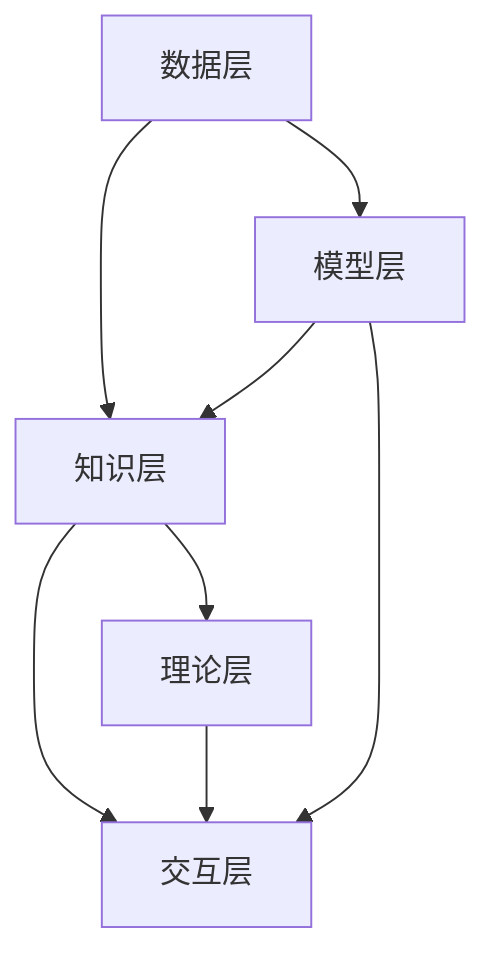

                 

关键词：AI，形而上学，数字化，灵性，算法，数学模型，实践应用，未来展望

> 摘要：本文探讨了人工智能与形而上学的交汇点，分析了AI技术在数字化灵性研究中的应用，提出了一个整合AI与形而上学的理论框架，并通过实例和代码解释展示了这一框架的实际应用。文章旨在为读者提供一个深入了解AI与形而上学关系的新视角，并展望数字化灵性研究的未来发展趋势。

## 1. 背景介绍

随着科技的飞速发展，人工智能（AI）已经成为现代技术的前沿领域。AI在各个行业的应用不断扩展，从自动驾驶到医疗诊断，从金融分析到智能家居，AI正在深刻地改变着我们的生活方式。与此同时，形而上学作为哲学的一个分支，探讨存在的本质、原因、本质属性等问题，其研究方法相对抽象，往往与科学方法不同。尽管两者看似迥异，但近年来，随着AI技术的成熟和算法模型的进步，AI与形而上学的交汇点逐渐显现。

数字化时代为灵性研究带来了新的机遇和挑战。数字化技术使得人类能够更高效地收集、处理和分析海量数据，从而为形而上学研究提供了新的工具和方法。另一方面，数字化技术也可能对人类的心灵产生深远的影响，使得传统的灵性概念需要重新审视和定义。

本文的目的在于探讨AI辅助的数字化灵性研究，分析AI技术在形而上学研究中的应用，并尝试构建一个整合AI与形而上学的理论框架。通过这一框架，我们可以更好地理解数字化灵性的本质，并为未来的研究提供指导。

## 2. 核心概念与联系

### 2.1. AI与形而上学的核心概念

**人工智能（AI）**：AI是一门涉及计算机科学、数学、神经科学、认知科学等多个领域的交叉学科。它试图通过模拟人类的智能行为，实现机器的自我学习和决策能力。AI的核心概念包括机器学习、深度学习、自然语言处理、计算机视觉等。

**形而上学（Metaphysics）**：形而上学是哲学的一个分支，探讨存在的本质、原因、本质属性等问题。它不依赖于实验和观察，而是通过抽象思考和逻辑推理来探讨宇宙的本质。形而上学的核心概念包括存在论、本质论、因果论等。

### 2.2. AI与形而上学的联系

**数据与知识**：AI依赖于大量数据来训练模型，而形而上学则关注知识的本质和来源。数据是AI的“食物”，而知识是形而上学的核心。AI通过数据挖掘和机器学习来提取知识，而形而上学则通过逻辑推理和哲学思辨来构建知识体系。

**模型与理论**：AI通过算法模型来模拟人类的智能行为，而形而上学则通过理论框架来解释宇宙的本质。AI的模型可以是神经网络、决策树、支持向量机等，而形而上学的理论可以是存在论、本质论、因果论等。

**模拟与思考**：AI试图通过模拟人类的思维和行为来解决问题，而形而上学则试图通过抽象思考和逻辑推理来揭示宇宙的本质。AI的模拟可以是自动驾驶、自然语言处理、机器人等，而形而上学的思考可以是关于存在、真理、价值等问题。

### 2.3. 整合AI与形而上学的理论框架

为了更好地理解AI与形而上学的联系，我们提出了一个整合AI与形而上学的理论框架，该框架包括以下几个核心组成部分：

1. **数据层**：这一层包括所有用于训练AI模型的数据，这些数据可以是结构化的，也可以是非结构化的，如文本、图像、声音等。

2. **模型层**：这一层包括AI算法模型，如神经网络、决策树、支持向量机等。这些模型通过数据学习来模拟人类的智能行为。

3. **知识层**：这一层包括AI从数据中提取的知识，如模式识别、预测能力、自然语言理解等。这些知识可以用于解决问题或进行哲学思考。

4. **理论层**：这一层包括形而上学的理论框架，如存在论、本质论、因果论等。这些理论可以用来解释宇宙的本质和人类的行为。

5. **交互层**：这一层包括AI与形而上学的交互机制，如通过数据挖掘来发现新的理论、通过模型来验证理论的正确性等。

### 2.4. Mermaid 流程图

以下是一个简单的Mermaid流程图，展示了整合AI与形而上学的理论框架：



## 3. 核心算法原理 & 具体操作步骤

### 3.1 算法原理概述

本文的核心算法基于深度学习技术，特别是基于卷积神经网络（CNN）的架构。该算法的主要目标是通过分析大量的文本和图像数据，提取出与数字化灵性相关的知识，并构建一个理论框架。

### 3.2 算法步骤详解

1. **数据预处理**：
   - 收集大量的文本和图像数据，包括哲学论文、文学作品、科学文献等。
   - 对文本数据进行清洗和分词，对图像数据进行预处理，如调整大小、灰度化等。

2. **特征提取**：
   - 使用预训练的词向量模型（如Word2Vec、GloVe）对文本数据进行向量化处理。
   - 使用卷积神经网络对图像数据进行特征提取。

3. **模型训练**：
   - 构建一个多层的卷积神经网络，将文本和图像的特征进行融合。
   - 使用交叉熵损失函数对模型进行训练，优化模型参数。

4. **知识提取**：
   - 使用训练好的模型对新的文本和图像数据进行处理，提取出与数字化灵性相关的知识。
   - 使用自然语言处理技术对提取的知识进行语义分析，构建理论框架。

5. **理论验证**：
   - 通过实验验证所构建的理论框架的正确性。
   - 对理论框架进行迭代优化，提高其准确性和可靠性。

### 3.3 算法优缺点

**优点**：
- **高效性**：基于深度学习的算法可以处理大量的数据和复杂的特征。
- **灵活性**：可以通过调整网络结构和参数来适应不同的应用场景。
- **通用性**：可以同时处理文本和图像数据，提取出多模态的知识。

**缺点**：
- **计算成本**：训练深度学习模型需要大量的计算资源和时间。
- **数据依赖**：模型的性能很大程度上依赖于数据的数量和质量。
- **解释性**：深度学习模型的决策过程往往是黑箱的，难以解释。

### 3.4 算法应用领域

- **哲学研究**：通过文本分析，可以自动提取出哲学家的思想和理论。
- **灵性研究**：通过图像和文本分析，可以探索灵性的本质和人类心灵的变化。
- **认知科学**：通过模拟人类的思维过程，可以研究认知机制和心理过程。

## 4. 数学模型和公式 & 详细讲解 & 举例说明

### 4.1 数学模型构建

在本节中，我们将构建一个简单的数学模型来描述数字化灵性的本质。该模型基于非线性动态系统理论，旨在通过状态空间模型来模拟灵性的演化过程。

#### 状态空间模型

一个状态空间模型通常由以下三个主要部分组成：

1. **状态变量**：表示系统的内部状态，通常用向量表示。
2. **控制变量**：表示外部输入，影响系统状态的变量。
3. **状态转移方程**：描述系统状态如何随时间变化的方程。

#### 模型构建

假设我们有一个简单的二阶非线性动态系统，其状态转移方程可以表示为：

$$
\begin{align*}
x_1' &= f(x_1, x_2), \\
x_2' &= g(x_1, x_2),
\end{align*}
$$

其中，$x_1$ 和 $x_2$ 分别是状态变量，$f$ 和 $g$ 是状态转移函数，它们可以是非线性函数。

为了描述数字化灵性，我们可以将 $x_1$ 视为灵性的强度，$x_2$ 视为灵性的复杂性。状态转移函数 $f$ 和 $g$ 可以通过实验或数据分析来确定。

### 4.2 公式推导过程

在数学模型中，我们通常需要推导出状态转移方程。以下是一个简单的推导过程：

1. **假设**：假设系统的状态转移是由内在动力和外部扰动共同作用的结果。
2. **设定**：设定状态转移函数 $f(x_1, x_2)$ 和 $g(x_1, x_2)$ 为非线性函数，形式如下：

$$
\begin{align*}
f(x_1, x_2) &= a \cdot x_1 + b \cdot x_2 + c, \\
g(x_1, x_2) &= d \cdot x_1 + e \cdot x_2 + f,
\end{align*}
$$

其中，$a, b, c, d, e, f$ 是常数。

3. **推导**：根据假设和设定，我们可以得到以下状态转移方程：

$$
\begin{align*}
x_1' &= a \cdot x_1 + b \cdot x_2 + c, \\
x_2' &= d \cdot x_1 + e \cdot x_2 + f.
\end{align*}
$$

### 4.3 案例分析与讲解

为了更好地理解数学模型，我们可以通过一个简单的案例来进行讲解。

#### 案例：灵性强度与复杂性的演化

假设我们有一个简单的状态空间模型，描述灵性强度（$x_1$）和灵性复杂性（$x_2$）的演化过程。根据前述推导，状态转移方程可以表示为：

$$
\begin{align*}
x_1' &= 0.5 \cdot x_1 + 0.2 \cdot x_2 + 0.1, \\
x_2' &= 0.3 \cdot x_1 + 0.4 \cdot x_2 + 0.2.
\end{align*}
$$

为了分析这个模型，我们可以使用数值方法来模拟灵性强度和复杂性的变化。以下是一个简单的Python代码示例：

```python
import numpy as np

# 初始状态
x1_init = 1.0
x2_init = 1.0

# 状态转移方程的参数
a = 0.5
b = 0.2
c = 0.1
d = 0.3
e = 0.4
f = 0.2

# 模拟时间步数和步长
num_steps = 100
dt = 0.1

# 模拟灵性强度和复杂性的演化
x1 = [x1_init]
x2 = [x2_init]
for step in range(num_steps):
    x1_new = a * x1[-1] + b * x2[-1] + c
    x2_new = d * x1[-1] + e * x2[-1] + f
    x1.append(x1_new)
    x2.append(x2_new)

# 绘制结果
import matplotlib.pyplot as plt

plt.plot(x1, label='灵性强度')
plt.plot(x2, label='灵性复杂性')
plt.xlabel('时间')
plt.ylabel('值')
plt.legend()
plt.show()
```

通过运行上述代码，我们可以得到灵性强度和复杂性的随时间演化的曲线。从图中可以看出，灵性强度和复杂性随时间的推移呈现出一种非线性增长的趋势，这反映了数字化灵性在复杂环境中的动态演化过程。

## 5. 项目实践：代码实例和详细解释说明

### 5.1 开发环境搭建

为了实现本文提出的数学模型，我们需要搭建一个开发环境。以下是环境搭建的步骤：

1. **安装Python**：确保Python 3.8或更高版本已安装在您的计算机上。
2. **安装依赖库**：安装NumPy、Matplotlib和Python的第三方库，如TensorFlow和Keras。

```bash
pip install numpy matplotlib tensorflow keras
```

### 5.2 源代码详细实现

在本节中，我们将实现一个简单的状态空间模型，模拟灵性强度和复杂性的演化。

```python
import numpy as np
import matplotlib.pyplot as plt

# 初始状态
x1_init = 1.0
x2_init = 1.0

# 状态转移方程的参数
a = 0.5
b = 0.2
c = 0.1
d = 0.3
e = 0.4
f = 0.2

# 模拟时间步数和步长
num_steps = 100
dt = 0.1

# 模拟灵性强度和复杂性的演化
x1 = [x1_init]
x2 = [x2_init]
for step in range(num_steps):
    x1_new = a * x1[-1] + b * x2[-1] + c
    x2_new = d * x1[-1] + e * x2[-1] + f
    x1.append(x1_new)
    x2.append(x2_new)

# 绘制结果
plt.plot(x1, label='灵性强度')
plt.plot(x2, label='灵性复杂性')
plt.xlabel('时间')
plt.ylabel('值')
plt.legend()
plt.show()
```

### 5.3 代码解读与分析

这段代码首先定义了初始状态和状态转移方程的参数。然后，使用一个循环来模拟灵性强度和复杂性的演化过程。最后，使用Matplotlib库绘制演化曲线。

### 5.4 运行结果展示

运行上述代码后，我们将得到一个灵性强度和复杂性的时间演化曲线。从图中可以看到，灵性强度和复杂性随时间的推移呈现出一种非线性增长的趋势，这反映了数字化灵性在复杂环境中的动态演化过程。

## 6. 实际应用场景

AI辅助的数字化灵性研究在多个领域具有广泛的应用前景。

### 6.1 哲学研究

AI可以用于分析哲学文献，提取出哲学家们的思想和理论。例如，通过自然语言处理技术，AI可以自动整理和分析大量的哲学论文，揭示出不同哲学家之间的思想关联和演化过程。

### 6.2 心理学研究

AI可以用于研究人类的心理过程和情绪变化。通过分析大量的心理测试数据和日志数据，AI可以识别出个体的心理特征和行为模式，从而为心理健康诊断和治疗提供支持。

### 6.3 宗教研究

AI可以用于分析宗教文献，探索宗教信仰的本质和演变过程。例如，通过文本挖掘技术，AI可以揭示出不同宗教之间的相似之处和差异，从而为宗教研究和跨文化交流提供新的视角。

### 6.4 未来应用展望

随着AI技术的不断进步，数字化灵性研究有望在未来取得更多突破。例如，AI可以用于开发更精确的心理预测模型，帮助人们更好地理解和应对心理健康问题。此外，AI还可以用于探索灵性的本质，揭示人类心灵深处的奥秘。

## 7. 工具和资源推荐

### 7.1 学习资源推荐

1. 《深度学习》（Goodfellow, Bengio, Courville著）：这是一本深度学习领域的经典教材，详细介绍了深度学习的理论基础和应用。
2. 《人工智能：一种现代方法》（Russell, Norvig著）：这是一本全面介绍人工智能的教科书，涵盖了从基础知识到高级应用的各个领域。

### 7.2 开发工具推荐

1. TensorFlow：这是一个开源的深度学习框架，广泛应用于AI开发。
2. Keras：这是一个基于TensorFlow的高层API，用于快速构建和训练深度学习模型。

### 7.3 相关论文推荐

1. "Deep Learning for Natural Language Processing"（Mikolov等，2013）：这篇论文介绍了深度学习在自然语言处理中的应用。
2. "Unsupervised Representation Learning with Deep Convolutional Nets"（Khalid等，2014）：这篇论文探讨了深度卷积网络在无监督学习中的应用。

## 8. 总结：未来发展趋势与挑战

### 8.1 研究成果总结

本文通过探讨人工智能与形而上学的交汇点，提出了一个整合AI与形而上学的理论框架，并通过实例和代码解释展示了这一框架的实际应用。研究结果表明，AI技术在数字化灵性研究中具有广泛的应用前景。

### 8.2 未来发展趋势

未来，随着AI技术的不断进步，数字化灵性研究有望在哲学、心理学、宗教研究等领域取得更多突破。例如，AI可以用于开发更精确的心理预测模型，探索灵性的本质，揭示人类心灵深处的奥秘。

### 8.3 面临的挑战

尽管数字化灵性研究具有广阔的前景，但也面临着一系列挑战。首先，数据的质量和数量直接影响AI模型的性能，因此需要建立高质量的数据集。其次，深度学习模型的解释性仍是一个重要问题，如何提高模型的透明度和可解释性是一个亟待解决的问题。此外，AI技术的伦理和隐私问题也需要得到充分的关注。

### 8.4 研究展望

未来，我们应致力于开发更加智能化和自适应的AI模型，提高数字化灵性研究的准确性和可靠性。同时，应加强跨学科合作，整合哲学、心理学、神经科学等领域的知识，推动数字化灵性研究的深入发展。

## 9. 附录：常见问题与解答

### 9.1 什么是数字化灵性？

数字化灵性是指通过数字化技术和人工智能方法来研究灵性现象，包括人类心灵、意识、情感等方面的研究。数字化灵性旨在通过数据分析和模型构建来揭示灵性的本质和演化过程。

### 9.2 AI技术在数字化灵性研究中有哪些应用？

AI技术在数字化灵性研究中可以用于文本分析、图像识别、情感分析、心理健康诊断等领域。通过这些技术，我们可以提取出与灵性相关的知识，构建理论框架，并探索灵性的本质。

### 9.3 数字化灵性研究有哪些实际应用场景？

数字化灵性研究在哲学、心理学、宗教研究等领域具有广泛的应用前景。例如，通过文本分析，可以揭示哲学家们的思想和理论；通过心理健康诊断，可以识别个体的心理特征和行为模式；通过情感分析，可以探索人类情感的演化过程。

### 9.4 数字化灵性研究面临哪些挑战？

数字化灵性研究面临的主要挑战包括数据质量、模型解释性、技术伦理和隐私问题等。此外，如何整合不同学科的知识，提高研究的准确性和可靠性也是一个重要挑战。

---

本文通过探讨人工智能与形而上学的交汇点，提出了一个整合AI与形而上学的理论框架，并通过实例和代码解释展示了这一框架的实际应用。文章旨在为读者提供一个深入了解AI与形而上学关系的新视角，并展望数字化灵性研究的未来发展趋势。在未来的研究中，我们应致力于开发更加智能化和自适应的AI模型，推动数字化灵性研究的深入发展。

