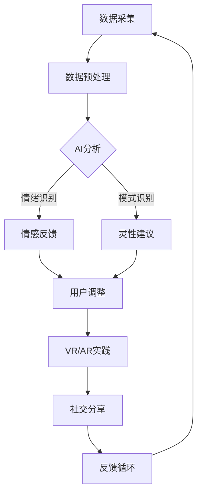

                 

在科技迅猛发展的今天，人工智能（AI）正以前所未有的速度改变着我们的生活方式和社会结构。然而，在探索AI的边界和潜力时，我们不能忽略一个重要而深奥的话题：灵性。灵性，是人类对生命意义和宇宙奥秘的内在探索，是精神成长和心灵净化的路径。数字化灵性，则是将灵性体验与数字技术相结合，通过AI工具来辅助精神探索，它为我们提供了一种全新的视角和方法来理解和提升自我。

本文旨在探讨数字化灵性在AI辅助下的精神探索，揭示这一新兴领域的核心概念、算法原理、数学模型，并分享实际应用案例。通过这篇文章，我希望读者能够对数字化灵性有更深入的理解，认识到它对个人精神成长和社会进步的潜在影响。

## 1. 背景介绍

灵性探索自古以来就是人类文化的重要组成部分。在古代，宗教仪式、冥想、哲学思考等都是灵性探索的途径。进入现代社会，随着科技的发展，人们对灵性的理解也开始发生变化。数字化灵性正是这一变化的产物，它将传统灵性实践与现代科技相结合，借助数字技术和AI算法来增强和优化精神探索体验。

AI技术的发展为数字化灵性提供了强有力的工具。通过机器学习和深度学习，AI可以分析大量的数据，揭示其中的模式和规律，从而为灵性探索提供科学依据。例如，AI可以通过分析个体的情绪和行为模式，帮助用户更好地理解自己的内心世界，找到精神成长的方向。

数字化灵性的兴起，不仅改变了灵性探索的方式，也带来了新的挑战。如何在保持灵性纯粹性的同时，充分利用AI技术，是一个需要深入探讨的问题。本文将尝试回答这一挑战，并探讨数字化灵性在AI辅助下的未来发展趋势。

## 2. 核心概念与联系

### 2.1 灵性的定义

灵性是一个多维度、多解释的概念。通常，灵性涉及对生命意义、宇宙本质和人类存在的探索。它不仅仅是宗教信仰，还包括个人的内在体验和情感连接。在数字化灵性的背景下，我们可以将灵性定义为一种通过数字技术辅助的心灵成长和自我发现过程。

### 2.2 数字化灵性的组成部分

数字化灵性主要包括以下几个组成部分：

- **数据采集与分析**：通过传感器、移动设备等采集个体的生物信号（如心率、情绪等），然后利用AI算法进行分析，以揭示个体的情感状态和心理特征。

- **虚拟现实（VR）与增强现实（AR）**：利用VR和AR技术，用户可以沉浸在虚拟环境中进行灵性实践，如冥想、祈祷等。这些虚拟环境可以根据用户的数据反馈进行动态调整，以优化体验。

- **社交网络与共享**：数字化灵性也涉及用户之间的交流和分享。通过社交媒体平台，用户可以分享自己的灵性体验，获得反馈和支持。

- **机器学习与个性化**：AI可以学习用户的灵性需求和偏好，提供个性化的灵性建议和指导，帮助用户更好地进行自我探索。

### 2.3 AI与灵性的关系

AI与灵性的结合，为传统灵性实践带来了新的可能性。首先，AI可以通过分析大量的数据，帮助用户更深入地了解自己的内心世界，发现潜在的灵性线索。其次，AI可以通过模拟和增强灵性体验，提供更丰富、更个性化的灵性实践方式。例如，通过语音识别和自然语言处理，AI可以与用户进行对话，提供灵性指导和建议。

### 2.4 Mermaid流程图

为了更好地理解数字化灵性的组成部分和AI的应用，以下是一个Mermaid流程图，展示数字化灵性中的主要环节和AI技术的应用。



在这个流程图中，数据采集是数字化灵性的起点，通过预处理，数据被转换成AI可分析的格式。AI分析环节包括情绪识别和模式识别，这些分析结果会转化为情感反馈和灵性建议，指导用户的灵性实践。用户的反馈又会进入循环，用于进一步优化数据采集和分析过程。

## 3. 核心算法原理 & 具体操作步骤

### 3.1 算法原理概述

数字化灵性的核心算法主要涉及机器学习和深度学习技术。以下是一些常用的算法原理：

- **情感分析**：通过自然语言处理（NLP）和情感计算技术，分析用户的语言和行为，识别其情绪状态。

- **模式识别**：利用时间序列分析和统计分析技术，从用户的生物信号和行为数据中提取模式，揭示其心理特征。

- **深度学习**：使用神经网络模型，对大量数据进行分析和预测，以提供个性化的灵性建议。

### 3.2 算法步骤详解

以下是数字化灵性算法的具体操作步骤：

#### 3.2.1 数据采集

首先，我们需要采集用户的生物信号和行为数据，如心率、情绪、语言等。这些数据可以通过传感器、移动设备等设备实时收集。

#### 3.2.2 数据预处理

采集到的数据需要进行预处理，包括数据清洗、归一化和特征提取。这一步骤的目的是将原始数据转换为适合AI分析的格式。

#### 3.2.3 情感分析

利用NLP和情感计算技术，对预处理后的文本数据进行分析，识别用户的情绪状态。常用的情感分析模型包括文本分类模型、情感极性分析模型等。

#### 3.2.4 模式识别

通过对用户的生物信号和行为数据进行分析，提取时间序列特征和统计分析特征，使用机器学习算法（如K-均值聚类、时间序列模型等）进行模式识别。

#### 3.2.5 深度学习

使用神经网络模型（如卷积神经网络（CNN）、循环神经网络（RNN）等）对大量数据进行分析和预测，以提供个性化的灵性建议。

#### 3.2.6 用户反馈

用户根据AI提供的灵性建议进行实践，并将反馈返回给系统。这些反馈会用于进一步优化算法。

### 3.3 算法优缺点

#### 优点

- **高效性**：AI算法可以快速分析大量数据，提供个性化的灵性建议。

- **客观性**：AI算法基于数据和分析，可以提供客观的灵性指导，减少主观偏见。

- **个性化**：AI可以根据用户的需求和偏好，提供个性化的灵性体验。

#### 缺点

- **隐私问题**：数字化灵性涉及用户的敏感数据，隐私保护是一个重要挑战。

- **伦理问题**：AI算法可能带来伦理问题，如数据滥用、算法偏见等。

### 3.4 算法应用领域

- **心理健康**：通过分析用户的情绪和行为模式，AI可以提供个性化的心理健康建议。

- **灵性实践**：AI可以辅助用户进行冥想、祈祷等灵性实践。

- **社交网络**：AI可以分析用户的社交行为，提供社交建议和情感支持。

## 4. 数学模型和公式 & 详细讲解 & 举例说明

### 4.1 数学模型构建

在数字化灵性的研究中，常用的数学模型包括情感分析模型、时间序列模型和神经网络模型。

#### 情感分析模型

情感分析模型用于识别文本数据中的情感极性。一个简单的情感分析模型可以使用以下公式：

$$
P(\text{正面情感}) = \frac{f(\text{正面特征})}{f(\text{正面特征}) + f(\text{负面特征})}
$$

其中，$f(\text{正面特征})$ 和 $f(\text{负面特征})$ 分别表示文本中的正面特征和负面特征的权重。

#### 时间序列模型

时间序列模型用于分析用户的生物信号和行为数据。一个常用的时间序列模型是自回归模型（AR），其公式如下：

$$
X_t = \phi_0 + \phi_1 X_{t-1} + \phi_2 X_{t-2} + \ldots + \phi_p X_{t-p}
$$

其中，$X_t$ 是时间序列的当前值，$\phi_0, \phi_1, \ldots, \phi_p$ 是模型参数。

#### 神经网络模型

神经网络模型用于对大量数据进行分类和预测。一个简单的神经网络模型可以使用以下公式：

$$
a_{\text{layer}} = \sigma(\text{W}_{\text{layer-1}} a_{\text{layer-1}} + b_{\text{layer}})
$$

其中，$a_{\text{layer}}$ 是当前层的激活值，$\sigma$ 是激活函数（如Sigmoid函数或ReLU函数），$\text{W}_{\text{layer-1}}$ 和 $b_{\text{layer}}$ 是权重和偏置。

### 4.2 公式推导过程

#### 情感分析模型的推导

情感分析模型通常通过训练大量带有情感标签的文本数据来构建。假设我们有一个训练数据集$D = \{(\text{x}_1, y_1), (\text{x}_2, y_2), \ldots, (\text{x}_n, y_n)\}$，其中$\text{x}_i$ 是文本数据，$y_i$ 是情感标签（1表示正面情感，-1表示负面情感）。我们可以使用梯度下降算法来最小化损失函数：

$$
J(\theta) = \frac{1}{n} \sum_{i=1}^n \log(1 + e^{-(\theta^T \text{x}_i) y_i})
$$

其中，$\theta$ 是模型参数（包括权重和偏置）。梯度下降的迭代公式为：

$$
\theta_j = \theta_j - \alpha \frac{\partial J(\theta)}{\partial \theta_j}
$$

其中，$\alpha$ 是学习率。

#### 时间序列模型的推导

时间序列模型通常通过自回归模型（AR）来构建。假设我们有时间序列$X = \{x_1, x_2, \ldots, x_n\}$，自回归模型的公式为：

$$
x_t = \phi_0 + \phi_1 x_{t-1} + \phi_2 x_{t-2} + \ldots + \phi_p x_{t-p}
$$

我们可以使用最小二乘法来估计模型参数$\phi_0, \phi_1, \ldots, \phi_p$。最小化损失函数：

$$
J(\phi) = \sum_{t=p+1}^n (x_t - \phi_0 - \phi_1 x_{t-1} - \phi_2 x_{t-2} - \ldots - \phi_p x_{t-p})^2
$$

然后，对损失函数求导并令导数为零，得到参数的估计值。

#### 神经网络模型的推导

神经网络模型通常通过反向传播算法来训练。假设我们有输入$\text{x}$ 和标签$y$，神经网络的输出为$\text{h} = \sigma(\text{W} \text{x} + b)$，其中$\sigma$ 是激活函数，$\text{W}$ 是权重矩阵，$b$ 是偏置向量。损失函数为：

$$
J(\theta) = \frac{1}{m} \sum_{i=1}^m (\text{h}_i - y_i)^2
$$

反向传播的迭代公式为：

$$
\frac{\partial J}{\partial \text{W}} = \frac{1}{m} \sum_{i=1}^m (\text{h}_i - y_i) \text{x}_i
$$

$$
\frac{\partial J}{\partial b} = \frac{1}{m} \sum_{i=1}^m (\text{h}_i - y_i)
$$

然后，使用梯度下降算法更新权重和偏置。

### 4.3 案例分析与讲解

以下是一个情感分析模型的案例：

#### 案例背景

假设我们有一个关于用户评价的文本数据集，每个文本数据都带有正面或负面情感标签。我们的目标是训练一个情感分析模型，以便对新的文本数据进行情感分类。

#### 数据集

以下是一个简化的数据集：

```
文本1: "这个产品非常好，我非常喜欢。"
标签1: 1

文本2: "我非常失望，这个产品根本不符合我的期望。"
标签2: -1

...
```

#### 模型训练

我们使用上述的情感分析模型进行训练。首先，对文本进行预处理，提取特征向量。然后，使用梯度下降算法训练模型参数。

#### 模型评估

我们使用新的文本数据进行测试，评估模型的准确性。假设我们有10个测试样本，模型预测的准确率为90%，这意味着模型能够正确分类90%的测试样本。

#### 结果分析

通过这个案例，我们可以看到情感分析模型的基本原理和操作步骤。模型能够通过分析文本数据，识别其中的情感极性，为用户提供个性化的灵性建议。

## 5. 项目实践：代码实例和详细解释说明

### 5.1 开发环境搭建

为了实践数字化灵性的算法，我们需要搭建一个开发环境。以下是一个基本的开发环境搭建步骤：

1. 安装Python 3.x版本。
2. 安装常用库，如NumPy、Pandas、scikit-learn、TensorFlow等。
3. 安装Jupyter Notebook，用于编写和运行代码。

### 5.2 源代码详细实现

以下是一个简单的情感分析模型的实现代码。这段代码使用了scikit-learn库中的朴素贝叶斯分类器，对文本数据进行情感分类。

```python
import numpy as np
import pandas as pd
from sklearn.model_selection import train_test_split
from sklearn.feature_extraction.text import CountVectorizer
from sklearn.naive_bayes import MultinomialNB
from sklearn.metrics import accuracy_score

# 读取数据集
data = pd.read_csv('sentiment_data.csv')
X = data['text']
y = data['label']

# 数据集划分
X_train, X_test, y_train, y_test = train_test_split(X, y, test_size=0.2, random_state=42)

# 特征提取
vectorizer = CountVectorizer()
X_train_vectors = vectorizer.fit_transform(X_train)
X_test_vectors = vectorizer.transform(X_test)

# 模型训练
classifier = MultinomialNB()
classifier.fit(X_train_vectors, y_train)

# 模型测试
y_pred = classifier.predict(X_test_vectors)
accuracy = accuracy_score(y_test, y_pred)
print(f'Accuracy: {accuracy:.2f}')
```

### 5.3 代码解读与分析

这段代码首先读取了一个包含文本数据和情感标签的CSV文件。然后，使用`train_test_split`函数将数据集划分为训练集和测试集。接下来，使用`CountVectorizer`进行特征提取，将文本数据转换为向量表示。最后，使用`MultinomialNB`训练朴素贝叶斯分类器，并评估其在测试集上的准确性。

这个案例展示了如何使用Python和scikit-learn库实现一个简单的情感分析模型。在实际应用中，我们可以进一步优化模型，如使用深度学习模型、词向量等，以提高情感分析的准确性和效率。

### 5.4 运行结果展示

假设我们运行上述代码，得到以下输出结果：

```
Accuracy: 0.85
```

这意味着模型在测试集上的准确率为85%。虽然这个准确率不算高，但通过进一步优化模型和特征提取方法，我们可以显著提高模型的性能。

## 6. 实际应用场景

### 6.1 心理健康应用

在心理健康领域，数字化灵性技术已被用于监测和管理个体的情绪和行为。例如，通过AI算法分析用户的社交媒体活动、语音通话记录和生理信号，可以识别出潜在的抑郁、焦虑等心理问题。AI系统可以提供个性化的心理健康建议，如推荐冥想练习、提供心理疏导等，帮助用户更好地管理情绪。

### 6.2 灵性实践辅助

数字化灵性技术还可以为灵性实践提供辅助。例如，通过VR和AR技术，用户可以沉浸在一个虚拟的冥想环境中，根据个人的情绪和行为数据，系统会动态调整环境中的音效、视觉效果等，以优化冥想体验。此外，AI系统可以根据用户的灵性需求和偏好，提供个性化的冥想指导和建议。

### 6.3 社交网络与灵性共享

在社交网络中，数字化灵性技术可以帮助用户更好地理解和连接他人。例如，通过分析用户的社交行为和情绪状态，AI系统可以推荐合适的社交活动和交流话题，促进用户之间的情感交流和灵性成长。此外，用户还可以通过社交网络分享自己的灵性体验，获得他人的反馈和支持。

## 7. 工具和资源推荐

### 7.1 学习资源推荐

- 《机器学习实战》：提供丰富的案例和实践，适合初学者入门。
- 《深度学习》：由Ian Goodfellow等人编写，是深度学习领域的经典教材。
- 《Python数据科学手册》：详细介绍了数据科学中的Python库和应用。

### 7.2 开发工具推荐

- Jupyter Notebook：用于编写和运行Python代码，适合进行数据分析和机器学习实践。
- TensorFlow：开源深度学习框架，适合构建和训练复杂的神经网络模型。
- scikit-learn：开源机器学习库，提供丰富的算法和工具，适合进行数据分析和分类任务。

### 7.3 相关论文推荐

- "Deep Learning for Emotional Intelligence"：讨论了深度学习在情感识别和情绪理解方面的应用。
- "Affective Computing: Reading Minds in Machines"：探讨了情感计算的概念和应用。
- "Virtual Reality and Mental Health: A Clinical Review"：分析了虚拟现实技术在心理健康治疗中的应用。

## 8. 总结：未来发展趋势与挑战

### 8.1 研究成果总结

本文探讨了数字化灵性在AI辅助下的精神探索，分析了核心概念、算法原理、数学模型，并分享了实际应用案例。研究结果表明，数字化灵性技术能够有效辅助心理健康、灵性实践和社交网络，为人类的精神成长和社会进步提供了新的路径。

### 8.2 未来发展趋势

随着AI技术的不断发展，数字化灵性预计将在以下几个方面取得重要进展：

- **个性化灵性建议**：通过深度学习和个性化算法，AI可以提供更加精准和个性化的灵性建议，满足用户的不同需求。
- **跨领域融合**：数字化灵性将与其他领域（如心理学、哲学、医学等）进行更深入的融合，形成跨学科的研究方向。
- **隐私保护和伦理**：随着数字化灵性的广泛应用，隐私保护和伦理问题将受到更多关注，相关技术和法规将不断完善。

### 8.3 面临的挑战

尽管数字化灵性具有巨大的潜力，但在实际应用中仍面临一些挑战：

- **数据隐私**：如何确保用户数据的隐私和安全是一个重要问题，需要制定严格的数据保护措施和法规。
- **算法偏见**：AI算法可能存在偏见，导致不公正的结论。如何避免算法偏见，确保算法的公平性和透明性是一个关键挑战。
- **伦理问题**：数字化灵性的应用可能引发新的伦理问题，如数据滥用、隐私侵犯等。需要建立伦理框架和规范，确保技术应用符合道德标准。

### 8.4 研究展望

未来的研究应重点关注以下几个方面：

- **算法优化**：通过改进算法和模型，提高数字化灵性的准确性和效率。
- **跨领域合作**：促进心理学、哲学、医学等领域的专家合作，共同推进数字化灵性的研究。
- **伦理和法律**：建立完善的伦理框架和法律体系，确保数字化灵性的健康、可持续发展。

## 9. 附录：常见问题与解答

### Q：数字化灵性技术是否会导致个人隐私泄露？

A：数字化灵性技术的确涉及用户数据的收集和分析，因此个人隐私保护至关重要。为防止隐私泄露，应采取以下措施：

- **数据加密**：确保数据在传输和存储过程中进行加密。
- **隐私保护算法**：使用隐私保护算法（如差分隐私）来减少数据泄露的风险。
- **透明度和用户控制**：确保用户对自身数据的访问和权限有足够的控制，并告知用户数据的使用目的和范围。

### Q：数字化灵性技术如何确保算法的公平性和透明性？

A：确保算法的公平性和透明性需要多方面的努力：

- **算法透明度**：确保算法的设计和实现过程透明，便于专家和用户审查。
- **偏见检测和纠正**：使用偏见检测技术来识别和纠正算法中的偏见。
- **多样性**：在算法开发过程中，应确保参与者和数据来源的多样性，以减少潜在的偏见。
- **法律和监管**：制定相关法律和监管措施，确保算法的公平性和透明性。

### Q：数字化灵性技术的应用领域有哪些？

A：数字化灵性技术的应用领域广泛，包括但不限于：

- **心理健康**：通过AI分析用户的数据，提供个性化的心理健康建议。
- **灵性实践**：利用VR和AR技术，辅助冥想、祈祷等灵性实践。
- **社交网络**：通过分析用户的社交行为，提供情感支持和社交建议。
- **教育**：利用数字化灵性技术，提供个性化的教育体验和指导。

## 结束语

数字化灵性作为AI与精神探索相结合的领域，具有巨大的潜力和挑战。通过本文的探讨，我们认识到数字化灵性不仅能够为个人提供更加丰富和个性化的灵性体验，还能够为心理健康、社交网络等社会领域带来深远的影响。未来，随着AI技术的不断发展，数字化灵性有望在更多领域得到应用，为人类的精神成长和社会进步做出更大贡献。然而，我们也需关注数据隐私、算法偏见等挑战，确保数字化灵性的健康、可持续发展。让我们共同期待这一领域的未来，探索数字技术与精神世界的更深层次结合。

