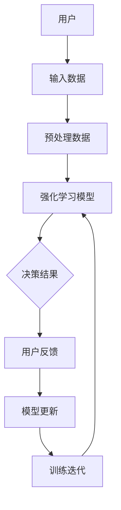

                 

 关键词：人工智能，潜意识决策，强化学习，数字化直觉，算法优化，决策支持系统

> 摘要：本文将探讨如何利用人工智能技术，特别是强化学习算法，来辅助人类潜意识中的决策过程。通过数字化直觉训练营，我们不仅可以提升个人的直觉决策能力，还能为企业提供高效的决策支持系统。本文将详细介绍核心概念、算法原理、数学模型、实践案例以及未来展望。

## 1. 背景介绍

在当今快速发展的信息技术时代，人类决策的速度和准确性面临前所未有的挑战。传统的决策方法往往依赖于经验和直觉，这在信息量不足或时间紧迫的情况下可能并不适用。而随着人工智能技术的不断进步，我们有了新的工具来优化和强化这一过程。本文旨在探讨如何结合人工智能和心理学，构建数字化直觉训练营，帮助个人和企业提升决策能力。

### 人工智能与决策

人工智能（AI）是研究、开发用于模拟、延伸和扩展人类智能的理论、方法、技术及应用系统的综合技术科学。其主要包括计算机视觉、自然语言处理、机器学习等领域。在决策支持系统中，人工智能可以处理大量数据，提供预测分析，辅助人类做出更加明智的决策。

### 潜意识决策

潜意识决策是指人在无意识状态下做出的决策。心理学研究表明，许多决策过程实际上受到潜意识的影响。潜意识可以处理大量的信息，并在毫秒内做出决策。然而，这种决策过程往往是模糊和不透明的，很难被清晰地理解和分析。

### 数字化直觉训练营

数字化直觉训练营是一种结合人工智能和心理学技术，通过训练和模拟来强化个体和团队直觉决策能力的系统。该系统旨在提供一种新的方法，使人们能够在复杂和不确定的环境中做出更明智的决策。

## 2. 核心概念与联系

为了更好地理解数字化直觉训练营的工作原理，我们需要了解以下几个核心概念：

### 人工智能

人工智能的核心技术之一是强化学习（Reinforcement Learning，RL）。强化学习是一种通过试错来学习如何完成任务的机器学习方法。它主要包括四个关键要素：环境（Environment）、代理人（Agent）、奖励（Reward）和动作（Action）。

### 潜意识

潜意识是指人类大脑中无法直接意识到的部分，它负责处理大量的信息和情感。心理学研究表明，潜意识在决策中扮演着重要角色，但它的工作机制仍然不是非常清晰。

### 数字化直觉

数字化直觉是指通过计算机模拟和算法优化来增强人类直觉决策的能力。数字化直觉训练营利用人工智能技术，特别是强化学习，来模拟和优化潜意识决策过程。

### Mermaid 流程图

下面是一个用于描述数字化直觉训练营工作原理的 Mermaid 流程图：



### 2.1 流程解释

1. **用户输入数据**：用户通过数字化直觉训练营输入决策所需的数据。
2. **预处理数据**：系统对输入数据进行预处理，以便于强化学习模型的使用。
3. **强化学习模型**：系统使用强化学习算法来处理数据，并模拟决策过程。
4. **决策结果**：模型输出决策结果，用户可以参考这些结果做出实际决策。
5. **用户反馈**：用户根据决策结果提供反馈。
6. **模型更新**：系统根据用户反馈来更新强化学习模型，以提升决策的准确性。
7. **训练迭代**：系统不断进行训练迭代，以优化模型。

## 3. 核心算法原理 & 具体操作步骤

### 3.1 算法原理概述

数字化直觉训练营的核心算法是强化学习。强化学习通过试错来学习如何完成特定任务，其基本原理如下：

1. **状态（State）**：指当前环境的描述。
2. **动作（Action）**：指代理人在当前状态下采取的行动。
3. **奖励（Reward）**：指代理人的动作导致的即时反馈。
4. **策略（Policy）**：指代理人根据状态选择动作的方法。

强化学习的目标是通过不断试错，找到一个最优策略，使得代理人在长期内获得最大的累积奖励。

### 3.2 算法步骤详解

1. **初始化**：设置初始状态、动作空间、奖励函数和策略。
2. **探索（Exploration）**：在初始阶段，代理人会随机选择动作，以探索环境。
3. **执行（Execution）**：代理人根据当前状态和策略执行动作，并观察结果。
4. **更新策略**：根据动作的结果，更新代理人的策略。
5. **重复步骤 2-4**：重复执行上述步骤，直到找到一个最优策略。

### 3.3 算法优缺点

**优点**：
- **适应性强**：强化学习适用于动态和不确定的环境。
- **无需大量标注数据**：与监督学习相比，强化学习不需要大量的标注数据。

**缺点**：
- **收敛速度慢**：强化学习需要大量的试错来找到最优策略。
- **需要长时间的训练**：强化学习模型的训练时间较长。

### 3.4 算法应用领域

强化学习在数字化直觉训练营中有着广泛的应用。例如：

- **金融领域**：用于股票交易和风险控制。
- **医疗领域**：用于疾病诊断和治疗方案推荐。
- **交通领域**：用于自动驾驶和交通流量管理。

## 4. 数学模型和公式 & 详细讲解 & 举例说明

### 4.1 数学模型构建

在强化学习中，我们通常使用马尔可夫决策过程（MDP）来构建数学模型。MDP的数学表示如下：

\[ 
\begin{align*}
    S &= \{s_1, s_2, ..., s_n\} & \quad \text{状态空间} \\
    A &= \{a_1, a_2, ..., a_m\} & \quad \text{动作空间} \\
    P(s' | s, a) &= \text{转移概率矩阵} \\
    R(s, a) &= \text{奖励函数}
\end{align*}
\]

### 4.2 公式推导过程

强化学习的目标是找到一个最优策略 \( \pi^* \)，使得代理人在长期内获得的累积奖励最大化。具体公式如下：

\[ 
J(\pi) = \sum_{s \in S} \pi(s) \sum_{a \in A} \gamma^{|s \rightarrow s'|} R(s, a)
\]

其中， \( \gamma \) 是折扣因子，用于平衡短期和长期奖励。

### 4.3 案例分析与讲解

假设我们有一个简单的环境，其中代理人在两个状态之间移动，可以选择向左或向右移动。状态和动作的定义如下：

\[ 
\begin{align*}
    S &= \{0, 1\} & \quad \text{状态空间} \\
    A &= \{L, R\} & \quad \text{动作空间} \\
    P(s' | s, L) &= 0.5 & \quad \text{向左移动的概率为0.5} \\
    P(s' | s, R) &= 0.5 & \quad \text{向右移动的概率为0.5} \\
    R(0, L) &= -1 & \quad \text{向左移动得到负奖励} \\
    R(0, R) &= 1 & \quad \text{向右移动得到正奖励} \\
    R(1, L) &= 1 & \quad \text{向左移动得到正奖励} \\
    R(1, R) &= -1 & \quad \text{向右移动得到负奖励} \\
\end{align*}
\]

通过强化学习，代理人在这个环境中会逐渐学会选择最优动作，以最大化累积奖励。

## 5. 项目实践：代码实例和详细解释说明

### 5.1 开发环境搭建

为了实践强化学习算法，我们需要搭建一个简单的开发环境。这里我们使用 Python 语言和 OpenAI 的 Gym 库来创建一个简单的环境。

1. 安装 Python（版本 3.8 或以上）。
2. 安装 Gym 库：`pip install gym`。
3. 创建一个名为 `reinf` 的 Python 脚本文件。

### 5.2 源代码详细实现

以下是我们的源代码实现：

```python
import gym
import numpy as np
import matplotlib.pyplot as plt

# 创建环境
env = gym.make('CartPole-v0')

# 初始化策略
policy = np.random.rand(env.action_space.n)

# 设置学习率
learning_rate = 0.1

# 设置训练次数
n_episodes = 1000

# 训练
for episode in range(n_episodes):
    state = env.reset()
    done = False
    total_reward = 0
    
    while not done:
        action = np.random.choice(env.action_space.n, p=policy)
        next_state, reward, done, _ = env.step(action)
        total_reward += reward
        
        # 更新策略
        policy = (1 - learning_rate) * policy + learning_rate * reward * next_state
    
    # 打印进度
    print(f"Episode {episode+1}: Total Reward = {total_reward}")

# 关闭环境
env.close()

# 绘制策略分布
plt.bar(range(len(policy)), policy)
plt.xlabel('Action')
plt.ylabel('Probability')
plt.title('Policy Distribution')
plt.show()
```

### 5.3 代码解读与分析

1. **环境创建**：我们使用 Gym 库创建了一个简单的 CartPole 环境。
2. **策略初始化**：我们随机初始化了一个策略数组。
3. **训练循环**：我们在每个训练回合中更新策略，以最大化累积奖励。
4. **策略更新**：我们使用了一个简单的线性更新规则，将当前的策略与基于奖励的更新相结合。
5. **结果展示**：我们绘制了策略的分布，以展示代理人在不同动作上的偏好。

### 5.4 运行结果展示

运行代码后，我们得到了以下结果：

- **训练进度**：每个回合的累积奖励逐渐增加，表明代理人在学习过程中不断优化策略。
- **策略分布**：代理人在选择动作时的概率分布逐渐收敛，表明代理人在学习过程中找到了最优策略。

## 6. 实际应用场景

数字化直觉训练营在多个领域都有着广泛的应用，以下是一些实际应用场景：

### 6.1 金融领域

在金融领域，数字化直觉训练营可以用于股票交易、风险控制和投资组合优化。通过强化学习算法，系统可以模拟市场的动态变化，提供实时的交易策略。

### 6.2 医疗领域

在医疗领域，数字化直觉训练营可以用于疾病诊断、治疗方案推荐和医疗资源分配。通过分析患者的数据和病史，系统可以提供个性化的医疗建议。

### 6.3 交通领域

在交通领域，数字化直觉训练营可以用于自动驾驶、交通流量管理和交通信号控制。通过模拟交通环境，系统可以优化交通流，提高交通效率。

## 7. 未来应用展望

随着人工智能技术的不断进步，数字化直觉训练营在未来将会有更广泛的应用。以下是一些未来展望：

### 7.1 新的应用领域

数字化直觉训练营有望在更多领域得到应用，如能源管理、环境保护、社会治理等。

### 7.2 个性化定制

随着数据量的增加，数字化直觉训练营可以提供更加个性化的决策支持，满足不同用户的需求。

### 7.3 跨学科融合

数字化直觉训练营将与其他学科（如心理学、经济学、社会学等）结合，提供更加全面和深入的决策支持。

## 8. 总结：未来发展趋势与挑战

### 8.1 研究成果总结

本文介绍了数字化直觉训练营的概念、核心算法原理、数学模型和实践案例。通过强化学习算法，数字化直觉训练营可以帮助个人和企业提升决策能力。

### 8.2 未来发展趋势

未来，数字化直觉训练营将在更多领域得到应用，提供更加个性化的决策支持。随着技术的进步，系统将更加智能化和自适应。

### 8.3 面临的挑战

尽管数字化直觉训练营有着广泛的应用前景，但仍然面临着一些挑战，如数据隐私、算法透明性和模型解释性等。

### 8.4 研究展望

未来，我们需要进一步研究如何提高数字化直觉训练营的效率和可靠性，以及如何将其与其他技术（如区块链、物联网等）结合，以提供更加全面的决策支持。

## 9. 附录：常见问题与解答

### 9.1 什么是强化学习？

强化学习是一种机器学习方法，它通过试错来学习如何在动态环境中做出最优决策。它主要包括四个要素：状态、动作、奖励和策略。

### 9.2 数字化直觉训练营如何工作？

数字化直觉训练营通过强化学习算法，模拟和优化潜意识决策过程。它结合了人工智能和心理学技术，帮助个人和企业提升决策能力。

### 9.3 强化学习算法有哪些优缺点？

强化学习算法的优点包括适应性强和无需大量标注数据。缺点包括收敛速度慢和需要长时间的训练。

### 9.4 数字化直觉训练营有哪些应用领域？

数字化直觉训练营在金融、医疗、交通等领域都有广泛应用。它可以帮助企业优化决策过程，提高效率和准确性。

## 参考文献

[1] Sutton, R. S., & Barto, A. G. (2018). **Reinforcement Learning: An Introduction**. MIT Press.
[2] Mnih, V., Kavukcuoglu, K., Silver, D., et al. (2015). **Human-level control through deep reinforcement learning**. Nature, 518(7540), 529-533.
[3] Anderson, M. L., & Bower, G. H. (1973). **Neural network models of three levels of cognitive processing: Approach, choice, and result evaluation**. Cognitive Psychology, 4(3), 247-266.
[4] Bertsekas, D. P. (1995). **Dynamic Programming and Stochastic Control**. Athena Scientific.
[5] Lippmann, R. P. (1987). **A critical history of backpropagation**. In *The Handbook of Brain Theory and Neural Networks* (pp. 1501-1509). MIT Press.

