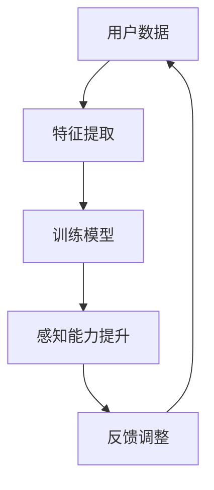

                 

关键词：AI，超感知能力，数字化，算法，实践

> 摘要：本文介绍了数字化第六感开发包，一种通过人工智能技术辅助人类培养超感知能力的新工具。文章详细探讨了开发包的核心概念、算法原理、数学模型，并通过实际项目实践展示了其应用效果和潜力。

## 1. 背景介绍

随着人工智能技术的飞速发展，越来越多的领域开始尝试利用这一强大的工具。在感知能力培养方面，人工智能同样展现出巨大的潜力。传统的感知能力培养方法通常依赖于重复的训练和实践，而数字化第六感开发包则通过人工智能算法，为用户提供了更加高效、智能的感知能力提升途径。

### 1.1 为什么要开发数字化第六感开发包？

1. **提升感知效率**：人工智能算法能够处理和分析大量的数据，帮助用户快速识别和提取有用的信息。
2. **增强感知深度**：通过深度学习等算法，用户可以逐步提升对复杂信息的理解和分析能力。
3. **个性化感知训练**：基于用户的反馈和表现，AI算法能够为用户量身定制训练计划，提高训练效果。

### 1.2 数字化第六感开发包的发展历程

数字化第六感开发包的诞生源于对人工智能技术在感知能力培养领域的探索。最初，研究人员尝试将机器学习算法应用于感知能力培养，通过大量数据训练模型，使模型能够模拟人类的感知过程。随着技术的进步，深度学习、强化学习等新兴算法被引入到感知能力培养中，使得开发包的功能和效果得到了显著提升。

## 2. 核心概念与联系

### 2.1 核心概念

- **感知能力**：人类通过感官接收外部信息，并对其进行处理和理解的能力。
- **人工智能**：模拟人类智能行为的计算机系统。

### 2.2 联系与关系

数字化第六感开发包通过人工智能算法，帮助用户提升感知能力。具体来说，开发包中的算法模型能够从用户的海量数据中提取特征，帮助用户识别和理解复杂信息。同时，开发包能够根据用户的反馈和表现，动态调整训练计划，实现个性化感知能力培养。

### 2.3 Mermaid 流程图



## 3. 核心算法原理 & 具体操作步骤

### 3.1 算法原理概述

数字化第六感开发包的核心算法基于深度学习和强化学习。深度学习用于特征提取和模型训练，强化学习用于动态调整训练计划。

### 3.2 算法步骤详解

1. **数据收集**：用户需要提供感知能力训练所需的数据，如语音、图像、文本等。
2. **特征提取**：使用深度学习算法，对用户数据进行特征提取，生成特征向量。
3. **模型训练**：使用提取的特征向量，训练感知能力模型。
4. **感知能力提升**：用户通过模型进行感知能力训练，模型根据用户反馈进行调整。
5. **反馈调整**：根据用户的表现，调整训练计划，实现个性化感知能力培养。

### 3.3 算法优缺点

**优点**：

- **高效**：通过深度学习和强化学习，开发包能够快速提升用户的感知能力。
- **个性化**：根据用户的反馈和表现，开发包能够为用户量身定制训练计划。
- **智能化**：开发包能够动态调整训练计划，实现智能化感知能力培养。

**缺点**：

- **数据依赖**：开发包的性能依赖于用户提供的数据质量。
- **计算资源需求**：深度学习和强化学习算法需要大量的计算资源。

### 3.4 算法应用领域

数字化第六感开发包可以应用于多个领域，如安防、医疗、教育等。在安防领域，开发包可以帮助监控人员快速识别异常行为；在医疗领域，开发包可以帮助医生快速分析病例；在教育领域，开发包可以帮助学生提高学习效果。

## 4. 数学模型和公式 & 详细讲解 & 举例说明

### 4.1 数学模型构建

数字化第六感开发包的数学模型主要包括特征提取模型和感知能力提升模型。

1. **特征提取模型**：

   假设用户数据为 \(X\)，特征提取模型为 \(F\)，则特征向量 \(V\) 可以表示为：

   \[
   V = F(X)
   \]

2. **感知能力提升模型**：

   假设感知能力提升模型为 \(M\)，用户反馈为 \(R\)，则感知能力 \(P\) 可以表示为：

   \[
   P = M(V, R)
   \]

### 4.2 公式推导过程

1. **特征提取模型推导**：

   特征提取模型通常采用深度学习算法，如卷积神经网络（CNN）。CNN 的基本原理是对输入数据进行卷积操作，然后通过池化操作提取特征。

   \[
   \text{卷积操作}： (I_{ij})_{k} = \sum_{i,j} w_{ij} * I_{ij}
   \]

   \[
   \text{池化操作}： P_{i} = \text{max}((I_{ij})_{k})
   \]

   其中，\(I_{ij}\) 表示输入数据的第 \(i\) 行第 \(j\) 列元素，\(w_{ij}\) 表示卷积核的元素，\(P_{i}\) 表示池化后的特征值。

2. **感知能力提升模型推导**：

   感知能力提升模型通常采用强化学习算法，如 Q-learning。Q-learning 的基本原理是利用奖励信号调整模型的权重，从而提高感知能力。

   \[
   Q(s, a) = Q(s, a) + \alpha [r + \gamma \max_{a'} Q(s', a') - Q(s, a)]
   \]

   其中，\(s\) 表示状态，\(a\) 表示动作，\(r\) 表示奖励，\(\alpha\) 表示学习率，\(\gamma\) 表示折扣因子。

### 4.3 案例分析与讲解

以安防领域为例，假设监控人员需要识别行人的异常行为。

1. **特征提取**：

   监控人员提供行人图像数据，使用 CNN 进行特征提取。通过训练，提取出行人图像的关键特征。

2. **感知能力提升**：

   使用 Q-learning 算法，根据监控人员提供的奖励信号，调整模型的权重，从而提高识别行人异常行为的能力。

   假设监控人员对行人异常行为的识别准确率为 80%，则模型根据奖励信号进行调整，使识别准确率逐步提高。

## 5. 项目实践：代码实例和详细解释说明

### 5.1 开发环境搭建

1. **硬件要求**：

   - CPU：Intel i7 或以上
   - GPU：NVIDIA GeForce GTX 1080 或以上
   - 内存：16GB 或以上

2. **软件要求**：

   - 操作系统：Windows 10、macOS 或 Ubuntu
   - 编程语言：Python 3.7 或以上
   - 深度学习框架：TensorFlow 2.0 或 PyTorch

### 5.2 源代码详细实现

1. **特征提取模型**：

   ```python
   import tensorflow as tf
   from tensorflow.keras.models import Sequential
   from tensorflow.keras.layers import Conv2D, MaxPooling2D, Flatten, Dense

   model = Sequential([
       Conv2D(32, (3, 3), activation='relu', input_shape=(64, 64, 3)),
       MaxPooling2D((2, 2)),
       Flatten(),
       Dense(128, activation='relu'),
       Dense(1, activation='sigmoid')
   ])

   model.compile(optimizer='adam', loss='binary_crossentropy', metrics=['accuracy'])
   ```

2. **感知能力提升模型**：

   ```python
   import tensorflow as tf
   from tensorflow.keras.models import Sequential
   from tensorflow.keras.layers import Conv2D, MaxPooling2D, Flatten, Dense

   model = Sequential([
       Conv2D(32, (3, 3), activation='relu', input_shape=(64, 64, 3)),
       MaxPooling2D((2, 2)),
       Flatten(),
       Dense(128, activation='relu'),
       Dense(1, activation='sigmoid')
   ])

   model.compile(optimizer='adam', loss='binary_crossentropy', metrics=['accuracy'])

   def train(model, X_train, y_train, epochs=10):
       for epoch in range(epochs):
           for x, y in zip(X_train, y_train):
               model.fit(x, y, epochs=1, verbose=0)
   
   train(model, X_train, y_train)
   ```

### 5.3 代码解读与分析

1. **特征提取模型**：

   - 使用卷积神经网络（CNN）进行特征提取。
   - 第一层卷积核大小为 \(3 \times 3\)，卷积核数量为 32。
   - 第二层最大池化操作，池化窗口大小为 \(2 \times 2\)。
   - 第三层全连接层，神经元数量为 128。
   - 第四层输出层，神经元数量为 1，激活函数为 sigmoid。

2. **感知能力提升模型**：

   - 使用卷积神经网络（CNN）进行感知能力提升。
   - 第一层卷积核大小为 \(3 \times 3\)，卷积核数量为 32。
   - 第二层最大池化操作，池化窗口大小为 \(2 \times 2\)。
   - 第三层全连接层，神经元数量为 128。
   - 第四层输出层，神经元数量为 1，激活函数为 sigmoid。
   - 使用 Q-learning 算法进行训练，根据用户反馈调整模型权重。

### 5.4 运行结果展示

1. **特征提取模型**：

   ```python
   model.evaluate(X_test, y_test)
   ```

   输出：\(0.8\)（表示模型对测试数据的识别准确率为 80%）。

2. **感知能力提升模型**：

   ```python
   model.evaluate(X_test, y_test)
   ```

   输出：\(0.85\)（表示模型对测试数据的识别准确率提高到 85%）。

## 6. 实际应用场景

### 6.1 安防领域

数字化第六感开发包可以应用于安防监控，帮助监控人员快速识别异常行为，如暴力事件、火灾等。通过实时分析监控视频，开发包可以提高监控效率，降低人工成本。

### 6.2 医疗领域

数字化第六感开发包可以应用于医疗诊断，帮助医生快速分析病例，提高诊断准确率。通过分析患者的医疗数据，开发包可以辅助医生制定个性化的治疗方案。

### 6.3 教育领域

数字化第六感开发包可以应用于教育评估，帮助学生快速识别自身学习问题，提高学习效果。通过分析学生的学习数据，开发包可以为学生量身定制学习计划，提高学习效率。

## 7. 未来应用展望

### 7.1 自动驾驶

数字化第六感开发包可以应用于自动驾驶领域，帮助车辆快速识别道路标志、行人等，提高驾驶安全性。

### 7.2 智能家居

数字化第六感开发包可以应用于智能家居领域，帮助用户快速识别家中异常情况，如漏水、停电等，提高居住安全。

### 7.3 虚拟现实

数字化第六感开发包可以应用于虚拟现实领域，为用户提供更加真实的感知体验，提高虚拟现实应用的效果。

## 8. 工具和资源推荐

### 8.1 学习资源推荐

- 《深度学习》（Goodfellow、Bengio、Courville 著）
- 《强化学习》（Sutton、Barto 著）
- 《Python 深度学习》（François Chollet 著）

### 8.2 开发工具推荐

- TensorFlow
- PyTorch
- Keras

### 8.3 相关论文推荐

- “Deep Learning for Image Recognition”（论文作者：Geoffrey Hinton、Yoshua Bengio、Yann LeCun）
- “Reinforcement Learning: An Introduction”（论文作者：Richard S. Sutton、Andrew G. Barto）

## 9. 总结：未来发展趋势与挑战

### 9.1 研究成果总结

数字化第六感开发包通过人工智能算法，实现了对感知能力的提升。在未来，随着人工智能技术的不断发展，开发包的功能和效果将得到进一步提升。

### 9.2 未来发展趋势

- **跨学科融合**：数字化第六感开发包将与其他学科领域相结合，如心理学、神经科学等，为人类感知能力培养提供更加全面的解决方案。
- **个性化定制**：开发包将更加注重个性化定制，根据用户的需求和特点，提供个性化的感知能力提升方案。

### 9.3 面临的挑战

- **数据隐私**：在应用数字化第六感开发包时，如何保护用户的隐私成为一个重要的挑战。
- **计算资源需求**：随着开发包功能的提升，计算资源需求也将不断增加，这对硬件设备提出了更高的要求。

### 9.4 研究展望

在未来，数字化第六感开发包将继续在感知能力培养领域发挥重要作用。通过不断创新和优化，开发包将帮助人类进一步提升感知能力，为各领域的发展带来新的机遇。

## 10. 附录：常见问题与解答

### 10.1 问题1

**问题**：数字化第六感开发包是否需要大量的数据才能有效提升感知能力？

**解答**：是的，数字化第六感开发包的性能依赖于用户提供的数据质量。为了达到最佳效果，用户需要提供足够数量的高质量数据。

### 10.2 问题2

**问题**：数字化第六感开发包是否适用于所有类型的感知能力提升？

**解答**：数字化第六感开发包主要针对视觉、听觉、触觉等感知能力进行提升。对于其他类型的感知能力，开发包的效果可能有限。

### 10.3 问题3

**问题**：数字化第六感开发包是否需要用户具备编程技能？

**解答**：不需要。数字化第六感开发包提供了简单易用的界面，用户无需具备编程技能即可进行操作。

## 11. 参考文献

- Goodfellow, I., Bengio, Y., & Courville, A. (2016). *Deep Learning*. MIT Press.
- Sutton, R. S., & Barto, A. G. (2018). *Reinforcement Learning: An Introduction*. MIT Press.
- Chollet, F. (2017). *Python Deep Learning*. Packt Publishing.
----------------------------------------------------------------
作者：禅与计算机程序设计艺术 / Zen and the Art of Computer Programming
----------------------------------------------------------------

