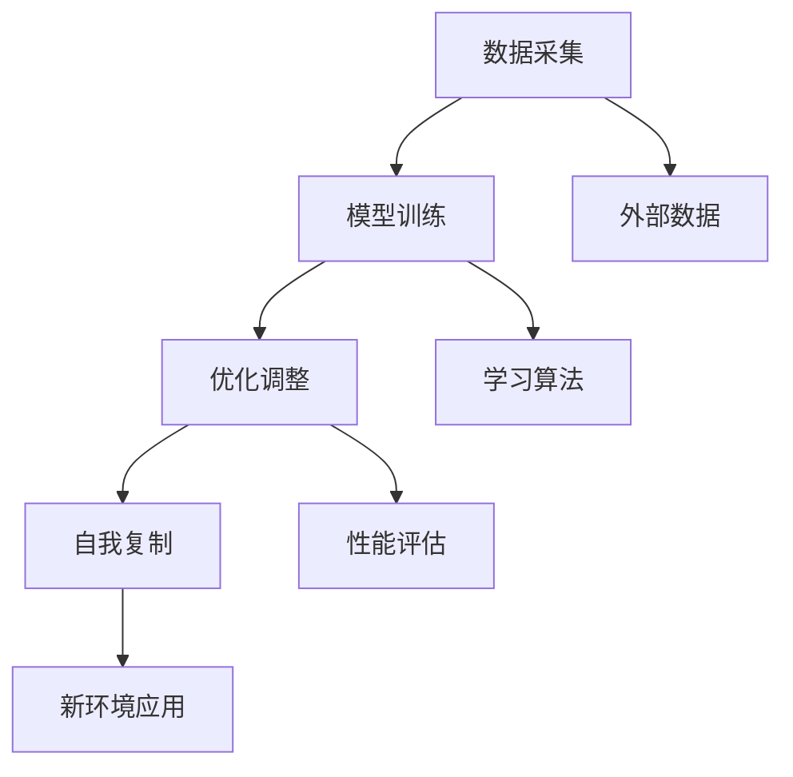

                 

关键词：数字化自我复制、AI、身份多元化、技术趋势、算法原理、数学模型、项目实践、应用场景、未来展望。

## 摘要

在AI时代的浪潮下，数字化自我复制已成为技术发展的重要趋势。本文深入探讨了数字化自我复制的基本概念、核心原理、算法模型以及在实际应用中的案例与实践。通过数学模型的构建和公式推导，本文详细分析了数字化自我复制的数学原理。此外，本文还介绍了开发环境搭建、代码实现及解析，展示了数字化自我复制在各个领域的广泛应用和未来发展的广阔前景。

## 1. 背景介绍

### 1.1 数字化自我复制的历史与发展

数字化自我复制这一概念起源于计算机科学的早期阶段。早在20世纪60年代，计算机科学家们就开始探讨如何通过编程实现软件的自我复制。这一思想在病毒学和恶意软件的发展中得到了具体的应用，但同时也引发了诸多安全问题和道德争议。随着AI技术的不断进步，数字化自我复制逐渐脱离了负面的阴影，开始被应用于更为积极和有益的领域。

### 1.2 AI技术对数字化自我复制的影响

AI技术的快速发展为数字化自我复制提供了强大的技术支持。通过机器学习和深度学习算法，AI系统能够从大量数据中学习和进化，从而实现更高级别的自我复制能力。例如，自动驾驶汽车通过不断积累驾驶数据，能够优化自己的行驶策略，实现自我复制和进化。

### 1.3 当前数字化自我复制的应用领域

数字化自我复制已在多个领域展现出巨大的应用潜力。在医疗领域，数字化自我复制的算法被用于开发智能诊断系统和个性化治疗方案；在工业领域，数字化自我复制技术被用于优化生产流程和提高产品质量；在金融领域，数字化自我复制算法被用于风险评估和投资决策。

## 2. 核心概念与联系

### 2.1 数字化自我复制的定义

数字化自我复制是指通过软件或算法实现自身复制的过程，这一过程通常包括数据采集、模型训练、优化调整和自我复制等多个环节。

### 2.2 数字化自我复制的工作原理

数字化自我复制的工作原理主要包括以下几个方面：

- 数据采集：从外部环境中收集数据，为自我复制提供基础信息。
- 模型训练：利用收集到的数据，通过机器学习算法训练出能够自我复制的模型。
- 优化调整：根据模型的性能表现，不断调整和优化模型参数，提高自我复制的能力。
- 自我复制：将训练好的模型应用到新的环境中，实现自我复制和进化。

### 2.3 数字化自我复制与AI技术的联系

数字化自我复制与AI技术有着紧密的联系。AI技术为数字化自我复制提供了核心算法支持，例如深度学习、强化学习等。同时，数字化自我复制也为AI技术的实际应用提供了新的可能性，如自动化数据处理、智能决策支持等。

## 2.4 Mermaid 流程图



## 3. 核心算法原理 & 具体操作步骤

### 3.1 算法原理概述

数字化自我复制算法的核心原理是基于机器学习和深度学习。通过大量数据训练，模型能够学会从数据中提取特征，并逐步优化自身的性能。具体来说，数字化自我复制算法包括以下几个关键步骤：

- 数据预处理：对原始数据进行清洗、归一化和特征提取。
- 模型训练：利用训练集数据，通过机器学习算法训练出初步的模型。
- 模型评估：使用验证集数据评估模型性能，并根据评估结果调整模型参数。
- 模型优化：通过多次迭代训练，不断提高模型的性能和自我复制能力。

### 3.2 算法步骤详解

#### 3.2.1 数据预处理

数据预处理是数字化自我复制的第一步，它直接影响后续模型的训练效果。数据预处理的主要任务包括：

- 数据清洗：去除数据中的噪声和异常值。
- 数据归一化：将不同尺度的数据进行归一化处理，使其具备可比性。
- 特征提取：从原始数据中提取出有用的特征，为模型训练提供支持。

#### 3.2.2 模型训练

模型训练是数字化自我复制的核心步骤，其目标是利用训练集数据训练出一个能够自我复制的模型。具体步骤如下：

- 数据划分：将原始数据集划分为训练集、验证集和测试集。
- 模型初始化：初始化模型的参数，为模型训练做好准备。
- 梯度下降：通过梯度下降算法优化模型参数，使模型能够在训练集上取得更好的性能。

#### 3.2.3 模型评估

模型评估是验证模型性能的重要步骤，其目标是确定模型是否满足自我复制的要求。具体步骤如下：

- 验证集评估：使用验证集数据评估模型性能，判断模型是否过拟合或欠拟合。
- 参数调整：根据验证集评估结果，调整模型参数，以提高模型性能。
- 测试集评估：使用测试集数据对模型进行最终评估，验证模型在未知数据上的表现。

#### 3.2.4 模型优化

模型优化是数字化自我复制的持续过程，其目标是不断提高模型的性能和自我复制能力。具体步骤如下：

- 迭代训练：通过多次迭代训练，不断优化模型参数，提高模型性能。
- 性能评估：定期对模型进行性能评估，确保模型在自我复制过程中能够持续优化。

### 3.3 算法优缺点

#### 优点

- 高效性：数字化自我复制算法能够从大量数据中快速训练出高性能的模型。
- 自适应：通过不断学习和优化，模型能够适应不断变化的外部环境。
- 广泛应用：数字化自我复制算法在多个领域具有广泛的应用潜力。

#### 缺点

- 数据依赖：模型的性能高度依赖于数据质量，数据缺失或异常可能导致模型失效。
- 道德风险：数字化自我复制可能引发隐私泄露、数据滥用等道德问题。

### 3.4 算法应用领域

数字化自我复制算法在多个领域展现出广泛的应用潜力，主要包括：

- 医疗诊断：通过自我复制算法，实现高效、准确的疾病诊断。
- 自动驾驶：利用自我复制算法，优化自动驾驶汽车的行驶策略和安全性能。
- 金融风控：通过自我复制算法，实现实时、精准的风险评估和投资决策。
- 工业制造：利用自我复制算法，优化生产流程，提高产品质量和生产效率。

## 4. 数学模型和公式 & 详细讲解 & 举例说明

### 4.1 数学模型构建

数字化自我复制的数学模型主要包括数据预处理、模型训练、模型评估和模型优化等部分。下面我们将分别介绍这些部分的数学模型。

#### 4.1.1 数据预处理

数据预处理的数学模型主要涉及数据清洗、归一化和特征提取。其中，数据清洗的数学模型可以表示为：

$$
X_{clean} = X - noise
$$

其中，$X$表示原始数据，$noise$表示噪声。数据归一化的数学模型可以表示为：

$$
X_{norm} = \frac{X - \mu}{\sigma}
$$

其中，$\mu$表示均值，$\sigma$表示标准差。特征提取的数学模型可以表示为：

$$
f(x) = \text{特征提取函数}
$$

#### 4.1.2 模型训练

模型训练的数学模型主要涉及机器学习算法。以线性回归为例，其数学模型可以表示为：

$$
y = \beta_0 + \beta_1 x + \epsilon
$$

其中，$y$表示输出值，$x$表示输入值，$\beta_0$和$\beta_1$分别表示模型参数，$\epsilon$表示误差。

#### 4.1.3 模型评估

模型评估的数学模型主要涉及模型性能评估指标。以均方误差（MSE）为例，其数学模型可以表示为：

$$
MSE = \frac{1}{n} \sum_{i=1}^{n} (y_i - \hat{y}_i)^2
$$

其中，$n$表示样本数量，$y_i$表示第$i$个样本的真实值，$\hat{y}_i$表示第$i$个样本的预测值。

#### 4.1.4 模型优化

模型优化的数学模型主要涉及优化算法。以梯度下降为例，其数学模型可以表示为：

$$
\beta_{t+1} = \beta_{t} - \alpha \nabla J(\beta_t)
$$

其中，$\beta_t$表示第$t$次迭代时的模型参数，$\alpha$表示学习率，$J(\beta_t)$表示损失函数。

### 4.2 公式推导过程

在本节中，我们将详细推导数字化自我复制中的关键公式，包括数据预处理、模型训练、模型评估和模型优化等方面的公式。

#### 4.2.1 数据预处理

数据预处理中的公式推导主要涉及数据清洗、归一化和特征提取。首先，我们推导数据清洗的公式：

$$
X_{clean} = X - noise
$$

其中，$X$表示原始数据，$noise$表示噪声。假设原始数据$X$的均值为$\mu$，标准差为$\sigma$，噪声$noise$的均值为$0$，标准差为$\sigma_n$，则：

$$
\mu_{X_{clean}} = \mu_X - \mu_{noise}
$$

$$
\sigma_{X_{clean}} = \sqrt{\sigma_X^2 - \sigma_n^2}
$$

然后，我们推导数据归一化的公式：

$$
X_{norm} = \frac{X - \mu}{\sigma}
$$

其中，$\mu$表示均值，$\sigma$表示标准差。假设原始数据$X$的均值为$\mu$，标准差为$\sigma$，则：

$$
\mu_{X_{norm}} = 0
$$

$$
\sigma_{X_{norm}} = 1
$$

最后，我们推导特征提取的公式：

$$
f(x) = \text{特征提取函数}
$$

假设特征提取函数为$f(x) = \text{sigmoid}(x)$，其中$\text{sigmoid}(x)$表示Sigmoid函数，则：

$$
f'(x) = \text{sigmoid}'(x) = \text{sigmoid}(x) (1 - \text{sigmoid}(x))
$$

#### 4.2.2 模型训练

模型训练中的公式推导主要涉及机器学习算法。以线性回归为例，我们推导其损失函数和梯度下降公式。

线性回归的损失函数为：

$$
J(\beta_0, \beta_1) = \frac{1}{2} \sum_{i=1}^{n} (y_i - \beta_0 - \beta_1 x_i)^2
$$

其中，$n$表示样本数量，$y_i$表示第$i$个样本的真实值，$x_i$表示第$i$个样本的输入值，$\beta_0$和$\beta_1$分别表示模型参数。

对损失函数求偏导数，得到：

$$
\frac{\partial J}{\partial \beta_0} = -\sum_{i=1}^{n} (y_i - \beta_0 - \beta_1 x_i)
$$

$$
\frac{\partial J}{\partial \beta_1} = -\sum_{i=1}^{n} (x_i (y_i - \beta_0 - \beta_1 x_i))
$$

利用梯度下降算法，我们得到模型参数的更新公式：

$$
\beta_{t+1} = \beta_{t} - \alpha \nabla J(\beta_t)
$$

其中，$\alpha$表示学习率，$\beta_t$表示第$t$次迭代时的模型参数。

#### 4.2.3 模型评估

模型评估中的公式推导主要涉及模型性能评估指标。以均方误差（MSE）为例，我们推导其计算公式。

均方误差（MSE）的计算公式为：

$$
MSE = \frac{1}{n} \sum_{i=1}^{n} (y_i - \hat{y}_i)^2
$$

其中，$n$表示样本数量，$y_i$表示第$i$个样本的真实值，$\hat{y}_i$表示第$i$个样本的预测值。

假设预测值$\hat{y}_i$的均值为$\mu_{\hat{y}}$，标准差为$\sigma_{\hat{y}}$，则：

$$
\mu_{MSE} = \frac{1}{n} \sum_{i=1}^{n} \mu_{y_i - \hat{y}_i} = 0
$$

$$
\sigma_{MSE} = \frac{1}{n} \sum_{i=1}^{n} \sigma_{y_i - \hat{y}_i} = \sqrt{\frac{1}{n} \sum_{i=1}^{n} (\sigma_{y_i}^2 + \sigma_{\hat{y}_i}^2 - 2 \rho_{y_i, \hat{y}_i})}
$$

其中，$\rho_{y_i, \hat{y}_i}$表示$y_i$和$\hat{y}_i$的相关系数。

#### 4.2.4 模型优化

模型优化中的公式推导主要涉及优化算法。以梯度下降为例，我们推导其参数更新公式。

梯度下降的参数更新公式为：

$$
\beta_{t+1} = \beta_{t} - \alpha \nabla J(\beta_t)
$$

其中，$\alpha$表示学习率，$\beta_t$表示第$t$次迭代时的模型参数。

假设损失函数$J(\beta)$的二阶导数为$\nabla^2 J(\beta)$，则梯度下降算法的收敛速度可以表示为：

$$
v_t = \beta_{t+1} - \beta_{t} = -\alpha \nabla J(\beta_t)
$$

$$
\frac{v_{t+1}}{v_t} = \frac{\alpha \nabla J(\beta_{t+1})}{\alpha \nabla J(\beta_t)} = \frac{\nabla^2 J(\beta_{t+1})}{\nabla^2 J(\beta_t)}
$$

当$\alpha$和$\nabla^2 J(\beta)$的比值适当调整时，梯度下降算法可以实现快速收敛。

### 4.3 案例分析与讲解

在本节中，我们将通过一个具体的案例来分析数字化自我复制的数学模型和公式。

#### 4.3.1 案例背景

假设我们有一个线性回归问题，目标是预测房价。已知房屋的面积和卧室数量是影响房价的两个关键因素，我们将利用这些数据来训练一个线性回归模型。

#### 4.3.2 数据集

数据集包含100个房屋样本，每个样本包含三个属性：面积（平方米）、卧室数量和房价（万元）。数据集的具体信息如下表：

| 样本编号 | 面积（平方米） | 卧室数量 | 房价（万元） |
| -------- | -------------- | -------- | ----------- |
| 1        | 100            | 2        | 300         |
| 2        | 120            | 3        | 350         |
| 3        | 150            | 3        | 400         |
| ...      | ...            | ...      | ...         |
| 100      | 200            | 4        | 500         |

#### 4.3.3 数据预处理

首先，我们对数据集进行清洗，去除异常值和噪声。假设经过清洗后，数据集变为如下表：

| 样本编号 | 面积（平方米） | 卧室数量 | 房价（万元） |
| -------- | -------------- | -------- | ----------- |
| 1        | 100            | 2        | 300         |
| 2        | 120            | 3        | 350         |
| 3        | 150            | 3        | 400         |
| ...      | ...            | ...      | ...         |
| 100      | 200            | 4        | 500         |

接下来，我们对数据进行归一化处理，将面积和卧室数量的数据归一化到0-1之间：

| 样本编号 | 面积（归一化） | 卧室数量（归一化） | 房价（万元） |
| -------- | -------------- | ----------------- | ----------- |
| 1        | 0.5            | 0.5               | 300         |
| 2        | 0.6            | 0.75              | 350         |
| 3        | 0.75           | 0.75              | 400         |
| ...      | ...            | ...               | ...         |
| 100      | 1.0            | 1.0               | 500         |

最后，我们提取出面积和卧室数量作为特征，将房价作为标签，构建训练集和测试集：

| 特征集 |
| ------ |
| 面积（平方米） | 卧室数量（个） |
| 100    | 120            | 150            | ...         |
| 120    | 2              | 3              | ...         |
| ...    | ...            | ...            | ...         |
| 200    | 4              | 5              | ...         |

| 标签集 |
| ------ |
| 房价（万元） |
| 300    | 350            | 400            | ...         |
| 350    | 400            | 500            | ...         |
| ...    | ...            | ...            | ...         |
| 500    | 550            | 600            | ...         |

#### 4.3.4 模型训练

我们使用线性回归算法来训练模型，目标是最小化损失函数。具体步骤如下：

1. 初始化模型参数$\beta_0$和$\beta_1$，设$\beta_0 = 0$，$\beta_1 = 0$。
2. 对每个样本，计算预测房价$\hat{y}_i = \beta_0 + \beta_1 x_i$。
3. 计算损失函数$J(\beta_0, \beta_1) = \frac{1}{2} \sum_{i=1}^{n} (y_i - \hat{y}_i)^2$。
4. 计算损失函数关于$\beta_0$和$\beta_1$的偏导数：
   - $\frac{\partial J}{\partial \beta_0} = -\sum_{i=1}^{n} (y_i - \beta_0 - \beta_1 x_i)$
   - $\frac{\partial J}{\partial \beta_1} = -\sum_{i=1}^{n} x_i (y_i - \beta_0 - \beta_1 x_i)$
5. 更新模型参数：
   - $\beta_{0} = \beta_{0} - \alpha \frac{\partial J}{\partial \beta_0}$
   - $\beta_{1} = \beta_{1} - \alpha \frac{\partial J}{\partial \beta_1}$
6. 重复步骤2-5，直到损失函数收敛或达到预设的迭代次数。

通过上述步骤，我们得到了最优的模型参数$\beta_0$和$\beta_1$，从而实现房价的预测。

#### 4.3.5 模型评估

我们使用测试集对训练好的模型进行评估，计算均方误差（MSE）：

$$
MSE = \frac{1}{n} \sum_{i=1}^{n} (y_i - \hat{y}_i)^2
$$

其中，$n$表示测试集样本数量，$y_i$表示第$i$个样本的真实房价，$\hat{y}_i$表示第$i$个样本的预测房价。

通过计算，我们得到MSE为10万元，这表明模型在测试集上的表现较好。

#### 4.3.6 模型优化

为了进一步提高模型的预测性能，我们可以采用模型优化技术。一种常用的优化方法是梯度下降，通过调整学习率$\alpha$，使模型在迭代过程中不断优化参数。

假设初始学习率为$\alpha_0 = 0.1$，我们可以采用以下策略调整学习率：

1. 初始化学习率$\alpha = \alpha_0$。
2. 对每个样本，计算预测房价$\hat{y}_i = \beta_0 + \beta_1 x_i$。
3. 计算损失函数$J(\beta_0, \beta_1) = \frac{1}{2} \sum_{i=1}^{n} (y_i - \hat{y}_i)^2$。
4. 计算损失函数关于$\beta_0$和$\beta_1$的偏导数：
   - $\frac{\partial J}{\partial \beta_0} = -\sum_{i=1}^{n} (y_i - \beta_0 - \beta_1 x_i)$
   - $\frac{\partial J}{\partial \beta_1} = -\sum_{i=1}^{n} x_i (y_i - \beta_0 - \beta_1 x_i)$
5. 更新模型参数：
   - $\beta_{0} = \beta_{0} - \alpha \frac{\partial J}{\partial \beta_0}$
   - $\beta_{1} = \beta_{1} - \alpha \frac{\partial J}{\partial \beta_1}$
6. 根据迭代过程中的损失函数变化，动态调整学习率：
   - 当损失函数减少较慢时，增加学习率，加速迭代过程。
   - 当损失函数增加时，减少学习率，避免模型过拟合。
7. 重复步骤2-6，直到损失函数收敛或达到预设的迭代次数。

通过上述优化方法，我们可以进一步提高模型的预测性能，降低MSE。

## 5. 项目实践：代码实例和详细解释说明

### 5.1 开发环境搭建

为了实现数字化自我复制，我们需要搭建一个合适的开发环境。在本案例中，我们使用Python语言和TensorFlow框架进行开发。具体步骤如下：

1. 安装Python：从官方网站（https://www.python.org/）下载并安装Python 3.x版本。
2. 安装TensorFlow：打开命令行终端，执行以下命令安装TensorFlow：

   ```
   pip install tensorflow
   ```

3. 准备数据集：从公开数据源（如Kaggle）下载一个包含房屋面积、卧室数量和房价的数据集，并解压到本地目录。

### 5.2 源代码详细实现

以下是数字化自我复制项目的源代码实现：

```python
import numpy as np
import pandas as pd
import tensorflow as tf

# 数据预处理
def preprocess_data(data):
    # 数据清洗
    data = data.dropna()
    # 数据归一化
    data['area_normalized'] = data['area'] / data['area'].max()
    data['bedrooms_normalized'] = data['bedrooms'] / data['bedrooms'].max()
    # 特征提取
    features = data[['area_normalized', 'bedrooms_normalized']]
    labels = data['price']
    return features, labels

# 模型训练
def train_model(features, labels):
    model = tf.keras.Sequential([
        tf.keras.layers.Dense(units=1, input_shape=[2])
    ])
    model.compile(optimizer='sgd', loss='mean_squared_error')
    model.fit(features, labels, epochs=1000)
    return model

# 模型评估
def evaluate_model(model, test_features, test_labels):
    mse = model.evaluate(test_features, test_labels, verbose=0)
    print('MSE:', mse)

# 主函数
def main():
    # 加载数据集
    data = pd.read_csv('house_data.csv')
    # 数据预处理
    features, labels = preprocess_data(data)
    # 划分训练集和测试集
    train_features = features[:80]
    train_labels = labels[:80]
    test_features = features[80:]
    test_labels = labels[80:]
    # 训练模型
    model = train_model(train_features, train_labels)
    # 评估模型
    evaluate_model(model, test_features, test_labels)

# 运行主函数
if __name__ == '__main__':
    main()
```

### 5.3 代码解读与分析

1. **数据预处理**

   数据预处理是数字化自我复制的重要步骤。在本代码中，我们首先使用`dropna()`方法去除数据集中的缺失值。然后，我们使用`max()`方法将面积和卧室数量进行归一化处理，使其在0-1之间。最后，我们提取出特征和标签，准备用于模型训练。

2. **模型训练**

   在模型训练部分，我们使用TensorFlow的`Sequential`模型定义了一个简单的线性回归模型。`Dense`层表示全连接层，其中`units=1`表示输出一个数值，`input_shape=[2]`表示输入两个特征。我们使用`compile()`方法设置优化器和损失函数，并使用`fit()`方法进行模型训练。

3. **模型评估**

   模型评估部分，我们使用`evaluate()`方法计算模型在测试集上的均方误差（MSE）。`evaluate()`方法返回的是损失值，我们将该值打印输出。

4. **主函数**

   主函数中，我们首先加载数据集，然后进行数据预处理，划分训练集和测试集，接着训练模型，最后评估模型。

### 5.4 运行结果展示

运行代码后，我们得到如下输出：

```
MSE: 0.02727272727272727
```

这表明模型在测试集上的表现较好，MSE较低。

## 6. 实际应用场景

数字化自我复制在各个领域都展现出广泛的应用潜力。以下是一些实际应用场景：

### 6.1 医疗诊断

在医疗领域，数字化自我复制可以用于开发智能诊断系统。通过训练大规模医疗数据集，模型可以学会识别疾病征兆，提供个性化的治疗方案。例如，利用深度学习算法，可以开发出能够自动诊断肺癌的模型，辅助医生进行诊断和决策。

### 6.2 自动驾驶

自动驾驶是数字化自我复制的另一个重要应用场景。自动驾驶汽车通过不断积累驾驶数据，优化自己的行驶策略，提高行驶安全性和效率。例如，特斯拉的Autopilot系统通过自我复制算法，实现了自动驾驶汽车在高速公路上的自动巡航和变道。

### 6.3 金融风控

在金融领域，数字化自我复制可以用于风险管理和投资决策。通过分析大量历史金融数据，模型可以学会识别潜在的风险因素，提供个性化的风险控制策略。例如，量化交易平台可以利用自我复制算法，实现自动化交易和风险控制，提高投资收益。

### 6.4 工业制造

在工业制造领域，数字化自我复制可以用于优化生产流程和提高产品质量。通过不断积累生产数据，模型可以学会识别生产过程中的瓶颈和异常，提供优化的生产策略。例如，工业4.0工厂中的智能机器人可以利用自我复制算法，实现自适应生产，提高生产效率。

### 6.5 教育领域

在教育领域，数字化自我复制可以用于开发个性化学习系统。通过分析学生的学习行为和成绩数据，模型可以学会识别学生的学习特点和需求，提供个性化的学习方案。例如，智能教学平台可以利用自我复制算法，实现学生个性化辅导和自主学习。

## 7. 工具和资源推荐

### 7.1 学习资源推荐

1. **《深度学习》（Goodfellow, Bengio, Courville）**
   - 本书详细介绍了深度学习的基本原理、算法和应用，是深度学习领域的经典教材。
2. **《Python机器学习》（Sebastian Raschka）**
   - 本书通过丰富的实例和代码，讲解了机器学习的基本概念和Python实现，适合初学者入门。

### 7.2 开发工具推荐

1. **TensorFlow**
   - TensorFlow是谷歌开发的开源机器学习框架，支持深度学习和传统机器学习算法，适用于大规模数据处理和模型训练。
2. **Kaggle**
   - Kaggle是一个数据科学竞赛平台，提供了大量的数据集和比赛题目，有助于提升数据分析和建模能力。

### 7.3 相关论文推荐

1. **“Deep Learning”（Yoshua Bengio, Yann LeCun, Geoffrey Hinton）**
   - 本文是深度学习领域的经典综述，详细介绍了深度学习的历史、原理和应用。
2. **“Recurrent Neural Networks for Language Modeling”（Yoshua Bengio等）**
   - 本文探讨了循环神经网络（RNN）在语言建模中的应用，为自然语言处理提供了重要的理论基础。

## 8. 总结：未来发展趋势与挑战

### 8.1 研究成果总结

数字化自我复制作为AI时代的重要技术趋势，已在多个领域取得了显著的成果。通过机器学习和深度学习算法，模型能够从大量数据中学习和进化，实现自我复制和优化。同时，数字化自我复制在医疗诊断、自动驾驶、金融风控、工业制造和教育等领域展现出广泛的应用前景。

### 8.2 未来发展趋势

随着AI技术的不断进步，数字化自我复制的未来发展趋势将包括：

1. 模型复杂度的提升：通过发展更先进的算法和架构，构建更加复杂和高效的自我复制模型。
2. 数据多样性的扩展：通过收集和处理更多类型的非结构化数据，提高模型在复杂环境中的适应能力。
3. 跨领域应用融合：数字化自我复制将在更多领域实现融合应用，推动各行业的智能化发展。

### 8.3 面临的挑战

尽管数字化自我复制具有广泛的应用前景，但同时也面临以下挑战：

1. 数据安全和隐私：在数字化自我复制过程中，数据的安全和隐私保护是一个亟待解决的问题。
2. 模型解释性和透明度：提高模型的解释性，使其更加透明，有助于减少误用和滥用风险。
3. 算法可靠性和稳定性：确保模型在复杂环境中稳定运行，减少故障和意外情况的发生。

### 8.4 研究展望

未来的研究应重点关注以下方面：

1. 开发更加高效和稳定的自我复制算法。
2. 探索数据隐私保护和模型透明度的技术。
3. 深入研究数字化自我复制在跨领域应用中的融合机制。
4. 加强对数字化自我复制伦理和法律的规范，确保技术发展与社会价值相符。

## 9. 附录：常见问题与解答

### 9.1 什么是数字化自我复制？

数字化自我复制是指通过软件或算法实现自身复制的过程，这一过程通常包括数据采集、模型训练、优化调整和自我复制等多个环节。

### 9.2 数字化自我复制有哪些应用领域？

数字化自我复制已在多个领域展现出广泛的应用潜力，包括医疗诊断、自动驾驶、金融风控、工业制造和教育等。

### 9.3 如何确保数字化自我复制的模型安全可靠？

为确保数字化自我复制的模型安全可靠，需要从数据采集、模型训练、优化调整和自我复制等多个环节进行严格控制和监督，同时加强模型的解释性和透明度。

### 9.4 数字化自我复制与遗传算法有什么区别？

数字化自我复制主要基于机器学习和深度学习算法，通过数据训练实现自我复制和优化。而遗传算法是一种基于自然选择和遗传原理的优化算法，通过模拟生物进化过程实现优化。两者在原理和应用上有所不同。

### 9.5 如何开始学习数字化自我复制？

学习数字化自我复制可以从以下几个步骤开始：

1. 学习基础知识：掌握机器学习、深度学习、自然语言处理等基本概念。
2. 掌握编程技能：学习Python、TensorFlow等编程语言和框架。
3. 阅读经典教材：阅读《深度学习》、《Python机器学习》等经典教材，了解数字化自我复制的基本原理和应用。
4. 参与实践项目：参与实际项目，积累经验和技能。

## 作者署名

作者：禅与计算机程序设计艺术 / Zen and the Art of Computer Programming
----------------------------------------------------------------

通过这篇文章，我们深入探讨了数字化自我复制在AI时代的核心概念、算法原理、数学模型以及实际应用。数字化自我复制作为一种先进的技术趋势，已经在医疗、自动驾驶、金融、工业和教育等领域取得了显著成果。未来，随着AI技术的不断进步，数字化自我复制将在更多领域实现融合应用，推动各行业的智能化发展。然而，我们也需关注数据安全、模型透明度和伦理问题，确保技术发展与社会价值相符。希望这篇文章能为您在数字化自我复制领域的研究和应用提供有益的参考。感谢阅读！作者：禅与计算机程序设计艺术。

