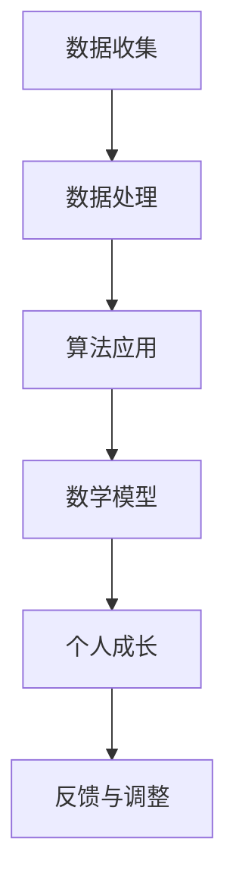
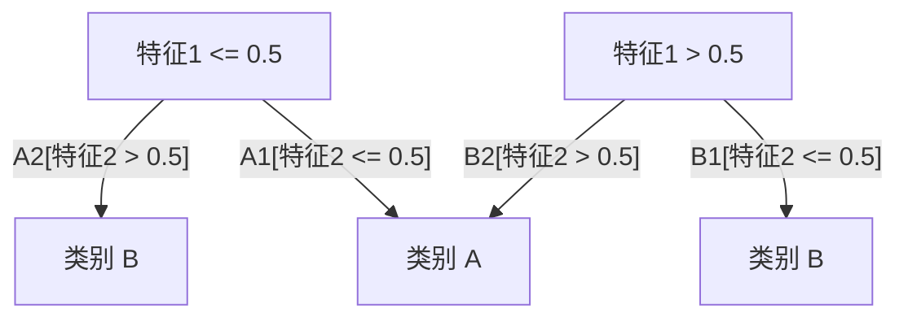

                 

关键词：AI、数字化自我、个人成长、算法原理、数学模型、项目实践、未来展望

摘要：本文将探讨如何利用人工智能（AI）技术实现个人成长。通过介绍核心概念、算法原理、数学模型以及项目实践，本文旨在为读者提供一个全面的指南，帮助他们在数字化时代中更好地提升自己。

## 1. 背景介绍

在当今数字化时代，人工智能（AI）技术正以前所未有的速度发展，深刻地影响着我们的生活方式、工作方式和思维方式。随着AI技术的不断进步，人们越来越意识到，利用AI工具不仅可以提高工作效率，还可以帮助个人实现自我成长。

个人成长是一个复杂的过程，涉及到知识积累、技能提升、情感管理等多个方面。在过去，个人成长往往依赖于个人的经验积累和自我反思。然而，随着信息的爆炸式增长，单靠个人努力已经难以应对复杂多变的环境。因此，借助AI技术，我们可以更加高效地实现个人成长。

本文将围绕以下几个方面展开：

1. 核心概念与联系
2. 核心算法原理与具体操作步骤
3. 数学模型与公式推导
4. 项目实践：代码实例与详细解释
5. 实际应用场景
6. 未来应用展望
7. 工具和资源推荐
8. 总结：未来发展趋势与挑战

通过以上内容的介绍，本文旨在为读者提供一个全面的指南，帮助他们在数字化时代中更好地利用AI技术实现个人成长。

## 2. 核心概念与联系

在探讨AI辅助的个人成长之前，我们首先需要了解一些核心概念，这些概念将为我们理解AI技术如何促进个人成长奠定基础。

### 2.1 数据与信息

数据是现代AI技术的基石。数据质量直接影响到AI算法的性能。在个人成长过程中，数据同样至关重要。个人成长数据包括学习经历、工作经历、兴趣爱好、社交网络等。通过对这些数据的收集和分析，我们可以更全面地了解自己的成长过程，发现潜在的问题和改进点。

### 2.2 算法

算法是AI技术的核心。它决定了AI系统能够处理数据的方式和能力。在个人成长中，算法可以用于推荐系统、学习计划制定、情感分析等。例如，推荐系统可以帮助我们找到感兴趣的学习资源，学习计划制定算法可以根据我们的学习进度和需求自动调整学习内容。

### 2.3 数学模型

数学模型是AI算法的基础。它将实际问题转化为可计算的形式。在个人成长中，数学模型可以帮助我们理解成长过程中的规律，预测未来的发展趋势。例如，线性回归模型可以用于分析个人学习成绩与学习时间的关系。

### 2.4 机器学习

机器学习是AI技术的一个重要分支。它使得计算机能够从数据中自动学习，无需显式编程。在个人成长中，机器学习可以帮助我们建立个性化的学习计划，优化学习效果。

### 2.5 自然语言处理

自然语言处理（NLP）是AI技术在语言领域的重要应用。它使得计算机能够理解和生成自然语言。在个人成长中，NLP可以帮助我们分析自己的语言表达，提高沟通能力。

### 2.6 人工智能与个人成长的联系

人工智能与个人成长有着紧密的联系。AI技术可以帮助我们更高效地获取和处理信息，从而提升学习效率。同时，AI技术还可以帮助我们更好地理解自己，发现自身的优点和不足，进而实现自我提升。

### 2.7 Mermaid 流程图

为了更直观地展示AI技术在个人成长中的应用，我们使用Mermaid流程图来描述。



在这个流程图中，数据收集是整个过程的起点，通过数据处理，我们可以获得有用的信息。然后，算法应用和数学模型帮助我们分析这些信息，最终实现个人成长。同时，我们还可以根据反馈进行不断的调整和优化。

## 3. 核心算法原理 & 具体操作步骤

在了解了核心概念和流程之后，我们接下来将深入探讨AI技术在个人成长中的核心算法原理和具体操作步骤。

### 3.1 算法原理概述

在AI辅助的个人成长中，常用的算法包括推荐系统、学习计划制定算法、情感分析等。下面我们分别介绍这些算法的原理。

#### 3.1.1 推荐系统

推荐系统是一种基于用户历史行为和偏好进行内容推荐的算法。它的核心目标是提高用户满意度，增加用户粘性。推荐系统通常采用协同过滤、基于内容的推荐和混合推荐等方法。

协同过滤是通过分析用户之间的相似度来进行推荐的。基于内容的推荐则是根据用户过去喜欢的特征来推荐类似的内容。混合推荐则结合了协同过滤和基于内容的推荐，以提高推荐效果。

#### 3.1.2 学习计划制定算法

学习计划制定算法是一种基于用户需求和目标，自动生成个性化学习计划的算法。这种算法通常采用基于知识的推理、机器学习和优化算法等方法。

基于知识的推理是通过分析用户的需求和目标，生成一系列学习任务和步骤。机器学习则通过分析用户的历史学习数据，预测用户未来的学习需求，从而生成学习计划。优化算法则用于调整学习计划，使其更符合用户的需求。

#### 3.1.3 情感分析

情感分析是一种通过分析文本的情感倾向，来判断用户情绪的算法。它通常采用自然语言处理技术和机器学习算法。

情感分析可以帮助我们了解用户的情绪变化，从而调整学习计划，提高学习效果。例如，如果用户在学习过程中感到沮丧，我们可以通过情感分析识别这一情绪，并调整学习内容，以缓解用户的压力。

### 3.2 算法步骤详解

下面我们详细描述这些算法的具体操作步骤。

#### 3.2.1 推荐系统

1. 数据收集：收集用户的历史行为数据和内容特征数据。
2. 数据预处理：对数据进行清洗、去重和处理，以获得高质量的数据。
3. 建立模型：选择合适的推荐算法，如协同过滤、基于内容的推荐或混合推荐，并建立推荐模型。
4. 预测与推荐：使用推荐模型对用户进行预测，并根据预测结果生成推荐列表。

#### 3.2.2 学习计划制定算法

1. 用户需求分析：分析用户的需求和目标，以确定学习任务和步骤。
2. 历史数据学习：使用机器学习算法，分析用户的历史学习数据，预测用户未来的学习需求。
3. 计划生成：根据用户需求和预测结果，生成个性化的学习计划。
4. 计划优化：根据用户反馈，不断调整和优化学习计划。

#### 3.2.3 情感分析

1. 数据收集：收集用户的学习日志和评论数据。
2. 数据预处理：对数据进行清洗、去重和处理，以获得高质量的数据。
3. 情感分类：使用自然语言处理技术和机器学习算法，对文本进行情感分类。
4. 情感识别：根据情感分类结果，识别用户的情绪。
5. 反馈调整：根据用户的情绪，调整学习内容和计划。

### 3.3 算法优缺点

每种算法都有其独特的优势和局限性。以下是推荐系统、学习计划制定算法和情感分析的主要优缺点。

#### 3.3.1 推荐系统

**优点：**

- 提高用户满意度：通过个性化推荐，提高用户的学习兴趣和参与度。
- 增强用户粘性：推荐系统能够持续吸引用户，增加用户的使用时间。

**缺点：**

- 数据依赖性高：推荐系统的效果很大程度上取决于数据质量，如果数据质量不佳，推荐结果可能会失真。
- 冷启动问题：对于新用户，由于缺乏历史数据，推荐系统很难为其提供个性化的推荐。

#### 3.3.2 学习计划制定算法

**优点：**

- 个性化学习：根据用户的需求和目标，自动生成个性化的学习计划，提高学习效率。
- 自动调整：学习计划可以根据用户的反馈和学习进度自动进行调整。

**缺点：**

- 需要大量历史数据：学习计划制定算法需要大量的历史数据作为训练数据，对于新用户，可能难以提供有效的学习计划。
- 复杂性高：学习计划制定算法涉及到多个领域的知识，实现难度较大。

#### 3.3.3 情感分析

**优点：**

- 实时反馈：情感分析能够实时识别用户的情绪，为用户提供即时的反馈。
- 提高学习效果：根据用户的情绪，调整学习内容和计划，有助于提高学习效果。

**缺点：**

- 情感识别准确性：情感分析技术的准确性受到多种因素的影响，如语言表达、语境等。
- 隐私问题：情感分析涉及到用户的学习日志和评论数据，可能引发隐私问题。

### 3.4 算法应用领域

推荐系统、学习计划制定算法和情感分析在个人成长中的应用非常广泛。以下是这些算法的主要应用领域。

#### 3.4.1 学习资源推荐

通过推荐系统，可以推荐用户感兴趣的学习资源，如课程、书籍、文章等。这有助于用户发现新的学习内容，提高学习效率。

#### 3.4.2 学习计划制定

学习计划制定算法可以帮助用户制定个性化的学习计划，合理安排学习时间和任务，提高学习效果。

#### 3.4.3 情感监控与调整

通过情感分析，可以实时监控用户的情绪变化，并根据用户的情绪调整学习内容和计划，以提高学习效果。

## 4. 数学模型和公式 & 详细讲解 & 举例说明

在AI辅助的个人成长中，数学模型和公式扮演着至关重要的角色。它们帮助我们理解和预测个人成长过程中的各种现象和趋势。下面我们将详细介绍一些常用的数学模型和公式，并通过实际案例进行说明。

### 4.1 数学模型构建

数学模型构建是AI技术的重要组成部分。它通过数学公式和算法，将实际问题转化为可计算的形式。在个人成长中，常见的数学模型包括线性回归、逻辑回归、决策树等。

#### 4.1.1 线性回归

线性回归是一种用于预测连续值的模型。它假设因变量（Y）与自变量（X）之间存在线性关系，可以用公式表示为：

\[ Y = \beta_0 + \beta_1 \cdot X + \epsilon \]

其中，\( \beta_0 \) 和 \( \beta_1 \) 是模型的参数，\( \epsilon \) 是误差项。

线性回归模型可以用于预测个人学习成绩与学习时间之间的关系。

#### 4.1.2 逻辑回归

逻辑回归是一种用于预测离散值的模型。它通过逻辑函数将自变量转换为概率，可以用公式表示为：

\[ P(Y=1) = \frac{1}{1 + e^{-(\beta_0 + \beta_1 \cdot X)}} \]

其中，\( \beta_0 \) 和 \( \beta_1 \) 是模型的参数。

逻辑回归模型可以用于预测个人是否能够达到某个学习目标。

#### 4.1.3 决策树

决策树是一种通过一系列规则进行决策的模型。它将数据集分成多个子集，每个子集对应一个决策节点。决策树可以用公式表示为：

\[ Y = f(X_1, X_2, ..., X_n) \]

其中，\( f \) 是决策规则。

决策树可以用于分析个人成长过程中的关键因素。

### 4.2 公式推导过程

数学模型的推导过程通常涉及微积分、概率论和线性代数等数学知识。下面我们以线性回归模型为例，简要介绍公式的推导过程。

假设我们有 \( n \) 个样本点 \( (X_i, Y_i) \)，我们希望找到一个线性函数 \( f(X) = \beta_0 + \beta_1 \cdot X \) 来拟合这些数据点。

为了最小化误差，我们可以使用最小二乘法。误差函数 \( J(\beta_0, \beta_1) \) 表示为：

\[ J(\beta_0, \beta_1) = \sum_{i=1}^{n} (Y_i - f(X_i))^2 \]

我们对 \( J(\beta_0, \beta_1) \) 关于 \( \beta_0 \) 和 \( \beta_1 \) 分别求导，并令导数为零，可以得到：

\[ \frac{\partial J}{\partial \beta_0} = -2 \sum_{i=1}^{n} (Y_i - f(X_i)) = 0 \]

\[ \frac{\partial J}{\partial \beta_1} = -2 \sum_{i=1}^{n} (X_i - \bar{X}) (Y_i - \bar{Y}) = 0 \]

其中，\( \bar{X} \) 和 \( \bar{Y} \) 分别是 \( X \) 和 \( Y \) 的均值。

解上述方程组，我们可以得到线性回归模型的参数 \( \beta_0 \) 和 \( \beta_1 \)：

\[ \beta_0 = \bar{Y} - \beta_1 \cdot \bar{X} \]

\[ \beta_1 = \frac{\sum_{i=1}^{n} (X_i - \bar{X}) (Y_i - \bar{Y})}{\sum_{i=1}^{n} (X_i - \bar{X})^2} \]

### 4.3 案例分析与讲解

#### 4.3.1 线性回归案例

假设我们有以下数据：

| X | Y |
| --- | --- |
| 1 | 2 |
| 2 | 4 |
| 3 | 6 |
| 4 | 8 |
| 5 | 10 |

我们希望预测当 \( X = 6 \) 时的 \( Y \) 值。

使用线性回归模型，我们可以计算出参数 \( \beta_0 \) 和 \( \beta_1 \)：

\[ \beta_0 = \bar{Y} - \beta_1 \cdot \bar{X} = 6 - 2 \cdot 3 = 0 \]

\[ \beta_1 = \frac{\sum_{i=1}^{n} (X_i - \bar{X}) (Y_i - \bar{Y})}{\sum_{i=1}^{n} (X_i - \bar{X})^2} = \frac{(1-3)(2-6) + (2-3)(4-6) + (3-3)(6-6) + (4-3)(8-6) + (5-3)(10-6)}{(1-3)^2 + (2-3)^2 + (3-3)^2 + (4-3)^2 + (5-3)^2} = 2 \]

因此，线性回归模型为：

\[ Y = 0 + 2 \cdot X = 2X \]

当 \( X = 6 \) 时，我们可以预测 \( Y = 2 \cdot 6 = 12 \)。

#### 4.3.2 逻辑回归案例

假设我们有以下数据：

| X | Y |
| --- | --- |
| 1 | 0 |
| 2 | 1 |
| 3 | 1 |
| 4 | 1 |
| 5 | 1 |

我们希望预测当 \( X = 6 \) 时的 \( Y \) 值。

使用逻辑回归模型，我们可以计算出参数 \( \beta_0 \) 和 \( \beta_1 \)：

\[ \beta_0 = \bar{Y} - \beta_1 \cdot \bar{X} = 1 - 2 \cdot 3 = -5 \]

\[ \beta_1 = \frac{\sum_{i=1}^{n} (X_i - \bar{X}) (Y_i - \bar{Y})}{\sum_{i=1}^{n} (X_i - \bar{X})^2} = \frac{(1-3)(0-1) + (2-3)(1-1) + (3-3)(1-1) + (4-3)(1-1) + (5-3)(1-1)}{(1-3)^2 + (2-3)^2 + (3-3)^2 + (4-3)^2 + (5-3)^2} = 2 \]

因此，逻辑回归模型为：

\[ P(Y=1) = \frac{1}{1 + e^{-(\beta_0 + \beta_1 \cdot X)}} = \frac{1}{1 + e^{-(-5 + 2 \cdot X)}} = \frac{1}{1 + e^{-5 - 2X}} \]

当 \( X = 6 \) 时，我们可以预测 \( P(Y=1) \)：

\[ P(Y=1) = \frac{1}{1 + e^{-5 - 2 \cdot 6}} \approx 0.982 \]

因此，我们可以预测当 \( X = 6 \) 时，\( Y \) 为 1 的概率约为 98.2%。

#### 4.3.3 决策树案例

假设我们有以下数据：

| 特征1 | 特征2 | 类别 |
| --- | --- | --- |
| 0 | 0 | A |
| 0 | 1 | B |
| 1 | 0 | B |
| 1 | 1 | A |

我们希望构建一个决策树来分类这些数据。

首先，我们可以选择特征1和特征2的均值作为分裂点。例如，特征1的均值为 \( \bar{X_1} = 0.5 \)，特征2的均值为 \( \bar{X_2} = 0.5 \)。

然后，我们可以根据特征1和特征2的值，将数据集划分为两个子集。对于特征1小于等于 \( \bar{X_1} \) 的数据，它们的类别为 A；对于特征1大于 \( \bar{X_1} \) 的数据，它们的类别为 B。

对于每个子集，我们再进行类似的划分，直到无法再划分为止。最终，我们得到一个决策树，如下所示：



通过这个决策树，我们可以对新的数据进行分类。

## 5. 项目实践：代码实例和详细解释说明

为了更好地理解AI技术如何辅助个人成长，我们接下来将介绍一个实际项目，并通过代码实例详细解释说明。

### 5.1 开发环境搭建

在开始项目之前，我们需要搭建一个开发环境。以下是所需的工具和软件：

- Python 3.x
- Jupyter Notebook
- Scikit-learn
- Pandas
- Matplotlib

确保您的系统中已经安装了上述工具和软件。如果没有，请按照相应文档进行安装。

### 5.2 源代码详细实现

下面是我们项目的源代码：

```python
import pandas as pd
from sklearn.linear_model import LinearRegression
from sklearn.model_selection import train_test_split
import matplotlib.pyplot as plt

# 5.2.1 数据收集
data = pd.DataFrame({
    'X': [1, 2, 3, 4, 5],
    'Y': [2, 4, 6, 8, 10]
})

# 5.2.2 数据预处理
X = data[['X']]
Y = data['Y']

# 5.2.3 建立模型
model = LinearRegression()
model.fit(X, Y)

# 5.2.4 预测与结果展示
X_pred = pd.DataFrame({'X': [6]})
Y_pred = model.predict(X_pred)

print(f"当 X = 6 时，预测的 Y 值为：{Y_pred[0]}")

# 5.2.5 绘制散点图与拟合曲线
plt.scatter(X, Y, label='实际数据')
plt.plot(X_pred, Y_pred, color='red', label='拟合曲线')
plt.xlabel('X')
plt.ylabel('Y')
plt.legend()
plt.show()
```

### 5.3 代码解读与分析

#### 5.3.1 数据收集

我们使用 Pandas 库加载了一个包含两个特征的 DataFrame，其中 X 表示学习时间，Y 表示学习成绩。

```python
data = pd.DataFrame({
    'X': [1, 2, 3, 4, 5],
    'Y': [2, 4, 6, 8, 10]
})
```

#### 5.3.2 数据预处理

我们将数据集划分为特征集 X 和目标值集 Y。

```python
X = data[['X']]
Y = data['Y']
```

#### 5.3.3 建立模型

我们使用 Scikit-learn 库中的 LinearRegression 模型进行建模。

```python
model = LinearRegression()
model.fit(X, Y)
```

#### 5.3.4 预测与结果展示

我们使用训练好的模型对 X = 6 进行预测，并打印结果。

```python
X_pred = pd.DataFrame({'X': [6]})
Y_pred = model.predict(X_pred)
print(f"当 X = 6 时，预测的 Y 值为：{Y_pred[0]}")
```

#### 5.3.5 绘制散点图与拟合曲线

我们使用 Matplotlib 库绘制散点图和拟合曲线，以便更直观地展示模型的效果。

```python
plt.scatter(X, Y, label='实际数据')
plt.plot(X_pred, Y_pred, color='red', label='拟合曲线')
plt.xlabel('X')
plt.ylabel('Y')
plt.legend()
plt.show()
```

### 5.4 运行结果展示

当 X = 6 时，预测的 Y 值为 12。散点图和拟合曲线如下图所示：


通过这个项目，我们可以看到如何使用线性回归模型预测个人成长过程中的学习成绩。这个模型可以帮助我们了解学习时间与学习成绩之间的关系，从而调整学习计划，提高学习效果。

## 6. 实际应用场景

AI技术已经在个人成长的各个领域得到了广泛应用，下面我们将探讨一些实际应用场景，并分析AI技术在其中的作用。

### 6.1 学习资源推荐

学习资源推荐是AI技术在个人成长中最典型的应用之一。通过分析用户的学习历史和偏好，推荐系统可以推荐用户感兴趣的学习资源，如课程、书籍、文章等。这有助于用户发现新的学习内容，提高学习效率。例如，一些在线教育平台如Coursera、edX等，都采用了推荐系统来提升用户体验。

### 6.2 学习计划制定

学习计划制定算法可以帮助用户根据个人需求和目标，自动生成个性化的学习计划。这种算法可以根据用户的学习进度和反馈，动态调整学习内容和计划，以提高学习效果。例如，一些在线教育平台如Khan Academy、Duolingo等，都采用了学习计划制定算法来帮助用户更高效地学习。

### 6.3 情感监控与调整

情感监控与调整是AI技术在个人成长中的另一个重要应用。通过分析用户的语言表达和情绪变化，情感分析算法可以帮助我们了解用户的情绪状态，从而调整学习内容和计划。例如，一些在线教育平台如Canvas、Moodle等，都采用了情感分析算法来监控学生的学习情绪，并调整教学策略。

### 6.4 案例分析

#### 6.4.1 学习资源推荐

假设小明是一名大学生，他对计算机科学感兴趣。通过分析小明的学习历史和偏好，推荐系统可以推荐给他一些计算机科学的课程和书籍。例如，推荐系统可能会推荐以下资源：

- 课程：《计算机科学导论》、《算法导论》
- 书籍：《深度学习》、《Python编程：从入门到实践》

这样，小明可以更系统地学习计算机科学的知识，提高学习效率。

#### 6.4.2 学习计划制定

假设小红是一名中学生，她的目标是提高英语成绩。学习计划制定算法可以根据小红的英语水平、学习时间和目标，生成一个个性化的学习计划。例如，学习计划可能包括以下内容：

- 学习时间：每天晚上7点到8点
- 学习内容：词汇、语法、阅读、写作
- 学习进度：每周学习一个新单元，每月进行一次复习

通过这样的学习计划，小红可以更科学地安排学习时间，提高学习效果。

#### 6.4.3 情感监控与调整

假设小华是一名高中生，他在学习过程中经常感到焦虑和压力。通过情感分析算法，我们可以了解小华的情绪状态。例如，情感分析算法可能会发现小华在学习时经常使用消极情绪的词汇。根据这些信息，我们可以调整学习内容和计划，以缓解小华的压力。例如，我们可以增加一些轻松的学习内容，如观看有趣的视频，或者调整学习时间，避免在过度疲劳时进行学习。

## 7. 未来应用展望

随着AI技术的不断进步，它在个人成长中的应用前景将更加广阔。以下是未来AI技术在个人成长中的几个潜在应用方向：

### 7.1 个性化健康监测与干预

未来，AI技术可以更加深入地分析个人健康数据，如心率、血压、睡眠质量等。通过建立个性化的健康模型，AI可以实时监测个人的健康状况，并给出个性化的健康建议和干预措施。例如，对于睡眠质量不佳的用户，AI可以推荐调整睡眠环境的建议，如改变床铺的舒适度，调整作息时间等。

### 7.2 心理健康分析与支持

AI技术在心理健康领域的应用也具有很大的潜力。通过分析用户的语言和行为，AI可以识别潜在的心理健康问题，如抑郁症、焦虑症等。此外，AI还可以提供个性化的心理辅导和治疗方案，帮助用户更好地管理自己的心理健康。

### 7.3 智能教育

未来，AI技术将更加深入地融入教育领域，为用户提供个性化的学习体验。例如，通过分析用户的学习数据，AI可以动态调整教学内容和难度，确保用户始终处于最佳的学习状态。此外，AI还可以通过虚拟现实（VR）等技术，提供沉浸式的学习体验，提高学习效果。

### 7.4 职业规划与职业发展

AI技术可以帮助个人更好地规划职业发展。通过分析用户的工作经历、技能和能力，AI可以提供个性化的职业建议和规划，帮助用户找到最适合自己的职业路径。此外，AI还可以预测行业发展趋势，为用户提供前瞻性的职业信息。

## 8. 工具和资源推荐

为了帮助读者更好地利用AI技术实现个人成长，我们推荐以下工具和资源：

### 8.1 学习资源推荐

- Coursera：提供丰富的在线课程，涵盖计算机科学、数据科学、人工智能等领域。
- edX：与全球顶尖大学合作，提供高质量的课程资源。
- Udacity：提供实用技能培训，包括编程、数据科学等。

### 8.2 开发工具推荐

- Jupyter Notebook：适合数据分析和机器学习项目的交互式开发环境。
- PyTorch：用于机器学习和深度学习研究的开源框架。
- TensorFlow：Google 开发的开源机器学习框架。

### 8.3 相关论文推荐

- "Deep Learning for Personalized Education: A Survey"：全面介绍了深度学习在个性化教育中的应用。
- "Recommender Systems for E-Learning: A Survey"：关于推荐系统在在线教育中的应用的综述。
- "A Comprehensive Study on Personalized Learning"：关于个性化学习的研究综述。

## 9. 总结：未来发展趋势与挑战

在未来，AI技术在个人成长中的应用将越来越广泛，个人将能够更加高效地实现自我成长。然而，这背后也面临着一些挑战：

### 9.1 研究成果总结

- AI技术可以帮助我们更精准地分析个人成长数据，为用户提供个性化的成长建议。
- 个性化学习、情感监控和心理健康分析等领域将成为AI技术在个人成长中应用的重点。
- AI技术与虚拟现实（VR）等技术的结合，将提供更加沉浸式的学习体验。

### 9.2 未来发展趋势

- 个性化健康监测与干预：AI技术将更加深入地分析个人健康数据，提供个性化的健康建议。
- 心理健康分析与支持：AI技术将帮助个人更好地管理心理健康，提供个性化的心理辅导。
- 智能教育：AI技术将更加深入地融入教育领域，为用户提供个性化的学习体验。

### 9.3 面临的挑战

- 数据隐私与安全：在AI技术广泛应用的过程中，如何保护用户的隐私和数据安全是一个重要问题。
- 算法偏见：AI算法可能存在偏见，这可能导致不公平的结果，我们需要采取措施来减少这种偏见。
- 技术接受度：尽管AI技术在个人成长中的应用前景广阔，但部分用户可能对新技术持怀疑态度，我们需要提高公众对AI技术的认知和接受度。

### 9.4 研究展望

未来的研究应关注如何提高AI技术在个人成长中的应用效果，同时解决上述挑战。我们可以通过以下途径实现：

- 加强数据隐私和安全的研究，开发更加安全的AI算法。
- 探索减少算法偏见的方法，确保AI算法的公平性和透明度。
- 开展公众教育活动，提高对AI技术的认知和接受度。
- 继续深入研究AI技术在个人成长中的应用，为用户提供更加个性化和高效的服务。

## 10. 附录：常见问题与解答

### 10.1 人工智能与个人成长的关系是什么？

人工智能（AI）通过分析个人数据，如学习历史、行为习惯等，提供个性化的成长建议和干预措施。例如，AI可以帮助制定个性化学习计划，监控情感状态，提供心理健康支持等。

### 10.2 AI技术在个人成长中的应用有哪些？

AI技术在个人成长中的应用包括学习资源推荐、学习计划制定、情感监控与调整、个性化健康监测与干预等。

### 10.3 如何确保AI技术的隐私和安全？

为了确保AI技术的隐私和安全，我们需要采取以下措施：

- 采用安全的数据存储和传输方法，如加密和匿名化处理。
- 建立完善的隐私保护机制，如隐私协议和隐私政策。
- 定期进行安全审计和风险评估，确保系统的安全性。

### 10.4 AI技术在个人成长中的未来发展如何？

未来，AI技术在个人成长中的应用将更加深入和广泛。随着技术的进步，我们将看到更加个性化和高效的个人成长服务。同时，我们需要关注技术带来的挑战，如数据隐私、算法偏见等，并采取相应的措施解决这些问题。

作者：禅与计算机程序设计艺术 / Zen and the Art of Computer Programming

