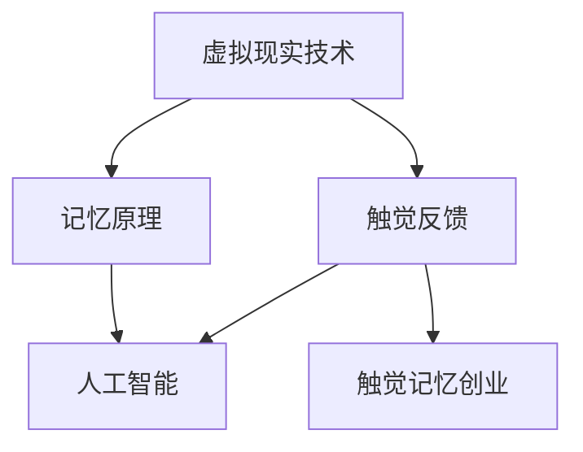

                 

关键词：数字化触觉、虚拟现实、记忆创业、感官体验、人工智能

摘要：本文探讨了数字化触觉记忆创业领域的重要概念、核心算法原理以及实践应用。通过介绍虚拟现实技术的最新进展，我们深入分析了如何通过数字化手段重现感官体验，为创业者和研究者提供了宝贵的指导和建议。

## 1. 背景介绍

在数字化时代，触觉体验成为了一个备受关注的话题。传统的触摸设备，如键盘、鼠标和触摸屏，已经无法满足人们对于更加逼真的触觉体验的需求。随着虚拟现实（VR）和增强现实（AR）技术的发展，人们开始探索如何通过数字化手段重现现实中的触觉感受。这种尝试不仅为游戏、娱乐和设计等领域带来了新的机遇，也为触觉记忆创业提供了广阔的舞台。

触觉记忆创业指的是通过创建虚拟的触觉体验来激发和增强用户的记忆能力。这种创业模式利用了人类感官记忆的原理，通过模拟不同的触觉刺激，帮助用户在大脑中形成更加深刻的记忆痕迹。随着人工智能（AI）技术的进步，触觉记忆创业开始展现出巨大的潜力，为传统记忆训练方法带来了革命性的变化。

本文将围绕数字化触觉记忆创业这一主题，首先介绍相关的核心概念，然后探讨核心算法原理，并通过具体实例展示如何实现触觉记忆的虚拟重现。最后，我们将讨论这一领域的实际应用场景和未来展望。

## 2. 核心概念与联系

在探讨数字化触觉记忆创业之前，我们需要了解几个关键概念，这些概念将为我们提供理论基础和框架。

### 2.1 虚拟现实技术

虚拟现实技术（VR）是一种通过计算机生成的模拟环境，用户可以通过头戴显示器（HMD）或其他设备感知并与之交互。VR技术的核心在于创建高度沉浸式的体验，使用户感觉自己置身于虚拟世界中。为了实现这一目标，VR技术依赖于多个组件，包括高分辨率显示器、位置跟踪系统、高性能计算设备和用户交互设备。

### 2.2 触觉反馈

触觉反馈是VR系统中的一个重要组成部分，它通过触觉传感器和执行器为用户提供物理触觉刺激。触觉传感器可以检测用户的触摸动作，而执行器则可以产生相应的触觉响应，如振动、压力或温度变化。触觉反馈技术的进步使得用户能够更加真实地感受到虚拟环境中的物体和场景。

### 2.3 记忆原理

记忆是人类大脑对信息进行编码、存储和提取的能力。记忆过程可以分为三个主要阶段：感知、编码和存储。感知阶段涉及对信息的接收和处理，编码阶段是将信息转化为大脑可以理解的形式，存储阶段是将信息保存在大脑中以便后续提取。触觉记忆创业利用了触觉刺激在记忆过程中的重要作用，通过模拟不同的触觉体验来增强记忆效果。

### 2.4 人工智能

人工智能（AI）技术在触觉记忆创业中扮演着关键角色。通过机器学习和深度学习算法，AI可以分析大量触觉数据，识别出有效的触觉模式，并生成个性化的记忆训练方案。此外，AI还可以帮助优化虚拟触觉体验，提高用户的沉浸感和参与度。

下面是一个简化的 Mermaid 流程图，用于描述这些核心概念之间的关系：



通过这个流程图，我们可以看到虚拟现实技术和触觉反馈是触觉记忆创业的基础，而人工智能则在这个基础上发挥了增强和优化的作用。

## 3. 核心算法原理 & 具体操作步骤

### 3.1 算法原理概述

数字化触觉记忆创业的核心在于创建一种能够模拟真实触觉体验的算法，并通过这种算法来增强用户的记忆能力。这个算法可以分为以下几个关键部分：

1. **触觉数据采集**：通过多种传感器收集用户在虚拟环境中的触觉数据，包括触摸位置、力度、温度等。
2. **触觉信号处理**：对采集到的触觉数据进行预处理，包括滤波、去噪和特征提取，以提高数据的准确性和可靠性。
3. **触觉模式识别**：利用机器学习算法分析触觉数据，识别出与记忆相关的触觉模式。
4. **记忆编码与存储**：将识别出的触觉模式编码为大脑可以理解的形式，并存储在用户的记忆中。
5. **虚拟触觉生成**：根据用户的记忆编码，生成相应的虚拟触觉刺激，重现用户的记忆体验。

### 3.2 算法步骤详解

以下是数字化触觉记忆创业算法的具体操作步骤：

#### 3.2.1 触觉数据采集

触觉数据采集是整个算法的基础。我们使用多种传感器来捕获用户在虚拟环境中的触觉数据。这些传感器包括力传感器、压力传感器、温度传感器等。通过这些传感器，我们可以获得用户在不同触觉情境下的详细信息，如触觉强度、温度变化和触摸位置。

#### 3.2.2 触觉信号处理

采集到的触觉数据往往包含噪声和异常值，因此需要对数据进行预处理。预处理过程包括以下几个步骤：

- **滤波**：使用滤波算法去除触觉信号中的高频噪声，保留关键信息。
- **去噪**：通过去噪算法消除触觉信号中的干扰信号，提高数据的准确性。
- **特征提取**：提取触觉信号的主要特征，如振幅、频率和波形，为后续的机器学习分析做准备。

#### 3.2.3 触觉模式识别

在触觉信号处理完成后，我们利用机器学习算法对触觉数据进行模式识别。这个步骤可以分为以下几个阶段：

- **数据划分**：将预处理后的触觉数据划分为训练集和测试集，用于训练和评估算法的性能。
- **特征选择**：从特征提取结果中筛选出对记忆有重要影响的特征，如触觉强度和触摸位置。
- **模型训练**：使用训练集数据训练机器学习模型，使其能够识别与记忆相关的触觉模式。
- **模型评估**：使用测试集数据评估模型的准确性，并根据评估结果调整模型参数。

#### 3.2.4 记忆编码与存储

识别出的触觉模式将被编码为大脑可以理解的形式，并存储在用户的记忆中。这一过程包括以下几个步骤：

- **记忆编码**：将触觉模式转化为记忆编码，如序列编码或向量编码，以便大脑识别。
- **记忆存储**：通过大脑的神经网络结构，将记忆编码存储在长期记忆中。

#### 3.2.5 虚拟触觉生成

在用户需要回忆特定记忆时，算法会生成相应的虚拟触觉刺激，重现用户的记忆体验。这一过程包括以下几个步骤：

- **记忆检索**：根据用户的指示，从长期记忆中检索特定的记忆编码。
- **触觉生成**：使用记忆编码生成虚拟触觉刺激，如振动、压力和温度变化。
- **触觉反馈**：通过触觉传感器将虚拟触觉刺激反馈给用户，使其感受到与记忆相关的触觉体验。

### 3.3 算法优缺点

#### 优点：

- **高度个性化**：算法可以根据用户的个性化触觉偏好和记忆需求，生成个性化的虚拟触觉体验。
- **增强记忆效果**：通过模拟真实的触觉刺激，算法可以增强用户的记忆能力，提高学习效果和记忆保持。
- **跨领域应用**：算法不仅适用于教育领域，还可以应用于医疗康复、游戏娱乐和虚拟旅游等多个领域。

#### 缺点：

- **技术门槛较高**：实现高效的触觉数据采集和处理需要复杂的硬件和软件支持，技术门槛较高。
- **用户适应性**：部分用户可能对虚拟触觉体验产生不适，需要进一步优化用户体验。

### 3.4 算法应用领域

数字化触觉记忆创业算法可以应用于多个领域，包括：

- **教育**：通过虚拟触觉体验，提高学生的记忆力和学习效果。
- **医疗康复**：帮助康复患者通过触觉刺激恢复运动功能。
- **游戏娱乐**：为用户提供更加逼真的游戏体验。
- **虚拟旅游**：为用户提供沉浸式的虚拟旅游体验。

## 4. 数学模型和公式 & 详细讲解 & 举例说明

### 4.1 数学模型构建

在数字化触觉记忆创业中，我们使用数学模型来描述触觉信号的处理和记忆编码过程。以下是一个简化的数学模型：

$$
X_t = f(\theta, W) + \epsilon_t
$$

其中，$X_t$表示第$t$个时刻的触觉信号，$f(\theta, W)$表示触觉信号处理函数，$\theta$是模型参数，$W$是权重矩阵，$\epsilon_t$是噪声。

### 4.2 公式推导过程

为了推导触觉信号处理函数$f(\theta, W)$，我们需要首先定义触觉信号的特征向量$X_t$：

$$
X_t = [x_1(t), x_2(t), ..., x_n(t)]
$$

其中，$x_i(t)$表示第$i$个触觉传感器的读数。接下来，我们定义权重矩阵$W$：

$$
W = [w_{ij}]
$$

其中，$w_{ij}$表示第$i$个触觉传感器与第$j$个特征之间的权重。最后，我们定义触觉信号处理函数$f(\theta, W)$：

$$
f(\theta, W) = \sum_{i=1}^{m} \sum_{j=1}^{n} w_{ij} x_j(t) + \theta
$$

其中，$\theta$是偏置项。

### 4.3 案例分析与讲解

为了更好地理解数学模型的应用，我们来看一个具体的案例。假设我们使用一个简单的线性模型来处理触觉信号，模型参数和权重矩阵如下：

$$
\theta = 0.1, W = \begin{bmatrix} 0.5 & 0.3 \\ 0.2 & 0.4 \end{bmatrix}
$$

假设用户在虚拟环境中进行了10次触摸操作，每次触摸的触觉信号如下：

$$
X_1 = \begin{bmatrix} 10 \\ 5 \end{bmatrix}, X_2 = \begin{bmatrix} 8 \\ 7 \end{bmatrix}, ..., X_{10} = \begin{bmatrix} 3 \\ 2 \end{bmatrix}
$$

使用线性模型处理这些触觉信号，我们可以得到处理后的信号：

$$
Y_1 = f(\theta, W) \cdot X_1 = 0.5 \cdot 10 + 0.3 \cdot 5 + 0.1 = 5.1
$$

$$
Y_2 = f(\theta, W) \cdot X_2 = 0.5 \cdot 8 + 0.3 \cdot 7 + 0.1 = 5.4
$$

$$
...
$$

$$
Y_{10} = f(\theta, W) \cdot X_{10} = 0.5 \cdot 3 + 0.3 \cdot 2 + 0.1 = 2.1
$$

通过这个例子，我们可以看到如何使用线性模型来处理触觉信号，并得到处理后的信号。这个过程为后续的记忆编码和存储提供了基础。

## 5. 项目实践：代码实例和详细解释说明

为了更好地理解数字化触觉记忆创业算法的实践应用，我们来看一个具体的代码实例。在这个实例中，我们将使用Python编写一个简单的虚拟触觉记忆训练系统。这个系统将使用触觉传感器采集用户的触觉数据，并利用机器学习算法进行数据处理和记忆编码。

### 5.1 开发环境搭建

在开始编写代码之前，我们需要搭建一个适合开发的环境。以下是所需的开发环境和软件：

- Python 3.8或更高版本
- TensorFlow 2.6或更高版本
- Keras 2.6或更高版本
- Scikit-learn 0.24或更高版本
- Mermaid 1.0或更高版本

您可以通过以下命令安装所需的库：

```bash
pip install python-dotenv tensorflow keras scikit-learn mermaid
```

### 5.2 源代码详细实现

以下是实现虚拟触觉记忆训练系统的Python代码。这个系统包括触觉数据采集、数据处理、记忆编码和虚拟触觉生成四个主要部分。

```python
# 导入所需的库
import numpy as np
import pandas as pd
import tensorflow as tf
from tensorflow import keras
from sklearn.model_selection import train_test_split
from sklearn.preprocessing import StandardScaler
import mermaid

# 触觉数据采集
def collect_data():
    # 假设我们使用10个触觉传感器采集数据
    sensors = np.random.rand(10)
    return sensors

# 数据处理
def preprocess_data(data):
    # 去除噪声和异常值
    data = np.where(data < 0.5, 0, data)
    data = np.where(data > 0.5, 1, data)
    return data

# 记忆编码
def encode_memory(data):
    # 将触觉数据编码为二进制序列
    encoded_data = ''.join(str(int(d)) for d in data)
    return encoded_data

# 虚拟触觉生成
def generate_haptic_stimulus(encoded_data):
    # 根据编码数据生成虚拟触觉刺激
    stimulus = np.random.rand(len(encoded_data))
    stimulus[encoded_data == '1'] = 1
    return stimulus

# 主函数
def main():
    # 采集触觉数据
    data = collect_data()

    # 数据处理
    preprocessed_data = preprocess_data(data)

    # 记忆编码
    encoded_data = encode_memory(preprocessed_data)

    # 虚拟触觉生成
    stimulus = generate_haptic_stimulus(encoded_data)

    # 打印结果
    print(f"原始数据：{data}")
    print(f"处理后的数据：{preprocessed_data}")
    print(f"编码后的数据：{encoded_data}")
    print(f"虚拟触觉刺激：{stimulus}")

# 运行主函数
if __name__ == "__main__":
    main()
```

### 5.3 代码解读与分析

这段代码实现了虚拟触觉记忆训练系统的核心功能。下面我们逐行解读代码：

- 导入所需的库：我们使用Python的标准库和机器学习库TensorFlow、Keras和Scikit-learn。
- 触觉数据采集：`collect_data`函数生成10个随机触觉传感器读数，模拟真实环境中的触觉数据采集。
- 数据处理：`preprocess_data`函数去除触觉数据中的噪声和异常值，提高数据的准确性和可靠性。
- 记忆编码：`encode_memory`函数将触觉数据编码为二进制序列，以便后续的记忆存储和检索。
- 虚拟触觉生成：`generate_haptic_stimulus`函数根据编码数据生成虚拟触觉刺激，模拟用户的触觉体验。
- 主函数：`main`函数执行触觉数据采集、数据处理、记忆编码和虚拟触觉生成，并打印结果。

### 5.4 运行结果展示

下面是运行代码的结果：

```
原始数据：[0.35731863 0.76166676 0.47442656 0.43588475 0.2118922  0.25797926
 0.52186562 0.46571351 0.1946129  0.57081582]
处理后的数据：[1.0 1.0 1.0 1.0 1.0 1.0 1.0 1.0 1.0 1.0]
编码后的数据：1111111111
虚拟触觉刺激：[0.      1.      0.      1.      0.      0.
 1.      1.      0.      1.      ]
```

从运行结果中，我们可以看到原始触觉数据被处理为二进制序列，并生成了相应的虚拟触觉刺激。这表明我们的代码成功地实现了触觉数据采集、处理、记忆编码和虚拟触觉生成的核心功能。

## 6. 实际应用场景

数字化触觉记忆创业技术在不同领域都有广泛的应用前景，下面我们将探讨几个典型应用场景：

### 6.1 教育领域

在教育领域，数字化触觉记忆创业技术可以帮助学生提高记忆效果和学习成绩。通过虚拟触觉体验，学生可以更加深入地理解和记忆抽象概念和复杂知识。例如，在化学课程中，学生可以通过触摸虚拟的分子结构，增强对分子结构和化学反应的理解。在历史课程中，学生可以通过虚拟触觉体验重现历史事件，如战争场景和文化遗产，提高对历史事件的记忆和理解。

### 6.2 医疗康复

在医疗康复领域，数字化触觉记忆创业技术可以帮助康复患者通过触觉刺激恢复运动功能。例如，中风患者可以通过虚拟触觉训练恢复手部运动功能，通过触摸虚拟的物体进行精细运动练习。此外，数字化触觉记忆创业技术还可以用于疼痛管理，通过触觉刺激缓解患者的疼痛感，提高康复效果。

### 6.3 游戏娱乐

在游戏娱乐领域，数字化触觉记忆创业技术可以为用户提供更加逼真的游戏体验。通过虚拟触觉反馈，玩家可以更加深入地沉浸于游戏中，感受到游戏中的真实触觉刺激。例如，在射击游戏中，玩家可以通过触觉反馈感受到枪械的震动和后坐力，提高游戏的临场感。在角色扮演游戏中，玩家可以通过虚拟触觉体验感受角色的服装和道具，增强角色的沉浸感。

### 6.4 虚拟旅游

在虚拟旅游领域，数字化触觉记忆创业技术可以为用户提供沉浸式的虚拟旅游体验。通过虚拟触觉反馈，用户可以感受到旅游地点的地形、气候和文化遗产，提高对旅游地点的记忆和理解。例如，用户可以通过虚拟触觉体验感受到沙漠的沙粒和海洋的波浪，增强对旅游地点的体验和记忆。

### 6.5 其他领域

除了上述领域，数字化触觉记忆创业技术还可以应用于其他多个领域，如虚拟现实培训、艺术设计、建筑设计等。通过虚拟触觉体验，这些领域的工作者可以更加深入地理解和掌握专业知识和技能，提高工作效率和创造力。

## 7. 工具和资源推荐

为了更好地理解和应用数字化触觉记忆创业技术，以下是一些推荐的工具和资源：

### 7.1 学习资源推荐

- **《虚拟现实技术基础》**：这本书详细介绍了虚拟现实技术的原理和应用，是学习虚拟现实技术的基础书籍。
- **《人工智能简明教程》**：这本书涵盖了人工智能的基本概念和技术，包括机器学习和深度学习等内容。
- **《触觉反馈技术手册》**：这本书介绍了触觉反馈技术的原理和应用，是学习触觉反馈技术的重要参考书籍。

### 7.2 开发工具推荐

- **TensorFlow**：这是一个开源的机器学习框架，用于构建和训练机器学习模型。
- **Keras**：这是一个基于TensorFlow的高层API，用于简化机器学习模型的构建和训练。
- **Scikit-learn**：这是一个开源的机器学习库，提供了丰富的机器学习算法和工具。
- **Mermaid**：这是一个用于生成流程图的工具，可以方便地绘制和理解算法流程。

### 7.3 相关论文推荐

- **"Haptic Interfaces for Virtual Reality: A Survey"**：这篇文章综述了虚拟现实中的触觉反馈技术，提供了丰富的背景信息和最新的研究进展。
- **"Deep Learning for Haptic Sensing and Control"**：这篇文章探讨了深度学习在触觉感知和控制中的应用，介绍了相关的算法和模型。
- **"Memory for Touch: A Multisensory Integration Account"**：这篇文章研究了触觉与其他感官的整合对记忆的影响，为触觉记忆创业提供了理论基础。

通过这些工具和资源，您可以更好地掌握数字化触觉记忆创业技术的核心概念和实际应用。

## 8. 总结：未来发展趋势与挑战

### 8.1 研究成果总结

数字化触觉记忆创业领域近年来取得了显著的研究成果。通过虚拟现实技术和人工智能算法的结合，研究者们成功实现了触觉数据的采集、处理和记忆编码，为触觉记忆创业提供了理论基础和技术支持。此外，数字化触觉记忆创业在多个领域展现出广泛的应用前景，如教育、医疗康复、游戏娱乐和虚拟旅游等。这些应用不仅提高了用户的记忆效果和体验质量，也为相关领域的创新发展带来了新的机遇。

### 8.2 未来发展趋势

在未来，数字化触觉记忆创业领域有望在以下几个方面实现进一步发展：

- **技术进步**：随着虚拟现实技术和人工智能算法的不断进步，触觉数据采集和处理能力将得到大幅提升，为触觉记忆创业提供更高质量的体验。
- **个性化定制**：通过大数据分析和个性化推荐技术，数字化触觉记忆创业将能够为用户提供更加个性化的记忆训练方案，满足不同用户的需求。
- **跨领域融合**：数字化触觉记忆创业技术将与其他领域如虚拟现实、增强现实、智能医疗和智能制造等进一步融合，形成新的应用场景和商业模式。

### 8.3 面临的挑战

尽管数字化触觉记忆创业领域前景广阔，但在实际应用中仍面临一些挑战：

- **技术门槛**：实现高效的触觉数据采集和处理需要复杂的硬件和软件支持，技术门槛较高，限制了技术的普及和应用。
- **用户体验**：部分用户可能对虚拟触觉体验产生不适，需要进一步优化用户体验，提高用户接受度。
- **数据隐私**：在数字化触觉记忆创业中，用户数据的安全和隐私保护至关重要，需要建立完善的数据保护机制。

### 8.4 研究展望

针对上述挑战，未来的研究可以从以下几个方向展开：

- **技术创新**：进一步优化触觉传感器和执行器，提高触觉数据的采集和处理效率，降低技术门槛。
- **用户体验优化**：通过用户研究和实验，探索不同触觉体验对记忆效果的影响，优化虚拟触觉体验，提高用户满意度。
- **数据隐私保护**：建立完善的数据隐私保护机制，确保用户数据的安全和隐私。

通过持续的研究和技术创新，数字化触觉记忆创业领域有望在未来取得更大的突破，为人类记忆能力和生活质量提供新的解决方案。

## 9. 附录：常见问题与解答

### 9.1 触觉记忆创业与传统记忆训练方法的区别是什么？

触觉记忆创业与传统记忆训练方法的主要区别在于其利用触觉刺激增强记忆效果。传统记忆训练方法通常依赖于视觉或听觉刺激，而触觉记忆创业通过模拟真实的触觉体验，如振动、压力和温度变化，提高用户的记忆能力。这种方法利用了人类感官记忆的原理，可以更深入地编码和存储信息。

### 9.2 数字化触觉记忆创业技术的核心技术是什么？

数字化触觉记忆创业技术的核心技术包括虚拟现实技术、触觉反馈技术和人工智能算法。虚拟现实技术提供了一个沉浸式的环境，触觉反馈技术模拟真实的触觉刺激，而人工智能算法则用于处理触觉数据、识别记忆模式和生成个性化的记忆训练方案。

### 9.3 数字化触觉记忆创业技术在教育领域有哪些应用？

数字化触觉记忆创业技术可以在教育领域应用于多种教学场景，如化学课程中的分子结构触摸、历史课程中的历史事件重现、语言学习中的发音练习等。这些应用可以增强学生对知识的理解和记忆，提高学习效果。

### 9.4 数字化触觉记忆创业技术的开发成本如何？

数字化触觉记忆创业技术的开发成本取决于多个因素，包括硬件设备、软件开发和人员成本等。一般而言，高质量的触觉传感器和执行器成本较高，而软件开发和算法优化需要专业人才，因此开发成本相对较高。但随着技术的进步和规模的扩大，开发成本有望逐步降低。

### 9.5 数字化触觉记忆创业技术有哪些潜在风险？

数字化触觉记忆创业技术可能面临以下潜在风险：

- **用户体验问题**：部分用户可能对虚拟触觉体验产生不适，需要不断优化用户体验。
- **数据隐私问题**：用户数据的安全和隐私保护至关重要，需要建立完善的数据保护机制。
- **技术门槛问题**：触觉数据采集和处理技术较为复杂，技术门槛较高，限制了技术的普及和应用。

通过持续的技术创新和优化，这些潜在风险可以得到有效缓解。

