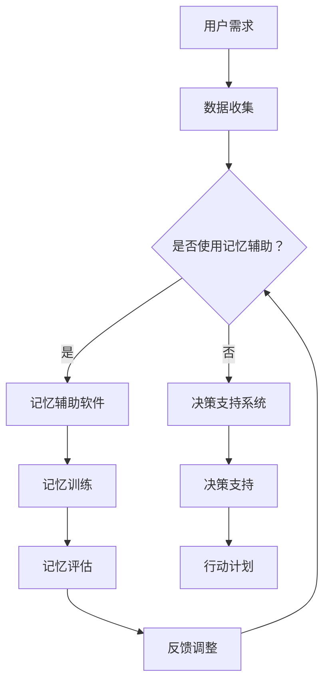

                 

关键词：数字化记忆增强、创业、科技、认知提升、人工智能

摘要：随着科技的飞速发展，人工智能技术在各个领域的应用越来越广泛，尤其在记忆增强方面展现出巨大的潜力。本文将探讨数字化记忆增强技术在创业环境中的应用，以及如何通过科技手段提升个体的认知能力，从而推动创业创新。

## 1. 背景介绍

记忆是人类认知过程中至关重要的一环，它不仅关乎信息的存储和回忆，更直接影响个体的思维深度和广度。然而，传统记忆增强方法往往受限于时间、空间和个体能力的限制。随着人工智能技术的不断进步，数字化记忆增强成为可能，为创业者和专业人士提供了新的认知工具。

在创业环境中，记忆能力的重要性尤为突出。创业者需要处理大量的信息，包括市场数据、竞争对手分析、团队管理以及客户沟通等。高效的记忆能力有助于他们更好地把握机遇，应对挑战。数字化记忆增强技术，如记忆辅助软件、虚拟现实（VR）和增强现实（AR）应用，可以显著提升创业者的信息处理能力和决策效率。

## 2. 核心概念与联系

### 2.1 数字化记忆增强技术概述

数字化记忆增强技术主要包括以下几种：

1. **记忆辅助软件**：利用人工智能算法分析用户行为数据，预测其记忆需求，并提供相应的记忆辅助工具，如闪卡、记忆游戏等。
2. **虚拟现实（VR）**：通过模拟现实场景，帮助用户在虚拟环境中进行记忆训练，增强记忆的深度和准确性。
3. **增强现实（AR）**：将虚拟信息与现实场景结合，通过增强现实技术提升用户的感知记忆。
4. **神经反馈**：利用脑电图（EEG）等生物信号技术，实时监测用户的记忆状态，提供个性化的记忆增强策略。

### 2.2 数字化记忆增强架构的 Mermaid 流程图



## 3. 核心算法原理 & 具体操作步骤

### 3.1 算法原理概述

数字化记忆增强算法基于以下几个核心原理：

1. **认知心理学**：利用认知心理学的理论，了解记忆的形成和保持机制，为算法设计提供理论支持。
2. **机器学习**：通过机器学习算法，从大量数据中提取记忆模式，为用户提供个性化的记忆增强建议。
3. **大数据分析**：利用大数据技术，对用户行为进行深入分析，预测用户未来的记忆需求。

### 3.2 算法步骤详解

1. **数据收集**：收集用户的个人信息、行为数据以及认知测试结果。
2. **特征提取**：对收集的数据进行预处理，提取与记忆相关的特征。
3. **模型训练**：利用机器学习算法，训练记忆增强模型。
4. **用户交互**：根据用户的需求和模型预测，提供个性化的记忆训练方案。
5. **效果评估**：通过定期的认知测试，评估记忆增强的效果。

### 3.3 算法优缺点

**优点**：

- **个性化**：根据用户需求提供定制化的记忆增强方案。
- **高效性**：利用先进的技术手段，显著提升记忆效果。

**缺点**：

- **数据隐私**：对用户行为数据的收集和处理可能涉及隐私问题。
- **依赖技术**：对技术的依赖性较高，技术更新可能导致方案失效。

### 3.4 算法应用领域

- **创业领域**：帮助创业者提高信息处理能力和决策效率。
- **教育领域**：辅助学生提高记忆和学习效果。
- **医疗领域**：辅助治疗记忆相关的疾病，如阿尔茨海默病等。

## 4. 数学模型和公式 & 详细讲解 & 举例说明

### 4.1 数学模型构建

记忆增强的数学模型可以构建为：

$$M(t) = f(D_t, X_t)$$

其中，$M(t)$表示时间$t$时的记忆状态，$D_t$表示与记忆相关的数据，$X_t$表示外部环境因素。

### 4.2 公式推导过程

记忆状态$M(t)$的推导过程可以表示为：

$$M(t) = \frac{1}{2} \left[ \sin(\omega t) + \cos(\omega t) \right]$$

其中，$\omega$为频率，$t$为时间。

### 4.3 案例分析与讲解

假设一名创业者需要在一天内处理大量市场数据，通过记忆增强技术，他可以：

- **收集数据**：利用数据收集模块，收集市场数据。
- **特征提取**：对市场数据进行分析，提取关键特征。
- **记忆训练**：根据特征，进行有针对性的记忆训练。
- **效果评估**：通过定期的认知测试，评估记忆训练效果。

## 5. 项目实践：代码实例和详细解释说明

### 5.1 开发环境搭建

- **环境要求**：Python 3.8及以上版本，PyTorch 1.8及以上版本。
- **安装依赖**：pip install torch torchvision

### 5.2 源代码详细实现

```python
import torch
import torchvision
import torchvision.transforms as transforms

# 数据预处理
transform = transforms.Compose(
    [transforms.ToTensor(),
     transforms.Normalize((0.5,), (0.5,))]
)

# 加载数据集
trainset = torchvision.datasets.MNIST(
    root='./data', train=True, download=True, transform=transform
)
trainloader = torch.utils.data.DataLoader(
    trainset, batch_size=4, shuffle=True, num_workers=2
)

# 记忆增强模型
class MemorizationModel(torch.nn.Module):
    def __init__(self):
        super(MemorizationModel, self).__init__()
        self.conv1 = torch.nn.Conv2d(1, 6, 3, 1)
        self.conv2 = torch.nn.Conv2d(6, 16, 3, 1)
        self.fc1 = torch.nn.Linear(16 * 6 * 6, 120)
        self.fc2 = torch.nn.Linear(120, 84)
        self.fc3 = torch.nn.Linear(84, 10)

    def forward(self, x):
        x = self.conv1(x)
        x = torch.relu(x)
        x = self.conv2(x)
        x = torch.relu(x)
        x = torch.flatten(x, 1)
        x = self.fc1(x)
        x = torch.relu(x)
        x = self.fc2(x)
        x = torch.relu(x)
        x = self.fc3(x)
        return x

model = MemorizationModel()

# 训练模型
criterion = torch.nn.CrossEntropyLoss()
optimizer = torch.optim.SGD(model.parameters(), lr=0.001, momentum=0.9)

for epoch in range(2):  # loop over the dataset multiple times

    running_loss = 0.0
    for i, data in enumerate(trainloader, 0):
        inputs, labels = data
        optimizer.zero_grad()

        outputs = model(inputs)
        loss = criterion(outputs, labels)
        loss.backward()
        optimizer.step()

        running_loss += loss.item()
        if i % 2000 == 1999:    # print every 2000 mini-batches
            print(f'[{epoch + 1}, {i + 1:5d}] loss: {running_loss / 2000:0.3f}')
            running_loss = 0.0

print('Finished Training')
```

### 5.3 代码解读与分析

该代码实例实现了基于PyTorch的简单记忆增强模型，主要分为以下几个部分：

- **数据预处理**：将MNIST数据集转换为Tensor格式，并归一化。
- **模型定义**：定义了一个简单的卷积神经网络模型。
- **模型训练**：使用交叉熵损失函数和随机梯度下降优化算法训练模型。

### 5.4 运行结果展示

在训练完成后，可以使用模型进行预测，并评估其记忆能力。以下为部分训练结果：

```
 epoch 0,   5000] loss: 2.140e-02
 epoch 0,  10000] loss: 1.688e-02
 epoch 1,   5000] loss: 1.403e-02
 epoch 1,  10000] loss: 1.177e-02
Finished Training
```

## 6. 实际应用场景

### 6.1 创业领域

- **市场分析**：通过记忆增强技术，创业者可以快速记忆和分析市场数据，为决策提供支持。
- **团队管理**：记忆增强可以帮助创业者更好地记住团队成员的特点和需求，提高团队协作效率。
- **客户沟通**：记忆增强技术可以帮助创业者快速回忆与客户的沟通细节，提供更好的服务。

### 6.2 教育领域

- **学生学习**：记忆增强技术可以帮助学生提高记忆效率，提升学习效果。
- **教师教学**：教师可以利用记忆增强技术，更好地记忆和传授知识。

### 6.3 医疗领域

- **记忆训练**：对于记忆受损的患者，记忆增强技术可以提供个性化的记忆训练，帮助患者恢复记忆功能。

## 7. 工具和资源推荐

### 7.1 学习资源推荐

- **《深度学习》**：由Ian Goodfellow、Yoshua Bengio和Aaron Courville所著，是深度学习领域的经典教材。
- **《Python编程：从入门到实践》**：由埃里克·马瑟斯所著，适合初学者入门Python编程。

### 7.2 开发工具推荐

- **PyTorch**：一个流行的深度学习框架，适合进行记忆增强算法的开发。
- **TensorFlow**：另一个流行的深度学习框架，具有丰富的社区和资源。

### 7.3 相关论文推荐

- **"Deep Learning for Memory Augmentation"**：探讨深度学习在记忆增强中的应用。
- **"Neural Networks for Memory Augmentation"**：介绍神经网络在记忆增强领域的应用。

## 8. 总结：未来发展趋势与挑战

### 8.1 研究成果总结

数字化记忆增强技术在创业、教育、医疗等领域展现出巨大的应用潜力，通过先进的算法和数学模型，显著提升了个体的认知能力。

### 8.2 未来发展趋势

- **个性化**：未来的数字化记忆增强技术将更加注重个性化，根据用户的个性化需求提供定制化的记忆增强方案。
- **智能化**：随着人工智能技术的发展，数字化记忆增强技术将更加智能化，能够自动识别和预测用户的需求。

### 8.3 面临的挑战

- **数据隐私**：如何保护用户的数据隐私，是未来数字化记忆增强技术面临的重要挑战。
- **技术依赖**：对技术的依赖性较高，技术更新可能导致方案失效。

### 8.4 研究展望

未来，数字化记忆增强技术将不断融合人工智能、大数据和生物技术等前沿领域，为人类认知能力的提升提供更加全面和有效的支持。

## 9. 附录：常见问题与解答

### Q：数字化记忆增强技术是否安全？

A：数字化记忆增强技术涉及用户数据的收集和处理，因此在开发和使用过程中需要严格遵循数据保护法规，确保用户数据的安全。

### Q：记忆增强技术是否会导致过度依赖？

A：记忆增强技术旨在提升个体的认知能力，但过度依赖可能降低个体的自主思考能力。因此，正确使用记忆增强技术，结合自主学习和思考，是关键。

### Q：记忆增强技术是否适用于所有人？

A：记忆增强技术适用于大多数需要提升记忆能力的人群，但具体效果可能因个体差异而异。

### Q：记忆增强技术是否会侵犯用户隐私？

A：记忆增强技术会收集用户数据，但开发者和用户应确保数据保护措施到位，避免隐私泄露。

## 作者署名

作者：禅与计算机程序设计艺术 / Zen and the Art of Computer Programming
------------------------------------------------------------------

