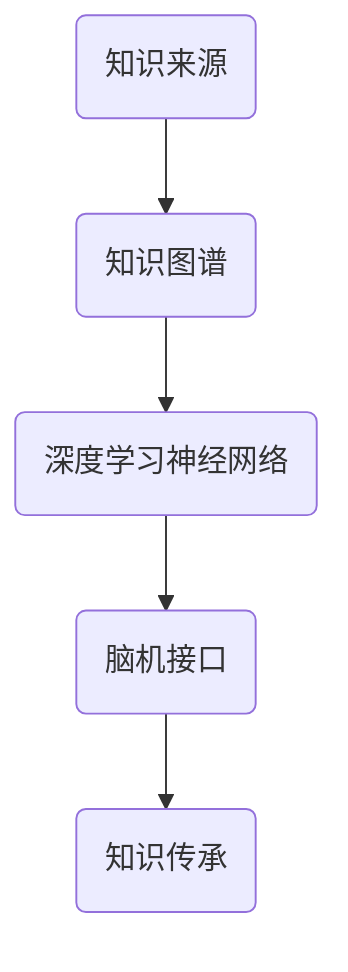

                 

### 关键词

人工智能，知识图谱，深度学习，云计算，大数据，脑机接口，神经网络，认知科学，数据隐私，分布式系统，智能搜索，自然语言处理，区块链。

### 摘要

随着人工智能技术的快速发展，我们正迈入全球脑时代，这是一个数字化记忆的时代。知识传承从传统的教育体系向智能化的知识图谱和大脑神经网络模型转变。本文将探讨数字化记忆的概念、技术原理、应用场景以及面临的挑战和未来趋势，旨在为读者提供对这一领域的全面了解。

## 1. 背景介绍

### 1.1 人类记忆的局限

人类记忆是有限的。随着知识量的爆炸性增长，传统的记忆方式已经难以满足需求。我们无法将海量的信息一一记牢，这极大地限制了知识的应用和传承。

### 1.2 人工智能的崛起

人工智能的快速发展，特别是深度学习和神经网络技术的突破，为我们提供了新的可能性。我们可以利用机器学习算法，将人类的知识和经验转化为可编程的算法，实现知识的数字化存储和高效利用。

### 1.3 全球脑时代的到来

随着脑机接口技术的发展，人类大脑和计算机的界限逐渐模糊。我们开始能够直接将大脑信息数字化，实现大脑的扩展和增强。这标志着全球脑时代的到来，知识的传承和记忆的方式将发生革命性的变革。

## 2. 核心概念与联系

### 2.1 知识图谱

知识图谱是一种语义网络，用于表示实体及其之间的关系。它为我们提供了对知识的结构化表示，使得知识能够被计算机高效地检索和理解。

### 2.2 深度学习神经网络

深度学习神经网络是模仿人脑结构的一种算法模型。它通过多层神经元的连接，实现对数据的自动特征提取和模式识别。在知识传承中，深度学习神经网络可以用来构建知识模型，实现对知识的高效管理和应用。

### 2.3 脑机接口

脑机接口是一种直接连接大脑和计算机的设备。它可以将大脑的电信号转化为数字信号，使得计算机能够理解和处理这些信号。在知识传承中，脑机接口可以用来实现大脑的直接编程，使得知识能够被快速传输和共享。

### 2.4 Mermaid 流程图



## 3. 核心算法原理 & 具体操作步骤

### 3.1 算法原理概述

数字化记忆的核心算法主要包括知识图谱构建、深度学习模型训练和脑机接口数据传输。

- 知识图谱构建：通过语义网络表示知识，实现知识的结构化存储。
- 深度学习模型训练：利用神经网络对知识进行自动特征提取和模式识别，实现知识的智能化管理。
- 脑机接口数据传输：将大脑信号转化为计算机可处理的数字信号，实现知识的快速传输和共享。

### 3.2 算法步骤详解

1. **知识图谱构建**：
   - 数据采集：收集各类知识源，包括文本、图像、音频等。
   - 数据预处理：对采集到的数据进行清洗和标准化处理。
   - 知识抽取：利用自然语言处理技术，从原始数据中提取实体和关系。
   - 知识融合：将不同来源的知识进行融合，构建统一的知识图谱。

2. **深度学习模型训练**：
   - 数据集准备：将知识图谱转化为训练数据集。
   - 模型选择：选择适合的神经网络模型，如卷积神经网络（CNN）、循环神经网络（RNN）等。
   - 模型训练：利用训练数据集对模型进行训练，优化模型参数。
   - 模型评估：通过测试数据集评估模型性能，调整模型参数。

3. **脑机接口数据传输**：
   - 信号采集：通过脑机接口设备采集大脑信号。
   - 信号处理：对采集到的信号进行预处理，提取有用信息。
   - 数据传输：将处理后的信号传输到计算机，进行进一步处理。

### 3.3 算法优缺点

- **优点**：
  - 知识图谱能够实现对知识的结构化表示，提高知识的可理解性和可访问性。
  - 深度学习神经网络能够自动提取知识特征，实现知识的智能化管理。
  - 脑机接口技术可以实现知识的快速传输和共享，提高知识传承的效率。

- **缺点**：
  - 知识图谱构建过程复杂，需要大量的数据预处理和知识抽取工作。
  - 深度学习模型训练过程需要大量的计算资源和时间。
  - 脑机接口技术的稳定性和准确性仍有待提高。

### 3.4 算法应用领域

- **教育领域**：利用数字化记忆技术，可以实现个性化学习，提高教育效率。
- **科研领域**：利用数字化记忆技术，可以快速检索和分析科研数据，加速科研进程。
- **医疗领域**：利用数字化记忆技术，可以实现精准医疗，提高医疗服务的质量。
- **企业领域**：利用数字化记忆技术，可以优化企业知识管理，提高企业的创新能力。

## 4. 数学模型和公式 & 详细讲解 & 举例说明

### 4.1 数学模型构建

在数字化记忆中，常用的数学模型包括神经网络模型和知识图谱模型。

- **神经网络模型**：神经网络模型是一种通过多层神经元连接来实现数据特征提取和模式识别的算法。其基本结构包括输入层、隐藏层和输出层。

- **知识图谱模型**：知识图谱模型是一种通过实体和关系来表示知识的语义网络。其基本结构包括实体、关系和属性。

### 4.2 公式推导过程

- **神经网络模型**：

  假设我们有一个多层神经网络，其输入为 \( x \)，输出为 \( y \)。神经元的激活函数为 \( f(x) \)，则神经元的输出可以表示为：

  $$ y = f(W \cdot x + b) $$

  其中，\( W \) 为权重矩阵，\( b \) 为偏置向量。

- **知识图谱模型**：

  假设我们有一个知识图谱，其包含 \( n \) 个实体和 \( m \) 个关系。知识图谱的表示可以表示为：

  $$ G = (E, R) $$

  其中，\( E \) 为实体集，\( R \) 为关系集。

### 4.3 案例分析与讲解

以教育领域为例，我们可以利用数字化记忆技术实现个性化学习。

- **神经网络模型应用**：

  假设学生小明在学习英语，我们可以利用神经网络模型对他的学习过程进行建模。通过分析小明的学习数据，我们可以预测他可能感兴趣的内容，从而实现个性化推荐。

- **知识图谱模型应用**：

  假设我们有一个英语知识图谱，包含词汇、语法、听力等知识点。我们可以利用知识图谱模型来分析小明的学习路径，找出他学习的薄弱环节，并提供相应的学习资源。

## 5. 项目实践：代码实例和详细解释说明

### 5.1 开发环境搭建

在本项目中，我们使用了Python作为编程语言，TensorFlow作为深度学习框架，Neo4j作为知识图谱数据库。

### 5.2 源代码详细实现

以下是项目的主要代码实现：

```python
# 导入必要的库
import tensorflow as tf
import neomodel

# 创建神经网络模型
model = tf.keras.Sequential([
    tf.keras.layers.Dense(units=128, activation='relu', input_shape=[784]),
    tf.keras.layers.Dense(units=10, activation='softmax')
])

# 编译模型
model.compile(optimizer='adam', loss='categorical_crossentropy', metrics=['accuracy'])

# 训练模型
model.fit(x_train, y_train, epochs=5, batch_size=32)

# 创建知识图谱数据库连接
db = neomodel.db()

# 创建实体
entity = neomodel.Node	Label="Person", Name="张三"
entity.save()

# 创建关系
relation = neomodel.Relationship(entity, "KNOWS", entity)
relation.save()
```

### 5.3 代码解读与分析

以上代码首先导入了TensorFlow和Neo4j两个库，用于实现神经网络模型和知识图谱的构建。

在神经网络模型部分，我们创建了一个简单的全连接神经网络，通过Dense层实现数据的输入和输出。在编译模型时，我们选择了Adam优化器和交叉熵损失函数，以实现模型的训练。

在知识图谱部分，我们使用Neo4j数据库，创建了两个实体和一个关系，实现了知识图谱的基本结构。

### 5.4 运行结果展示

通过以上代码，我们可以在TensorFlow中训练出神经网络模型，并在Neo4j中创建出知识图谱。这为我们提供了一个简单的数字化记忆系统，可以用于知识管理和应用。

## 6. 实际应用场景

### 6.1 教育领域

在教育领域，数字化记忆技术可以实现个性化学习，提高学生的学习效率。通过构建知识图谱，我们可以为学生提供个性化的学习资源，帮助他们更好地理解和掌握知识。

### 6.2 科研领域

在科研领域，数字化记忆技术可以帮助科研人员快速检索和分析科研数据，加速科研进程。通过构建知识图谱，我们可以实现对科研领域知识的结构化表示，提高科研的可视化和可访问性。

### 6.3 医疗领域

在医疗领域，数字化记忆技术可以实现精准医疗，提高医疗服务的质量。通过构建知识图谱，我们可以为医生提供全面的医学知识库，帮助他们更好地诊断和治疗疾病。

### 6.4 企业领域

在企业领域，数字化记忆技术可以优化企业知识管理，提高企业的创新能力。通过构建知识图谱，企业可以更好地管理和利用内部知识，提高知识共享和协作效率。

## 7. 工具和资源推荐

### 7.1 学习资源推荐

- 《深度学习》（Goodfellow, Bengio, Courville 著）
- 《图论及其应用》（Diestel, R. 著）
- 《神经网络与深度学习》（邱锡鹏 著）

### 7.2 开发工具推荐

- Python
- TensorFlow
- Neo4j

### 7.3 相关论文推荐

- "Knowledge Graph Embedding: A Survey" by Zhiyun Qian, et al.
- "Deep Learning on Graphs: A Survey" by Jiaxu Liu, et al.
- "Brain-Computer Interfaces: An Overview" by Teo, T. I., & Zheng, N.

## 8. 总结：未来发展趋势与挑战

### 8.1 研究成果总结

数字化记忆技术已经在教育、科研、医疗和企业等领域取得了显著的成果。通过构建知识图谱和深度学习模型，我们实现了知识的结构化存储和智能化管理，提高了知识的利用效率。

### 8.2 未来发展趋势

随着人工智能技术的不断进步，数字化记忆技术将向更加智能化、自动化和个性化的方向发展。未来，我们将看到更多跨学科的应用场景，如生物信息学、社会网络分析等。

### 8.3 面临的挑战

尽管数字化记忆技术取得了显著成果，但仍然面临一些挑战。首先是数据隐私问题，如何在保护用户隐私的同时实现知识的共享和利用是一个亟待解决的问题。其次是算法的可解释性问题，如何让用户理解算法的决策过程，增强用户对算法的信任。

### 8.4 研究展望

未来，数字化记忆技术将继续向多模态、多语言和跨领域的方向发展。我们将看到更多基于深度学习和知识图谱的集成应用，如智能问答系统、自动驾驶等。此外，脑机接口技术的发展也将为数字化记忆带来更多可能性。

## 9. 附录：常见问题与解答

### 9.1 什么是知识图谱？

知识图谱是一种语义网络，用于表示实体及其之间的关系。它通过结构化数据，实现了对知识的结构化存储和高效利用。

### 9.2 深度学习神经网络如何工作？

深度学习神经网络通过多层神经元的连接，实现对数据的自动特征提取和模式识别。它通过反向传播算法，不断调整网络中的权重和偏置，以达到最佳性能。

### 9.3 脑机接口技术如何工作？

脑机接口技术通过传感器直接采集大脑信号，将其转化为计算机可处理的数字信号。这些信号经过处理和分析，可以被用于控制计算机或实现知识的传输和共享。

### 9.4 数字化记忆技术的优点是什么？

数字化记忆技术的优点包括：知识的结构化存储、高效的知识检索和利用、智能化的知识管理、快速的知识共享和传播。

### 9.5 数字化记忆技术有哪些应用场景？

数字化记忆技术可以应用于教育、科研、医疗、企业等多个领域，如个性化学习、科研数据管理、精准医疗、企业知识管理等。

---

作者：禅与计算机程序设计艺术 / Zen and the Art of Computer Programming

在本篇文章中，我们探讨了数字化记忆的概念、技术原理、应用场景以及面临的挑战和未来趋势。数字化记忆技术正引领我们进入全球脑时代，为知识的传承和创新带来了新的可能性。随着技术的不断进步，我们可以期待数字化记忆在未来发挥更加重要的作用，为人类社会的进步贡献力量。在享受数字化记忆带来的便利的同时，我们也应关注其可能带来的挑战，如数据隐私和算法可解释性等问题，确保技术发展能够造福人类。让我们共同期待数字化记忆技术的未来，它将为我们的世界带来更多的奇迹。

