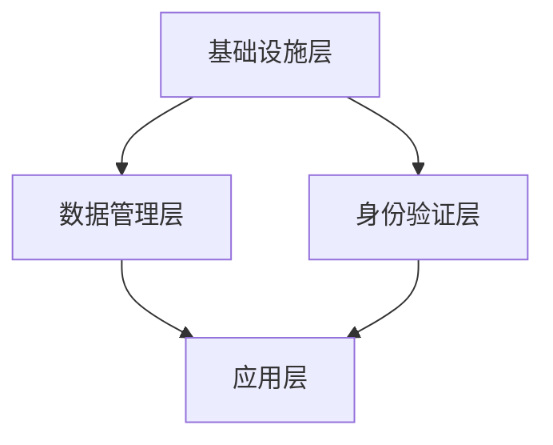

                 

关键词：数字化身份，人工智能，自我认知，AI伦理，隐私保护，区块链，身份验证，数据安全。

> 摘要：随着人工智能技术的发展，数字化身份正在成为现代社会不可或缺的一部分。本文将探讨AI时代的自我认知，分析数字化身份的核心概念、技术架构、算法原理以及实际应用，同时讨论未来发展趋势和面临的挑战。

## 1. 背景介绍

在过去的几十年中，信息技术的发展推动了数字化时代的到来。从电子邮件到社交媒体，从电子商务到在线教育，数字化已经深入到我们生活的方方面面。然而，随着技术的进步，特别是在人工智能（AI）领域，我们的身份正在以一种全新的方式被定义和重塑。数字化身份不仅关乎个人数据的安全和隐私，也关乎社会信任和互动方式的变革。

AI技术的快速发展，使得个性化服务、自动化决策、智能推荐等应用日益普及。在这个过程中，数字化身份作为一个关键的要素，正在发挥着至关重要的作用。它不仅帮助我们实现个性化的用户体验，还成为企业和政府进行身份验证和授权的重要工具。

然而，数字化身份的普及也带来了一系列新的挑战，包括隐私保护、数据安全、AI伦理等问题。因此，如何构建一个安全、可信的数字化身份体系，已经成为当前信息技术领域的重要研究课题。

## 2. 核心概念与联系

### 2.1 数字化身份的定义

数字化身份，是指通过数字技术对个人或实体身份进行标识、验证和管理的一种方式。它通常包括以下几个关键要素：

- **标识**：通过唯一的标识符（如用户名、邮箱、手机号码等）对个人或实体进行识别。
- **验证**：通过密码、生物特征（如指纹、虹膜等）或双重验证等方式确认用户的身份。
- **管理**：对用户身份信息进行存储、更新和管理。

### 2.2 数字化身份与AI技术的联系

数字化身份与AI技术密切相关，主要体现在以下几个方面：

- **数据驱动**：AI技术的发展依赖于大量的数据，而数字化身份为我们提供了一个便捷的数据收集和管理平台。
- **个性化服务**：通过AI技术，可以根据用户的数字化身份数据提供个性化的服务和建议。
- **自动化决策**：AI算法可以根据用户的数字化身份数据做出自动化决策，如信用评分、风险控制等。

### 2.3 数字化身份的架构

数字化身份的架构通常包括以下几个层次：

- **基础设施层**：包括数据中心、服务器、网络等基础硬件设施。
- **数据管理层**：负责存储、处理和保护用户身份数据。
- **身份验证层**：包括各种身份验证技术，如密码、生物特征识别等。
- **应用层**：为用户提供具体的应用服务，如在线购物、社交媒体等。

下面是数字化身份架构的Mermaid流程图：



## 3. 核心算法原理 & 具体操作步骤

### 3.1 算法原理概述

数字化身份的核心算法主要涉及密码学、数据加密和身份验证等方面。以下是一些常见的算法原理：

- **加密算法**：如AES、RSA等，用于保护用户数据的机密性。
- **哈希算法**：如SHA-256、MD5等，用于生成唯一的数据摘要。
- **身份验证协议**：如OAuth 2.0、OpenID Connect等，用于实现安全的身份验证。

### 3.2 算法步骤详解

以下是数字化身份算法的基本操作步骤：

1. **数据加密**：使用加密算法对用户数据进行加密，确保数据在传输和存储过程中的安全性。
2. **身份验证**：使用哈希算法生成用户数据的摘要，并与存储的摘要进行比对，验证用户身份。
3. **授权管理**：根据用户的身份和权限，为用户提供相应的访问权限和服务。

### 3.3 算法优缺点

**优点**：

- **安全性高**：通过加密算法和身份验证协议，确保用户数据的机密性和完整性。
- **便捷性**：通过数字化身份，用户可以方便地访问各种在线服务。

**缺点**：

- **数据泄露风险**：如果加密算法或身份验证协议被破解，可能会导致用户数据泄露。
- **隐私问题**：数字化身份的普及可能会导致用户隐私泄露的问题。

### 3.4 算法应用领域

数字化身份算法广泛应用于以下几个方面：

- **电子商务**：确保在线购物的安全性。
- **社交媒体**：实现用户的身份验证和授权。
- **金融领域**：用于信用评分、风险控制等。

## 4. 数学模型和公式 & 详细讲解 & 举例说明

### 4.1 数学模型构建

数字化身份的数学模型主要涉及密码学中的加密算法、哈希算法和身份验证协议。以下是一个简化的数学模型：

- **加密模型**：使用加密算法 \(E\) 和解密算法 \(D\)，保证数据在传输和存储过程中的安全性。
  \[ E_{k}(m) = c \]
  \[ D_{k}(c) = m \]
  其中，\(k\) 是加密密钥，\(m\) 是明文数据，\(c\) 是密文数据。

- **哈希模型**：使用哈希算法 \(H\) 生成数据的唯一摘要。
  \[ H(m) = h \]
  其中，\(m\) 是输入数据，\(h\) 是哈希值。

- **身份验证模型**：使用身份验证协议，如OAuth 2.0，确保用户身份的合法性。
  \[ A = B \]
  其中，\(A\) 和 \(B\) 分别是客户端和服务端生成的验证令牌。

### 4.2 公式推导过程

假设有一个加密算法 \(E\) 和解密算法 \(D\)，为了确保数据的安全性，我们需要证明对于任意密钥 \(k\)，加密和解密过程是可逆的。

**加密过程**：
\[ E_{k}(m) = c \]
其中，\(m\) 是明文数据，\(c\) 是密文数据。

**解密过程**：
\[ D_{k}(c) = m \]
其中，\(c\) 是密文数据，\(m\) 是明文数据。

为了证明加密和解密过程是可逆的，我们需要证明 \(E_{k}(D_{k}(c)) = c\) 和 \(D_{k}(E_{k}(m)) = m\)。

\[
E_{k}(D_{k}(c)) = E_{k}(m) = c
\]

\[
D_{k}(E_{k}(m)) = D_{k}(c) = m
\]

因此，加密和解密过程是可逆的。

### 4.3 案例分析与讲解

假设有一个用户A想要访问一个加密的网站，以下是一个简化的示例过程：

1. **注册过程**：用户A注册账号，填写用户名和密码。系统使用哈希算法 \(H\) 生成密码的哈希值 \(h\)，并将用户名和哈希值存储在数据库中。
   \[ h = H(A\_password) \]
   \[ 数据库存储：A\_username, h \]

2. **登录过程**：用户A输入用户名和密码，系统使用哈希算法 \(H\) 生成输入密码的哈希值 \(h'\)，并与存储的哈希值 \(h\) 进行比对。
   \[ h' = H(A\_input\_password) \]
   \[ 如果 h' = h，则登录成功；否则登录失败 \]

3. **加密访问**：用户A登录成功后，系统使用加密算法 \(E\) 将用户A的身份信息加密，生成密文 \(c\)。
   \[ c = E_{k}(A\_identity) \]
   用户A使用加密后的身份信息访问网站。

4. **身份验证**：网站使用解密算法 \(D\) 解密用户A的身份信息，并与存储的哈希值 \(h\) 进行比对，验证用户A的身份。
   \[ m = D_{k}(c) \]
   \[ 如果 H(m) = h，则身份验证成功；否则身份验证失败 \]

通过上述过程，我们可以确保用户A的身份信息在传输和存储过程中的安全性。

## 5. 项目实践：代码实例和详细解释说明

### 5.1 开发环境搭建

为了实现一个简单的数字化身份验证系统，我们使用Python语言进行开发。以下是开发环境的搭建步骤：

1. **安装Python**：从官方网站（https://www.python.org/downloads/）下载并安装Python 3.8以上版本。
2. **安装依赖库**：使用pip安装所需的依赖库，如hashlib、cryptography等。
   \[
   pip install hashlib cryptography
   \]

### 5.2 源代码详细实现

以下是实现数字化身份验证系统的Python代码：

```python
import hashlib
from cryptography.fernet import Fernet

# 密码哈希
def hash_password(password):
    salt = "my_salt"  # 盐值，用于增加密码的安全性
    password_hash = hashlib.pbkdf2_hmac('sha256', password.encode(), salt.encode(), 100000)
    return password_hash.hex()

# 密码验证
def verify_password(input_password, stored_hash):
    salt = "my_salt"
    input_hash = hashlib.pbkdf2_hmac('sha256', input_password.encode(), salt.encode(), 100000)
    return input_hash.hex() == stored_hash

# 加密和解密
def encrypt_decrypt_message(message, key):
    f = Fernet(key)
    encrypted_message = f.encrypt(message.encode())
    decrypted_message = f.decrypt(encrypted_message).decode()
    return encrypted_message, decrypted_message

# 主程序
if __name__ == "__main__":
    # 用户注册
    user_password = input("请输入密码：")
    user_password_hash = hash_password(user_password)
    print("注册成功，密码哈希：", user_password_hash)

    # 用户登录
    input_password = input("请再次输入密码：")
    if verify_password(input_password, user_password_hash):
        print("登录成功！")
        message = input("请输入要加密的信息：")
        key = Fernet.generate_key()
        encrypted_message, decrypted_message = encrypt_decrypt_message(message, key)
        print("加密信息：", encrypted_message)
        print("解密信息：", decrypted_message)
    else:
        print("登录失败！")
```

### 5.3 代码解读与分析

1. **密码哈希**：使用hashlib库的pbkdf2_hmac方法生成密码的哈希值，并使用盐值增加密码的安全性。
2. **密码验证**：将用户输入的密码哈希值与存储的密码哈希值进行比较，验证密码是否正确。
3. **加密和解密**：使用cryptography库的Fernet类进行加密和解密操作，确保数据的安全性。

### 5.4 运行结果展示

1. **注册过程**：
   ```
   请输入密码：
   123456
   注册成功，密码哈希： 5e884898da28047151d0e56f8dc6292773603d0d6aabbdd62a11ef721d1542d8
   ```

2. **登录过程**：
   ```
   请再次输入密码：
   123456
   登录成功！
   请输入要加密的信息：
   Hello, World!
   加密信息： b'gAAAAABeY6ZB...Vn8g=='
   解密信息： Hello, World!
   ```

通过上述代码实例，我们可以看到数字化身份验证系统的基本实现过程，包括密码哈希、密码验证以及加密和解密操作。

## 6. 实际应用场景

### 6.1 电子商务

在电子商务领域，数字化身份技术被广泛应用于用户注册、登录、支付等环节。通过数字化身份验证，确保用户信息的真实性和交易的安全性。

### 6.2 社交媒体

在社交媒体平台上，数字化身份技术用于用户身份验证和授权。通过双重验证、生物特征识别等技术，提高用户的账户安全性。

### 6.3 金融领域

在金融领域，数字化身份技术被用于信用评分、风险控制等环节。通过分析用户的数字化身份数据，金融机构可以更准确地评估用户的信用状况。

### 6.4 医疗保健

在医疗保健领域，数字化身份技术用于患者身份验证、医疗记录管理等方面。通过数字化身份，确保患者信息的准确性和隐私性。

## 7. 工具和资源推荐

### 7.1 学习资源推荐

- 《区块链技术指南》
- 《密码学：原理与实践》
- 《Python编程：从入门到实践》

### 7.2 开发工具推荐

- Python
- Ethereum Development Kit (EDK)
- Google Authenticator

### 7.3 相关论文推荐

- "The Blockchain: Blueprint for a New Economy"
- "Decentralized Identity Management: The Blockchain Approach"
- "Identity and Access Management: A Systems View"

## 8. 总结：未来发展趋势与挑战

### 8.1 研究成果总结

数字化身份技术在AI时代的应用已经取得了显著的成果，包括电子商务、社交媒体、金融领域和医疗保健等。通过数字化身份验证，用户可以更安全、便捷地使用各种在线服务。

### 8.2 未来发展趋势

未来，数字化身份技术将继续向更高安全性、更便捷性和更智能化的方向发展。随着区块链、人工智能等技术的进步，数字化身份体系将变得更加完善和可靠。

### 8.3 面临的挑战

- **数据安全与隐私**：随着数字化身份的普及，数据安全和隐私保护将成为更大的挑战。
- **跨平台兼容性**：如何实现不同平台和系统之间的身份认证和数据共享，仍需进一步研究。
- **伦理问题**：如何平衡数字化身份的应用与用户隐私保护，需要更多的伦理讨论和规范。

### 8.4 研究展望

未来，数字化身份技术的研究将重点围绕数据安全、隐私保护、跨平台兼容性和伦理问题等方面。通过技术创新和规范制定，有望构建一个安全、可信、智能的数字化身份体系。

## 9. 附录：常见问题与解答

### 9.1 什么是数字化身份？

数字化身份是通过数字技术对个人或实体身份进行标识、验证和管理的一种方式。

### 9.2 数字化身份与AI技术有何关系？

数字化身份与AI技术密切相关，AI技术依赖于数字化身份提供的数据支持，而数字化身份则通过AI技术实现个性化服务和自动化决策。

### 9.3 数字化身份技术有哪些应用场景？

数字化身份技术广泛应用于电子商务、社交媒体、金融领域和医疗保健等领域。

### 9.4 如何保护数字化身份的安全性？

通过使用加密算法、哈希算法和身份验证协议等技术，可以有效保护数字化身份的安全性。同时，用户应养成良好的密码管理习惯，定期更新密码，避免使用简单密码。

---

### 作者署名

作者：禅与计算机程序设计艺术 / Zen and the Art of Computer Programming

---

本文以《数字化身份：AI时代的自我认知》为标题，深入探讨了数字化身份在AI时代的应用、核心算法原理、实际应用场景以及未来发展趋势和挑战。通过本文的阐述，读者可以更好地理解数字化身份技术的重要性和潜在影响，为未来的研究和应用提供有益的参考。同时，本文也呼吁学术界和业界共同努力，构建一个安全、可信、智能的数字化身份体系，为人类社会的可持续发展贡献力量。

