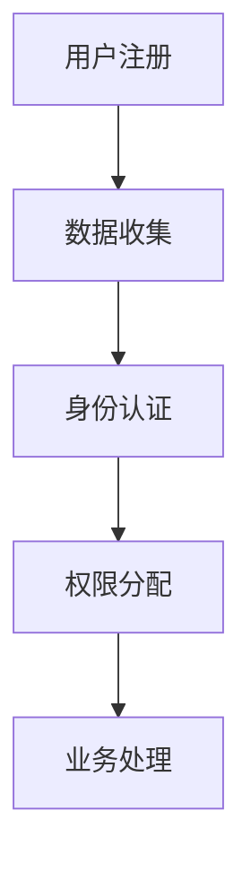

                 

关键词：数字化身份，AI，自我认知，数据隐私，身份验证，信息安全

> 摘要：随着人工智能技术的飞速发展，数字化身份成为现代社会的重要议题。本文将探讨AI时代下数字化身份的概念、核心挑战及其对个人和社会的影响，并展望未来的发展趋势。

## 1. 背景介绍

在信息化社会，传统的身份认证方式正逐渐被数字化身份所取代。数字化身份是指通过数字技术对个体进行唯一标识和认证的一种方式。这种身份形式依赖于电子设备、生物特征识别和分布式账本等技术手段。随着人工智能（AI）技术的融入，数字化身份变得更加智能和便捷。

### 1.1 AI在身份验证中的应用

AI在身份验证中发挥着重要作用。通过深度学习技术，AI能够分析用户的生物特征（如指纹、面部识别等），实现高效的认证。此外，AI还可以通过行为分析（如键盘敲击习惯、鼠标移动轨迹等）识别用户身份。

### 1.2 数字化身份的核心挑战

尽管数字化身份带来诸多便利，但也面临一系列挑战。数据隐私和安全是首要问题，如何在确保便捷性的同时保护个人隐私成为关键。

## 2. 核心概念与联系

### 2.1 数字化身份概念

数字化身份是指通过数字化技术对个体进行唯一标识和认证的一种身份形式。其核心概念包括：

- **唯一标识**：通过电子设备、生物特征等手段对个体进行唯一标识。
- **认证**：利用算法和技术对用户身份进行验证。

### 2.2 相关技术

- **电子设备**：如手机、电脑等，用于存储和传输身份信息。
- **生物特征识别**：如指纹、面部识别等，用于身份验证。
- **分布式账本**：如区块链技术，用于保障数据的安全和可信。

### 2.3 Mermaid 流程图



## 3. 核心算法原理 & 具体操作步骤

### 3.1 算法原理概述

数字化身份的认证过程主要基于以下算法原理：

- **生物特征识别算法**：通过分析用户的生物特征实现身份验证。
- **行为分析算法**：通过分析用户的行为习惯（如键盘敲击、鼠标移动等）识别用户身份。

### 3.2 算法步骤详解

#### 3.2.1 生物特征识别算法

1. 用户注册时提交生物特征数据。
2. 系统将生物特征数据进行预处理，如降噪、归一化等。
3. 使用深度学习模型对预处理后的数据进行分析。
4. 比较分析结果与数据库中的数据，实现身份验证。

#### 3.2.2 行为分析算法

1. 用户进行操作时，系统实时收集操作数据。
2. 对操作数据进行预处理，如滤波、去噪等。
3. 使用机器学习模型对预处理后的数据进行行为分析。
4. 比较分析结果与用户历史行为数据，实现身份验证。

### 3.3 算法优缺点

#### 3.3.1 生物特征识别算法

- **优点**：安全性高，难以伪造。
- **缺点**：对硬件设备要求较高，识别速度较慢。

#### 3.3.2 行为分析算法

- **优点**：无需额外的硬件设备，识别速度快。
- **缺点**：安全性较低，易受恶意攻击。

### 3.4 算法应用领域

- **金融领域**：用于客户身份验证，提高交易安全性。
- **安防领域**：用于人员身份识别，保障公共安全。
- **医疗领域**：用于患者身份确认，保障医疗安全。

## 4. 数学模型和公式 & 详细讲解 & 举例说明

### 4.1 数学模型构建

数字化身份的认证过程涉及多种数学模型，以下是一个简单的例子：

#### 4.1.1 生物特征识别模型

假设用户的生物特征数据为 $X$，系统中的生物特征数据库为 $Y$。则认证过程可以表示为：

$$
匹配度 = \sum_{i=1}^{n} w_i \cdot d(X_i, Y_i)
$$

其中，$X_i$ 和 $Y_i$ 分别为用户生物特征数据和数据库中的特征数据，$d(X_i, Y_i)$ 为它们之间的距离度量，$w_i$ 为权重。

#### 4.1.2 行为分析模型

假设用户的行为数据为 $X$，历史行为数据为 $Y$。则行为分析过程可以表示为：

$$
相似度 = \frac{\sum_{i=1}^{n} w_i \cdot x_i \cdot y_i}{\sum_{i=1}^{n} w_i \cdot |x_i| \cdot |y_i|}
$$

其中，$x_i$ 和 $y_i$ 分别为当前行为数据和历史行为数据，$w_i$ 为权重。

### 4.2 公式推导过程

#### 4.2.1 生物特征识别模型

匹配度公式基于最小距离原则，即两个数据之间的距离越小，匹配度越高。距离度量可以采用欧氏距离、曼哈顿距离等。

#### 4.2.2 行为分析模型

相似度公式基于相似性度量，即两个数据之间的相似度越高，行为分析结果越可靠。相似度度量可以采用余弦相似度、皮尔逊相关系数等。

### 4.3 案例分析与讲解

假设有一个用户注册系统，系统要求用户提交指纹数据。系统通过比对用户指纹数据与数据库中的指纹数据，实现身份验证。

#### 4.3.1 生物特征识别案例分析

1. 用户注册时提交指纹数据，系统将其存储在数据库中。
2. 用户登录时，系统从数据库中提取指纹数据，与用户提交的指纹数据进行比对。
3. 系统计算匹配度，若匹配度超过设定阈值，则验证通过。

#### 4.3.2 行为分析案例分析

1. 用户登录时，系统收集用户的行为数据，如键盘敲击速度、鼠标移动轨迹等。
2. 系统对行为数据进行预处理，并使用机器学习模型进行分析。
3. 系统计算相似度，若相似度超过设定阈值，则验证通过。

## 5. 项目实践：代码实例和详细解释说明

### 5.1 开发环境搭建

1. 安装 Python 3.8及以上版本。
2. 安装深度学习框架（如 TensorFlow、PyTorch）。
3. 安装生物特征识别库（如 OpenCV、dlib）。

### 5.2 源代码详细实现

```python
import cv2
import numpy as np
from tensorflow.keras.models import load_model

# 加载预训练的深度学习模型
model = load_model('model.h5')

# 加载生物特征识别库
face_cascade = cv2.CascadeClassifier('haarcascade_frontalface_default.xml')

# 捕获摄像头图像
cap = cv2.VideoCapture(0)

while True:
    ret, frame = cap.read()
    if not ret:
        break
    
    # 检测人脸
    gray = cv2.cvtColor(frame, cv2.COLOR_BGR2GRAY)
    faces = face_cascade.detectMultiScale(gray, 1.3, 5)
    
    for (x, y, w, h) in faces:
        # 提取人脸区域
        face_region = gray[y:y+h, x:x+w]
        face_region = cv2.resize(face_region, (128, 128))
        
        # 预测生物特征
        prediction = model.predict(np.expand_dims(face_region, axis=0))
        match = prediction[0][0]
        
        # 输出匹配度
        print("匹配度：", match)
        
        # 显示人脸区域
        cv2.rectangle(frame, (x, y), (x+w, y+h), (255, 0, 0), 2)
    
    cv2.imshow('Frame', frame)
    
    if cv2.waitKey(1) & 0xFF == ord('q'):
        break

cap.release()
cv2.destroyAllWindows()
```

### 5.3 代码解读与分析

1. **摄像头捕获**：使用 OpenCV 库捕获摄像头图像。
2. **人脸检测**：使用 Haar-like 特征分类器检测人脸区域。
3. **人脸识别**：使用深度学习模型对提取的人脸区域进行预测，输出匹配度。
4. **界面显示**：在界面上显示人脸区域和匹配度。

### 5.4 运行结果展示

运行代码后，摄像头捕获到的图像会实时显示在界面上，系统会识别并显示用户的人脸区域及匹配度。

## 6. 实际应用场景

### 6.1 金融领域

在金融领域，数字化身份可用于客户身份验证，提高交易安全性。例如，用户在进行转账操作时，系统会通过生物特征识别和行为分析对用户身份进行双重验证。

### 6.2 安防领域

在安防领域，数字化身份可用于人员身份识别，保障公共安全。例如，在机场、商场等场所，系统可以通过摄像头和生物特征识别技术对进入场所的人员进行实时监控和身份验证。

### 6.3 医疗领域

在医疗领域，数字化身份可用于患者身份确认，保障医疗安全。例如，在医院中，系统可以通过生物特征识别对患者进行身份验证，确保医生对正确患者进行操作。

## 7. 工具和资源推荐

### 7.1 学习资源推荐

- 《深度学习》（Goodfellow, Bengio, Courville）
- 《计算机视觉：算法与应用》（Richard Szeliski）

### 7.2 开发工具推荐

- Python
- TensorFlow
- OpenCV

### 7.3 相关论文推荐

- "DeepFace: Closing the Gap to Human-Level Performance in Face Verification"
- "Person Re-Identification by Unsupervised Feature Learning with Clustering and Co-Training"

## 8. 总结：未来发展趋势与挑战

### 8.1 研究成果总结

随着AI技术的发展，数字化身份在多个领域得到广泛应用。生物特征识别和行为分析等算法不断优化，为数字化身份提供了更高的安全性和便捷性。

### 8.2 未来发展趋势

未来，数字化身份将朝着更智能、更安全、更便捷的方向发展。随着量子计算、区块链等技术的进步，数字化身份将实现更高层次的安全保障。

### 8.3 面临的挑战

数字化身份仍面临诸多挑战，如数据隐私保护、算法安全性等。需要进一步研究和发展，以应对未来复杂多变的网络环境。

### 8.4 研究展望

数字化身份将在未来的社会发展中扮演重要角色。通过不断创新和研究，我们有望实现更加安全、智能和便捷的数字化身份认证体系。

## 9. 附录：常见问题与解答

### 9.1 生物特征识别的安全性问题

生物特征识别的安全性问题主要涉及生物特征数据的泄露和滥用。为了提高安全性，可以采取以下措施：

- **加密存储**：对生物特征数据进行加密存储，防止数据泄露。
- **访问控制**：严格限制对生物特征数据的访问权限，防止未经授权的访问。
- **多因素认证**：结合多种认证方式，提高认证的安全性。

### 9.2 行为分析算法的可靠性问题

行为分析算法的可靠性问题主要涉及恶意攻击和误识别。为了提高可靠性，可以采取以下措施：

- **增强算法**：采用更加先进的算法和技术，提高识别的准确性。
- **实时监测**：实时监测系统运行状态，及时发现并处理异常情况。
- **用户反馈**：鼓励用户提供反馈，帮助系统不断完善和优化。

---

作者：禅与计算机程序设计艺术 / Zen and the Art of Computer Programming

