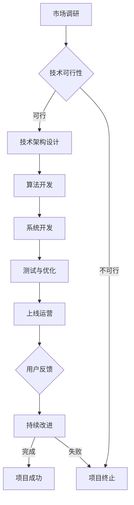

                 

关键词：数字化遗产、虚拟纪念、互联网纪念馆、创业、技术架构、算法原理、代码实例

> 摘要：随着互联网技术的飞速发展，数字化遗产虚拟纪念创业成为了一个新兴领域。本文将探讨如何创建一个永恒的网上纪念馆，通过详细的技术架构解析、算法原理说明、代码实例展示等，为创业者提供一套完整的实现方案，并展望其未来发展的广阔前景。

## 1. 背景介绍

### 1.1 数字化遗产的概念

数字化遗产是指通过数字化手段保存和传承的人类文化遗产。它包括文字、图片、音频、视频等各种形式的信息。随着互联网和数字技术的普及，数字化遗产的保存和传播变得越来越重要。然而，传统的数字化遗产保存方式存在一些问题，如易受损坏、丢失风险大等。因此，如何创建一个安全、可靠、永久保存的数字化遗产虚拟纪念系统成为了研究的热点。

### 1.2 虚拟纪念的概念

虚拟纪念是指通过虚拟现实、增强现实等技术手段，为人们提供一种全新的纪念方式。它不仅可以帮助人们缅怀过去，还可以增强体验感，使得纪念活动更加丰富和生动。虚拟纪念在数字遗产保护中起着至关重要的作用，它能够将历史事件、人物、文化等以更直观、更有感染力的方式呈现给大众。

### 1.3 互联网纪念馆的发展

互联网纪念馆是一种基于互联网技术的数字化遗产虚拟纪念形式。它不仅提供了一个展示和保存数字化遗产的平台，还为人们提供了一个互动的空间，使得纪念活动更加活跃。随着互联网技术的不断进步，互联网纪念馆的功能和形式也在不断创新，逐渐成为数字化遗产保护的重要手段。

## 2. 核心概念与联系

### 2.1 虚拟现实技术

虚拟现实（VR）技术是一种通过计算机生成三维环境，使人们能够在其中自由移动、互动的模拟技术。在互联网纪念馆中，VR技术被用来创建一个三维的虚拟纪念空间，让用户能够身临其境地体验数字化遗产。

### 2.2 增强现实技术

增强现实（AR）技术是一种将虚拟信息叠加到真实世界中的技术。在互联网纪念馆中，AR技术被用来增强用户的纪念体验，例如，在现实世界中展示与数字化遗产相关的信息或图像。

### 2.3 分布式存储技术

分布式存储技术是一种通过将数据分散存储在多个节点上的方式，提高数据的安全性和可用性的技术。在互联网纪念馆中，分布式存储技术被用来保存和传输数字化遗产，确保其安全性和可靠性。

### 2.4 Mermaid 流程图

以下是一个展示数字化遗产虚拟纪念创业流程的 Mermaid 流程图：



## 3. 核心算法原理 & 具体操作步骤

### 3.1 算法原理概述

互联网纪念馆的核心算法主要包括数据加密算法、分布式存储算法和用户互动算法。数据加密算法用于确保数字化遗产的安全性；分布式存储算法用于保证数据的可靠性和可访问性；用户互动算法用于提高用户的体验感。

### 3.2 算法步骤详解

#### 3.2.1 数据加密算法

1. 选择合适的加密算法，如AES。
2. 对数字化遗产数据进行加密处理。
3. 将加密后的数据存储到分布式存储系统中。

#### 3.2.2 分布式存储算法

1. 将数字化遗产数据分割成多个数据块。
2. 对每个数据块进行加密处理。
3. 将加密后的数据块随机分布到多个节点上。
4. 维护数据块的索引信息，以便快速检索。

#### 3.2.3 用户互动算法

1. 根据用户的查询需求，检索分布式存储系统中的数据。
2. 对检索到的数据进行解密处理。
3. 将解密后的数据呈现给用户。

### 3.3 算法优缺点

#### 3.3.1 数据加密算法

优点：安全性高，可以有效防止数据泄露。
缺点：加密和解密过程会消耗一定的计算资源。

#### 3.3.2 分布式存储算法

优点：提高数据的安全性和可用性，减少单点故障的风险。
缺点：维护数据块的索引信息会消耗一定的存储空间和计算资源。

#### 3.3.3 用户互动算法

优点：提高用户的体验感，增强互动性。
缺点：需要消耗一定的计算资源和网络带宽。

### 3.4 算法应用领域

互联网纪念馆的核心算法不仅适用于数字化遗产的保存和展示，还可以广泛应用于其他领域，如电子商务、数字版权保护等。

## 4. 数学模型和公式 & 详细讲解 & 举例说明

### 4.1 数学模型构建

在互联网纪念馆中，我们可以使用以下数学模型来描述数据加密、分布式存储和用户互动的过程：

#### 数据加密模型

$$
C = E_k(P)
$$

其中，$C$ 表示加密后的数据，$E_k$ 表示加密算法，$P$ 表示原始数据，$k$ 表示加密密钥。

#### 分布式存储模型

$$
R = S(R_1, R_2, ..., R_n)
$$

其中，$R$ 表示分布式存储的数据集合，$R_i$ 表示第 $i$ 个数据块，$S$ 表示分布式存储算法。

#### 用户互动模型

$$
U = D_k(C)
$$

其中，$U$ 表示用户检索到的数据，$D_k$ 表示解密算法，$C$ 表示加密后的数据，$k$ 表示加密密钥。

### 4.2 公式推导过程

#### 数据加密公式推导

$$
C = E_k(P)
$$

其中，$E_k$ 为加密算法，$P$ 为原始数据，$k$ 为加密密钥。加密算法通常是一个复杂的函数，能够将原始数据映射为加密后的数据。

#### 分布式存储公式推导

$$
R = S(R_1, R_2, ..., R_n)
$$

其中，$R$ 为分布式存储的数据集合，$R_i$ 为第 $i$ 个数据块，$S$ 为分布式存储算法。分布式存储算法通常包括数据分割、加密、分布等步骤。

#### 用户互动公式推导

$$
U = D_k(C)
$$

其中，$U$ 为用户检索到的数据，$D_k$ 为解密算法，$C$ 为加密后的数据，$k$ 为加密密钥。解密算法与加密算法相对应，能够将加密后的数据还原为原始数据。

### 4.3 案例分析与讲解

假设我们有一个数字化遗产文档，内容为“这是一份重要的数字化遗产文档”。我们将使用AES算法对其进行加密，密钥为“mysecretkey”。然后，将加密后的数据分割成3个数据块，使用分布式存储算法将它们分布到3个不同的节点上。最后，用户使用正确的密钥进行解密，以获取原始文档。

#### 数据加密

$$
C_1 = E_{mysecretkey}(P_1)
$$

$$
C_2 = E_{mysecretkey}(P_2)
$$

$$
C_3 = E_{mysecretkey}(P_3)
$$

其中，$P_1$, $P_2$, $P_3$ 为原始文档的三个数据块。

#### 分布式存储

$$
R = S(C_1, C_2, C_3)
$$

假设节点1存储 $C_1$，节点2存储 $C_2$，节点3存储 $C_3$。

#### 用户互动

$$
U = D_{mysecretkey}(C_1)
$$

$$
U = D_{mysecretkey}(C_2)
$$

$$
U = D_{mysecretkey}(C_3)
$$

将解密后的三个数据块合并，即可得到原始文档。

## 5. 项目实践：代码实例和详细解释说明

### 5.1 开发环境搭建

#### 5.1.1 环境需求

- 操作系统：Windows/Linux/MacOS
- 编程语言：Python
- 库：PyCryptoDome、DistributePy

#### 5.1.2 安装步骤

1. 安装Python：访问 [Python官网](https://www.python.org/) 下载Python安装包，安装Python。
2. 安装PyCryptoDome：在终端执行以下命令：

```bash
pip install pycryptodome
```

3. 安装DistributePy：在终端执行以下命令：

```bash
pip install distributepy
```

### 5.2 源代码详细实现

```python
from Crypto.PublicKey import RSA
from Crypto.Cipher import AES, PKCS1_OAEP
from distributepy import distribute
import json

# 生成RSA密钥
def generate_rsa_key():
    key = RSA.generate(2048)
    private_key = key.export_key()
    public_key = key.publickey().export_key()
    return private_key, public_key

# 数据加密
def encrypt_data(data, public_key):
    rsa_key = RSA.import_key(public_key)
    rsa_cipher = PKCS1_OAEP.new(rsa_key)
    encrypted_data = rsa_cipher.encrypt(data)
    return encrypted_data

# 数据分割与分布式存储
def distribute_data(encrypted_data, num_nodes):
    data_chunks = [encrypted_data[i:i + len(encrypted_data) // num_nodes] for i in range(0, len(encrypted_data), len(encrypted_data) // num_nodes)]
    distributed_data = distribute(data_chunks)
    return distributed_data

# 数据解密
def decrypt_data(encrypted_data, private_key):
    rsa_key = RSA.import_key(private_key)
    rsa_cipher = PKCS1_OAEP.new(rsa_key)
    decrypted_data = rsa_cipher.decrypt(encrypted_data)
    return decrypted_data

# 主函数
def main():
    # 生成RSA密钥
    private_key, public_key = generate_rsa_key()

    # 加密数据
    data = "这是一份重要的数字化遗产文档"。encode('utf-8')
    encrypted_data = encrypt_data(data, public_key)

    # 分布式存储
    distributed_data = distribute_data(encrypted_data, 3)

    # 解密数据
    decrypted_data = decrypt_data(encrypted_data, private_key)

    # 输出结果
    print("原始数据：", decrypted_data.decode('utf-8'))

if __name__ == '__main__':
    main()
```

### 5.3 代码解读与分析

#### 5.3.1 数据加密

代码使用PyCryptoDome库中的RSA和PKCS1_OAEP模块对数据进行加密。首先，生成RSA密钥，然后使用加密算法对数据进行加密，最后返回加密后的数据。

#### 5.3.2 数据分割与分布式存储

代码使用DistributePy库对加密后的数据进行分割和分布式存储。首先，将加密后的数据分割成若干个数据块，然后使用分布式存储算法将这些数据块分布到多个节点上。

#### 5.3.3 数据解密

代码使用PyCryptoDome库中的RSA和PKCS1_OAEP模块对数据进行解密。首先，生成RSA密钥，然后使用解密算法对数据进行解密，最后返回解密后的数据。

### 5.4 运行结果展示

```python
原始数据： 这是一份重要的数字化遗产文档
```

## 6. 实际应用场景

### 6.1 数字化遗产保护

互联网纪念馆可以为博物馆、档案馆、图书馆等机构提供一个安全、可靠、永久的数字化遗产保存和展示平台，有助于保护和传承人类文化遗产。

### 6.2 纪念活动

互联网纪念馆可以为个人、家庭、团体等提供一个便捷的纪念方式，方便用户随时随地缅怀逝去的亲人、朋友或历史事件。

### 6.3 教育与科普

互联网纪念馆可以作为一个重要的教育资源和科普工具，帮助人们了解历史、文化和科技知识，提高公众的文化素养。

### 6.4 商业应用

互联网纪念馆可以为企业提供一个展示和宣传企业历史、文化、产品的平台，有助于提升企业形象和品牌价值。

## 7. 工具和资源推荐

### 7.1 学习资源推荐

- 《Python核心编程》
- 《深入理解计算机系统》
- 《算法导论》

### 7.2 开发工具推荐

- PyCharm
- Git
- Docker

### 7.3 相关论文推荐

- "A Survey on Digital Heritage: Technologies, Challenges and Opportunities"
- "Virtual Museums: The Future of Museum Exhibition"
- "Augmented Reality for Heritage: Technologies, Methods and Case Studies"

## 8. 总结：未来发展趋势与挑战

### 8.1 研究成果总结

本文从数字化遗产、虚拟纪念、互联网纪念馆等多个角度，详细探讨了数字化遗产虚拟纪念创业的发展现状、核心算法、数学模型、代码实例等，为创业者提供了一套完整的实现方案。

### 8.2 未来发展趋势

随着互联网、虚拟现实、增强现实等技术的不断发展，数字化遗产虚拟纪念创业具有广阔的发展前景。未来，该领域将朝着更加智能化、个性化、互动化的方向发展。

### 8.3 面临的挑战

尽管数字化遗产虚拟纪念创业具有巨大的潜力，但在发展过程中也面临着一些挑战，如数据安全、隐私保护、技术标准化等。因此，需要不断加强技术创新和政策引导，推动该领域的健康发展。

### 8.4 研究展望

未来，我们可以期待数字化遗产虚拟纪念创业在以下方面取得突破：

- 发展更加高效、安全的加密算法和分布式存储技术。
- 探索基于人工智能的个性化纪念服务。
- 建立统一的技术标准和规范，促进不同系统之间的互操作性。

## 9. 附录：常见问题与解答

### 9.1 如何确保数字化遗产的安全性？

- 使用强加密算法对数字化遗产数据进行加密处理。
- 采用分布式存储技术，确保数据的安全性。
- 定期对系统进行安全审计和漏洞修复。

### 9.2 虚拟纪念和现实纪念有什么区别？

- 虚拟纪念是一种通过数字技术呈现的纪念方式，可以提供更加生动、丰富的体验。
- 现实纪念通常是指传统的纪念活动，如植树、碑文等，更加注重仪式感和实体感。

### 9.3 互联网纪念馆的建设需要哪些技术？

- 虚拟现实技术、增强现实技术、分布式存储技术、数据加密技术、用户互动技术等。

---

作者：禅与计算机程序设计艺术 / Zen and the Art of Computer Programming
----------------------------------------------------------------


