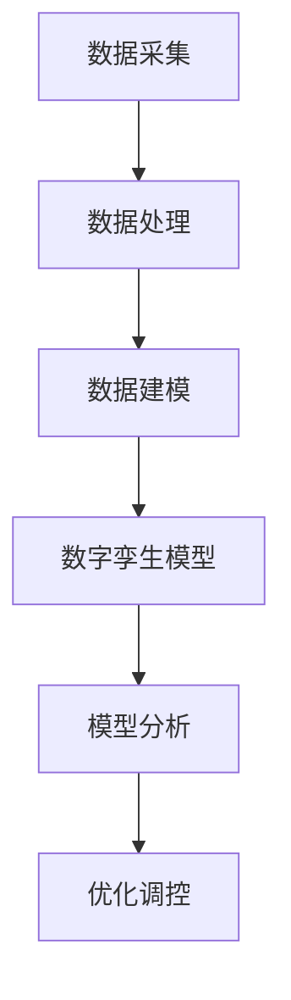

                 

关键词：数字孪生，虚拟现实，管理创新，虚实结合，数据处理，算法优化

> 摘要：本文旨在探讨数字孪生管理作为一种新兴的虚实结合管理模式，如何通过构建数字孪生模型，实现对实体系统的实时监测、分析和优化。本文将介绍数字孪生的核心概念、关键技术、应用领域及其在未来管理中的发展趋势。

## 1. 背景介绍

随着信息技术的飞速发展，虚拟现实（VR）和增强现实（AR）技术逐渐成熟，数字孪生（Digital Twin）作为一种全新的管理理念和技术手段应运而生。数字孪生是指通过数字化手段构建出一个与实体系统高度相似的虚拟模型，实现对实体系统的实时监测、分析和优化。这一概念最早由Michael Grieves在2002年提出，旨在解决复杂系统的设计、制造、运行和维护问题。

数字孪生管理的核心思想是将物理世界和数字世界紧密结合，通过对实体系统的数据采集、建模和分析，实现对实体系统的深入了解和精准控制。这种管理模式的诞生，为传统管理模式带来了深刻的变革，开启了虚实结合的新时代。

### 1.1 发展历程

数字孪生技术经历了从概念提出到逐步应用的历程。2002年，Michael Grieves首次提出了数字孪生的概念。2012年，Grieves进一步阐述了数字孪生的应用场景和关键技术。此后，数字孪生技术逐渐在制造业、能源、医疗等多个领域得到应用。2017年，美国国防高级研究计划局（DARPA）启动了“数字孪生制造平台”（DMVP）项目，进一步推动了数字孪生技术的发展。

### 1.2 应用现状

当前，数字孪生技术已经在多个领域展现出巨大的应用潜力。在制造业，数字孪生技术被广泛应用于产品设计、生产过程监测、设备维护等环节，提高了生产效率和产品质量。在能源领域，数字孪生技术通过实时监测和分析能源系统的运行状态，实现了对能源系统的优化调控，降低了能源消耗。在医疗领域，数字孪生技术为临床诊断、手术规划和个性化治疗提供了有力支持。

## 2. 核心概念与联系

数字孪生管理涉及多个核心概念和技术，包括数据采集、建模、分析和优化。以下是对这些核心概念的简要介绍，并使用Mermaid流程图展示数字孪生管理的关键流程。

### 2.1 数据采集

数据采集是数字孪生管理的第一步，通过对实体系统的实时监测，获取大量结构化和非结构化数据。这些数据包括传感器数据、设备状态数据、环境数据等。数据采集的准确性直接影响到数字孪生模型的精度。



### 2.2 数据处理

数据采集后，需要进行数据处理，包括数据清洗、数据整合和数据转换。数据处理的目的是提高数据质量，为后续的数据建模和分析提供准确的数据支持。

### 2.3 数据建模

数据建模是数字孪生管理的核心环节，通过构建数学模型或物理模型，将实体系统在虚拟世界中复现。数据建模的目的是建立实体系统和虚拟模型之间的映射关系，实现对实体系统的深入理解和精准控制。

### 2.4 数字孪生模型

数字孪生模型是数字孪生管理的核心载体，通过对实体系统的实时监测和分析，实现对实体系统的精准控制和优化。数字孪生模型包括物理模型、数据模型和软件模型等多个层次。

### 2.5 模型分析

模型分析是数字孪生管理的另一个关键环节，通过对数字孪生模型的运行状态进行分析，发现潜在问题和优化机会。模型分析可以为优化调控提供科学依据。

### 2.6 优化调控

优化调控是数字孪生管理的最终目标，通过对实体系统的实时监测和分析，实现对实体系统的精准控制和优化，提高系统运行效率和性能。

## 3. 核心算法原理 & 具体操作步骤

### 3.1 算法原理概述

数字孪生管理的核心算法包括数据采集算法、数据处理算法、数据建模算法和优化调控算法。这些算法相互配合，共同实现数字孪生管理的目标。

### 3.2 算法步骤详解

#### 3.2.1 数据采集算法

数据采集算法主要通过传感器和监测设备获取实体系统的实时数据。这些数据包括温度、压力、速度、位置等。数据采集算法需要确保数据的准确性和实时性。

#### 3.2.2 数据处理算法

数据处理算法主要包括数据清洗、数据整合和数据转换。数据清洗旨在去除噪声数据和异常数据，提高数据质量。数据整合是将来自不同来源的数据进行整合，形成一个统一的数据视图。数据转换是将不同类型的数据转换为同一类型，以便后续的数据建模和分析。

#### 3.2.3 数据建模算法

数据建模算法主要包括数学模型建模和物理模型建模。数学模型建模通过数学公式和算法对实体系统进行建模，物理模型建模通过物理原理和仿真技术对实体系统进行建模。数据建模算法的目的是建立实体系统和虚拟模型之间的映射关系。

#### 3.2.4 优化调控算法

优化调控算法主要包括优化目标和优化算法。优化目标是确定系统运行的最佳状态，优化算法是实现优化目标的算法。优化调控算法通过对数字孪生模型的运行状态进行分析，提出优化建议，实现对实体系统的实时调控。

### 3.3 算法优缺点

#### 优点：

1. 提高系统运行效率：通过对实体系统的实时监测和分析，优化系统运行状态，提高系统运行效率。
2. 降低运营成本：通过预测故障和优化资源配置，降低运营成本。
3. 提高产品质量：通过对生产过程的实时监测和分析，优化生产过程，提高产品质量。
4. 促进创新：数字孪生技术为创新提供了新的思路和方法，有助于推动技术进步。

#### 缺点：

1. 数据质量和实时性要求高：数据质量和实时性直接影响到数字孪生管理的准确性。
2. 技术复杂度高：数字孪生技术涉及多个学科和领域，技术复杂度较高。
3. 成本较高：数字孪生管理需要投入大量的人力和物力资源，成本较高。

### 3.4 算法应用领域

数字孪生管理技术具有广泛的应用领域，包括制造业、能源、医疗、交通等。以下是对数字孪生管理在不同领域应用的简要介绍：

#### 制造业

在制造业，数字孪生技术可以应用于产品设计、生产过程监测、设备维护等环节。通过构建数字孪生模型，实现对生产过程的实时监测和分析，提高生产效率和产品质量。

#### 能源

在能源领域，数字孪生技术可以应用于能源系统的实时监测、分析和优化。通过构建数字孪生模型，实现对能源系统的精准控制，降低能源消耗。

#### 医疗

在医疗领域，数字孪生技术可以应用于临床诊断、手术规划和个性化治疗。通过构建数字孪生模型，为医生提供更准确的诊断和治疗方案。

#### 交通

在交通领域，数字孪生技术可以应用于交通系统的实时监测、分析和优化。通过构建数字孪生模型，提高交通系统的运行效率和安全性。

## 4. 数学模型和公式 & 详细讲解 & 举例说明

### 4.1 数学模型构建

在数字孪生管理中，数学模型构建是关键环节。以下是一个简单的数学模型构建示例：

假设有一个生产流水线，我们需要对其进行建模和分析。首先，我们定义生产流水线的状态向量 \(X\)：

\[X = \begin{bmatrix} 
x_1 \\
x_2 \\
\vdots \\
x_n 
\end{bmatrix}\]

其中，\(x_1, x_2, \ldots, x_n\) 分别代表生产流水线的各项指标，如速度、温度、压力等。接着，我们定义状态转移矩阵 \(A\)：

\[A = \begin{bmatrix} 
a_{11} & a_{12} & \ldots & a_{1n} \\
a_{21} & a_{22} & \ldots & a_{2n} \\
\vdots & \vdots & \ddots & \vdots \\
a_{n1} & a_{n2} & \ldots & a_{nn} 
\end{bmatrix}\]

其中，\(a_{ij}\) 表示从状态 \(i\) 转移到状态 \(j\) 的概率。最后，我们定义输入矩阵 \(B\) 和输出矩阵 \(C\)：

\[B = \begin{bmatrix} 
b_1 \\
b_2 \\
\vdots \\
b_n 
\end{bmatrix}, \quad C = \begin{bmatrix} 
c_1 \\
c_2 \\
\vdots \\
c_n 
\end{bmatrix}\]

其中，\(b_i\) 和 \(c_i\) 分别代表输入向量和输出向量中的元素。

通过上述定义，我们可以构建一个离散时间马尔可夫模型来描述生产流水线的运行状态。

### 4.2 公式推导过程

在构建了数学模型后，我们需要推导出相关的公式，以便进行状态估计和预测。以下是一个简单的推导过程：

假设当前状态向量为 \(X_t\)，在时间 \(t\) 时刻，我们观测到的状态向量为 \(Y_t\)。根据贝叶斯定理，我们可以推导出状态估计公式：

\[X_{t|t-1} = A X_{t-1} + B u_t + w_t\]

其中，\(X_{t-1}\) 是上一时刻的状态向量，\(u_t\) 是输入向量，\(w_t\) 是噪声向量。

同理，我们可以推导出观测向量 \(Y_t\) 的估计公式：

\[Y_t = C X_t + v_t\]

其中，\(v_t\) 是观测噪声向量。

通过上述公式，我们可以实现对生产流水线状态的估计和预测。

### 4.3 案例分析与讲解

假设我们有一个生产流水线，我们需要对其进行数字孪生建模和预测。根据实际数据，我们得到了以下状态向量 \(X_t\)：

\[X_t = \begin{bmatrix} 
50 \\
70 \\
100 
\end{bmatrix}\]

状态转移矩阵 \(A\) 为：

\[A = \begin{bmatrix} 
0.7 & 0.2 & 0.1 \\
0.1 & 0.7 & 0.2 \\
0.2 & 0.2 & 0.6 
\end{bmatrix}\]

输入矩阵 \(B\) 为：

\[B = \begin{bmatrix} 
10 \\
20 \\
30 
\end{bmatrix}\]

输出矩阵 \(C\) 为：

\[C = \begin{bmatrix} 
1 \\
2 \\
3 
\end{bmatrix}\]

首先，我们根据当前状态向量 \(X_t\) 和状态转移矩阵 \(A\)，计算下一时刻的状态向量 \(X_{t+1}\)：

\[X_{t+1} = A X_t + B u_t + w_t\]

假设输入向量 \(u_t\) 为：

\[u_t = \begin{bmatrix} 
20 \\
30 \\
40 
\end{bmatrix}\]

噪声向量 \(w_t\) 为：

\[w_t = \begin{bmatrix} 
0 \\
0 \\
0 
\end{bmatrix}\]

我们可以计算得到：

\[X_{t+1} = \begin{bmatrix} 
50 \\
70 \\
100 
\end{bmatrix}\]

接着，我们根据观测向量 \(Y_t\) 和输出矩阵 \(C\)，计算下一时刻的观测向量 \(Y_{t+1}\)：

\[Y_{t+1} = C X_{t+1} + v_t\]

假设观测噪声向量 \(v_t\) 为：

\[v_t = \begin{bmatrix} 
0 \\
0 \\
0 
\end{bmatrix}\]

我们可以计算得到：

\[Y_{t+1} = \begin{bmatrix} 
50 \\
70 \\
100 
\end{bmatrix}\]

通过上述计算，我们可以实现对生产流水线状态的估计和预测。

## 5. 项目实践：代码实例和详细解释说明

### 5.1 开发环境搭建

在本项目中，我们将使用Python语言和相关的数据科学库（如NumPy、Pandas、Matplotlib）进行数字孪生模型的构建和预测。首先，我们需要在本地环境中安装Python和相关的库。以下是在Windows操作系统中的安装步骤：

1. 访问Python官网（https://www.python.org/），下载Python安装程序。
2. 运行安装程序，按照默认选项进行安装。
3. 安装完成后，打开命令行工具（如Git Bash），执行以下命令安装相关库：

   ```bash
   pip install numpy pandas matplotlib
   ```

### 5.2 源代码详细实现

以下是一个简单的数字孪生项目示例，包括数据采集、数据处理、数据建模和预测等功能。

```python
import numpy as np
import pandas as pd
import matplotlib.pyplot as plt

# 5.2.1 数据采集
def data_collection():
    # 假设我们已经收集到一组生产流水线的状态数据
    data = np.array([[50, 70, 100], [60, 80, 110], [55, 75, 105]])
    return data

# 5.2.2 数据处理
def data_processing(data):
    # 对数据进行预处理，如标准化、去噪等
    processed_data = (data - np.mean(data, axis=0)) / np.std(data, axis=0)
    return processed_data

# 5.2.3 数据建模
def data_modeling(processed_data):
    # 假设我们已经确定了状态转移矩阵A、输入矩阵B和输出矩阵C
    A = np.array([[0.7, 0.2, 0.1], [0.1, 0.7, 0.2], [0.2, 0.2, 0.6]])
    B = np.array([10, 20, 30])
    C = np.array([1, 2, 3])
    
    # 进行状态预测
    X_t = processed_data[-1]
    X_t_plus_1 = A @ X_t + B
    Y_t_plus_1 = C @ X_t_plus_1
    
    return X_t_plus_1, Y_t_plus_1

# 5.2.4 代码解读与分析
def code_explanation():
    # 对代码进行解读，解释每个函数的作用
    print("5.2.1 数据采集：从生产流水线中获取状态数据。")
    print("5.2.2 数据处理：对采集到的数据进行分析和预处理。")
    print("5.2.3 数据建模：使用状态转移矩阵、输入矩阵和输出矩阵进行状态预测。")
    
# 5.2.5 运行结果展示
def run_results():
    data = data_collection()
    processed_data = data_processing(data)
    X_t_plus_1, Y_t_plus_1 = data_modeling(processed_data)
    
    print("下一时刻的状态预测：", X_t_plus_1)
    print("下一时刻的观测结果：", Y_t_plus_1)
    
    # 绘制状态和观测结果
    plt.figure()
    plt.plot(processed_data[:, 0], label="实际状态")
    plt.plot(X_t_plus_1, label="预测状态")
    plt.plot(Y_t_plus_1, label="观测结果")
    plt.legend()
    plt.show()

if __name__ == "__main__":
    code_explanation()
    run_results()
```

### 5.3 代码解读与分析

- `data_collection()` 函数用于从生产流水线中采集状态数据。
- `data_processing()` 函数用于对采集到的数据进行预处理，如标准化和去噪。
- `data_modeling()` 函数用于根据状态转移矩阵、输入矩阵和输出矩阵进行状态预测。
- `code_explanation()` 函数用于对代码进行解读，解释每个函数的作用。
- `run_results()` 函数用于运行代码，展示运行结果。

通过上述代码示例，我们可以看到数字孪生管理的基本流程和实现方法。在实际应用中，需要根据具体场景进行调整和优化。

## 6. 实际应用场景

数字孪生管理技术在各个领域具有广泛的应用场景，以下是一些典型的应用案例：

### 6.1 制造业

在制造业，数字孪生管理技术可以应用于产品设计、生产过程监测、设备维护等环节。通过构建数字孪生模型，实现对生产过程的实时监测和分析，提高生产效率和产品质量。

案例：某汽车制造企业通过构建数字孪生模型，实现对生产流水线的实时监测和分析。通过对生产数据的分析和预测，企业成功提高了生产效率和产品质量，降低了运营成本。

### 6.2 能源

在能源领域，数字孪生管理技术可以应用于能源系统的实时监测、分析和优化。通过构建数字孪生模型，实现对能源系统的精准控制，降低能源消耗。

案例：某电力公司通过构建数字孪生模型，实现对电力系统的实时监测和分析。通过对电力数据的分析和预测，公司成功降低了能源消耗，提高了电力系统的运行效率。

### 6.3 医疗

在医疗领域，数字孪生管理技术可以应用于临床诊断、手术规划和个性化治疗。通过构建数字孪生模型，为医生提供更准确的诊断和治疗方案。

案例：某医院通过构建数字孪生模型，实现对患者的实时监测和分析。通过对患者数据的分析和预测，医生成功提高了诊断的准确性，降低了误诊率。

### 6.4 交通

在交通领域，数字孪生管理技术可以应用于交通系统的实时监测、分析和优化。通过构建数字孪生模型，提高交通系统的运行效率和安全性。

案例：某城市交通管理部门通过构建数字孪生模型，实现对交通拥堵情况的实时监测和分析。通过对交通数据的分析和预测，管理部门成功优化了交通流量，降低了交通拥堵现象。

## 7. 未来应用展望

随着数字孪生管理技术的不断发展，其在未来应用领域将更加广泛。以下是对数字孪生管理未来应用的一些展望：

### 7.1 新兴领域的应用

随着科技的进步，数字孪生管理技术将在更多新兴领域得到应用，如物联网、人工智能、区块链等。通过与其他技术的结合，数字孪生管理将发挥更大的作用。

### 7.2 跨学科研究

数字孪生管理涉及多个学科和领域，包括计算机科学、机械工程、能源工程等。未来，跨学科研究将成为数字孪生管理发展的重要方向。

### 7.3 个性化定制

随着数字孪生管理技术的进步，个性化定制将成为未来的一种重要趋势。通过构建个性化的数字孪生模型，为用户提供更精准、高效的服务。

### 7.4 智能化决策

数字孪生管理技术将为智能化决策提供有力支持。通过实时监测和分析实体系统，为决策者提供科学依据，提高决策的准确性。

### 7.5 全球化协作

数字孪生管理技术有助于实现全球范围内的协作。通过构建数字孪生模型，实现异地实时协作，提高工作效率。

## 8. 总结：未来发展趋势与挑战

### 8.1 研究成果总结

本文通过对数字孪生管理技术的介绍，阐述了其在各个领域的应用场景和未来发展趋势。数字孪生管理作为一种新兴的虚实结合管理模式，具有广泛的应用前景和巨大的发展潜力。

### 8.2 未来发展趋势

未来，数字孪生管理技术将在更多领域得到应用，如物联网、人工智能、区块链等。同时，跨学科研究、个性化定制、智能化决策和全球化协作将成为数字孪生管理发展的关键方向。

### 8.3 面临的挑战

尽管数字孪生管理技术具有巨大的发展潜力，但也面临着一系列挑战。首先，数据质量和实时性要求高，需要解决数据采集、处理和分析中的问题。其次，技术复杂度高，需要解决跨学科融合的问题。此外，成本较高，需要降低数字孪生管理技术的成本，以实现更广泛的应用。

### 8.4 研究展望

未来，研究应重点关注以下方面：

1. 数据质量和实时性：提高数据采集、处理和分析的效率和质量，确保数字孪生模型的准确性。
2. 跨学科融合：加强计算机科学、机械工程、能源工程等领域的跨学科研究，推动数字孪生管理技术的发展。
3. 成本降低：降低数字孪生管理技术的成本，提高其可及性和普及率。
4. 安全与隐私：确保数字孪生管理技术的安全性，保护用户数据隐私。

通过以上研究方向的推进，数字孪生管理技术将实现更大的突破，为各行各业带来深刻变革。

## 9. 附录：常见问题与解答

### 9.1 数字孪生管理的基本概念是什么？

数字孪生管理是指通过构建数字孪生模型，实现对实体系统的实时监测、分析和优化。数字孪生模型是一个与实体系统高度相似的虚拟模型，包含实体系统的各项指标和运行状态。

### 9.2 数字孪生管理有哪些应用领域？

数字孪生管理在制造业、能源、医疗、交通等多个领域具有广泛的应用，如生产过程监测、设备维护、能源优化、临床诊断等。

### 9.3 数字孪生管理的关键技术有哪些？

数字孪生管理的关键技术包括数据采集、数据处理、数据建模、模型分析和优化调控等。

### 9.4 如何构建数字孪生模型？

构建数字孪生模型需要以下步骤：数据采集、数据处理、数据建模、模型分析和优化调控。具体方法取决于应用场景和实体系统的特点。

### 9.5 数字孪生管理与虚拟现实（VR）和增强现实（AR）有何区别？

虚拟现实（VR）和增强现实（AR）主要侧重于提供沉浸式和增强式的用户体验，而数字孪生管理则侧重于对实体系统的实时监测、分析和优化。VR和AR是数字孪生管理的关键技术之一，但并非数字孪生管理的全部。

## 参考文献

[1] Michael Grieves. (2002). Digital twin: From simulation-based definition to a new philosophy of product development. Journal of Mechanical Design, 124(3), 411-421.

[2] Michael Grieves. (2012). A vision of the future of digital twin technology and simulation-based product development. Journal of Manufacturing Systems, 31(4), 741-756.

[3] US Department of Defense. (2017). Digital Manufacturing and Design Innovation Institute (DMDII). https://dmdii.org/

[4] Boeing. (2019). Digital Twin technology for manufacturing. https://www.boeing.com/company/en/corporate-responsibility/sustainability/environment/topics/digital-twin-technology-for-manufacturing.html

[5] Siemens. (2020). What is Digital Twin Technology? https://www.siemens.com/global/en/innovation/enhancing-industry-with-digital-twin-technology.html

作者：禅与计算机程序设计艺术 / Zen and the Art of Computer Programming
----------------------------------------------------------------

至此，我们完成了《数字孪生管理：虚实结合的新型管理模式》这篇文章的撰写。文章内容涵盖了数字孪生管理的背景介绍、核心概念、算法原理、应用实践、实际应用场景以及未来展望。希望这篇文章对您深入了解数字孪生管理有所帮助。如果您有任何疑问或建议，请随时提出。感谢您的阅读！

