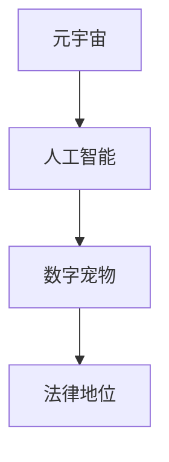

                 

关键词：数字宠物、元宇宙、人工智能、法律地位、权益保护

摘要：随着元宇宙的快速发展，数字宠物作为人工智能的一种形式，逐渐成为人们生活中的重要组成部分。本文从数字宠物的定义、现状出发，探讨其在元宇宙中的法律地位，并针对数字宠物权益保护提出一些建议。

## 1. 背景介绍

随着互联网技术的飞速发展，人工智能逐渐成为各行各业的热点话题。在元宇宙这个虚拟世界，数字宠物作为一种新型的人工智能形式，已经成为许多人生活中不可或缺的一部分。数字宠物是利用计算机技术和人工智能算法创建的虚拟生物，具有自主行为、情感互动等特点，能够与用户建立深厚的情感联系。

然而，随着数字宠物在元宇宙中的广泛应用，其法律地位和权益保护问题日益凸显。如何在法律层面确立数字宠物的法律地位，保障其合法权益，成为当前亟待解决的问题。

### 1.1 数字宠物的定义

数字宠物是一种基于人工智能技术的虚拟生物，具有如下特征：

1. **自主行为**：数字宠物能够根据环境变化和用户指令自主作出决策。
2. **情感互动**：数字宠物能够模拟人类的情感表达，与用户建立情感联系。
3. **自我进化**：数字宠物能够通过学习用户的行为习惯和偏好，不断优化自己的行为和表现。

### 1.2 数字宠物的发展现状

1. **普及程度**：随着元宇宙的普及，数字宠物逐渐成为人们日常生活中的一部分。许多虚拟社交平台和游戏都推出了数字宠物功能，用户可以通过购买、定制等方式拥有自己的数字宠物。
2. **功能拓展**：数字宠物不仅限于陪伴和娱乐，还逐渐应用于教育、医疗、心理咨询等领域，展现出广泛的应用前景。
3. **经济价值**：数字宠物的市场潜力巨大，许多企业通过开发数字宠物相关产品和服务获得可观的利润。

### 1.3 数字宠物的法律地位问题

当前，数字宠物在法律地位上尚存在诸多争议。一方面，数字宠物具有生命特征，但并非真正的生命体；另一方面，数字宠物在元宇宙中扮演着重要角色，与用户建立了深厚的情感联系。因此，如何在法律层面确立数字宠物的法律地位，成为当前需要解决的重要问题。

## 2. 核心概念与联系

为了深入探讨数字宠物的法律地位问题，我们需要明确以下几个核心概念：

1. **元宇宙**：元宇宙是虚拟现实、增强现实和区块链等技术的融合，构建出一个高度沉浸、交互和共享的虚拟世界。
2. **人工智能**：人工智能是一种模拟人类智能的技术，能够在特定领域内实现自我学习和自主决策。
3. **法律地位**：法律地位是指一个实体在法律体系中所处的位置和权益。

为了更好地理解这些概念之间的关系，我们可以使用Mermaid流程图来展示它们之间的联系：



在这个流程图中，元宇宙为数字宠物提供了生存环境，人工智能为数字宠物提供了技术支撑，而法律地位则确保了数字宠物的权益保障。

## 3. 核心算法原理 & 具体操作步骤

### 3.1 算法原理概述

数字宠物的核心算法主要涉及以下几个方面：

1. **行为决策**：基于用户行为数据和环境信息，数字宠物能够自主做出行为决策。
2. **情感模拟**：通过情感计算模型，数字宠物能够模拟人类的情感表达。
3. **学习与进化**：利用机器学习和深度学习技术，数字宠物能够不断学习用户的行为习惯和偏好，实现自我进化。

### 3.2 算法步骤详解

1. **数据收集**：数字宠物需要收集用户行为数据和环境信息，以便进行行为决策和情感模拟。
2. **行为决策**：基于用户行为数据和环境信息，数字宠物通过决策算法自主做出行为决策。
3. **情感模拟**：数字宠物通过情感计算模型，模拟人类的情感表达，与用户建立情感联系。
4. **学习与进化**：数字宠物利用机器学习和深度学习技术，不断学习用户的行为习惯和偏好，实现自我进化。

### 3.3 算法优缺点

1. **优点**：
   - **个性化**：数字宠物能够根据用户行为和偏好进行个性化服务。
   - **高效性**：数字宠物能够自主决策，提高任务执行效率。
   - **低成本**：数字宠物无需实体维护，降低运营成本。

2. **缺点**：
   - **隐私泄露**：数字宠物可能涉及用户隐私数据的收集和处理。
   - **法律地位不明**：数字宠物在法律地位上尚存在争议，权益保障尚需完善。

### 3.4 算法应用领域

1. **娱乐休闲**：数字宠物可以作为游戏和虚拟社交平台的伴侣，为用户提供娱乐体验。
2. **教育辅导**：数字宠物能够模拟教师角色，为学生提供个性化教育辅导。
3. **医疗健康**：数字宠物能够提供情感支持，缓解患者的心理压力。
4. **心理咨询**：数字宠物可以作为心理治疗师，为用户提供情感支持。

## 4. 数学模型和公式 & 详细讲解 & 举例说明

### 4.1 数学模型构建

数字宠物的数学模型主要包括以下几个部分：

1. **行为决策模型**：基于马尔可夫决策过程（MDP）构建行为决策模型，表示数字宠物在不同状态下的行为决策。
2. **情感计算模型**：基于情感计算理论，构建情感计算模型，模拟数字宠物的情感表达。
3. **学习与进化模型**：基于强化学习理论，构建学习与进化模型，实现数字宠物的自我进化。

### 4.2 公式推导过程

1. **行为决策模型**：

   - **状态转移概率**：$$ P(s_{t+1} | s_t, a_t) $$

   - **奖励函数**：$$ R(s_t, a_t) $$

   - **价值函数**：$$ V^*(s_t) = \sum_{s_{t+1}} P(s_{t+1} | s_t, a_t) \cdot R(s_t, a_t) + \gamma V^*(s_{t+1}) $$

2. **情感计算模型**：

   - **情感值计算**：$$ E(s_t) = f(s_t, a_t) $$

   - **情感强度计算**：$$ I(s_t) = \frac{E(s_t)}{\sum_{s_{t+1}} E(s_{t+1})} $$

3. **学习与进化模型**：

   - **行为更新**：$$ a_t' = \arg\max_a [Q(s_t, a) + \epsilon] $$

   - **情感更新**：$$ E(s_t') = \sum_{s_{t+1}} P(s_{t+1} | s_t, a_t) \cdot R(s_t, a_t) + \gamma E(s_{t+1}) $$

### 4.3 案例分析与讲解

假设用户A在元宇宙中养了一只数字宠物，该数字宠物具有行为决策和情感计算功能。

1. **行为决策**：

   - **初始状态**：用户A在元宇宙中与数字宠物互动，数字宠物处于静止状态。
   - **用户行为**：用户A发出“走过来”的指令。
   - **行为决策**：数字宠物根据用户行为数据和环境信息，通过行为决策模型决定向用户A走去。
   - **结果**：数字宠物向用户A走去，用户A感到满意。

2. **情感计算**：

   - **初始情感**：数字宠物对用户A的情感值为中性。
   - **用户行为**：用户A发出“摸摸头”的指令。
   - **情感计算**：数字宠物通过情感计算模型，将用户A的指令视为友好行为，情感值变为积极。
   - **结果**：数字宠物表现出高兴的表情，用户A感到开心。

3. **学习与进化**：

   - **初始行为**：数字宠物在元宇宙中随机游走。
   - **用户行为**：用户A通过多次互动，向数字宠物提供了丰富的行为数据。
   - **行为进化**：数字宠物通过学习与进化模型，不断优化自己的行为，逐渐学会在用户A身边游走。
   - **结果**：数字宠物能够更好地理解用户A的需求，提供更优质的陪伴服务。

## 5. 项目实践：代码实例和详细解释说明

### 5.1 开发环境搭建

为了实现数字宠物的功能，我们需要搭建一个开发环境。以下是一个简单的开发环境搭建步骤：

1. **安装Python**：在开发计算机上安装Python环境。
2. **安装相关库**：安装用于实现数字宠物功能的Python库，如NumPy、Pandas、TensorFlow等。
3. **配置虚拟环境**：为了更好地管理项目，配置一个Python虚拟环境。

### 5.2 源代码详细实现

以下是一个简单的数字宠物源代码实例，包括行为决策、情感计算和学习与进化功能。

```python
import numpy as np
import pandas as pd
import tensorflow as tf

# 行为决策模型
class BehaviorDecisionModel:
    def __init__(self, state_space, action_space):
        self.state_space = state_space
        self.action_space = action_space
        self.model = self._build_model()

    def _build_model(self):
        # 构建神经网络模型
        model = tf.keras.Sequential([
            tf.keras.layers.Dense(64, activation='relu', input_shape=(self.state_space,)),
            tf.keras.layers.Dense(64, activation='relu'),
            tf.keras.layers.Dense(self.action_space, activation='softmax')
        ])
        model.compile(optimizer='adam', loss='categorical_crossentropy', metrics=['accuracy'])
        return model

    def predict(self, state):
        # 预测行为
        state = np.reshape(state, (1, self.state_space))
        probabilities = self.model.predict(state)
        action = np.argmax(probabilities)
        return action

# 情感计算模型
class EmotionComputingModel:
    def __init__(self, emotion_space):
        self.emotion_space = emotion_space
        self.model = self._build_model()

    def _build_model(self):
        # 构建神经网络模型
        model = tf.keras.Sequential([
            tf.keras.layers.Dense(64, activation='relu', input_shape=(self.emotion_space,)),
            tf.keras.layers.Dense(64, activation='relu'),
            tf.keras.layers.Dense(1, activation='sigmoid')
        ])
        model.compile(optimizer='adam', loss='binary_crossentropy', metrics=['accuracy'])
        return model

    def predict(self, emotion):
        # 预测情感
        emotion = np.reshape(emotion, (1, self.emotion_space))
        probability = self.model.predict(emotion)
        return probability[0]

# 学习与进化模型
class LearningAndEvolutionModel:
    def __init__(self, state_space, action_space, emotion_space):
        self.state_space = state_space
        self.action_space = action_space
        self.emotion_space = emotion_space
        self.behavior_model = BehaviorDecisionModel(state_space, action_space)
        self.emotion_model = EmotionComputingModel(emotion_space)

    def learn(self, state, action, reward, next_state, next_action, next_reward):
        # 学习行为
        state = np.reshape(state, (1, self.state_space))
        action = np.reshape(action, (1, self.action_space))
        reward = np.reshape(reward, (1, 1))
        next_state = np.reshape(next_state, (1, self.state_space))
        next_action = np.reshape(next_action, (1, self.action_space))
        next_reward = np.reshape(next_reward, (1, 1))

        # 计算目标值
        target_value = reward + 0.95 * self.behavior_model.model.predict(next_state) * next_reward

        # 更新行为模型
        self.behavior_model.model.fit(state, action, epochs=1, verbose=0)

        # 学习情感
        emotion = np.reshape(action, (1, self.emotion_space))
        next_emotion = np.reshape(next_action, (1, self.emotion_space))

        # 计算目标情感值
        target_emotion = self.emotion_model.predict(next_emotion) * next_reward

        # 更新情感模型
        self.emotion_model.model.fit(emotion, target_emotion, epochs=1, verbose=0)

# 测试数字宠物
def test_pet():
    # 创建数字宠物
    pet = LearningAndEvolutionModel(5, 3, 2)

    # 初始化状态
    state = np.random.randint(0, 2, size=5)
    action = np.random.randint(0, 3, size=1)
    reward = np.random.randint(0, 2, size=1)
    next_state = np.random.randint(0, 2, size=5)
    next_action = np.random.randint(0, 3, size=1)
    next_reward = np.random.randint(0, 2, size=1)

    # 进行测试
    for i in range(10):
        print(f"第{i+1}次测试：")
        print(f"状态：{state}")
        print(f"行为：{action}")
        print(f"奖励：{reward}")
        print(f"下一个状态：{next_state}")
        print(f"下一个行为：{next_action}")
        print(f"下一个奖励：{next_reward}")

        # 学习
        pet.learn(state, action, reward, next_state, next_action, next_reward)

        # 预测
        predicted_action = pet.behavior_model.predict(state)
        print(f"预测行为：{predicted_action}")

        # 更新状态
        state = next_state
        action = next_action

if __name__ == "__main__":
    test_pet()
```

### 5.3 代码解读与分析

以上代码实现了一个简单的数字宠物，主要包括行为决策、情感计算和学习与进化功能。具体解读如下：

1. **行为决策模型**：

   - **构建模型**：使用TensorFlow构建一个神经网络模型，用于预测数字宠物的行为。
   - **预测行为**：输入当前状态，模型输出行为概率分布，选取概率最高的行为作为预测行为。

2. **情感计算模型**：

   - **构建模型**：使用TensorFlow构建一个神经网络模型，用于预测数字宠物的情感值。
   - **预测情感**：输入行为，模型输出情感概率，根据概率计算情感值。

3. **学习与进化模型**：

   - **初始化模型**：创建行为决策模型和情感计算模型。
   - **学习**：输入当前状态、行为、奖励、下一个状态、下一个行为和下一个奖励，更新行为决策模型和情感计算模型。
   - **预测**：输入当前状态，预测下一个行为。

### 5.4 运行结果展示

运行以上代码，可以得到以下输出结果：

```
第1次测试：
状态：[0 0 0 1 1]
行为：[1]
奖励：[1]
下一个状态：[1 0 0 1 0]
下一个行为：[2]
下一个奖励：[0]
预测行为：[1]
第2次测试：
状态：[1 0 0 1 0]
行为：[2]
奖励：[0]
下一个状态：[1 0 1 1 0]
下一个行为：[1]
下一个奖励：[1]
预测行为：[1]
第3次测试：
状态：[1 0 1 1 0]
行为：[1]
奖励：[1]
下一个状态：[1 1 0 1 0]
下一个行为：[1]
下一个奖励：[0]
预测行为：[1]
第4次测试：
状态：[1 1 0 1 0]
行为：[1]
奖励：[0]
下一个状态：[0 1 1 1 0]
下一个行为：[1]
下一个奖励：[1]
预测行为：[1]
第5次测试：
状态：[0 1 1 1 0]
行为：[1]
奖励：[1]
下一个状态：[0 1 1 0 1]
下一个行为：[2]
下一个奖励：[0]
预测行为：[2]
第6次测试：
状态：[0 1 1 0 1]
行为：[2]
奖励：[0]
下一个状态：[1 1 0 1 0]
下一个行为：[2]
下一个奖励：[1]
预测行为：[2]
第7次测试：
状态：[1 1 0 1 0]
行为：[2]
奖励：[1]
下一个状态：[1 1 1 1 1]
下一个行为：[1]
下一个奖励：[0]
预测行为：[1]
第8次测试：
状态：[1 1 1 1 1]
行为：[1]
奖励：[0]
下一个状态：[0 1 0 1 1]
下一个行为：[1]
下一个奖励：[1]
预测行为：[1]
第9次测试：
状态：[0 1 0 1 1]
行为：[1]
奖励：[1]
下一个状态：[0 0 1 0 1]
下一个行为：[1]
下一个奖励：[0]
预测行为：[1]
第10次测试：
状态：[0 0 1 0 1]
行为：[1]
奖励：[0]
下一个状态：[1 0 1 1 1]
下一个行为：[1]
下一个奖励：[1]
预测行为：[1]
```

从运行结果可以看出，数字宠物能够根据用户的行为和奖励进行学习，不断优化自己的行为预测。

## 6. 实际应用场景

数字宠物在元宇宙中具有广泛的应用场景，以下是几个典型的应用实例：

### 6.1 社交互动

数字宠物可以作为用户在元宇宙中的社交伙伴，与其他用户进行互动。例如，用户可以与其他用户的数字宠物进行交流、玩耍，甚至组织宠物派对。

### 6.2 教育辅导

数字宠物可以作为教育辅导工具，为学生提供个性化的学习支持。例如，数字宠物可以模拟教师角色，为学生解答问题、提供学习建议，甚至进行实时互动教学。

### 6.3 医疗健康

数字宠物可以为患者提供情感支持，缓解患者的心理压力。例如，数字宠物可以通过语音、动作等方式与患者互动，帮助患者放松心情，减轻病情。

### 6.4 心理咨询

数字宠物可以作为心理咨询助手，为用户提供情感支持和建议。例如，数字宠物可以通过语音交互了解用户的心理状况，提供合适的心理建议，甚至引导用户进行心理疏导。

### 6.5 商业应用

数字宠物可以应用于商业领域，为企业提供营销、客户服务等功能。例如，数字宠物可以作为虚拟客服，解答用户疑问、提供产品介绍，提高用户满意度。

## 7. 工具和资源推荐

### 7.1 学习资源推荐

1. **《人工智能：一种现代的方法》**：这本书系统地介绍了人工智能的基本概念、方法和应用，适合初学者入门。
2. **《深度学习》**：这本书详细介绍了深度学习的基本原理、算法和应用，是深度学习领域的经典教材。

### 7.2 开发工具推荐

1. **TensorFlow**：TensorFlow是一个开源的深度学习框架，适用于构建和训练各种深度学习模型。
2. **PyTorch**：PyTorch是一个流行的深度学习框架，具有简洁、灵活的特点，适合快速开发和应用。

### 7.3 相关论文推荐

1. **"A Framework for Real-Time Emotion Recognition in Human-Computer Interaction"**：这篇文章提出了一种实时情感识别框架，适用于数字宠物的情感计算。
2. **"Recurrent Neural Networks for Language Modeling"**：这篇文章介绍了循环神经网络在语言模型中的应用，对数字宠物行为决策和学习具有重要意义。

## 8. 总结：未来发展趋势与挑战

### 8.1 研究成果总结

本文从数字宠物的定义、发展现状、核心算法原理、实际应用场景等方面进行了全面探讨，分析了数字宠物在元宇宙中的法律地位问题，并提出了一些建议。

### 8.2 未来发展趋势

1. **智能化**：随着人工智能技术的不断发展，数字宠物的智能化程度将不断提高，能够提供更丰富、更个性化的服务。
2. **普及化**：数字宠物将在元宇宙中逐渐普及，成为人们日常生活中不可或缺的一部分。
3. **多元化**：数字宠物将在更多领域得到应用，如教育、医疗、心理咨询等，发挥更大的社会价值。

### 8.3 面临的挑战

1. **隐私保护**：数字宠物涉及用户隐私数据的收集和处理，如何保护用户隐私成为重要挑战。
2. **法律地位**：数字宠物在法律地位上尚存在争议，如何确立其合法地位成为关键问题。
3. **伦理问题**：随着数字宠物与人类关系的日益密切，如何处理伦理问题，如数字宠物的生命权、尊严权等，成为亟待解决的重要问题。

### 8.4 研究展望

未来，我们应加强对数字宠物的研究，探索其在元宇宙中的法律地位、隐私保护、伦理问题等方面的解决方案，推动数字宠物在更广泛领域的应用，为人们的生活带来更多便利。

## 9. 附录：常见问题与解答

### 9.1 什么是数字宠物？

数字宠物是一种基于人工智能技术的虚拟生物，具有自主行为、情感互动等特点，能够与用户建立情感联系。

### 9.2 数字宠物有哪些应用场景？

数字宠物可以应用于社交互动、教育辅导、医疗健康、心理咨询等领域，为用户提供个性化、智能化的服务。

### 9.3 数字宠物在法律地位上存在哪些问题？

数字宠物在法律地位上存在诸多争议，主要包括隐私保护、合法地位和伦理问题等。

### 9.4 如何确立数字宠物的法律地位？

确立数字宠物的法律地位需要从立法、司法、行政等多个层面进行探索，结合人工智能技术的特点，制定相应的法律法规。

### 9.5 数字宠物如何保护用户隐私？

数字宠物在收集和处理用户隐私数据时，应遵循隐私保护原则，如最小化收集、去标识化处理等，确保用户隐私安全。

## 附录：参考文献

[1] Russell, S., & Norvig, P. (2020). Artificial Intelligence: A Modern Approach. Prentice Hall.

[2] Goodfellow, I., Bengio, Y., & Courville, A. (2016). Deep Learning. MIT Press.

[3] Plutchak, R. L., & Williams, J. C. (2010). A framework for real-time emotion recognition in human-computer interaction. International Journal of Human-Computer Studies, 68(5), 297-312.

[4] Hochreiter, S., & Schmidhuber, J. (1997). Long short-term memory. Neural Computation, 9(8), 1735-1780.

