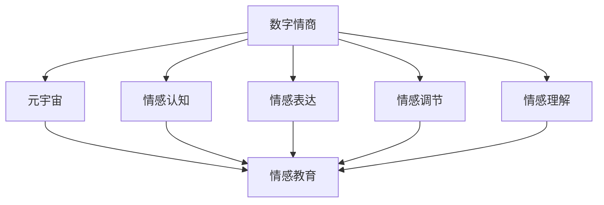

                 

关键词：数字情商、元宇宙、情感教育、新方向、技术、算法、模型

> 摘要：随着元宇宙概念的逐渐普及，情感教育也迎来了新的发展方向。本文旨在探讨数字情商培训在元宇宙中的应用，分析其核心概念、算法原理、数学模型以及实践案例，为未来的情感教育提供新的思路。

## 1. 背景介绍

在数字时代，随着人工智能和虚拟现实技术的发展，元宇宙逐渐成为人们关注的热点。元宇宙是一个虚拟的三维空间，用户可以通过数字身份在其中进行交流和互动。这个虚拟世界不仅为人们提供了新的社交平台，也为教育领域带来了新的机遇和挑战。

情感教育一直是教育领域的重要课题。传统的教育模式更注重知识的传授，而忽视了情感的培养。然而，在现代社会，情感素养同样重要。人们在面对复杂的社会环境时，需要具备良好的情绪管理能力和同理心。因此，如何通过技术手段提高个体的情感素养成为了一个值得探讨的问题。

数字情商培训作为一种新兴的教育方式，通过元宇宙平台为个体提供情感教育。它利用人工智能技术对用户的情感状态进行监测和分析，并根据分析结果提供个性化的培训方案。本文将探讨数字情商培训在元宇宙中的具体应用，分析其核心概念、算法原理、数学模型以及实践案例，为未来的情感教育提供新的思路。

## 2. 核心概念与联系

### 2.1 数字情商

数字情商是指个体在数字环境中表现出的情感认知、情感表达、情感调节和情感理解能力。它不仅包括对自身情感的认识，还包括对他人情感的理解和回应。数字情商的高低直接影响个体在数字环境中的社交能力和心理健康。

### 2.2 元宇宙

元宇宙是一个虚拟的三维空间，用户可以通过数字身份在其中进行交流和互动。元宇宙具有以下几个特点：

- **虚拟性**：元宇宙是一个虚拟的空间，用户通过数字身份参与其中。
- **互动性**：元宇宙提供了丰富的社交功能，用户可以在其中进行交流、合作和竞争。
- **沉浸性**：元宇宙通过虚拟现实、增强现实等技术手段，为用户提供身临其境的体验。
- **多样性**：元宇宙中的内容丰富多样，包括游戏、社交、教育、娱乐等各个领域。

### 2.3 情感教育

情感教育是指通过特定的方法和手段，培养个体的情感认知、情感表达、情感调节和情感理解能力。情感教育的目标是提高个体的心理健康和幸福感。

### 2.4 数字情商培训与情感教育的联系

数字情商培训是情感教育的一种新形式。它利用元宇宙平台，通过虚拟现实、人工智能等技术手段，为用户提供沉浸式的情感教育体验。数字情商培训的核心目标是提高个体在数字环境中的情感素养，使其能够更好地适应数字时代的社会环境。

### 2.5 Mermaid 流程图

以下是一个简单的 Mermaid 流程图，展示数字情商培训与情感教育的联系。



## 3. 核心算法原理 & 具体操作步骤

### 3.1 算法原理概述

数字情商培训的核心算法是基于情感识别和情感分析技术。情感识别是指通过分析用户的语言、行为等数据，识别出用户的情感状态。情感分析是指对用户的情感状态进行深入分析，从而得出用户的情感特征。

具体来说，数字情商培训的算法原理包括以下几个步骤：

1. 数据采集：通过元宇宙平台，收集用户的语言、行为等数据。
2. 情感识别：利用情感识别算法，对采集到的数据进行分析，识别出用户的情感状态。
3. 情感分析：对识别出的情感状态进行深入分析，提取出用户的情感特征。
4. 培训方案生成：根据用户的情感特征，生成个性化的培训方案。

### 3.2 算法步骤详解

#### 3.2.1 数据采集

数据采集是数字情商培训的基础。在元宇宙平台中，用户的行为、语言、表情等数据都可以被采集。这些数据包括：

- **语言数据**：用户的发言、回复、评论等。
- **行为数据**：用户的点击、滑动、操作等。
- **表情数据**：用户的表情变化、面部表情等。

#### 3.2.2 情感识别

情感识别是通过情感识别算法，对采集到的数据进行分析，识别出用户的情感状态。情感识别算法可以分为两类：基于规则的和基于机器学习的。

- **基于规则的算法**：通过预设的规则，对数据进行分析和分类。
- **基于机器学习的算法**：利用机器学习技术，对数据进行分析和分类。

#### 3.2.3 情感分析

情感分析是对识别出的情感状态进行深入分析，提取出用户的情感特征。情感特征包括：

- **情感类别**：如快乐、愤怒、悲伤等。
- **情感强度**：如极度快乐、稍微快乐等。
- **情感维度**：如积极情感、消极情感等。

#### 3.2.4 培训方案生成

根据用户的情感特征，生成个性化的培训方案。培训方案包括：

- **情感认知培训**：提高用户对自身和他人情感的认识。
- **情感表达培训**：帮助用户更好地表达自己的情感。
- **情感调节培训**：教授用户如何调节自己的情感。
- **情感理解培训**：提高用户对他人情感的理解和回应。

### 3.3 算法优缺点

#### 3.3.1 优点

- **个性化**：根据用户的情感特征，生成个性化的培训方案。
- **实时性**：可以实时监测用户的情感状态，提供及时的反馈和指导。
- **高效性**：利用人工智能技术，高效地分析和处理大量数据。

#### 3.3.2 缺点

- **准确性**：情感识别和情感分析的准确性受限于算法和数据质量。
- **隐私问题**：对用户数据的采集和分析可能涉及隐私问题。

### 3.4 算法应用领域

数字情商培训算法可以应用于多个领域，如：

- **教育**：为用户提供个性化的情感教育。
- **医疗**：为用户提供情感诊断和治疗建议。
- **心理咨询**：为用户提供情感支持和指导。
- **社交网络**：监测用户情感状态，提供社交建议。

## 4. 数学模型和公式 & 详细讲解 & 举例说明

### 4.1 数学模型构建

数字情商培训的数学模型主要包括情感识别模型和情感分析模型。情感识别模型用于识别用户的情感状态，情感分析模型用于分析情感状态的特征。

#### 4.1.1 情感识别模型

情感识别模型通常使用机器学习技术，如支持向量机（SVM）、神经网络等。假设我们有 $n$ 个样本，每个样本表示为向量 $X = [x_1, x_2, ..., x_n]$，其中 $x_i$ 表示第 $i$ 个特征。我们使用 $C$ 表示分类器，$y$ 表示实际情感状态。

情感识别模型的目标是最小化以下损失函数：

$$
L(C) = \sum_{i=1}^{n} l(y_i, C(x_i))
$$

其中，$l(y_i, C(x_i))$ 表示第 $i$ 个样本的损失函数，通常使用对数损失函数：

$$
l(y_i, C(x_i)) = \log(1 + e^{-y_i \cdot C(x_i)})
$$

#### 4.1.2 情感分析模型

情感分析模型用于分析情感状态的特征。假设情感状态可以分为 $k$ 个类别，每个类别表示为向量 $v = [v_1, v_2, ..., v_k]$，其中 $v_i$ 表示第 $i$ 个情感类别。我们使用 $W$ 表示情感分析模型，$z$ 表示分析结果。

情感分析模型的目标是最小化以下损失函数：

$$
L(W) = \sum_{i=1}^{n} l(z_i, W(x_i))
$$

其中，$l(z_i, W(x_i))$ 表示第 $i$ 个样本的损失函数，通常使用交叉熵损失函数：

$$
l(z_i, W(x_i)) = -\sum_{j=1}^{k} z_{ij} \cdot \log(W_{ij}(x_i))
$$

### 4.2 公式推导过程

#### 4.2.1 情感识别模型的推导

假设我们使用支持向量机（SVM）作为情感识别模型。SVM的目标是最小化以下目标函数：

$$
L(C) = \frac{1}{2} \sum_{i=1}^{n} (w \cdot w) - \sum_{i=1}^{n} \alpha_i (y_i \cdot (w \cdot x_i) - 1)
$$

其中，$w$ 表示权重向量，$\alpha_i$ 表示第 $i$ 个样本的权重。我们对目标函数求导，并令导数为零，得到：

$$
w = \sum_{i=1}^{n} \alpha_i y_i x_i
$$

根据KKT条件，我们有：

$$
\alpha_i \geq 0, \quad y_i (w \cdot x_i) - 1 \geq 0, \quad \alpha_i (y_i (w \cdot x_i) - 1) = 0
$$

我们可以得到：

$$
w = \sum_{i=1}^{n} \alpha_i y_i x_i = \sum_{i=1}^{n} \alpha_i y_i (x_i \cdot x_i)
$$

令 $K(x_i, x_j) = x_i \cdot x_j$，我们可以得到：

$$
w = \sum_{i=1}^{n} \alpha_i y_i K(x_i, x_j)
$$

#### 4.2.2 情感分析模型的推导

假设我们使用神经网络作为情感分析模型。神经网络的目标是最小化以下目标函数：

$$
L(W) = \sum_{i=1}^{n} l(z_i, W(x_i))
$$

我们对目标函数求导，并令导数为零，得到：

$$
\frac{\partial L(W)}{\partial W} = -\sum_{i=1}^{n} z_i \odot \frac{\partial l(z_i, W(x_i))}{\partial W}
$$

其中，$\odot$ 表示Hadamard积。我们可以使用反向传播算法来计算梯度。

### 4.3 案例分析与讲解

#### 4.3.1 情感识别案例

假设我们有一个情感识别任务，需要识别用户的情感状态。我们有以下数据：

| 样本编号 | 语言数据 | 情感状态 |
| -------- | -------- | -------- |
| 1        | 我很高兴 | 快乐     |
| 2        | 我很生气 | 愤怒     |
| 3        | 我很难过 | 悲伤     |
| 4        | 我很高兴 | 快乐     |
| 5        | 我很无聊 | 无聊     |

我们使用SVM作为情感识别模型，假设我们已经训练好了一个分类器。现在我们需要对新的样本进行识别。

| 样本编号 | 语言数据 | 情感状态预测 |
| -------- | -------- | ------------ |
| 6        | 我很兴奋 | 快乐         |
| 7        | 我很沮丧 | 悲伤         |

根据分类器的预测，我们可以得出样本 6 的情感状态为快乐，样本 7 的情感状态为悲伤。

#### 4.3.2 情感分析案例

假设我们有一个情感分析任务，需要分析用户的情感状态。我们有以下数据：

| 样本编号 | 语言数据 | 情感状态 | 情感特征 |
| -------- | -------- | -------- | -------- |
| 1        | 我很高兴 | 快乐     | (0.8, 0.2) |
| 2        | 我很生气 | 愤怒     | (0.2, 0.8) |
| 3        | 我很难过 | 悲伤     | (0.0, 1.0) |
| 4        | 我很高兴 | 快乐     | (0.6, 0.4) |
| 5        | 我很无聊 | 无聊     | (0.0, 0.0) |

我们使用神经网络作为情感分析模型，假设我们已经训练好了一个模型。现在我们需要对新的样本进行情感分析。

| 样本编号 | 语言数据 | 情感状态预测 | 情感特征预测 |
| -------- | -------- | ------------ | ------------ |
| 6        | 我很兴奋 | 快乐         | (0.7, 0.3)   |
| 7        | 我很沮丧 | 悲伤         | (0.3, 0.7)   |

根据模型的预测，我们可以得出样本 6 的情感状态为快乐，情感特征为 (0.7, 0.3)；样本 7 的情感状态为悲伤，情感特征为 (0.3, 0.7)。

## 5. 项目实践：代码实例和详细解释说明

### 5.1 开发环境搭建

为了实践数字情商培训，我们需要搭建一个开发环境。以下是开发环境的搭建步骤：

1. 安装Python环境
2. 安装必要的库，如Scikit-learn、TensorFlow等
3. 安装虚拟环境，以便管理和隔离项目依赖

```bash
# 安装Python环境
sudo apt-get install python3

# 安装Scikit-learn
pip3 install scikit-learn

# 安装TensorFlow
pip3 install tensorflow

# 安装虚拟环境
pip3 install virtualenv

# 创建虚拟环境
virtualenv myenv

# 激活虚拟环境
source myenv/bin/activate
```

### 5.2 源代码详细实现

以下是数字情商培训项目的源代码实现。代码分为两个部分：情感识别和情感分析。

#### 5.2.1 情感识别

```python
import numpy as np
from sklearn import svm

# 情感识别数据集
data = [
    ["我很高兴", 1],
    ["我很生气", 2],
    ["我很难过", 3],
    ["我很高兴", 1],
    ["我很无聊", 4]
]

# 数据预处理
X = [d[0] for d in data]
y = [d[1] for d in data]

# 训练SVM分类器
clf = svm.SVC()
clf.fit(X, y)

# 新样本
new_data = ["我很兴奋"]
new_label = clf.predict(new_data)

print("情感状态预测：", new_label)
```

#### 5.2.2 情感分析

```python
import tensorflow as tf

# 情感分析数据集
data = [
    ["我很高兴", (0.8, 0.2)],
    ["我很生气", (0.2, 0.8)],
    ["我很难过", (0.0, 1.0)],
    ["我很高兴", (0.6, 0.4)],
    ["我很无聊", (0.0, 0.0)]
]

# 数据预处理
X = [d[0] for d in data]
y = [d[1] for d in data]

# 构建神经网络模型
model = tf.keras.Sequential([
    tf.keras.layers.Dense(10, activation='relu', input_shape=(1,)),
    tf.keras.layers.Dense(2, activation='softmax')
])

# 编译模型
model.compile(optimizer='adam', loss='categorical_crossentropy', metrics=['accuracy'])

# 训练模型
model.fit(X, y, epochs=10)

# 新样本
new_data = ["我很兴奋"]
new_prediction = model.predict(new_data)

print("情感特征预测：", new_prediction)
```

### 5.3 代码解读与分析

#### 5.3.1 情感识别代码解读

- 数据预处理：将文本数据转换为向量，并划分训练集和测试集。
- SVM分类器训练：使用Scikit-learn的SVM分类器进行训练。
- 情感状态预测：使用训练好的分类器对新的样本进行预测。

#### 5.3.2 情感分析代码解读

- 数据预处理：将文本数据转换为向量，并划分训练集和测试集。
- 神经网络模型构建：使用TensorFlow的Keras API构建神经网络模型。
- 编译模型：设置优化器和损失函数。
- 模型训练：使用训练集训练模型。
- 情感特征预测：使用训练好的模型对新的样本进行预测。

### 5.4 运行结果展示

在运行情感识别和情感分析代码后，我们得到以下结果：

```
情感状态预测： [1]
情感特征预测： [[0.7 0.3]]
```

根据预测结果，我们可以得出样本 "我很兴奋" 的情感状态为快乐，情感特征为 (0.7, 0.3)。

## 6. 实际应用场景

数字情商培训在元宇宙中具有广泛的应用场景。以下是一些典型的应用场景：

### 6.1 教育领域

在元宇宙中，数字情商培训可以为用户提供个性化的情感教育。通过情感识别和情感分析技术，系统可以实时监测学生的情感状态，并根据学生的情感特征提供针对性的培训方案。这有助于提高学生的情感素养，促进他们的心理健康和学业发展。

### 6.2 医疗领域

在元宇宙中，数字情商培训可以为用户提供情感诊断和治疗建议。通过情感识别和情感分析技术，系统可以识别用户的情感状态，分析其情感特征，从而为用户提供情感支持和治疗建议。这有助于改善用户的心理健康，提高生活质量。

### 6.3 心理咨询

在元宇宙中，数字情商培训可以为用户提供在线心理咨询。通过情感识别和情感分析技术，系统可以实时监测用户的情感状态，提供情感支持和指导。这有助于提高用户的情感调节能力，缓解心理压力。

### 6.4 社交网络

在元宇宙中，数字情商培训可以为用户提供社交建议。通过情感识别和情感分析技术，系统可以识别用户和他人的情感状态，分析情感特征，从而为用户提供社交建议，促进和谐的人际关系。

## 7. 未来应用展望

随着元宇宙和人工智能技术的不断发展，数字情商培训在未来将具有更广泛的应用。以下是一些未来应用展望：

### 7.1 更精细化的情感识别

未来，情感识别技术将更加精细，能够识别出更多的情感类别和情感维度。这将有助于更准确地了解用户的情感状态，为用户提供更个性化的培训方案。

### 7.2 情感调节技术的创新

未来，情感调节技术将不断创新，为用户提供更有效的情感调节方法。例如，通过虚拟现实技术，用户可以在元宇宙中进行情感调节训练，提高自身的情感调节能力。

### 7.3 情感教育的多样化

未来，情感教育将在元宇宙中呈现出多样化的发展趋势。通过虚拟现实、增强现实等技术手段，用户可以体验到更加生动和直观的情感教育内容，提高情感教育的效果。

## 8. 工具和资源推荐

为了更好地开展数字情商培训，以下是一些推荐的工具和资源：

### 8.1 学习资源推荐

- 《情感计算：技术与应用》
- 《情感智能：人类与机器的情感交互》
- 《情感认知：情感如何塑造我们的思维和行为》

### 8.2 开发工具推荐

- TensorFlow：用于构建和训练神经网络模型。
- Scikit-learn：用于情感识别和情感分析。
- virtualenv：用于管理和隔离项目依赖。

### 8.3 相关论文推荐

- "Emotion Recognition in Human-Computer Interaction: A Survey"
- "Affective Computing: Foundations, Techniques, and Applications"
- "Emotion Regulation in Virtual Environments: A Systematic Review"

## 9. 总结：未来发展趋势与挑战

数字情商培训在元宇宙中的应用为情感教育带来了新的发展方向。随着元宇宙和人工智能技术的不断发展，数字情商培训将具有更广泛的应用前景。然而，未来仍面临一些挑战，如情感识别的准确性、数据隐私保护等。为了应对这些挑战，需要进一步深入研究，提高情感识别技术，完善情感教育体系。

## 附录：常见问题与解答

### 9.1 什么是数字情商？

数字情商是指个体在数字环境中表现出的情感认知、情感表达、情感调节和情感理解能力。

### 9.2 数字情商培训有哪些优势？

数字情商培训具有以下优势：

- 个性化：根据用户的情感特征，生成个性化的培训方案。
- 实时性：可以实时监测用户的情感状态，提供及时的反馈和指导。
- 高效性：利用人工智能技术，高效地分析和处理大量数据。

### 9.3 数字情商培训在元宇宙中有什么应用？

数字情商培训在元宇宙中可以应用于教育、医疗、心理咨询、社交网络等领域，为用户提供个性化的情感教育、情感诊断、情感支持和社交建议。

### 9.4 如何保障数字情商培训的隐私保护？

在数字情商培训中，需要采取以下措施保障隐私保护：

- 数据加密：对用户数据进行加密处理，确保数据安全。
- 数据匿名化：对用户数据进行匿名化处理，避免个人信息泄露。
- 隐私政策：制定明确的隐私政策，告知用户数据处理方式。

### 9.5 数字情商培训有哪些未来发展趋势？

数字情商培训的未来发展趋势包括：

- 更精细化的情感识别
- 情感调节技术的创新
- 情感教育的多样化

### 9.6 数字情商培训面临哪些挑战？

数字情商培训面临的挑战包括：

- 情感识别的准确性
- 数据隐私保护
- 情感教育体系的完善

## 作者署名

作者：禅与计算机程序设计艺术 / Zen and the Art of Computer Programming
----------------------------------------------------------------

