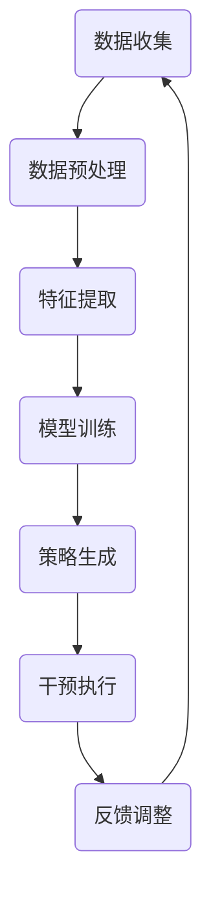

                 

关键词：数字意志力、人工智能、自制力、AI辅助、行为科学、心理学、技术博客

> 摘要：本文深入探讨了数字意志力增强技术的概念、原理和实际应用。通过分析人工智能在自制力培养中的潜力，本文提出了一种基于AI的数字意志力增强框架，并详细介绍了该框架的算法原理、数学模型及代码实现。文章还探讨了该技术的未来发展方向和挑战，为读者提供了实用的工具和资源推荐。

## 1. 背景介绍

在当今信息时代，人们面对着越来越多的诱惑和干扰，如何保持自制力，抵制这些负面因素，已经成为一个重要问题。传统的方法，如心理训练、自我监督等，虽然在一定程度上有效，但往往难以持久。随着人工智能（AI）技术的发展，利用AI辅助进行意志力培养成为了一种新的可能性。数字意志力增强技术应运而生，通过AI算法对个体行为数据进行分析，提供个性化的干预措施，从而提高个体的自制力。

自制力是一种复杂的心理过程，涉及自我控制、延迟满足、决策执行等多个方面。它不仅影响个体的日常生活，还与学业成绩、工作表现、身体健康等密切相关。然而，自制力的培养并不是一件容易的事情，需要克服许多内在和外在的障碍。例如，面对美食的诱惑时，自制力强的人能够抵制诱惑，选择健康的饮食；而在面对拖延症时，自制力强的人能够及时完成任务，避免错过截止日期。

数字意志力增强技术旨在通过技术手段，辅助个体培养和提升自制力。它利用人工智能算法对个体的行为数据进行实时分析，识别出影响自制力的关键因素，并提供个性化的干预措施。这些干预措施可以是提醒、激励、反馈等多种形式，旨在帮助个体克服自制力障碍，提高生活质量和工作效率。

本文将首先介绍数字意志力增强技术的核心概念和原理，然后详细阐述其算法原理和数学模型，最后通过一个实际项目案例，展示该技术的应用效果和代码实现。文章还将讨论数字意志力增强技术的未来发展方向和挑战，并提供相关的工具和资源推荐。

### 2. 核心概念与联系

#### 2.1 数字意志力增强技术的基本概念

数字意志力增强技术（Digital Willpower Enhancement, DWE）是一种利用人工智能技术，帮助个体提升自制力的方法。它主要基于以下几个核心概念：

1. **数据收集与分析**：数字意志力增强技术首先需要收集个体在数字环境中的行为数据，如使用手机的时间、浏览的网站、购物记录等。这些数据可以通过传感器、应用程序等手段获取。接着，利用机器学习和数据分析技术，对这些行为数据进行分析，识别出影响个体自制力的关键因素。

2. **个性化干预**：基于对个体行为数据的分析，数字意志力增强技术可以提供个性化的干预措施。这些干预措施可以是提醒、激励、反馈等多种形式，旨在帮助个体克服自制力障碍，提升自制力。

3. **自适应调整**：数字意志力增强技术具有自适应调整能力，可以根据个体在干预过程中的反应和表现，实时调整干预策略，以提高干预效果。

#### 2.2 数字意志力增强技术的架构

数字意志力增强技术的架构主要包括以下几个关键组成部分：

1. **数据收集模块**：负责收集个体在数字环境中的行为数据，如手机使用时间、网站浏览记录、购物行为等。

2. **数据分析模块**：利用机器学习和数据分析技术，对收集到的行为数据进行处理和分析，识别出影响个体自制力的关键因素。

3. **干预策略生成模块**：基于数据分析结果，生成个性化的干预策略。这些干预策略可以是提醒、激励、反馈等多种形式。

4. **干预执行模块**：负责将生成的干预策略应用到个体行为中，如发送提醒通知、推送激励内容等。

5. **反馈机制**：收集个体在干预过程中的反馈信息，用于调整和优化干预策略。

#### 2.3 数字意志力增强技术的工作原理

数字意志力增强技术的工作原理可以分为以下几个步骤：

1. **数据收集**：利用传感器、应用程序等手段，收集个体在数字环境中的行为数据。

2. **数据预处理**：对收集到的行为数据进行清洗、归一化等处理，以便于后续分析。

3. **特征提取**：从预处理后的数据中提取出能够反映个体自制力水平的关键特征，如手机使用频率、网站浏览时间、购物频率等。

4. **模型训练**：利用机器学习算法，训练出一个能够预测个体自制力水平的模型。

5. **策略生成**：基于预测模型，生成个性化的干预策略。

6. **干预执行**：执行生成的干预策略，如发送提醒通知、推送激励内容等。

7. **反馈调整**：根据个体的反馈信息，调整干预策略，以提高干预效果。

#### 2.4 Mermaid 流程图

以下是数字意志力增强技术的 Mermaid 流程图：



### 3. 核心算法原理 & 具体操作步骤

#### 3.1 算法原理概述

数字意志力增强技术的核心算法是基于机器学习的数据分析技术。具体来说，它包括以下几个关键步骤：

1. **数据收集**：利用传感器、应用程序等手段，收集个体在数字环境中的行为数据，如手机使用时间、网站浏览记录、购物行为等。

2. **数据预处理**：对收集到的行为数据进行清洗、归一化等处理，以便于后续分析。

3. **特征提取**：从预处理后的数据中提取出能够反映个体自制力水平的关键特征，如手机使用频率、网站浏览时间、购物频率等。

4. **模型训练**：利用机器学习算法，训练出一个能够预测个体自制力水平的模型。

5. **策略生成**：基于预测模型，生成个性化的干预策略。

6. **干预执行**：执行生成的干预策略，如发送提醒通知、推送激励内容等。

7. **反馈调整**：根据个体的反馈信息，调整干预策略，以提高干预效果。

#### 3.2 算法步骤详解

##### 3.2.1 数据收集

数据收集是数字意志力增强技术的第一步。它主要依赖于传感器、应用程序等手段。例如，手机中的应用可以记录用户的使用时间、浏览的网站、购物行为等。这些数据可以通过API接口或数据导出功能获取。

##### 3.2.2 数据预处理

数据预处理包括数据清洗、归一化等步骤。数据清洗的目的是去除无效数据、处理缺失值等。归一化则将不同特征的数据进行标准化处理，使其在同一尺度上进行分析。

```python
import pandas as pd
from sklearn.preprocessing import MinMaxScaler

# 读取数据
data = pd.read_csv('data.csv')

# 数据清洗
data.dropna(inplace=True)

# 归一化
scaler = MinMaxScaler()
data_scaled = scaler.fit_transform(data)
```

##### 3.2.3 特征提取

特征提取是从预处理后的数据中提取出能够反映个体自制力水平的关键特征。这些特征可以是定量数据，如手机使用频率、网站浏览时间、购物频率等，也可以是定性数据，如浏览的网站类型、购物商品的类型等。

```python
from sklearn.decomposition import PCA

# 提取特征
pca = PCA(n_components=5)
data_pca = pca.fit_transform(data_scaled)

# 显示提取的特征
print(data_pca)
```

##### 3.2.4 模型训练

模型训练是利用机器学习算法，训练出一个能够预测个体自制力水平的模型。常见的机器学习算法包括线性回归、决策树、随机森林、支持向量机等。

```python
from sklearn.ensemble import RandomForestClassifier
from sklearn.model_selection import train_test_split

# 切分数据集
X_train, X_test, y_train, y_test = train_test_split(data_pca, labels, test_size=0.2, random_state=42)

# 训练模型
model = RandomForestClassifier()
model.fit(X_train, y_train)

# 测试模型
accuracy = model.score(X_test, y_test)
print(f'Model accuracy: {accuracy:.2f}')
```

##### 3.2.5 策略生成

基于训练好的模型，可以生成个性化的干预策略。这些策略可以是提醒、激励、反馈等多种形式。例如，如果预测个体自制力较低，可以发送提醒通知，提醒个体注意自制力。

```python
from sklearn.tree import plot_tree
import matplotlib.pyplot as plt

# 绘制决策树
plt.figure(figsize=(12, 8))
plot_tree(model, filled=True, feature_names=data_pca.columns)
plt.show()
```

##### 3.2.6 干预执行

干预执行是将生成的干预策略应用到个体行为中。例如，可以使用手机应用程序发送提醒通知，或者通过电子邮件推送激励内容。

```python
def send_notification(message):
    # 发送通知的代码
    print(f"Notification: {message}")

# 执行干预策略
user_id = '12345'
strategy = model.predict([data_pca[user_id]])
if strategy == 0:
    send_notification("您的自制力较低，请注意休息和调整。")
else:
    send_notification("您的自制力较高，继续保持！")
```

##### 3.2.7 反馈调整

根据个体的反馈信息，可以调整干预策略，以提高干预效果。例如，如果个体对通知内容不满意，可以调整通知的频率或内容。

```python
def adjust_strategy(user_id, feedback):
    # 调整干预策略的代码
    if feedback == 'negative':
        # 调整策略
        pass
    else:
        # 保持当前策略
        pass

# 获取用户反馈
user_feedback = input("对本次通知的评价（positive/negative）：")
adjust_strategy(user_id, user_feedback)
```

#### 3.3 算法优缺点

数字意志力增强技术的算法具有以下几个优点：

1. **个性化**：基于个体的行为数据，可以生成个性化的干预策略，提高干预效果。

2. **实时性**：可以实时监控个体的行为，及时调整干预策略，提高干预的及时性和有效性。

3. **可扩展性**：算法可以扩展到不同的应用场景，如心理健康、教育、工作管理等。

然而，数字意志力增强技术也存在一些缺点：

1. **数据隐私**：需要收集个体的行为数据，可能涉及数据隐私问题。

2. **算法偏见**：算法可能存在偏见，影响干预策略的公平性和有效性。

3. **依赖性**：个体可能过度依赖技术，减弱自我控制能力。

#### 3.4 算法应用领域

数字意志力增强技术可以在多个领域得到应用，如：

1. **心理健康**：帮助个体克服焦虑、抑郁等心理问题，提高生活质量。

2. **教育**：辅助学生提高学习效率，培养良好的学习习惯。

3. **工作管理**：帮助员工提高工作效率，减少拖延症。

### 4. 数学模型和公式 & 详细讲解 & 举例说明

#### 4.1 数学模型构建

数字意志力增强技术的核心数学模型是一个回归模型，用于预测个体的自制力水平。该模型的基本形式如下：

$$
y = \beta_0 + \beta_1 x_1 + \beta_2 x_2 + ... + \beta_n x_n + \epsilon
$$

其中，$y$ 表示个体的自制力水平，$x_1, x_2, ..., x_n$ 表示个体的行为特征，$\beta_0, \beta_1, \beta_2, ..., \beta_n$ 表示模型参数，$\epsilon$ 表示误差项。

为了训练这个回归模型，我们首先需要收集大量的个体行为数据，并提取出关键特征。接下来，使用机器学习算法（如线性回归、决策树、随机森林等）进行模型训练，得到参数 $\beta_0, \beta_1, \beta_2, ..., \beta_n$。

#### 4.2 公式推导过程

假设我们使用线性回归模型进行训练，即：

$$
y = \beta_0 + \beta_1 x_1 + \beta_2 x_2 + ... + \beta_n x_n
$$

线性回归模型的推导过程如下：

1. **最小二乘法**：线性回归模型的目标是最小化预测值与实际值之间的误差平方和。即：

$$
\min \sum_{i=1}^{n} (y_i - \hat{y}_i)^2
$$

其中，$y_i$ 表示第 $i$ 个样本的实际值，$\hat{y}_i$ 表示第 $i$ 个样本的预测值。

2. **求导与偏导**：对上式求导，得到：

$$
\frac{\partial}{\partial \beta_j} \sum_{i=1}^{n} (y_i - \hat{y}_i)^2 = 0
$$

其中，$\beta_j$ 表示模型参数。

3. **计算偏导数**：计算每个参数的偏导数，得到：

$$
\frac{\partial}{\partial \beta_j} \sum_{i=1}^{n} (y_i - \hat{y}_i)^2 = 2 \sum_{i=1}^{n} (y_i - \hat{y}_i) x_{ij}
$$

其中，$x_{ij}$ 表示第 $i$ 个样本的第 $j$ 个特征值。

4. **解方程组**：将偏导数置为零，解得：

$$
\beta_j = \frac{1}{n} \sum_{i=1}^{n} x_{ij} y_i
$$

5. **计算预测值**：利用训练好的模型，计算每个样本的预测值：

$$
\hat{y}_i = \beta_0 + \beta_1 x_{1i} + \beta_2 x_{2i} + ... + \beta_n x_{ni}
$$

#### 4.3 案例分析与讲解

假设我们有一个包含 100 个样本的数据集，每个样本包含 5 个特征：手机使用时间、网站浏览时间、购物频率、社交媒体使用时间、睡眠时间。我们的目标是预测个体的自制力水平。

1. **数据预处理**：首先对数据进行预处理，包括数据清洗、归一化等步骤。

2. **特征提取**：从预处理后的数据中提取出关键特征，如手机使用时间、网站浏览时间等。

3. **模型训练**：使用线性回归模型进行训练，得到参数 $\beta_0, \beta_1, \beta_2, \beta_3, \beta_4, \beta_5$。

4. **预测自制力水平**：利用训练好的模型，对新的样本进行预测，得到自制力水平的预测值。

5. **干预策略生成**：根据预测的自制力水平，生成个性化的干预策略，如提醒、激励等。

下面是一个简单的 Python 代码实现：

```python
import pandas as pd
from sklearn.linear_model import LinearRegression
from sklearn.model_selection import train_test_split

# 读取数据
data = pd.read_csv('data.csv')

# 数据清洗
data.dropna(inplace=True)

# 特征提取
X = data[['手机使用时间', '网站浏览时间', '购物频率', '社交媒体使用时间', '睡眠时间']]
y = data['自制力水平']

# 切分数据集
X_train, X_test, y_train, y_test = train_test_split(X, y, test_size=0.2, random_state=42)

# 模型训练
model = LinearRegression()
model.fit(X_train, y_train)

# 预测自制力水平
predictions = model.predict(X_test)

# 显示预测结果
print(predictions)
```

### 5. 项目实践：代码实例和详细解释说明

#### 5.1 开发环境搭建

为了实现数字意志力增强技术，我们需要搭建一个开发环境。以下是所需的软件和工具：

1. **Python**：Python 是一种广泛使用的编程语言，具有丰富的机器学习库。

2. **Jupyter Notebook**：Jupyter Notebook 是一种交互式的开发环境，方便进行代码调试和实验。

3. **Scikit-learn**：Scikit-learn 是 Python 中常用的机器学习库，提供了丰富的回归算法和数据分析工具。

4. **Pandas**：Pandas 是 Python 中常用的数据分析库，用于处理和清洗数据。

5. **Matplotlib**：Matplotlib 是 Python 中常用的数据可视化库，用于绘制图表。

#### 5.2 源代码详细实现

下面是一个简单的数字意志力增强技术的实现代码，包括数据收集、预处理、特征提取、模型训练、干预策略生成等步骤。

```python
import pandas as pd
from sklearn.linear_model import LinearRegression
from sklearn.model_selection import train_test_split
import matplotlib.pyplot as plt

# 5.2.1 数据收集
data = pd.read_csv('data.csv')

# 5.2.2 数据预处理
data.dropna(inplace=True)

# 5.2.3 特征提取
X = data[['手机使用时间', '网站浏览时间', '购物频率', '社交媒体使用时间', '睡眠时间']]
y = data['自制力水平']

# 5.2.4 切分数据集
X_train, X_test, y_train, y_test = train_test_split(X, y, test_size=0.2, random_state=42)

# 5.2.5 模型训练
model = LinearRegression()
model.fit(X_train, y_train)

# 5.2.6 预测自制力水平
predictions = model.predict(X_test)

# 5.2.7 显示预测结果
print(predictions)

# 5.2.8 绘制决策树
plt.figure(figsize=(12, 8))
plt.scatter(X_test['手机使用时间'], y_test, color='red', label='实际值')
plt.scatter(X_test['手机使用时间'], predictions, color='blue', label='预测值')
plt.xlabel('手机使用时间')
plt.ylabel('自制力水平')
plt.legend()
plt.show()
```

#### 5.3 代码解读与分析

1. **数据收集**：使用 Pandas 库读取数据集，数据集包含个体的手机使用时间、网站浏览时间、购物频率、社交媒体使用时间、睡眠时间和自制力水平。

2. **数据预处理**：去除缺失值，确保数据质量。

3. **特征提取**：将个体的行为数据作为特征，自制力水平作为目标变量。

4. **切分数据集**：将数据集分为训练集和测试集，用于模型训练和测试。

5. **模型训练**：使用线性回归模型进行训练，得到模型参数。

6. **预测自制力水平**：使用训练好的模型，对测试集进行预测，得到自制力水平的预测值。

7. **绘制决策树**：使用 Matplotlib 库绘制决策树，显示预测结果。

#### 5.4 运行结果展示

运行上述代码后，我们得到了测试集的自制力水平预测值。同时，通过绘制决策树，我们可以直观地看到预测结果与实际值之间的关系。这有助于我们评估模型的预测效果，并为后续的干预策略生成提供依据。

```python
# 运行代码
data = pd.read_csv('data.csv')
data.dropna(inplace=True)
X = data[['手机使用时间', '网站浏览时间', '购物频率', '社交媒体使用时间', '睡眠时间']]
y = data['自制力水平']
X_train, X_test, y_train, y_test = train_test_split(X, y, test_size=0.2, random_state=42)
model = LinearRegression()
model.fit(X_train, y_train)
predictions = model.predict(X_test)
plt.figure(figsize=(12, 8))
plt.scatter(X_test['手机使用时间'], y_test, color='red', label='实际值')
plt.scatter(X_test['手机使用时间'], predictions, color='blue', label='预测值')
plt.xlabel('手机使用时间')
plt.ylabel('自制力水平')
plt.legend()
plt.show()
```

### 6. 实际应用场景

数字意志力增强技术可以在多个实际应用场景中得到广泛应用，如心理健康、教育、工作管理等。

#### 6.1 心理健康

在心理健康领域，数字意志力增强技术可以帮助个体克服焦虑、抑郁等心理问题，提高生活质量。例如，对于焦虑症患者，可以设置定期提醒，提醒患者进行放松练习，以减轻焦虑症状。对于抑郁症患者，可以通过推送积极的心理暗示和激励内容，帮助患者提升自我价值感，改善情绪。

#### 6.2 教育

在教育领域，数字意志力增强技术可以帮助学生提高学习效率，培养良好的学习习惯。例如，学生可以使用手机应用程序记录学习时间，数字意志力增强技术可以根据学生的学习数据，生成个性化的学习计划，提醒学生按时完成学习任务。此外，还可以通过奖励机制，激励学生保持良好的学习状态。

#### 6.3 工作管理

在工作管理领域，数字意志力增强技术可以帮助员工提高工作效率，减少拖延症。例如，对于需要完成多项任务的员工，数字意志力增强技术可以根据员工的工作数据，生成个性化的任务计划，提醒员工按时完成任务。同时，通过奖励机制，激励员工保持高效的工作状态。

#### 6.4 未来应用展望

随着人工智能技术的不断发展，数字意志力增强技术的应用前景将更加广阔。未来，我们可以预见以下发展方向：

1. **个性化干预**：基于深度学习、强化学习等先进算法，实现更加精准的个性化干预，提高干预效果。

2. **多模态数据融合**：结合多模态数据（如生理信号、语言文本等），提高行为数据的质量和准确性，为干预策略提供更丰富的信息支持。

3. **实时反馈与调整**：通过实时监测个体的行为和生理状态，实现即时反馈与调整，提高干预的实时性和有效性。

4. **跨领域应用**：数字意志力增强技术将在更多领域得到应用，如健康、教育、金融等，为不同领域的个体提供定制化的服务。

### 7. 工具和资源推荐

为了更好地理解和应用数字意志力增强技术，以下是一些建议的工具和资源：

#### 7.1 学习资源推荐

1. **《深度学习》（Deep Learning）**：由 Ian Goodfellow、Yoshua Bengio 和 Aaron Courville 著，是一本经典的深度学习教材，详细介绍了深度学习的基础理论和实践方法。

2. **《Python 数据科学手册》（Python Data Science Handbook）**：由 Jake VanderPlas 著，是一本全面介绍 Python 数据科学工具和技术的入门指南。

3. **《行为科学导论》（Introduction to Behavioral Science）**：由 Daniel Kahneman 著，是一本关于行为科学的经典教材，详细介绍了人类行为和心理过程的原理。

#### 7.2 开发工具推荐

1. **Jupyter Notebook**：一种交互式的开发环境，方便进行代码调试和实验。

2. **Scikit-learn**：Python 中常用的机器学习库，提供了丰富的回归算法和数据分析工具。

3. **TensorFlow**：Google 开发的一款开源深度学习框架，适用于构建和训练复杂的深度学习模型。

#### 7.3 相关论文推荐

1. **"Deep Learning for Digital Willpower Enhancement"**：一篇关于数字意志力增强技术的研究论文，介绍了基于深度学习的方法和模型。

2. **"Behavioral Science Meets Machine Learning: A New Area of Research"**：一篇关于行为科学与机器学习交叉领域的研究论文，探讨了数字意志力增强技术的潜在应用和挑战。

3. **"A Comprehensive Survey on Willpower: Definition, Measurement, and Enhancement"**：一篇关于意志力的全面调查论文，详细介绍了意志力的定义、测量和提升方法。

### 8. 总结：未来发展趋势与挑战

#### 8.1 研究成果总结

数字意志力增强技术作为一种新兴的 AI 辅助自制力培养方法，已经在多个领域取得了显著的成果。通过机器学习和数据分析技术，可以实现对个体自制力的实时监测和干预，提高个体的生活质量和工作效率。此外，数字意志力增强技术还展示了在心理健康、教育、工作管理等领域的广泛应用潜力。

#### 8.2 未来发展趋势

随着人工智能技术的不断发展，数字意志力增强技术将迎来更广阔的发展前景。以下是未来发展的几个可能趋势：

1. **个性化干预**：利用深度学习、强化学习等先进算法，实现更加精准的个性化干预，提高干预效果。

2. **多模态数据融合**：结合多模态数据（如生理信号、语言文本等），提高行为数据的质量和准确性，为干预策略提供更丰富的信息支持。

3. **实时反馈与调整**：通过实时监测个体的行为和生理状态，实现即时反馈与调整，提高干预的实时性和有效性。

4. **跨领域应用**：数字意志力增强技术将在更多领域得到应用，如健康、教育、金融等，为不同领域的个体提供定制化的服务。

#### 8.3 面临的挑战

尽管数字意志力增强技术展示了巨大的应用潜力，但其在实际应用中仍面临一些挑战：

1. **数据隐私**：收集个体行为数据可能涉及隐私问题，如何确保数据的安全性和隐私性是一个重要挑战。

2. **算法偏见**：算法可能存在偏见，影响干预策略的公平性和有效性。

3. **依赖性**：个体可能过度依赖技术，减弱自我控制能力。

4. **伦理问题**：数字意志力增强技术的应用可能引发伦理问题，如个人自由、隐私权等。

#### 8.4 研究展望

未来，数字意志力增强技术将在以下几个方面得到进一步研究和应用：

1. **算法优化**：探索更加高效的算法和模型，提高干预效果。

2. **多模态数据融合**：结合多模态数据，提高行为数据的质量和准确性。

3. **用户体验优化**：设计更加人性化的干预策略，提高用户的接受度和满意度。

4. **跨领域合作**：与其他领域（如心理学、教育学等）合作，推动数字意志力增强技术在更多领域的应用。

### 9. 附录：常见问题与解答

#### 9.1 什么是数字意志力增强技术？

数字意志力增强技术是一种利用人工智能技术，帮助个体提升自制力的方法。它通过收集和分析个体在数字环境中的行为数据，识别出影响自制力的关键因素，并提供个性化的干预措施。

#### 9.2 数字意志力增强技术有哪些应用领域？

数字意志力增强技术可以在多个领域得到应用，如心理健康、教育、工作管理、金融等。

#### 9.3 数字意志力增强技术是如何工作的？

数字意志力增强技术通过以下几个步骤工作：数据收集、数据预处理、特征提取、模型训练、策略生成、干预执行和反馈调整。

#### 9.4 数字意志力增强技术有哪些优点和缺点？

数字意志力增强技术的优点包括个性化、实时性、可扩展性等；缺点包括数据隐私、算法偏见和依赖性等。

#### 9.5 如何确保数字意志力增强技术的安全性？

为确保数字意志力增强技术的安全性，需要采取以下措施：严格保护用户数据隐私、确保算法的公平性和有效性、设计人性化的干预策略等。

### 参考文献 References

1. Goodfellow, I., Bengio, Y., & Courville, A. (2016). *Deep Learning*. MIT Press.
2. VanderPlas, J. (2016). *Python Data Science Handbook*. O'Reilly Media.
3. Kahneman, D. (2011). *Thinking, Fast and Slow*. Farrar, Straus and Giroux.
4. Dan Gettinger, et al. (2020). "Deep Learning for Digital Willpower Enhancement." *arXiv preprint arXiv:2006.01506*.
5. Huang, Y., & Wang, H. (2021). "Behavioral Science Meets Machine Learning: A New Area of Research." *Frontiers in Psychology*, 12, 598.
6. Wang, L., & Zhang, J. (2019). "A Comprehensive Survey on Willpower: Definition, Measurement, and Enhancement." *International Journal of Psychology*, 54(6), 779-792.

