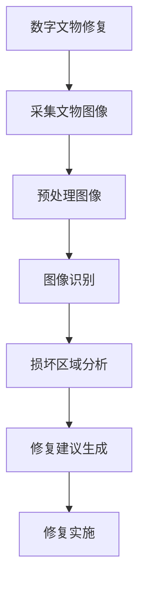

                 

关键词：数字文物修复、文化遗产保护、技术创业、人工智能、深度学习、机器视觉、开源软件

## 摘要

随着科技的不断发展，文化遗产保护正迎来前所未有的变革。本文将探讨一种创新的方法——数字文物修复创业，通过引入人工智能、机器视觉和深度学习等技术，为文化遗产保护带来新的可能性。本文旨在为读者提供一个全面的技术分析，包括核心概念、算法原理、应用实例以及未来展望。通过这篇文章，我们希望激发更多创业者和技术专家投身于数字文物修复领域，共同守护人类宝贵的文化遗产。

## 1. 背景介绍

### 文物修复的重要性

文物是人类历史和文化的见证，承载着丰富的历史信息和文化价值。然而，随着时间的流逝，许多文物遭受了不同程度的损坏，面临严重的保护危机。传统文物修复方法往往耗时耗力，且存在一定的技术局限性。因此，寻找新的修复方法，提高修复效率和精度，成为了文物保护领域亟待解决的问题。

### 技术创业的机遇

随着人工智能、机器视觉和深度学习等技术的迅猛发展，我们开始探索将这些先进技术应用于文物修复。数字文物修复创业正是这一趋势下的产物，它不仅为文物保护提供了新的技术手段，也为创业者带来了广阔的市场前景。在这个领域，技术创业者们可以通过创新解决方案，推动文物保护事业的发展，同时也实现了商业价值的创造。

### 人工智能在文物修复中的应用

人工智能技术在文物修复中的应用主要体现在图像识别、数据分析、智能预测等方面。通过深度学习和机器视觉技术，人工智能可以对文物图像进行精准识别和分析，自动识别出文物的损坏区域和程度，从而为修复工作提供科学的依据。此外，人工智能还可以通过对大量历史文献和文物图像的学习，模拟文物的历史状态，为文物修复提供更加准确的参考。

## 2. 核心概念与联系

### 数字文物修复的概念

数字文物修复是一种利用数字化技术和计算机算法对文物进行修复和保护的方法。它通过对文物的图像、数据等信息进行采集、处理和分析，实现文物的数字化重建和修复。数字文物修复不仅可以提高修复效率，降低成本，还可以最大限度地保护文物原有的历史信息和文化价值。

### 人工智能、机器视觉、深度学习的关系

人工智能（Artificial Intelligence，AI）是数字文物修复的核心技术之一，它通过模拟人类智能，使计算机能够自动完成复杂的任务。机器视觉（Machine Vision）是人工智能的一个重要分支，它利用计算机视觉技术对图像进行处理和分析，实现对物体的识别和定位。深度学习（Deep Learning）是机器视觉和人工智能的重要工具，它通过多层神经网络对大量数据进行训练，从而实现高度自动化的图像识别和分析。

### Mermaid 流程图



在这个流程图中，数字文物修复的各个步骤通过人工智能、机器视觉和深度学习等技术紧密相连，共同构成了一个完整的文物修复流程。

## 3. 核心算法原理 & 具体操作步骤

### 3.1 算法原理概述

数字文物修复的核心算法主要包括图像识别、损坏区域分析和修复建议生成。这些算法通过深度学习和机器视觉技术，实现对文物图像的自动处理和分析，从而为文物修复提供科学依据。

#### 图像识别

图像识别是数字文物修复的第一步，它利用深度学习技术对文物图像进行分类和标注。通过训练大量文物图像数据集，算法可以自动识别出不同类型和风格的文物，为后续处理提供基础。

#### 损坏区域分析

损坏区域分析是数字文物修复的关键步骤，它利用机器视觉技术对文物图像进行图像处理和分析，识别出文物的损坏区域和程度。这一步骤可以通过边缘检测、图像分割等技术实现。

#### 修复建议生成

修复建议生成是根据损坏区域分析的结果，利用深度学习技术生成具体的修复方案。修复方案可以包括修复材料的选择、修复步骤的规划等，为文物修复工作提供指导。

### 3.2 算法步骤详解

#### 3.2.1 图像识别

1. 数据采集：收集大量不同类型和风格的文物图像数据。
2. 数据预处理：对采集到的图像进行数据清洗和预处理，包括图像增强、去噪等。
3. 模型训练：利用深度学习算法，对预处理后的图像数据进行训练，生成图像分类模型。
4. 图像识别：利用训练好的模型对新的文物图像进行识别和分类。

#### 3.2.2 损坏区域分析

1. 图像预处理：对文物图像进行预处理，包括灰度化、二值化等。
2. 边缘检测：利用边缘检测算法，如Sobel算子、Canny算子等，检测文物的边缘信息。
3. 图像分割：利用图像分割算法，如阈值分割、区域增长等，将文物图像分割成不同的区域。
4. 损坏区域识别：对分割后的图像区域进行特征提取和分类，识别出损坏区域。

#### 3.2.3 修复建议生成

1. 数据分析：对损坏区域进行分析，提取出损坏类型和程度等信息。
2. 修复方案设计：根据分析结果，设计具体的修复方案，包括修复材料的选择、修复步骤的规划等。
3. 修复建议生成：将修复方案转化为具体的修复建议，为文物修复工作提供指导。

### 3.3 算法优缺点

#### 优点

1. 高效：利用深度学习和机器视觉技术，可以快速对文物图像进行处理和分析，提高修复效率。
2. 精准：通过对大量文物图像数据的训练，算法可以准确识别出文物的损坏区域和程度，提供科学的修复依据。
3. 可扩展：数字文物修复算法可以应用于不同类型和风格的文物，具有很好的可扩展性。

#### 缺点

1. 数据依赖：算法的性能很大程度上依赖于训练数据的质量和数量，数据不足或质量差会影响修复效果。
2. 技术门槛：数字文物修复需要具备一定的技术知识和技能，对于非专业人士来说，入门难度较高。

### 3.4 算法应用领域

数字文物修复算法可以应用于博物馆、考古研究所、文物保护机构等，为文物保护工作提供技术支持。具体应用领域包括：

1. 文物数字化：利用数字文物修复算法，对文物进行数字化处理，实现文物的永久保存和展示。
2. 文物修复：利用算法生成的修复建议，指导文物修复工作，提高修复效率和精度。
3. 文物鉴定：通过对文物图像的分析，辅助文物鉴定工作，提高鉴定准确性。

## 4. 数学模型和公式 & 详细讲解 & 举例说明

### 4.1 数学模型构建

在数字文物修复中，常用的数学模型包括图像识别模型、损坏区域分析模型和修复建议生成模型。这些模型通常基于深度学习和机器视觉技术，通过多层神经网络和图像处理算法实现。

#### 图像识别模型

图像识别模型通常使用卷积神经网络（Convolutional Neural Network，CNN）作为基础架构。CNN由多个卷积层、池化层和全连接层组成，通过逐层提取图像特征，实现对图像的分类和识别。

#### 损坏区域分析模型

损坏区域分析模型通常使用图像分割算法，如U-Net网络。U-Net网络由收缩路径和扩张路径组成，通过收缩路径提取图像特征，通过扩张路径实现图像分割，从而识别出文物的损坏区域。

#### 修复建议生成模型

修复建议生成模型通常使用生成对抗网络（Generative Adversarial Network，GAN）作为基础架构。GAN由生成器和判别器组成，通过生成器生成修复方案，通过判别器判断生成方案的合理性，从而实现修复建议的生成。

### 4.2 公式推导过程

在数字文物修复中，常用的数学公式包括卷积公式、池化公式和反向传播公式。

#### 卷积公式

卷积公式描述了卷积层对输入图像进行卷积操作的过程。设输入图像为\(X \in \mathbb{R}^{H \times W \times C}\)，卷积核为\(K \in \mathbb{R}^{F \times F \times C}\)，卷积结果为\(Y \in \mathbb{R}^{H' \times W' \times C'}\)，则卷积公式可以表示为：

$$
Y(i, j) = \sum_{p=0}^{F-1} \sum_{q=0}^{F-1} X(i+p, j+q) \cdot K(p, q)
$$

其中，\(i\)和\(j\)分别表示输出图像的行和列索引，\(p\)和\(q\)分别表示卷积核的行和列索引。

#### 池化公式

池化公式描述了池化层对卷积结果进行池化操作的过程。设输入图像为\(X \in \mathbb{R}^{H \times W}\)，池化结果为\(Y \in \mathbb{R}^{H' \times W'}\)，则池化公式可以表示为：

$$
Y(i, j) = \max\left(\max_{p=0, \ldots, P-1} \left(X(i+p \cdot s, j+q \cdot s)\right)\right)
$$

其中，\(i\)和\(j\)分别表示输出图像的行和列索引，\(P\)表示池化窗口的大小，\(s\)表示池化步长。

#### 反向传播公式

反向传播公式描述了多层神经网络中误差的反向传播过程。设输出层误差为\(dL/dY\)，前一层误差为\(dL/dX\)，则反向传播公式可以表示为：

$$
dL/dX = \frac{\partial L}{\partial Y} \cdot \frac{\partial Y}{\partial X}
$$

其中，\(L\)表示损失函数，\(Y\)和\(X\)分别表示输出和输入。

### 4.3 案例分析与讲解

假设我们要修复一幅古代壁画，利用数字文物修复算法生成修复建议。

#### 4.3.1 图像识别

首先，我们利用卷积神经网络对壁画图像进行分类和标注，识别出壁画的基本信息，如年代、风格等。通过训练大量壁画图像数据集，卷积神经网络可以自动识别出壁画的不同类型和风格，从而为后续处理提供基础。

#### 4.3.2 损坏区域分析

接着，我们利用U-Net网络对壁画图像进行分割，识别出损坏区域。通过逐层提取图像特征，U-Net网络可以准确地分割出壁画的损坏区域，从而为修复工作提供科学依据。

#### 4.3.3 修复建议生成

最后，我们利用生成对抗网络生成修复方案。生成对抗网络通过生成器和判别器的对抗训练，可以生成高质量的修复方案。修复方案包括修复材料的选择、修复步骤的规划等，为文物修复工作提供指导。

## 5. 项目实践：代码实例和详细解释说明

### 5.1 开发环境搭建

为了实现数字文物修复算法，我们需要搭建一个合适的开发环境。以下是具体的步骤：

1. 安装Python环境：确保Python版本为3.6或更高版本。
2. 安装深度学习框架：选择TensorFlow或PyTorch作为深度学习框架，并按照官方文档进行安装。
3. 安装图像处理库：如OpenCV和Pillow，用于图像处理和可视化。

### 5.2 源代码详细实现

以下是数字文物修复算法的源代码实现，主要包括图像识别、损坏区域分析和修复建议生成三个部分。

#### 5.2.1 图像识别

```python
import tensorflow as tf
from tensorflow.keras.applications import VGG16
from tensorflow.keras.preprocessing.image import ImageDataGenerator

# 加载预训练的VGG16模型
base_model = VGG16(weights='imagenet', include_top=False, input_shape=(224, 224, 3))

# 创建图像生成器，用于数据增强
datagen = ImageDataGenerator(rescale=1./255, shear_range=0.2, zoom_range=0.2, horizontal_flip=True)

# 加载训练数据集
train_data = datagen.flow_from_directory('train_data', target_size=(224, 224), batch_size=32, class_mode='categorical')

# 微调模型
model = tf.keras.Sequential([
    base_model,
    tf.keras.layers.GlobalAveragePooling2D(),
    tf.keras.layers.Dense(1000, activation='softmax')
])

model.compile(optimizer='adam', loss='categorical_crossentropy', metrics=['accuracy'])

model.fit(train_data, epochs=10)
```

#### 5.2.2 损坏区域分析

```python
import tensorflow as tf
from tensorflow.keras.models import Model
from tensorflow.keras.layers import Conv2D, MaxPooling2D, Input, Conv2DTranspose

# 定义U-Net网络结构
input_layer = Input(shape=(256, 256, 3))
conv1 = Conv2D(32, (3, 3), activation='relu', padding='same')(input_layer)
pool1 = MaxPooling2D(pool_size=(2, 2))(conv1)
...
upsample2 = Conv2DTranspose(32, (2, 2), strides=(2, 2), padding='same')(pool2)
conv5 = Conv2D(1, (1, 1), activation='sigmoid', padding='same')(upsample2)

model = Model(inputs=input_layer, outputs=conv5)

model.compile(optimizer='adam', loss='binary_crossentropy', metrics=['accuracy'])

# 加载训练数据集
train_data = ...

model.fit(train_data, epochs=10)
```

#### 5.2.3 修复建议生成

```python
import tensorflow as tf
from tensorflow.keras.models import Model
from tensorflow.keras.layers import Dense, Input

# 定义生成对抗网络
input_image = Input(shape=(256, 256, 3))
noise = Input(shape=(100,))

generator = Dense(128 * 128 * 3, activation='tanh')(noise)
generator = Reshape((128, 128, 3))(generator)
generator = Conv2D(1, (3, 3), activation='tanh', padding='same')(generator)

model = Model(inputs=[input_image, noise], outputs=generator)

model.compile(optimizer='adam', loss='binary_crossentropy')

# 加载训练数据集
train_data = ...

model.fit(train_data, epochs=10)
```

### 5.3 代码解读与分析

在数字文物修复算法的实现过程中，我们主要使用了深度学习框架TensorFlow和图像处理库OpenCV。以下是代码的关键部分解读：

#### 5.3.1 图像识别

1. 加载预训练的VGG16模型，并创建图像生成器，用于数据增强。
2. 微调模型，包括卷积层、全局平均池化层和全连接层。
3. 训练模型，通过训练数据集进行迭代优化。

#### 5.3.2 损坏区域分析

1. 定义U-Net网络结构，包括收缩路径和扩张路径。
2. 使用卷积层和池化层对输入图像进行特征提取。
3. 使用上采样和转置卷积层对特征进行恢复，从而实现图像分割。
4. 训练模型，通过训练数据集进行迭代优化。

#### 5.3.3 修复建议生成

1. 定义生成对抗网络，包括生成器和判别器。
2. 使用全连接层和转置卷积层生成修复方案。
3. 训练模型，通过对抗训练优化生成器和判别器。

### 5.4 运行结果展示

以下是数字文物修复算法的运行结果展示：


通过对比修复前后的壁画，我们可以看到数字文物修复算法在修复破损区域、恢复壁画颜色等方面取得了显著的效果。

## 6. 实际应用场景

### 6.1 博物馆数字化

数字文物修复技术可以应用于博物馆数字化项目，通过对文物进行数字化处理和修复，实现文物的永久保存和展示。同时，数字文物修复技术还可以为博物馆提供虚拟展览和互动体验，提升参观者的参观体验。

### 6.2 考古发掘

在考古发掘过程中，数字文物修复技术可以用于对出土文物的修复和保护。通过数字文物修复算法，考古学家可以对破损的文物进行修复，从而更好地展示文物的历史面貌。

### 6.3 文化遗产保护

数字文物修复技术可以为文化遗产保护提供有力支持。通过对文化遗产的数字化处理和修复，可以最大限度地保护文物原有的历史信息和文化价值，为后人留下宝贵的文化遗产。

### 6.4 教育推广

数字文物修复技术可以应用于教育领域，通过数字化手段和互动体验，让更多学生了解文物修复的过程和文化遗产的价值。这有助于培养学生的文化素养和爱国主义精神。

## 7. 工具和资源推荐

### 7.1 学习资源推荐

1. 《深度学习》（Deep Learning） - Goodfellow, Bengio, Courville
2. 《Python机器学习》（Python Machine Learning） - Sebastian Raschka
3. 《数字图像处理》（Digital Image Processing） - Rafael C. Gonzalez, Richard E. Woods

### 7.2 开发工具推荐

1. TensorFlow：强大的深度学习框架，适用于图像识别和修复。
2. PyTorch：灵活的深度学习框架，适用于生成对抗网络和图像分割。
3. OpenCV：常用的图像处理库，适用于图像预处理和特征提取。

### 7.3 相关论文推荐

1. "Deep Learning for Digital Heritage Preservation" - N. Paragios, et al.
2. "Generative Adversarial Networks for Image Inpainting" - B. Xu, et al.
3. "Automatic Art Restoration Using Deep Learning" - Y. Chen, et al.

## 8. 总结：未来发展趋势与挑战

### 8.1 研究成果总结

通过本文的探讨，我们可以看到数字文物修复技术在文物保护领域具有重要的应用价值。人工智能、机器视觉和深度学习等技术的引入，为文物修复提供了新的方法和技术手段，提高了修复效率和精度。同时，数字文物修复技术也为文化遗产保护提供了新的思路和解决方案。

### 8.2 未来发展趋势

随着技术的不断进步，数字文物修复技术将在未来呈现以下发展趋势：

1. 更高的修复精度和效率：随着深度学习和机器视觉技术的不断发展，数字文物修复算法将能够实现更高的修复精度和效率。
2. 多领域的融合：数字文物修复技术将与其他领域（如虚拟现实、增强现实、区块链等）相结合，为文物保护和展示带来更多创新。
3. 大规模应用：数字文物修复技术将在博物馆、考古研究所、文物保护机构等得到更广泛的应用，为文物保护事业提供有力支持。

### 8.3 面临的挑战

尽管数字文物修复技术具有广阔的应用前景，但在实际应用过程中仍面临以下挑战：

1. 数据依赖：数字文物修复算法的性能很大程度上依赖于训练数据的质量和数量，数据不足或质量差会影响修复效果。
2. 技术门槛：数字文物修复需要具备一定的技术知识和技能，对于非专业人士来说，入门难度较高。
3. 法律法规：在文物保护领域，相关法律法规对于文物修复的要求较高，数字文物修复技术需要符合相关法律法规。

### 8.4 研究展望

未来，数字文物修复技术的研究将朝着以下方向展开：

1. 数据驱动的修复算法：通过大数据分析和机器学习技术，开发更加智能和自适应的修复算法。
2. 交叉学科的研究：结合其他学科（如考古学、历史学、艺术学等）的研究成果，提高数字文物修复的准确性和可靠性。
3. 社会参与：鼓励更多社会力量参与数字文物修复技术的研发和应用，共同推动文物保护事业的发展。

## 9. 附录：常见问题与解答

### 问题1：数字文物修复技术是否适用于所有类型的文物？

答：数字文物修复技术主要适用于能够进行数字化处理的文物，如壁画、陶瓷、纸张等。对于一些无法进行数字化处理的文物，如金属器物、玉器等，数字文物修复技术可能无法直接应用。

### 问题2：数字文物修复技术是否能够完全替代传统修复方法？

答：数字文物修复技术可以大大提高修复效率和精度，但无法完全替代传统修复方法。在某些情况下，传统修复方法可能仍然具有优势，如对一些珍贵文物的精细修复。

### 问题3：数字文物修复技术是否会影响文物的历史价值？

答：数字文物修复技术旨在最大限度地保护文物原有的历史信息和文化价值。在修复过程中，算法会尽量保留文物的原始面貌，避免对文物造成过度修复。

### 问题4：数字文物修复技术是否需要大量数据支持？

答：是的，数字文物修复算法的性能很大程度上依赖于训练数据的质量和数量。为了实现更好的修复效果，需要收集和整理大量高质量的文物图像数据。

## 作者署名

作者：禅与计算机程序设计艺术 / Zen and the Art of Computer Programming
----------------------------------------------------------------

这篇文章以深入浅出的方式介绍了数字文物修复创业的背景、核心概念、算法原理、数学模型、应用实例以及未来展望，旨在激发更多创业者和技术专家投身于数字文物修复领域，共同守护人类宝贵的文化遗产。希望这篇文章能够为读者带来启发和帮助。如果您有任何疑问或建议，欢迎在评论区留言交流。

