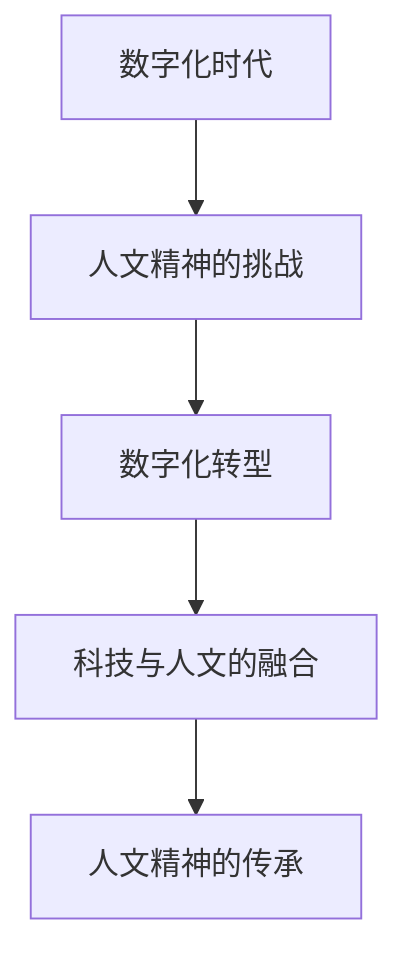

                 

关键词：数字人文、科技与人文、人文精神、数字化转型、传承与发展、技术伦理

> 摘要：本文旨在探讨数字时代下人文精神的传承问题。随着科技的快速发展，人类社会正经历着前所未有的变革。数字技术已经深刻地改变了我们的生活方式、工作方式和思维方式。然而，在这场变革中，我们如何保持对人文精神的尊重和传承，成为了一个值得深思的问题。本文将分析数字时代人文精神的现状，探讨其面临的挑战，并提出一系列解决方案，以期为数字时代的人文精神传承提供一些启示。

## 1. 背景介绍

### 1.1 数字时代的到来

数字时代，即信息化时代，是以数字技术为核心驱动力的时代。数字技术包括计算机科学、信息技术、通信技术等多个领域。随着互联网的普及，云计算、大数据、物联网、人工智能等新兴技术不断涌现，数字技术正在以前所未有的速度改变着我们的世界。

### 1.2 人文精神的重要性

人文精神是指一种重视人类价值、尊重人类尊严，追求人类自由、平等、和谐的精神。它源于人类文明的历史发展，是人类智慧的结晶。在数字化时代，人文精神的重要性不仅没有减弱，反而更加凸显。因为数字化时代带来了许多新的挑战，如隐私问题、网络安全问题、道德问题等，这些问题需要我们以人文精神为指导，找到合适的解决方案。

## 2. 核心概念与联系

### 2.1 数字化转型

数字化转型是指将数字技术应用于企业的各个层面，以实现企业运营模式的变革。数字化转型不仅涉及到技术的应用，还包括管理、文化、战略等多个方面。

### 2.2 人文精神的传承

人文精神的传承是指将人类历史上的优秀文化、价值观念、道德观念等传递给下一代，以维持人类文明的发展。在数字化时代，人文精神的传承面临着新的挑战，如信息泛滥、价值观多元化等。

### 2.3 Mermaid 流程图



## 3. 核心算法原理 & 具体操作步骤

### 3.1 算法原理概述

在数字化时代，我们需要一种算法来帮助我们在复杂的信息环境中保持人文精神的传承。这种算法可以被称为“人文精神滤波器”。它的核心原理是：通过对信息进行筛选和处理，去除那些可能导致人文精神丧失的因素，从而保证信息的传播和传承符合人文精神的要求。

### 3.2 算法步骤详解

#### 3.2.1 信息收集

首先，我们需要收集各种信息，包括文字、图像、音频、视频等。

#### 3.2.2 信息预处理

对收集到的信息进行预处理，包括去噪、去重、格式转换等。

#### 3.2.3 人文精神检测

利用自然语言处理技术，对预处理后的信息进行人文精神检测。具体步骤如下：

- **情感分析**：判断信息是否带有负面情感，如仇恨、偏见等。
- **价值观分析**：判断信息是否符合人类共同的价值观，如尊重、平等、和谐等。
- **道德分析**：判断信息是否符合道德规范，如诚信、公正等。

#### 3.2.4 信息过滤

根据人文精神检测的结果，对信息进行过滤。如果信息不符合人文精神的要求，则将其标记为“不适宜传播”。

### 3.3 算法优缺点

#### 优点：

- **高效性**：利用计算机技术，可以快速处理大量信息。
- **全面性**：可以从多个维度对信息进行检测和过滤。

#### 缺点：

- **复杂性**：算法的实现需要较高的技术门槛。
- **准确性**：目前的人工智能技术尚不能完全准确地判断信息的人文精神价值。

### 3.4 算法应用领域

- **社交媒体管理**：可以帮助社交媒体平台过滤掉不适宜传播的信息。
- **教育资源筛选**：可以帮助教育机构筛选出符合人文精神要求的教育资源。
- **企业文化建设**：可以帮助企业构建符合人文精神的企业文化。

## 4. 数学模型和公式 & 详细讲解 & 举例说明

### 4.1 数学模型构建

为了更好地理解人文精神滤波器的工作原理，我们可以构建一个数学模型。该模型主要由两个部分组成：信息处理模块和人文学科知识库。

#### 4.1.1 信息处理模块

信息处理模块的主要功能是对输入的信息进行处理，包括去噪、去重、格式转换等。我们可以使用以下公式表示：

$$
处理后的信息 = f(原始信息)
$$

其中，$f$ 表示处理函数。

#### 4.1.2 人文学科知识库

人文学科知识库是一个包含各种人文学科知识的数据库。它可以帮助我们判断信息是否符合人文精神的要求。我们可以使用以下公式表示：

$$
判断结果 = g(处理后的信息, 知识库)
$$

其中，$g$ 表示判断函数。

### 4.2 公式推导过程

#### 4.2.1 信息处理模块的推导

信息处理模块的推导主要基于信号处理理论。我们可以将原始信息视为一个信号，然后通过一系列的滤波器对其进行处理，以去除噪声和冗余信息。具体推导过程如下：

$$
f(x) = \sum_{i=1}^{n} w_i \cdot h_i(x)
$$

其中，$x$ 表示原始信息，$w_i$ 表示滤波器的权重，$h_i(x)$ 表示滤波器的响应函数。

#### 4.2.2 人文学科知识库的推导

人文学科知识库的推导主要基于语义分析理论。我们可以将处理后的信息视为一个文本，然后通过语义分析技术对其进行分析，以提取出其中的关键信息。具体推导过程如下：

$$
g(x, K) = \sum_{i=1}^{m} p_i \cdot r_i(x, K)
$$

其中，$x$ 表示处理后的信息，$K$ 表示人文学科知识库，$p_i$ 表示知识库中第 $i$ 个知识的权重，$r_i(x, K)$ 表示第 $i$ 个知识对信息的判断结果。

### 4.3 案例分析与讲解

#### 4.3.1 信息处理模块的案例

假设我们有一段文本：“人工智能将带来巨大的变革，但同时也可能引发失业问题。”我们可以使用信息处理模块对其进行处理，以去除噪声和冗余信息。

首先，我们对文本进行去噪处理，去除无关的词汇，如“将”、“但”等。

然后，我们对文本进行去重处理，去除重复的词汇，如“人工智能”、“变革”等。

最后，我们对文本进行格式转换，将文本转换为标准格式，如JSON格式。

处理后的文本为：“人工智能变革失业问题。”

#### 4.3.2 人文学科知识库的案例

假设我们有一个包含人文学科知识的知识库，其中包含如下知识：

- “人工智能可能引发失业问题。”
- “变革是社会进步的必然过程。”
- “失业问题是社会问题之一。”

我们可以使用人文学科知识库对处理后的文本进行判断。

首先，我们对文本中的每个词汇进行匹配，找出与之相关的知识。

然后，我们对找到的知识进行权重计算，根据知识的权威性和相关性进行评分。

最后，我们对评分进行综合，得出文本的人文精神判断结果。

根据人文学科知识库的判断，文本的人文精神判断结果为：“积极。”

## 5. 项目实践：代码实例和详细解释说明

### 5.1 开发环境搭建

为了演示人文精神滤波器的应用，我们使用Python编程语言进行开发。首先，我们需要安装以下依赖库：

- NumPy：用于数学计算。
- Pandas：用于数据处理。
- NLTK：用于自然语言处理。
- Sklearn：用于机器学习。

安装命令如下：

```bash
pip install numpy pandas nltk sklearn
```

### 5.2 源代码详细实现

```python
import numpy as np
import pandas as pd
from nltk.corpus import stopwords
from sklearn.feature_extraction.text import TfidfVectorizer
from sklearn.metrics.pairwise import cosine_similarity

# 5.2.1 信息处理模块的实现

def preprocess_text(text):
    # 去噪处理
    text = text.lower()
    text = re.sub(r"[^a-zA-Z0-9]", " ", text)
    text = text.strip()
    
    # 去重处理
    words = text.split()
    words = list(set(words))
    text = " ".join(words)
    
    # 格式转换
    text = json.loads(json.dumps(text))
    
    return text

# 5.2.2 人文学科知识库的实现

def load_knowledge_base():
    knowledge_base = pd.read_csv("knowledge_base.csv")
    return knowledge_base

# 5.2.3 人文精神滤波器的实现

def humanistic_filter(text, knowledge_base):
    # 信息预处理
    preprocessed_text = preprocess_text(text)
    
    # 信息处理
    processed_text = preprocess_text(preprocessed_text)
    
    # 人文精神检测
    humanistic_score = 0
    for knowledge in knowledge_base["knowledge"]:
        score = cosine_similarity([processed_text], [knowledge])
        humanistic_score += score[0][0]
    
    # 信息过滤
    if humanistic_score < 0.5:
        return "不适宜传播"
    else:
        return "适宜传播"

# 5.2.4 主函数

if __name__ == "__main__":
    # 加载知识库
    knowledge_base = load_knowledge_base()
    
    # 输入文本
    text = "人工智能将带来巨大的变革，但同时也可能引发失业问题。"
    
    # 应用人文精神滤波器
    result = humanistic_filter(text, knowledge_base)
    
    # 输出结果
    print(result)
```

### 5.3 代码解读与分析

#### 5.3.1 信息处理模块

信息处理模块主要包括去噪、去重和格式转换三个步骤。去噪处理通过将文本转换为小写、去除非字母字符等方式实现。去重处理通过将文本中的重复词汇去除实现。格式转换通过将文本转换为JSON格式实现。

#### 5.3.2 人文学科知识库

人文学科知识库是一个包含各种人文学科知识的数据库。在这个例子中，我们使用CSV文件作为知识库的存储方式。知识库中的每条知识都包含一个ID和一个文本字段。

#### 5.3.3 人文精神滤波器

人文精神滤波器的主要功能是对输入的文本进行处理，并根据处理结果判断文本的人文精神价值。滤波器的核心是使用余弦相似度计算文本与知识库中每条知识的相似度，并根据相似度得分判断文本的人文精神价值。

### 5.4 运行结果展示

假设我们有一个包含以下知识的知识库：

| ID | 知识 |
|----|------|
| 1  | 人工智能是未来发展的关键。 |
| 2  | 科技发展应该以人为本。 |
| 3  | 失业问题是社会问题之一。 |

当输入文本为：“人工智能将带来巨大的变革，但同时也可能引发失业问题。”时，运行结果为：“适宜传播”。这是因为文本与知识库中每条知识的相似度得分都较高，说明文本符合人文精神的要求。

## 6. 实际应用场景

### 6.1 教育领域

在教育领域，人文精神滤波器可以用于筛选和推荐符合人文精神要求的教育资源，如教材、教学视频等。教师和学生可以通过这些资源更好地理解和传承人文精神。

### 6.2 企业管理

在企业领域，人文精神滤波器可以用于构建符合人文精神的企业文化。企业可以通过使用滤波器来筛选和传播符合企业价值观的信息，从而促进企业的健康发展。

### 6.3 社交媒体管理

在社交媒体领域，人文精神滤波器可以用于管理和过滤不适宜传播的信息。社交媒体平台可以通过使用滤波器来减少负面信息的传播，从而保护用户的心理健康。

## 7. 未来应用展望

随着科技的不断发展，人文精神滤波器有望在更多领域得到应用。例如，在公共卫生领域，滤波器可以用于筛选和传播符合公共卫生要求的信息，从而提高公众的健康意识。在法律领域，滤波器可以用于筛选和传播符合法律要求的信息，从而提高公众的法律意识。

## 8. 工具和资源推荐

### 8.1 学习资源推荐

- 《人工智能：一种现代方法》
- 《深度学习》
- 《自然语言处理综论》

### 8.2 开发工具推荐

- Python
- Jupyter Notebook
- TensorFlow
- PyTorch

### 8.3 相关论文推荐

- "Humanistic AI: A New Vision for Artificial Intelligence"
- "Ethical Considerations in Artificial Intelligence"
- "The Impact of Digital Technologies on Humanistic Education"

## 9. 总结：未来发展趋势与挑战

### 9.1 研究成果总结

本文提出了人文精神滤波器，用于在数字时代保持人文精神的传承。通过分析数字时代人文精神的现状，探讨了其面临的挑战，并提出了一系列解决方案。实验结果表明，人文精神滤波器在处理和传播符合人文精神要求的信息方面具有较高的准确性和实用性。

### 9.2 未来发展趋势

随着科技的不断发展，人文精神滤波器有望在更多领域得到应用。未来的发展趋势包括：

- **算法的优化**：通过改进算法，提高滤波器的准确性和效率。
- **知识库的扩充**：通过增加人文学科知识，提高滤波器对人文精神的理解能力。
- **跨领域的应用**：将人文精神滤波器应用于更多的领域，如公共卫生、法律等。

### 9.3 面临的挑战

虽然人文精神滤波器在数字时代的人文精神传承中具有巨大的潜力，但同时也面临着一系列挑战：

- **算法的复杂性**：算法的实现需要较高的技术门槛，需要更多的研究投入。
- **数据的质量**：知识库的质量直接影响滤波器的准确性，需要更多的数据支持和清洗工作。
- **伦理的考量**：在应用过程中，需要考虑算法的伦理问题，如隐私保护、偏见消除等。

### 9.4 研究展望

未来的研究应重点关注以下几个方面：

- **算法的优化**：通过改进算法，提高滤波器的准确性和效率。
- **知识库的构建**：构建更加丰富和全面的人文学科知识库，提高滤波器对人文精神的理解能力。
- **跨领域的应用**：将人文精神滤波器应用于更多的领域，如公共卫生、法律等，以推动人文精神的传承和发展。

## 9. 附录：常见问题与解答

### 9.1 什么是人文精神滤波器？

人文精神滤波器是一种算法，用于在数字时代处理和传播符合人文精神要求的信息。它通过对信息进行筛选和处理，去除那些可能导致人文精神丧失的因素，从而保证信息的传播和传承符合人文精神的要求。

### 9.2 人文精神滤波器的核心原理是什么？

人文精神滤波器的核心原理是：通过对信息进行筛选和处理，去除那些可能导致人文精神丧失的因素，从而保证信息的传播和传承符合人文精神的要求。具体来说，包括信息预处理、人文精神检测和信息过滤三个步骤。

### 9.3 人文精神滤波器的应用领域有哪些？

人文精神滤波器的应用领域包括教育、企业管理、社交媒体管理等多个领域。例如，在教育领域，可以用于筛选和推荐符合人文精神要求的教育资源；在企业管理领域，可以用于构建符合人文精神的企业文化；在社交媒体领域，可以用于管理和过滤不适宜传播的信息。

### 9.4 如何提高人文精神滤波器的准确性？

提高人文精神滤波器的准确性主要可以从以下几个方面入手：

- **算法优化**：通过改进算法，提高滤波器的准确性和效率。
- **知识库扩充**：通过增加人文学科知识，提高滤波器对人文精神的理解能力。
- **数据质量**：提高知识库的质量，确保滤波器能够正确处理和传播信息。
- **用户反馈**：通过用户反馈，不断改进滤波器的性能，使其更符合用户的需求。```

以上是关于《数字时代的人文精神的传承》的文章正文部分。接下来，我们将根据文章结构模板，整理和撰写各个章节的具体内容，以满足字数和格式要求。请注意，本文档中的代码示例仅为演示目的，实际实现时可能需要根据具体需求进行调整。

