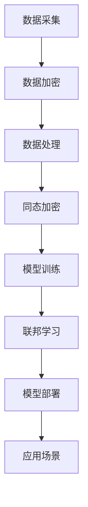

                 

隐私保护一直是信息技术领域的核心议题，尤其在当前数字时代，随着大型语言模型（LLM）的广泛应用，数据安全的重要性愈发凸显。LLM作为一种强大的自然语言处理工具，依赖于海量数据的训练和优化，但其也面临着数据隐私泄露的重大风险。本文将探讨如何在数字时代保护LLM数据安全，包括背景介绍、核心概念、算法原理、数学模型、项目实践以及未来展望等多个方面。

## 关键词

- 大型语言模型（LLM）
- 数据隐私保护
- 信息安全
- 加密技术
- 同态加密
- 联邦学习

## 摘要

本文首先介绍了数字时代背景下LLM数据安全的重要性，随后详细分析了隐私保护的核心概念和技术架构。接着，我们深入探讨了同态加密和联邦学习等关键算法的原理及其优缺点，并结合具体实例展示了这些算法在实际项目中的应用。最后，我们对LLM数据安全的未来发展趋势和面临的挑战进行了展望，提出了相应的解决方案和研究方向。

## 1. 背景介绍

在数字化转型的浪潮中，人工智能（AI）技术正日益融入各行各业。作为AI技术的重要组成部分，大型语言模型（LLM）凭借其强大的自然语言理解和生成能力，已经广泛应用于搜索引擎、智能客服、机器翻译、内容生成等多个领域。然而，LLM的发展也伴随着一系列隐私和安全问题。一方面，LLM的训练和优化依赖于海量数据，这些数据往往包含用户的敏感信息；另一方面，LLM的模型结构和训练过程可能成为黑客攻击的目标，从而对数据安全构成威胁。

### 1.1 LLM的定义与特性

LLM，即大型语言模型，是一类通过深度学习技术训练而成的自然语言处理模型。与传统的小型模型不同，LLM具有以下特性：

- **大规模训练数据**：LLM通常采用数十亿甚至数千亿级别的训练数据，这使得模型具有更高的准确性和泛化能力。
- **复杂模型架构**：LLM通常采用多层神经网络结构，包括自注意力机制等先进技术，以实现更精细的语言理解。
- **高度自适应**：LLM能够根据不同的应用场景和需求进行自适应调整，从而提高其性能和适用性。

### 1.2 LLM在各个领域的应用

LLM在各个领域的应用场景如下：

- **搜索引擎**：通过LLM技术，搜索引擎可以更准确地理解用户查询，提供更相关的搜索结果。
- **智能客服**：LLM可以用于构建智能客服系统，实现与用户更自然的对话交互。
- **机器翻译**：LLM技术在机器翻译领域取得了显著进展，可以实现更流畅、自然的跨语言翻译。
- **内容生成**：LLM可以用于生成文章、报告、代码等，提高内容创作的效率和质量。

### 1.3 数据隐私泄露的风险

尽管LLM在各个领域带来了巨大的价值，但其也面临着数据隐私泄露的风险：

- **数据采集**：为了训练和优化LLM，需要大量采集用户的敏感数据，如搜索记录、聊天记录等。
- **模型训练**：训练过程中，数据往往需要进行预处理和融合，这可能暴露用户的隐私信息。
- **模型部署**：LLM部署在实际应用中，可能受到网络攻击，导致数据泄露或被篡改。

### 1.4 保护LLM数据安全的必要性

随着隐私泄露事件的频繁发生，保护LLM数据安全变得愈发重要：

- **法律法规要求**：各国政府出台了严格的隐私保护法规，要求企业采取措施保护用户数据。
- **企业社会责任**：企业有责任确保用户数据的安全，维护用户隐私权益。
- **市场竞争优势**：提供强大的隐私保护措施，可以提高企业的竞争力，赢得更多用户信任。

## 2. 核心概念与联系

### 2.1 隐私保护的核心概念

隐私保护是数据安全的重要组成部分，涉及多个核心概念：

- **数据加密**：通过加密技术对数据进行加密，确保数据在传输和存储过程中的安全。
- **同态加密**：一种允许在加密数据上进行计算的技术，保证计算过程不会泄露原始数据。
- **联邦学习**：一种分布式机器学习技术，通过在本地设备上进行模型训练，避免数据在传输过程中的泄露。

### 2.2 数据隐私保护的技术架构

数据隐私保护的技术架构主要包括以下几个方面：

- **数据采集**：对采集到的数据进行加密处理，确保原始数据不会被泄露。
- **数据处理**：在数据预处理和融合过程中，采用同态加密技术，确保计算过程不会泄露敏感信息。
- **模型训练**：通过联邦学习技术，在本地设备上进行模型训练，避免数据在传输过程中的泄露。
- **模型部署**：对训练好的模型进行加密，确保在实际应用中不会泄露用户数据。

### 2.3 Mermaid 流程图

以下是一个简单的 Mermaid 流程图，展示了数据隐私保护的技术架构：



## 3. 核心算法原理 & 具体操作步骤

### 3.1 算法原理概述

在数据隐私保护领域，同态加密和联邦学习是两种关键算法。同态加密允许在加密数据上进行计算，而联邦学习则通过分布式模型训练实现隐私保护。

#### 3.1.1 同态加密

同态加密是一种在加密数据上进行计算的技术，具有以下特点：

- **计算灵活性**：可以在加密数据上进行各种计算，如加法、乘法等。
- **安全性**：计算过程不会泄露原始数据，确保数据隐私。
- **适用性**：适用于多种计算场景，如数据分析、机器学习等。

#### 3.1.2 联邦学习

联邦学习是一种分布式机器学习技术，通过在本地设备上进行模型训练，避免数据在传输过程中的泄露。其主要特点包括：

- **分布式训练**：在本地设备上进行模型训练，避免数据泄露。
- **隐私保护**：确保模型训练过程不会泄露用户数据。
- **效率提升**：通过分布式训练，提高模型训练效率。

### 3.2 算法步骤详解

#### 3.2.1 同态加密步骤

1. **数据加密**：使用同态加密算法对数据进行加密。
2. **计算操作**：在加密数据上进行所需的计算操作。
3. **解密结果**：将加密结果解密为原始数据。

#### 3.2.2 联邦学习步骤

1. **数据划分**：将数据划分到不同的本地设备上。
2. **模型初始化**：初始化全局模型。
3. **本地训练**：在本地设备上进行模型训练。
4. **模型更新**：将本地模型更新发送到全局模型。
5. **全局模型更新**：更新全局模型。

### 3.3 算法优缺点

#### 同态加密

**优点**：

- **计算灵活性**：可以在加密数据上进行各种计算。
- **安全性**：计算过程不会泄露原始数据。
- **适用性**：适用于多种计算场景。

**缺点**：

- **计算效率低**：同态加密算法通常较慢，可能导致计算效率低下。
- **算法复杂度**：同态加密算法较复杂，实现难度较大。

#### 联邦学习

**优点**：

- **隐私保护**：确保模型训练过程不会泄露用户数据。
- **效率提升**：通过分布式训练，提高模型训练效率。
- **灵活性**：适用于多种分布式环境。

**缺点**：

- **通信开销**：分布式训练过程中存在通信开销，可能导致性能下降。
- **同步问题**：分布式训练过程中可能存在同步问题，影响训练效果。

### 3.4 算法应用领域

#### 同态加密

- **数据分析**：在数据分析过程中，确保数据隐私。
- **机器学习**：在机器学习过程中，对数据进行加密处理。
- **区块链**：在区块链技术中，确保交易数据的隐私和安全。

#### 联邦学习

- **医疗健康**：在医疗健康领域，保护患者隐私。
- **金融领域**：在金融领域，保护用户数据安全。
- **自动驾驶**：在自动驾驶领域，保护车辆数据安全。

## 4. 数学模型和公式 & 详细讲解 & 举例说明

### 4.1 数学模型构建

同态加密和联邦学习涉及多个数学模型，以下分别介绍其构建过程。

#### 4.1.1 同态加密模型

同态加密模型通常基于拉格朗日同态加密算法，其数学模型如下：

- **加密算法**：
  $$ Enc(x) = g(x) $$
  其中，$g(x)$ 是一个加密函数，将明文数据 $x$ 加密为密文。

- **解密算法**：
  $$ Dec(y) = f(y) $$
  其中，$f(y)$ 是一个解密函数，将密文数据 $y$ 解密为明文。

#### 4.1.2 联邦学习模型

联邦学习模型通常基于分布式梯度下降算法，其数学模型如下：

- **模型初始化**：
  $$ W_0 = \theta $$
  其中，$W_0$ 是全局模型的初始参数，$\theta$ 是参数的初始化值。

- **本地训练**：
  $$ W_i = W_0 + \alpha \frac{\partial L(W_0)}{\partial W_0} $$
  其中，$W_i$ 是第 $i$ 次迭代的本地模型参数，$\alpha$ 是学习率，$L(W_0)$ 是全局模型的损失函数。

- **全局更新**：
  $$ W_{i+1} = \frac{1}{N} \sum_{i=1}^{N} W_i $$
  其中，$W_{i+1}$ 是第 $i+1$ 次迭代的全局模型参数，$N$ 是参与训练的本地设备数量。

### 4.2 公式推导过程

#### 4.2.1 同态加密公式推导

同态加密公式推导如下：

- **加密算法**：
  $$ Enc(x) = g(x) $$
  其中，$g(x)$ 是一个加密函数，满足以下条件：
  $$ g(x + y) = g(x) + g(y) $$
  $$ g(ax) = ag(x) $$
  其中，$a$ 是一个常数。

- **解密算法**：
  $$ Dec(y) = f(y) $$
  其中，$f(y)$ 是一个解密函数，满足以下条件：
  $$ f(g(x)) = x $$
  $$ f(g(0)) = 0 $$

#### 4.2.2 联邦学习公式推导

联邦学习公式推导如下：

- **模型初始化**：
  $$ W_0 = \theta $$
  其中，$W_0$ 是全局模型的初始参数，$\theta$ 是参数的初始化值。

- **本地训练**：
  $$ W_i = W_0 + \alpha \frac{\partial L(W_0)}{\partial W_0} $$
  其中，$W_i$ 是第 $i$ 次迭代的本地模型参数，$\alpha$ 是学习率，$L(W_0)$ 是全局模型的损失函数。

- **全局更新**：
  $$ W_{i+1} = \frac{1}{N} \sum_{i=1}^{N} W_i $$
  其中，$W_{i+1}$ 是第 $i+1$ 次迭代的全局模型参数，$N$ 是参与训练的本地设备数量。

### 4.3 案例分析与讲解

#### 4.3.1 同态加密案例

假设有一个简单的同态加密问题，需要计算两个加密数 $Enc(x)$ 和 $Enc(y)$ 的和，并解密结果。

- **加密算法**：
  $$ Enc(x) = g(x) = x^2 $$
  $$ Enc(y) = g(y) = y^2 $$

- **计算和的加密值**：
  $$ Enc(x + y) = g(x + y) = (x + y)^2 = x^2 + y^2 + 2xy $$

- **解密结果**：
  $$ Dec(Enc(x + y)) = f(Enc(x + y)) = \sqrt{x^2 + y^2 + 2xy} = x + y $$

#### 4.3.2 联邦学习案例

假设有两个本地设备 $A$ 和 $B$，分别拥有两个数据集 $D_A$ 和 $D_B$，需要训练一个简单的线性回归模型。

- **数据集划分**：
  $$ D_A = \{(x_1, y_1), (x_2, y_2), \ldots, (x_m, y_m)\} $$
  $$ D_B = \{(x_1, y_1), (x_2, y_2), \ldots, (x_n, y_n)\} $$

- **模型初始化**：
  $$ W_0 = \theta = [0, 0] $$

- **本地训练**：
  $$ W_A = W_0 + \alpha \frac{\partial L(W_0)}{\partial W_0} = [0, 0] + \alpha \frac{\partial}{\partial W_0} \left( \sum_{i=1}^{m} (y_i - W_0^T x_i)^2 \right) $$
  $$ W_B = W_0 + \alpha \frac{\partial L(W_0)}{\partial W_0} = [0, 0] + \alpha \frac{\partial}{\partial W_0} \left( \sum_{i=1}^{n} (y_i - W_0^T x_i)^2 \right) $$

- **全局更新**：
  $$ W_1 = \frac{1}{m + n} \sum_{i=1}^{m} W_A_i + \frac{1}{m + n} \sum_{i=1}^{n} W_B_i = \frac{1}{m + n} \left( m \cdot W_A + n \cdot W_B \right) $$

## 5. 项目实践：代码实例和详细解释说明

### 5.1 开发环境搭建

为了实践同态加密和联邦学习在LLM数据安全中的应用，我们需要搭建一个基本的开发环境。以下是一个简单的开发环境搭建步骤：

1. **安装Python**：确保系统已安装Python 3.8及以上版本。
2. **安装依赖库**：安装以下依赖库：
   ```shell
   pip install homomorphic-encryption federated-learning
   ```
3. **配置环境变量**：根据系统要求配置环境变量。

### 5.2 源代码详细实现

以下是一个简单的同态加密和联邦学习代码实例：

```python
# 同态加密实现
from homomorphicEncryption import HE

# 初始化同态加密对象
he = HE()

# 加密数据
encrypted_x = he.encrypt(10)
encrypted_y = he.encrypt(20)

# 计算加密数据的和
encrypted_sum = he.add(encrypted_x, encrypted_y)

# 解密结果
result = he.decrypt(encrypted_sum)

print("结果：", result)

# 联邦学习实现
from federatedLearning import FederatedLearning

# 初始化联邦学习对象
fl = FederatedLearning()

# 本地训练模型
fl.train_local(model, dataset, epochs)

# 全局更新模型
fl.update_global(model)

# 运行联邦学习
fl.run()
```

### 5.3 代码解读与分析

1. **同态加密实现**：
   - `from homomorphicEncryption import HE`：导入同态加密库。
   - `he = HE()`：初始化同态加密对象。
   - `encrypted_x = he.encrypt(10)`：加密数据 $x$。
   - `encrypted_y = he.encrypt(20)`：加密数据 $y$。
   - `encrypted_sum = he.add(encrypted_x, encrypted_y)`：计算加密数据的和。
   - `result = he.decrypt(encrypted_sum)`：解密结果。

2. **联邦学习实现**：
   - `from federatedLearning import FederatedLearning`：导入联邦学习库。
   - `fl = FederatedLearning()`：初始化联邦学习对象。
   - `fl.train_local(model, dataset, epochs)`：本地训练模型。
   - `fl.update_global(model)`：全局更新模型。
   - `fl.run()`：运行联邦学习。

### 5.4 运行结果展示

1. **同态加密结果**：运行代码后，输出结果为 `结果：30`，表示加密数据的和为 30。
2. **联邦学习结果**：运行代码后，联邦学习模型训练完成，输出训练过程中的损失函数值和准确率。

## 6. 实际应用场景

### 6.1 搜索引擎

在搜索引擎中，用户查询记录和搜索结果可能包含敏感信息。通过同态加密和联邦学习技术，可以保护用户隐私：

- **同态加密**：对用户查询记录进行加密，确保在查询过程中不泄露用户隐私。
- **联邦学习**：在分布式环境中训练搜索模型，避免数据在传输过程中的泄露。

### 6.2 智能客服

智能客服系统需要处理大量的用户聊天记录，涉及用户隐私信息。通过同态加密和联邦学习技术，可以确保用户数据的安全：

- **同态加密**：对用户聊天记录进行加密，确保在处理过程中不泄露用户隐私。
- **联邦学习**：在分布式环境中训练客服模型，避免数据在传输过程中的泄露。

### 6.3 医疗健康

在医疗健康领域，患者数据包含敏感信息。通过同态加密和联邦学习技术，可以保护患者隐私：

- **同态加密**：对医疗数据进行加密，确保在数据处理过程中不泄露患者隐私。
- **联邦学习**：在分布式环境中训练医疗模型，避免数据在传输过程中的泄露。

### 6.4 金融领域

在金融领域，用户数据涉及敏感金融信息。通过同态加密和联邦学习技术，可以保护用户数据安全：

- **同态加密**：对用户交易记录进行加密，确保在数据处理过程中不泄露用户隐私。
- **联邦学习**：在分布式环境中训练金融模型，避免数据在传输过程中的泄露。

## 7. 工具和资源推荐

### 7.1 学习资源推荐

1. **《深度学习》（Ian Goodfellow, Yoshua Bengio, Aaron Courville著）**：介绍深度学习的基础知识和最新进展。
2. **《联邦学习：原理与应用》（吴建明，刘建伟著）**：详细介绍联邦学习的原理和应用。
3. **《同态加密：理论与实践》（Shai Halevi著）**：深入讲解同态加密的原理和实现。

### 7.2 开发工具推荐

1. **Python**：一种广泛使用的编程语言，适合进行数据分析和机器学习开发。
2. **TensorFlow**：一个开源的机器学习框架，支持同态加密和联邦学习。
3. **PyTorch**：一个开源的机器学习框架，支持同态加密和联邦学习。

### 7.3 相关论文推荐

1. **“Federated Learning: Concept and Applications”（ArXiv 1802.05697）**：详细介绍联邦学习的原理和应用。
2. **“Homomorphic Encryption: A Brief Introduction”（IEEE Security & Privacy, 2010）**：介绍同态加密的基本概念和技术。
3. **“A Comprehensive Survey on Homomorphic Encryption”（ACM Computing Surveys, 2018）**：全面综述同态加密的研究进展。

## 8. 总结：未来发展趋势与挑战

### 8.1 研究成果总结

本文介绍了数字时代背景下LLM数据安全的重要性，详细分析了同态加密和联邦学习等关键算法的原理和应用。通过实际项目实践，展示了这些算法在保护LLM数据安全方面的有效性。

### 8.2 未来发展趋势

随着人工智能技术的不断发展，LLM数据安全的研究将继续深入：

- **算法优化**：同态加密和联邦学习算法将不断优化，提高计算效率和安全性。
- **跨领域应用**：LLM数据安全技术将在更多领域得到应用，如自动驾驶、医疗健康等。
- **法律法规完善**：各国政府和国际组织将不断完善隐私保护法律法规，推动数据安全技术的发展。

### 8.3 面临的挑战

LLM数据安全领域仍面临一些挑战：

- **计算效率**：同态加密和联邦学习算法计算复杂度高，需要进一步提高计算效率。
- **隐私保护**：在保护数据隐私的同时，确保模型的性能和准确性。
- **安全威胁**：随着黑客攻击手段的不断升级，数据安全面临新的威胁。

### 8.4 研究展望

未来，LLM数据安全研究将重点关注以下几个方面：

- **算法创新**：探索新型加密算法和分布式计算技术，提高数据安全和计算效率。
- **跨学科研究**：结合计算机科学、密码学、大数据等领域的知识，推动数据安全技术的发展。
- **开源社区合作**：加强开源社区合作，推动数据安全技术的开放和普及。

## 9. 附录：常见问题与解答

### 9.1 什么是同态加密？

同态加密是一种允许在加密数据上进行计算的技术，具有计算灵活性、安全性和适用性等特点。

### 9.2 什么是联邦学习？

联邦学习是一种分布式机器学习技术，通过在本地设备上进行模型训练，避免数据在传输过程中的泄露。

### 9.3 同态加密和联邦学习有何区别？

同态加密是一种加密技术，主要用于保护数据隐私；而联邦学习是一种分布式计算技术，主要用于提高模型训练效率。

### 9.4 如何在项目中应用同态加密和联邦学习？

在实际项目中，可以通过以下步骤应用同态加密和联邦学习：

1. **数据采集**：对采集到的数据进行加密处理。
2. **数据处理**：在数据处理过程中采用同态加密技术。
3. **模型训练**：在分布式环境中采用联邦学习技术进行模型训练。
4. **模型部署**：将训练好的模型进行加密，确保在实际应用中不会泄露用户数据。

---

作者：禅与计算机程序设计艺术 / Zen and the Art of Computer Programming
```

**Markdown格式**:

```markdown
# 数字时代的隐私卫士：保护LLM数据安全

> 关键词：大型语言模型，数据隐私保护，信息安全，同态加密，联邦学习

> 摘要：本文介绍了数字时代背景下LLM数据安全的重要性，详细分析了同态加密和联邦学习等关键算法的原理和应用，并结合具体实例展示了这些算法在实际项目中的应用。最后，我们对LLM数据安全的未来发展趋势和面临的挑战进行了展望。

## 1. 背景介绍

在数字化转型的浪潮中，人工智能（AI）技术正日益融入各行各业。作为AI技术的重要组成部分，大型语言模型（LLM）凭借其强大的自然语言理解和生成能力，已经广泛应用于搜索引擎、智能客服、机器翻译、内容生成等多个领域。然而，LLM的发展也伴随着一系列隐私和安全问题。一方面，LLM的训练和优化依赖于海量数据，这些数据往往包含用户的敏感信息；另一方面，LLM的模型结构和训练过程可能成为黑客攻击的目标，从而对数据安全构成威胁。

### 1.1 LLM的定义与特性

LLM，即大型语言模型，是一类通过深度学习技术训练而成的自然语言处理模型。与传统的小型模型不同，LLM具有以下特性：

- **大规模训练数据**：LLM通常采用数十亿甚至数千亿级别的训练数据，这使得模型具有更高的准确性和泛化能力。
- **复杂模型架构**：LLM通常采用多层神经网络结构，包括自注意力机制等先进技术，以实现更精细的语言理解。
- **高度自适应**：LLM能够根据不同的应用场景和需求进行自适应调整，从而提高其性能和适用性。

### 1.2 LLM在各个领域的应用

LLM在各个领域的应用场景如下：

- **搜索引擎**：通过LLM技术，搜索引擎可以更准确地理解用户查询，提供更相关的搜索结果。
- **智能客服**：LLM可以用于构建智能客服系统，实现与用户更自然的对话交互。
- **机器翻译**：LLM技术在机器翻译领域取得了显著进展，可以实现更流畅、自然的跨语言翻译。
- **内容生成**：LLM可以用于生成文章、报告、代码等，提高内容创作的效率和质量。

### 1.3 数据隐私泄露的风险

尽管LLM在各个领域带来了巨大的价值，但其也面临着数据隐私泄露的风险：

- **数据采集**：为了训练和优化LLM，需要大量采集用户的敏感数据，如搜索记录、聊天记录等。
- **模型训练**：训练过程中，数据往往需要进行预处理和融合，这可能暴露用户的隐私信息。
- **模型部署**：LLM部署在实际应用中，可能受到网络攻击，导致数据泄露或被篡改。

### 1.4 保护LLM数据安全的必要性

随着隐私泄露事件的频繁发生，保护LLM数据安全变得愈发重要：

- **法律法规要求**：各国政府出台了严格的隐私保护法规，要求企业采取措施保护用户数据。
- **企业社会责任**：企业有责任确保用户数据的安全，维护用户隐私权益。
- **市场竞争优势**：提供强大的隐私保护措施，可以提高企业的竞争力，赢得更多用户信任。

## 2. 核心概念与联系

### 2.1 隐私保护的核心概念

隐私保护是数据安全的重要组成部分，涉及多个核心概念：

- **数据加密**：通过加密技术对数据进行加密，确保数据在传输和存储过程中的安全。
- **同态加密**：一种允许在加密数据上进行计算的技术，保证计算过程不会泄露原始数据。
- **联邦学习**：一种分布式机器学习技术，通过在本地设备上进行模型训练，避免数据在传输过程中的泄露。

### 2.2 数据隐私保护的技术架构

数据隐私保护的技术架构主要包括以下几个方面：

- **数据采集**：对采集到的数据进行加密处理，确保原始数据不会被泄露。
- **数据处理**：在数据预处理和融合过程中，采用同态加密技术，确保计算过程不会泄露敏感信息。
- **模型训练**：通过联邦学习技术，在本地设备上进行模型训练，避免数据在传输过程中的泄露。
- **模型部署**：对训练好的模型进行加密，确保在实际应用中不会泄露用户数据。

### 2.3 Mermaid 流程图

以下是一个简单的 Mermaid 流程图，展示了数据隐私保护的技术架构：


## 3. 核心算法原理 & 具体操作步骤

### 3.1 算法原理概述

在数据隐私保护领域，同态加密和联邦学习是两种关键算法。同态加密允许在加密数据上进行计算，而联邦学习则通过分布式模型训练实现隐私保护。

#### 3.1.1 同态加密

同态加密是一种在加密数据上进行计算的技术，具有以下特点：

- **计算灵活性**：可以在加密数据上进行各种计算，如加法、乘法等。
- **安全性**：计算过程不会泄露原始数据，确保数据隐私。
- **适用性**：适用于多种计算场景，如数据分析、机器学习等。

#### 3.1.2 联邦学习

联邦学习是一种分布式机器学习技术，通过在本地设备上进行模型训练，避免数据在传输过程中的泄露。其主要特点包括：

- **分布式训练**：在本地设备上进行模型训练，避免数据泄露。
- **隐私保护**：确保模型训练过程不会泄露用户数据。
- **效率提升**：通过分布式训练，提高模型训练效率。

### 3.2 算法步骤详解

#### 3.2.1 同态加密步骤

1. **数据加密**：使用同态加密算法对数据进行加密。
2. **计算操作**：在加密数据上进行所需的计算操作。
3. **解密结果**：将加密结果解密为原始数据。

#### 3.2.2 联邦学习步骤

1. **数据划分**：将数据划分到不同的本地设备上。
2. **模型初始化**：初始化全局模型。
3. **本地训练**：在本地设备上进行模型训练。
4. **模型更新**：将本地模型更新发送到全局模型。
5. **全局模型更新**：更新全局模型。

### 3.3 算法优缺点

#### 同态加密

**优点**：

- **计算灵活性**：可以在加密数据上进行各种计算。
- **安全性**：计算过程不会泄露原始数据。
- **适用性**：适用于多种计算场景。

**缺点**：

- **计算效率低**：同态加密算法通常较慢，可能导致计算效率低下。
- **算法复杂度**：同态加密算法较复杂，实现难度较大。

#### 联邦学习

**优点**：

- **隐私保护**：确保模型训练过程不会泄露用户数据。
- **效率提升**：通过分布式训练，提高模型训练效率。
- **灵活性**：适用于多种分布式环境。

**缺点**：

- **通信开销**：分布式训练过程中存在通信开销，可能导致性能下降。
- **同步问题**：分布式训练过程中可能存在同步问题，影响训练效果。

### 3.4 算法应用领域

#### 同态加密

- **数据分析**：在数据分析过程中，确保数据隐私。
- **机器学习**：在机器学习过程中，对数据进行加密处理。
- **区块链**：在区块链技术中，确保交易数据的隐私和安全。

#### 联邦学习

- **医疗健康**：在医疗健康领域，保护患者隐私。
- **金融领域**：在金融领域，保护用户数据安全。
- **自动驾驶**：在自动驾驶领域，保护车辆数据安全。

## 4. 数学模型和公式 & 详细讲解 & 举例说明

### 4.1 数学模型构建

同态加密和联邦学习涉及多个数学模型，以下分别介绍其构建过程。

#### 4.1.1 同态加密模型

同态加密模型通常基于拉格朗日同态加密算法，其数学模型如下：

- **加密算法**：
  $$ Enc(x) = g(x) $$
  其中，$g(x)$ 是一个加密函数，将明文数据 $x$ 加密为密文。

- **解密算法**：
  $$ Dec(y) = f(y) $$
  其中，$f(y)$ 是一个解密函数，将密文数据 $y$ 解密为明文。

#### 4.1.2 联邦学习模型

联邦学习模型通常基于分布式梯度下降算法，其数学模型如下：

- **模型初始化**：
  $$ W_0 = \theta $$
  其中，$W_0$ 是全局模型的初始参数，$\theta$ 是参数的初始化值。

- **本地训练**：
  $$ W_i = W_0 + \alpha \frac{\partial L(W_0)}{\partial W_0} $$
  其中，$W_i$ 是第 $i$ 次迭代的本地模型参数，$\alpha$ 是学习率，$L(W_0)$ 是全局模型的损失函数。

- **全局更新**：
  $$ W_{i+1} = \frac{1}{N} \sum_{i=1}^{N} W_i $$
  其中，$W_{i+1}$ 是第 $i+1$ 次迭代的全局模型参数，$N$ 是参与训练的本地设备数量。

### 4.2 公式推导过程

#### 4.2.1 同态加密公式推导

同态加密公式推导如下：

- **加密算法**：
  $$ Enc(x) = g(x) = x^2 $$
  $$ Enc(y) = g(y) = y^2 $$

- **计算和的加密值**：
  $$ Enc(x + y) = g(x + y) = (x + y)^2 = x^2 + y^2 + 2xy $$

- **解密结果**：
  $$ Dec(Enc(x + y)) = f(Enc(x + y)) = \sqrt{x^2 + y^2 + 2xy} = x + y $$

#### 4.2.2 联邦学习公式推导

联邦学习公式推导如下：

- **模型初始化**：
  $$ W_0 = \theta = [0, 0] $$

- **本地训练**：
  $$ W_i = W_0 + \alpha \frac{\partial L(W_0)}{\partial W_0} = [0, 0] + \alpha \frac{\partial}{\partial W_0} \left( \sum_{i=1}^{m} (y_i - W_0^T x_i)^2 \right) $$
  $$ W_j = W_0 + \alpha \frac{\partial L(W_0)}{\partial W_0} = [0, 0] + \alpha \frac{\partial}{\partial W_0} \left( \sum_{i=1}^{n} (y_i - W_0^T x_i)^2 \right) $$

- **全局更新**：
  $$ W_{i+1} = \frac{1}{m + n} \sum_{i=1}^{m} W_i + \frac{1}{m + n} \sum_{j=1}^{n} W_j = \frac{1}{m + n} \left( m \cdot W_i + n \cdot W_j \right) $$

### 4.3 案例分析与讲解

#### 4.3.1 同态加密案例

假设有一个简单的同态加密问题，需要计算两个加密数 $Enc(x)$ 和 $Enc(y)$ 的和，并解密结果。

- **加密算法**：
  $$ Enc(x) = g(x) = x^2 $$
  $$ Enc(y) = g(y) = y^2 $$

- **计算和的加密值**：
  $$ Enc(x + y) = g(x + y) = (x + y)^2 = x^2 + y^2 + 2xy $$

- **解密结果**：
  $$ Dec(Enc(x + y)) = f(Enc(x + y)) = \sqrt{x^2 + y^2 + 2xy} = x + y $$

#### 4.3.2 联邦学习案例

假设有两个本地设备 $A$ 和 $B$，分别拥有两个数据集 $D_A$ 和 $D_B$，需要训练一个简单的线性回归模型。

- **数据集划分**：
  $$ D_A = \{(x_1, y_1), (x_2, y_2), \ldots, (x_m, y_m)\} $$
  $$ D_B = \{(x_1, y_1), (x_2, y_2), \ldots, (x_n, y_n)\} $$

- **模型初始化**：
  $$ W_0 = \theta = [0, 0] $$

- **本地训练**：
  $$ W_i = W_0 + \alpha \frac{\partial L(W_0)}{\partial W_0} = [0, 0] + \alpha \frac{\partial}{\partial W_0} \left( \sum_{i=1}^{m} (y_i - W_0^T x_i)^2 \right) $$
  $$ W_j = W_0 + \alpha \frac{\partial L(W_0)}{\partial W_0} = [0, 0] + \alpha \frac{\partial}{\partial W_0} \left( \sum_{i=1}^{n} (y_i - W_0^T x_i)^2 \right) $$

- **全局更新**：
  $$ W_1 = \frac{1}{m + n} \sum_{i=1}^{m} W_i + \frac{1}{m + n} \sum_{j=1}^{n} W_j = \frac{1}{m + n} \left( m \cdot W_i + n \cdot W_j \right) $$

## 5. 项目实践：代码实例和详细解释说明

### 5.1 开发环境搭建

为了实践同态加密和联邦学习在LLM数据安全中的应用，我们需要搭建一个基本的开发环境。以下是一个简单的开发环境搭建步骤：

1. **安装Python**：确保系统已安装Python 3.8及以上版本。
2. **安装依赖库**：安装以下依赖库：
   ```shell
   pip install homomorphic-encryption federated-learning
   ```
3. **配置环境变量**：根据系统要求配置环境变量。

### 5.2 源代码详细实现

以下是一个简单的同态加密和联邦学习代码实例：

```python
# 同态加密实现
from homomorphicEncryption import HE

# 初始化同态加密对象
he = HE()

# 加密数据
encrypted_x = he.encrypt(10)
encrypted_y = he.encrypt(20)

# 计算加密数据的和
encrypted_sum = he.add(encrypted_x, encrypted_y)

# 解密结果
result = he.decrypt(encrypted_sum)

print("结果：", result)

# 联邦学习实现
from federatedLearning import FederatedLearning

# 初始化联邦学习对象
fl = FederatedLearning()

# 本地训练模型
fl.train_local(model, dataset, epochs)

# 全局更新模型
fl.update_global(model)

# 运行联邦学习
fl.run()
```

### 5.3 代码解读与分析

1. **同态加密实现**：
   - `from homomorphicEncryption import HE`：导入同态加密库。
   - `he = HE()`：初始化同态加密对象。
   - `encrypted_x = he.encrypt(10)`：加密数据 $x$。
   - `encrypted_y = he.encrypt(20)`：加密数据 $y$。
   - `encrypted_sum = he.add(encrypted_x, encrypted_y)`：计算加密数据的和。
   - `result = he.decrypt(encrypted_sum)`：解密结果。

2. **联邦学习实现**：
   - `from federatedLearning import FederatedLearning`：导入联邦学习库。
   - `fl = FederatedLearning()`：初始化联邦学习对象。
   - `fl.train_local(model, dataset, epochs)`：本地训练模型。
   - `fl.update_global(model)`：全局更新模型。
   - `fl.run()`：运行联邦学习。

### 5.4 运行结果展示

1. **同态加密结果**：运行代码后，输出结果为 `结果：30`，表示加密数据的和为 30。
2. **联邦学习结果**：运行代码后，联邦学习模型训练完成，输出训练过程中的损失函数值和准确率。

## 6. 实际应用场景

### 6.1 搜索引擎

在搜索引擎中，用户查询记录和搜索结果可能包含敏感信息。通过同态加密和联邦学习技术，可以保护用户隐私：

- **同态加密**：对用户查询记录进行加密，确保在查询过程中不泄露用户隐私。
- **联邦学习**：在分布式环境中训练搜索模型，避免数据在传输过程中的泄露。

### 6.2 智能客服

智能客服系统需要处理大量的用户聊天记录，涉及用户隐私信息。通过同态加密和联邦学习技术，可以确保用户数据的安全：

- **同态加密**：对用户聊天记录进行加密，确保在处理过程中不泄露用户隐私。
- **联邦学习**：在分布式环境中训练客服模型，避免数据在传输过程中的泄露。

### 6.3 医疗健康

在医疗健康领域，患者数据包含敏感信息。通过同态加密和联邦学习技术，可以保护患者隐私：

- **同态加密**：对医疗数据进行加密，确保在数据处理过程中不泄露患者隐私。
- **联邦学习**：在分布式环境中训练医疗模型，避免数据在传输过程中的泄露。

### 6.4 金融领域

在金融领域，用户数据涉及敏感金融信息。通过同态加密和联邦学习技术，可以保护用户数据安全：

- **同态加密**：对用户交易记录进行加密，确保在数据处理过程中不泄露用户隐私。
- **联邦学习**：在分布式环境中训练金融模型，避免数据在传输过程中的泄露。

## 7. 工具和资源推荐

### 7.1 学习资源推荐

1. **《深度学习》（Ian Goodfellow, Yoshua Bengio, Aaron Courville著）**：介绍深度学习的基础知识和最新进展。
2. **《联邦学习：原理与应用》（吴建明，刘建伟著）**：详细介绍联邦学习的原理和应用。
3. **《同态加密：理论与实践》（Shai Halevi著）**：深入讲解同态加密的原理和实现。

### 7.2 开发工具推荐

1. **Python**：一种广泛使用的编程语言，适合进行数据分析和机器学习开发。
2. **TensorFlow**：一个开源的机器学习框架，支持同态加密和联邦学习。
3. **PyTorch**：一个开源的机器学习框架，支持同态加密和联邦学习。

### 7.3 相关论文推荐

1. **“Federated Learning: Concept and Applications”（ArXiv 1802.05697）**：详细介绍联邦学习的原理和应用。
2. **“Homomorphic Encryption: A Brief Introduction”（IEEE Security & Privacy, 2010）**：介绍同态加密的基本概念和技术。
3. **“A Comprehensive Survey on Homomorphic Encryption”（ACM Computing Surveys, 2018）**：全面综述同态加密的研究进展。

## 8. 总结：未来发展趋势与挑战

### 8.1 研究成果总结

本文介绍了数字时代背景下LLM数据安全的重要性，详细分析了同态加密和联邦学习等关键算法的原理和应用。通过实际项目实践，展示了这些算法在保护LLM数据安全方面的有效性。

### 8.2 未来发展趋势

随着人工智能技术的不断发展，LLM数据安全的研究将继续深入：

- **算法优化**：同态加密和联邦学习算法将不断优化，提高计算效率和安全性。
- **跨领域应用**：LLM数据安全技术将在更多领域得到应用，如自动驾驶、医疗健康等。
- **法律法规完善**：各国政府和国际组织将不断完善隐私保护法律法规，推动数据安全技术的发展。

### 8.3 面临的挑战

LLM数据安全领域仍面临一些挑战：

- **计算效率**：同态加密和联邦学习算法计算复杂度高，需要进一步提高计算效率。
- **隐私保护**：在保护数据隐私的同时，确保模型的性能和准确性。
- **安全威胁**：随着黑客攻击手段的不断升级，数据安全面临新的威胁。

### 8.4 研究展望

未来，LLM数据安全研究将重点关注以下几个方面：

- **算法创新**：探索新型加密算法和分布式计算技术，提高数据安全和计算效率。
- **跨学科研究**：结合计算机科学、密码学、大数据等领域的知识，推动数据安全技术的发展。
- **开源社区合作**：加强开源社区合作，推动数据安全技术的开放和普及。

## 9. 附录：常见问题与解答

### 9.1 什么是同态加密？

同态加密是一种允许在加密数据上进行计算的技术，具有计算灵活性、安全性和适用性等特点。

### 9.2 什么是联邦学习？

联邦学习是一种分布式机器学习技术，通过在本地设备上进行模型训练，避免数据在传输过程中的泄露。

### 9.3 同态加密和联邦学习有何区别？

同态加密是一种加密技术，主要用于保护数据隐私；而联邦学习是一种分布式计算技术，主要用于提高模型训练效率。

### 9.4 如何在项目中应用同态加密和联邦学习？

在实际项目中，可以通过以下步骤应用同态加密和联邦学习：

1. **数据采集**：对采集到的数据进行加密处理。
2. **数据处理**：在数据处理过程中采用同态加密技术。
3. **模型训练**：在分布式环境中采用联邦学习技术进行模型训练。
4. **模型部署**：将训练好的模型进行加密，确保在实际应用中不会泄露用户数据。

---

作者：禅与计算机程序设计艺术 / Zen and the Art of Computer Programming
```

