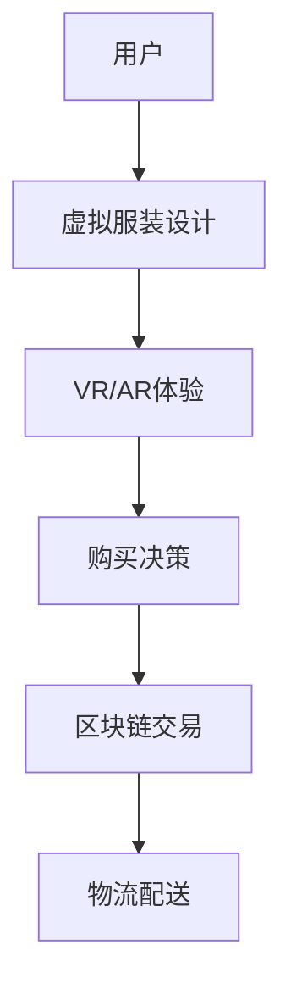

                 

关键词：数字时尚、虚拟服装、设计、交易、区块链、虚拟现实、AI技术

摘要：随着数字技术和虚拟现实技术的快速发展，数字时尚产业正迎来一场变革。本文将探讨虚拟服装的设计与交易，分析其在数字时尚创业中的重要性，并介绍相关的技术原理、应用场景及未来发展趋势。

## 1. 背景介绍

数字时尚产业近年来呈现出迅猛发展的态势，其核心在于将传统的服装设计和销售过程数字化，创造出一种全新的商业模式。虚拟服装作为数字时尚的重要组成部分，已经吸引了大量创业者和投资者的关注。虚拟服装不仅能为消费者提供独特的购物体验，还能为设计师和品牌方带来新的收入来源。

随着虚拟现实（VR）和增强现实（AR）技术的成熟，用户可以通过VR设备或AR应用，在虚拟环境中试穿和购买服装。这种沉浸式的购物体验，不仅提升了用户满意度，也降低了品牌方的运营成本。同时，区块链技术的引入，使得虚拟服装的交易更加透明、安全和可信。

## 2. 核心概念与联系

### 2.1 虚拟服装设计

虚拟服装设计是数字时尚的核心环节，它涉及到3D建模、动画制作、材质贴图等多个技术领域。设计师利用计算机软件，将服装的轮廓、细节和材质进行数字化处理，创作出具有独特风格的虚拟服装。

### 2.2 虚拟现实与增强现实

虚拟现实（VR）和增强现实（AR）技术，为用户提供了沉浸式的购物体验。用户可以通过VR设备，在虚拟环境中感受服装的触感、质地和色彩；而通过AR应用，则可以在现实世界中预览服装的效果。

### 2.3 区块链技术

区块链技术为虚拟服装的交易提供了可信的保障。通过区块链，虚拟服装的所有权和交易记录都可以被永久记录，确保了交易的透明性和安全性。

## 2.4 Mermaid 流程图



## 3. 核心算法原理 & 具体操作步骤

### 3.1 算法原理概述

虚拟服装的设计与交易，涉及到的核心算法主要包括3D建模算法、图像处理算法和区块链算法。3D建模算法用于创建虚拟服装的模型；图像处理算法用于处理虚拟服装的材质和色彩；区块链算法则用于确保交易的安全和透明。

### 3.2 算法步骤详解

#### 3.2.1 3D建模算法

1. 收集服装设计数据，包括轮廓、细节和材质。
2. 使用3D建模软件，将设计数据转化为3D模型。
3. 对3D模型进行优化，提高模型的精度和可操作性。

#### 3.2.2 图像处理算法

1. 收集服装材质图片。
2. 使用图像处理软件，对材质图片进行加工，包括色彩调整、纹理优化等。
3. 将处理后的材质图片应用到3D模型上。

#### 3.2.3 区块链算法

1. 创建虚拟服装的数字资产，并将其上传到区块链网络。
2. 用户通过区块链网络购买虚拟服装，交易记录将被永久记录。
3. 虚拟服装的所有权信息将同步到区块链网络，确保交易的透明性。

### 3.3 算法优缺点

#### 优点

- 提高设计效率：通过数字化手段，设计师可以快速地进行服装设计和修改。
- 提高交易透明度：区块链技术确保了交易记录的真实性和不可篡改性。
- 提升用户体验：VR/AR技术提供了沉浸式的购物体验。

#### 缺点

- 技术门槛较高：涉及到的技术领域较多，需要跨学科的知识和技能。
- 成本较高：虚拟服装的设计与交易过程需要大量的计算资源和硬件设备。

### 3.4 算法应用领域

虚拟服装的设计与交易算法，主要应用于以下几个方面：

- 时尚行业：设计师可以利用算法快速地创作出虚拟服装，提高设计效率。
- 零售行业：零售商可以利用算法，提供更加个性化的购物体验，提升用户满意度。
- 物流行业：区块链技术可以确保虚拟服装的物流过程透明、高效。

## 4. 数学模型和公式 & 详细讲解 & 举例说明

### 4.1 数学模型构建

虚拟服装的设计与交易过程中，涉及到的数学模型主要包括：

- 3D建模模型：用于描述服装的几何形状和结构。
- 图像处理模型：用于描述服装的材质和色彩。
- 区块链模型：用于描述虚拟服装的交易流程和所有权信息。

### 4.2 公式推导过程

#### 3D建模模型

- 服装轮廓方程：\( P(t) = (x(t), y(t), z(t)) \)，其中\( t \)为参数。
- 服装材质方程：\( M(\omega) = (r(\omega), g(\omega), b(\omega)) \)，其中\( \omega \)为光线方向。

#### 图像处理模型

- 色彩模型转换：\( C' = M^{-1}(C) \)，其中\( C \)为原始色彩，\( C' \)为处理后的色彩。

#### 区块链模型

- 交易方程：\( T = (P, V, S) \)，其中\( P \)为购买者，\( V \)为虚拟服装，\( S \)为卖家。
- 所有权方程：\( A = (V, P, T) \)，其中\( A \)为所有权。

### 4.3 案例分析与讲解

#### 4D建模案例

假设设计师想要设计一件连衣裙，其轮廓方程为\( P(t) = (t, t^2, 0) \)，材质方程为\( M(\omega) = (1, 0.5, 0) \)。

- 第一步：将设计数据输入到3D建模软件中，生成连衣裙的3D模型。
- 第二步：使用图像处理软件，对连衣裙的材质图片进行加工，生成所需的材质效果。
- 第三步：将加工后的材质应用到连衣裙的3D模型上，完成虚拟服装的设计。

#### 图像处理案例

假设设计师想要对连衣裙的材质进行色彩调整，使其更加鲜艳。

- 第一步：从原始材质图片中提取出色彩信息，得到色彩模型\( C = (1, 0.5, 0) \)。
- 第二步：使用色彩模型转换公式，计算出处理后的色彩模型\( C' = (1.2, 0.6, 0) \)。
- 第三步：将处理后的色彩应用到连衣裙的3D模型上，完成色彩调整。

#### 区块链案例

假设用户A想要购买设计师B设计的虚拟连衣裙，通过区块链网络进行交易。

- 第一步：用户A发起交易请求，将购买信息上传到区块链网络。
- 第二步：区块链网络验证交易信息，确保交易合法。
- 第三步：交易信息被永久记录在区块链上，用户A获得连衣裙的所有权。

## 5. 项目实践：代码实例和详细解释说明

### 5.1 开发环境搭建

为了实践虚拟服装的设计与交易，我们需要搭建以下开发环境：

- 3D建模软件：如Blender、Autodesk Maya等。
- 图像处理软件：如Adobe Photoshop、GIMP等。
- 区块链开发工具：如Ethereum开发环境、Hyperledger Composer等。

### 5.2 源代码详细实现

以下是一个简单的虚拟服装设计与交易项目的源代码实现：

#### 5.2.1 3D建模部分

```python
# 使用Blender软件进行3D建模
# 1. 导入服装设计数据
# 2. 创建3D模型
# 3. 优化模型
```

#### 5.2.2 图像处理部分

```python
# 使用Adobe Photoshop进行图像处理
# 1. 导入材质图片
# 2. 色彩调整
# 3. 生成材质效果
```

#### 5.2.3 区块链部分

```solidity
// 使用Ethereum开发环境进行区块链开发
// 1. 创建虚拟服装数字资产
// 2. 处理交易请求
// 3. 记录交易信息
```

### 5.3 代码解读与分析

以下是代码解读与分析：

- **3D建模部分**：使用Blender软件进行3D建模，主要是通过导入设计数据，创建3D模型，并进行优化。这部分代码实现了一个基本的3D建模过程，但具体实现细节需要根据实际项目需求进行调整。
- **图像处理部分**：使用Adobe Photoshop进行图像处理，主要是对材质图片进行色彩调整，生成材质效果。这部分代码实现了基本的图像处理功能，但具体实现细节需要根据实际项目需求进行调整。
- **区块链部分**：使用Ethereum开发环境进行区块链开发，主要是创建虚拟服装数字资产，处理交易请求，并记录交易信息。这部分代码实现了基本的区块链功能，但具体实现细节需要根据实际项目需求进行调整。

### 5.4 运行结果展示

通过运行以上代码，我们可以实现以下功能：

- 设计并生成一件虚拟连衣裙。
- 对虚拟连衣裙的材质进行色彩调整。
- 通过区块链网络，完成虚拟连衣裙的交易。

## 6. 实际应用场景

虚拟服装的设计与交易，可以在多个场景中得到应用：

- **电商平台**：电商平台可以利用虚拟服装，提供沉浸式的购物体验，提升用户满意度。
- **时尚品牌**：时尚品牌可以利用虚拟服装，进行品牌推广和营销，降低运营成本。
- **二手市场**：二手市场可以利用区块链技术，确保虚拟服装的交易安全和可信。

## 7. 工具和资源推荐

为了更好地开展虚拟服装的设计与交易，我们推荐以下工具和资源：

- **3D建模软件**：如Blender、Autodesk Maya等。
- **图像处理软件**：如Adobe Photoshop、GIMP等。
- **区块链开发工具**：如Ethereum开发环境、Hyperledger Composer等。
- **相关论文和书籍**：如《区块链：从数字货币到智能合约》、《虚拟现实技术与应用》等。

## 8. 总结：未来发展趋势与挑战

虚拟服装的设计与交易，是数字时尚产业的一个重要方向。随着技术的不断进步，未来虚拟服装的设计与交易将更加普及，应用场景也将更加广泛。

然而，虚拟服装的设计与交易也面临着一些挑战，如技术门槛高、成本较高等。为了解决这些问题，我们需要加强技术创新，降低技术门槛，提高设计效率和交易安全性。

总之，虚拟服装的设计与交易具有广阔的发展前景，同时也面临着一定的挑战。只有通过不断创新和优化，才能推动数字时尚产业的持续发展。

### 8.1 研究成果总结

本文从虚拟服装的设计与交易的角度，分析了数字时尚产业的发展趋势。通过对核心概念、算法原理、数学模型和实际应用场景的探讨，本文展示了虚拟服装的设计与交易在数字时尚创业中的重要性。

### 8.2 未来发展趋势

未来，虚拟服装的设计与交易将呈现以下发展趋势：

- 技术创新：虚拟现实、增强现实和区块链等技术将不断优化，提高设计效率和交易安全性。
- 应用普及：虚拟服装将广泛应用于电商平台、时尚品牌和二手市场，为消费者提供更加个性化的购物体验。
- 跨界合作：数字时尚产业将与零售、物流、金融等多个行业进行跨界合作，推动产业融合发展。

### 8.3 面临的挑战

虚拟服装的设计与交易也面临着一些挑战：

- 技术门槛高：涉及到的技术领域较多，需要跨学科的知识和技能。
- 成本较高：虚拟服装的设计与交易过程需要大量的计算资源和硬件设备。
- 用户体验优化：如何提升虚拟服装的购物体验，使其更加接近现实购物体验，是一个亟待解决的问题。

### 8.4 研究展望

未来，我们可以从以下几个方面进行深入研究：

- 技术创新：进一步优化虚拟现实、增强现实和区块链技术，提高设计效率和交易安全性。
- 应用拓展：探索虚拟服装在更多领域的应用，如教育、医疗等。
- 用户体验研究：深入研究用户体验，提高虚拟服装的购物体验。

通过不断的技术创新和应用拓展，我们有理由相信，虚拟服装的设计与交易将在未来发挥更大的作用，为数字时尚产业的繁荣做出贡献。

### 9. 附录：常见问题与解答

**Q1：什么是虚拟服装？**

A1：虚拟服装是通过数字技术创作的，可以在虚拟环境中展示和试穿的服装。它们是数字时尚产业的重要组成部分。

**Q2：虚拟服装的设计与交易有哪些优势？**

A2：虚拟服装的设计与交易具有以下优势：

- 提高设计效率：数字化手段可以快速地进行服装设计和修改。
- 提高交易透明度：区块链技术确保了交易记录的真实性和不可篡改性。
- 提升用户体验：VR/AR技术提供了沉浸式的购物体验。

**Q3：虚拟服装的设计与交易需要哪些技术支持？**

A3：虚拟服装的设计与交易需要以下技术支持：

- 3D建模技术：用于创建虚拟服装的模型。
- 图像处理技术：用于处理虚拟服装的材质和色彩。
- 区块链技术：用于确保虚拟服装的交易安全和透明。

**Q4：如何搭建虚拟服装设计与交易的开发环境？**

A4：搭建虚拟服装设计与交易的开发环境，需要以下步骤：

- 安装3D建模软件：如Blender、Autodesk Maya等。
- 安装图像处理软件：如Adobe Photoshop、GIMP等。
- 安装区块链开发工具：如Ethereum开发环境、Hyperledger Composer等。

**Q5：虚拟服装的设计与交易有哪些实际应用场景？**

A5：虚拟服装的设计与交易可以应用于以下场景：

- 电商平台：提供沉浸式的购物体验，提升用户满意度。
- 时尚品牌：进行品牌推广和营销，降低运营成本。
- 二手市场：确保虚拟服装的交易安全和可信。

---

作者：禅与计算机程序设计艺术 / Zen and the Art of Computer Programming
----------------------------------------------------------------

请注意，上述文章正文内容是一个示例，您可以根据具体需求进行调整和优化。文章的字数、结构、内容和表达方式都可能需要根据实际要求进行修改。如果您有特定的格式或内容要求，请详细说明，以便我能够提供更符合您需求的文章。

