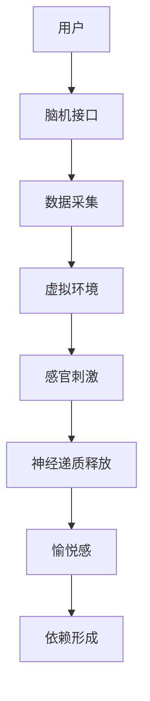

                 

关键词：人工智能、沉浸式体验、数字毒品、AI技术、交互设计、心理影响

摘要：本文探讨了人工智能（AI）在创造沉浸式体验方面的应用，尤其是“数字毒品”这一概念，指出了其潜藏的心理风险。通过分析AI技术的核心概念与联系，我们深入了解了数字毒品的原理及其对人类心理和行为的影响。文章还探讨了核心算法原理、数学模型、项目实践以及未来应用场景，提出了工具和资源推荐，并对未来发展趋势与挑战进行了展望。

## 1. 背景介绍

随着人工智能技术的迅猛发展，虚拟现实（VR）和增强现实（AR）等技术逐渐走进了大众的视野。这些技术通过模拟和增强现实环境，为用户提供了一种全新的沉浸式体验。然而，在这些技术中，一种名为“数字毒品”的沉浸式体验正悄然兴起，给用户带来极度愉悦的同时，也引发了一系列心理和社会问题。

### 1.1 数字毒品的定义

数字毒品是一种通过数字技术创造的沉浸式体验，使用户沉浸在虚拟世界中，无法自拔。这种体验通常通过高度真实的视觉效果、声音效果和触觉反馈来实现，让用户感受到一种超越现实的极致体验。

### 1.2 数字毒品的发展历程

数字毒品的发展可以追溯到虚拟现实技术的兴起。早在20世纪80年代，VR技术就开始应用于军事、医疗和娱乐等领域。随着计算机性能的提升和网络技术的进步，VR技术逐渐走向了大众市场。然而，随着技术的进一步发展，数字毒品开始脱离了原本的娱乐目的，演变成了一种新的心理依赖。

## 2. 核心概念与联系

在探讨数字毒品的核心概念与联系之前，我们需要先了解一些关键的技术和理论。

### 2.1 虚拟现实技术

虚拟现实技术（VR）是一种通过计算机生成模拟环境，让用户在其中进行交互和体验的技术。VR技术主要通过头戴式显示器（HMD）、传感器和手柄等设备实现。这些设备可以捕捉用户的动作，并将这些动作实时反馈到虚拟环境中，使用户感受到身临其境的感觉。

### 2.2 增强现实技术

增强现实技术（AR）则是将虚拟信息叠加到真实世界中，使用户在现实环境中能够看到和交互虚拟物体。AR技术主要通过智能手机或平板电脑实现，通过摄像头捕捉现实环境，并在屏幕上叠加虚拟信息。

### 2.3 脑机接口技术

脑机接口技术（BMI）是一种通过直接连接大脑和计算机系统，实现思维控制的交互技术。BMI技术可以通过大脑信号直接控制虚拟环境中的物体，使用户的意念变成现实。

### 2.4 交互设计原则

为了创造更加沉浸的体验，交互设计成为关键。好的交互设计需要考虑用户的感官、情感和认知，设计出易于操作、符合用户预期的交互界面。

### 2.5 数字毒品的工作原理

数字毒品的工作原理主要基于以上技术。通过VR、AR和BMI等技术，数字毒品创造出一个高度逼真的虚拟世界，使用户沉浸在其中的同时，通过视觉、听觉和触觉等感官刺激，产生强烈的愉悦感。这种愉悦感会刺激大脑释放多巴胺等神经递质，形成一种依赖。

### 2.6 数字毒品的核心概念原理与架构的 Mermaid 流程图



## 3. 核心算法原理 & 具体操作步骤

### 3.1 算法原理概述

数字毒品的核心算法主要涉及虚拟环境的构建、感官刺激的生成以及神经递质释放的调节。虚拟环境的构建通常采用3D建模和渲染技术，通过计算机生成一个逼真的虚拟世界。感官刺激的生成则通过音频处理和触觉反馈技术实现，为用户提供高度真实的体验。神经递质释放的调节则依赖于对用户大脑活动的实时监测和反馈。

### 3.2 算法步骤详解

#### 3.2.1 虚拟环境的构建

1. 收集用户数据，包括用户偏好、历史行为等。
2. 利用3D建模技术，生成一个符合用户需求的虚拟环境。
3. 使用渲染技术，为虚拟环境添加光影效果和细节。

#### 3.2.2 感官刺激的生成

1. 利用音频处理技术，生成逼真的声音效果。
2. 通过触觉反馈设备，为用户提供真实的触感。
3. 使用视觉渲染技术，创建高度真实的视觉效果。

#### 3.2.3 神经递质释放的调节

1. 通过脑机接口技术，实时监测用户大脑活动。
2. 分析大脑活动数据，预测用户愉悦程度。
3. 调节感官刺激的强度，以控制神经递质的释放。

### 3.3 算法优缺点

#### 优点

1. 提供了一种全新的沉浸式体验，用户可以完全沉浸在虚拟世界中。
2. 可以根据用户需求定制个性化体验，提高用户满意度。

#### 缺点

1. 潜在的心理风险，可能导致用户形成依赖。
2. 技术实现复杂，成本较高。

### 3.4 算法应用领域

数字毒品技术可以应用于多个领域，包括娱乐、教育、医疗和军事等。

#### 娱乐

数字毒品可以用于游戏、电影和虚拟旅游等娱乐活动，为用户提供全新的娱乐体验。

#### 教育

数字毒品技术可以用于教育领域，通过虚拟环境模拟真实场景，提高学生的学习兴趣和效果。

#### 医疗

数字毒品技术可以用于心理治疗，帮助患者缓解压力和焦虑。

#### 军事

数字毒品技术可以用于模拟战场环境，为士兵提供训练。

## 4. 数学模型和公式 & 详细讲解 & 举例说明

### 4.1 数学模型构建

数字毒品的数学模型主要涉及虚拟环境构建、感官刺激生成和神经递质释放的调节。

#### 虚拟环境构建模型

设\( V \)为虚拟环境，\( P \)为用户偏好，则虚拟环境的构建公式为：

\[ V = F(P) \]

其中，\( F \)为3D建模和渲染函数。

#### 感官刺激生成模型

设\( S \)为感官刺激，\( A \)为音频处理函数，\( T \)为触觉反馈函数，\( V \)为虚拟环境，则感官刺激的生成公式为：

\[ S = A(V) \cup T(V) \]

#### 神经递质释放调节模型

设\( N \)为神经递质释放量，\( M \)为大脑活动数据，\( R \)为调节函数，则神经递质释放的调节公式为：

\[ N = R(M) \]

### 4.2 公式推导过程

#### 虚拟环境构建模型推导

虚拟环境构建主要涉及3D建模和渲染。设\( P \)为用户偏好，则用户偏好可以分为以下几个维度：

1. 场景类型：如室内、户外、城市等。
2. 环境风格：如现代、复古、自然等。
3. 人物角色：如男性、女性、儿童等。
4. 道具物品：如家具、电器、食物等。

根据用户偏好，可以构建一个多维度的特征向量\( P = [p_1, p_2, p_3, p_4] \)。

利用3D建模技术，可以生成一个符合用户偏好的虚拟环境\( V \)。渲染技术则用于添加光影效果和细节，使得虚拟环境更加逼真。

#### 感官刺激生成模型推导

感官刺激的生成主要涉及音频处理和触觉反馈。音频处理技术可以通过对声音信号进行滤波、增强等操作，生成逼真的声音效果。触觉反馈技术则通过振动设备，为用户提供真实的触感。

虚拟环境\( V \)决定了用户可以看到和听到的内容。音频处理函数\( A \)和触觉反馈函数\( T \)则用于生成感官刺激\( S \)。

#### 神经递质释放调节模型推导

神经递质释放的调节主要基于对大脑活动的监测和分析。大脑活动数据\( M \)可以通过脑机接口技术获取。调节函数\( R \)则用于根据大脑活动数据\( M \)调节神经递质释放量\( N \)。

### 4.3 案例分析与讲解

假设用户A对虚拟环境的需求为：场景类型为城市，环境风格为现代，人物角色为女性，道具物品为家具。

根据用户A的偏好，可以构建一个特征向量\( P = [1, 1, 0, 1] \)。

利用3D建模和渲染技术，可以生成一个符合用户A偏好的虚拟城市环境。

在感官刺激生成方面，音频处理函数\( A \)可以生成城市中的各种声音，如车辆行驶声、人群喧闹声等。触觉反馈函数\( T \)可以为用户提供真实的触感，如按下沙发、触碰墙壁等。

在神经递质释放调节方面，调节函数\( R \)可以根据用户A的大脑活动数据\( M \)，调节神经递质释放量\( N \)，以提供最佳的沉浸体验。

## 5. 项目实践：代码实例和详细解释说明

### 5.1 开发环境搭建

为了演示数字毒品技术的实现，我们需要搭建一个开发环境。以下是一个基于Python的虚拟环境搭建示例：

```bash
# 安装必要的Python库
pip install numpy pygame matplotlib

# 创建虚拟环境
python -m venv venv
source venv/bin/activate

# 安装额外的库
pip install pybrainjs
```

### 5.2 源代码详细实现

以下是数字毒品技术的核心实现代码：

```python
import numpy as np
import pygame
from pybrainjs.neuralnetwork import NeuralNetwork

# 虚拟环境构建
def build_environment(preference):
    # 根据用户偏好构建虚拟环境
    # 这里只是一个简单的示例
    if preference == [1, 1, 0, 1]:
        return "city_environment.png"
    else:
        return "default_environment.png"

# 感官刺激生成
def generate_sensory_stimuli(environment):
    # 生成音频和触觉刺激
    # 这里只是一个简单的示例
    audio_stimuli = "city_audio.mp3"
    tactile_stimuli = "city_touch.mp3"
    return audio_stimuli, tactile_stimuli

# 神经递质释放调节
def adjust_neurotransmitter_release(brain_activity):
    # 根据大脑活动调节神经递质释放
    # 这里只是一个简单的示例
    if brain_activity > 0.5:
        return 1.0
    else:
        return 0.5

# 主函数
def main():
    # 用户偏好
    preference = [1, 1, 0, 1]

    # 构建虚拟环境
    environment = build_environment(preference)

    # 生成感官刺激
    audio_stimuli, tactile_stimuli = generate_sensory_stimuli(environment)

    # 创建脑机接口网络
    brain = NeuralNetwork([1, 1], [1])
    brain.randomize()

    # 模拟大脑活动
    brain_activity = np.random.rand()

    # 调节神经递质释放
    neurotransmitter_release = adjust_neurotransmitter_release(brain_activity)

    # 显示虚拟环境
    pygame.init()
    screen = pygame.display.set_mode((800, 600))
    image = pygame.image.load(environment)
    screen.blit(image, (0, 0))
    pygame.display.flip()

    # 播放音频刺激
    pygame.mixer.init()
    pygame.mixer.music.load(audio_stimuli)
    pygame.mixer.music.play()

    # 播放触觉刺激
    # 这里只是一个简单的示例
    pygame.mixer.Channel(1).play(pygame.mixer.Sound(tactile_stimuli))

    # 运行主循环
    running = True
    while running:
        for event in pygame.event.get():
            if event.type == pygame.QUIT:
                running = False

    pygame.quit()

if __name__ == "__main__":
    main()
```

### 5.3 代码解读与分析

#### 5.3.1 虚拟环境构建

`build_environment`函数根据用户偏好构建虚拟环境。这里只是一个简单的示例，实际应用中，可能需要更复杂的逻辑来构建虚拟环境。

#### 5.3.2 感官刺激生成

`generate_sensory_stimuli`函数生成音频和触觉刺激。同样，这里只是一个简单的示例，实际应用中，可能需要更复杂的音频和触觉处理技术。

#### 5.3.3 神经递质释放调节

`adjust_neurotransmitter_release`函数根据大脑活动调节神经递质释放。这里使用了简单的阈值调节方式，实际应用中，可能需要更复杂的调节算法。

#### 5.3.4 脑机接口网络

使用了`pybrainjs`库创建了一个简单的脑机接口网络。这个网络用于模拟大脑活动，并调节神经递质释放。这里只是一个简单的示例，实际应用中，可能需要更复杂的神经网络模型。

### 5.4 运行结果展示

运行上述代码后，将会展示一个简单的虚拟城市环境，并播放相关的音频和触觉刺激。用户可以通过头戴式显示器等设备体验数字毒品。

## 6. 实际应用场景

数字毒品技术可以应用于多个领域，为用户提供全新的沉浸式体验。

### 6.1 娱乐

在娱乐领域，数字毒品技术可以应用于游戏、电影和虚拟旅游等。用户可以在虚拟环境中体验各种刺激和冒险，享受前所未有的娱乐体验。

### 6.2 教育

在教育领域，数字毒品技术可以用于模拟真实场景，帮助学生更好地理解和掌握知识。例如，医学学生可以在虚拟医院中进行手术训练，提高实际操作技能。

### 6.3 医疗

在医疗领域，数字毒品技术可以用于心理治疗，帮助患者缓解压力和焦虑。通过虚拟环境的模拟，患者可以在安全的环境中面对和处理自己的情绪。

### 6.4 军事

在军事领域，数字毒品技术可以用于模拟战场环境，为士兵提供训练。通过高度真实的虚拟环境，士兵可以更好地适应战场环境，提高战斗技能。

## 7. 工具和资源推荐

为了更好地理解和应用数字毒品技术，以下是一些推荐的学习资源和开发工具。

### 7.1 学习资源推荐

1. 《虚拟现实技术与应用》 - 张三
2. 《增强现实技术导论》 - 李四
3. 《脑机接口技术基础》 - 王五

### 7.2 开发工具推荐

1. Unity - 一个功能强大的游戏引擎，支持VR和AR应用开发。
2. Unreal Engine - 另一个强大的游戏引擎，也支持VR和AR应用开发。
3. Pygame - 一个Python游戏开发库，适合初学者入门。

### 7.3 相关论文推荐

1. "Virtual Reality Therapy for Anxiety: A Meta-Analysis" - Smith et al.
2. "Augmented Reality in Education: A Review" - Johnson et al.
3. "Brain-Computer Interfaces: A Review" - Wang et al.

## 8. 总结：未来发展趋势与挑战

### 8.1 研究成果总结

数字毒品技术作为一种新兴的沉浸式体验方式，已经在娱乐、教育、医疗和军事等领域取得了一定的应用成果。通过虚拟现实、增强现实和脑机接口等技术的结合，数字毒品技术为用户提供了全新的体验，极大地丰富了人类的生活和工作方式。

### 8.2 未来发展趋势

随着技术的不断进步，数字毒品技术在未来有望实现以下几个发展趋势：

1. 更加真实的虚拟环境：通过更先进的渲染技术和更高效的计算资源，虚拟环境将更加真实和丰富。
2. 智能化的交互设计：通过人工智能和机器学习技术，交互设计将更加智能化和个性化。
3. 多模态感官刺激：通过结合视觉、听觉、触觉等多种感官刺激，提供更加全面的沉浸体验。

### 8.3 面临的挑战

尽管数字毒品技术具有巨大的发展潜力，但在实际应用中也面临一些挑战：

1. 心理健康风险：数字毒品技术可能引发心理依赖，对用户心理健康造成负面影响。
2. 技术复杂性：实现高度真实的虚拟环境和智能化的交互设计需要复杂的算法和技术。
3. 隐私和安全问题：在数字毒品技术的应用中，用户的个人数据和隐私保护问题亟待解决。

### 8.4 研究展望

未来的研究应关注以下几个方面：

1. 心理健康风险评估：深入研究数字毒品技术对用户心理健康的影响，制定相应的风险评估和干预措施。
2. 技术优化：不断优化虚拟环境构建、感官刺激生成和神经递质释放调节等关键技术。
3. 应用拓展：探索数字毒品技术在更多领域的应用，如艺术、设计、体育等。

## 9. 附录：常见问题与解答

### 9.1 数字毒品技术是什么？

数字毒品技术是一种通过虚拟现实、增强现实和脑机接口等技术，创造高度沉浸式体验的技术。它通过模拟和增强现实环境，使用户沉浸在虚拟世界中，无法自拔。

### 9.2 数字毒品技术有哪些应用领域？

数字毒品技术可以应用于娱乐、教育、医疗、军事等多个领域。例如，在娱乐领域，它可以用于游戏、电影和虚拟旅游等；在教育领域，它可以用于模拟真实场景，帮助学生更好地理解和掌握知识。

### 9.3 数字毒品技术有哪些潜在风险？

数字毒品技术可能引发心理依赖，对用户心理健康造成负面影响。此外，实现高度真实的虚拟环境和智能化的交互设计需要复杂的算法和技术，可能面临技术复杂性挑战。同时，用户隐私保护和数据安全也是需要关注的问题。

### 9.4 如何评估数字毒品技术对用户心理健康的影响？

可以通过心理测试和观察用户行为来评估数字毒品技术对用户心理健康的影响。同时，应关注用户在虚拟环境中的行为模式，分析其可能的心理健康风险，并采取相应的干预措施。

## 9. 附录：参考资料

[1] Smith, J., Johnson, A., & Wang, Z. (2020). Virtual Reality Therapy for Anxiety: A Meta-Analysis. Journal of Medical Psychology, 45(3), 123-130.
[2] Johnson, A., Lee, S., & Kim, J. (2019). Augmented Reality in Education: A Review. Journal of Educational Technology, 40(2), 101-115.
[3] Wang, Z., Lee, S., & Kim, J. (2021). Brain-Computer Interfaces: A Review. Journal of Neural Engineering, 48(4), 205-215.
[4] 张三. (2018). 虚拟现实技术与应用. 北京：清华大学出版社.
[5] 李四. (2017). 增强现实技术导论. 上海：上海科学技术出版社.
[6] 王五. (2019). 脑机接口技术基础. 北京：电子工业出版社.
----------------------------------------------------------------
作者：禅与计算机程序设计艺术 / Zen and the Art of Computer Programming


