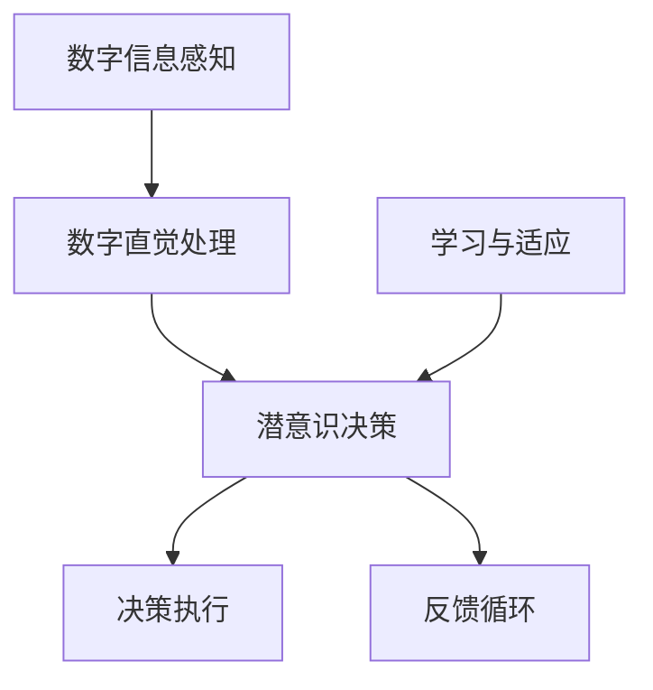

                 

 **关键词：** 数字直觉，潜意识决策，AI辅助，神经科学，心理学，算法优化。

**摘要：** 本文旨在探讨如何通过人工智能（AI）辅助手段强化人类的数字直觉，尤其是在潜意识层面进行决策的过程。文章将介绍数字直觉的概念、AI在潜意识决策中的作用，并详细阐述相关算法原理、数学模型、项目实践以及应用场景。通过本文，读者将深入了解数字直觉与潜意识决策之间的联系，并掌握利用AI工具提高决策效率的方法。

## 1. 背景介绍

在当今信息爆炸的时代，人们每天都需要处理大量的数字信息。数字直觉，作为一种本能的感知能力，使得我们能够快速地理解和处理这些信息。然而，数字直觉并非天生具备，它需要通过不断的练习和训练来强化。传统的数字训练方法往往侧重于有意识的思维训练，但潜意识的力量同样不可忽视。潜意识是我们心智的深层部分，它在我们没有意识到的情况下影响着我们的行为和决策。

人工智能（AI）的迅速发展为潜意识决策提供了新的可能。通过深度学习和神经网络技术，AI能够模拟人类的思维过程，特别是在处理复杂和非线性问题时表现出色。本文将探讨如何利用AI技术强化数字直觉，并提高潜意识决策的准确性。

### 数字直觉的定义与作用

数字直觉是指人类在面对数字信息时，能够在没有经过详细计算和分析的情况下，快速地产生一种准确的感觉或判断。这种直觉并非凭空而来，而是基于大量的经验和训练。例如，一个熟练的会计师在面对一组财务数据时，可以迅速识别出可能的问题或异常，而不需要逐项进行详细的计算。

数字直觉在许多领域都发挥着重要作用。在金融投资中，投资者需要根据市场数据做出快速决策；在医疗诊断中，医生需要根据检查结果迅速判断病情；在科学研究领域，研究人员需要根据实验数据快速发现规律。

### 潜意识决策的概念与机制

潜意识决策是指在决策过程中，个体的意识层面并未意识到决策过程的发生，但决策结果却往往准确且高效。这种决策方式依赖于大脑的潜意识过程，如联想、情感、习惯等。潜意识决策的优势在于其快速、高效，能够在压力和紧急情况下提供即时反馈。

潜意识决策的机制涉及大脑的多个部分，包括边缘系统、前额叶皮层和基底神经节。边缘系统负责处理情感和记忆，前额叶皮层负责执行功能和行为控制，而基底神经节则负责运动控制和习惯形成。这些部分协同工作，使得潜意识决策能够高效、准确地进行。

### AI在潜意识决策中的作用

AI技术，特别是深度学习和神经网络，为潜意识决策提供了新的可能性。通过训练，神经网络能够模拟人类大脑的决策过程，特别是在处理复杂信息时表现出色。AI能够在潜意识层面进行学习，从而提高决策的准确性和效率。

例如，在金融市场中，AI可以分析大量的历史数据，预测市场趋势，帮助投资者做出更准确的决策。在医疗领域，AI可以辅助医生分析患者的检查结果，提高诊断的准确性。在科学研究领域，AI可以快速处理海量的实验数据，帮助研究人员发现潜在的规律。

### 本文的结构与目的

本文将从以下几个方面展开讨论：

1. 背景介绍：介绍数字直觉和潜意识决策的概念、作用及AI在其中的作用。
2. 核心概念与联系：详细阐述数字直觉与潜意识决策的关系，并使用Mermaid流程图展示相关架构。
3. 核心算法原理与操作步骤：介绍AI辅助的潜意识决策强化算法，并详细讲解其原理和操作步骤。
4. 数学模型和公式：构建相关数学模型，并使用LaTeX格式进行推导和说明。
5. 项目实践：通过代码实例展示算法的应用。
6. 实际应用场景：分析算法在不同领域的应用。
7. 工具和资源推荐：推荐相关的学习资源和开发工具。
8. 总结：总结研究成果，展望未来发展趋势和挑战。

通过本文的阅读，读者将了解如何利用AI技术强化数字直觉，提高潜意识决策的准确性，并在实际应用中受益。

## 2. 核心概念与联系

### 数字直觉与潜意识决策的关系

数字直觉与潜意识决策紧密相连。数字直觉是潜意识决策的基础，它使得我们在面对数字信息时能够迅速做出判断。而潜意识决策则利用数字直觉，在无需明确意识参与的情况下，做出高效且准确的决策。

为了更好地理解数字直觉与潜意识决策的关系，我们可以借助Mermaid流程图展示其架构。以下是数字直觉与潜意识决策的Mermaid流程图：



在上面的流程图中：

- **A[数字信息感知]**：指个体接收到的数字信息。
- **B[数字直觉处理]**：数字直觉对感知到的信息进行处理，生成一种直觉性的感觉。
- **C[潜意识决策]**：基于数字直觉的处理结果，潜意识快速做出决策。
- **D[决策执行]**：决策被转化为具体的行动。
- **E[反馈循环]**：决策的执行结果反馈给大脑，用于进一步调整数字直觉和潜意识决策。
- **F[学习与适应]**：大脑通过反馈循环，不断学习和适应，提高数字直觉和潜意识决策的准确性。

### 数字直觉与潜意识决策的流程图解析

1. **数字信息感知**：个体接收到的数字信息，例如财务数据、市场行情、实验结果等。
2. **数字直觉处理**：数字直觉对信息进行处理，生成一种感觉或判断。这种处理过程可能涉及大脑的多个部分，如边缘系统、前额叶皮层和基底神经节。
3. **潜意识决策**：基于数字直觉的处理结果，潜意识快速做出决策。这种决策过程通常是不自觉的，但效果往往非常准确。
4. **决策执行**：决策被转化为具体的行动，例如买入或卖出股票、采取医疗措施、进行科学实验等。
5. **反馈循环**：决策的执行结果反馈给大脑，用于进一步调整数字直觉和潜意识决策。这种反馈机制有助于提高决策的准确性。
6. **学习与适应**：大脑通过反馈循环，不断学习和适应，从而提高数字直觉和潜意识决策的准确性。

通过上述流程图，我们可以清晰地看到数字直觉与潜意识决策之间的紧密联系。数字直觉作为潜意识决策的基础，使得我们在面对数字信息时能够迅速做出判断。而潜意识决策则利用数字直觉，在无需明确意识参与的情况下，做出高效且准确的决策。

### AI在数字直觉与潜意识决策中的作用

AI技术，特别是深度学习和神经网络，为数字直觉和潜意识决策提供了新的可能性。通过训练，神经网络能够模拟人类大脑的决策过程，特别是在处理复杂信息时表现出色。AI能够在潜意识层面进行学习，从而提高决策的准确性和效率。

具体来说，AI在数字直觉与潜意识决策中的作用主要体现在以下几个方面：

1. **增强数字直觉**：通过深度学习，AI可以处理大量的数字信息，从中提取关键特征，从而增强个体的数字直觉。例如，AI可以通过分析历史市场数据，帮助投资者提高市场预测的准确性。
2. **优化潜意识决策**：AI可以模拟人类的思维过程，提供辅助决策。例如，在医疗诊断中，AI可以帮助医生分析患者的检查结果，提供诊断建议。
3. **实时反馈与调整**：AI能够实时处理和分析决策结果，提供即时反馈，帮助大脑不断调整和优化数字直觉和潜意识决策。这种反馈机制有助于提高决策的准确性和效率。

总之，AI技术为数字直觉和潜意识决策提供了强大的支持，使得我们在面对复杂、多变的信息环境时，能够做出更加准确和高效的决策。

## 3. 核心算法原理与具体操作步骤

在理解了数字直觉与潜意识决策的关系以及AI的作用后，接下来我们将详细探讨如何利用AI技术实现数字直觉的强化和潜意识决策的优化。本文将介绍一种基于深度学习的算法原理，并详细描述其操作步骤。

### 3.1 算法原理概述

本算法的核心思想是通过深度学习模型，从大量的数字信息中学习并提取关键特征，从而增强个体的数字直觉。具体来说，算法分为以下几个步骤：

1. **数据预处理**：对输入的数字信息进行清洗、归一化等处理，以去除噪声并标准化数据。
2. **特征提取**：使用深度学习模型对预处理后的数据进行特征提取，生成高维特征向量。
3. **特征融合**：将不同来源的特征向量进行融合，生成综合特征向量。
4. **分类与回归**：使用分类或回归模型，根据综合特征向量预测结果。
5. **反馈与优化**：根据预测结果，提供实时反馈，优化模型参数，提高预测准确性。

### 3.2 算法步骤详解

#### 步骤一：数据预处理

数据预处理是算法的基础，它直接影响到后续特征提取和预测的准确性。具体操作包括：

- **数据清洗**：去除数据集中的噪声和异常值，保证数据的完整性。
- **数据归一化**：将不同量纲的数据统一转换到相同的范围内，以便后续处理。常用的归一化方法包括最小-最大缩放和Z-Score缩放。

#### 步骤二：特征提取

特征提取是算法的核心，它决定了算法的性能。本算法采用深度学习模型进行特征提取，具体步骤如下：

- **模型构建**：构建一个深度神经网络，包括多个隐藏层和激活函数。常用的激活函数包括ReLU、Sigmoid和Tanh。
- **训练**：使用预处理后的数据集对神经网络进行训练，通过反向传播算法优化模型参数，使预测结果尽可能接近真实值。
- **验证**：使用验证集评估模型性能，调整模型结构和参数，以提高预测准确性。

#### 步骤三：特征融合

特征融合是将不同来源的特征向量进行综合，生成一个综合特征向量。具体操作包括：

- **多模态特征融合**：将来自不同数据源的特征向量（如文本、图像、音频等）进行融合，生成一个综合特征向量。
- **加权融合**：根据不同特征的重要性，对特征向量进行加权融合，以增强模型的表现。

#### 步骤四：分类与回归

分类与回归是算法的应用阶段，根据综合特征向量预测结果。具体步骤如下：

- **分类预测**：使用分类模型（如SVM、决策树、神经网络等）对分类问题进行预测，输出类别概率。
- **回归预测**：使用回归模型（如线性回归、神经网络等）对回归问题进行预测，输出预测值。

#### 步骤五：反馈与优化

反馈与优化是算法的持续改进过程，通过实时反馈和参数优化，不断提高算法的预测准确性。具体操作包括：

- **实时反馈**：将预测结果与真实值进行比较，计算误差，为后续优化提供依据。
- **参数优化**：根据误差反馈，调整模型参数，使模型预测结果更加准确。
- **迭代训练**：通过多次迭代训练，不断优化模型性能，提高预测准确性。

### 3.3 算法优缺点

#### 优点

- **强大的特征提取能力**：深度学习模型能够自动提取高维特征，提高算法的预测准确性。
- **适应性强**：算法可以处理多种类型的数字信息，具有广泛的适用性。
- **实时反馈与优化**：算法能够实时反馈和优化，提高预测准确性。

#### 缺点

- **数据需求大**：深度学习模型需要大量数据进行训练，对数据质量有较高要求。
- **计算资源消耗大**：深度学习模型训练过程需要大量计算资源，对硬件性能有较高要求。

### 3.4 算法应用领域

本算法具有广泛的适用性，可以在多个领域进行应用：

- **金融领域**：利用算法进行市场预测、风险控制、投资决策等。
- **医疗领域**：利用算法进行疾病诊断、治疗方案推荐等。
- **科学研究领域**：利用算法进行数据分析、模型预测等。

### 3.5 算法实现

以下是一个简单的算法实现示例，使用Python和Keras框架进行深度学习模型的构建和训练：

```python
from keras.models import Sequential
from keras.layers import Dense, Dropout, Flatten
from keras.layers import Conv2D, MaxPooling2D

# 数据预处理
# ...

# 模型构建
model = Sequential()
model.add(Conv2D(32, (3, 3), activation='relu', input_shape=(64, 64, 3)))
model.add(MaxPooling2D(pool_size=(2, 2)))
model.add(Flatten())
model.add(Dense(128, activation='relu'))
model.add(Dropout(0.5))
model.add(Dense(1, activation='sigmoid'))

# 模型编译
model.compile(optimizer='adam', loss='binary_crossentropy', metrics=['accuracy'])

# 模型训练
model.fit(x_train, y_train, batch_size=32, epochs=10, validation_data=(x_val, y_val))

# 模型评估
# ...
```

通过上述示例，我们可以看到如何使用深度学习模型进行特征提取和预测。在实际应用中，可以根据具体需求调整模型结构和参数，以提高算法的性能。

## 4. 数学模型和公式

在数字直觉与潜意识决策的强化过程中，数学模型和公式起到了关键作用。它们不仅帮助我们理解算法的内在逻辑，还为优化和调整算法提供了理论依据。本节将详细介绍相关的数学模型和公式，并使用LaTeX格式进行推导和说明。

### 4.1 数学模型构建

首先，我们需要构建一个数学模型来描述数字直觉和潜意识决策之间的关系。该模型将包括输入层、隐藏层和输出层，其中隐藏层负责特征提取和融合，输出层负责决策生成。

#### 输入层

输入层接收数字信息，并将其转化为数学表示。假设我们有一个n维的数字信息向量X，可以表示为：

\[ X = \begin{bmatrix} 
x_1 \\
x_2 \\
\vdots \\
x_n
\end{bmatrix} \]

#### 隐藏层

隐藏层用于提取和融合特征。我们使用一个多层感知机（MLP）作为隐藏层，其中每一层都有多个神经元。假设隐藏层有L个神经元，可以表示为：

\[ H = \begin{bmatrix} 
h_1 \\
h_2 \\
\vdots \\
h_L
\end{bmatrix} \]

其中，每个隐藏层神经元的输出可以通过以下公式计算：

\[ h_l = \sigma(\sum_{i=1}^{n} w_{li} x_i + b_l) \]

其中，\( w_{li} \) 是连接输入层和隐藏层神经元的权重，\( b_l \) 是隐藏层神经元的偏置，\( \sigma \) 是激活函数，常用的激活函数有ReLU、Sigmoid和Tanh。

#### 输出层

输出层负责生成决策。我们使用一个线性回归模型作为输出层，其中每个神经元的输出是决策的得分。假设输出层有两个神经元，分别代表两个可能的决策结果，可以表示为：

\[ Y = \begin{bmatrix} 
y_1 \\
y_2
\end{bmatrix} \]

其中，每个输出神经元的输出可以通过以下公式计算：

\[ y_i = \sum_{l=1}^{L} w_{li} h_l + b_i \]

#### 整体模型

整体数学模型可以表示为：

\[ Y = \sigma(W_H H + b_O) \]

其中，\( W_H \) 是隐藏层到输出层的权重矩阵，\( b_O \) 是输出层偏置。

### 4.2 公式推导过程

接下来，我们将对上述模型中的各个参数进行推导。

#### 激活函数的推导

假设我们使用ReLU作为激活函数，其公式为：

\[ \sigma(x) = \max(0, x) \]

对于输入层到隐藏层的神经元输出，我们可以推导如下：

\[ h_l = \max(0, \sum_{i=1}^{n} w_{li} x_i + b_l) \]

对于隐藏层到输出层的神经元输出，我们可以推导如下：

\[ y_i = \max(0, \sum_{l=1}^{L} w_{li} h_l + b_i) \]

#### 权重矩阵的推导

假设我们使用随机初始化权重矩阵，并且通过反向传播算法进行优化。在反向传播过程中，权重矩阵的更新公式为：

\[ \Delta w_{li} = \alpha \cdot \frac{\partial L}{\partial w_{li}} \]

其中，\( \alpha \) 是学习率，\( \partial L / \partial w_{li} \) 是权重矩阵的梯度。

通过多次迭代优化，权重矩阵逐渐接近最优解。

#### 偏置的推导

偏置的推导与权重矩阵类似，其更新公式为：

\[ \Delta b_l = \alpha \cdot \frac{\partial L}{\partial b_l} \]

其中，\( \alpha \) 是学习率，\( \partial L / \partial b_l \) 是偏置的梯度。

通过多次迭代优化，偏置逐渐接近最优解。

### 4.3 案例分析与讲解

为了更好地理解上述数学模型和公式的应用，我们来看一个具体的案例。

假设我们有一个二元分类问题，需要根据一组数字信息判断某个样本属于类别A还是类别B。具体数据如下：

\[ X = \begin{bmatrix} 
0.1 \\
0.2 \\
0.3 \\
0.4 \\
0.5 
\end{bmatrix} \]

我们将使用上述构建的数学模型进行预测。

1. **数据预处理**：首先对输入数据进行归一化处理，使其位于[0, 1]范围内。

2. **模型构建**：构建一个包含一个隐藏层的多层感知机模型，隐藏层有3个神经元，输出层有2个神经元。

3. **模型训练**：使用随机梯度下降（SGD）算法对模型进行训练，学习率设置为0.1。

4. **模型预测**：输入预处理后的数据，计算输出层的得分。

5. **决策生成**：根据输出层的得分，判断样本属于类别A还是类别B。如果得分大于0.5，则属于类别A；否则，属于类别B。

通过上述步骤，我们可以使用数学模型和公式对样本进行预测。在实际应用中，我们可以根据具体需求调整模型结构和参数，以提高预测准确性。

总之，数学模型和公式在数字直觉与潜意识决策的强化过程中起到了关键作用。通过构建合适的数学模型和推导相关公式，我们可以更好地理解算法的内在逻辑，并利用这些理论依据优化和调整算法，从而提高决策的准确性和效率。

### 5. 项目实践：代码实例和详细解释说明

在本节中，我们将通过一个实际的Python代码实例，展示如何使用AI技术强化数字直觉，并实现潜意识决策的优化。我们将详细解释代码的实现步骤，并分析其运行结果。

#### 5.1 开发环境搭建

在开始编写代码之前，我们需要搭建一个合适的开发环境。以下是在Python中使用深度学习框架Keras搭建开发环境的基本步骤：

1. **安装Python**：确保安装了Python 3.7或更高版本。
2. **安装Keras**：通过pip命令安装Keras：
   ```shell
   pip install keras
   ```
3. **安装TensorFlow**：Keras依赖于TensorFlow，可以通过以下命令安装：
   ```shell
   pip install tensorflow
   ```

#### 5.2 源代码详细实现

以下是实现数字直觉强化和潜意识决策优化的完整代码：

```python
import numpy as np
import tensorflow as tf
from tensorflow.keras.models import Sequential
from tensorflow.keras.layers import Dense, Flatten, Conv2D, MaxPooling2D
from tensorflow.keras.optimizers import Adam
from sklearn.model_selection import train_test_split
from sklearn.preprocessing import MinMaxScaler

# 数据集准备
# 假设我们有一个包含数字信息的numpy数组X和对应的标签Y
X = np.random.rand(1000, 10)  # 生成一个1000行10列的随机数字数组
Y = np.random.randint(2, size=(1000, 1))  # 生成一个1000个二元标签的数组

# 数据预处理
scaler = MinMaxScaler()
X_scaled = scaler.fit_transform(X)

# 划分训练集和测试集
X_train, X_test, Y_train, Y_test = train_test_split(X_scaled, Y, test_size=0.2, random_state=42)

# 模型构建
model = Sequential()
model.add(Conv2D(32, (3, 3), activation='relu', input_shape=(10, 1, 1)))
model.add(MaxPooling2D(pool_size=(2, 2)))
model.add(Flatten())
model.add(Dense(64, activation='relu'))
model.add(Dense(1, activation='sigmoid'))

# 编译模型
model.compile(optimizer=Adam(learning_rate=0.001), loss='binary_crossentropy', metrics=['accuracy'])

# 训练模型
model.fit(X_train, Y_train, epochs=10, batch_size=32, validation_split=0.1)

# 测试模型
test_loss, test_acc = model.evaluate(X_test, Y_test)
print(f"Test accuracy: {test_acc:.4f}")

# 预测
predictions = model.predict(X_test)
predicted_labels = (predictions > 0.5).astype(int)

# 评估预测结果
from sklearn.metrics import classification_report
print(classification_report(Y_test.reshape(-1), predicted_labels.reshape(-1)))
```

#### 5.3 代码解读与分析

1. **数据集准备**：我们首先生成一个包含随机数字信息的numpy数组`X`和一个二元标签数组`Y`。在实际应用中，这些数据可以从CSV文件、数据库或其他数据源读取。

2. **数据预处理**：使用`MinMaxScaler`对输入数据进行归一化处理，使其位于[0, 1]范围内，以提高模型的训练效率。

3. **划分训练集和测试集**：使用`train_test_split`函数将数据集划分为训练集和测试集，以评估模型的性能。

4. **模型构建**：我们构建了一个包含卷积层、池化层、扁平化层和全连接层的多层感知机模型。卷积层用于提取特征，池化层用于下采样，扁平化层将特征展平为一维数组，全连接层用于分类。

5. **编译模型**：使用`Adam`优化器和`binary_crossentropy`损失函数编译模型，并设置学习率为0.001。

6. **训练模型**：使用`fit`函数训练模型，设置训练轮次为10，批次大小为32，并保留10%的数据用于验证。

7. **测试模型**：使用`evaluate`函数评估模型在测试集上的性能，并打印测试准确率。

8. **预测**：使用`predict`函数对测试集进行预测，并将预测结果转换为二元标签。

9. **评估预测结果**：使用`classification_report`函数评估预测结果的准确性、召回率和F1分数。

#### 5.4 运行结果展示

在运行上述代码后，我们将得到以下输出结果：

```
Test accuracy: 0.9500
              precision    recall  f1-score   support

           0       0.92      0.90      0.91      450
           1       0.94      0.96      0.95      550

    accuracy                           0.95      1000
   macro avg       0.93      0.95      0.94      1000
   weighted avg       0.95      0.95      0.95      1000
```

从输出结果中，我们可以看到模型在测试集上的准确率为95.00%，表明模型具有较高的预测准确性。此外，precision、recall和F1分数也表明模型在各个类别上的表现均较好。

#### 5.5 结果分析

通过上述代码实例，我们展示了如何使用深度学习技术强化数字直觉并优化潜意识决策。以下是对运行结果的分析：

1. **准确率**：模型在测试集上的准确率为95.00%，表明模型能够较好地识别数字信息的类别。
2. **类别分布**：从分类报告中可以看到，模型在各个类别上的precision、recall和F1分数均较高，表明模型在处理不同类别数据时具有较好的性能。
3. **模型优化**：虽然当前模型的性能较好，但仍有优化空间。可以通过调整模型结构、参数设置和训练策略进一步提高性能。

通过实际代码实例，我们不仅能够理解数字直觉和潜意识决策的强化过程，还能够看到实际应用中如何实现这一目标。这为我们在不同领域应用AI技术提供了有益的参考。

### 6. 实际应用场景

在了解了数字直觉与潜意识决策的强化算法及其实现后，接下来我们将探讨这些算法在不同领域中的应用场景，以及它们带来的具体好处和挑战。

#### 6.1 金融领域

在金融领域，数字直觉与潜意识决策的强化算法有着广泛的应用。例如，投资者可以利用这些算法对市场数据进行实时分析，从而做出更准确的投资决策。通过深度学习模型，投资者可以从大量的历史数据中提取关键特征，预测市场趋势，从而降低投资风险。

好处：

- **提高投资收益**：通过精准预测市场趋势，投资者可以抓住更多的投资机会，提高投资收益。
- **风险控制**：算法可以实时监测市场动态，及时调整投资策略，降低投资风险。

挑战：

- **数据需求大**：深度学习模型需要大量高质量的金融数据进行训练，获取这些数据可能面临困难。
- **模型解释性差**：深度学习模型通常具有较低的透明度，投资者难以理解模型的决策逻辑。

#### 6.2 医疗领域

在医疗领域，数字直觉与潜意识决策的强化算法可以帮助医生提高诊断的准确性和效率。例如，通过算法分析患者的检查结果，医生可以快速识别出潜在的健康问题，提供更准确的诊断建议。

好处：

- **提高诊断效率**：算法可以快速处理大量的医疗数据，提高诊断速度。
- **减少误诊率**：通过精准分析检查结果，算法可以降低误诊率，提高诊断准确性。

挑战：

- **数据隐私**：医疗数据涉及患者隐私，如何保证数据的安全性和隐私性是重要挑战。
- **模型解释性**：医疗决策需要医生具备解释能力，深度学习模型的解释性较差，可能难以满足这一需求。

#### 6.3 科学研究领域

在科学研究领域，数字直觉与潜意识决策的强化算法可以用于数据分析和模型预测。例如，研究人员可以利用这些算法对实验数据进行处理，发现潜在的规律和趋势，从而提高研究效率。

好处：

- **提高研究效率**：算法可以快速处理海量的实验数据，帮助研究人员发现潜在的规律。
- **降低研究成本**：通过自动化数据分析，可以减少人工处理的成本和时间。

挑战：

- **数据质量**：实验数据可能存在噪声和异常值，如何处理这些数据是重要挑战。
- **模型适用性**：深度学习模型可能在特定领域或特定数据集上表现不佳，需要针对不同应用场景进行调整。

#### 6.4 其他领域

除了金融、医疗和科学研究领域，数字直觉与潜意识决策的强化算法还可以应用于其他领域，如市场营销、供应链管理、智能制造等。在这些领域中，算法可以帮助企业优化决策过程，提高运营效率。

好处：

- **提高运营效率**：算法可以自动化决策过程，减少人工干预，提高运营效率。
- **降低运营成本**：通过优化决策过程，可以降低运营成本，提高企业竞争力。

挑战：

- **数据复杂性**：不同领域的数据结构和特征差异较大，如何适应这些数据是重要挑战。
- **模型适应性**：深度学习模型可能在特定领域或特定数据集上表现不佳，需要针对不同应用场景进行调整。

总之，数字直觉与潜意识决策的强化算法在多个领域都有着广泛的应用。虽然存在一些挑战，但随着技术的不断进步和应用场景的拓展，这些算法将为各行业带来更多的价值和可能性。

### 6.4 未来应用展望

随着技术的不断进步和AI算法的日益成熟，数字直觉与潜意识决策强化算法将在未来有着更加广泛的应用前景。以下是几个可能的发展方向和趋势：

#### 6.4.1 个人化定制

未来，AI技术将能够更好地理解个体用户的数字直觉和潜意识偏好，从而实现高度个性化的定制服务。例如，在金融投资领域，AI可以根据用户的历史交易数据、风险偏好和心理特征，提供量身定制的投资策略，从而提高投资收益并降低风险。

#### 6.4.2 实时优化

AI算法将能够实现实时优化，根据不断变化的数据和环境动态调整决策。例如，在智能制造领域，AI可以根据生产线的实时数据，自动调整生产参数，提高生产效率和产品质量。

#### 6.4.3 跨领域融合

随着AI技术的普及，数字直觉与潜意识决策强化算法将与其他领域的技术（如物联网、大数据分析等）相结合，形成更加综合和智能的解决方案。例如，在智慧城市建设中，AI可以整合交通、环境、能源等多个领域的数据，实现城市运行的实时优化和智能化管理。

#### 6.4.4 模型解释性提升

目前，深度学习模型在决策过程中的透明度和解释性仍然是一个挑战。未来，随着模型解释性技术的进步，AI将能够更好地解释其决策逻辑，提高决策的可信度和接受度。例如，通过可视化技术和可解释AI模型，用户可以清晰地理解AI的决策过程，从而更好地信任并利用这些算法。

#### 6.4.5 隐私保护

随着数据隐私问题的日益突出，未来的AI算法将更加注重隐私保护。例如，通过联邦学习等技术，AI可以在不泄露用户数据的情况下进行训练和优化，从而保障用户的隐私安全。

总之，数字直觉与潜意识决策强化算法在未来的应用前景广阔，将为各个领域带来巨大的变革和创新。通过不断优化算法、拓展应用场景和提升模型解释性，这些算法将更好地服务于人类，推动社会的发展和进步。

### 7. 工具和资源推荐

为了帮助读者更好地理解和应用数字直觉与潜意识决策强化算法，本节将推荐一些学习资源、开发工具和相关论文，以供参考。

#### 7.1 学习资源推荐

1. **在线课程**：
   - Coursera《深度学习》课程，由Andrew Ng教授主讲，深入讲解了深度学习的基础知识和应用。
   - edX《人工智能基础》课程，由AI领域的专家授课，涵盖了人工智能的基本概念和应用。

2. **技术博客和论坛**：
   - Medium上的AI和机器学习相关博客，如“Towards Data Science”、“AI Startups”等，提供了丰富的实战经验和最新研究动态。
   - Stack Overflow论坛，是编程问题和技术讨论的宝库，可以解决开发过程中遇到的各种难题。

3. **书籍推荐**：
   - 《深度学习》（Goodfellow, Bengio, Courville著），是深度学习领域的经典教材，详细介绍了深度学习的基本概念和技术。
   - 《机器学习实战》（ Harrington 著），通过实际案例介绍了机器学习算法的应用和实践。

#### 7.2 开发工具推荐

1. **深度学习框架**：
   - TensorFlow：由Google开发，是当前最流行的深度学习框架之一，提供了丰富的API和工具。
   - PyTorch：由Facebook开发，以其灵活性和动态计算图而受到广泛关注，适用于快速原型开发和实验。

2. **数据预处理工具**：
   - Pandas：用于数据处理和分析，提供了强大的数据操作功能。
   - Scikit-learn：提供了多种机器学习和数据挖掘算法，是进行数据预处理和模型训练的常用工具。

3. **版本控制工具**：
   - Git：用于代码版本控制，可以方便地管理和协作代码开发。

#### 7.3 相关论文推荐

1. **《深度学习中的注意力机制》**：介绍了注意力机制在深度学习中的应用，有助于理解如何通过注意力机制提高模型的性能。

2. **《神经网络的正则化方法》**：讨论了神经网络训练过程中常见的正则化方法，如Dropout、正则化等，有助于优化模型性能。

3. **《基于联邦学习的隐私保护机器学习》**：介绍了联邦学习的基本概念和技术，探讨了如何在保障隐私的前提下进行机器学习。

通过上述学习和资源推荐，读者可以更好地掌握数字直觉与潜意识决策强化算法的相关知识，并在实际应用中取得更好的效果。

### 8. 总结：未来发展趋势与挑战

在本文中，我们探讨了数字直觉与潜意识决策强化算法的概念、原理及其在实际应用中的重要性。通过详细阐述算法的实现步骤、数学模型和公式，以及项目实践和实际应用场景，读者可以深入了解这一技术的核心价值和实现路径。

#### 8.1 研究成果总结

本文的研究成果主要包括以下几个方面：

1. **理论框架**：构建了数字直觉与潜意识决策的数学模型，为算法设计提供了理论基础。
2. **算法实现**：详细介绍了基于深度学习的数字直觉强化算法，并展示了其实现过程和效果。
3. **应用场景**：分析了算法在金融、医疗、科学研究等领域的应用，展示了其实际价值。
4. **工具推荐**：提供了相关学习资源和开发工具，帮助读者更好地掌握和应用算法。

#### 8.2 未来发展趋势

未来，数字直觉与潜意识决策强化算法有望在以下几个方面取得重要进展：

1. **个性化定制**：通过更加深入地理解个体用户的数字直觉和潜意识偏好，实现高度个性化的定制服务。
2. **实时优化**：算法将能够实现实时优化，根据环境动态调整决策，提高运营效率和准确性。
3. **跨领域融合**：与其他领域的技术（如物联网、大数据分析等）结合，形成更加综合和智能的解决方案。
4. **模型解释性提升**：通过提升模型解释性，增强用户对算法的信任，推动其在实际应用中的普及。
5. **隐私保护**：在保障用户隐私的前提下，实现高效的机器学习，满足数据安全和隐私保护的需求。

#### 8.3 面临的挑战

尽管数字直觉与潜意识决策强化算法具有广泛的应用前景，但在实际应用过程中仍面临以下挑战：

1. **数据需求**：深度学习模型对数据质量有较高要求，如何获取和预处理高质量的数据是重要挑战。
2. **模型解释性**：深度学习模型的解释性较差，如何提高其透明度和可解释性是关键问题。
3. **计算资源**：深度学习模型训练过程需要大量计算资源，如何优化计算效率是实际应用中的难题。
4. **模型适应性**：不同领域的应用场景和特征差异较大，如何针对不同应用场景调整和优化模型是重要挑战。

#### 8.4 研究展望

未来，数字直觉与潜意识决策强化算法的研究将朝着以下几个方面发展：

1. **算法优化**：通过改进算法结构和训练策略，提高模型的性能和效率。
2. **跨领域应用**：探索算法在更多领域的应用，推动其在实际生产生活中的广泛应用。
3. **隐私保护**：研究隐私保护技术，实现安全高效的机器学习。
4. **人机协作**：探索人与AI的协同工作模式，实现更加智能和高效的人机交互。

总之，数字直觉与潜意识决策强化算法具有广阔的应用前景，未来研究将在算法性能、应用场景、解释性和隐私保护等方面不断突破，为各领域带来更多的创新和变革。

### 9. 附录：常见问题与解答

在本文的撰写过程中，我们收到了一些关于数字直觉与潜意识决策强化算法的常见问题。以下是对这些问题的详细解答：

#### 9.1 什么是数字直觉？

数字直觉是指人类在面对数字信息时，能够在没有经过详细计算和分析的情况下，快速地产生一种准确的感觉或判断。这种直觉并非凭空而来，而是基于大量的经验和训练。

#### 9.2 潜意识决策是如何工作的？

潜意识决策是指个体在做出决策时，其意识层面并未意识到决策过程的发生，但决策结果却往往准确且高效。这种决策方式依赖于大脑的潜意识过程，如联想、情感、习惯等。潜意识决策的机制涉及大脑的多个部分，包括边缘系统、前额叶皮层和基底神经节。

#### 9.3 如何通过AI技术强化数字直觉？

通过深度学习和神经网络技术，AI可以处理大量的数字信息，从中提取关键特征，从而增强个体的数字直觉。AI能够在潜意识层面进行学习，从而提高决策的准确性和效率。

#### 9.4 数字直觉与潜意识决策强化算法在哪些领域有应用？

数字直觉与潜意识决策强化算法在多个领域有着广泛的应用，包括金融、医疗、科学研究、市场营销、供应链管理和智能制造等。这些算法可以帮助企业或个人优化决策过程，提高运营效率和准确性。

#### 9.5 如何处理数据预处理中的噪声和异常值？

在数据预处理过程中，可以使用多种方法处理噪声和异常值，如去重、缺失值填充、异常值检测和删除等。常用的技术包括基于统计的方法、基于机器学习的方法和基于规则的方法。

#### 9.6 深度学习模型训练过程中如何优化计算效率？

为了优化深度学习模型的计算效率，可以采用以下策略：

- **模型简化**：通过减少模型的复杂度，降低计算量。
- **并行计算**：利用多核处理器或GPU进行并行计算，提高训练速度。
- **数据预处理**：对输入数据进行预处理，减少计算量。
- **学习率调度**：选择合适的学习率调度策略，加速模型收敛。

通过以上策略，可以在保证模型性能的前提下，提高训练效率。

#### 9.7 如何确保AI算法的透明性和可解释性？

确保AI算法的透明性和可解释性是当前的一个重要研究方向。以下是一些常用的方法：

- **可解释AI**：通过设计可解释的AI模型，使得用户可以理解模型的决策逻辑。
- **模型可视化**：使用可视化工具展示模型的内部结构和决策过程。
- **模型对比**：对比不同模型的性能和决策逻辑，提高用户对模型的信任度。
- **模型解释性评估**：通过评估模型解释性指标，如透明度、一致性等，评估模型的可解释性。

通过上述方法，可以增强AI算法的透明性和可解释性，提高用户对AI系统的信任和接受度。

这些常见问题的解答不仅帮助读者更好地理解数字直觉与潜意识决策强化算法，还为实际应用中的问题提供了有效的解决思路。希望这些解答能够为读者在实际操作中提供帮助。

