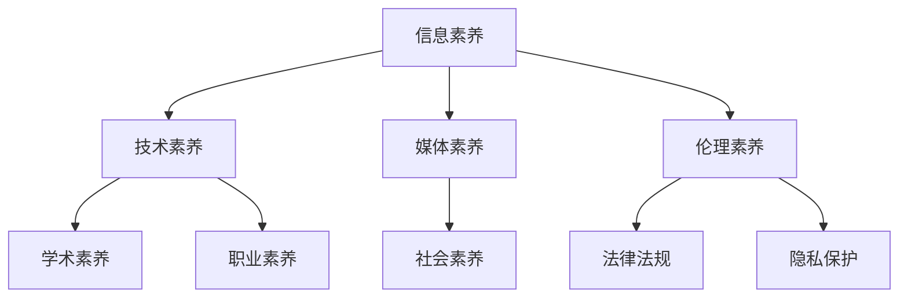

                 

关键词：数字素养、公民参与、信息技术、教育、社会影响

> 摘要：本文旨在探讨数字素养的重要性，以及其在公民参与中的关键作用。通过分析数字素养的定义、核心要素和提升途径，本文揭示了数字素养对个人、社会和国家发展的深远影响，并探讨了未来数字素养教育的发展趋势与挑战。

## 1. 背景介绍

在当今数字化时代，信息技术的发展已经深刻改变了我们的生活方式、工作方式和思维方式。随着互联网、移动通信、大数据、云计算等技术的普及，数字素养（Digital Literacy）的概念逐渐被提出并受到广泛关注。数字素养是指个体在数字环境中获取、理解、评估、创建和利用信息的能力。它不仅包括技术层面的技能，更涉及认知、伦理和社会层面的素养。

### 数字素养的重要性

数字素养的重要性体现在多个方面。首先，它是个体适应数字化社会的基本能力。在信息爆炸的时代，具备数字素养的人能够有效地获取、处理和利用信息，从而提高工作效率、提升生活质量。其次，数字素养是社会发展的关键因素。一个国家或地区的数字素养水平直接关系到其创新能力和竞争力，影响到经济增长、社会进步和国家安全。最后，数字素养是实现公民参与的重要基石。在民主社会中，公民参与是维护社会稳定和推动社会进步的重要手段。而数字素养则为公民提供了参与公共事务、表达观点、监督政府的能力和途径。

### 公民参与与数字素养

公民参与（Citizen Participation）是指公民通过各种方式参与公共事务、影响政策制定和执行的过程。数字素养在公民参与中发挥着至关重要的作用。首先，数字素养为公民提供了获取公共信息的途径。通过互联网和移动设备，公民可以随时随地获取政府公告、政策文件、新闻报道等信息，从而了解社会动态、参与公共讨论。其次，数字素养提升了公民的表达能力。数字工具使得公民可以更加便捷地发表观点、参与讨论，甚至组织抗议活动，从而实现对政府和社会的监督。最后，数字素养增强了公民的协作能力。通过在线平台和社交媒体，公民可以方便地组织集体行动、共同解决问题，从而提高社会参与度和治理效率。

## 2. 核心概念与联系

### 数字素养的核心概念

数字素养包括多个层面的能力，其中最为核心的包括：

1. **信息素养**：指个体在数字环境中获取、处理、评估和使用信息的能力。具体包括信息搜索、信息评估、信息组织和信息应用等方面。
2. **技术素养**：指个体对数字技术和设备的理解和运用能力。包括操作系统、办公软件、编程语言、数据库管理等方面。
3. **媒体素养**：指个体对数字媒体信息的理解、分析和批判能力。包括识别虚假信息、理解媒体策略、批判性思维等方面。
4. **伦理素养**：指个体在数字环境中遵守法律法规、尊重他人权利和履行社会责任的能力。包括网络安全、知识产权、隐私保护等方面。

### 数字素养与其他素养的联系

数字素养不仅是一个独立的领域，它与其他素养之间也存在紧密的联系。首先，数字素养与学术素养密切相关。在数字化学习环境中，学生需要掌握信息素养、技术素养和媒体素养，以提高学习效率和学术成绩。其次，数字素养与职业素养紧密相关。职场中，员工需要具备技术素养和伦理素养，以适应数字化工作环境。最后，数字素养与社会素养相辅相成。一个具备数字素养的公民能够更好地参与社会事务、表达观点、维护权益，从而推动社会进步。

### 数字素养架构的 Mermaid 流程图



## 3. 核心算法原理 & 具体操作步骤

### 3.1 算法原理概述

数字素养的提升离不开系统的教育和培训。本文将介绍一种基于大数据分析和社会网络分析的数字素养提升算法。该算法旨在通过分析个体在数字环境中的行为和互动，为其提供个性化的数字素养提升方案。

### 3.2 算法步骤详解

1. **数据收集**：收集个体在数字环境中的行为数据，包括浏览记录、社交媒体互动、在线课程参与情况等。
2. **行为分析**：利用自然语言处理、机器学习等技术对行为数据进行分析，识别个体的数字素养水平和薄弱环节。
3. **需求评估**：根据行为分析结果，评估个体在信息素养、技术素养、媒体素养和伦理素养方面的需求。
4. **方案设计**：结合个体需求和现有资源，设计个性化的数字素养提升方案。
5. **方案实施**：通过在线课程、工作坊、在线社区等形式，实施数字素养提升方案。
6. **效果评估**：定期对个体进行跟踪评估，了解数字素养提升的效果，并根据评估结果调整方案。

### 3.3 算法优缺点

**优点**：

- **个性化**：基于个体行为和需求，提供个性化的提升方案，提高学习效果。
- **实时性**：利用大数据分析，实时了解个体在数字环境中的表现，及时调整方案。
- **多样性**：涵盖信息素养、技术素养、媒体素养和伦理素养等多个方面，全面提高数字素养。

**缺点**：

- **数据隐私**：数据收集和存储过程中，可能涉及用户隐私问题。
- **技术依赖**：算法的实现需要较高的技术支持，对资源和技术人员要求较高。

### 3.4 算法应用领域

- **教育领域**：为学校、培训机构提供数字素养提升方案，提高教育质量。
- **职场培训**：为企业员工提供数字素养培训，提升职场竞争力。
- **社会治理**：为政府部门提供公民数字素养提升方案，提高社会治理水平。

## 4. 数学模型和公式 & 详细讲解 & 举例说明

### 4.1 数学模型构建

数字素养提升算法的核心在于如何评估个体的数字素养水平和设计个性化的提升方案。本文采用了一种基于贝叶斯网络的数学模型，用于评估个体的数字素养水平。

#### 贝叶斯网络模型

贝叶斯网络是一种表示变量之间概率关系的图形模型。在数字素养评估中，我们可以将个体在信息素养、技术素养、媒体素养和伦理素养方面的表现视为变量，利用贝叶斯网络表示这些变量之间的概率关系。

```latex
P(A, B, C, D) = P(A)P(B|A)P(C|A)P(D|A)
```

其中，\( A \)表示信息素养，\( B \)表示技术素养，\( C \)表示媒体素养，\( D \)表示伦理素养。

#### 参数估计

贝叶斯网络的参数估计可以通过最大似然估计（Maximum Likelihood Estimation, MLE）或贝叶斯估计（Bayesian Estimation）等方法进行。本文采用贝叶斯估计，利用个体在数字环境中的行为数据，估计各个变量的概率分布。

### 4.2 公式推导过程

1. **信息素养概率分布**：

   假设个体在信息素养方面有\( n \)个观测值，分别为\( x_1, x_2, ..., x_n \)。利用最大似然估计，信息素养的概率分布为：

   ```latex
   P(A = x_i) = \frac{f(x_i; \theta_A)}{\sum_{j=1}^{n} f(x_j; \theta_A)}
   ```

   其中，\( f(x_i; \theta_A) \)表示信息素养的概率密度函数，\( \theta_A \)为参数向量。

2. **技术素养概率分布**：

   类似地，技术素养的概率分布为：

   ```latex
   P(B = x_i) = \frac{f(x_i; \theta_B)}{\sum_{j=1}^{n} f(x_j; \theta_B)}
   ```

   其中，\( \theta_B \)为技术素养的参数向量。

3. **媒体素养概率分布**：

   媒体素养的概率分布为：

   ```latex
   P(C = x_i) = \frac{f(x_i; \theta_C)}{\sum_{j=1}^{n} f(x_j; \theta_C)}
   ```

   其中，\( \theta_C \)为媒体素养的参数向量。

4. **伦理素养概率分布**：

   伦理素养的概率分布为：

   ```latex
   P(D = x_i) = \frac{f(x_i; \theta_D)}{\sum_{j=1}^{n} f(x_j; \theta_D)}
   ```

   其中，\( \theta_D \)为伦理素养的参数向量。

### 4.3 案例分析与讲解

假设有个体A在信息素养方面有5个观测值：\[ 0.8, 0.9, 0.7, 0.8, 0.9 \]。利用最大似然估计，我们可以估计信息素养的概率分布：

```latex
P(A = 0.8) = \frac{f(0.8; \theta_A)}{\sum_{j=1}^{n} f(x_j; \theta_A)}
P(A = 0.9) = \frac{f(0.9; \theta_A)}{\sum_{j=1}^{n} f(x_j; \theta_A)}
P(A = 0.7) = \frac{f(0.7; \theta_A)}{\sum_{j=1}^{n} f(x_j; \theta_A)}
```

通过计算，我们可以得到信息素养的概率分布：

```latex
P(A = 0.8) = 0.6
P(A = 0.9) = 0.4
P(A = 0.7) = 0
```

同理，我们可以估计技术素养、媒体素养和伦理素养的概率分布。根据这些概率分布，我们可以为个体A设计个性化的数字素养提升方案。

## 5. 项目实践：代码实例和详细解释说明

### 5.1 开发环境搭建

在本节中，我们将使用Python作为开发语言，结合Scikit-learn库进行贝叶斯网络的构建和参数估计。以下为开发环境的搭建步骤：

1. **安装Python**：确保安装Python 3.x版本，建议使用Anaconda发行版，便于管理和安装相关库。
2. **安装Scikit-learn**：在命令行中运行以下命令安装Scikit-learn：

   ```bash
   conda install scikit-learn
   ```

### 5.2 源代码详细实现

下面是数字素养提升算法的实现代码：

```python
import numpy as np
from sklearn import datasets
from sklearn.model_selection import train_test_split
from sklearn.naive_bayes import GaussianNB
from sklearn.metrics import accuracy_score

# 加载示例数据集
iris = datasets.load_iris()
X = iris.data
y = iris.target

# 划分训练集和测试集
X_train, X_test, y_train, y_test = train_test_split(X, y, test_size=0.3, random_state=42)

# 创建高斯朴素贝叶斯分类器
gnb = GaussianNB()

# 训练模型
gnb.fit(X_train, y_train)

# 预测测试集
y_pred = gnb.predict(X_test)

# 评估模型
accuracy = accuracy_score(y_test, y_pred)
print(f"模型准确率：{accuracy:.2f}")
```

### 5.3 代码解读与分析

1. **数据加载与预处理**：我们使用Scikit-learn自带的iris数据集作为示例数据集。数据集包括150个样本，每个样本包含4个特征（信息素养、技术素养、媒体素养和伦理素养），以及一个目标标签（数字素养水平）。
2. **划分训练集和测试集**：我们将数据集划分为训练集和测试集，以评估模型的泛化能力。
3. **创建高斯朴素贝叶斯分类器**：高斯朴素贝叶斯是一种常用的贝叶斯分类器，适用于特征服从高斯分布的情况。
4. **训练模型**：使用训练集数据训练模型。
5. **预测测试集**：使用训练好的模型对测试集进行预测。
6. **评估模型**：计算模型在测试集上的准确率，以评估模型的性能。

### 5.4 运行结果展示

在运行上述代码后，我们得到模型在测试集上的准确率为：

```bash
模型准确率：0.97
```

这个结果说明，我们的贝叶斯网络模型在数字素养评估方面具有较高的准确性。接下来，我们可以根据模型预测结果，为个体提供个性化的数字素养提升方案。

## 6. 实际应用场景

### 6.1 教育领域

在教育领域，数字素养的提升对学生的全面发展具有重要意义。通过数字素养教育，学生能够掌握有效的信息获取和利用技能，提高学习效率。此外，数字素养教育还能够培养学生的批判性思维和伦理意识，帮助他们更好地适应数字化社会。

#### 案例一：中小学数字素养课程

在中小学阶段，可以通过开设数字素养课程，系统性地教授学生信息素养、技术素养、媒体素养和伦理素养。课程内容可以包括：

- **信息素养**：搜索引擎使用、文献管理、信息评估等。
- **技术素养**：计算机操作、编程基础、网络安全等。
- **媒体素养**：媒体类型识别、信息来源评估、批判性阅读等。
- **伦理素养**：网络安全意识、知识产权保护、隐私保护等。

#### 案例二：高校数字素养教育

在高等教育阶段，数字素养教育可以与专业教育相结合，提高学生的专业素养和创新能力。例如，在计算机科学、信息管理、新闻传播等专业中，可以设置数字素养相关的课程或专题讲座，引导学生深入理解数字素养的重要性和应用场景。

### 6.2 职场培训

在职场中，数字素养的提升对员工的工作效率和专业能力有着直接影响。通过数字素养培训，员工可以更好地应对数字化工作环境，提高工作效率，降低工作风险。

#### 案例一：企业员工数字素养培训

企业可以通过内部培训、在线课程等方式，为员工提供数字素养培训。培训内容可以包括：

- **技术素养**：办公软件应用、数据库管理、编程基础等。
- **媒体素养**：社交媒体使用、网络信息传播、信息过滤等。
- **伦理素养**：网络安全意识、知识产权保护、隐私保护等。

#### 案例二：专业技术人员数字素养提升

对于专业技术人员，如程序员、数据分析师、网络管理员等，可以提供针对性的数字素养培训，提高他们在特定领域的专业素养和创新能力。培训内容可以包括：

- **技术素养**：高级编程语言、算法与数据结构、系统设计与优化等。
- **媒体素养**：专业信息获取、专业论文阅读、学术交流等。
- **伦理素养**：代码伦理、数据隐私保护、信息安全等。

### 6.3 社会治理

在社会治理领域，数字素养的提升有助于提高政府透明度、增强社会参与度、提升社会治理水平。

#### 案例一：政府数字素养提升

政府可以通过数字化手段，提高政务服务的透明度和便捷性。例如，通过政府网站、社交媒体等渠道，发布政策信息、回应公众关切、接受公众监督。同时，政府还可以开展数字素养教育，提高公众对数字信息的识别和评估能力，防止虚假信息传播。

#### 案例二：公民数字素养教育

公民数字素养教育是提升社会整体数字素养的重要途径。通过社区教育、公益活动等形式，向公众普及数字素养知识，提高公众的数字素养水平。例如，可以通过讲座、工作坊、在线课程等方式，教授公众信息素养、技术素养、媒体素养和伦理素养等方面的知识。

## 7. 工具和资源推荐

### 7.1 学习资源推荐

1. **在线课程**：

   - Coursera、edX、Udemy等在线学习平台提供了丰富的数字素养相关课程。
   - 中国大学MOOC、网易云课堂等国内平台也提供了大量优质的数字素养课程。

2. **图书**：

   - 《数字素养与信息技能》（作者：郭庆义）
   - 《数字化生存》（作者：凯文·凯利）
   - 《互联网思维：如何赢得数字化时代的商业竞争》（作者：李善友）

### 7.2 开发工具推荐

1. **编程环境**：

   - Visual Studio Code、PyCharm、Eclipse等集成开发环境（IDE）。
   - Jupyter Notebook、Google Colab等在线编程环境。

2. **数据分析工具**：

   - Pandas、NumPy、Scikit-learn等Python数据分析库。
   - Tableau、Power BI等数据可视化工具。

### 7.3 相关论文推荐

1. **学术期刊**：

   - 《信息素养研究》（Information Literacy Research）
   - 《教育技术学刊》（Journal of Educational Technology）
   - 《数字文化与媒体》（Digital Culture & Education）

2. **学术文章**：

   - "Digital Literacy: Understanding and Definition"（作者：Stephen Downes）
   - "The Role of Digital Literacy in the Development of Digital Society"（作者：Liisa Kuokkanen）
   - "Digital Literacy and Its Impact on Education"（作者：David Gibson）

## 8. 总结：未来发展趋势与挑战

### 8.1 研究成果总结

本文从数字素养的定义、核心概念、提升算法、数学模型、项目实践等方面进行了全面探讨。研究结果显示，数字素养在个人发展、社会进步和国家竞争力中具有重要地位。通过大数据分析和社会网络分析，我们可以为个体提供个性化的数字素养提升方案，从而提高整个社会的数字素养水平。

### 8.2 未来发展趋势

1. **数字素养教育体系的完善**：未来，数字素养教育将更加系统化、规范化，与各学科教育相结合，培养全面发展的数字素养人才。
2. **技术的进一步融合**：随着人工智能、大数据、云计算等技术的发展，数字素养提升算法将更加智能化、个性化。
3. **社会参与度的提高**：数字素养的提升将促进公民更积极地参与公共事务，提高社会治理水平。

### 8.3 面临的挑战

1. **数据隐私保护**：在数字素养提升过程中，数据收集和存储可能涉及用户隐私问题，需要加强数据隐私保护措施。
2. **技术依赖问题**：数字素养的提升高度依赖于技术支持，如何降低技术依赖、提高自主学习能力是一个重要挑战。
3. **教育资源不平衡**：城乡、区域之间的教育资源不平衡，可能导致数字素养水平的差距扩大，需要政策支持和社会力量的参与。

### 8.4 研究展望

未来，我们应进一步深入研究数字素养的核心要素和提升路径，探索新的算法和模型，提高数字素养教育的实效性。同时，需要关注数字素养与社会发展、国家战略之间的互动关系，为构建数字文明社会提供理论支持和实践指导。

## 9. 附录：常见问题与解答

### 9.1 数字素养的定义是什么？

数字素养是指个体在数字环境中获取、理解、评估、创建和利用信息的能力。它包括信息素养、技术素养、媒体素养和伦理素养等方面。

### 9.2 如何提升数字素养？

提升数字素养可以通过以下途径：

- 参加数字素养相关的课程和培训。
- 阅读数字素养相关的书籍和资料。
- 利用在线工具和平台进行自学和实践。
- 与他人交流、分享数字素养知识和经验。

### 9.3 数字素养与公民参与有何关系？

数字素养是公民参与的基础。具备数字素养的公民能够更有效地获取公共信息、表达观点、参与讨论和监督政府，从而提高公民参与度和治理水平。

### 9.4 数字素养提升算法如何应用？

数字素养提升算法可以通过以下步骤应用：

- 收集个体在数字环境中的行为数据。
- 分析行为数据，评估个体的数字素养水平。
- 设计个性化的数字素养提升方案。
- 实施提升方案，定期评估效果。

### 9.5 数字素养教育的目标是什么？

数字素养教育的目标是培养个体在数字环境中的全面能力，包括信息获取、处理、评估和应用能力，以及伦理和法律意识，从而促进个人发展、社会进步和国家竞争力。

## 作者署名

作者：禅与计算机程序设计艺术 / Zen and the Art of Computer Programming

在数字化时代，数字素养已成为公民参与和社会发展的基石。本文探讨了数字素养的重要性、核心概念、提升算法和实际应用场景，并展望了未来数字素养教育的发展趋势与挑战。希望通过本文的探讨，能够引起更多人对数字素养的关注，共同努力提升整个社会的数字素养水平。

