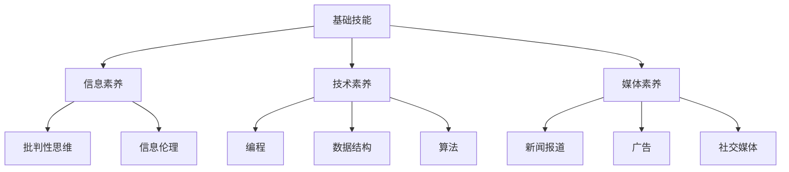

                 

关键词：数字素养、公民参与、技术教育、算法原理、实践应用、未来展望

> 摘要：随着信息技术的飞速发展，数字素养已成为现代社会公民参与的基础。本文深入探讨了数字素养的定义、核心概念、算法原理及其在实践中的应用，旨在为公民提供参与数字时代的必备知识和技能。同时，文章还展望了数字素养的未来发展趋势与面临的挑战。

## 1. 背景介绍

在过去的几十年里，信息技术（IT）迅猛发展，彻底改变了人类社会的生活和工作方式。从互联网的普及到智能手机的广泛使用，再到大数据和人工智能技术的突破，信息技术已经深入到我们日常生活的方方面面。然而，随着这些技术不断进步，数字素养的重要性也日益凸显。

数字素养，通常被定义为个体在数字环境下获取、理解、评估、创造和应用信息的能力。它不仅仅包括基础的计算机操作技能，还涉及到信息搜索、数据处理、网络安全、批判性思维等多个方面。在全球化和数字化时代，数字素养已经成为公民参与社会、经济和政治活动的基础。

公民参与，是指公民在民主社会中通过各种方式参与公共事务、表达意见、行使权利和履行义务的行为。传统的公民参与主要通过投票、参加社区活动、参与政治讨论等形式实现。然而，在数字时代，公民参与的形式和途径变得更加多样化。互联网和社交媒体为公民提供了更多的渠道和平台，使他们能够更加便捷地参与社会事务，表达自己的观点和需求。

本文旨在探讨数字素养在公民参与中的重要作用，分析数字素养的核心概念和算法原理，并通过实践案例和未来展望，为公民提供参与数字时代的指导。

## 2. 核心概念与联系

### 2.1 数字素养的概念

数字素养是一个多维度的概念，它涵盖了从基础技能到高级能力的多个层面。以下是数字素养的核心组成部分：

- **基础技能**：包括计算机操作、互联网使用、电子邮件处理、社交媒体互动等。
- **信息素养**：涉及信息搜索、评估、处理和利用能力，包括了解信息来源、批判性思维和信息伦理。
- **技术素养**：包括编程、数据结构、算法等，涉及计算机科学的基础知识。
- **媒体素养**：涉及对媒体信息的理解、评估和应用，包括新闻报道、广告、社交媒体等。
- **网络安全素养**：包括对网络威胁的识别、防范和应对能力，如密码安全、恶意软件防护等。

### 2.2 数字素养与公民参与的联系

数字素养与公民参与之间存在着紧密的联系。数字素养能力的高低直接影响到公民是否能够有效地参与社会事务。以下是一些具体的联系：

- **信息获取**：数字素养使公民能够快速获取有价值的信息，这是参与公共事务的基础。
- **批判性思维**：数字素养培养公民的批判性思维能力，使他们能够对信息来源和信息内容进行评估和批判。
- **技术技能**：数字素养提供公民在数字环境中进行创造性活动和技术创新的能力，如开发应用程序、创建多媒体内容等。
- **社交媒体互动**：数字素养使公民能够有效利用社交媒体平台，参与公共讨论、表达观点和传播信息。
- **网络安全**：数字素养帮助公民识别和防范网络威胁，保护个人隐私和数据安全。

### 2.3 数字素养的架构

为了更好地理解数字素养，我们可以将其视为一个多层次的结构，包括基础技能层、信息素养层、技术素养层和媒体素养层。以下是一个简化的 Mermaid 流程图，展示了数字素养的不同层次及其相互关系：



在这个架构中，每个层次都依赖于基础技能的支持，同时也对其他层次产生重要影响。例如，技术素养依赖于编程、数据结构和算法等基础知识，而这些知识又为信息处理和媒体内容创建提供了支持。

## 3. 核心算法原理 & 具体操作步骤

### 3.1 算法原理概述

数字素养的核心算法原理主要集中在信息处理和数据结构方面。以下是一些基础但重要的算法原理：

- **排序算法**：用于对数据进行排序，如快速排序、归并排序等。
- **搜索算法**：用于在数据集合中查找特定元素，如二分搜索、深度优先搜索等。
- **图算法**：用于处理图形数据结构，如最短路径算法、拓扑排序等。
- **加密算法**：用于保护数据的安全性，如RSA加密、AES加密等。

这些算法不仅是计算机科学的核心内容，也是数字素养的重要组成部分。通过掌握这些算法，公民能够更好地理解数字环境中的信息处理机制，提高自身的数字素养水平。

### 3.2 算法步骤详解

以下是几个核心算法的基本步骤：

#### 快速排序（Quick Sort）

1. 选择一个基准元素。
2. 将比基准元素小的元素移到其左侧，比其大的元素移到右侧。
3. 递归地对左右子数组进行快速排序。

```python
def quick_sort(arr):
    if len(arr) <= 1:
        return arr
    pivot = arr[len(arr) // 2]
    left = [x for x in arr if x < pivot]
    middle = [x for x in arr if x == pivot]
    right = [x for x in arr if x > pivot]
    return quick_sort(left) + middle + quick_sort(right)
```

#### 二分搜索（Binary Search）

1. 确保数组已排序。
2. 计算中间索引。
3. 如果目标值等于中间元素，返回中间索引。
4. 如果目标值小于中间元素，递归地在左侧子数组中搜索。
5. 如果目标值大于中间元素，递归地在右侧子数组中搜索。

```python
def binary_search(arr, target, low, high):
    if high >= low:
        mid = (low + high) // 2
        if arr[mid] == target:
            return mid
        elif arr[mid] > target:
            return binary_search(arr, target, low, mid - 1)
        else:
            return binary_search(arr, target, mid + 1, high)
    else:
        return -1
```

#### RSA 加密算法

1. 选择两个大素数 p 和 q。
2. 计算 n = p * q 和 φ(n) = (p - 1) * (q - 1)。
3. 选择一个与 φ(n) 互质的整数 e。
4. 计算 d，使得 d * e ≡ 1 (mod φ(n))。
5. 公钥为 (n, e)，私钥为 (n, d)。

```python
import math

def gcd(a, b):
    while b:
        a, b = b, a % b
    return a

def modular_inverse(e, phi):
    d = 0
    prev_i = 1
    i = 0
    while e > 0:
        q = e // phi
        t = prev_i - q * i
        prev_i = i
        i = t
        e, phi = phi, e
    return prev_i + math.factorial(phi) - 1

def rsa_encrypt(message, n, e):
    cipher = [(ord(char) ** e) % n for char in message]
    return cipher

def rsa_decrypt(cipher, n, d):
    message = [chr((char ** d) % n) for char in cipher]
    return ''.join(message)
```

### 3.3 算法优缺点

#### 快速排序

**优点**：

- 平均时间复杂度为 O(n log n)。
- 不需要额外空间，原地排序。

**缺点**：

- 最坏时间复杂度为 O(n^2)，当输入数据已排序或接近排序时性能下降。
- 选择基准元素的方式可能引入随机性。

#### 二分搜索

**优点**：

- 平均时间复杂度为 O(log n)。
- 对数时间复杂度使其在处理大规模数据时非常高效。

**缺点**：

- 需要输入数据已排序。
- 不适合小规模数据。

#### RSA 加密

**优点**：

- 安全性高，基于数学难题。
- 公钥和私钥可以独立使用。

**缺点**：

- 加密和解密速度较慢。
- 密钥管理复杂。

### 3.4 算法应用领域

这些算法在数字素养的不同领域有广泛应用：

- **排序算法**：在数据分析、数据库管理和搜索算法中用于数据排序。
- **搜索算法**：在搜索引擎、文件管理和路径规划中用于数据查找。
- **图算法**：在网络分析、社交网络和路由算法中用于处理图形数据结构。
- **加密算法**：在网络安全和数字签名中用于数据保护。

## 4. 数学模型和公式 & 详细讲解 & 举例说明

### 4.1 数学模型构建

数字素养涉及的数学模型通常涉及离散数学、概率论和线性代数。以下是几个常见的数学模型：

- **概率模型**：用于评估信息可靠性和风险。
- **线性模型**：用于数据分析和预测。
- **图模型**：用于网络分析和社交网络。

### 4.2 公式推导过程

以下是概率模型中的一些基本公式：

#### 概率计算

- **独立事件概率**：P(A and B) = P(A) * P(B | A)
- **全概率公式**：P(A) = P(A | B1) * P(B1) + P(A | B2) * P(B2) + ... + P(A | Bn) * P(Bn)
- **贝叶斯定理**：P(A | B) = (P(B | A) * P(A)) / P(B)

### 4.3 案例分析与讲解

#### 概率模型案例

假设我们要评估某网站的点击欺诈概率。我们有以下数据：

- 总点击数：1000次
- 欺诈点击数：100次
- 非欺诈点击数：900次

**步骤 1**：计算欺诈点击的概率

P(欺诈点击) = 欺诈点击数 / 总点击数 = 100 / 1000 = 0.1

**步骤 2**：计算非欺诈点击的概率

P(非欺诈点击) = 非欺诈点击数 / 总点击数 = 900 / 1000 = 0.9

**步骤 3**：使用全概率公式计算点击欺诈的概率

P(欺诈) = P(欺诈点击 | 欺诈网站) * P(欺诈网站) + P(欺诈点击 | 非欺诈网站) * P(非欺诈网站)

假设我们估计欺诈网站的概率为 0.05，非欺诈网站的概率为 0.95，并且欺诈网站点击欺诈的概率为 0.3，非欺诈网站点击欺诈的概率为 0.01。

P(欺诈) = 0.3 * 0.05 + 0.01 * 0.95 = 0.015 + 0.0095 = 0.0245

这意味着点击欺诈的实际概率约为 2.45%。

通过这个案例，我们可以看到概率模型如何帮助我们评估和解释复杂的数据，这对于数字素养至关重要。

## 5. 项目实践：代码实例和详细解释说明

### 5.1 开发环境搭建

为了进行数字素养相关的项目实践，我们需要搭建一个基本的开发环境。以下是所需步骤：

1. 安装 Python 3.x 版本。
2. 安装用于代码编辑的集成开发环境（IDE），如 Visual Studio Code。
3. 安装必要的 Python 库，如 NumPy、Pandas 和 Matplotlib。

以下是一个简单的命令行安装步骤：

```bash
# 安装 Python
sudo apt-get install python3

# 安装 Visual Studio Code
code --install-extension ms-python.python

# 安装 NumPy、Pandas 和 Matplotlib
pip3 install numpy pandas matplotlib
```

### 5.2 源代码详细实现

为了更好地理解数字素养的算法原理，我们将实现一个简单的算法——快速排序。以下是 Python 代码实现：

```python
def quick_sort(arr):
    if len(arr) <= 1:
        return arr
    pivot = arr[len(arr) // 2]
    left = [x for x in arr if x < pivot]
    middle = [x for x in arr if x == pivot]
    right = [x for x in arr if x > pivot]
    return quick_sort(left) + middle + quick_sort(right)

# 测试代码
arr = [3, 6, 8, 10, 1, 2, 1]
sorted_arr = quick_sort(arr)
print(sorted_arr)
```

### 5.3 代码解读与分析

快速排序算法的核心思想是通过递归将数组拆分成较小的子数组，然后对这些子数组进行排序。以下是代码的关键部分解析：

1. **基础情况**：如果数组长度小于或等于 1，直接返回数组，因为单个元素或空数组本身就是排序好的。
2. **选择基准元素**：选择中间位置的元素作为基准（pivot）。
3. **分区**：将数组分成三个部分：小于基准的部分（left）、等于基准的部分（middle）和大于基准的部分（right）。
4. **递归排序**：对左右子数组分别进行快速排序。

快速排序的平均时间复杂度为 O(n log n)，但在最坏情况下（数组已排序或接近排序），时间复杂度可能下降到 O(n^2)。尽管有这个缺点，快速排序因其高效的平均性能而广泛应用于各种场景。

### 5.4 运行结果展示

运行上述代码，我们将得到排序后的数组：

```python
arr = [3, 6, 8, 10, 1, 2, 1]
sorted_arr = quick_sort(arr)
print(sorted_arr)
```

输出结果：

```
[1, 1, 2, 3, 6, 8, 10]
```

这证明了快速排序算法的有效性，成功地将输入的数组按升序排序。

## 6. 实际应用场景

数字素养在现代社会中的应用场景非常广泛，包括但不限于以下领域：

### 6.1 教育领域

在教育领域，数字素养已经成为基础课程的一部分。学校通过信息技术课程教授学生基础技能，如计算机操作、网络使用、编程和算法等。此外，许多教育机构还提供在线课程和资源，以帮助学生在数字时代不断提升自己的技能。

### 6.2 政府和公共服务

政府和公共服务部门依赖数字素养来提高效率和服务质量。例如，政府网站和移动应用程序需要公民具备一定的数字素养，以便他们能够在线办理业务、查询信息或参与公共事务。此外，网络安全素养在防止政府系统和公民数据被黑客攻击方面也至关重要。

### 6.3 商业和金融

商业和金融行业是数字素养的主要受益者。企业利用大数据分析和人工智能技术来优化运营、预测市场趋势和改善客户体验。同时，数字素养帮助员工更好地理解和应用这些技术，从而提高工作效率和创新能力。

### 6.4 社交媒体和舆论监督

社交媒体已经成为公民参与公共事务的重要平台。公民通过社交媒体表达意见、传播信息、参与讨论和监督政府行为。然而，这要求他们具备数字素养，特别是信息素养和批判性思维能力，以便正确评估和应对网络上的信息。

### 6.5 个人隐私和数据安全

在数字时代，个人隐私和数据安全成为一个重要议题。数字素养帮助公民了解如何保护自己的隐私和数据安全，例如使用强密码、定期更新软件、防范网络钓鱼和恶意软件等。

### 6.6 未来应用展望

随着技术的不断发展，数字素养的应用场景将更加广泛和多样化。以下是几个未来的应用方向：

- **智能城市**：数字素养将推动智能城市的发展，使居民能够更好地利用物联网、大数据和人工智能技术改善生活质量。
- **数字治理**：数字素养将提高政府的透明度和效率，促进公民参与数字治理，推动社会进步。
- **远程工作和学习**：随着远程工作和学习的普及，数字素养将变得更加重要，帮助个人和企业更好地适应这种新模式。

## 7. 工具和资源推荐

为了帮助读者提升数字素养，以下是几个推荐的工具和资源：

### 7.1 学习资源推荐

- **在线课程平台**：如 Coursera、edX 和 Udemy 提供大量的免费和付费课程。
- **编程社区**：如 Stack Overflow、GitHub 和 Reddit 的编程相关子版块。
- **专业书籍**：如《算法导论》（Introduction to Algorithms）、《深度学习》（Deep Learning）等。
- **开源项目**：参与开源项目是提高编程技能和实践经验的绝佳方式。

### 7.2 开发工具推荐

- **集成开发环境（IDE）**：如 Visual Studio Code、Eclipse 和 IntelliJ IDEA。
- **版本控制系统**：如 Git，用于代码管理和协作。
- **数据分析和可视化工具**：如 Python 的 Pandas、Matplotlib 和 Tableau。

### 7.3 相关论文推荐

- **顶级会议和期刊**：如 SIGKDD、NIPS、ICML 和 IEEE Transactions on Knowledge and Data Engineering。
- **专业论文数据库**：如 ACM Digital Library、IEEE Xplore 和 Google Scholar。

## 8. 总结：未来发展趋势与挑战

### 8.1 研究成果总结

数字素养的研究成果显著，涵盖了从基础技能到高级算法的多个层面。研究人员开发了许多有效的算法和工具，以帮助公民提升数字素养。同时，教育机构和政府部门也在积极推广数字素养教育，以应对数字化时代的挑战。

### 8.2 未来发展趋势

未来，数字素养的发展趋势将体现在以下几个方面：

- **技术普及**：随着技术的不断普及，更多的人将具备基本的数字素养，从而更好地参与社会事务。
- **个性化教育**：基于大数据和人工智能的个性化教育将使数字素养教育更加高效和有针对性。
- **跨学科融合**：数字素养将与其他学科如社会科学、人文学科等深度融合，推动跨学科研究和创新。
- **可持续发展**：数字素养教育将更加注重可持续性和社会责任，培养具有全球视野和伦理意识的公民。

### 8.3 面临的挑战

尽管数字素养研究取得了显著成果，但仍面临以下挑战：

- **技术鸿沟**：数字鸿沟仍然存在，尤其是在经济不发达地区，数字素养教育的不平等现象需要解决。
- **隐私和安全**：随着数字技术的发展，个人隐私和数据安全问题日益突出，需要加强网络安全意识和防护措施。
- **教育和培训**：现有的数字素养教育资源和培训机制需要进一步完善，以适应快速变化的技术环境。
- **伦理和法律**：数字素养的发展需要建立相应的伦理和法律框架，确保数字技术的合理和合规使用。

### 8.4 研究展望

未来，数字素养研究应关注以下方向：

- **跨学科研究**：推动数字素养与其他学科的深度融合，开发跨学科的研究方法和工具。
- **个性化教育**：利用大数据和人工智能技术，实现个性化数字素养教育，提高教育效果。
- **可持续性和社会责任**：研究数字素养的可持续发展路径，培养具有全球视野和社会责任感的公民。
- **伦理和法律框架**：建立完善的伦理和法律框架，确保数字技术的合理和合规使用，促进数字素养的健康发展。

通过以上研究和努力，我们有望实现一个更加公平、透明和高效的数字时代，使每一位公民都能充分发挥其数字素养，积极参与社会、经济和政治活动。

## 9. 附录：常见问题与解答

### 9.1 什么是数字素养？

数字素养是指个体在数字环境中获取、理解、评估、创造和应用信息的能力。它包括基础技能、信息素养、技术素养、媒体素养和网络安全素养等多个层面。

### 9.2 为什么数字素养对公民参与很重要？

数字素养使公民能够快速获取有价值的信息，培养批判性思维能力，应用技术进行创新和参与社交媒体互动，从而更加有效地参与社会、经济和政治活动。

### 9.3 如何提高个人数字素养？

提高个人数字素养可以通过以下方式实现：

- **学习基础知识**：了解计算机操作、互联网使用和编程等基础技能。
- **持续学习**：参加在线课程、阅读专业书籍和参与开源项目。
- **实践应用**：在实际项目中应用所学知识，提高实践能力。
- **网络安全意识**：了解网络安全风险，采取措施保护个人隐私和数据安全。

### 9.4 数字素养的未来发展趋势是什么？

数字素养的未来发展趋势包括技术普及、个性化教育、跨学科融合、可持续性和社会责任。随着技术的发展，数字素养将成为公民参与数字时代的基础。

### 9.5 如何解决数字鸿沟问题？

解决数字鸿沟问题需要政府、教育机构和私营部门的共同努力：

- **基础设施投资**：提供广泛的互联网接入和设备。
- **教育普及**：在基础教育阶段普及数字素养教育。
- **政策支持**：制定相关政策，鼓励数字素养的发展和应用。
- **国际合作**：通过国际合作，分享经验和资源，促进全球数字素养的提升。

通过以上努力，我们可以逐步缩小数字鸿沟，实现一个更加公平和包容的数字时代。

