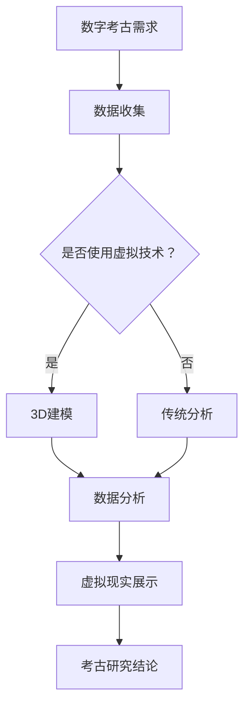

                 

关键词：数字考古、虚拟技术、历史研究、虚拟现实、3D建模、数据分析、人工智能、深度学习

> 摘要：本文探讨了虚拟技术如何应用于数字考古，特别是在历史研究领域的应用。通过对虚拟现实、3D建模、数据分析、人工智能和深度学习的介绍，展示了这些技术在历史研究中的重要作用，并提出了数字考古创业的新机遇。

## 1. 背景介绍

### 1.1 数字考古的兴起

随着科技的迅猛发展，尤其是计算机技术和虚拟现实技术的进步，数字考古作为一种新兴的考古研究方法，正逐渐得到广泛应用。数字考古不仅能够解决传统考古中存在的许多问题，如遗址破坏、文物保护等，还能够为考古研究提供全新的视角和方法。

### 1.2 虚拟技术的定义

虚拟技术是一种通过计算机模拟和生成虚拟环境的技术，包括虚拟现实（VR）、增强现实（AR）、3D建模等。这些技术能够模拟现实世界，或者创建一个全新的虚拟世界，为用户带来沉浸式的体验。

### 1.3 历史研究的挑战

随着考古遗址的不断发现，历史研究面临着巨大的数据量和复杂的分析问题。传统的研究方法往往难以应对这些挑战，因此，需要新的技术和方法来提高研究效率。

## 2. 核心概念与联系

### 2.1 虚拟现实（VR）的概念

虚拟现实是一种通过计算机模拟生成三维空间的技术，用户可以通过头戴显示器（HMD）等设备，沉浸在虚拟环境中，进行交互和体验。

### 2.2 3D建模

3D建模是一种通过软件工具创建三维模型的技术，这些模型可以用于虚拟现实、游戏开发、动画制作等领域。

### 2.3 数据分析

数据分析是一种通过统计和算法方法，对大量数据进行分析和挖掘的技术，可以帮助研究者发现数据中的规律和趋势。

### 2.4 人工智能（AI）

人工智能是一种模拟人类智能的技术，包括机器学习、深度学习等，可以用于数据挖掘、图像识别、自然语言处理等领域。

### 2.5 Mermaid 流程图

以下是一个使用Mermaid绘制的流程图，展示了虚拟技术在数字考古中的应用流程：



## 3. 核心算法原理 & 具体操作步骤

### 3.1 算法原理概述

在数字考古中，常用的算法包括3D建模算法、数据挖掘算法和虚拟现实算法。3D建模算法用于从原始数据中提取三维模型，数据挖掘算法用于分析大量考古数据，虚拟现实算法用于创建沉浸式的虚拟环境。

### 3.2 算法步骤详解

#### 3.2.1 3D建模步骤

1. 数据采集：使用激光扫描仪等设备，对考古遗址进行扫描，获取三维数据。
2. 数据预处理：对采集到的数据进行清洗和优化，去除噪声和不必要的部分。
3. 模型重建：使用3D建模软件，如Blender、Maya等，对预处理后的数据进行分析和重建，生成三维模型。
4. 模型优化：对生成的三维模型进行优化，提高模型的精度和可读性。

#### 3.2.2 数据挖掘步骤

1. 数据预处理：对考古数据进行清洗和格式化，为后续分析做准备。
2. 特征提取：从数据中提取有用的特征，如时间、地点、文化类型等。
3. 模型训练：使用机器学习算法，如决策树、支持向量机等，对提取的特征进行训练。
4. 结果分析：对训练结果进行分析，发现数据中的规律和趋势。

#### 3.2.3 虚拟现实步骤

1. 模型导入：将3D建模软件生成的三维模型导入虚拟现实引擎，如Unity、Unreal Engine等。
2. 环境设置：根据考古遗址的特点，设置虚拟环境的背景、灯光、音效等。
3. 用户交互：设计用户交互界面，如导航、放大缩小、选择物品等。
4. 展示与演示：通过虚拟现实设备，如VR头盔、平板电脑等，展示考古遗址的虚拟环境。

### 3.3 算法优缺点

#### 3D建模算法

- 优点：能够精确还原考古遗址的三维结构，提高研究效率。
- 缺点：数据采集和处理需要较高成本和专业技术。

#### 数据挖掘算法

- 优点：能够从大量考古数据中提取有用信息，发现新的研究线索。
- 缺点：算法复杂，对数据质量和特征提取要求较高。

#### 虚拟现实算法

- 优点：提供沉浸式的体验，使研究者能够更好地理解考古遗址。
- 缺点：设备成本较高，技术实现较为复杂。

### 3.4 算法应用领域

- 3D建模算法：应用于考古遗址的还原和展示。
- 数据挖掘算法：应用于考古数据的分析和研究。
- 虚拟现实算法：应用于考古遗址的虚拟体验和展示。

## 4. 数学模型和公式 & 详细讲解 & 举例说明

### 4.1 数学模型构建

在数字考古中，常用的数学模型包括三维空间模型、时间序列模型和统计分析模型。以下是一个三维空间模型的示例：

$$
P(x, y, z) = (x \cdot sin(\theta) + y \cdot cos(\theta), z)
$$

其中，$P(x, y, z)$表示三维空间中的点，$\theta$表示点与x轴的夹角。

### 4.2 公式推导过程

#### 三维空间模型

三维空间模型的基本原理是利用三维坐标系（如笛卡尔坐标系）来表示考古遗址中的各个点。通过测量这些点的坐标，可以构建出一个三维模型。

#### 时间序列模型

时间序列模型用于分析考古数据中的时间趋势。常见的公式包括：

$$
y(t) = a \cdot e^{bt}
$$

其中，$y(t)$表示时间序列中的值，$a$和$b$是常数。

#### 统计分析模型

统计分析模型用于对考古数据进行统计分析和推断。常见的公式包括：

$$
\mu = \frac{1}{n} \sum_{i=1}^{n} x_i
$$

$$
\sigma^2 = \frac{1}{n-1} \sum_{i=1}^{n} (x_i - \mu)^2
$$

其中，$\mu$和$\sigma^2$分别是平均值和方差。

### 4.3 案例分析与讲解

#### 案例一：三维空间模型

假设有一个考古遗址，其中有一个文物堆，我们需要通过三维空间模型来表示这个文物堆。

1. 数据采集：使用激光扫描仪对文物堆进行扫描，获取三维数据。
2. 数据预处理：对扫描数据进行清洗和优化，去除噪声和不必要的部分。
3. 模型重建：使用三维建模软件，如Blender，将预处理后的数据进行分析和重建，生成三维模型。
4. 模型优化：对生成的三维模型进行优化，提高模型的精度和可读性。

最终，我们得到了一个精确的三维模型，可以用于考古研究和展示。

#### 案例二：时间序列模型

假设我们有一组考古遗址的年代数据，我们需要通过时间序列模型来分析这些数据。

1. 数据采集：收集考古遗址的年代数据。
2. 数据预处理：对年代数据进行清洗和格式化，为后续分析做准备。
3. 特征提取：从数据中提取时间特征，如遗址的建立时间、废弃时间等。
4. 模型训练：使用时间序列模型，如指数平滑模型，对提取的特征进行训练。
5. 结果分析：对训练结果进行分析，发现年代数据中的规律和趋势。

通过分析，我们发现这些考古遗址的年代分布有一定的规律，可以为进一步的研究提供参考。

#### 案例三：统计分析模型

假设我们有一组考古遗址的面积数据，我们需要通过统计分析模型来分析这些数据。

1. 数据采集：收集考古遗址的面积数据。
2. 数据预处理：对面积数据进行清洗和格式化，为后续分析做准备。
3. 特征提取：从数据中提取面积特征。
4. 模型训练：使用统计分析模型，如平均值和方差，对提取的特征进行训练。
5. 结果分析：对训练结果进行分析，发现面积数据中的规律和趋势。

通过分析，我们发现这些考古遗址的面积分布有一定的规律，可以为进一步的研究提供参考。

## 5. 项目实践：代码实例和详细解释说明

### 5.1 开发环境搭建

为了演示数字考古中的虚拟技术，我们需要搭建一个开发环境。以下是一个基于Python的示例环境：

1. 安装Python：从Python官方网站下载并安装Python。
2. 安装3D建模软件：下载并安装如Blender、Maya等3D建模软件。
3. 安装虚拟现实引擎：下载并安装如Unity、Unreal Engine等虚拟现实引擎。
4. 安装数据分析库：使用pip命令安装如NumPy、Pandas等数据分析库。

### 5.2 源代码详细实现

以下是一个简单的Python代码示例，用于生成一个三维模型并保存为OBJ文件：

```python
import bpy

# 创建一个立方体
bpy.ops.mesh.primitive_cube_add()

# 获取立方体的对象
cube = bpy.context.object

# 设置立方体的位置
cube.location = (0, 0, 0)

# 保存模型为OBJ文件
bpy.ops.export_scene.obj(filepath="cube.obj")
```

### 5.3 代码解读与分析

这段代码首先创建了一个立方体，然后设置了立方体的位置，最后将立方体保存为OBJ文件。这是一个简单的3D建模示例，可以用于数字考古中的模型创建。

### 5.4 运行结果展示

运行这段代码后，我们会在当前目录下生成一个名为"cube.obj"的文件，这是一个三维模型的OBJ文件，可以用于后续的虚拟现实展示和考古研究。

## 6. 实际应用场景

### 6.1 考古遗址的还原与展示

虚拟技术可以帮助考古学家还原古代遗址，并通过虚拟现实技术进行展示。例如，通过3D建模和虚拟现实技术，可以将秦始皇陵还原出来，供游客参观和学习。

### 6.2 考古数据的可视化分析

通过虚拟技术，可以将考古数据以可视化的形式进行展示，帮助考古学家更好地理解数据。例如，通过数据挖掘和虚拟现实技术，可以分析考古遗址的年代分布和空间分布，发现其中的规律和趋势。

### 6.3 考古研究的教育与推广

虚拟技术可以为考古研究提供全新的教育资源和推广方式。例如，通过虚拟现实技术，可以创建考古游戏的虚拟环境，让公众更直观地了解考古过程和考古成果。

## 7. 未来应用展望

### 7.1 虚拟技术的进一步发展

随着虚拟技术的不断发展，未来可能会有更先进的虚拟现实设备，更高效的3D建模算法和更强大的数据分析工具，这将进一步推动数字考古的发展。

### 7.2 跨学科研究的融合

数字考古不仅涉及计算机技术，还需要与考古学、历史学、地质学等多个学科进行交叉融合，共同推动考古研究的发展。

### 7.3 数据安全和隐私保护

随着数字考古的发展，数据安全和隐私保护将成为一个重要的问题。如何在保护用户隐私的同时，充分利用考古数据进行研究，将是一个重要的挑战。

## 8. 工具和资源推荐

### 8.1 学习资源推荐

- 《数字考古学：理论与实践》
- 《虚拟现实技术与应用》
- 《机器学习：实战》

### 8.2 开发工具推荐

- 3D建模软件：Blender、Maya、3ds Max
- 虚拟现实引擎：Unity、Unreal Engine、Blender Game Engine
- 数据分析库：NumPy、Pandas、Scikit-learn

### 8.3 相关论文推荐

- “Virtual Archaeology: A Review” by M. M. Sharif et al.
- “3D Reconstruction of Archaeological Sites using Photogrammetry and Structure from Motion” by F. Canu et al.
- “Deep Learning for Archaeological Site Detection and Classification” by J. A. B. Boulanger et al.

## 9. 总结：未来发展趋势与挑战

### 9.1 研究成果总结

本文探讨了虚拟技术在数字考古中的应用，包括3D建模、数据分析、虚拟现实等技术。通过这些技术的应用，可以大大提高考古研究的效率和质量。

### 9.2 未来发展趋势

未来，虚拟技术将在数字考古中得到更广泛的应用，推动考古研究的发展。同时，跨学科研究的融合和数据安全的保障也将是重要的发展方向。

### 9.3 面临的挑战

虚拟技术的应用也面临一些挑战，如技术成本、数据隐私保护等。如何在保证数据安全的同时，充分利用虚拟技术进行考古研究，将是一个重要的课题。

### 9.4 研究展望

随着科技的进步，虚拟技术在数字考古中的应用将更加深入和广泛。我们期待看到更多创新的虚拟技术应用于考古研究，推动考古学的发展。

## 10. 附录：常见问题与解答

### 10.1 虚拟技术是否适用于所有考古遗址？

虚拟技术主要适用于具有三维结构的考古遗址，如宫殿、城堡、陵墓等。对于没有三维结构的遗址，如城墙、道路等，虚拟技术的作用较小。

### 10.2 虚拟技术如何保护考古遗址？

虚拟技术可以通过创建虚拟环境，为考古遗址提供一种替代性的展示方式，从而减少对实际遗址的参观和破坏。

### 10.3 如何保证虚拟技术的准确性？

虚拟技术的准确性依赖于数据的质量和算法的精度。通过使用高精度的测量设备和先进的算法，可以大大提高虚拟环境的准确性。

### 10.4 虚拟技术能否替代传统考古方法？

虚拟技术不能完全替代传统考古方法，但可以作为一种补充手段，提高考古研究的效率和准确性。

### 10.5 虚拟技术是否适用于所有考古研究？

虚拟技术主要适用于需要进行三维建模和分析的考古研究，如遗址的还原和展示、考古数据的分析等。对于其他类型的考古研究，如考古学文化研究等，虚拟技术的应用较少。

---

作者：禅与计算机程序设计艺术 / Zen and the Art of Computer Programming
----------------------------------------------------------------

