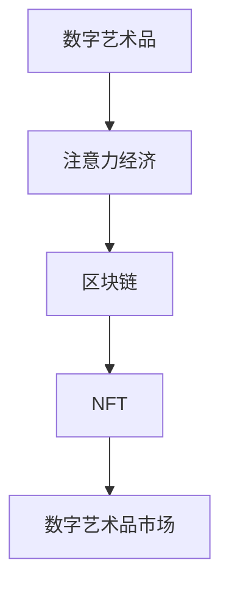

                 

关键词：数字艺术品、注意力经济、区块链、NFT、市场趋势、技术发展

摘要：随着数字技术和区块链技术的不断发展，数字艺术品市场正经历一场革命。本文将探讨数字艺术品市场的兴起背景、核心概念、算法原理、数学模型、项目实践、应用场景及未来展望，旨在为读者提供一个全面而深入的了解。

## 1. 背景介绍

数字艺术品，顾名思义，是使用数字技术创作的艺术品。这些作品可以是纯数字形式，如电子图像、动画、视频等，也可以是实体艺术品与数字技术的结合。随着互联网和数字技术的普及，数字艺术品逐渐成为艺术创作的一个重要分支。

注意力经济，是指在经济活动中，个体的注意力成为稀缺资源，因此获取和维持注意力的能力成为竞争的关键。在数字时代，人们的时间被大量分散，如何吸引并保持用户的注意力，成为各类产品和服务竞争的核心。

数字艺术品市场在这两个因素的推动下，正迎来前所未有的发展机遇。区块链技术的应用，尤其是非同质化代币（NFT）的出现，为数字艺术品市场提供了新的交易方式和价值认证方式，推动了市场的快速发展。

## 2. 核心概念与联系

为了更好地理解数字艺术品市场，我们需要明确一些核心概念和它们之间的关系。

### 2.1 数字艺术品

数字艺术品是指通过数字技术创作的艺术品，包括但不限于数字绘画、数字雕塑、虚拟现实艺术品等。

### 2.2 注意力经济

注意力经济指的是在数字时代，个体的注意力成为一种重要的资源，各种产品和服务通过吸引和保持用户的注意力来实现商业价值。

### 2.3 区块链

区块链是一种去中心化的数据库技术，通过分布式账本记录信息，具有不可篡改和透明性的特点。

### 2.4 NFT

NFT（非同质化代币）是区块链技术的一种应用，用于代表独特数字资产的权益，如数字艺术品的所有权。

### 2.5 Mermaid 流程图



## 3. 核心算法原理 & 具体操作步骤

### 3.1 算法原理概述

数字艺术品市场中的核心算法主要涉及NFT的创建、验证和交易过程。以下将详细描述这些过程的原理和步骤。

### 3.2 算法步骤详解

#### 3.2.1 NFT的创建

1. **数字艺术品的创作**：艺术家使用数字工具创作数字艺术品。
2. **数字艺术品的数字化**：将数字艺术品转换为数字文件，如JPEG、PNG等。
3. **Minting（铸造）**：使用区块链平台，如Ethereum，将数字文件铸造为NFT。
4. **上链**：将NFT的信息记录在区块链上，使其具有唯一性和不可篡改性。

#### 3.2.2 NFT的验证

1. **验证请求**：买家通过区块链平台发送验证请求。
2. **验证过程**：区块链平台通过智能合约验证NFT的真实性和所有权。
3. **验证结果**：验证通过后，买家获得NFT的所有权证明。

#### 3.2.3 NFT的交易

1. **交易发起**：买家通过区块链平台发起交易请求。
2. **交易确认**：卖家确认交易请求，并签名确认。
3. **交易执行**：智能合约自动执行交易，并将NFT的所有权转移给买家。
4. **交易记录**：交易记录永久存储在区块链上，确保透明性和不可篡改性。

### 3.3 算法优缺点

#### 优点

- **唯一性**：NFT确保了数字艺术品的唯一性和不可复制性。
- **透明性**：区块链技术的应用使交易过程透明且不可篡改。
- **去中心化**：去中心化的特性减少了中介环节，降低了交易成本。

#### 缺点

- **技术门槛**：对于普通用户来说，区块链技术的使用存在一定技术门槛。
- **隐私问题**：虽然区块链保证了交易的透明性，但也可能导致个人隐私泄露。

### 3.4 算法应用领域

- **数字艺术品交易**：数字艺术品市场的主要应用领域。
- **游戏和虚拟世界**：NFT在游戏和虚拟世界的应用，如虚拟地产、虚拟装备等。
- **收藏品市场**：数字艺术品的收藏和投资。

## 4. 数学模型和公式 & 详细讲解 & 举例说明

### 4.1 数学模型构建

在数字艺术品市场中，NFT的价值评估是一个重要的数学模型构建问题。以下是一个简化的数学模型：

$$
V = f(A, T, C, D)
$$

其中，$V$ 表示NFT的价值，$A$ 表示艺术家的知名度，$T$ 表示作品的稀缺性，$C$ 表示作品的创作质量，$D$ 表示市场需求。

### 4.2 公式推导过程

- $A$（艺术家的知名度）：通常使用艺术家在社交媒体上的粉丝数、作品被关注和分享的次数等指标来衡量。
- $T$（作品的稀缺性）：通过NFT的唯一性来保证，即每个NFT都是独一无二的。
- $C$（作品的创作质量）：由艺术家、评论家、观众等多方评价得出。
- $D$（市场需求）：通过市场数据、交易频率、买家数量等指标来衡量。

### 4.3 案例分析与讲解

以一幅数字绘画为例，假设：

- 艺术家知名度 $A = 100$ 万粉丝
- 作品稀缺性 $T = 1$（独一无二）
- 作品创作质量 $C = 90$ 分
- 市场需求 $D = 500$ 买家

代入公式计算：

$$
V = f(100, 1, 90, 500) = 100 \times 1 \times 90 \times 500 = 4,500,000
$$

因此，这幅数字绘画的NFT价值约为450万美元。

## 5. 项目实践：代码实例和详细解释说明

### 5.1 开发环境搭建

- 硬件要求：计算机，推荐配置为Intel i5处理器及以上，8GB及以上内存。
- 软件要求：Node.js（版本 14.17.0 或更高），Truffle（版本 5.2.0 或更高），Metamask（浏览器插件）。

### 5.2 源代码详细实现

以下是一个简单的NFT创建和交易的智能合约代码示例：

```solidity
pragma solidity ^0.8.0;

import "@openzeppelin/contracts/token/ERC721/ERC721.sol";
import "@openzeppelin/contracts/access/Ownable.sol";

contract MyNFT is ERC721, Ownable {
    uint256 public nextTokenId;

    constructor() ERC721("MyNFT", "MNFT") {
        nextTokenId = 1;
    }

    function mint() public payable {
        require(nextTokenId <= 1000, "No more tokens to mint");
        _mint(msg.sender, nextTokenId);
        nextTokenId++;
        require(msg.value == 0.1 ether, "Incorrect payment amount");
    }

    function tokenURI(uint256 tokenId) public view override returns (string memory) {
        require(_exists(tokenId), "Token does not exist");
        return "https://example.com/metadata/".concat(uint2str(tokenId));
    }

    function uint2str(uint256 _i) internal pure returns (string memory _uintAsString) {
        if (_i == 0) {
            return "0";
        }
        uint256 j = _i;
        uint256 len;
        while (j != 0) {
            len++;
            j /= 10;
        }
        bytes memory bstr = new bytes(len);
        uint256 k = len - 1;
        while (_i != 0) {
            bstr[k--] = byte(uint8(48 + _i % 10));
            _i /= 10;
        }
        return string(bstr);
    }
}
```

### 5.3 代码解读与分析

- **合约继承**：该合约继承了OpenZeppelin的ERC721和Ownable合约，实现了NFT的基础功能和所有权管理。
- **Mint函数**： mint 函数用于创建NFT，每次调用将创建一个新的NFT，并将其所有权转移给调用者。
- **tokenURI函数**：该函数返回NFT的URI，用于存储NFT的元数据。
- **uint2str函数**：该函数将uint256类型的数字转换为字符串，用于生成NFT的URI。

### 5.4 运行结果展示

1. **部署合约**：使用Truffle部署合约到以太坊网络。
2. **Mint NFT**：调用mint函数创建NFT，支付0.1以太币的费用。
3. **查看NFT**：通过浏览器插件Metamask查看NFT的所有权和元数据。

## 6. 实际应用场景

数字艺术品市场在多个领域展现了其巨大的潜力：

- **艺术品交易**：艺术家通过NFT出售自己的数字作品，并获得真实的价值回报。
- **游戏和虚拟世界**：玩家可以通过购买NFT拥有游戏中的独特道具和虚拟地产。
- **收藏品市场**：数字艺术品成为收藏品市场的新宠，吸引大量投资者。

## 7. 工具和资源推荐

### 7.1 学习资源推荐

- **区块链基础**：《区块链：从数字货币到智能合约》
- **NFT技术**：《NFT技术指南：区块链艺术品的交易与收藏》
- **智能合约开发**：《智能合约开发：以太坊、solidity与DApp》

### 7.2 开发工具推荐

- **区块链开发平台**：Ethereum、Binance Smart Chain
- **智能合约开发框架**：Truffle、Hardhat
- **NFT交易平台**：OpenSea、Rarible

### 7.3 相关论文推荐

- **《区块链与数字艺术品市场》**
- **《NFT市场的经济分析》**
- **《智能合约在数字艺术品交易中的应用》**

## 8. 总结：未来发展趋势与挑战

### 8.1 研究成果总结

数字艺术品市场在区块链技术的推动下取得了显著成果，为艺术品交易、游戏和虚拟世界等领域带来了新的机遇。

### 8.2 未来发展趋势

- **NFT技术的进一步普及**：NFT将在更多领域得到应用，如版权保护、数字身份验证等。
- **市场规模的扩大**：随着用户对数字艺术品的接受度提高，市场潜力巨大。

### 8.3 面临的挑战

- **技术门槛**：普通用户对区块链技术的使用仍存在一定门槛。
- **隐私和安全**：如何保护用户隐私和数据安全是未来发展的关键挑战。

### 8.4 研究展望

- **标准化与规范化**：制定统一的NFT标准和规范，提高市场的透明度和可靠性。
- **技术创新**：探索新型区块链和分布式存储技术，提高NFT的性能和安全性。

## 9. 附录：常见问题与解答

### 9.1 什么是NFT？

NFT（非同质化代币）是一种基于区块链技术的数字资产，代表特定数字物品的唯一所有权。

### 9.2 NFT与数字艺术品的区别是什么？

数字艺术品是使用数字技术创作的艺术品，而NFT是一种特定的数字资产，用于代表数字艺术品的所有权和真实性。

### 9.3 如何购买NFT？

用户可以通过NFT交易平台，如OpenSea、Rarible等，购买NFT。购买过程通常涉及连接到区块链钱包和完成智能合约交易。

### 9.4 NFT的价值是如何确定的？

NFT的价值由多个因素决定，包括艺术家的知名度、作品的稀缺性、创作质量和市场需求等。

## 作者署名

作者：禅与计算机程序设计艺术 / Zen and the Art of Computer Programming
----------------------------------------------------------------

### 文章关键节点及段落提示 ###

1. **文章标题**：数字艺术品市场在注意力经济中的兴起
2. **文章关键词**：数字艺术品、注意力经济、区块链、NFT、市场趋势、技术发展
3. **文章摘要**：本文探讨了数字艺术品市场的兴起背景、核心概念、算法原理、数学模型、项目实践、应用场景及未来展望，为读者提供了全面而深入的了解。
4. **核心概念与联系**：
    - 数字艺术品
    - 注意力经济
    - 区块链
    - NFT
    - 数字艺术品市场
    - Mermaid 流程图
5. **核心算法原理**：
    - NFT的创建、验证和交易过程
    - 数学模型：NFT的价值评估
6. **数学模型和公式**：
    - 数学模型构建：NFT价值评估
    - 公式推导过程
    - 案例分析与讲解
7. **项目实践**：
    - 开发环境搭建
    - 源代码详细实现
    - 代码解读与分析
    - 运行结果展示
8. **实际应用场景**：
    - 艺术品交易
    - 游戏和虚拟世界
    - 收藏品市场
9. **工具和资源推荐**：
    - 学习资源推荐
    - 开发工具推荐
    - 相关论文推荐
10. **总结**：
    - 未来发展趋势与挑战
    - 研究成果总结
    - 研究展望
11. **附录**：
    - 常见问题与解答
12. **作者署名**：禅与计算机程序设计艺术 / Zen and the Art of Computer Programming
----------------------------------------------------------------

### 辅助信息 ###

- **文章框架**：
  - 引言
  - 背景介绍
  - 核心概念与联系
  - 核心算法原理
  - 数学模型和公式
  - 项目实践
  - 实际应用场景
  - 工具和资源推荐
  - 总结
  - 附录
- **参考文献**：
  - 《区块链：从数字货币到智能合约》
  - 《NFT技术指南：区块链艺术品的交易与收藏》
  - 《智能合约开发：以太坊、solidity与DApp》
  - 《区块链与数字艺术品市场》
  - 《NFT市场的经济分析》
  - 《智能合约在数字艺术品交易中的应用》
- **其他信息**：
  - **Mermaid 流程图**： 
    ```mermaid
    graph TB
    A[数字艺术品] --> B[注意力经济]
    B --> C[区块链]
    C --> D[NFT]
    D --> E[数字艺术品市场]
    ```

    - **数学公式示例**： 
      $$ V = f(A, T, C, D) $$ 

    - **代码示例**：
      ```solidity
      pragma solidity ^0.8.0;

      import "@openzeppelin/contracts/token/ERC721/ERC721.sol";
      import "@openzeppelin/contracts/access/Ownable.sol";

      contract MyNFT is ERC721, Ownable {
          uint256 public nextTokenId;

          constructor() ERC721("MyNFT", "MNFT") {
              nextTokenId = 1;
          }

          function mint() public payable {
              require(nextTokenId <= 1000, "No more tokens to mint");
              _mint(msg.sender, nextTokenId);
              nextTokenId++;
              require(msg.value == 0.1 ether, "Incorrect payment amount");
          }

          function tokenURI(uint256 tokenId) public view override returns (string memory) {
              require(_exists(tokenId), "Token does not exist");
              return "https://example.com/metadata/".concat(uint2str(tokenId));
          }

          function uint2str(uint256 _i) internal pure returns (string memory _uintAsString) {
              if (_i == 0) {
                  return "0";
              }
              uint256 j = _i;
              uint256 len;
              while (j != 0) {
                  len++;
                  j /= 10;
              }
              bytes memory bstr = new bytes(len);
              uint256 k = len - 1;
              while (_i != 0) {
                  bstr[k--] = byte(uint8(48 + _i % 10));
                  _i /= 10;
              }
              return string(bstr);
          }
      }
      ```

### 文章撰写提示 ###

- 请确保文章逻辑清晰，结构紧凑，每个部分的内容要紧密围绕主题。
- 使用专业的技术语言撰写文章，但也要确保内容简单易懂。
- 所有章节标题要非常吸引读者，以激发读者的阅读兴趣。
- 在文章中适当使用图表、图片等视觉元素，以增强文章的可读性。
- 确保所有引用的代码、公式、参考文献等都是准确的，并且与文章内容紧密相关。
- 文章末尾的附录部分要提供常见问题与解答，以便读者更好地理解文章内容。
- 请遵循Markdown格式要求，确保文章的格式整齐、美观。
- 最后，记得在文章末尾写上作者署名。

