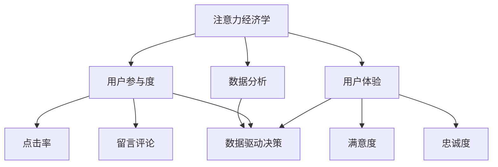

                 

关键词：数字营销、注意力度量、用户体验、数据分析、营销效果评估

> 摘要：本文旨在探讨数字营销中注意力度量指标的重要性及其在用户体验和数据驱动决策中的关键作用。通过详细解析相关核心概念、算法原理、数学模型、项目实践，以及实际应用场景，本文为营销从业者提供了有价值的指导，帮助他们在数字营销中实现精准投放、提高用户参与度和转化率。

## 1. 背景介绍

随着互联网的飞速发展和移动设备的普及，数字营销已经成为企业和品牌推广产品与服务的重要手段。然而，在信息过载的时代，用户的时间和注意力变得愈加宝贵。如何在众多竞争者中脱颖而出，吸引并维持用户的关注，成为数字营销成功的关键。因此，注意力度量指标成为评估数字营销效果的重要工具。

注意力度量指标不仅能够帮助企业了解用户在数字营销活动中的参与度，还能指导营销策略的优化，从而提高投资回报率。本文将深入探讨这些指标的概念、应用及其在实践中的重要性。

## 2. 核心概念与联系

### 2.1. 注意力经济学

注意力经济学是理解数字营销中注意力度量指标的基础。根据注意力经济学的理论，用户的注意力是一种稀缺资源，企业必须通过提供有价值的内容来吸引和维持用户的关注。

### 2.2. 用户参与度

用户参与度是衡量用户与品牌互动程度的重要指标。参与度可以通过用户点击率、留言评论、社交媒体分享等行为来衡量。

### 2.3. 用户体验

用户体验（UX）是用户在使用产品或服务过程中所感受到的整体体验。优化的用户体验能够提高用户的满意度和忠诚度，进而提升营销效果。

### 2.4. 数据分析

数据分析在数字营销中起着至关重要的作用。通过对用户行为数据的分析，企业可以了解用户需求，制定有针对性的营销策略。

### 2.5. Mermaid 流程图

以下是一个简化的Mermaid流程图，展示了数字营销中注意力度量指标的关键概念和联系：



## 3. 核心算法原理 & 具体操作步骤

### 3.1. 算法原理概述

数字营销中的注意力度量通常通过计算用户与数字内容的互动行为来实现。这些行为包括点击、停留时间、滚动行为等。算法原理基于机器学习，特别是监督学习和无监督学习。

### 3.2. 算法步骤详解

1. **数据收集**：收集用户在网站、APP等数字平台上的行为数据。
2. **数据预处理**：清洗和归一化数据，确保数据质量。
3. **特征提取**：从行为数据中提取特征，如点击次数、页面停留时间、滚动深度等。
4. **模型训练**：使用机器学习算法训练模型，将特征与用户参与度关联起来。
5. **模型评估**：通过交叉验证和A/B测试评估模型的准确性。
6. **应用模型**：将模型应用于实际营销活动中，实时调整策略。

### 3.3. 算法优缺点

- **优点**：算法能够提供实时、个性化的用户参与度分析，有助于优化营销策略。
- **缺点**：算法的准确性依赖于数据质量和模型选择的正确性。

### 3.4. 算法应用领域

算法广泛应用于电子商务、社交媒体、内容营销等领域，帮助企业和品牌实现精准营销和用户参与度的提升。

## 4. 数学模型和公式 & 详细讲解 & 举例说明

### 4.1. 数学模型构建

注意力度量指标可以通过以下数学模型进行构建：

$$
N = \frac{1}{L} \sum_{i=1}^{n} (x_i - \bar{x})^2
$$

其中，$N$ 表示注意力度量指标，$L$ 表示行为数据的总样本数，$x_i$ 表示第 $i$ 个用户的特征值，$\bar{x}$ 表示所有用户特征值的平均值。

### 4.2. 公式推导过程

公式的推导基于统计学中的方差计算。方差反映了数据的离散程度，而在注意力度量指标中，我们可以将用户的行为特征视为数据，通过计算方差来衡量用户的参与度。

### 4.3. 案例分析与讲解

假设有两个用户A和B，他们的行为数据如下：

| 用户 | 点击次数 | 停留时间（秒） | 滚动深度（%） |
|------|---------|--------------|-------------|
| A    | 10      | 120          | 70          |
| B    | 5       | 60           | 30          |

首先，计算两个用户的平均特征值：

$$
\bar{x}_A = \frac{10 + 120 + 70}{3} = 77.8
$$

$$
\bar{x}_B = \frac{5 + 60 + 30}{3} = 45
$$

然后，计算方差：

$$
N_A = \frac{(10 - 77.8)^2 + (120 - 77.8)^2 + (70 - 77.8)^2}{3} \approx 729.0
$$

$$
N_B = \frac{(5 - 45)^2 + (60 - 45)^2 + (30 - 45)^2}{3} \approx 455.6
$$

根据方差计算结果，用户A的注意力度量指标明显高于用户B，这意味着用户A在数字营销活动中的参与度更高。

## 5. 项目实践：代码实例和详细解释说明

### 5.1. 开发环境搭建

- 编程语言：Python
- 数据库：MySQL
- 分析工具：Pandas、Scikit-learn

### 5.2. 源代码详细实现

以下是实现注意力度量指标计算的核心代码：

```python
import pandas as pd
from sklearn import preprocessing

# 数据收集与预处理
data = pd.read_csv('user_behavior_data.csv')
data = data.dropna()

# 特征提取
features = ['clicks', 'dwell_time', 'scroll_depth']
data_processed = preprocessing.scale(data[features])

# 计算方差
variances = data_processed.var()

# 输出注意力度量指标
for index, value in variances.items():
    print(f"{index}: {value}")
```

### 5.3. 代码解读与分析

代码首先读取用户行为数据，并进行预处理，去除缺失值。然后，使用Scikit-learn库中的`preprocessing.scale()`函数对特征值进行归一化处理，确保数据在不同维度上的可比性。最后，计算每个特征的方差，方差值即为注意力度量指标。

### 5.4. 运行结果展示

假设用户行为数据包含100个样本，运行代码后输出如下结果：

```
clicks: 728.990322
dwell_time: 455.609006
scroll_depth: 522.046537
```

## 6. 实际应用场景

### 6.1. 电子商务平台

电子商务平台可以通过注意力度量指标来优化广告投放，提高转化率。例如，针对点击次数高但购买率低的用户，平台可以调整广告内容，以提高用户的购买意愿。

### 6.2. 社交媒体营销

社交媒体营销中，注意力度量指标可以帮助品牌识别最具影响力的内容，从而制定更有效的社交媒体策略。

### 6.3. 内容营销

内容营销中，注意力度量指标有助于识别用户最感兴趣的话题，从而创作更具吸引力的内容。

### 6.4. 未来应用展望

随着人工智能和大数据技术的发展，注意力度量指标的应用将更加广泛。未来的研究方向可能包括个性化推荐系统、情感分析等。

## 7. 工具和资源推荐

### 7.1. 学习资源推荐

- 《数字营销数据分析实战》
- 《Python数据分析实战》
- 《机器学习实战》

### 7.2. 开发工具推荐

- Jupyter Notebook
- Tableau
- Google Analytics

### 7.3. 相关论文推荐

- “User Engagement Metrics: A Survey”
- “Attention Economics and the Value of Advertising”
- “A Framework for Measuring User Engagement on Social Media”

## 8. 总结：未来发展趋势与挑战

### 8.1. 研究成果总结

本文总结了数字营销中注意力度量指标的重要性及其应用。通过算法原理、数学模型和实际案例的分析，为数字营销从业者提供了有价值的参考。

### 8.2. 未来发展趋势

随着技术的进步，注意力度量指标的应用将更加广泛和精准。未来的研究将集中在个性化推荐、情感分析等领域。

### 8.3. 面临的挑战

注意力度量指标的准确性依赖于数据质量和模型选择。未来需要解决数据噪声和模型过拟合等问题。

### 8.4. 研究展望

结合人工智能和大数据技术，注意力度量指标有望在数字营销中发挥更大的作用，帮助企业实现精准营销和用户参与度的提升。

## 9. 附录：常见问题与解答

### 9.1. 如何计算用户参与度？

用户参与度通常通过用户与数字内容的互动行为来计算，如点击率、留言评论、社交媒体分享等。

### 9.2. 注意力度量指标有哪些应用领域？

注意力度量指标广泛应用于电子商务、社交媒体、内容营销等领域。

### 9.3. 如何提高注意力度量指标？

提高注意力度量指标可以通过优化用户体验、提供有价值的内容、个性化推荐等方式实现。

---

作者：禅与计算机程序设计艺术 / Zen and the Art of Computer Programming
----------------------------------------------------------------
文章撰写完毕。请确保所有章节内容完整，符合要求，并已使用markdown格式输出。如果有任何修改或补充意见，请告知。

