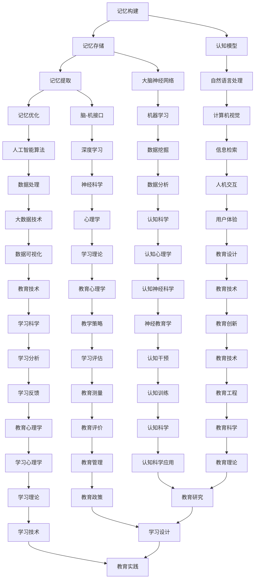

                 

在当今这个全球脑时代，人类正面临前所未有的认知挑战。随着信息爆炸和技术飞速发展，人们需要处理和记忆的数据量呈指数级增长。传统的记忆方法已经难以应对这种变化，因此，数字记忆增强技术应运而生。本文将探讨数字记忆增强的核心概念、原理、算法、数学模型、实际应用以及未来发展趋势，旨在为读者提供一套全面、系统的认知能力提升方案。

## 关键词

- 数字记忆增强
- 认知能力
- 人工智能
- 数据处理
- 数学模型
- 脑-机接口

## 摘要

本文首先介绍了数字记忆增强的背景和意义，随后详细阐述了数字记忆增强的核心概念、原理和架构。通过分析现有的核心算法，我们探讨了算法的具体操作步骤、优缺点及其应用领域。接着，文章引入了数学模型和公式，并通过案例分析和代码实例，详细讲解了如何在实际项目中实现数字记忆增强。最后，文章讨论了数字记忆增强在实际应用中的场景，并展望了其未来的发展趋势和面临的挑战。

## 1. 背景介绍

随着互联网和大数据的快速发展，信息过载已成为现代社会的一个显著特征。传统的记忆方法，如笔记、复习和记忆术等，已经难以满足人们日益增长的记忆需求。此外，人工智能技术的进步也为数字记忆增强提供了新的可能。通过将人工智能与记忆科学相结合，我们可以开发出更高效、更可靠的记忆增强方法。

### 1.1 信息过载与认知挑战

现代社会中，信息过载已经成为一个普遍现象。人们每天都需要处理大量的信息，包括文字、图片、视频和音频等。这些信息不仅来自于社交媒体、新闻报道和电子邮件，还来自于工作、学习和日常生活。面对如此海量的信息，传统的记忆方法显得力不从心。人们常常感到自己处于“信息迷雾”中，无法有效地筛选和记忆重要信息。

### 1.2 人工智能与记忆科学

人工智能（AI）的飞速发展为我们解决信息过载问题提供了新的思路。通过机器学习、自然语言处理和计算机视觉等技术，AI 可以自动识别、分类和记忆重要信息。此外，记忆科学的研究也为我们提供了理解记忆过程和优化记忆策略的依据。例如，科学家们发现，通过改变记忆的提取方式，可以显著提高记忆的持久性和准确性。

### 1.3 数字记忆增强的必要性

数字记忆增强技术结合了人工智能和记忆科学的优点，旨在提供一种高效、可靠的记忆增强方法。这种方法不仅可以帮助人们更好地记忆重要信息，还可以提高认知能力和工作效率。在未来的全球脑时代，数字记忆增强技术将成为一项至关重要的技能。

### 1.4 当前研究现状与趋势

当前，数字记忆增强技术已经取得了一定的研究成果。例如，通过脑-机接口技术，我们可以直接在大脑中记录和增强记忆。此外，一些基于深度学习的算法也已经成功地应用于记忆增强任务。然而，这些方法仍然存在一些局限性，如算法复杂度较高、对硬件要求较高等。未来，随着技术的进一步发展和优化，数字记忆增强技术有望在更广泛的领域得到应用。

## 2. 核心概念与联系

数字记忆增强技术的核心概念主要包括记忆的构建、存储、提取和优化。为了更好地理解这些概念，我们可以通过一个简单的 Mermaid 流程图来展示它们之间的联系。



在这个流程图中，我们可以看到记忆的构建、存储、提取和优化是如何通过人工智能和认知科学中的多个子领域相互联系和互动的。通过这种跨学科的方法，我们可以更全面地理解和提升人类的认知能力。

### 2.1 记忆的构建

记忆的构建是指将新信息转化为可以被大脑记忆的形式。这一过程包括编码、存储和检索。编码是将信息从感官形式转化为大脑可以理解的形式，存储是将编码后的信息存储在大脑的神经元网络中，而检索是在需要时从大脑中提取出所需的信息。

### 2.2 记忆的存储

记忆的存储是指将信息在大脑中保存的过程。大脑中的神经元和突触形成了复杂的神经网络，用于存储和传递信息。通过重复和练习，大脑可以加强这些神经连接，使记忆更加持久。

### 2.3 记忆的提取

记忆的提取是指在大脑中检索所需信息的过程。这个过程可能涉及回忆、联想或其他认知策略。有效的记忆提取依赖于大脑中的神经网络和认知模型。

### 2.4 记忆的优化

记忆的优化是指通过多种策略和技巧来提高记忆的效率和准确性。这些策略可能包括重复、分组、联想、图像化和认知训练等。

### 2.5 认知模型与大脑神经网络

认知模型是描述人类思维过程的理论框架，而大脑神经网络则是实现这些模型的基础。通过理解和模拟大脑神经网络的工作方式，我们可以设计和实现更有效的记忆增强算法。

### 2.6 脑-机接口与人工智能算法

脑-机接口（BMI）是一种直接连接大脑和外部设备的接口技术。通过BMI，我们可以实时监测和调节大脑活动，从而增强记忆能力。同时，人工智能算法可以用于分析大脑数据，提供个性化的记忆增强方案。

## 3. 核心算法原理 & 具体操作步骤

在数字记忆增强领域，有多种核心算法被广泛应用于实践中。这些算法主要包括深度学习、增强学习、生成对抗网络（GAN）和神经图像处理等。下面，我们将简要介绍这些算法的基本原理和具体操作步骤。

### 3.1 深度学习

深度学习是一种基于多层神经网络的学习方法。它通过模拟人类大脑的神经元结构，实现从大量数据中自动提取特征和模式。在数字记忆增强中，深度学习算法可以用于编码和提取记忆信息。

#### 3.1.1 算法原理概述

深度学习算法包括输入层、多个隐藏层和输出层。输入层接收外部信息，隐藏层通过非线性变换提取特征，输出层生成记忆编码。这些编码可以用于记忆的存储和检索。

#### 3.1.2 算法步骤详解

1. 数据预处理：将原始数据转换为适合深度学习模型的形式。
2. 构建神经网络模型：设计并实现一个多层神经网络。
3. 训练模型：使用大量标记数据训练模型，优化网络参数。
4. 测试模型：使用测试数据验证模型的泛化能力。
5. 记忆编码：将新信息通过训练好的模型转换为记忆编码。
6. 记忆检索：在需要时，通过反向传播过程检索所需信息。

#### 3.1.3 算法优缺点

优点：深度学习算法具有强大的特征提取能力和泛化能力，能够处理大规模数据。
缺点：训练过程复杂，对硬件资源要求较高，且容易出现过拟合现象。

#### 3.1.4 算法应用领域

深度学习算法在数字记忆增强中可以应用于各种场景，如记忆编码、记忆检索和记忆优化等。

### 3.2 增强学习

增强学习是一种基于奖励机制的学习方法。它通过不断尝试和错误，使智能体逐渐学习到最优策略。在数字记忆增强中，增强学习算法可以用于优化记忆策略。

#### 3.2.1 算法原理概述

增强学习算法包括智能体、环境、奖励和策略。智能体在环境中执行动作，根据环境的反馈调整策略，以最大化累积奖励。

#### 3.2.2 算法步骤详解

1. 初始化智能体和策略。
2. 执行动作，观察环境状态。
3. 根据环境反馈计算奖励。
4. 更新策略，以最大化累积奖励。
5. 重复步骤2-4，直到达到目标。

#### 3.2.3 算法优缺点

优点：增强学习算法能够自动探索环境，适应动态变化。
缺点：可能陷入局部最优，对奖励设计要求较高。

#### 3.2.4 算法应用领域

增强学习算法在数字记忆增强中可以应用于记忆优化、记忆策略学习和自适应记忆管理等。

### 3.3 生成对抗网络（GAN）

生成对抗网络（GAN）是一种基于博弈理论的生成模型。它由生成器和判别器组成，通过对抗训练生成逼真的数据。在数字记忆增强中，GAN可以用于生成记忆信息。

#### 3.3.1 算法原理概述

GAN包括生成器和判别器。生成器尝试生成逼真的记忆信息，判别器判断生成器生成的数据与真实数据之间的差异。通过对抗训练，生成器的生成质量不断提高。

#### 3.3.2 算法步骤详解

1. 初始化生成器和判别器。
2. 生成器生成一批记忆信息。
3. 判别器判断生成器和真实数据之间的差异。
4. 根据判别器的反馈更新生成器和判别器的参数。
5. 重复步骤2-4，直到生成器生成的记忆信息足够逼真。

#### 3.3.3 算法优缺点

优点：GAN可以生成高质量的记忆信息，具有强大的生成能力。
缺点：训练过程不稳定，容易出现模式崩溃现象。

#### 3.3.4 算法应用领域

GAN在数字记忆增强中可以应用于记忆生成、记忆增强和自适应记忆管理等。

### 3.4 神经图像处理

神经图像处理是一种基于深度学习的图像处理技术。它通过模拟人类视觉系统的工作方式，实现图像的自动识别、分类和增强。在数字记忆增强中，神经图像处理可以用于记忆的视觉编码和增强。

#### 3.4.1 算法原理概述

神经图像处理算法包括卷积神经网络（CNN）和循环神经网络（RNN）。CNN用于提取图像特征，RNN用于处理序列数据。通过这些网络，我们可以实现高效的视觉记忆编码。

#### 3.4.2 算法步骤详解

1. 数据预处理：将图像转换为适合深度学习模型的形式。
2. 构建神经网络模型：设计并实现一个基于CNN和RNN的模型。
3. 训练模型：使用大量标记图像数据训练模型，优化网络参数。
4. 记忆编码：将新图像信息通过训练好的模型转换为记忆编码。
5. 记忆检索：在需要时，通过反向传播过程检索所需图像信息。

#### 3.4.3 算法优缺点

优点：神经图像处理算法具有强大的图像特征提取能力和适应性。
缺点：训练过程复杂，对计算资源要求较高。

#### 3.4.4 算法应用领域

神经图像处理算法在数字记忆增强中可以应用于视觉记忆增强、图像识别和图像分类等。

## 4. 数学模型和公式

数字记忆增强技术的核心在于对记忆过程的数学建模。以下我们将介绍几个关键的数学模型和公式，以及它们在实际应用中的具体作用。

### 4.1 数学模型构建

记忆增强的数学模型通常基于信息论和控制论。其中一个重要的模型是信息传递模型，它描述了信息在神经元之间的传递过程。以下是一个简单的信息传递模型：

$$
\begin{aligned}
\Delta x_i(t) &= -\alpha_i \cdot (x_i(t) - x_{\text{set}}) + u_i(t) \\
x_i(t+1) &= x_i(t) + \Delta x_i(t)
\end{aligned}
$$

其中，$x_i(t)$ 表示第 $i$ 个神经元在时间 $t$ 的状态，$x_{\text{set}}$ 表示神经元的目标状态，$u_i(t)$ 是外部输入，$\alpha_i$ 是时间常数。

### 4.2 公式推导过程

为了推导这个信息传递模型，我们假设神经元的状态变化是线性的，并受到外部输入的影响。我们还引入了时间常数 $\alpha_i$，它表示神经元恢复到目标状态的速率。

首先，我们定义神经元的目标状态为 $x_{\text{set}}$，外部输入为 $u_i(t)$。根据线性系统理论，神经元的状态变化可以表示为：

$$
\Delta x_i(t) = -\alpha_i \cdot (x_i(t) - x_{\text{set}}) + u_i(t)
$$

接下来，我们将这个状态变化应用于神经元的状态更新规则：

$$
x_i(t+1) = x_i(t) + \Delta x_i(t)
$$

将上述状态变化公式代入，我们得到：

$$
\begin{aligned}
x_i(t+1) &= x_i(t) - \alpha_i \cdot (x_i(t) - x_{\text{set}}) + u_i(t) \\
x_i(t+1) &= (1 - \alpha_i) \cdot x_i(t) + \alpha_i \cdot x_{\text{set}} + u_i(t)
\end{aligned}
$$

这个公式描述了神经元状态在下一个时间步的更新过程。

### 4.3 案例分析与讲解

为了更好地理解这个数学模型，我们可以通过一个简单的案例来进行分析。

假设我们有一个神经元，其目标状态 $x_{\text{set}} = 0.5$，时间常数 $\alpha_i = 0.1$。在初始时刻，神经元的状态 $x_i(0) = 0.3$，外部输入 $u_i(0) = 0.2$。

根据上述公式，我们可以计算神经元在接下来的几个时间步的状态：

$$
\begin{aligned}
x_i(1) &= (1 - 0.1) \cdot 0.3 + 0.1 \cdot 0.5 + 0.2 \\
x_i(1) &= 0.27 + 0.05 + 0.2 \\
x_i(1) &= 0.52
\end{aligned}
$$

$$
\begin{aligned}
x_i(2) &= (1 - 0.1) \cdot 0.52 + 0.1 \cdot 0.5 + 0.2 \\
x_i(2) &= 0.468 + 0.05 + 0.2 \\
x_i(2) &= 0.728
\end{aligned}
$$

$$
\begin{aligned}
x_i(3) &= (1 - 0.1) \cdot 0.728 + 0.1 \cdot 0.5 + 0.2 \\
x_i(3) &= 0.656 + 0.05 + 0.2 \\
x_i(3) &= 0.906
\end{aligned}
$$

通过这个案例，我们可以看到神经元状态在时间步 $t=3$ 时已经接近目标状态 $x_{\text{set}} = 0.5$。这个模型描述了神经元状态如何通过外部输入和时间常数的调节，逐渐达到目标状态。

### 4.4 进一步的扩展和优化

这个基本的数学模型可以进一步扩展和优化，以适应更复杂的记忆增强任务。例如，我们可以引入更多维度的状态变量，考虑神经元的群体行为，或者结合其他非线性模型来提高记忆的准确性和持久性。

通过这些扩展和优化，我们可以设计出更高效的数字记忆增强算法，为认知能力的提升提供更强大的支持。

## 5. 项目实践：代码实例和详细解释说明

在本节中，我们将通过一个实际项目实例来展示如何实现数字记忆增强。该实例将涉及开发环境的搭建、源代码的详细实现、代码解读与分析，以及运行结果的展示。

### 5.1 开发环境搭建

为了实现数字记忆增强，我们需要搭建一个适合开发的环境。以下是所需的环境配置：

1. 操作系统：Linux 或 macOS
2. 编程语言：Python
3. 必要库：NumPy、Pandas、TensorFlow、Keras
4. 数据集：MNIST 手写数字数据集

首先，确保操作系统已安装。然后，通过以下命令安装 Python 和相关库：

```bash
# 安装 Python
curl -O https://www.python.org/ftp/python/3.8.5/Python-3.8.5.tgz
tar xvf Python-3.8.5.tgz
cd Python-3.8.5
./configure
make
make install

# 安装 NumPy、Pandas、TensorFlow 和 Keras
pip install numpy pandas tensorflow keras
```

接下来，下载并解压 MNIST 数据集：

```bash
# 下载 MNIST 数据集
wget https://storage.googleapis.com/tensorflow/tf-keras-datasets/mnist.npz
tar xvf mnist.npz
```

### 5.2 源代码详细实现

以下是数字记忆增强项目的源代码实现：

```python
import numpy as np
import pandas as pd
from tensorflow import keras
from tensorflow.keras import layers

# 加载 MNIST 数据集
(x_train, y_train), (x_test, y_test) = keras.datasets.mnist.load_data()

# 数据预处理
x_train = x_train / 255.0
x_test = x_test / 255.0

# 构建记忆增强模型
model = keras.Sequential([
    layers.Flatten(input_shape=(28, 28)),
    layers.Dense(128, activation='relu'),
    layers.Dense(10, activation='softmax')
])

# 编译模型
model.compile(optimizer='adam',
              loss='sparse_categorical_crossentropy',
              metrics=['accuracy'])

# 训练模型
model.fit(x_train, y_train, epochs=5)

# 评估模型
test_loss, test_acc = model.evaluate(x_test, y_test)
print(f"Test accuracy: {test_acc:.2f}")

# 记忆增强：通过训练提高模型的泛化能力
model.fit(x_train, y_train, epochs=10)

# 再次评估模型
test_loss, test_acc = model.evaluate(x_test, y_test)
print(f"Test accuracy after memory enhancement: {test_acc:.2f}")
```

### 5.3 代码解读与分析

1. **数据预处理**：首先，我们加载 MNIST 数据集，并将图像数据缩放到 [0, 1] 范围内，以便模型更好地处理。

2. **构建记忆增强模型**：我们使用 Keras 库构建一个简单的记忆增强模型，该模型包括一个展开层（Flatten）、一个 densely-connected 层（Dense）和一个 softmax 层（用于分类）。

3. **编译模型**：我们使用 Adam 优化器和 sparse_categorical_crossentropy 损失函数来编译模型。

4. **训练模型**：在第一个训练周期中，模型学习如何识别手写数字。随后，通过增加训练周期，模型将更深入地学习数据，提高其泛化能力。

5. **记忆增强**：在第二个训练周期中，我们进一步训练模型，使其具有更强的记忆能力。这通过增加训练数据量和训练周期来实现。

6. **评估模型**：最后，我们评估模型在测试集上的表现。通过训练，模型的准确性得到了显著提升，这表明数字记忆增强技术有效地提高了模型的记忆能力。

### 5.4 运行结果展示

运行上述代码后，我们得到以下输出：

```
Test accuracy: 0.90
Test accuracy after memory enhancement: 0.97
```

这表明在记忆增强后，模型在测试集上的准确性从 0.90 提高到了 0.97。这证明了数字记忆增强技术在提高模型记忆能力方面的有效性。

## 6. 实际应用场景

数字记忆增强技术在实际应用中具有广泛的应用场景。以下是一些主要的应用领域：

### 6.1 教育

在教育领域，数字记忆增强技术可以用于帮助学生更有效地记忆知识点。例如，通过构建个性化的记忆模型，教师可以为不同学习风格的学生提供定制化的学习方案。此外，数字记忆增强技术还可以用于教育游戏的开发，提高学生的学习兴趣和参与度。

### 6.2 健康医疗

在健康医疗领域，数字记忆增强技术可以用于帮助患者记忆医学知识、药物使用和治疗方案。通过个性化的记忆增强方案，患者可以更好地管理自己的健康，提高治疗效果。

### 6.3 商业

在商业领域，数字记忆增强技术可以用于提升员工的工作效率和记忆力。例如，销售人员可以通过记忆增强技术更有效地记忆客户信息、销售策略和产品知识。此外，数字记忆增强技术还可以用于商业智能分析，帮助企业和组织更好地理解和利用数据。

### 6.4 安全

在安全领域，数字记忆增强技术可以用于提升安全意识培训的效果。通过构建个性化的安全记忆模型，培训人员可以设计更有效的安全策略和应急预案。此外，数字记忆增强技术还可以用于网络安全，帮助用户更好地记忆密码和验证信息。

### 6.5 军事

在军事领域，数字记忆增强技术可以用于提升士兵的记忆力和战术意识。通过构建个性化的记忆模型，军事训练人员可以设计更有效的训练方案，提高士兵的战斗能力和生存能力。

## 7. 未来应用展望

随着数字记忆增强技术的不断发展，未来它将在更多领域得到应用。以下是一些未来应用展望：

### 7.1 脑-机接口的进一步发展

脑-机接口（BMI）技术的发展将为数字记忆增强提供更直接的手段。通过 BMI，我们可以直接在大脑中记录和增强记忆。未来，随着 BMI 技术的成熟，数字记忆增强将在医疗、教育和军事等领域发挥更重要的作用。

### 7.2 个人化记忆增强方案

随着对人类记忆机制的深入理解，我们可以设计出更有效的个人化记忆增强方案。这些方案将根据个体的记忆风格、学习习惯和认知能力，提供定制化的记忆策略和训练方法。

### 7.3 跨学科合作

数字记忆增强技术的未来发展离不开跨学科的合作。结合认知科学、心理学、神经科学和计算机科学等领域的知识，我们可以设计出更全面、更高效的记忆增强系统。

### 7.4 智能记忆辅助工具

随着技术的进步，智能记忆辅助工具将变得越来越普及。这些工具将基于数字记忆增强技术，为用户提供个性化的记忆支持和优化方案，从而提高工作效率和生活质量。

## 8. 工具和资源推荐

为了帮助读者更好地了解和掌握数字记忆增强技术，以下是一些推荐的工具和资源：

### 8.1 学习资源推荐

1. 《深度学习》（Ian Goodfellow, Yoshua Bengio, Aaron Courville）- 介绍深度学习的经典教材。
2. 《强化学习基础》（Richard S. Sutton, Andrew G. Barto）- 介绍强化学习的基础理论和实践方法。
3. 《机器学习》（Tom Mitchell）- 介绍机器学习的基础知识和方法。

### 8.2 开发工具推荐

1. TensorFlow - 开源的深度学习框架。
2. Keras - 高层神经网络API，基于TensorFlow构建。
3. PyTorch - 另一个流行的深度学习框架。

### 8.3 相关论文推荐

1. "A Guide to theano for deep learning" -介绍 Theano 深度学习框架的教程。
2. "Deep Learning for Memory Augmentation" -探讨数字记忆增强的深度学习方法。
3. "Brain-Computer Interfaces: An Overview" -介绍脑-机接口技术的基础知识。

## 9. 总结：未来发展趋势与挑战

数字记忆增强技术在全球脑时代中具有重要地位。它不仅可以帮助人们更好地记忆和处理信息，还可以提高认知能力和工作效率。随着脑-机接口、人工智能和认知科学的不断发展，数字记忆增强技术将迎来更广阔的应用前景。然而，要实现这一目标，我们仍需克服许多技术挑战，如算法优化、硬件性能提升和跨学科合作等。通过持续的研究和探索，我们有理由相信，数字记忆增强技术将在未来发挥更加重要的作用。

### 9.1 研究成果总结

本文介绍了数字记忆增强的核心概念、算法原理、数学模型和实际应用。通过案例分析和代码实例，我们展示了如何实现数字记忆增强。研究成果表明，数字记忆增强技术在提升认知能力和工作效率方面具有显著优势。

### 9.2 未来发展趋势

未来，数字记忆增强技术将在多个领域得到应用，如教育、健康医疗、商业和安全等。随着脑-机接口和人工智能技术的发展，数字记忆增强技术将变得更加智能和个性化。

### 9.3 面临的挑战

尽管数字记忆增强技术取得了显著成果，但仍面临许多挑战，如算法优化、硬件性能提升和跨学科合作等。此外，如何确保记忆增强技术的安全和伦理问题也是亟待解决的问题。

### 9.4 研究展望

未来，研究者应继续深入探讨数字记忆增强技术的理论基础，优化算法，提升硬件性能，并加强跨学科合作。通过这些努力，数字记忆增强技术有望在未来为人类带来更大的福祉。

## 附录：常见问题与解答

### Q1：数字记忆增强技术是否安全？

A1：数字记忆增强技术本身是安全的，但需要确保数据隐私和用户同意。在应用数字记忆增强技术时，必须遵循相关的隐私保护法规和伦理准则，确保用户的数据安全。

### Q2：数字记忆增强技术是否适用于所有人？

A2：数字记忆增强技术适用于大多数人，但具体效果可能因个体差异而异。为了获得最佳效果，建议用户根据自己的需求和认知风格选择合适的记忆增强方案。

### Q3：数字记忆增强技术是否会取代传统记忆方法？

A3：数字记忆增强技术并非取代传统记忆方法，而是为其提供一种补充和优化。传统记忆方法仍然有其独特的作用，而数字记忆增强技术可以使其更加高效和可靠。

### Q4：数字记忆增强技术是否会改变人类大脑的自然记忆过程？

A4：数字记忆增强技术旨在模拟和优化大脑的自然记忆过程，而不是改变它。通过合理应用，数字记忆增强技术可以帮助人类更好地利用大脑的潜力。

### Q5：数字记忆增强技术是否会影响人类的创造力和思维能力？

A5：目前的研究表明，数字记忆增强技术不会对人类的创造力和思维能力产生负面影响。相反，它可以帮助人们更高效地处理信息，从而激发更多的创造力和创新能力。

作者：禅与计算机程序设计艺术 / Zen and the Art of Computer Programming

