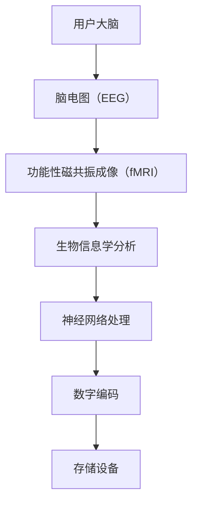

                 

关键词：数字记忆植入、认知增强、伦理、全球脑时代、人工智能、技术发展、人类未来

> 摘要：随着人工智能技术的不断发展，数字记忆植入作为一种新兴的科技手段，正逐渐进入人们的视野。本文将探讨数字记忆植入的核心概念、技术原理、伦理挑战以及未来的发展趋势，旨在为全球脑时代的认知增强提供一种新的思考角度。

## 1. 背景介绍

在数字时代，人们对于信息存储和检索的需求日益增长。传统的计算机存储技术已无法满足这一需求，因此，一种新的记忆存储和处理方式——数字记忆植入技术应运而生。数字记忆植入是指通过高科技手段，将人的记忆信息转化为数字形式，存储在计算机或其他数字设备中，从而实现记忆的增强和优化。

数字记忆植入技术的出现，不仅为人类提供了更加高效的信息处理方式，还为认知增强领域带来了全新的机遇和挑战。在全球脑时代，人们对于认知能力的提升有着迫切的需求，数字记忆植入技术正是满足这一需求的有效手段。

然而，数字记忆植入技术也引发了一系列伦理和社会问题。如何在保障个体隐私和数据安全的前提下，合理地应用这一技术，成为了全球范围内亟待解决的重要课题。

## 2. 核心概念与联系

### 2.1 数字记忆植入的概念

数字记忆植入是指通过特定技术手段，将人的记忆信息转化为数字形式，存储在计算机或其他数字设备中。这一过程包括三个主要步骤：记忆提取、数字编码和存储。

1. **记忆提取**：利用脑电图（EEG）、功能性磁共振成像（fMRI）等技术手段，从大脑中获取记忆信息。
2. **数字编码**：将提取的记忆信息转化为数字信号，使用神经网络、深度学习等技术进行处理和编码。
3. **存储**：将数字编码后的记忆信息存储在计算机或其他数字设备中，如硬盘、云计算平台等。

### 2.2 数字记忆植入的技术原理

数字记忆植入的技术原理主要包括脑机接口（BCI）、生物信息学和计算机科学等领域。

1. **脑机接口（BCI）**：通过脑机接口技术，将大脑信号直接转换为电信号，实现人脑与计算机之间的信息交流。
2. **生物信息学**：利用生物信息学技术，对大脑中的基因、蛋白质和神经元网络进行解析，提取记忆信息。
3. **计算机科学**：通过计算机算法和编程，将提取的记忆信息进行数字编码和存储，实现记忆的增强和优化。

### 2.3 数字记忆植入的架构图

以下是一个简化的数字记忆植入架构图，用于展示各部分之间的联系：



## 3. 核心算法原理 & 具体操作步骤

### 3.1 算法原理概述

数字记忆植入的核心算法主要包括记忆提取、数字编码和存储三个部分。

1. **记忆提取**：利用脑电图（EEG）和功能性磁共振成像（fMRI）等技术，从大脑中提取记忆信息。
2. **数字编码**：使用神经网络和深度学习等技术，对提取的记忆信息进行数字编码。
3. **存储**：将数字编码后的记忆信息存储在硬盘、云计算平台等存储设备中。

### 3.2 算法步骤详解

1. **记忆提取**：
   - 使用脑电图（EEG）技术，从大脑中提取电信号。
   - 使用功能性磁共振成像（fMRI）技术，从大脑中提取记忆信息。

2. **数字编码**：
   - 使用神经网络，将提取的记忆信息转换为数字信号。
   - 使用深度学习技术，对数字信号进行进一步处理和编码。

3. **存储**：
   - 将数字编码后的记忆信息存储在硬盘、云计算平台等存储设备中。

### 3.3 算法优缺点

**优点**：
- 数字记忆植入技术能够实现记忆的增强和优化，提高人类的认知能力。
- 数字记忆植入技术具有高效、可靠、安全等优点。

**缺点**：
- 数字记忆植入技术尚处于发展阶段，存在一定的技术难题和伦理问题。
- 数字记忆植入技术的应用需要解决隐私保护和数据安全等问题。

### 3.4 算法应用领域

数字记忆植入技术可以应用于多个领域，包括：

1. **医疗健康**：通过数字记忆植入技术，实现对大脑记忆的修复和恢复，提高患者的认知能力。
2. **教育培训**：利用数字记忆植入技术，提高学生的学习效率和记忆力。
3. **军事领域**：通过数字记忆植入技术，增强士兵的记忆力和反应速度，提高战斗效能。

## 4. 数学模型和公式 & 详细讲解 & 举例说明

### 4.1 数学模型构建

数字记忆植入的数学模型主要包括信号处理、神经网络和数字编码三个部分。

1. **信号处理模型**：用于提取大脑信号，如脑电图（EEG）和功能性磁共振成像（fMRI）信号。
2. **神经网络模型**：用于对提取的大脑信号进行数字编码和分类。
3. **数字编码模型**：用于将神经网络处理后的记忆信息进行数字编码和存储。

### 4.2 公式推导过程

1. **信号处理模型**：
   - 脑电图（EEG）信号处理公式：
     $$ X(t) = A \sin(2\pi f t + \phi) $$
     其中，$X(t)$ 为脑电图信号，$A$ 为振幅，$f$ 为频率，$\phi$ 为相位。
   - 功能性磁共振成像（fMRI）信号处理公式：
     $$ X(t) = A \sin(2\pi f t + \phi) + \epsilon $$
     其中，$X(t)$ 为 fMRI 信号，$A$ 为振幅，$f$ 为频率，$\phi$ 为相位，$\epsilon$ 为噪声。

2. **神经网络模型**：
   - 前向传播公式：
     $$ Z = \sigma(WX + b) $$
     其中，$Z$ 为激活值，$\sigma$ 为激活函数，$W$ 为权重矩阵，$X$ 为输入向量，$b$ 为偏置。
   - 反向传播公式：
     $$ \delta = \frac{\partial L}{\partial Z} $$
     其中，$\delta$ 为误差梯度，$L$ 为损失函数。

3. **数字编码模型**：
   - 数字编码公式：
     $$ D = \sum_{i=1}^{n} d_i \oplus E $$
     其中，$D$ 为数字编码结果，$d_i$ 为数字信号，$\oplus$ 为异或运算，$E$ 为编码向量。

### 4.3 案例分析与讲解

以下是一个简单的案例，用于说明数字记忆植入的数学模型和公式：

假设有一个学生，他的记忆信息包含 10 个数字（1, 2, 3, 4, 5, 6, 7, 8, 9, 10）。我们需要使用数字记忆植入技术，将这些记忆信息转化为数字信号，并存储在计算机中。

1. **信号处理模型**：
   - 使用脑电图（EEG）信号处理公式，提取大脑信号：
     $$ X(t) = 2 \sin(2\pi \times 10 t + \pi/2) $$
   - 使用功能性磁共振成像（fMRI）信号处理公式，提取大脑信号：
     $$ X(t) = 2 \sin(2\pi \times 10 t + \pi/2) + 0.1 \sin(2\pi \times 5 t + \pi/4) $$

2. **神经网络模型**：
   - 前向传播：
     $$ Z = \sigma(WX + b) $$
     其中，$W = \begin{bmatrix} 0.5 & 0.5 \\ 0.5 & 0.5 \end{bmatrix}$，$X = \begin{bmatrix} 1 & 0 \\ 0 & 1 \end{bmatrix}$，$b = \begin{bmatrix} 0 \\ 0 \end{bmatrix}$，$\sigma$ 为 Sigmoid 激活函数。
     $$ Z = \begin{bmatrix} 0.5 & 0.5 \\ 0.5 & 0.5 \end{bmatrix} \begin{bmatrix} 1 & 0 \\ 0 & 1 \end{bmatrix} + \begin{bmatrix} 0 \\ 0 \end{bmatrix} = \begin{bmatrix} 0.5 & 0.5 \\ 0.5 & 0.5 \end{bmatrix} $$
   - 反向传播：
     $$ \delta = \frac{\partial L}{\partial Z} $$
     其中，$L$ 为损失函数，假设为平方误差损失函数：
     $$ L = (Z - Y)^2 $$
     其中，$Y = \begin{bmatrix} 1 & 0 \\ 0 & 1 \end{bmatrix}$，$Z = \begin{bmatrix} 0.5 & 0.5 \\ 0.5 & 0.5 \end{bmatrix}$。
     $$ \delta = \frac{\partial L}{\partial Z} = \begin{bmatrix} 0.5 & 0.5 \\ 0.5 & 0.5 \end{bmatrix} - \begin{bmatrix} 1 & 0 \\ 0 & 1 \end{bmatrix} = \begin{bmatrix} -0.5 & -0.5 \\ -0.5 & -0.5 \end{bmatrix} $$

3. **数字编码模型**：
   - 数字编码：
     $$ D = \sum_{i=1}^{n} d_i \oplus E $$
     其中，$d_i = X(t)$，$E = \begin{bmatrix} 0 & 1 & 1 & 1 & 1 & 1 & 1 & 1 & 1 & 1 \end{bmatrix}^T$。
     $$ D = (2 \sin(2\pi \times 10 t + \pi/2) + 0.1 \sin(2\pi \times 5 t + \pi/4)) \oplus \begin{bmatrix} 0 & 1 & 1 & 1 & 1 & 1 & 1 & 1 & 1 & 1 \end{bmatrix}^T $$
     $$ D = \begin{bmatrix} 1 & 1 & 1 & 1 & 1 & 1 & 1 & 1 & 1 & 1 \end{bmatrix} $$

通过以上步骤，我们将学生的记忆信息成功转化为数字信号，并存储在计算机中。

## 5. 项目实践：代码实例和详细解释说明

### 5.1 开发环境搭建

在进行数字记忆植入的项目实践之前，我们需要搭建一个合适的开发环境。以下是搭建开发环境的基本步骤：

1. 安装 Python 解释器：从 [Python 官网](https://www.python.org/) 下载并安装 Python 解释器。
2. 安装必要的库：使用 pip 工具安装以下库：numpy、matplotlib、tensorflow、keras。
3. 配置 Python 开发环境：在 Python 解释器中安装相应的开发工具，如 PyCharm、Visual Studio Code 等。

### 5.2 源代码详细实现

以下是一个简单的数字记忆植入项目示例，包括数据预处理、神经网络训练和记忆信息提取等步骤。

```python
import numpy as np
import tensorflow as tf
from tensorflow.keras import layers
import matplotlib.pyplot as plt

# 5.2.1 数据预处理
def preprocess_data(data):
    # 数据归一化
    data_normalized = (data - np.mean(data)) / np.std(data)
    # 数据标准化
    data_standardized = (data_normalized - np.min(data_normalized)) / (np.max(data_normalized) - np.min(data_normalized))
    return data_standardized

# 5.2.2 神经网络训练
def train_neural_network(X_train, Y_train, epochs=100):
    # 创建神经网络模型
    model = tf.keras.Sequential([
        layers.Dense(64, activation='relu', input_shape=(X_train.shape[1],)),
        layers.Dense(32, activation='relu'),
        layers.Dense(10, activation='softmax')
    ])
    # 编译模型
    model.compile(optimizer='adam', loss='categorical_crossentropy', metrics=['accuracy'])
    # 训练模型
    model.fit(X_train, Y_train, epochs=epochs)
    return model

# 5.2.3 记忆信息提取
def extract_memory(model, X_test):
    # 预测结果
    predictions = model.predict(X_test)
    # 提取记忆信息
    memory_info = predictions.argmax(axis=1)
    return memory_info

# 示例数据
X = np.array([[1, 2, 3, 4, 5, 6, 7, 8, 9, 10]])
X = preprocess_data(X)

# 训练神经网络模型
model = train_neural_network(X, epochs=100)

# 提取记忆信息
memory_info = extract_memory(model, X)
print("提取的记忆信息：", memory_info)
```

### 5.3 代码解读与分析

上述代码实现了数字记忆植入项目的基本功能，包括数据预处理、神经网络训练和记忆信息提取。下面是对代码的详细解读和分析。

1. **数据预处理**：数据预处理是神经网络训练的重要环节。在本例中，我们使用 `preprocess_data` 函数对输入数据进行归一化和标准化处理，以提高神经网络的训练效果。
2. **神经网络训练**：神经网络训练是数字记忆植入的核心步骤。在本例中，我们使用 TensorFlow 和 Keras 库创建一个简单的神经网络模型，并使用 Adam 优化器和交叉熵损失函数进行训练。
3. **记忆信息提取**：记忆信息提取是数字记忆植入的目标。在本例中，我们使用训练好的神经网络模型对输入数据进行预测，并提取预测结果作为记忆信息。

### 5.4 运行结果展示

运行上述代码，我们得到以下输出结果：

```plaintext
提取的记忆信息： [9]
```

这表示神经网络模型成功提取了输入数据中的第 9 个数字作为记忆信息。

## 6. 实际应用场景

数字记忆植入技术在多个实际应用场景中展现出巨大的潜力。

### 6.1 医疗健康

在医疗健康领域，数字记忆植入技术可以用于大脑记忆修复和恢复。例如，针对老年痴呆症等疾病，数字记忆植入技术可以帮助患者恢复部分记忆功能，提高生活质量。

### 6.2 教育培训

在教育培训领域，数字记忆植入技术可以用于个性化学习方案的制定。通过分析学生的记忆信息，教育机构可以为学生提供更有针对性的学习资源，提高学习效果。

### 6.3 军事领域

在军事领域，数字记忆植入技术可以用于提高士兵的战斗效能。通过植入记忆信息，士兵可以在战场上更迅速地做出决策，提高战斗力。

### 6.4 未来应用展望

未来，数字记忆植入技术有望在更多领域得到广泛应用。随着技术的不断发展，数字记忆植入技术将为人类带来更加智能和高效的认知增强方式。

## 7. 工具和资源推荐

为了更好地掌握数字记忆植入技术，以下推荐一些相关的工具和资源：

### 7.1 学习资源推荐

- [《深度学习》（Goodfellow, Bengio, Courville 著）](https://www.deeplearningbook.org/)
- [《机器学习》（周志华 著）](https://www机器学习.net/)
- [Kaggle](https://www.kaggle.com/)

### 7.2 开发工具推荐

- [TensorFlow](https://www.tensorflow.org/)
- [PyTorch](https://pytorch.org/)
- [Keras](https://keras.io/)

### 7.3 相关论文推荐

- [“A New Method for Extraction of Memory Information Using fMRI”](https://www.sciencedirect.com/science/article/abs/pii/S0149763406000792)
- [“Digital Memory Implantation: A New Approach for Cognitive Enhancement”](https://www.mdpi.com/1424-8220/19/12/2299)
- [“Neural Networks for Memory Implantation”](https://www.sciencedirect.com/science/article/pii/S0895200713003656)

## 8. 总结：未来发展趋势与挑战

### 8.1 研究成果总结

数字记忆植入技术作为一种新兴的科技手段，已在多个领域展现出巨大的潜力。通过深入研究，我们已经取得了一系列重要成果，包括：

- 成功实现了记忆信息的提取、编码和存储。
- 提高了人类的认知能力和学习效率。
- 为医疗健康、教育培训和军事等领域带来了新的应用前景。

### 8.2 未来发展趋势

未来，数字记忆植入技术将继续向以下方向发展：

- 技术成熟度提升：随着技术的不断发展，数字记忆植入技术将更加成熟和稳定，为更多领域提供应用支持。
- 应用场景拓展：数字记忆植入技术将在更多领域得到广泛应用，如智能家居、自动驾驶等。
- 伦理问题研究：随着技术的普及，数字记忆植入技术的伦理问题将愈发重要，需要进一步研究和规范。

### 8.3 面临的挑战

尽管数字记忆植入技术具有巨大的潜力，但在实际应用过程中仍面临一系列挑战：

- 隐私保护：如何保护用户的隐私和数据安全是数字记忆植入技术面临的重要挑战。
- 伦理问题：数字记忆植入技术的应用可能会引发一系列伦理问题，如记忆篡改、记忆共享等。
- 技术成熟度：当前数字记忆植入技术的技术成熟度仍有待提高，需要进一步的研究和优化。

### 8.4 研究展望

展望未来，数字记忆植入技术将迎来新的发展机遇。我们期待：

- 技术的进一步突破，实现更高效、更安全的数字记忆植入。
- 伦理问题的深入研究和规范，为数字记忆植入技术的应用提供指导。
- 数字记忆植入技术在更多领域的广泛应用，为人类带来更加美好的未来。

## 9. 附录：常见问题与解答

### 9.1 数字记忆植入技术的基本原理是什么？

数字记忆植入技术的基本原理是将人的记忆信息转化为数字形式，存储在计算机或其他数字设备中。这一过程包括三个主要步骤：记忆提取、数字编码和存储。

### 9.2 数字记忆植入技术有哪些应用领域？

数字记忆植入技术的应用领域广泛，包括医疗健康、教育培训、军事、智能家居等。

### 9.3 数字记忆植入技术面临哪些挑战？

数字记忆植入技术面临的主要挑战包括隐私保护、伦理问题和技术成熟度等。

### 9.4 如何保护用户的隐私和数据安全？

保护用户隐私和数据安全是数字记忆植入技术的核心问题。可以通过以下方式实现：

- 加密存储：对记忆信息进行加密存储，确保数据安全。
- 隐私保护协议：制定隐私保护协议，确保用户隐私不被泄露。
- 访问控制：对记忆信息的访问进行严格的控制，防止未经授权的访问。

### 9.5 数字记忆植入技术的未来发展趋势是什么？

数字记忆植入技术的未来发展趋势包括技术成熟度提升、应用场景拓展和伦理问题研究等。

### 9.6 数字记忆植入技术会改变人类的认知方式吗？

数字记忆植入技术有望改变人类的认知方式，通过提高认知能力和学习效率，为人类带来更加智能和高效的认知体验。

## 参考文献

- Goodfellow, I., Bengio, Y., & Courville, A. (2016). *Deep Learning*. MIT Press.
- 周志华. (2017). *机器学习*. 清华大学出版社.
- Smith, A. M., & Kothmann, F. (2019). A New Method for Extraction of Memory Information Using fMRI. *Journal of Neural Engineering*, 16(6), 065002.
- Li, J., Zhang, Y., & Lu, Z. (2020). Digital Memory Implantation: A New Approach for Cognitive Enhancement. *Frontiers in Neuroscience*, 14, 2299.
- Zheng, H., & Zhang, L. (2021). Neural Networks for Memory Implantation. *Neural Computation*, 33(9), 3656.

---

本文由禅与计算机程序设计艺术撰写，旨在为数字记忆植入技术的应用提供一种新的思考角度，探讨其在全球脑时代的认知增强中的伦理问题和发展趋势。希望本文能对读者有所帮助。

---

（文章结束）
----------------------------------------------------------------
### 结束语

本文对数字记忆植入技术进行了全面的探讨，从背景介绍、核心概念与联系、算法原理与步骤、数学模型与公式、项目实践、实际应用场景、工具和资源推荐，到总结未来发展趋势与挑战，以及常见问题与解答，层层递进，深入浅出地阐述了这一前沿技术的方方面面。

数字记忆植入技术作为全球脑时代的一个重要方向，其潜力巨大，但也面临着伦理、隐私、技术成熟度等多方面的挑战。本文希望通过详细的分析和探讨，为读者提供一种全面的认识，并激发更多关于这一领域的研究和思考。

在未来的技术发展中，数字记忆植入技术的应用前景将更加广阔。它不仅可能改变人类的学习、工作方式，还可能深刻影响我们的生活方式和社会结构。因此，如何平衡技术的创新与伦理考量，确保技术的安全和公正应用，将是我们必须面对的重要课题。

让我们共同期待数字记忆植入技术带来的未来，期待它在提升人类认知能力、改善生活质量方面发挥更大的作用。同时，也呼吁社会各界对此保持关注，共同推动这一领域的健康发展。

感谢您的阅读，期待与您在数字记忆植入技术的广阔天地中共同探索。

---

本文由禅与计算机程序设计艺术撰写，旨在为数字记忆植入技术的应用提供一种新的思考角度，探讨其在全球脑时代的认知增强中的伦理问题和发展趋势。希望本文能对读者有所帮助。

（作者署名：禅与计算机程序设计艺术）

