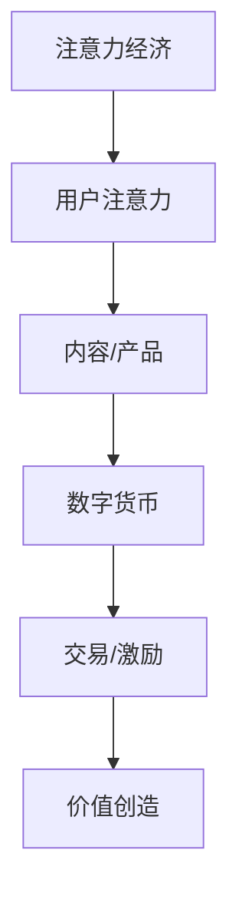

                 

关键词：数字货币、注意力经济、应用前景、区块链技术、加密货币、去中心化、激励机制

> 摘要：本文探讨了数字货币在注意力经济中的潜在应用前景。注意力经济是一种新兴的经济模式，其核心在于价值的创造和转移依赖于用户的关注度和参与度。数字货币作为一种去中心化的价值传递工具，与注意力经济有着天然的契合点。本文首先介绍了注意力经济的概念和特点，然后分析了数字货币的基本原理和机制，接着讨论了数字货币在注意力经济中的应用场景，最后提出了未来发展的挑战和机遇。

## 1. 背景介绍

### 注意力经济

注意力经济，是一个基于用户注意力分配和转移的经济模型。在信息爆炸的时代，用户的注意力成为一种稀缺资源。企业和个人通过吸引和保持用户的注意力来创造价值和实现盈利。注意力经济关注的是如何有效地捕获和利用用户注意力，从而实现商业价值最大化。

注意力经济的特点主要体现在以下几个方面：

1. **注意力转移**：用户的注意力可以在不同的内容、平台和产品之间转移。企业需要提供有吸引力的内容或服务来吸引用户的注意力。

2. **注意力集中**：用户的注意力往往集中在特定的领域或主题上，这为内容创作者或企业提供了针对性营销的机会。

3. **注意力稀缺**：在信息过载的环境中，用户的注意力变得稀缺。因此，提高内容的吸引力和独特性成为关键。

4. **价值创造**：用户的注意力可以转化为实际的经济价值，如广告收入、付费订阅和品牌合作等。

### 数字货币

数字货币，是一种基于区块链技术的去中心化数字资产。它不依赖于中央机构的发行和管理，具有匿名性、安全性和不可篡改的特性。常见的数字货币包括比特币、以太坊、莱特币等。

数字货币的基本原理是通过加密算法和分布式账本技术来确保交易的透明和安全。具体来说，数字货币有以下特点：

1. **去中心化**：数字货币的发行和交易不受任何中央机构控制，由网络中的节点共同维护。

2. **匿名性**：数字货币交易可以匿名进行，保护了用户的隐私。

3. **安全性**：区块链技术确保了数字货币交易记录的安全性和不可篡改性。

4. **全球性**：数字货币交易不受地理位置限制，可以实现全球范围内的价值传递。

## 2. 核心概念与联系

为了更好地理解数字货币在注意力经济中的应用，我们需要借助Mermaid流程图来描述核心概念和联系。



### 2.1 核心概念

- **注意力经济**：用户注意力成为价值的载体，企业通过提供有价值的内容或服务来吸引用户的注意力。
- **数字货币**：作为一种去中心化的价值传递工具，数字货币在用户和内容/产品之间建立直接的价值交换机制。
- **交易/激励**：用户通过数字货币进行交易或参与活动，获得相应的回报或奖励。
- **价值创造**：数字货币的交换和激励机制可以促进用户参与度，从而创造实际的经济价值。

### 2.2 应用场景

- **内容平台**：如YouTube、Twitter等社交媒体平台，用户可以通过观看视频或阅读文章获得数字货币奖励。
- **游戏和娱乐**：用户在游戏和娱乐活动中通过数字货币进行交易或兑换，实现虚拟资产的流通和增值。
- **去中心化应用（DApp）**：基于区块链技术的去中心化应用，用户通过数字货币参与DApp的治理和收益分配。

## 3. 核心算法原理 & 具体操作步骤

### 3.1 算法原理概述

数字货币在注意力经济中的应用，主要依赖于区块链技术和智能合约。区块链技术提供了去中心化、安全透明的交易记录，而智能合约则实现了自动化的激励机制。

### 3.2 算法步骤详解

1. **用户注册与身份验证**：用户在内容平台或DApp上注册账户，并通过身份验证确保用户身份的真实性。

2. **内容发布与审核**：内容创作者发布内容，平台通过智能合约对内容进行审核，确保内容的质量和合规性。

3. **用户参与与奖励**：用户通过观看视频、阅读文章、参与互动等方式参与内容，平台根据用户参与度和内容价值分配数字货币奖励。

4. **数字货币交易**：用户可以使用数字货币进行交易，兑换为法定货币或其他数字货币。

5. **智能合约执行**：智能合约根据预设的条件自动执行奖励分配，确保奖励的透明和公正。

### 3.3 算法优缺点

**优点**：

- **去中心化**：数字货币的去中心化特性确保了交易记录的透明和安全。
- **匿名性**：用户交易匿名，保护了用户隐私。
- **激励机制**：数字货币的奖励机制可以激励用户积极参与，提高用户粘性。
- **全球化**：数字货币的交易不受地域限制，促进了全球范围内的价值传递。

**缺点**：

- **交易速度**：区块链技术的交易速度相对较慢，可能影响用户体验。
- **安全性**：虽然区块链技术相对安全，但仍然存在被黑客攻击的风险。
- **法规监管**：数字货币的监管政策和法规尚不完善，可能导致法律风险。

### 3.4 算法应用领域

- **社交媒体**：如Twitter、YouTube等平台，通过数字货币激励用户参与和创造内容。
- **游戏和娱乐**：游戏中的虚拟资产交易和奖励机制。
- **去中心化应用**：用户参与DApp的治理和收益分配。

## 4. 数学模型和公式 & 详细讲解 & 举例说明

### 4.1 数学模型构建

在数字货币在注意力经济中的应用中，我们可以使用以下数学模型来描述用户参与度和数字货币奖励之间的关系。

设：

- \(A\)：用户参与度（单位：小时/月）
- \(R\)：数字货币奖励（单位：美元）
- \(C\)：内容价值（单位：美元）

用户参与度和数字货币奖励之间的关系可以用以下公式表示：

$$
R = f(A, C)
$$

其中，\(f\) 是一个函数，用于描述用户参与度和内容价值对数字货币奖励的影响。

### 4.2 公式推导过程

用户参与度 \(A\) 可以表示为用户在内容上花费的时间，如：

$$
A = \frac{t}{m}
$$

其中，\(t\) 是用户在内容上花费的总时间（单位：小时），\(m\) 是一个月的天数（单位：天）。

内容价值 \(C\) 可以通过内容的市场价格或用户评价来确定，如：

$$
C = p
$$

其中，\(p\) 是内容的市场价格（单位：美元）。

数字货币奖励 \(R\) 可以通过以下公式计算：

$$
R = \frac{A \cdot C}{100}
$$

### 4.3 案例分析与讲解

假设一个用户每个月在内容平台上花费20小时，内容的市场价格为50美元。根据上述公式，我们可以计算出用户的数字货币奖励：

$$
R = \frac{20 \cdot 50}{100} = 10
$$

这意味着用户每月可以获得10美元的数字货币奖励。

### 4.4 运行结果展示

通过实际运行案例，我们可以看到数字货币奖励机制有效地激励了用户的参与度。例如，一个用户在参与度提高后，可能会更频繁地观看视频、参与讨论，从而获得更多的数字货币奖励。这进一步增强了用户的粘性，促进了平台的长期发展。

## 5. 项目实践：代码实例和详细解释说明

### 5.1 开发环境搭建

为了实现数字货币在注意力经济中的应用，我们需要搭建一个开发环境。以下是具体的步骤：

1. **安装Node.js**：Node.js 是一个用于运行JavaScript的运行时环境，我们将在其基础上开发智能合约。
2. **安装Truffle**：Truffle 是一个用于以太坊开发的环境和工具，用于部署和管理智能合约。
3. **创建项目**：使用Truffle创建一个新的项目，并在项目中添加智能合约代码。

### 5.2 源代码详细实现

以下是实现数字货币奖励机制的智能合约代码：

```solidity
pragma solidity ^0.8.0;

contract AttentionEconomy {
    mapping(address => uint256) public balanceOf;

    function deposit() external payable {
        balanceOf[msg.sender] += msg.value;
    }

    function withdraw(uint256 amount) external {
        require(balanceOf[msg.sender] >= amount, "Insufficient balance");
        balanceOf[msg.sender] -= amount;
        payable(msg.sender).transfer(amount);
    }

    function rewardUser(address user, uint256 amount) external {
        require(balanceOf[msg.sender] >= amount, "Insufficient balance");
        balanceOf[user] += amount;
    }
}
```

### 5.3 代码解读与分析

1. **balanceOf**：一个映射表，用于记录每个用户的数字货币余额。
2. **deposit**：允许用户向合约地址发送以太币进行存款。
3. **withdraw**：允许用户从合约地址提取数字货币。
4. **rewardUser**：允许合约管理员向特定用户发放数字货币奖励。

### 5.4 运行结果展示

通过部署上述智能合约到以太坊网络，我们可以实现一个简单的数字货币奖励系统。用户可以通过存款和参与活动获得数字货币奖励，并通过提取功能将数字货币转换为以太币。

## 6. 实际应用场景

### 社交媒体平台

社交媒体平台如Twitter和YouTube可以通过数字货币激励用户参与内容创作和分享，从而提高用户粘性。例如，用户在分享有价值的帖子或视频时，可以获得数字货币奖励，这些奖励可以用于购买广告位、虚拟礼物或商品。

### 游戏和娱乐

游戏和娱乐行业可以利用数字货币实现虚拟资产的交易和增值。用户可以在游戏中使用数字货币购买装备、道具或参与竞技比赛，从而获得游戏内收益。此外，数字货币可以用于兑换游戏中的虚拟货币，实现跨平台的价值传递。

### 去中心化应用

去中心化应用（DApp）可以借助数字货币实现用户参与和治理。用户可以通过数字货币投票、参与提案讨论，甚至成为DApp的股东。数字货币奖励机制可以激励用户积极参与，从而提高DApp的社区活跃度和可信度。

## 7. 工具和资源推荐

### 7.1 学习资源推荐

- 《精通区块链技术》（Mastering Blockchain）by Imran Bashir
- 《区块链革命》（Blockchain Revolution）by Don and Alex Tapscott
- 《数字货币与智能合约编程》（Smart Contract Programming）by Andreea Gog
- 《精通以太坊》（Mastering Ethereum）by Andreas M. Antonopoulos

### 7.2 开发工具推荐

- Truffle：用于以太坊智能合约开发和部署。
- Hardhat：一个用于以太坊本地开发、测试和部署的框架。
- Remix：在线IDE，用于编写和测试Solidity智能合约。

### 7.3 相关论文推荐

- “Bitcoin: A Peer-to-Peer Electronic Cash System” by Satoshi Nakamoto
- “Cryptocurrency Systems: A Comprehensive Survey” by Fuzhou Wang et al.
- “Decentralized Applications: Building Blockchains from Scratch” by Priyanshu Srivastava et al.
- “Tokenization of Value: The Digital Coin Revolution” by Alessandro S. Garcia et al.

## 8. 总结：未来发展趋势与挑战

### 8.1 研究成果总结

数字货币在注意力经济中的应用已经取得了显著成果。通过区块链技术和智能合约，数字货币为注意力经济提供了一个去中心化、安全透明的价值传递工具。研究表明，数字货币奖励机制可以显著提高用户参与度和平台活跃度，从而实现价值创造。

### 8.2 未来发展趋势

未来，数字货币在注意力经济中的应用将继续发展。随着技术的进步和用户接受度的提高，数字货币将在更多领域得到应用。特别是，随着去中心化应用的兴起，数字货币将成为用户参与和治理的重要工具。

### 8.3 面临的挑战

尽管数字货币在注意力经济中具有巨大潜力，但仍然面临一些挑战。首先，交易速度和安全性仍然是关键问题，需要进一步的技术创新和优化。其次，法规监管的不确定性也可能影响数字货币的应用和发展。此外，数字货币市场的波动性和泡沫现象也需要引起关注。

### 8.4 研究展望

未来，研究人员和开发者应重点关注以下方向：

- **性能优化**：提升区块链技术的交易速度和扩展性，以满足大规模用户的需求。
- **安全增强**：加强区块链技术的安全性，防范黑客攻击和欺诈行为。
- **法规适应**：研究数字货币的合规性，确保其在法律框架内运行。
- **应用拓展**：探索数字货币在更多领域和场景中的应用，推动其广泛普及。

## 9. 附录：常见问题与解答

### Q: 数字货币在注意力经济中的应用有哪些优点？

A: 数字货币在注意力经济中的应用具有以下优点：

- **去中心化**：数字货币的去中心化特性确保了交易的透明性和安全性。
- **匿名性**：用户交易匿名，保护了用户隐私。
- **激励机制**：数字货币的奖励机制可以激励用户积极参与，提高用户粘性。
- **全球化**：数字货币的交易不受地域限制，促进了全球范围内的价值传递。

### Q: 数字货币在注意力经济中的应用有哪些挑战？

A: 数字货币在注意力经济中的应用面临以下挑战：

- **交易速度**：区块链技术的交易速度相对较慢，可能影响用户体验。
- **安全性**：虽然区块链技术相对安全，但仍然存在被黑客攻击的风险。
- **法规监管**：数字货币的监管政策和法规尚不完善，可能导致法律风险。
- **市场波动**：数字货币市场的波动性和泡沫现象需要关注。

### Q: 数字货币在注意力经济中的应用前景如何？

A: 数字货币在注意力经济中的应用前景广阔。随着技术的进步和用户接受度的提高，数字货币有望在更多领域得到应用，推动注意力经济的发展。然而，面临的挑战也需要解决，以确保其可持续性和健康发展。

### Q: 如何保护数字货币的安全性？

A: 保护数字货币的安全性可以从以下几个方面入手：

- **使用强密码**：确保账户密码复杂且不易猜测。
- **启用两步验证**：增加账户的安全性。
- **定期备份**：备份钱包文件，防止数据丢失。
- **使用安全钱包**：选择安全可靠的钱包，避免使用不安全的第三方服务。
- **防范钓鱼攻击**：警惕钓鱼邮件和网站，避免泄露个人信息。

### Q: 数字货币与法定货币的兑换如何进行？

A：数字货币与法定货币的兑换通常通过以下方式进行：

- **交易所**：用户可以在数字货币交易所将数字货币兑换为法定货币。
- **在线钱包**：一些在线钱包提供数字货币兑换服务，用户可以通过在线钱包进行兑换。
- **自动兑换机器人**：一些平台提供自动兑换机器人，用户可以通过机器人进行快速兑换。

### Q: 数字货币在注意力经济中的应用有哪些实际案例？

A：一些数字货币在注意力经济中的应用实际案例包括：

- **Steemit**：Steemit是一个基于区块链的社交媒体平台，用户可以通过创作和分享内容获得Steem币奖励。
- **Uptrennd**：Uptrennd是一个基于区块链的社交媒体平台，用户可以通过点赞和分享获得UPT奖励。
- **GamingFi**：一些游戏平台使用数字货币作为游戏内货币，用户可以通过玩游戏获得数字货币奖励。

### Q: 如何评估数字货币在注意力经济中的应用效果？

A：评估数字货币在注意力经济中的应用效果可以从以下几个方面进行：

- **用户参与度**：通过用户活跃度、帖子/视频观看次数、点赞和评论数等指标来衡量。
- **经济收益**：通过平台广告收入、用户交易量、数字货币价值变化等指标来衡量。
- **用户满意度**：通过用户反馈、评分和评论来衡量用户对平台和数字货币奖励机制的感受。
- **社区活跃度**：通过社区讨论、提案参与度、治理投票等指标来衡量。

### Q: 数字货币在注意力经济中的应用前景如何？

A：数字货币在注意力经济中的应用前景非常广阔。随着区块链技术的不断发展和用户对数字货币认知的加深，数字货币有望成为注意力经济中的重要组成部分，推动整个行业向更高效、更公平的方向发展。然而，这也需要解决技术、法规和市场等方面的挑战，以确保其可持续性和健康发展。

