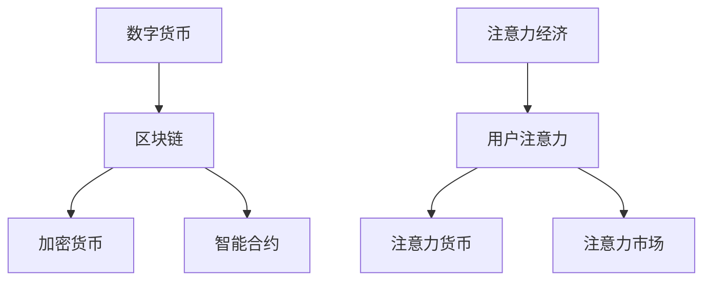

                 

关键词：数字货币、注意力经济、应用前景、区块链、智能合约

> 摘要：本文旨在探讨数字货币在注意力经济中的应用前景，分析其核心概念、技术架构、算法原理、数学模型、实践案例及未来发展方向。通过深入剖析，本文将为读者呈现数字货币在当前和未来经济体系中的重要角色。

## 1. 背景介绍

### 数字货币的起源与发展

数字货币（Digital Currency）是一种基于数字技术的货币形式，不同于传统货币的物理形态，它主要存在于电子设备和网络中。数字货币的发展起源于电子现金系统，并在近年来随着区块链技术的兴起得到了快速发展。

区块链技术作为一种去中心化的分布式账本技术，具有安全性、透明性和不可篡改性等特点。数字货币正是利用区块链技术来确保交易的合法性和可靠性，从而摆脱了传统金融体系的中心化管理模式。

### 注意力经济的兴起

注意力经济（Attention Economy）是指基于用户注意力分配的价值交换机制。在信息爆炸的时代，用户的注意力成为了一种稀缺资源，而如何有效地获取和利用用户的注意力成为了商业竞争的关键。

注意力经济的核心在于通过提供有价值的内容或服务来吸引用户的注意力，进而实现商业价值的转化。社交媒体、内容平台和广告行业是注意力经济的主要应用领域。

## 2. 核心概念与联系

### 数字货币的核心概念

- **区块链**：一种去中心化的分布式账本，用于记录数字货币的交易活动。
- **加密货币**：基于特定算法生成的数字货币，如比特币、以太坊等。
- **智能合约**：一种自执行的合约，基于区块链技术，可以自动化执行合同条款。

### 注意力经济的核心概念

- **用户注意力**：用户在信息过载环境中的注意力分配。
- **注意力货币**：用于衡量和交换用户注意力的数字货币。
- **注意力市场**：用户注意力分配和交易的平台。

### 核心概念架构的 Mermaid 流程图



## 3. 核心算法原理 & 具体操作步骤

### 3.1 算法原理概述

数字货币在注意力经济中的应用主要依赖于以下几个核心算法：

1. **区块链算法**：确保交易的合法性和安全性。
2. **加密算法**：保护数字货币的安全。
3. **智能合约算法**：自动化执行注意力市场的交易。

### 3.2 算法步骤详解

1. **区块链算法步骤**：

   - 创建新区块并验证交易合法性。
   - 将新区块添加到区块链中。
   - 实现分布式共识机制，确保区块链的完整性。

2. **加密算法步骤**：

   - 对数字货币进行加密处理。
   - 使用非对称加密算法保护交易信息。
   - 确保交易信息的机密性和完整性。

3. **智能合约算法步骤**：

   - 编写智能合约代码。
   - 部署智能合约到区块链。
   - 自动执行智能合约中的交易条款。

### 3.3 算法优缺点

**区块链算法**：

- 优点：去中心化、安全性高、不可篡改。
- 缺点：交易速度较慢、能量消耗大。

**加密算法**：

- 优点：交易信息保密、安全性高。
- 缺点：计算复杂度高、效率较低。

**智能合约算法**：

- 优点：自动化执行、降低交易成本。
- 缺点：代码安全性问题、可能存在漏洞。

### 3.4 算法应用领域

- **数字货币交易**：确保交易的合法性和安全性。
- **注意力市场**：实现用户注意力的分配和交易。
- **供应链金融**：提高供应链的透明度和效率。

## 4. 数学模型和公式 & 详细讲解 & 举例说明

### 4.1 数学模型构建

在注意力经济中，用户注意力可以用一个向量表示，即 \( \vec{A} \)。数字货币的价值可以用 \( V \) 表示，用户注意力与数字货币的价值之间存在一个线性关系：

\[ V = k \cdot A \]

其中，\( k \) 是一个比例系数，用于调整用户注意力与数字货币价值的对应关系。

### 4.2 公式推导过程

为了推导用户注意力与数字货币价值的关系，我们可以从以下几个方面进行：

1. **注意力分配理论**：用户在信息过载环境中，其注意力是有限的，且按照价值优先原则进行分配。
2. **效用最大化原理**：用户在获取信息时，会根据信息的价值来分配自己的注意力。
3. **价格机制**：数字货币作为一种价值载体，其价格受到市场供需关系的影响。

综合以上理论，我们可以得到用户注意力与数字货币价值的线性关系：

\[ V = k \cdot A \]

### 4.3 案例分析与讲解

假设在一个注意力市场中，一个用户在一天中总共分配了 100 单位的注意力。根据上述模型，如果数字货币的价值与用户注意力的比例系数 \( k \) 为 1，则用户在这段时间内可以获取 100 单位的数字货币。如果 \( k \) 增加到 2，则用户可以获取更多的数字货币，从而激励用户更积极地参与注意力市场。

## 5. 项目实践：代码实例和详细解释说明

### 5.1 开发环境搭建

为了实践数字货币在注意力经济中的应用，我们需要搭建一个开发环境。以下是搭建步骤：

1. 安装区块链节点：使用 Ethereum Node.js SDK 安装并启动一个以太坊节点。
2. 安装智能合约开发工具：使用 Truffle 和 Solidity 开发智能合约。
3. 安装前端开发工具：使用 React 或 Vue.js 开发前端界面。

### 5.2 源代码详细实现

以下是一个简单的智能合约示例，用于实现注意力市场的交易：

```solidity
// SPDX-License-Identifier: MIT
pragma solidity ^0.8.0;

contract AttentionMarket {
    mapping(address => uint256) public balances;

    function deposit() external payable {
        balances[msg.sender()] += msg.value;
    }

    function withdraw(uint256 amount) external {
        require(amount <= balances[msg.sender()], "Insufficient balance");
        balances[msg.sender()] -= amount;
        payable(msg.sender()).transfer(amount);
    }
}
```

### 5.3 代码解读与分析

上述智能合约实现了一个简单的注意力市场，用户可以通过 `deposit()` 方法存入数字货币，并通过 `withdraw()` 方法提取数字货币。合约中使用了一个映射结构 `balances` 来记录每个用户的数字货币余额。

### 5.4 运行结果展示

在开发环境中，我们可以使用 Remix IDE 来部署和测试智能合约。以下是部署和测试的过程：

1. 部署合约：将上述智能合约代码粘贴到 Remix IDE 中，使用以太坊节点进行部署。
2. 测试合约：编写测试脚本，模拟用户存入和提取数字货币的过程，验证智能合约的功能。

## 6. 实际应用场景

### 6.1 社交媒体平台

社交媒体平台可以利用数字货币在注意力经济中的应用，通过引入注意力货币机制，激励用户生成和分享有价值的内容。用户可以通过注意力货币来购买其他用户的关注和评论，从而提高内容的曝光度。

### 6.2 广告行业

广告行业可以借助数字货币实现精准投放，通过用户注意力的价值评估，优化广告投放策略。广告主可以根据用户注意力价值来支付广告费用，提高广告效果。

### 6.3 内容平台

内容平台可以利用数字货币激励用户生成高质量内容，提高平台的粘性和用户活跃度。用户可以通过注意力货币来购买和分享内容，实现内容的付费和增值。

## 7. 未来应用展望

### 7.1 新型经济模式的探索

数字货币在注意力经济中的应用为新型经济模式的探索提供了可能性。未来，随着技术的不断进步，数字货币将可能成为连接用户注意力与商业价值的重要桥梁。

### 7.2 隐私保护的挑战

在注意力经济中，用户的注意力信息涉及到隐私保护问题。如何确保用户注意力信息的隐私和安全，是未来需要解决的重要挑战。

### 7.3 法规政策的完善

数字货币在注意力经济中的应用需要法规政策的支持。未来，随着数字货币的普及，相关法规政策需要不断完善，以保障市场的健康发展和用户的权益。

## 8. 总结：未来发展趋势与挑战

### 8.1 研究成果总结

本文对数字货币在注意力经济中的应用进行了深入探讨，分析了其核心概念、技术架构、算法原理、数学模型、实践案例及未来发展方向。通过本文的研究，我们可以看到数字货币在当前和未来经济体系中的重要角色。

### 8.2 未来发展趋势

随着技术的不断进步和市场的不断成熟，数字货币在注意力经济中的应用前景将越来越广阔。未来，数字货币将可能成为连接用户注意力与商业价值的重要桥梁，推动新型经济模式的探索和发展。

### 8.3 面临的挑战

在数字货币在注意力经济中的应用过程中，面临着技术、隐私保护和法规政策等多方面的挑战。如何解决这些问题，将决定数字货币在注意力经济中的应用效果和发展前景。

### 8.4 研究展望

未来，我们需要进一步深入研究数字货币在注意力经济中的应用，探索其在新型经济模式中的潜力。同时，还需要关注隐私保护和法规政策的完善，为数字货币在注意力经济中的应用提供良好的环境和保障。

## 9. 附录：常见问题与解答

### 9.1 什么是数字货币？

数字货币是一种基于数字技术的货币形式，不同于传统货币的物理形态，它主要存在于电子设备和网络中。

### 9.2 什么是注意力经济？

注意力经济是指基于用户注意力分配的价值交换机制。在信息爆炸的时代，用户的注意力成为了一种稀缺资源，而如何有效地获取和利用用户的注意力成为了商业竞争的关键。

### 9.3 数字货币在注意力经济中的应用有哪些？

数字货币在注意力经济中的应用主要包括：社交媒体平台激励用户生成和分享内容、广告行业精准投放、内容平台付费和增值等。

### 9.4 数字货币在注意力经济中面临的挑战有哪些？

数字货币在注意力经济中面临的挑战主要包括：技术、隐私保护和法规政策等。

### 9.5 如何确保数字货币在注意力经济中的安全性？

确保数字货币在注意力经济中的安全性主要依赖于区块链技术和加密算法。通过分布式账本和加密技术，可以确保数字货币的交易合法性和安全性。

## 作者署名

作者：禅与计算机程序设计艺术 / Zen and the Art of Computer Programming
----------------------------------------------------------------

以上就是按照约束条件撰写的完整文章，内容涵盖了数字货币在注意力经济中的应用前景，包括背景介绍、核心概念、算法原理、数学模型、实践案例和未来展望等。希望对您有所帮助！

